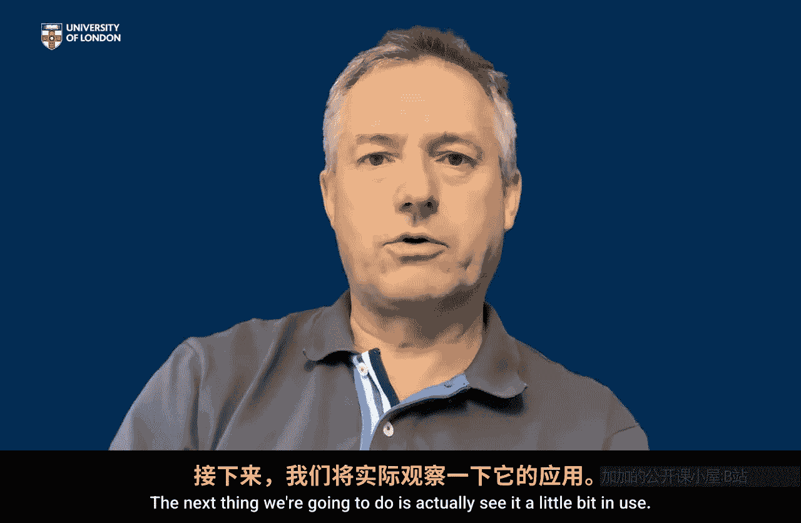

# 伦敦大学【中英⚡应用密码学入门｜Introduction to Applied Cryptography】 p06 P6 06_第一周总结 -BV1dnbKzPE9R_p6-

So we've discussed why we need cryptography in the first place and we've seen that cryptography is really implements in a digital way some of the security services that we we can associate with the physical world。

 it's not a perfect match but it's helpful to think of security in the physical world because there are analogies in cryptography provides the tools for digital security。

 and importantly we introduced a number of security services。

 atomic security services that we will want， cryptographic tools for。Obviously confidentiality。

 the one you probably were most aware of before you studied this course， data integrity。

 data origin authentication， nonreudiation， entity authentication they're the main ones we've focused on we've mentioned the cryptographic tools that can be used to provide these services and we've talked a little bit about how these different services interrelight。

And one last thing I want to emphasize here is cryptography is far more powerful than this。

 okay there are many more sophisticated things that cryptographic tools can be designed to do。

 but we're on a four weekek introductory course， we're going to stick to these services that we've mentioned already because they are probably the most important。

 they're the most fundamental。😊，And as we proceed through the remaining weeks of the course。

 these are the ones we're going to be referencing and thinking about。

So I hope you now have a pretty good idea what the cryptographic tool can be used for。

 the next thing we're going to do is actually see it a little bit in use。

