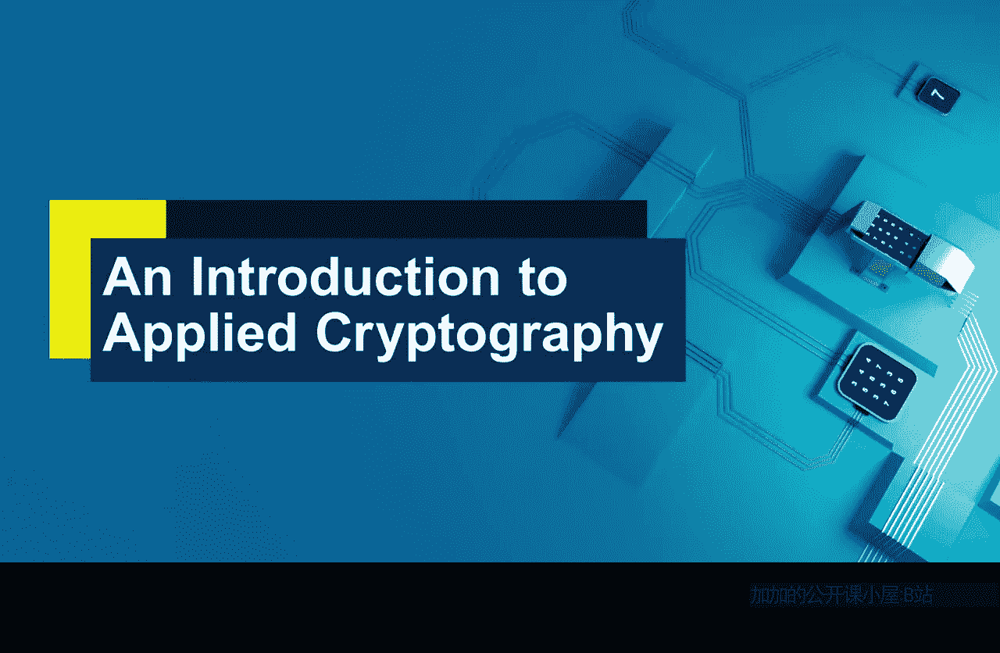
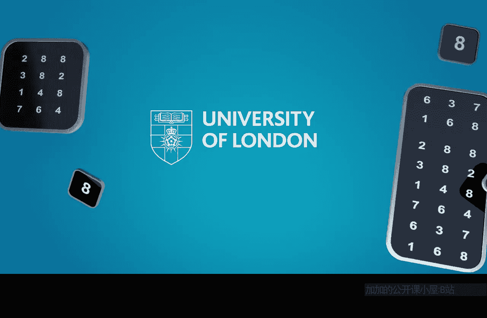

# 伦敦大学【中英⚡应用密码学入门｜Introduction to Applied Cryptography】 p07 P7 01_密码学应用导论 -BV1dnbKzPE9R_p7-

🎼So I hope you ended week one comfortably gripping that cryptographic toolkit and feeling that you have a set of tools that you've been introduced to that we can perhaps use to secure real applications Now one of the things I want to really emphasize is how fundamental cryptography is to securing digital applications that we use every day。

And so the major task for this week is going to be to familiarize yourself with some of the most common digital applications that we do use and then begin to understand how cryptography supports them and we'll stick to six main applications I'm going to call these the big six not not because they're bigger or more important than anything else but because they're a little bit different and they provide us with a good illustration of。

Things that we use that need digital security。And the the biggest task for the week really is going to be to get to the point where we can consider the properties of a particular application and decide which security services。

It needs in order to make it secure and by doing so we'll be flagging and indicating the types of cryptographic tool we're going to need to make it secure。

And the last thing we'll do this week is look at a case study and the case study we're going to look at is one of our big six which is mobile call protection。

 so the target for this week really is take to start thinking about a real application。

 a digital application that's out there and think about what is precise security needs might be in terms of those services that motivate the tools in our cryptographic toolkit so that we can begin to appreciate which cryptographic tools are likely to be needed to secure which types of application。

🎼。

