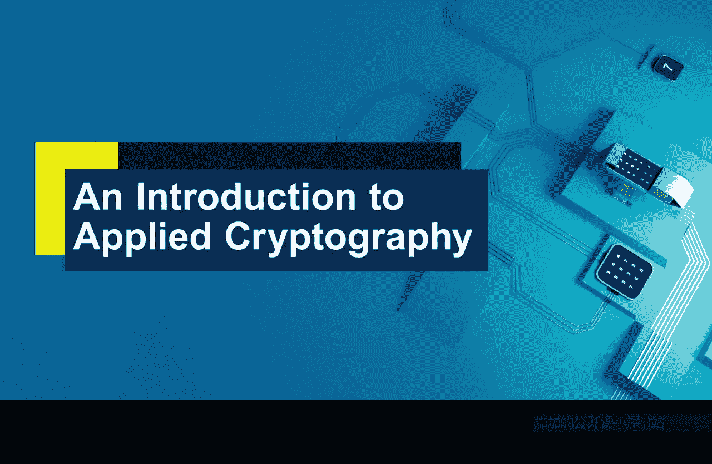
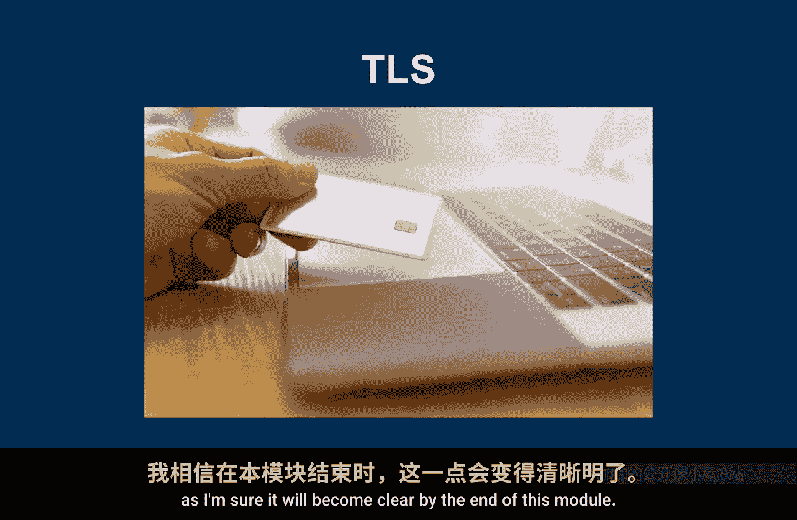
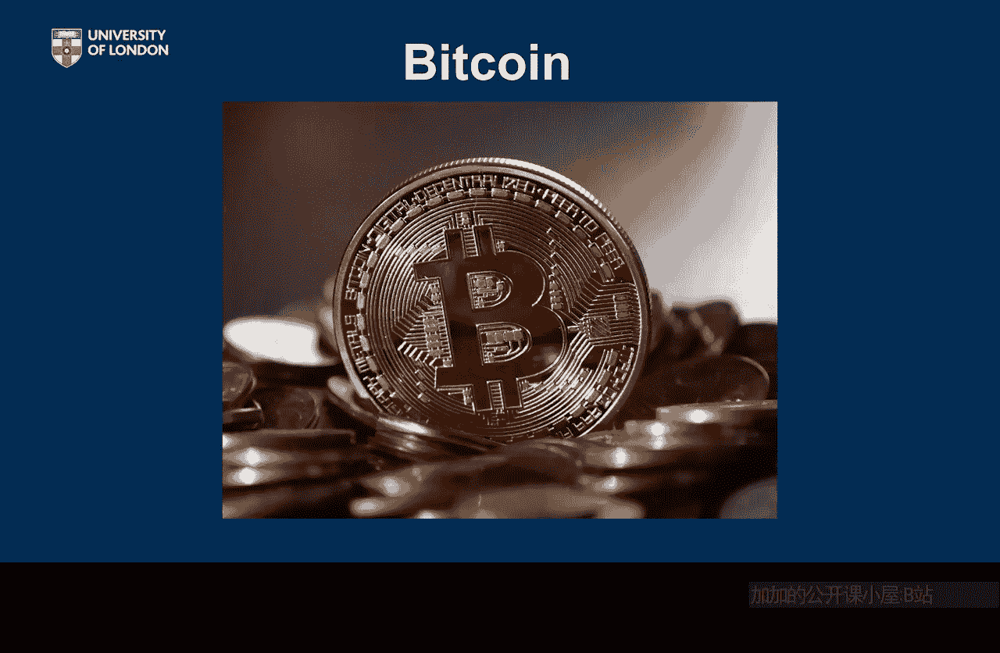

# 伦敦大学【中英⚡应用密码学入门｜Introduction to Applied Cryptography】 p08 P8 02_六大技术导论 -BV1dnbKzPE9R_p8-

What I want to do now is introduce to you the big six applications of cryptography。For this module。

Now calling on the big six is really just a piece of fun。I mean。

 they're not bigger than anything else。 What would big mean？

Neither are they perhaps the most important uses of cryptography， what would that mean？

They've been chosen because they all have different features and different properties and in different ways help to illustrate points as we go through the various weeks of this module。

So it's important that you。Appreciate them， you understand these applications。

 you familiarize yourself with them and you're going to be hearing a lot more about them as we go through the module。

The first of our big six applications is Wifi。And there's quite a good chance this is an application of cry you're using right now。

So Wiifi is obviously。Wireless connection， and particularly we are going to be thinking about。

Home environments， even though wfi is often used in other environments such as corporate environments。

 where sometimes the implementation is slightly different。

 so let's stick to thinking about the wfi in your home as our。Basic reference here。

Now there's quite a checkered history of cryptographic use in Wifi。

 the first standards for Wifi or the very first one web。

Was not particularly good and quite a lot of problems， in fact。

 it was quite poorly cryptographically designed。But gradually over time。

The cryptographic security of Wifi has been getting better， so we've seen standards WPA。

WPA2 and the most recent one is WPA3。So this is our first reference case study。

 think about the wfi in your home。That is number one of our big six。

The second of our big six concerns mobile， phone security。

This is an extremely important security application because。

This represents really the first time cryptography。Became a consumer thing。

It wass the first time cryptography went into people's pockets， ordinary people's pockets。

And so it's an important application from that perspective。Now when phones。

 mobile phones first came out， they just made phone calls。That really is the focus of our security。

 obviously a modern mobile phone does many， many more things than that and it would take us a long long time to go through all the different cryptographic aspects of our modern phone。

😊，So we're going to focus on the cryptography used to protect mobile calls if you still make them。

 when you actually call somebody what security do you need and how does cryptography protect mobile calls？

Now， again， there are lots of standards governing this and this they represent。Also。

 iterations in foreign technology itself。The very earliest security standards in this area were known as GSM。

Moved on to 3G。Move on to 4G LTE， and of course now we're moving on to 5G and no doubt this procession will continue。

Nonetheless， the security needs of a mobile phone call itself。Probably haven't changed that much。

 And so that's something we're going to be thinking about。When we look at mobile call security。

 the second of our big size。The third of our big six is transportport layer security TlS now this is my absolute favorite because it has almost everything almost illustrates everything we want to talk about on this module。

So TLS was formerly known as SL， but TLS is the official name now， it's an internet standard。

And you're probably most familiar with TlS when you're doing secure browsing。

 so when you connect your web browser to our web server somewhere over the internet。And use of HtTPS。

Connection， maybe you get a little padlock in your browser or some security icon comes on。

That means you're using a cryptographically protected link Now it is important to realize TLS is not just about web browsing。

 you can use TlS to secure all sorts of devices in all sorts of different settings。

But I think it will help if every time we see it TlS。

You think about a secure secure browsing session， so your web browser is connecting to your web server or somewhere and you're wanting security of that connection。

So as I said， very important application。Ubiquitously used。

 you may well be using this one now as well， and it's good to illustrate everything which is why I love TLS as I'm sure it will come clear by the end of this module。

Our fourth of the big six， I'm going to call the E entry systems because in my mind I'm thinking of that experience when you press a button on some。

Tiny device in your hand and magically your car door opens。Now in a way。

 this is not really about cars and car doors because this application could be a house or or it could be anything that's just accessing anything else very simply。

 but let's think about the euc systems and the。Because I think it's a good example of a genre of cryptographic applications。

 which are designed to do something fairly straightforward that is give you access to something。😊。

So that's the fourth of our big sixvehicular entry systems。The fifth of our big sixs。

 I'm going to call secure email。Now I've got to be a little bit careful here because there are different ways you can access email。

 you can access it on a phone， you can access it from a browser if you're accessing webmail now if you're doing that you're really using the third of our big6 TlS。

So when I say secure email， I'm really imagining a dedicated email client running on your computer whose only job is to serve up your email。

There are various products out there there are some standards around as well， such as S Min。

 for example。Which provides cryptographic standards for securing email。

 but it's notable there are different ways that this could be done。

I'm also aware some of you may not have security on your email at all。

 now you are cybersecurity master students。Maybe you should。But if you're in a corporate environment。

 you may find this such that your clients have mandatory security provided。

So when I say secure email， I'm thinking of a dedicated application running on your computer。

For email handling that offers security facilities and sometimes they're optional or sometimes they're made mandatory by whoever is governing the system。

So that is the fifth of our P six secure email。

The last of our big setss。 and surely the most fun。Is Bitcoin。

And Bitcoin is wonderful for us because it is an entirely cryptographic construct， I mean。

 with no cryptography out there there would be no Bitcoin， it's built entirely from cryptography。😊。

And Bitcoin is an example of a cryptocurency， now there are hundreds。

 probably thousands of cryptocurrencies out there。But Bitcoin is by far the most famous。🤢。

It was really the first。And also， most of the others are built on the back of Bitcoin or have very similar properties to Bitcoin。

 maybe added a few features or maybe work in slightly different ways， so let's stick with Bitcoin。

It's a wonderful thing because it's entirely cryptographic。

And that's why we've chosen it as the sixth。Of our big6。

。