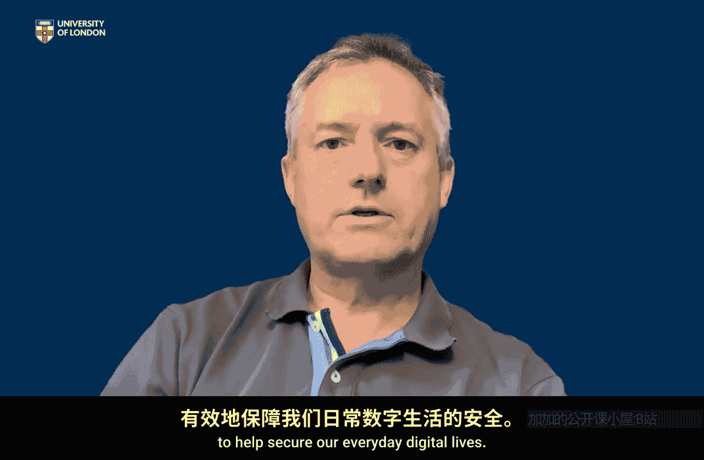

# 伦敦大学【中英⚡应用密码学入门｜Introduction to Applied Cryptography】 p10 P10 03_第二周总结 -BV1dnbKzPE9R_p10-

🎼So there are two things I hope you've got from our investigations in week two。Firstly。

 that you've got a number of case studies that you can look at with certainly looked at six applications that use cryptography and then we've looked at one in a bit more detail。

 but you have these six applications that you can use as sort of benchmarks and that you can reason and think about what security services。

 and therefore cryptographic tools， these six applications need。

But I also hope that way of thinking has maybe helped you reason about applications we've not talked about so if you come across another use of cryptography。

 something else you're using cryptography for， you can now begin to use our language of security services to reason about the type of cryptography you would expect that application to use。

And then of course， if you are actually now able to study or read a white paper。

 let's say that talks about cryptography being used in some application。

 you can scan that through and go that makes sense， yes。

 that's obviously public key encryption makes a lot of sense for that application or oh yes。

 that looks like it's very important data integrity is the most important thing for this kind of application and that you're not surprised by that。

It's just beginning to get you to help match real needs of digital applications in the real world with the language of our cryptographic toolki that has really been the purpose of a week two。

 and so I hope you're beginning to see that this cryptographic toolkit really can be useful to help secure our everyday digital lives。

🎼。