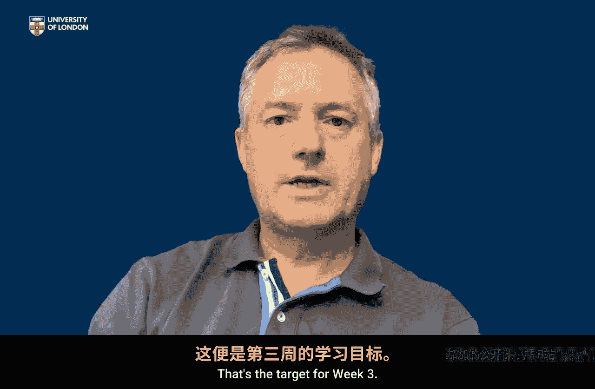

# 伦敦大学【中英⚡应用密码学入门｜Introduction to Applied Cryptography】 p11 P11 01_密码系统导论 -BV1dnbKzPE9R_p11-

🎼Week threes focus is really going to be on this idea of crypto systems and we're going to introduce an abstract model of a crypto system in order to really convey two very important things。

The first one is going to be the fundamentally different role that algorithms and keys play in cryptography。

 so cryptography relies on algorithms such as advanced encryption standard and you will have heard people talking about keys all the time I mean cryptographic keys are the ultimate things on which cryptography is security。

Relies so by looking at an abstract model or a crypto system we're going to tease apart the different roles of algorithms and keys and that is a crucially important point which will help you really make sense of a lot of the problems that we wrestle with when we're trying to actually make cryptography work in real systems so that's one of the things we're going to try and get from this model but we're also going to use that basic model of a cryptto system。

To also identify that there are two fundamentally different types of cryptography itself。

 there's symmetric cryptography。And asymmetric or public key cryptography。

So the model will help us understand what the differences between these two types of cryptography are。

In turn， we'll then be able to look at what are the implications of these different types of cryptography。

And we will see in fact， that a lot of this has to do with management of keys themselves。

 there are fundamentally different implications if you're using symmetric cryptography versus asymmetric or public key cryptography。

And then we'll look at actually how often these two types of cryptography are used together to support systems。

 so applications， so that's really our purpose we're going to pose a model。

 tease apart the different role of algorithms and keys and then think about the differences between symmetric and public key cryptography and how these might be used together to mutual advantage that's the target for week three。

