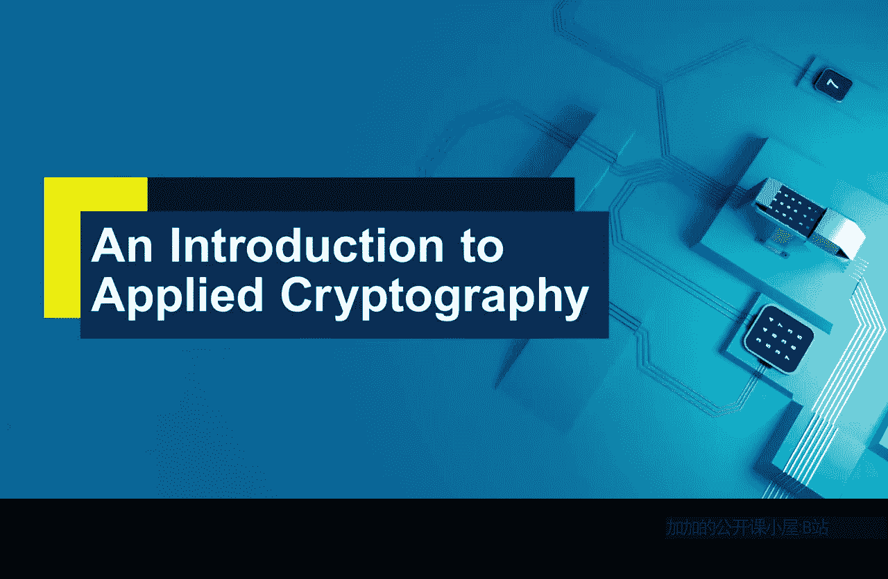
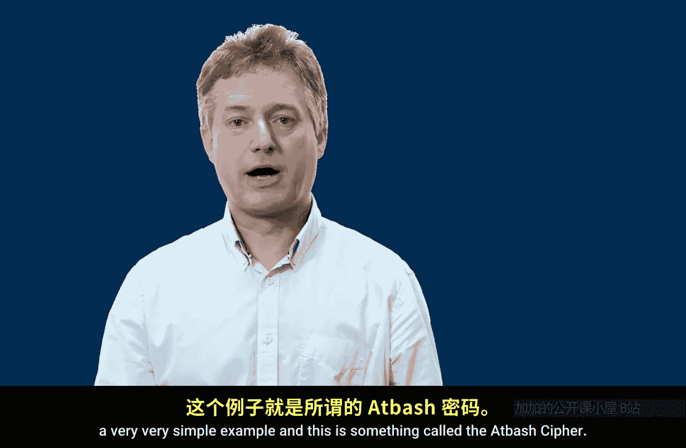
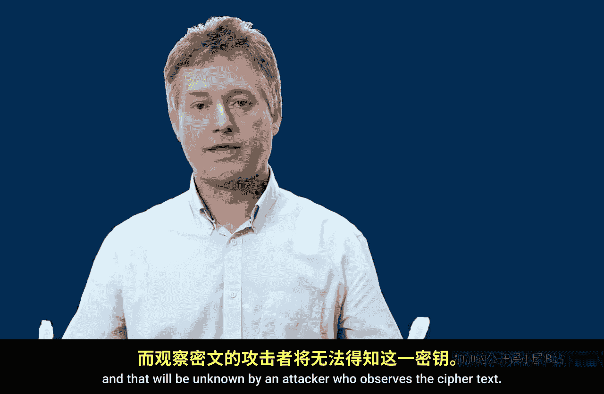
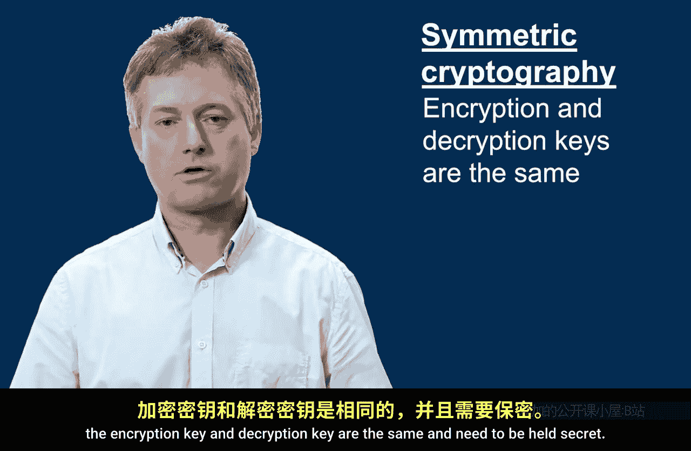
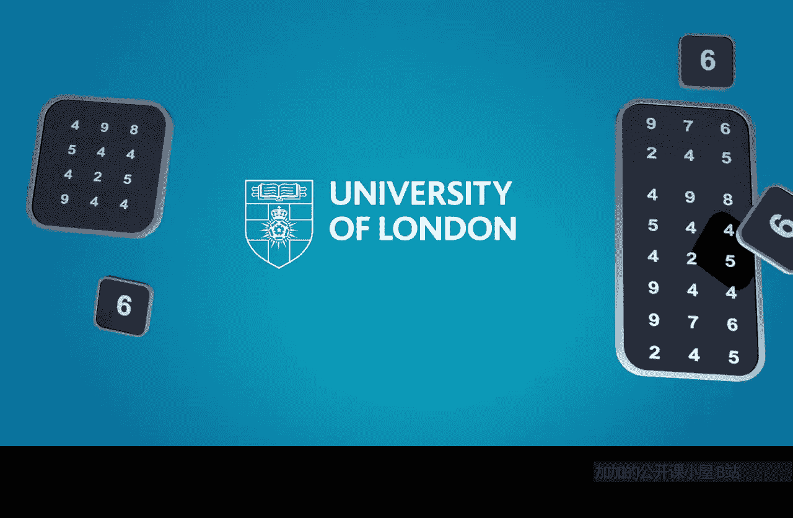

# 伦敦大学【中英⚡应用密码学入门｜Introduction to Applied Cryptography】 p12 P12 03_算法与密钥 -BV1dnbKzPE9R_p12-

So in lesson two， we saw that cryptography is essentially a toolkit for providing different types of security services for digital information。

So in this lesson， we are going to focus on one of these confidentiality。

 and particularly the security mechanism encryption。

 And we are going to look at a critical difference between the notion of a cryptographic algorithm and a cryptographic key。

So at the end of this lesson， you should be able to explain the difference between a cryptographic algorithm and a cryptographic key。

And also， you should be able to identify two different types of cryptography that arise as a result。

 It might be helpful throughout our discussion to imagine the physical security analogy of encryption。

 which which could be。W to taking some written information on a piece of paper。

 placing it in a box and locking that box with a key。

 And that's actually quite a helpful analogy for what we were about to describe。

 So let's consider some basic terminology now。So plain text is going to represent the information we're trying to protect。

We're going to convert that。To make it confidential into something called Cypher textext。

 which is going to be unreadable， it's not going to make any sense。

We're going to allow an attacker to observe Cypher textext as it's sent across a communication channel。

 and hopefully they will learn nothing about the plain text as a result。

 the person we're sending the data to。Hopefully we'll be able to somehow get the plain text back from the cipher text。

 so that's the challenge。Now， the means by which plain text is converted into cipher text will be by means of an encryption algorithm。

 and an algorithm is really just a recipe。 So it's a bunch of instructions that say scramble up the plain text in the following way is converted to cipher text。

And then the decryption algorithm， something known to the recipient。

 allows them to deconstruct that cipher text and recover the plain text from it。

 So this is best seen by means of an example， a very， very simple example。

 And this is something called the atbaash cipher。

So the at batch cipher is represented by a table， and there are blue letters on top。

 red letters underneath。And we just look up this table to convert our plain text message consisting of blue letters into a ciphert message consisting of red letters。

And the encryption algorithm in this case is very straightforward。

 It just says look up the table and replace the blue letter by the red letter。

 and the decryption algorithm is the reverse。 Let's look at an example。 So the plain text。

 top secret would just be converted into a cipher text， G， L， K， H V， X， I V。

 G by looking at that table。

And hopefully an attacker who observes GLK， HVX， IVG。

 sent across a communication channel will be able to make no sense of it at all。However。

 the recipient， knowing when using the appba cipher。

 can deconstruct the message from the same table and recover the plain text， top secret。

So the question is， do we really get confidentiality from use of this at bash cipher？Well， in fact。

 there are many reasons why the answer is no， the atbar cipher is not a very good way of scrambling data。

 Perhaps the most fundamental one， though， is that if you think about the way we want to use cryptography in modern technologies。

 it's important that everybody understands how security is provided。

 If we're going to go and tell somebody we're using the atbar cipher。 Then actually。

 we're revealing completely how data is scrambled。 because there's only one way in the atbar cipher of replacing letters by letters。

 The letter A is always replaced by Z。 The letter B is always replaced by y， etc cetera。

 Anyone knowing we're using the atbar cipher can immediately recover a message。

 The decryption algorithm is immediate。 So we need to basically do something a bit cleverer。

And if we go back to the model of encryption， what we need to do is introduce something into this model that changes and can change over time。

And that's the role of a key。 So once again， to convert plain text into cybert。

 we're going to feed the plain tax into an encryption algorithm， which is a recipe。

But that's also going to take an encryption key。As input and the Cypher textex that's produced will depend not just on the encryption algorithm。

 but also on the encryption key。 Likewise， the recipient will need a decryption algorithm to unscramble。

But they'll also need a decryption key。 and that's the thing that changes over time。Once again。

 this is probably best seen by an example。So again。

 we're going to use an encryption algorithm that's a lookup table。

 we're going to place letters in the top by letters underneath。

 but instead of having only one way of doing this， we're going to make it the case that the letters underneath can be represented in any number of different ways。

What's going to have to happen is the sender and receiver are going to have to agree how the encoding is done。

 the algorithm will still be a table， take the letter on top， replace it by the letter underneath。

 but the particular letter that's chosen，Will be the key。

 and that will be unknown by an attacker who observes the cybertax。

So for example， if we take the following table where a is replaced by D， B by I， C by Q， etc。

In that case， the message top secret is now replaced by the Cyphertext， PR JWT Q UTP。

But on the other hand， if we have a completely different key and replace A by N， B by R， C by A。

 then on this occasion， the plain text's top secret is converted into Cyphertext， X， V， J， B， K， A。

 D， K， X。And you can see that now there are many， many different ways in which we can replace the plain text by Cypher text。

 and they all depend on different keys， keys that the receiver has agreed with the sender before the encryption was used。

Now in general we're going to need lots and lots of keys and in fact that way of encrypting we've just discussed is sometimes called the simple substitution cipher and the question is how many different ways could we have scrambled that message top secret and the answer is 40。

000 times more than the number of stars in our universe。Which is a lot。

 So there is no way someone is going to chance on the correct key under this kind of system。

 if they just try them at random。Now that simple substitution cipher is fundamentally flawed in lots of different ways。

 which we'll not talk about。😊，What is important to realize is that modern encryption algorithms like the advanced encryption standard。

 which is in many of the technologies we use every day， doesn't have these kinds of flaws。

It in itself is a recipe， a way of scrambling data。

 rather like just replace the plain text letter by the sapp text underneath it's much more complicated。

 but it scrambles data in a particular way according to a particular recipe。

 and it too takes in a key。And there are many， many more keys than even that simple substitution cipher。

 but it's fundamental to realize the difference between the recipe and the key and these are two critical features of any encryption process。

Now there are two very different types of encryption system。

 and this is something that's worth flagging right now。

 And if you go back and remember that an analogy for encryption is locking information away in a box。

It's actually helpful then to think about locks and keys for a moment because there are two types of locking mechanisms we use in the everyday physical world。

There are locks where we need the same key to lock a box and we need that key to unlock the box and we need the key on both parts of the process。

 but there are also keys like Palocks， for example。

 where anyone can lock the box just by snapping the Palock shut。

And only the person who holds the key can unlock the box。

And if we think about unlocking as being decryption。

 what this tells us is that in any encryption mechanism the decryption key will have to be a secret。

 it has to be something held only by the intended recipient of some information， but the locking key。

 the encryption key doesn't necessarily have to be a secret。

And this defines two types of cryptography。 So in symmetric encryption。

The encryption key and the decryption key are the same thing and therefore have to be secret。

 but in public key cryptography， rather like the padlock analogy。

The encryption key can be a piece of public information so anyone can encrypt something。

And only the decryption key needs to be a secret。 We'll come back to the importance of that in a later lesson。

 but it is important at this stage to realize these two very different types of cryptography exist。

So in summary， encryption algorithms are recipes， theyre ways of scrambling data。

 and keys play a critical role because keys allow the data to be scrambled in different ways。

 many different ways， more ways than there are stars in the universe hopefully。

 and there are two very different types of cryptography。In symmetric cryptography。

 the encryption key and decryption key are the same and need to be held secret。

Whereas in public key cryptography， the encryption key can be something everybody knows。

 and only the decryption key needs to be held secret。

