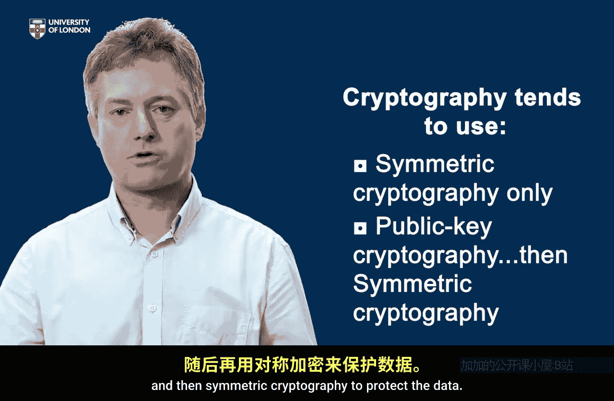
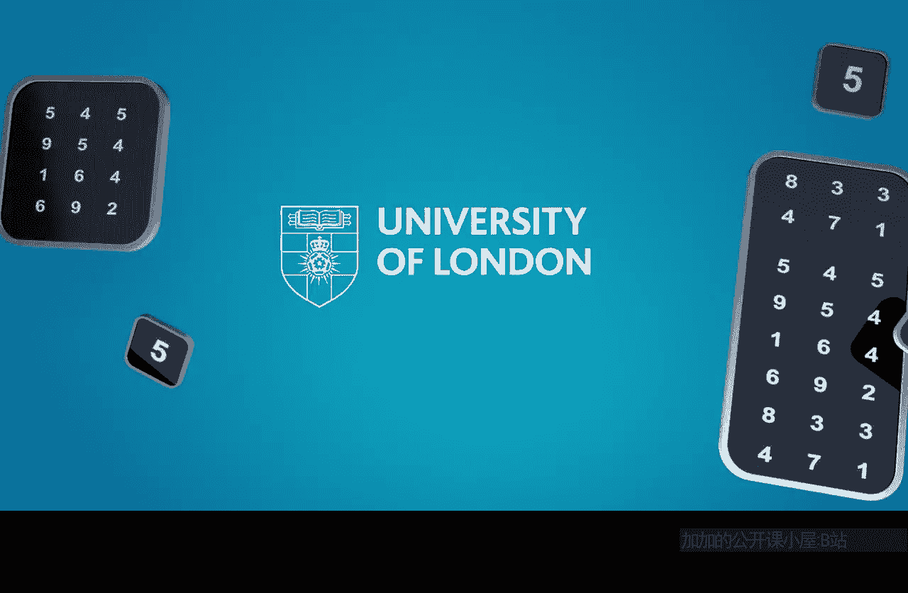

# 伦敦大学【中英⚡应用密码学入门｜Introduction to Applied Cryptography】 p13 P13 02_不同类型密码系统的应用方式 -BV1dnbKzPE9R_p13-

🎼So in lesson five， we're going to look at how cryptography is used in real applications。And again。

 we're going to focus on encryption。 We're really going to focus on how encryption is used。

And at the end of this lesson， you'll be able to recognize different factors which determine when we use symmetric or public key cryptography。

And you'll be able to compare the cryptography used in several everyday applications。

So let's begin by recapping there are two different types of encryption out there that with symmetric cryptography and public key cryptography and remember the difference in symmetric cryptography you need the same key。

 the same secret key to encrypt and decrypt and in public key cryptography。

 anyone can encrypt and only the recipient can decrypt Now in fact if you think about it。

 one of the big problems we got is how are people going to get the keys that they actually need to use in a particular application Now for symmetric cryptography。

 the sender and receiver of any data are going to have to agree in advance on a secret that secret is going to be the key。

Whereas in public key cryptography， the encryption key can be obtained from anywhere as a public knowledge and only the decryption key needs to be kept secret。

😊，So on the face of things， it looks like public key cryptography is surely going to be much better。

 it's going to be much easier because arranging to get the keys to the right places in the system is surely going to be an easier problem。

And broadly speaking， it is。But nothing in life comes for free。 and there's a catch。

 And the catch is that public key cryptography is much。

 much slower than symmetric key cryptography to conduct on a machine。

Symsymmetric cryptography is generally very， very fast。Public keyyptography involves little delays。

 It involves hard computational work for a computer to do。 So it's slow。And in fact。

 despite the advantages of key management for public key cryptography。Then in general。

 we don't want to use it unless we have to。 And any application of cryptography will really try and be as symmetric as it can。

So let's have a look at a few everyday applications that use symmetric cryptography and remember the problem is that we've got to arrange somehow for a key to be present between the sender and the receiver before we actually encrypt anything。

 but there are lots of applications where this is actually fairly straightforward。

So the first one is your mobile phone。So on your mobile phone。There's a chip card。

 And on that chip card is a key。 On the other hand。

 the only person who needs to know this is the mobile operator you have dealings with。

They also need to know that key， how on earth to be arranged for the same key to be on the chip card in your phone and be known by the mobile operator。

Well， it's straightforward because a mobile operator is the one who arranges for the key to be on the chip card on your phone。

 So before you actually get your phone and before you get your Sim card。

 that Sim card has been connected to the mobile operator and they've arranged for the right key to be put in place。

If you like the key was established before you even got your hands on the device， so in this case。

 key establishment arranging for the same key to be on the SIim card as with the mobile company was fairly straightforward。

And the same is true of your bank card。 There's a chip on your bank card on that chip is a key。

 The bank needs to know the key。How did that happen？ Well， you got your card from the bank。

 didn't you。So the key was pre established， if you like， on the card before you actually got it。

 So again， key establish into straightforward。Sosymmetric cryptography therefore， can be used。

And let's think of one more application， which uses symmetric cryptography。

 your Wifi network at home。How on earth do be arranged for a key to be distributed in such a way that all the devices in your home can use your Wifi network？

Well， the answer is probably that you did it。So on the router that is connected to your Wifi network。

 there's information that you probably coded in to all the devices that connect to that Wifi network。

 and that was you broadly speaking arranging for the same key to be known by all the devices in your home that connect your Wifi network。

So key establishment in this situation was also straightforward， and therefore。

 symmetric cryptography can be used to protect the traffic sent on all of these channels。

Now let's consider an application that is fundamentally different。

And that's when you buy something online from an online store or somewhere。Now， this case。

 once again， we want to encrypt traffic between your web browser。

 perhaps and the online store that you're wishing to purchase something from。

 What's fundamentally different about this environment。 Well， once again。

 we'd love to usesymmetric cryptography。 It would be terrific if you and the online store had already pre agreed a key。

But you haven't have you。It's not feasible to pre agree a secret with some online store somewhere around the world that you may never even have purchased anything from in the past。

So how do we get around this problem？And in fact， that's exactly the type of environment where public key cryptography is useful。

😊，So in this case， the online store can make available a public encryption key that you can use in order to at least start using cryptography to protect the communications。

Because this is a fundamentally different type of environment to the ones we looked at earlier。

So in this example of buying something from an online store。

 we're forced to use public key cryptography somehow。

But we also know that public key cryptography is rather slow。

 so can we get away with surgically using it just for what we need and not more than that and this is what happens and the protocol which is often used for buying things online is something called SSL TlS and it works in different ways I'm going to describe one now。

And this is a way of combining symmetric and public key cryptography to get the best of both worlds and the idea is really very straightforward。

Essentially， you want to use symmetric cryptography for the bulk data exchange。

 the information about your car details， what you're buying， all these details。

So we want to symmetrically encrypt that。The problem is that your browser and the online store have not pre agreed a key。

Or what they do is pre agree the key using public key cryptography。

So your web browser might generate a symmetric key。

Enrypt that using the public key of the online store， pass that across the online store。

It then recovers a decryptse to obtain that symmetric key。

And now that symmetric key is used to encrypt the bulk data traffic。And in this way。

 we've harnessed the best of both worlds。 We've used the wonderful properties of public key cryptography to encrypt a message。

When we never had exchanged any secrets in advance。But that message is actually a symmetric key。

And we now use that symmetric key to encrypt the bolt traffic。So in summary。

 we've looked at a number of everyday applications of cryptography。

 and we've seen that most of them use symmetric cryptography only。

🎼And some of them use public key cryptography for exchanging a symmetric key and then symmetric cryptography to protect the data。

