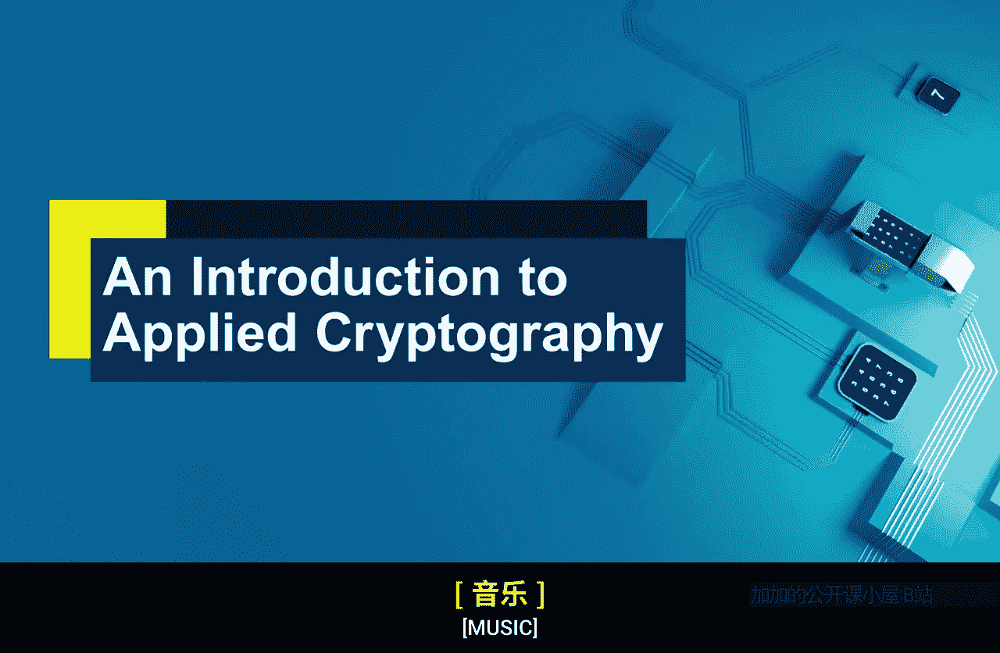
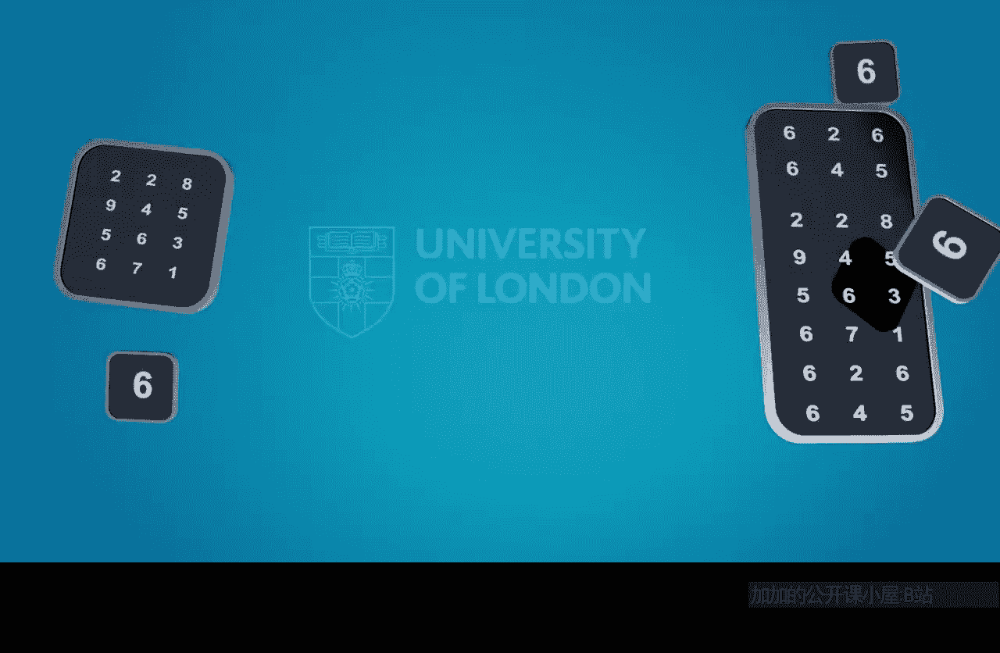

# 伦敦大学【中英⚡应用密码学入门｜Introduction to Applied Cryptography】 p15 P15 01_密码系统攻击方法导论 -BV1dnbKzPE9R_p15-

🎼As most people who work in any area of security know。

 by far the best way of assessing and reasoning about security or something is to look at how it might break。

That's why the last week of this course is going to look at how crypto systems themselves could be broken or where the weak points might lie in a crypto system。

This is going to require us to think holistically about the whole environment within which cryptography might be used。

But we'll be looking very precisely at algorithm security。

 we'll look a little bit about what it means even for a key to be secure。

 but we'll also be thinking about what about the wider layers around which cryptography has implemented。

 where are the weak points， where are the places where cryptography might not deliver the job it's supposed to do。

🎼And by doing that we're really isolating and making it clear when cryptography is most likely to work so it's not a negative thing thinking about where cryptography goes wrong。

 the entire goal is positive to by doing so to be able to reason about when we think cryptography is doing a good job plus it's always fun to think about how things break right so that is the target for week four we're going to look at week points in a cryptto system。

