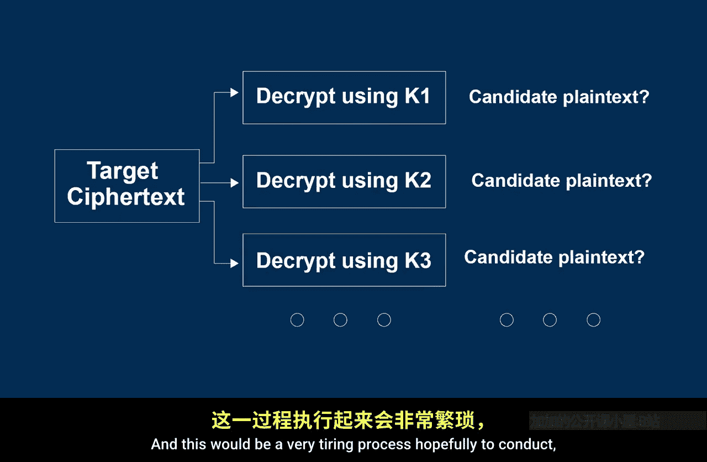
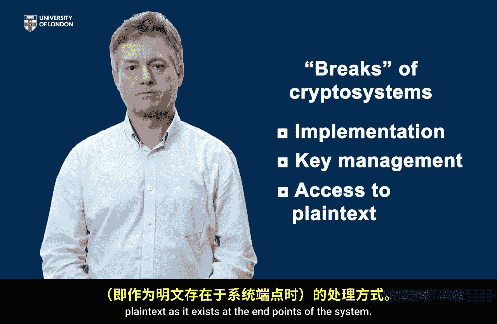

# 伦敦大学【中英⚡应用密码学入门｜Introduction to Applied Cryptography】 p16 P16 04_薄弱环节 -BV1dnbKzPE9R_p16-

🎼So in this lesson we're going to consider how cryptosytems could be broken。

 this might seem a strange thing to do but sometimes the best way of understanding something is understanding how it might not work。

So at the end of this lesson， you'll be able to appreciate that cryptographic algorithm is only one component of a wider crypto system。

And you'll be able to identify potential points of vulnerability in a crypto system。

 So let's start with that word crypto system， which is a new word we've introduced。

And it's important to realize that in the last lesson we talked about algorithms and keys。😊。

But in the real world， the algorithm is not going to exist in isolation。

A cryptographic algorithm is only one part of the wider system in which it is implemented。

So we can think of a crypto system as consisting of the algorithm。But also the way it's implemented。

 the implementation， the way it's embedded into the technology that we want to use that crypto systemem for。

But critically also， the way the keys are managed， keys play a very。

 very important role in cryptography， and they have to be looked after and integrated into a system。

 So the management of keys is a critical part of a crypto system。

 So there are two broad ways that we might break a crypto system in its widest sense。

And one would be somehow to access the decryption key， somehow get hold of the decryption key。

If you're able to do that， all ciphert produced using the matching encryption key will be recoverable。

 an alternative somehow to find a way of getting hold of plain text without that decryption key。

 and both of these， if either of these things happen， willll consider the crypto system broken。

So let's start with the first component of that crypto system， the algorithm itself。

 and in an alarming piece of news， an algorithm can always be broken。How is that Well。

 let's consider that an attacker observes a ciphert that has been scrambled and they recover the ciphert by listening into the channel on which it's sent。

 it doesn't make any sense to them。But they know the algorithm that was used， and that is normal。

 we normally know the algorithm that is used to produce ciphertext。So if they know the algorithm。

There's always the option of trying out every single possible decryption key that exists。

 Take the first decryption key， Try it， decrypt the Cyphertext， see if that makes sense。

 Take the second decryption key， decrypt the Cyphertext， see if that makes sense and continue。

And this would be a very tiring process hopefully to conduct。

 and that's why we call this an exhaustive key search。

 You're going to search the whole space of possible decryption keys。

So we've just seen that every encryption algorithm can be broken by this exhaustive key search。

 How would we stop this happening， Well， the answer is simple。

 Make sure there are so many decryption keys that this is just a waste of time for anyone to conduct。

 And that's exactly what happens。 in any encryption algorithm we use in a modern technology。

 There are so many possible keys。That it's just totally unrealistic on modern computers to search through all these keys and find it by accident。

 So in fact， we shouldn't really worry in modern cryptography about exhaustive key search。

 we're going to make that impossible to conduct in practice。

Now if we take real encryption algorithms used in real commercial products like the advanced encryption standard。

It's probably fair to assume， in fact， that the algorithm does not really have any weaknesses。

 Why is that， Well， most modern encryption algorithms are studied by experts。

 They are submitted to standardization panels。 Many people have looked at them。 Ana them。

 they cannot see any weaknesses。 And that doesn't mean they don't exist。

 but it means that the sort of expert belief is that there are no weaknesses。

 and it would be reasonable， therefore， to assume that in a modern technology normally。

There's a good encryption algorithm being used， and there are so many keys that attacking the crypto system by means of the algorithm is not realistic。

However， remember that it is a cryive system we might be attacking。

 and there are other points of weakness。 and one of these is implementation。

 That strong algorithm has got to be put onto a real technology。 And during implementation。

 many things can go wrong。 Someone might not follow the instructions。

 Things might not work as expected。 systemss might not integrate as well as we hoped。

And there are a number of subtle implementation attacks against modern encryption algorithms that include doing things like analyzing the power consumption as a device perform encryption。

 analyzing timing as it is a device performance encryption and seeing if that data itself allows you to learn information about the plain text and keys being operated on at that time so these really exist and these are called side channel attacks。

But perhaps an even more straightforward part of a crypto system to analyze is the key management。

AndThis is one of the weakest points in any crypto system because encryption keys and decryion keys have to be distributed around the system and looked after throughout the running of the system。

 these keys have to be created， they have to be generated。

They have to be established around the network in the right places where they are needed。

 They have to be stored securely on devices。And when their lifetime is over。

 they have to be destroyed。Sometimes they need to be changed。

And all of these phases are phases where in theory， at least。

A crypto system could be weak if any one of these stages is exploited。

There's one other part of a crypto system that's very vulnerable。

 and it's a somewhat obvious part of a crypto system， but it's one many people overlook。

And that's the end points。Think about buying something online， for example。

The plane text you want to protect here。Or typically your bank card details。

Normally we encrypt that traffic as it goes across the internet， it arrives at the online store。

 they decrypt these details。But the question is， what happens to the bank card details at either end？

Where are your bank card details？Have you put them into a file on your computer。

 Are they available to someone who's next to your computer and can see the current details？

And what happens to the bank card details after the online store decrypts them。

 what do they do with them？And sometimes we don't know。

And it's important to realize that these two endpoint where plain text exists both before it is encrypted and after it's decrypted。

 are vulnerable points of a crypto system that we have to focus on。So， in summary。Yes。

 encryption algorithms are very crucial components of cryptoyems。

 but in many ways they are the least likely part of a crypto system to be vulnerable。

The most common places we might expect to see weaknesses are the implementation。

The management of the keys。🎼And management of data when it's not encrypted。

 plain text as it exists at the endpoints of the system。

