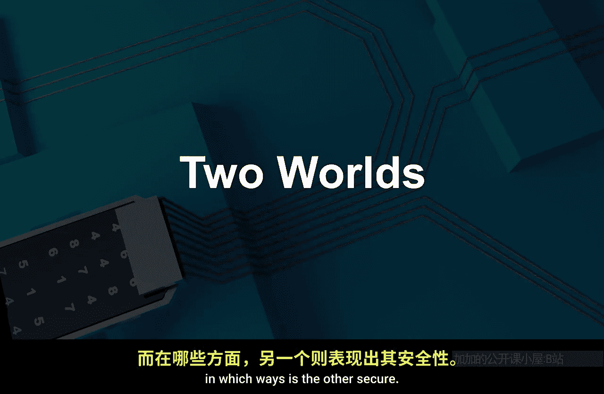
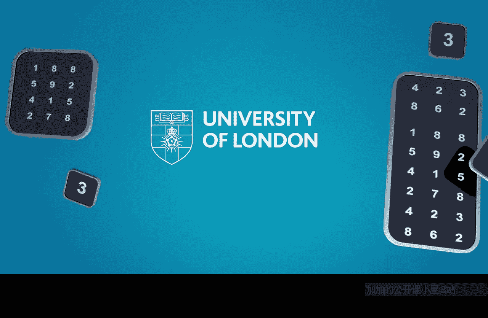

# 伦敦大学【中英⚡应用密码学入门｜Introduction to Applied Cryptography】 p17 P17 06_两个世界 -BV1dnbKzPE9R_p17-

🎼We've introduced this idea。Of a crypto system。😡，And I think this is a useful way of thinking about practical security of anything using cryptography。

 it's not just about the cryptography， the algorithms lyinging at the heart of this。😊。

There's a whole system surrounding it。The way it's implemented。The way the keys are managed。

And the people that are interacting with this wider system。

 so I really want to encourage you always to think about whether cryptography is doing its job by thinking systemically about that whole package。

So too。Round off our exploration of crypto systems and weaknesses in crypto systems really would like to go through our thought exercise with you。

And that thought exercise is maybe a bit artificial。

 but I think it's a constructive one where I'm going to ask you to consider two very different worlds。

Separated by time。And think about the security of the crypto systems that were in place in these two worlds。

🤢，And compare them and I suppose that's an artificial exercise because there are many ways in which you could compare them and there are lots of things to think about。

 but I think it's still useful because it gets you into this idea of thinking about systems。😊。

So I'm going to introduce these two worlds to you。And then simply ask you， overall。

In which ways would you regard the security of these worlds as comparing with one another。

 in which ways is one maybe secure in which ways is the other secure of one of the things it depends on。

 you know just have a big discussion about that。

So first we need to think about the two worlds， I'll introduce them to you now。

So World One is going to be set in the 1970s now I don't know if you were there， probably not。

 I was there， although I don't remember that much about the 1970s and I certainly wasn't using cryptography to my knowledge in the 1970s。

 in fact not many people were。So who was using cryptography in the 1970s well one group of people were banks or organizations were banks？

Banks started using cryptography commercially certainly in the 1970s， obviously only selectively。

 so so let's imagine。A situation where a high end transaction， let's say。

 is being authorized by a bank manager in New York。

And is being sent to a bank manager in London and obviously this's probably quite a high end transaction for cryptography perhaps to be playing a role in that process。

And I want you to think about the whole information flow。

From the point at which the bank manager in New York conceives of sending this transaction and to the point of which the information about that transaction goes into the head of the bank manager in London and from the very point at which the bank manager in New York conceives of the idea of sending this transaction。

I want you to think about where that information goes。ho。Perhaps his knowledge of it。

At what point you imagine encryption？playlays a role in protecting it and at what point encryption stops protecting it and think of the whole information flow as it moves over towards the bank manager。

In London， so imagine that whole journey of that information。

And think about the security of it throughout so things you might want to think about are， you know。

 one of the communication channels used on the various parts of that journey at what point might cryptographyy play a role。

How might that cryptography be applied？Where is the information when it's not encrypted。

 where is the information after it's decrypted？And just take a stand back from all of that and then consider how secure was that world。

 if you like now I think we're going to accept that perhaps cryptography was not being used routinely。

So that's why I've chosen a high entrance action so ass a special message if you like。

But just think overall about who might have had access to that information under what circumstances I mean how secure would you regard that whole thing。

 that whole that whole information flow from the head of the bank manager in New York to the head of the bank manager in London so that's your World one scenario。

World I is well today and lets pick up in a way the kind of setting we're familiar。

 I mean this is our image for TLS and that's exactly what I want you to think about a financial transaction this time。

 perhaps you sending a transaction to your bank perhaps over TLS or，Over the internet certainly。😊。

The same process， so go through that whole same process， think about。

 you know the point at which you decide， oh， I'm going to send some money to my bank。

For the point at which that thought enters your head， where does that information go？

Who is potentially party to that information over what channels does that information move at what point is that information encrypted at what point is that information decrypted。

 where does the information go after it's decrypted？And again， who might。

 which parties are involved in all of this， so again， do the same exercise。

But doing in the setting of today， you making an online transaction with Eurobank。

So I'm trying to get you to think about where information goes from the point it's in one human head until it gets to。

 in this case， probably not somebody's head so much as more likely to be a back end banking system。

But nonetheless， try to get you to imagine where flows and where the insecurities might lie and what role cryptography is playing in protecting it。

🤢，Quite a lot to think about there。😊，And then I want you to， having done that for these two worlds。

 step back a little bit and then consider。In what ways is one world more secure or less secure than the other。

 I mean broadly speaking？Was World I a safer， secure， tighter world in which to apply cryptography。

 or is World I secure， safer， tighter world to apply cryptography？

I think let's take the algorithms out of it so you can assume in World one they were using an algorithm encryption algorithm appropriate for the times KeyL appropriate for the times。

 similar let's assume your TLS settings are appropriate for the times using a good algorithm and keyL so let's take the algorithms and key L out of it。

 but think more systemically where is the information。Where are the vulnerabilities？

In what way do these two worlds compare and I'm not necessarily expecting you to emerge from this saying World two is more secure than World One or World one is more secure than World two。

 I mean I'm fine if you do have an argument for that make it。

But you might want more a nuanced argument， you know， in these ways World I seems secure。

 but in these ways World two seems secure， but if you have a strong view one way or the other。

 I think that's absolutely fine， make your argument。So that's going to be the exercise。

 I hope that's clear。Take the system wide view。

Compare these two worlds。

