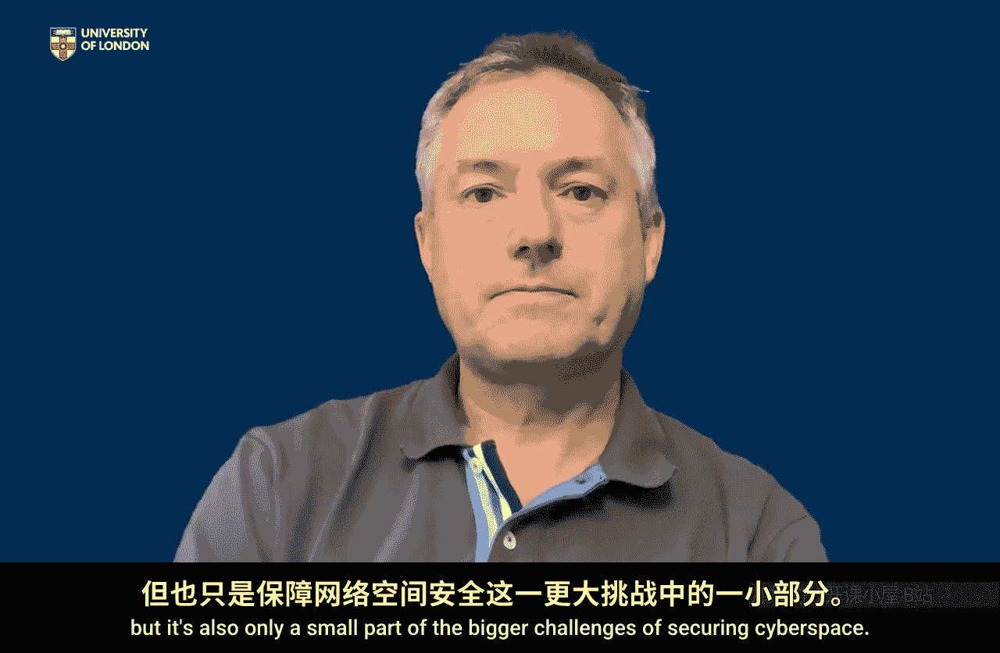

# 伦敦大学【中英⚡应用密码学入门｜Introduction to Applied Cryptography】 p18 P18 09_第四周总结 -BV1dnbKzPE9R_p18-

🎼The main takeaway from this fourth and final week。Is。To think holistically about crypto systems。

It's probably helpful in all forms of security， but I think particularly for cryptography。

 do not think of the cryptographic tools that we've talked about in previous weeks in isolation。

When we're evaluating what cryptography can do for us， we must think systemwide。

 so sure we think about the choice of algorithm， but we must also think about the way it's implemented。

 we must think about the keys on which cryptography crucially relies， you know where are these。

 how are they secured in the various parts and stages of their life cycle and we also just have to think about how cryptography fits in the bigger system in which it's being implemented。

You cannot walk away feeling that cryptography is doing its job without that wider look at where it fits in the bigger system。

And in fact， that also helps us to see the cryptography or maybe remind us rather than demonstrating that cryptography just plays one part in our wider cybersecurity。

 something that we've mentioned several times over the last few weeks。

It's a very important part of cybersecurity。But it's also only a small part of the bigger challenges of securing cyberspace。

