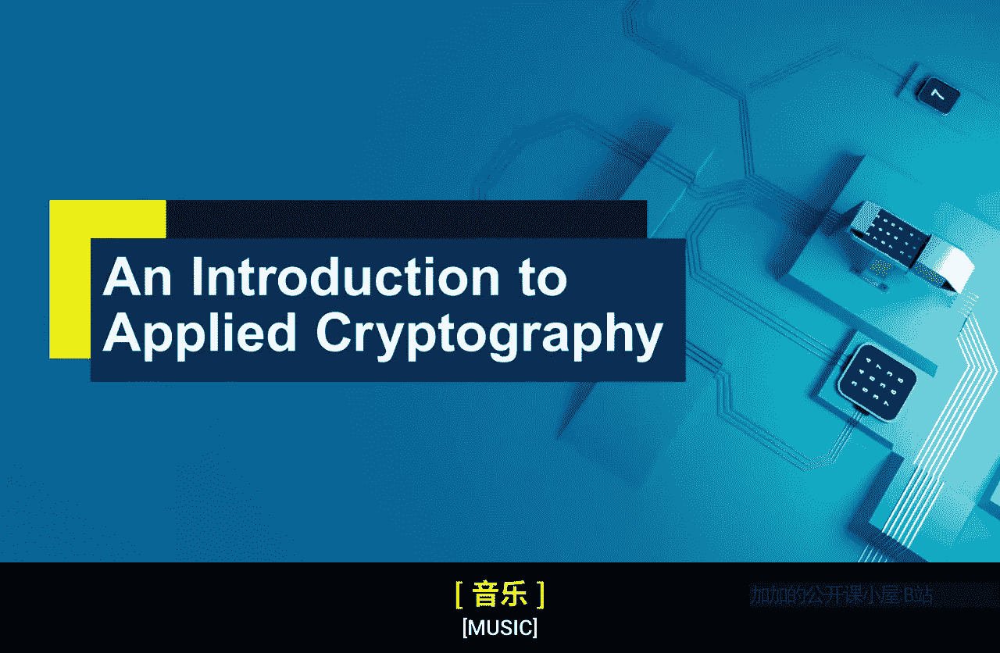
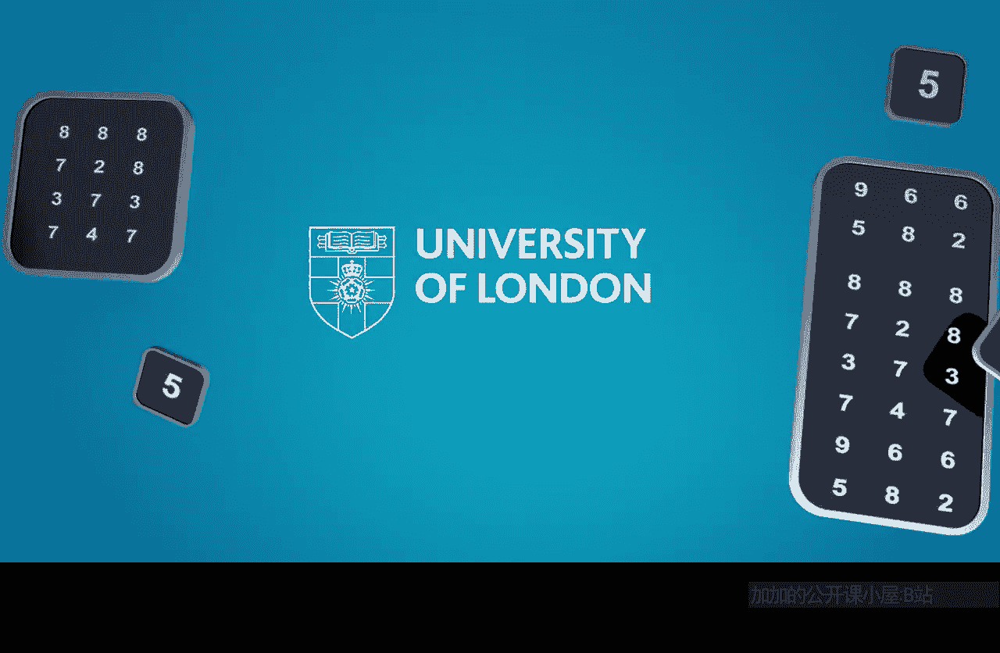

# 伦敦大学【中英⚡应用密码学入门｜Introduction to Applied Cryptography】 p19 P19 01_课程总结 -BV1dnbKzPE9R_p19-

🎼Well done， you've reached the end of the course an introduction to applied cryptography well done for hanging on in there and making it through the four weeks and I really hope that you got something from that。

Assuming you've been engaged and stayed with us， I hope you know are very familiar with what cryptography does。

You're familiar with the way we use cryptography to support the security of many of the things we use every day。

Many of the things we use in the digital world。I also hope you're feeling quite off with basic terminology。

 you can explain the role of keys， you know public key versus symmetric。

 you've just got a little bit of an armory， some of the core ideas of cryptography are familiar。

And I hope you are also able to。Understands。You know exactly what cryptography does。

 but what it doesn't do so so all the other things that we need to do to make things like mobile phones and wfi secure cryptography plays a massive role but on its own it's not to do very much so we need to do all these wider。

System systemstemwide aspects， but also you know human beings interacting with these technologies have got a role to play sometimes in making cryptography work。

 so I hope I've given you an appreciation of that and so you're feeling quite comfortable that you know what cryptography does and how it helps deliver a fundamental part of the cybersecurity of so much of what we do in the digital world。

So I really do hope you're now feeling a， that was a worthwhile four weeks and so the only other thing I want to talk about is what should you do if you want to know a little bit more because four weeks of cryptography is not much cryptography。

 right？The good news is because this is such a popular and fascinating subject。

 there are loads of places you can go， so there are lots of resources。

There are actually lots of books and particularly if you want to know the mathematical details。

 there are really a lot of resources out there， so I don't think you'll have any trouble finding information about cryptography if you start surfing around。

So what I want to shamelessly plug really is three things that I'm involved in that are not taking you down an extremely mathematical route。

 but allow you to take the ideas that we discussed on this course a little bit further and so you'll not be surprised to know that one of these is this book。

Hello。😊，Which we used to a certain extent in this course。And this is everyday cryptography。

 fundamental principles and applications， which is a textbook， really。

that I wrote and have revised a number of occasions to support the cryptography teaching we do here at Ra Holloway and as Panda has formed a core text on many of the modules that we teach。

And crucially， it also forms a core text on a module of a Coursera course that we have launched。

 which is called。Cybersecurity master's level， which is run through the University of London worldwide and run on the Coursera platform and if you really want to have a more in depth understanding of cryptography。

 then that module works very well but of course of cybersecurity more generally which is what that entire master's program is about。

You could regard the last four weeks as a little bit of a testr for that module and that module in itself is an important part of a master's in cybersecurity team run by the University worldwide。

 so that's obviously a shameless plug for a module that we've developed but also the course you've just been on gives you a strong flavor for that。

Now there's another book I also want to plug here which if you're not planning on doing a university course and you actually don't really want to go into too many more depths about cryptography but maybe want to read more widely about it。

 there' this little book that I'm going to hide behind as well hello。So this is cryptography。

 the key to digital security how it works and why it matters。

 which is a book I wrote and published with WW Norton a few years ago and that is what you call a popular science book。

 it's not a textbook。And that is really written for anyone and so if you were a newbie if you like to cryptography listening to this。

 of course， this book maybe continues that discussion a little bit。

 maybe in a less formal way in a more discursive way and talks about the role cryptography plays in cybersecurity but it's very much a genre popular science rather than academic text。

 so if you want to step back from question and answer discussion activity and just read a book about at a similar level to this。

This course so that would be an option for you as well， but if you just want to go forth。

 not follow our programs， not read my books， but just go out there and appreciate what cryptography does for you that I hope this course has whted your appetite a little bit and as I said there are plenty of resources out there and if you want to know a little bit more about cryptography。

So it's been a real pleasure introducing cryptography to you over the last four weeks。

 I hope you've got something from this and I hope you're going to be able to use that either in your personal lives or in your work lives。

 and I hope you are leaving this course， feeling not just informed but also feeling just a little bit more excited about the wider world because knowledge I think helps generate interest and excitement in our lives about anything and so now cryptography is part of your armory。

Thank you for taking part。

🎼。

