# GPU编程与架构：第1讲：课程介绍与CUDA入门


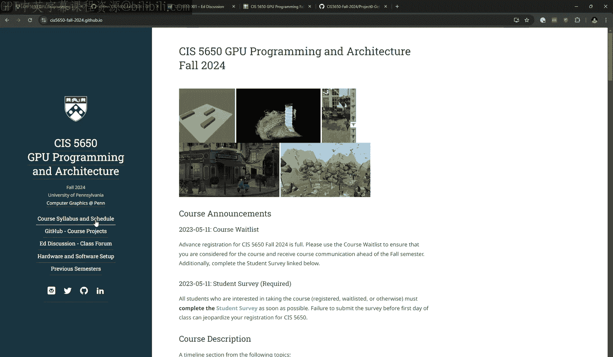

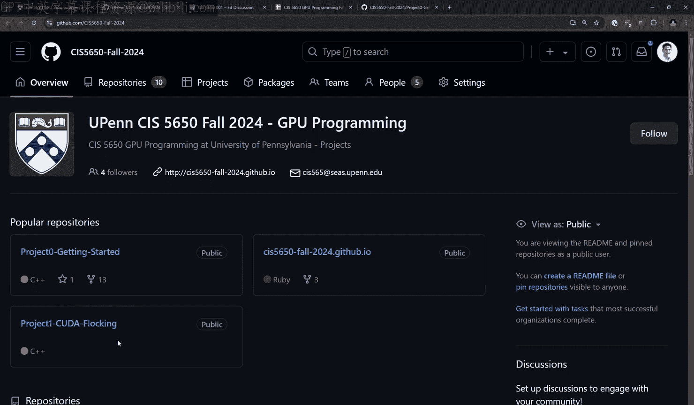

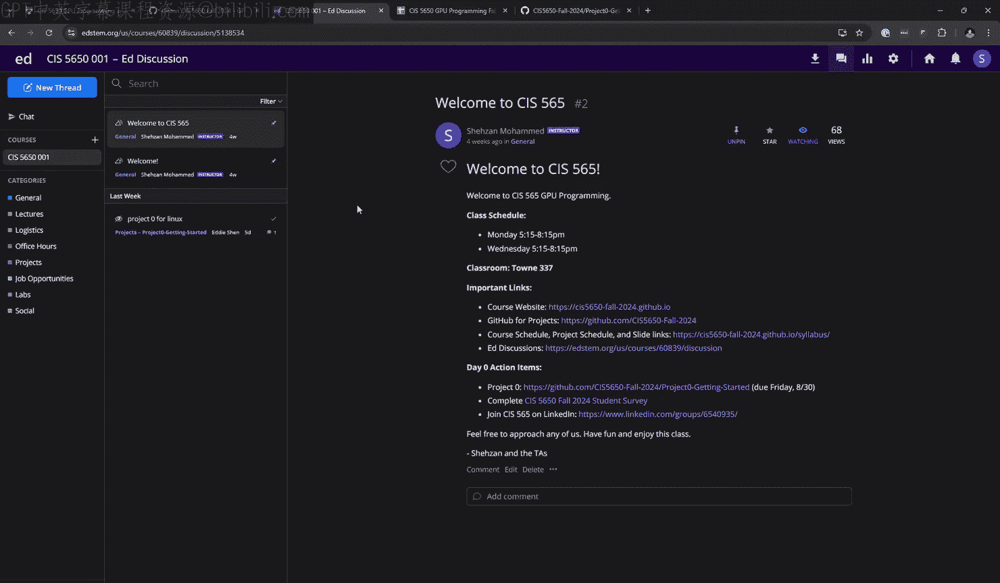

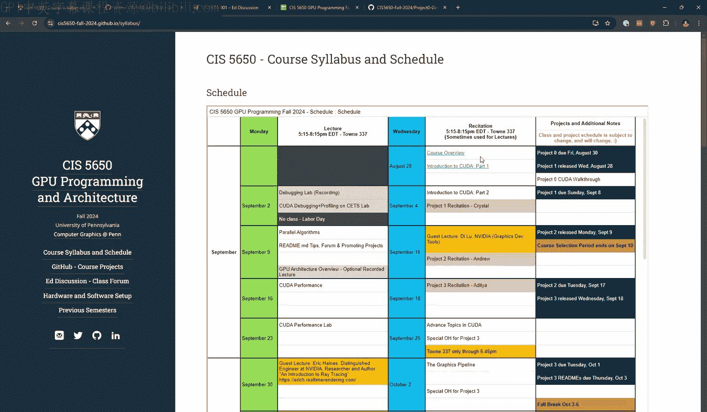

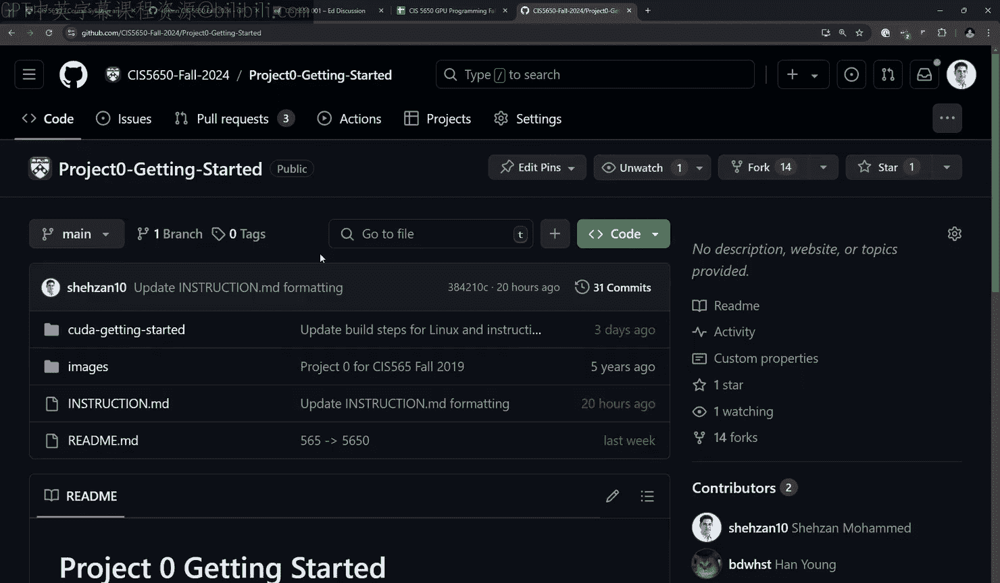

在本节课中，我们将学习宾夕法尼亚大学CIS 5650 GPU编程与架构课程的基本信息，并开始学习CUDA编程的基础知识。课程将涵盖课程结构、项目安排，并深入讲解CUDA的核心概念，包括线程、块、网格以及内存管理。

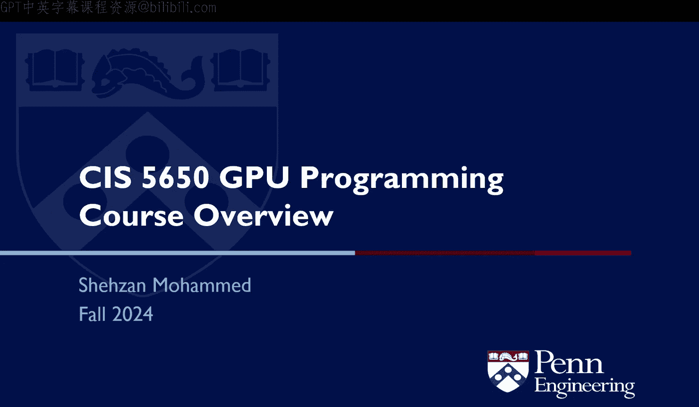

## 课程概述与后勤

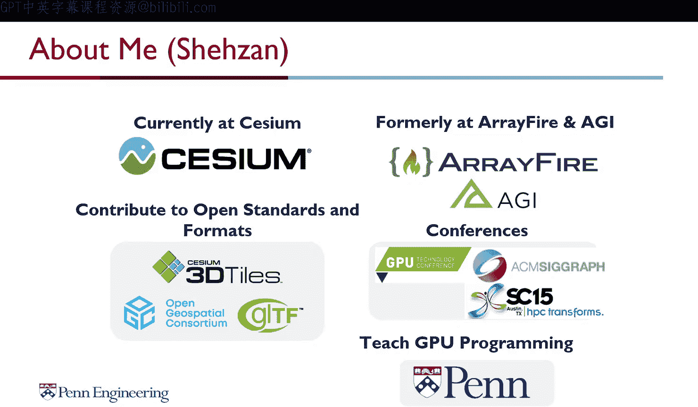


欢迎来到新学期的第一堂课。课程网站已上线，所有必要的链接和资源都已就位。

以下是课程相关的几个重要平台：
*   **课程网站**：所有课程资料、幻灯片和日程安排的主页。
*   **GitHub**：项目代码仓库。项目零和项目一已发布。
*   **Ed讨论区**：课程问答与讨论的主要论坛。
*   **Canvas**：用于课程注册和管理。

课程安排可在网站上的教学大纲和日程表中查看。每次课前，当天的幻灯片链接会提前发布。

项目零旨在测试你的软硬件环境，请务必完成以确保为后续课程做好准备。

如果有问题，请随时举手提问。在最初的几节课中，提问时请说出你的名字，以便我认识大家。

## 讲师与助教介绍

我是Shahzaan Muhammad，目前在一家名为Cesium的软件技术公司担任产品与工程副总裁，该公司专注于开放平台的地理空间软件。

我教授这门课程是因为我本人曾是这门课的学生，并且我的第一份工作就是编写GPU程序。我曾是AFire的主要贡献者之一，这是一个优秀的开源GPU计算库。

我不是博士，称呼我Shahzaan即可。我们的助教团队非常出色，包括Crystal、Han和Aya，他们都曾在知名公司实习，并将为课程项目带来更新。

这门课程非常注重协作。即使大部分项目是个人项目，我们也鼓励讨论问题和解决方案。最终项目将是2-3人的团队项目。

## 课程结构与资源

课程网站是我们的主要阵地，所有资源都是公开的。项目代码将托管在GitHub上，并且我们鼓励大家将项目保持公开，这有助于在求职时展示你的作品。

Ed讨论区将用于所有课程讨论。请积极使用它，分享对他人有帮助的问题和解答。在LinkedIn上，我们有一个校友群组，欢迎大家加入以建立职业联系。

课程讲座时间为周一和周三。考虑到三小时讲座时间较长，我们会在中途安排休息。办公室时间分布在一周的不同时段，地点在Levine 57实验室。我们会根据大家的反馈调整办公室时间。

课程本身会教授所需的大部分知识，但GPU编程领域广阔，我们也提供了额外的阅读资源列表供大家参考。

## 课程难度与先修要求

这门课程以项目为核心，我们的教学旨在支持大家完成这些项目。课程工作量较大，难度也较高，但这主要是因为GPU编程与你之前接触过的编程模式截然不同。

课程极具挑战性，但也极具回报。你的投入将直接决定你的收获。GPU编程非常有趣，因为其速度优势会让你乐在其中。

课程的主要先修要求是对计算机编程、性能优化或计算机图形学有热情，并且需要扎实的C/C++基础，因为会涉及大量的底层编程和指针操作。

目前课程注册已满，有大量学生在候补名单中。通常会有一些学生在了解课程难度后退出，请候补的同学关注注册系统。我们会尽力与学校协调，争取增加名额。

课程项目虽然基于图形学概念，但核心是性能和计算加速。如果你没有图形学背景，可以尝试“一个周末实现光线追踪”这个开源项目，它能帮助你判断自己是否喜欢这类工作。

## 课程价值与职业发展

往届学生发现这门课程在求职面试中极具价值。项目中的README文档、性能分析和调试经验正是面试官常问的问题。

在课程中，你将深入学习调试器和性能分析器的使用，这对于GPU编程至关重要。我们甚至邀请了在英伟达调试工具团队工作的往届校友来做客座讲座。

我们鼓励大家阅读论文后给作者发邮件，无论是致谢还是提问，作者通常都很乐意回复。

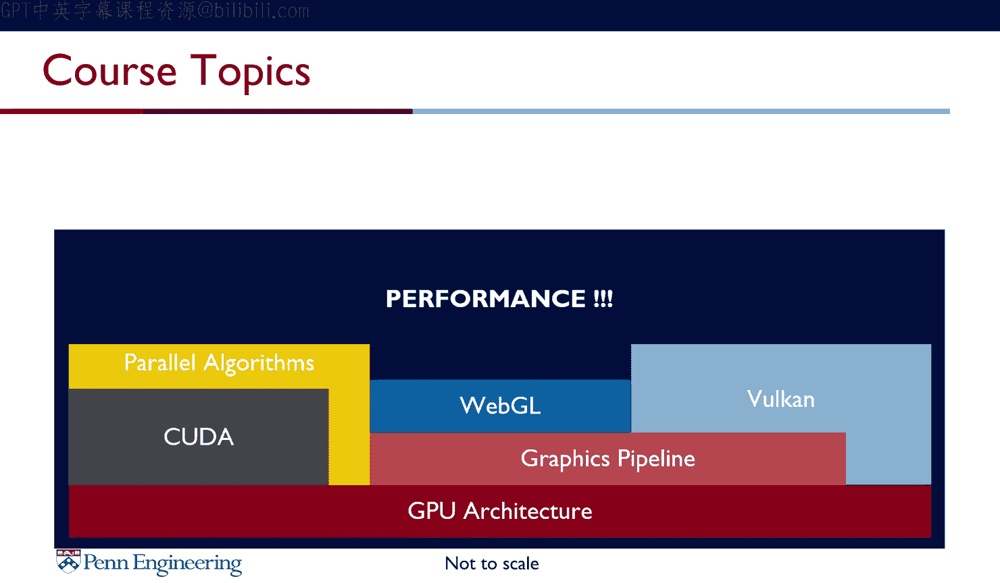

从这门课程毕业的学生，其简历上最突出的项目往往就是本课程的最终项目或合作项目。课程与业界联系紧密，许多公司都从这里招聘毕业生。

## 为什么需要GPU编程？

GPU最初是图形处理单元，但现在已广泛应用于需要大量计算和加速的领域。

GPU的性能优势显著。例如，最新的英特尔CPU峰值算力约为12.3 TeraFLOPS，而英伟达RTX 4090 GPU的算力约为82.5 TeraFLOPS，快了近7倍。并且，这种性能差距的趋势还在不断扩大。

除了纯性能，我们还需考虑成本、功耗和芯片面积等约束条件下的性能表现。

从芯片结构上看，CPU将大量晶体管用于控制逻辑和缓存，而GPU则将绝大部分晶体管用于计算核心。这门课程的核心就是教你如何充分利用GPU上成千上万个核心和巨大的内存带宽来获取最大计算能力。

GPU的应用场景非常广泛，包括计算机图形学、高性能计算、机器学习、人工智能、计算机辅助建模、仿真、数据挖掘、生物信息学等。掌握GPU编程将使你对众多行业都具有吸引力。

## 课程主题与客座讲座

课程的基础部分将重点讲解GPU架构和GPU编程，主要使用CUDA。我们将学习并行算法，了解如何将传统的CPU算法移植到GPU上并实现成千上万倍的加速。

我们还将介绍图形API如何用于GPU编程，例如WebGL。今年课程将引入更新的WebGPU API，其概念与CUDA更接近，更容易学习。助教Han将为大家介绍Vulkan。所有内容都围绕一个核心目标：如何获得极致性能。

我们安排了多场客座讲座，邀请业界专家分享最新技术，包括来自英伟达调试工具团队、谷歌Chrome GPU团队（正在推动WebGPU标准化）、以及三星的专家。客座讲座的出勤是强制性的，以示对演讲者的尊重。

## 评分与项目

课程评分主要基于项目。常规项目占60%，最终项目占40%。我们没有考试。

项目基于图形学概念，但产出是性能和加速。每个项目都包含编码部分和书面性能分析。我们鼓励大家创建精美的README文档，向潜在雇主清晰展示你的工作成果。

请积极展示你的作品，可以在社交媒体上分享。我们有时会在课堂上随机邀请同学展示项目，这旨在锻炼大家清晰表达项目亮点的能力。

项目通常截止于当晚11:59，通过GitHub提交Pull Request。本学期你有4个“迟交日”可以灵活使用，不会扣分。如果遇到特殊情况需要更多时间，请务必提前与我们沟通。

课堂参与占5%，旨在鼓励大家积极互动。提问不仅帮助自己，也帮助了其他可能害羞的同学。请尽量避免在Ed讨论区匿名提问，实名提问有助于建立互助的社区氛围。

## 学术诚信与学习建议

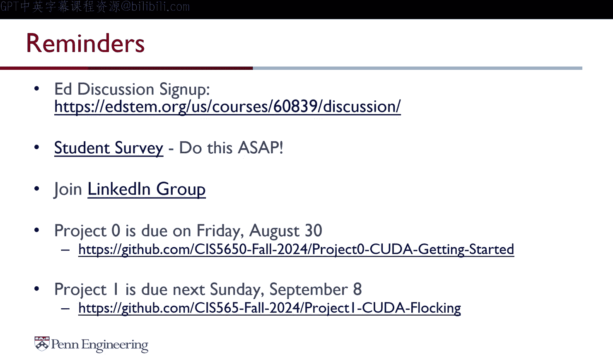

我们强烈鼓励开源协作和讨论，但严禁抄袭。抄袭对你自己的学习毫无益处，且我们将采取零容忍政策。

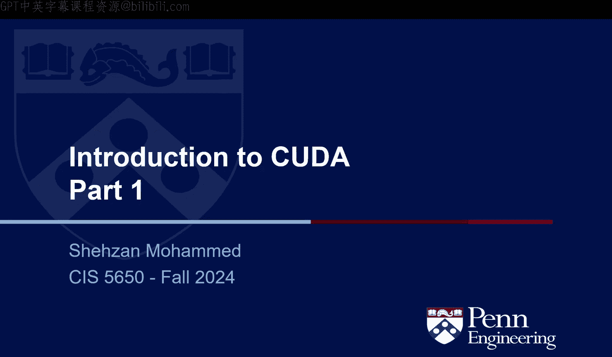

你可以与同学讨论问题、进行“橡皮鸭调试”，但请勿复制他人的核心代码。

关于AI工具的使用，建议将其作为辅助工具，用于处理你已掌握知识的琐碎工作或进行确认，而不是让其代替你完成核心学习内容，例如编写CUDA内核。

所有往届学生的代码都是公开的，这反而使得抄袭行为更容易被发现。课程的重点在于如何通过你的独特工作让自己脱颖而出。

## 课程总结与CUDA编程入门

在本节课中，我们一起学习了课程的基本框架、期望和CUDA编程的初步概念。请记住，你们每个人在接下来的三个月里都将完成超乎我想象的出色工作。我的角色是促进你们的学习，帮助你们实现职业目标。

**提醒事项**：
*   加入Ed讨论区。
*   完成学生调查以帮助我们改进教学。
*   加入LinkedIn校友群组。
*   项目零（环境配置）于本周五截止。
*   项目一于下周日截止，下周三的课程将专门讲解该项目。

---

## 为什么选择CUDA？

GPU编程的历史相对较短。90年代末到21世纪初出现了GPGPU概念。2007年，随着CUDA的发布，真正的通用GPU计算诞生了。受CUDA启发，出现了更跨厂商的OpenCL。此外，还有各种图形API，如WebGL、OpenGL、Vulkan，以及苹果的Metal。2023年，WebGPU开始被广泛讨论并将成为标准。

## CUDA程序的基本结构

一个典型的CPU程序顺序执行。而一个典型的CUDA程序则在主机上运行串行代码，并调用设备来并行执行大量任务。

**核心术语**：
*   **主机**：通常指CPU及其内存。
*   **设备**：通常指GPU及其内存。
*   **内核**：在设备上运行的函数，由大量并行线程执行。

CUDA程序的流程是：执行一些CPU工作 -> 调用GPU运行内核 -> 控制权返回CPU。

## 第一个CUDA内核：向量加法

这是一个简单的向量加法内核示例，将两个长度为 `n` 的数组 `a` 和 `b` 相加，结果存入数组 `c`。

```cpp
// 内核函数定义
__global__ void vectorAdd(const float* a, const float* b, float* c, int n) {
    // 计算当前线程的全局索引
    int i = blockIdx.x * blockDim.x + threadIdx.x;
    // 检查索引是否越界
    if (i < n) {
        c[i] = a[i] + b[i]; // 执行加法
    }
}

// 主机端调用内核
int main() {
    // ... 分配主机和设备内存，拷贝数据等 ...
    // 定义线程块大小和网格大小
    int threadsPerBlock = 256;
    int blocksPerGrid = (n + threadsPerBlock - 1) / threadsPerBlock;
    // 启动内核
    vectorAdd<<<blocksPerGrid, threadsPerBlock>>>(d_a, d_b, d_c, n);
    // ... 拷贝回结果，释放内存等 ...
}
```

**关键点**：
*   `__global__` 修饰符表示这是一个内核函数，从主机调用，在设备执行。
*   `<<<blocksPerGrid, threadsPerBlock>>>` 是内核启动语法，配置执行参数。
*   传统的 `for` 循环被并行线程取代。每个线程根据其唯一索引 `i` 处理一个数据元素，将算法复杂度从 O(n) 降至 O(1)。

## 函数执行空间说明符

CUDA使用特定的修饰符来定义函数的执行位置：
*   `__global__`：内核函数。在设备执行，从主机调用。必须返回 `void`。
*   `__device__`：设备函数。在设备执行，只能从设备调用（例如被内核调用）。
*   `__host__`：主机函数。在主机执行，从主机调用（默认）。
*   `__host__ __device__`：函数同时为主机和设备编译。

## 线程、块与网格的组织

这是CUDA编程模型的核心层级。

**线程**：最小的执行单元。
**线程块**：一组线程的集合。
*   可以组织成一维、二维或三维。
*   同一个内核中的所有线程块大小相同。
*   块内的线程可以通过共享内存通信和同步。
*   每个块最多包含1024个线程。
**网格**：一个内核启动的所有线程块的集合。
*   网格也可以是一维、二维或三维。

**内置变量**：
*   `threadIdx.x, .y, .z`：线程在块内的索引。
*   `blockIdx.x, .y, .z`：块在网格内的索引。
*   `blockDim.x, .y, .z`：线程块的维度（每个方向的线程数）。
*   `gridDim.x, .y, .z`：网格的维度（每个方向的块数）。

**索引计算**：为了让每个线程处理全局数组中的正确元素，需要计算全局唯一索引。对于一维情况，公式为：
`int globalId = blockIdx.x * blockDim.x + threadIdx.x;`

对于二维矩阵，假设每个线程处理一个矩阵元素 `(row, col)`：
```cpp
int row = blockIdx.y * blockDim.y + threadIdx.y;
int col = blockIdx.x * blockDim.x + threadIdx.x;
if (row < height && col < width) {
    // 计算一维内存索引（假设行优先存储）
    int index = row * width + col;
    // 对 matrix[index] 进行操作
}
```

**重要原则**：线程块之间以及线程块内部的线程之间，执行顺序没有保证。调度器为了最大化性能，可能会以任何顺序执行它们。

## CUDA内存管理

主机（CPU）和设备（GPU）通常拥有独立的内存空间（全局内存）。数据必须在它们之间显式拷贝。

**内存分配与释放**：
```cpp
float *d_array; // 设备指针
size_t size = N * sizeof(float);
// 在设备上分配内存
cudaMalloc((void**)&d_array, size);
// ... 使用内存 ...
// 释放设备内存
cudaFree(d_array);
```

**内存拷贝**：
```cpp
// 从主机拷贝到设备
cudaMemcpy(d_array, h_array, size, cudaMemcpyHostToDevice);
// 从设备拷贝到主机
cudaMemcpy(h_array, d_array, size, cudaMemcpyDeviceToHost);
// 在设备内部拷贝
cudaMemcpy(d_array2, d_array1, size, cudaMemcpyDeviceToDevice);
```
`cudaMemcpy` 是同步操作，会等待拷贝完成才返回。

## 完整示例：SAXPY

SAXPY是单精度标量乘向量加法的标准例程：`z = a * x + y`。

**主机端代码**：
```cpp
void saxpy(int n, float a, float* x, float* y, float* z) {
    // 分配设备内存
    float *d_x, *d_y, *d_z;
    cudaMalloc(&d_x, n*sizeof(float));
    cudaMalloc(&d_y, n*sizeof(float));
    cudaMalloc(&d_z, n*sizeof(float));

    // 拷贝输入数据到设备
    cudaMemcpy(d_x, x, n*sizeof(float), cudaMemcpyHostToDevice);
    cudaMemcpy(d_y, y, n*sizeof(float), cudaMemcpyHostToDevice);

    // 启动内核
    int blockSize = 256;
    int numBlocks = (n + blockSize - 1) / blockSize;
    saxpy_kernel<<<numBlocks, blockSize>>>(n, a, d_x, d_y, d_z);

    // 拷贝结果回主机
    cudaMemcpy(z, d_z, n*sizeof(float), cudaMemcpyDeviceToHost);

    // 释放设备内存
    cudaFree(d_x); cudaFree(d_y); cudaFree(d_z);
}
```

**设备端内核代码**：
```cpp
__global__ void saxpy_kernel(int n, float a, const float* x, const float* y, float* z) {
    int i = blockIdx.x * blockDim.x + threadIdx.x;
    if (i < n) {
        z[i] = a * x[i] + y[i];
    }
}
```

## 矩阵乘法示例

矩阵乘法 `P = M * N` 是更复杂的例子。输出矩阵 `P` 的每个元素是 `M` 的一行和 `N` 的一列的点积。

**一个简单的（未优化的）内核实现**：
```cpp
__global__ void matMulKernel(const float* M, const float* N, float* P, int width) {
    // 计算当前线程对应的输出元素的行列索引
    int row = blockIdx.y * blockDim.y + threadIdx.y;
    int col = blockIdx.x * blockDim.x + threadIdx.x;

    if (row < width && col < width) {
        float pValue = 0;
        // 计算点积
        for (int k = 0; k < width; ++k) {
            pValue += M[row * width + k] * N[k * width + col];
        }
        // 写入结果
        P[row * width + col] = pValue;
    }
}
```

**这个简单实现的局限性**：
1.  **性能问题**：每个线程需要从全局内存中读取 `M` 的一整行和 `N` 的一整列，导致大量的全局内存访问，这是GPU性能的主要瓶颈。
2.  **规模限制**：如果只用一个线程块，矩阵大小被限制在最大约32x32（1024个线程）。对于小矩阵，GPU加速可能无法抵消内存拷贝的开销。
3.  **假设条件**：该内核假设矩阵是方阵，且索引不会越界。

## 总结与下节预告

本节课中，我们一起学习了CUDA编程的基本概念：从主机与设备的区分、内核函数的定义与启动，到线程层次结构（线程、块、网格）以及基础的设备内存管理。我们通过向量加法和矩阵乘法的例子演示了如何编写简单的CUDA程序。

当前矩阵乘法的实现是初级的，存在明显的性能瓶颈和规模限制。在下节课中，我们将深入探讨如何通过共享内存、更优的线程组织等方式来优化矩阵乘法，使其能够处理更大规模的数据并运行得更快。

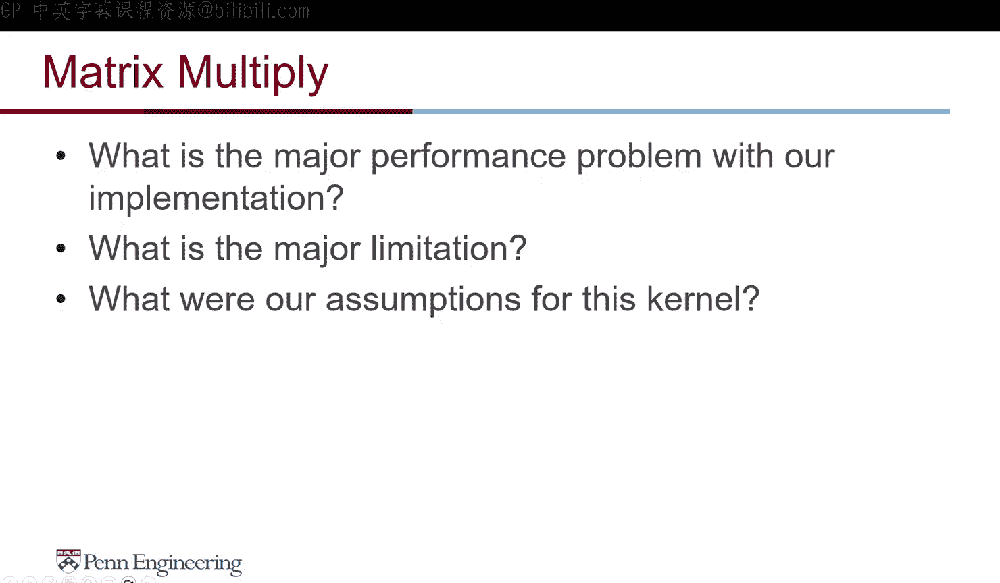

请完成项目零，并开始阅读项目一的说明。下节课我们将进入更高级的CUDA主题。