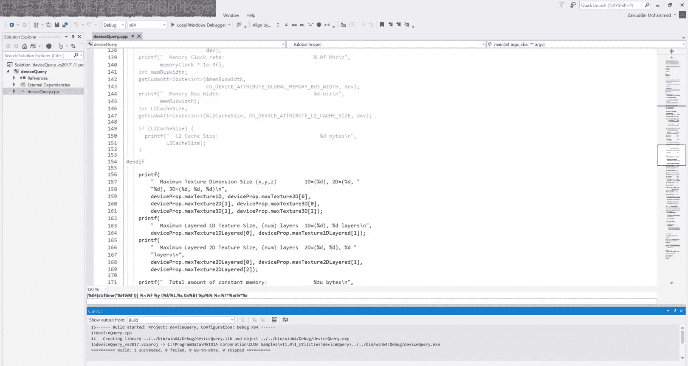
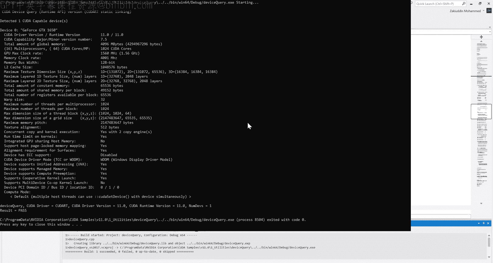
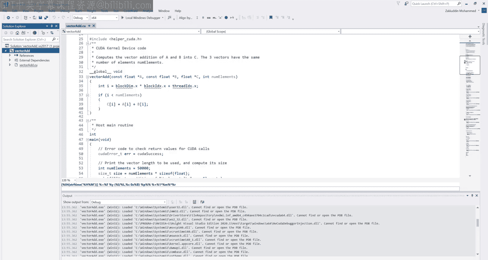

# GPU编程与架构：第2章：CUDA调试实验 🐛

在本节课中，我们将学习如何使用调试工具来分析和修复CUDA程序中的问题。我们将从调试工具的高层概述开始，然后深入探讨Visual Studio调试器和NVIDIA Nsight调试器的具体功能，了解如何管理同时运行的数百万个线程。

## 调试工具概述

在开始调试之前，了解可用的工具非常重要。调试可以帮助你发现诸如启动配置错误、线程索引问题、块索引问题、同步问题或原子操作问题等，并找到问题所在进行修正。

在实践中，大多数人可能遵循这样的调试顺序：一旦程序出现问题，你可能会添加`cout`或`printf`来查看值的情况。这种方法有效，但扩展性不强。使用像Visual Studio调试器这样的专业调试器要好得多，因为你可以逐步执行代码。我始终建议，如果你在编写任何算法，最好通过调试器逐步执行，以确保算法按预期工作，即使你认为输出是正确的，也要确保通过调试器评估每一步。

然而，当涉及到GPU编程时，Visual Studio调试器就不够用了。虽然它可以在CPU端进行多线程编程调试，但它无法调试CUDA端的内容，因为它需要访问GPU资源。这就是Nsight发挥作用的地方，它允许你调试CUDA编程，同时提供性能分析和图形工具。

以下是存在的其他调试工具：
*   **主机端**：Visual Studio调试器，Linux上的GDB。
*   **设备端**：Nsight Visual Studio Edition，Nsight Eclipse Edition，以及用于HIP编程的HIP-GDB。

## 常用调试工具

在课堂上，我们将讨论我们了解和常用的调试工具。

以下是主要的调试工具类型：
*   **可编程工具**：`printf`，`cout`，`sstream`。这些本质上是你放入代码中以获取某种输出的工具。
*   **断点**：允许你逐步执行代码。
*   **条件断点**：允许你设置特定条件下触发的断点。
*   **调用堆栈**：显示你当前使用的函数堆栈。
*   **自动/局部/监视窗口**：基于Visual Studio的窗口，你可以查看变量的值。

在CUDA端，你可以使用Nsight或CUDA-GDB进行调试。对于性能分析，我们有NVIDIA Visual Profiler（简称NVVP）。现代工具现在包括Nsight Compute和Nsight Systems来帮助你进行更深入的分析。CUDA SDK还提供了一个名为CUDA Occupancy Calculator的Excel电子表格，你可以输入诸如使用了多少内存、使用了多少寄存器等信息，以找出最佳启动配置。

## CUDA-GDB简介

接下来，我们快速了解一下CUDA-GDB，它运行在Linux上。由于我们不会在这次录播中深入探讨，这里只做高层概述。

CUDA-GDB是Linux上标准GDB的扩展，是一个命令行调试工具。它允许你在实际的GPU上调试代码，直接从GPU本身获取值，并且可以同时调试CPU和GPU代码。因此，在尝试调试时，你无需在GDB和CUDA-GDB之间切换。

设置编译标志很简单。你添加`-g`和`-G`标志，为CPU和GPU端生成调试信息。CUDA-GDB的所有用法，在断点快捷键、逐行执行和跳转方面，都与GDB本身非常相似。所以，如果你熟悉GDB，CUDA-GDB可能是一个很好的工具。

我通常推荐使用Nsight进行CUDA调试，即使在Linux上也是如此。但如果你想尝试CUDA-GDB，网上有很多资源，或者你可以给我发邮件。

## 深入Nsight前的关键概念

在深入Nsight之前，你应该了解一些术语：软件坐标和硬件坐标、线程块和内核。我们在课堂上已经讲过这些。

在硬件坐标方面，当你调试代码时，你会更多地看到这些术语被使用：
*   **通道**：线程执行的位置。通道和线程之间总是一一对应的关系。
*   **线程束**：一组32个一起执行的线程。许多线程束组成一个块。
*   **SM**：GPU上的一个流式多处理器。根据你的GPU不同，一个设备上可能有2到16个或更多的SM。
*   **设备**：GPU本身。

## Nsight调试器功能

在高层次上，Nsight可以帮助进行调试和性能分析。它包含GPU调试器、图形检查器和系统分析器。新工具还包括Nsight Systems和Nsight Compute，请随时尝试。我已经链接了Visual Studio版和Eclipse版的用户指南供你尝试。

那么，如何设置调试信息以便实际使用Nsight调试器呢？对于所有课堂项目，我们在CMake中通过添加标志来完成。如果你使用自己的项目，则需要遵循以下一些步骤来启用调试信息。

同时遵循这些步骤，为主机和GPU端生成调试信息，并确保设置正确的计算能力。因为如果你不这样做，你将无法获得正确的硬件坐标，并且会看到错误的信息。

有了这些准备，让我们深入Nsight本身，逐步了解它能提供哪些信息。

## 查看系统信息

首先，让我们看看Nsight以及它能向我们展示什么。我的Visual Studio 2017版本中安装了Nsight。我将首先进入“Windows”菜单，然后查看“系统信息”。让我们先看看这个。

当你打开这个时，它会显示你笔记本电脑或台式机的所有硬件信息。我们从左侧的“系统”选项卡开始。这将显示你的CPU核心数、安装的总物理内存（我有32GB），如果可用的话显示混合图形信息、Windows版本和Nsight版本。

“显示设备”选项卡显示所有可用的GPU。在这种情况下，它显示我内置在Intel CPU中的Intel UHD显卡。

然后，如果你进入“NVIDIA GPU设备”，这将显示你特定GPU的信息。我安装了一个GeForce GTX 1650，我安装的驱动程序是452，我相信这是最新的驱动程序模型。NVIDIA遵循两种驱动程序模型：WDDM（代表Windows显示驱动程序模型），如果你使用NVIDIA GPU进行显示，就会使用这个模型；另一个是TCC（代表Tesla计算集群）。如果你有没有显示器的GPU或使用远程GPU，这些GPU有时可以进入TCC模式，这意味着它们不运行图形应用程序，但可以执行基于计算的CUDA应用程序。

CUDA设备索引从零开始，并为每个单独的CUDA GPU递增。我只有一个GPU，所以它将保持为零。

GPU系列为你提供GPU架构的信息。我的1650 GPU是图灵架构，图灵的具体架构是TU117。所以，如果你有帕斯卡GPU，它将以P开头；开普勒GPU将以K开头；麦克斯韦GPU将有麦克斯韦架构代码。

计算能力很重要，需要记住。它再次定义了架构，但以一种系统可以读取的方式。你也可以在网上找到你的计算能力是多少。开普勒是3.x，麦克斯韦是5.x，帕斯卡是6.x，图灵是7.x，新的安培GPU（如RTX 3080、3090）将是8.x。

SM数量是流式多处理器的数量。这些是由许多CUDA核心组成的独立单元，形成一个多处理器。了解这个数字也很重要。我的有16个。我有4GB的GPU内存。

这是我的帧缓冲区带宽，本质上是如果你要在设备之间复制内存而不经过PCIe时的最大复制速度。所以，如果你只是将两个数组或一个数组复制到GPU，这是你将看到的复制器的最大速度。我们将在性能实验中重新讨论这个问题。

这三个数字是你的速度，理论速度，你可以用它们来计算你GPU的理论最大值。例如，当你进行矩阵乘法时，你会用这些来计算你GPU的理论最大值。

当然，内存类型是GDDR5。你可能会看到GDDR3、GDDR5X、GDDR6X用于新GPU。这在代码中并不重要，它只是定义了你的内存速度。

## CUDA设备属性

继续，这是你需要了解的关键选项卡。它显示了你GPU的CUDA信息。我们将介绍其中的一些，但不是全部。让我们从顶部开始，按字母顺序进行。

异步引擎数量定义了你有多少个异步操作。在本学期初，我们将进行同步操作，但一旦你进入高级CUDA，可以同时进行计算和复制，这个数字定义了可以同时进行多少个这样的操作。

时钟速率与GPU设备时钟速率1560兆赫相同，对应这里的这个数字。主要和次要计算能力在那里，以便你可以以编程方式使用它，这再次映射回这里的计算能力数字。

计算模式对于WDDM模型为0，对于TCC模型为1。并发内核再次回到异步引擎，关于你有多少个同时运行的内核。在我的情况下，我的GPU有一个。这是GPU名称。所以，如果你要查询GPU名称的CUDA属性，你会得到这个。

全局内存总线带宽再次，如果你想以编程方式使用它进行高级编程，并计算复制某些内容需要多少时间，那么你会用到这个。

现在，这些数字也很重要，需要注意。这些定义了任何一维中的最大块和线程大小。请注意，这些并不定义你可以拥有的总块数或线程数，而是定义了每个块的最大值。所以，如果你看块数字，你可以在x方向有1024，y方向有1024，z方向有64。这并不意味着你可以在一个块中有6400万个线程。这意味着你可以有一个配置为1024,1,1或1,1024,1，或者如果你有1,1,64，那么你一个块中只有64个线程。这些是每个维度的最大值。每个块的最大值仍然是1024。

类似地，网格中的块数定义在维度中。网格中的最大块数定义在维度中。这个数字足够大，你永远不用担心它。

接下来是一些内存资源，这些本质上定义了每个块和每个多处理器可以有多少寄存器和共享内存。多处理器是硬件SM，一旦我们进入高级编程，我们将更多地讨论CUDA内核如何映射到多处理器，但现在请注意这个块，它本质上定义了每个块在内核中可以使用多少寄存器，对我来说是64KB。如果你超过这个限制，那么CUDA将不得不减少执行中的活动块数量以管理资源。

我们还没有讨论共享内存，但一旦我们讲到它，请记住这个数字，我们到时候会详细讨论。

我们之前讨论的另一件事是每个块的线程数。在我的情况下是1024，对于大多数（如果不是所有）GPU来说都是1024。每个多处理器的线程数，这也是硬件概念，对我来说也是1024。一旦我们进入高级CUDA，确定我们有多少资源时，这个数字也会发挥作用。

同样，多处理器数量，另一种以编程方式访问这个的方法。

这个数字也很有用，特别是如果你在进行双精度编程。它告诉你单精度浮点计算与双精度浮点计算的速度减慢程度。32意味着双精度计算比单精度计算慢32倍，计算代表乘法或加法。所以，如果你错误地使用了双精度而不是单精度，你会很快看到速度下降。

最后，线程束大小，这将是32。它已经很长时间是32了，我不相信NVIDIA有任何改变它的意图。

你也可以在这里找到OpenCL信息，它通常会直接映射到你拥有的CUDA信息，只是在如何以编程方式访问方面有不同的定义。

你还会看到英特尔显卡图表出现在这里，因为OpenCL是平台无关的。

## CUDA示例：设备查询

在深入Nsight之前，我想向你展示CUDA示例。这些通常可以在`C:\ProgramData\NVIDIA Corporation\CUDA Samples`和你CUDA SDK的版本号下找到。显然，如果你在无法访问管理员面板的远程机器上，最好将这些复制并粘贴到你的本地目录。我不需要这样做，因为我在自己的笔记本电脑上使用这个。所以，我将在这里打开实用程序，打开设备查询，并打开我的Visual Studio版本的解决方案。

在设备查询项目中，它向你展示了如何以编程方式查询设备信息。我们看到了Nsight如何以表格形式选择信息，但你也可以通过API直接查询这些信息。这样，你可以根据程序运行在哪个GPU上做出运行时决策。你不需要事先知道它在哪个GPU上，你可以以编程方式完成这个。

这里重要的结构叫做`cudaDeviceProp`，你可以在CUDA SDK文档中找到关于这个结构的完整信息。填充这个`cudaDeviceProp`的方法是使用`cudaGetDeviceProperties`函数，将其作为输入传递，并传递设备ID。这个程序遍历所有可用的CUDA设备。在我的笔记本电脑上，只有一个。但如果你有多GPU系统，那么它将遍历所有设备。一旦这个`deviceProp`被填充，它将有一堆我们可以查看的属性：名称、运行时版本、GPU内存大小、核心和多处理器数量、时钟速率、缓存和其他信息都在这里。让我们运行它。

如你所见，这都是CPU端代码。这里没有GPU代码运行。

查看输出，你可以看到这当然是通过打印格式化的，但这几乎给了你通过表格获得的所有信息，只是现在是以编程方式完成的。所以，假设你想在运行内核之前了解可用的全局内存量，你可以以编程方式完成这个，然后决定启动多少个内核或线程。同样，对于多处理器数量，对我来说是16个，每个多处理器有64个核心，但在不同的GPU上这可能不同。所以，当你优化CUDA内核和程序时，这是一个很好的做法。

## CUDA文档资源

这里我打开了CUDA文档。这包括API文档以及性能和优化指南。它有运行时API、驱动程序API、数学API（即数学函数），并为你提供了所有库的API。所以，你们中的一些人可能使用过cuBLAS或cuFFT等。这为你提供了所有这些API，它提供了示例、演示以及如何为每个架构优化你的程序。所以，如果你针对特定架构优化程序，它会告诉你应该使用什么设置以及如何调整它们。还包括编译器、Nsight、Nsight Compute等的指南。这里有太多东西要学，你花多少时间都不够。所以，请尽可能多地使用这个。

对于这个特定的调试录播，我打开了我们刚才讨论的`cudaDeviceProp`。所以，探索这个页面将为你提供该结构中所有属性的信息，这样你就可以以编程方式使用它们。

最后，来到Nsight Visual Studio版，这是它的文档。从安装到编译、运行、调试、性能分析、检查状态、检查内存等所有内容，你都可以在这个页面上找到。我也在使用这个页面作为进行这次录播本身的指南。

## 使用Nsight进行调试

如果项目一打开了，我们将使用它来展示Nsight和Visual Studio调试器如何工作。确保你在这里处于调试配置，以便所有调试符号都编译到代码中。如果你处于某个发布配置中，那么符号将不会被加载，要么你无法命中断点，要么你会看到垃圾信息。

如你所见，我在这里设置了一个断点，这是在主机端。下一代调试器的伟大之处在于它可以同时进行主机和设备端调试，所以我们可以从那里开始。为了节省时间，我已经预编译了代码，我将开始进行CUDA调试方面的事情。

我们已经命中了这里的断点，如你所见。在我们开始逐步执行代码之前，我想向你展示几个窗口。如果你进入“调试”->“窗口”，这里一些最好的窗口是“监视”，你可以有多个监视窗口，“自动窗口”、“局部变量”和“调用堆栈”。

在我们逐步执行之前，让我们先看看这些窗口本身。调用堆栈显示你调用的函数深度。所以，现在我们有`main`调用了`init`。我们在调用堆栈中看到了这一点。所以，当你调用越来越多的函数时，这里会被填充。

自动窗口显示当前作用域内的所有变量。Visual Studio根据你当前所在的行选择一组变量，并为你提供可能最相关的调试变量。你不能在这里添加更多变量，但这是一个快速开始的方式，Visual Studio很好地选择了相关变量。

然后，如果你进入局部变量，这些是函数作用域内的所有变量。例如，如果你有一个for循环或if语句，并在这些块内定义变量，那么当你处于这些块中时，这些变量将显示在局部变量中，当你退出这些块时，它们会被移除。你可以再次看到所有这些，你不能在这里添加更多，因为Visual Studio为你选择了所有这些，这些将是顶层的。所以，如果你有任何数组，你必须展开这些以了解更多信息。

监视窗口是你添加更多变量的地方。我稍后会讲到这个。所以，让我们逐步执行，我将进入局部变量窗口以便观察。

如你所见，如果某些东西变成红色，意味着上一行刚刚更改了该值。所以我们将`gpuDevice`设置为0。在当前行，我们将`deviceCurrent`设置为0。所以我要在这里高亮显示这一行，你可以看到它是一些垃圾值。现在，当我逐步执行时，它变成了0。你可以看到它变成了红色，因为它刚刚更新。

让我们继续逐步执行。现在我们处于`cudaDeviceProp`，`deviceProp`变量将被填充。我要高亮显示它并展开，以确保我们看到正确的信息。当我逐步执行时，你会看到整个结构体已经更新。

这里可能有一些变量不会更新，例如，`maxThreadsDim`可能默认是相同的，GPU也是相同的，所以它将保持不变，因此你看不到它变成红色。所以我要继续。

我要来到这里，因为我想向你展示一个技巧。如果我们进入“名称”到监视窗口。让我们再执行一行。所以现在我们可以看到`deviceName`已经被填充。所以我可以在这里输入`deviceName`。

这显示整个字符串。你可以看到这里的类型被高亮显示为`std::string`。

你还可以做的是，像这样做`[0]`。所以现在你只得到第一个字符。所以现在你可以看到类型是`char`。虽然我展示的是字符串，它本质上是一个带有其他函数的字符数组，但这也适用于其他类型的数组。所以，如果你有一个浮点数向量或一个常规整数数组，这些字符串在那里也适用。所以，我可以做的是，我可以说`deviceName, 10`。所以这是要求从`deviceName`开始及其后的10个元素。所以当我按回车时，你可以看到这变成了“565 CUDA I”，这是“GeForce GTX 1650”的一部分。所以那是10个字符。

你也可以用浮点或整数数组来做这个。

另一件你可以做的事是，如果我获取这个背后的C字符串，即常规的C字符串，并执行`, 10`，它仍然有效。所以现在你可以看到这是`const char[10]`作为子类型。然后，如果我做，比如说，`+5`，这是给字符串开头添加一个偏移量。所以，不是看到“565 CUDA I”，前五个字符将消失。所以直到“C”将被偏移。所以我们将看到新的监视变量从“U”开始。所以我要按回车。现在你看到它是“UDA Intro :”，这又是10个字符。所以这也适用于其他类型。所以，虽然我只展示了字符串，但它也适用于其他数组类型。

好了，展示了监视功能后，我将进入内核方面的事情。我在这里设置了一个断点。

它给我这个错误的原因是执行当前在主机端。所以你可以看到在线程这里，它说“主线程”。这就是为什么它显示这个断点将被命中。但我们知道它在一个内核中，并且它将运行。所以我只需点击继续。我们将看到这个断点被命中。好了，让我们跳回我们的自动窗口。

Nsight的伟大之处在于它使用与Visual Studio相同的所有窗口。所以我们看到所有这些自动、局部和监视窗口仍然被填充。当然，监视窗口现在将被使用，因为它填充了所有变量，所以我要删除那个。但现在如果你回到自动窗口，你将看到`blockIdx`、`blockDim`和`threadIdx`用于活动线程。记住，当你在内核中时，有一个线程束正在运行。一个线程束是32个线程，但每个断点都在一个特定的线程上，所以我们看到当前活动线程是块(0,0,0)的线程(0,0,0)。这很重要，要记住，确保在调试时，你在正确的线程上。

## Nsight专用窗口

就像调试器有窗口一样，Nsight也有几个窗口。让我们看看那些。我们已经看到了系统信息。我现在要打开线程束信息。

就像我之前说的，一个线程束是一组在GPU上一起执行的32个线程。这个选项卡将显示为当前内核启动的所有线程束，你可以在这里添加过滤器，输入内容，我们现在不深入讨论。这里重要的是着色器信息，它显示整个线程束的块和线程ID `blockIdx`。一个线程束不能跨多个块分割。每个线程束都在同一个块内。以及该线程束中第一个线程的`threadIdx`。所以你不会看到偏移量，每个线程束之间的偏移量是32，因为线程束大小是32，你会看到这些是八组四组，只是为了视觉表示，但总共有32个线程。

`CTA`是块线程数组索引，`thread`显示该线程束中第一个线程的线程索引。

你可以做的另一件事是，如果你想要，你可以双击这些框中的任何一个，然后你可以转到那个线程，我们可以稍后再做。

这里的其他窗口是线程束监视，它与常规监视相同，只是你可以在上面添加CUDA变量，你会看到每个都有32行。所以你将显示整个线程束。如果我弹出这个。并填充这个。然后让我们回到内核，这样我可以添加一个变量，比如`index`。也许单步执行，以便它被赋值。现在你可以看到我们处于一个标准的索引方程中。所以这些值中的每一个都是唯一的并且现在被填充了。这就是线程束监视。

让我们看看还有哪些窗口。让我们进入通道，让我把它放在那里。

就像我之前说的，通道是硬件中线程的表示，所以你会看到每个都有线程索引，这将显示它们处于什么状态。在CUDA中，你可以有分支线程束，所以这是了解哪些线程处于活动状态、哪个线程有断点、哪些线程处于非活动状态的好方法。

这就是通道。让我们进入资源。这里面有几个选项卡。我要把它放在那里。我也要把这个放在这里。

在资源中，我们这里有几个下拉菜单，我将介绍其中一些。“设备”将显示它正在执行的设备的相同信息，就像我们在Nsight窗口系统信息中看到的那样，你也会在这里看到。

上下文，你可以有多个CUDA上下文用于多个线程。所以那将显示在大多数情况下，你只会有一个上下文。同样，流，你可以有多个流进行以提高效率和优化，我们将在课程后面讲到这个。

函数显示所有设备函数，这些包括CUDA全局内核和函数。所以你可以在这里看到名称，修饰名是它的完整定义，错名是目标代码中的名称，你可以看到每个块的线程数、它们使用的寄存器数量、字节数。我们还没有使用太多这些，但随着我们对CUDA理解的深入，你会开始看到这些也被填充。所以我要找一个我们当前正在使用的，即`generateRandomPositionsArray`。

让我们进入资源，我按名称排序以便更容易找到。

`generateRandomPositions`。所以在这里我们可以看到，一旦我返回，你有一个`index`定义。你有1,2,3...3个变量作为函数参数传入。所以那是24字节。然后你还有一个向量指针，那将是额外的字节。然后我们有另一个4字节用于`index`，以及另一个在本地定义的`vec3`。所以如果我们回到资源，这告诉我们每个线程将使用29个寄存器和184字节的本地内存。

这是找出你编写的每个内核资源需求的好方法。

我现在要跳过图形，因为那是当你使用图形功能时，比如机器学习，现在调试不一定重要。

让我们看看我们还有哪些其他窗口。最后，我们当然有GPU寄存器，它给你所有的寄存器信息。这可能现在很难阅读，因为它都是十六进制和寄存器，但一旦你习惯了高级CUDA编程，你将能够相当容易地解读这个。

好了，我要关闭大多数这些。所以我要关闭GPU寄存器、通道、资源。我要保留线程束信息和线程束监视。我要分割窗口，这样我们可以看到两边。

## 调试内核中的变量

我已经添加了`index`到线程束监视中，只是为了向你展示。我还要添加`time`和`scale`，因为这些都是输入的静态变量。所以这些对于所有线程、所有线程束都是相同的。所以我添加`time`和`scale`在那里。你可以看到这些都将是相同的。所以我要再次删除这些，因为它们不一定重要。

我要添加`blockIdx`和`threadIdx`。现在，虽然这些是三组件结构体，但监视窗口将相当容易地显示它们。所以你不必做`blockIdx.x`，尽管如果你愿意，你可以这样做。所以我可以向你展示`blockIdx.x`。那将是唯一的。你不必这样做。你可以将它们作为三组件结构体。所以，让我们单步执行。

现在我们可以看到，我们即将使用这个函数生成一个随机数。所以如果我们在这里查看定义，我们看到这是一个`__host__ __device__`函数，意味着它可以在主机端或设备端运行，并且它将生成三个随机分量，并为此返回一个`vec3`。

所以我要关闭那个，并且...让我想想。现在记住，这是一个GLM `vec3`，它来自GLM库，所以这可能不会直接显示出来。所以正如我们所看到的，这里有一个局部变量`rand`，但调试器无法看到正确的值，那么我们如何看到这个呢？我们可以做的是，打开双括号，做`__local__`，我们做`local`是因为`rand`在这里是内核的局部变量，它不是作为全局内存传入的，也不是共享内存，它是局部的。所以我要这样做。我要做`float*`来类型转换它。我要放一个`&`来获取它的指针。我也要关闭那个括号。所以一旦我按回车，现在你看到这是一个内存地址。然后我添加`[0]`索引。这应该转换为值。好了。所以现在所有的值都填充了所有的线程。

我好奇为什么这些是零，但我假设GPU还没有发送回那个信息。

我们可以对...做同样的事情。哦，你知道，这些是零是因为...不是所有...寄存器可能不是所有线程都使用相同的指针，或者可能...这就是为什么。所以它使用了来自线程0的`rand`地址，但没有为其他线程正确填充。

另一种方法是，如果你想复制这个并把它放到我们的监视窗口中，那也有效。所以在这里我们可以...我要再次复制那个。所以我犯了一个错误，我做了`[index]`，我应该实际上做了`[0]`，因为`rand`是x, y, z。所以我们可以也使用0,1,2。这就是为什么它可能遇到垃圾。所以现在，如果我做`[0]`，那么所有这些值都正确填充了。所以我们可以对`[1]`和`[2]`做同样的事情。

所以让我们把它挤回去。这就是你如何读取GLM向量的方法。所以现在让我们单步执行。

所以值被赋给了`arr`，这是全局数组。所以如果我输入`arr[index]`，问题是`arr[index]`也是一个GLM `vec3`。所以我们会遇到同样的问题。然而，我们不能对`arr`使用这个局部描述符，因为它不是局部变量。它是一个通过函数指针传入的全局变量。

要可视化这个`arr`全局内存，你要做的是进入调试窗口，你会看到这个内存，你可以打开其中一个监视内存窗口。

然后你要做的是在这个地址字段中，获取`arr`的地址。所以如果我们高亮显示它，你可以看到它，或者你可以从这个框中复制它。所以我只复制了十六进制部分。然后把它放进去。

通常这被设置为1字节整数，我测试过，所以我切换到了32位浮点数。我们知道GLM `vec3`是32位浮点数，所以我们要将其设置为那个。

因为我们在主机端将其初始化为全零，这个全局内存全是零。所以现在如果我们单步执行下一行，你会看到值更新。

现在你可以看到一些值更新了，但它似乎没有任何不规则的模式。你们有谁能想到为什么吗？我给你三秒钟暂停这个视频，3, 2, 1。

记住，我们不是...我们只分配了X分量，而这些GLM向量是三组件结构体，对吧？所以你会得到X, Y, Z, X, Y, Z, X, Y, Z。所以如果你看到第一个值更新了，但两个零，然后一个值，然后2,0。所以1,2。所以我们可以做的是，因为我们知道这是一个`vec3`，我们可以将列数改为3。所以这填充到32。我要退格并输入3。现在你可以看到所有第一列的值都更新了，只有32个，因为我们正在运行一个线程束，所以32个线程已经执行并更新了值。

让我们再执行一行。所以现在你可以看到所有的Y值都更新了。如果我们再执行一行，那么它可能会退出内核，因为我们完成了。内核上的执行将结束。所以我们可能会退出这个。所以给你一个警告，在我们这样做之前。所以我要执行下一步。好了，我们已经更新了，并且它已经退出，所以很好。你可以看到红色的点已经改变了。

这是一种使用这种内存监视来可视化全局内存的方法。所以让我们...我要把它放在这里，这样我们就不会丢失它。

一旦我们有了那个，让我们...我要停止这个。另一种可视化全局数据的方法是使用`float3`。所以`float3`，或者我要输入这个。所以如果我输入`1`，你可以看到有`float1`、`float2`、`float3`、`float4`。这些是CUDA中的内置变量。所以调试器和CUDA理解它们。所以我们可以做`float3 tempValue = make_float3(arr[index].x, arr[index].y, arr[index].z)`。所以如果你这样做，`float3`值将固有地在线程束监视和自动窗口中可见。所以这是另一种可视化数据的方法，而不必进入内存窗口，这可能令人困惑或可能有太多数据需要查看。

## 观察分支和线程束分化

我想向你展示的另一件事是关于分支。因为它可能会改变这个，我要先编译这个。

我们生成这些随机数的大小是5000。所以`n`是5000。但如果我们看我们的块大小和块线程，我们正在启动40个块，每个块128个线程，总共5120个线程。这意味着我们启动的线程比元素多。所以一些元素...一些线程将满足这个条件并退出。这被称为分支或提前退出。所以我要在这里放置一个条件。并添加表达式`index == 4999`，因为5000会超出这个条件，而4999将在其中。所以保存那个，然后让我们开始调试这个。

当我们查看内核时，我们命中断点。你可以看到这个黄色箭头标记了`index`是4999的位置。看看这个，所有这些都被划掉了，即使`index`被正确填充，所有这些线程都被划掉了。让我们看看通道。这也很有趣，所以所有这些线程都被标记为非活动状态。如果你看线程束信息，另一件要注意的事是，在此之前的所有其他线程束已经完成了它们的任务并退出。所以我们在这里看到一些绿色的，它们是活动的，这里的灰色本质上是非活动的。

那么非活动是什么意思？如果我们回到我们的内核，任何不满足这个条件的线程没有其他事情可做。所以它们正在退出。这被称为提前退出。这是优化内核的一种方式。现在，如果这里有一个else条件，如果`index`小于`n`，否则做其他事情，那将被称为分支。所以在这种情况下，线程束中的一些线程在做一件事，而其他线程在做另一件事。这被称为线程束分化，我们将在课堂上更多地讨论这个。所以如果我们单步执行这个，我们可以看到一些值更新，而其他线程没有做任何其他事情。

## 简单示例：向量加法

我已经关闭了项目一，现在我想从CUDA示例中打开一个简单的例子，即向量加法，向你展示一些更基本的东西，而不涉及GLM `vec3`等。所以我打开了2017版本的向量加法。让我们打开文件。编译它。

当那发生时，我要在这里放置一个断点。在这个内核中，我们有三个全局内存数组传入，都是浮点数。所以让我们看看如何可视化像这样的简单数组，而不必处理GL向量。

好了，让我们开始调试这个。好了，让我们添加...让我们单步执行。1，然后让我们添加`blockIdx.x`和`threadIdx.x`。如果你双击这些选项卡，它们会自动调整大小。所以我经常使用那个。然后我们想要`i`，然后我们找`a[i]`和`b[i]`和`c[i]`。现在，假设你的第一个问题是，嘿，为什么`a`、`b`和`c`在这里工作，当它来自全局内存时，但当我们试图访问点示例中的`arr`时，它不行？那是因为`arr`是一个GLM `vec3`。而监视窗口不完全支持那个结构体。这就是为什么我们无法可视化它。但这里相当简单，只是因为这些是监视窗口识别的类型。

所以我们可以很容易地逐步执行这个，当我们单步执行时，我们看到值被更新。现在`c`被更新了，让我们看看当我们超出执行时会发生什么。在一个普通函数中，这将返回到下一个...它将退出并转到上一个函数的下一个语句。但这是一个CUDA内核。所以还有更多线程要执行。所以让我们进入局部变量或为`threadIdx.x`和`blockIdx.x`添加一个监视。

我没有使用这个，因为这个也会改变。所以注意这个。所以`threadIdx`全是0。`blockIdx`全是0。所以让我们单步执行。那么，让我们看看会发生什么。

现在这是什么。所以`threadIdx`已经增加到32，这意味着我们在线程束1中。所以让我们回到这里，你可以看到我不能再向上滚动了，并且没有0,0,0,0,0,0用于第一个块第一个已经退出的线程束。所以现在我们正在看这个线程束。现在，我们如何能转到下一个块，而不是转到下一个线程束？例如，要做到这一点，进入Nsight...你可以在这里跳转线程束，如果你想要，如果它们是活动的。所以前一个线程束不再活动。所以这没有太大意义。但如果我们想要，比如说，跳转块，我们可以做的是进入冻结，并执行“调度锁定恢复块”。好了，现在注意这个。32,0,0,0,0,0，对吧？所以让我们逐步执行这个。

这些都没有改变，因为我们仍然在同一个当前线程上。所以现在发生了什么？让我们逐步执行那个。看看这个。现在，`blockIdx`增加了1,0,0，而`threadIdx`是0,0,0。这意味着我们跳转到了下一个块，而不是块零中的下一个线程束。

所以如果我们回到我们的线程束信息，现在，看看这个，我不能再向上滚动了，但所有0,0,0块都消失了。现在我们在块1。所以让我们再试一次。所以单步执行，单步执行。现在，你认为这里会发生什么？猜一下。所以这现在增加到二了。再次，我们停留在第一个线程束，因为我们本质上是在开始一个新块。所以只有块索引增加了。

让我们改变冻结模式为“恢复线程束”，让我们看看会发生什么，所以...我现在要单步执行。我们在第二个块，线程束0。让我们增加那个。现在我们转到32。所以我们改变了线程束。我们转到了下一个活动线程束。所以如果我们去这里看，那个的起始索引是32。

类似地，我们可以有不同的锁定和不同的线程束，所以请随时在你自己的方便时尝试这个，看看当你选择这些所谓的不同的冻结选项时会发生什么。

## 添加命令行参数

今天我想向你展示的最后一件事是如何在使用Nsight调试器时添加命令行参数。所以你进入这个按钮，Nsight单元属性，你可以使用这个工作目录和工作环境，并在这里添加命令行参数，这些通常是从Visual Studio调试器获取的。所以如果我们去项目属性，进入调试。所以如果你在这里添加任何参数，那将被获取。但如果你想添加特定的Nsight调试参数，那么你也可以在这里添加那些。所以这对你来说是另一个有用的工具。

## 总结

本节课中我们一起学习了CUDA调试的基础知识和高级技巧。我们从调试工具的高层概述开始，了解了Visual Studio调试器和Nsight调试器的区别与用途。我们深入探讨了如何使用Nsight查看系统信息、设备属性，以及如何在内核调试中查看和操作变量。我们还学习了如何可视化全局内存、处理复杂数据类型（如GLM向量），以及如何观察线程束分化和分支行为。最后，我们通过一个简单的向量加法示例，巩固了使用监视窗口和内存窗口进行调试的技巧。掌握这些工具和技术将帮助你更有效地诊断和修复CUDA程序中的问题，并为后续的性能优化打下基础。