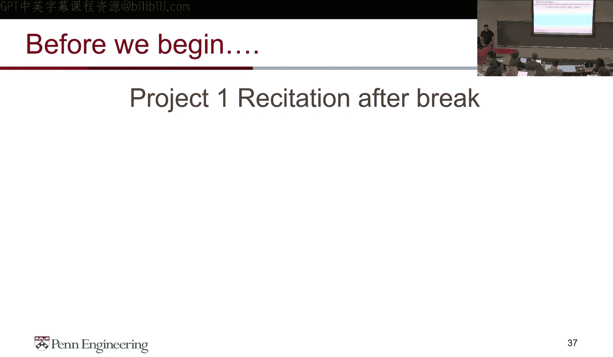
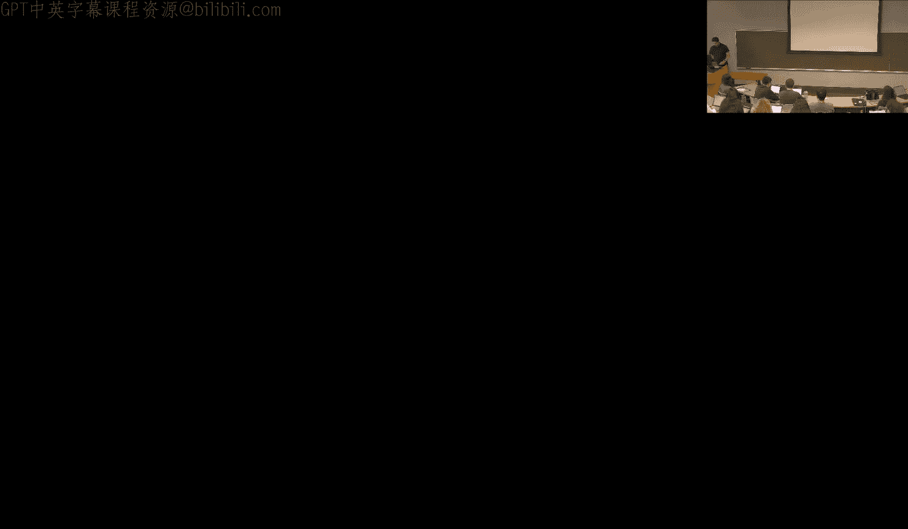
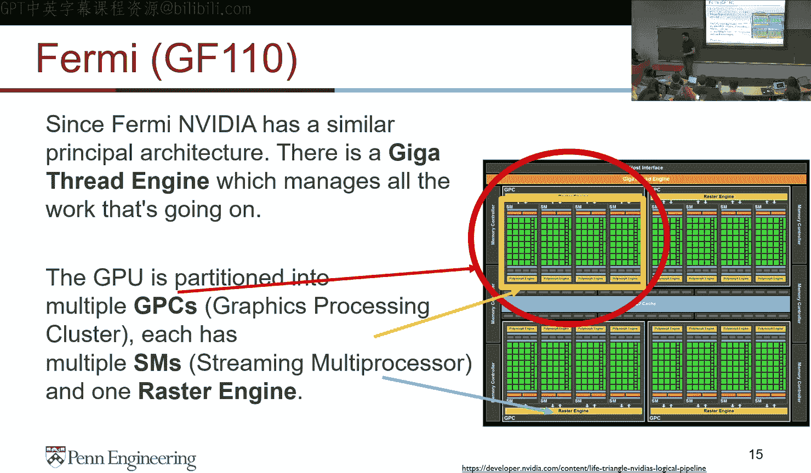
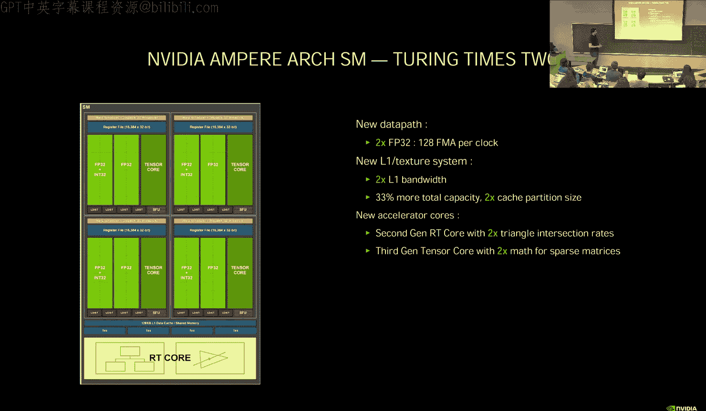
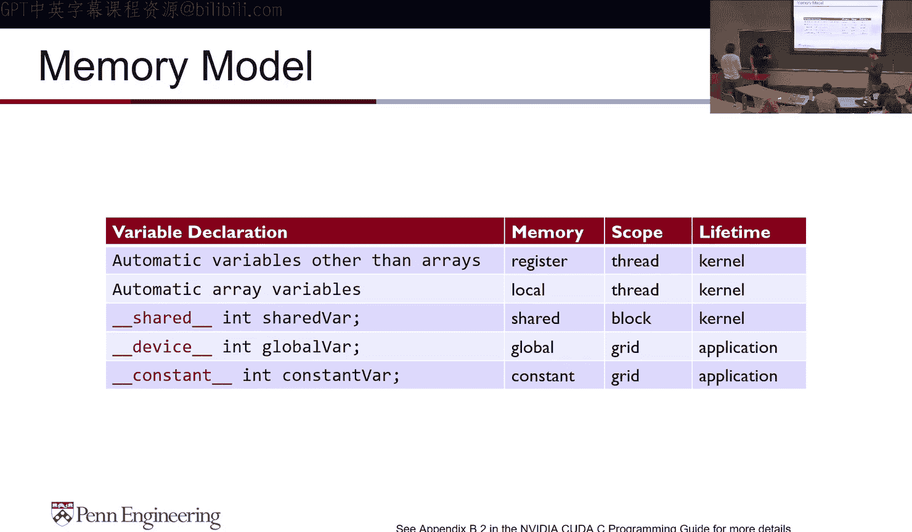
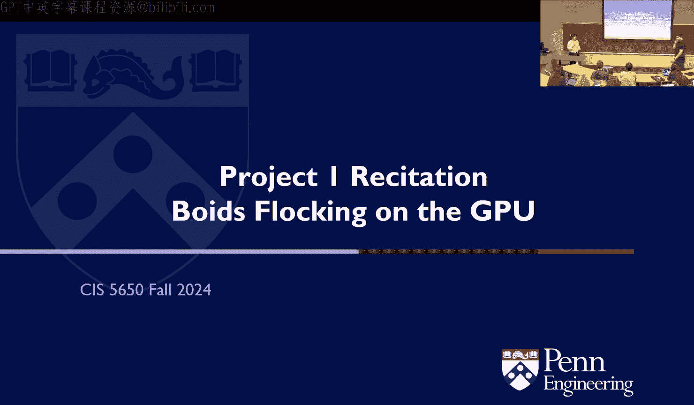
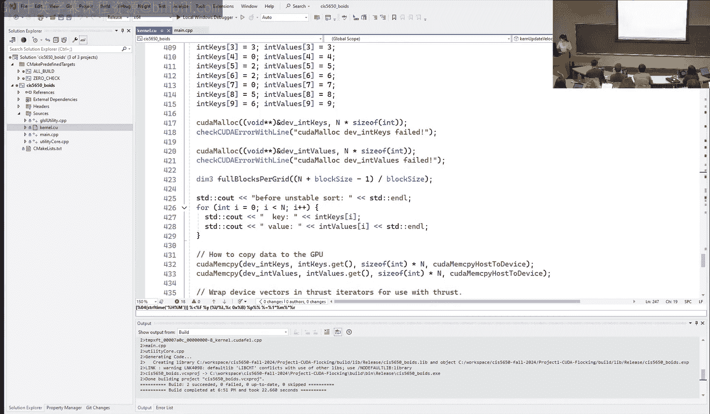
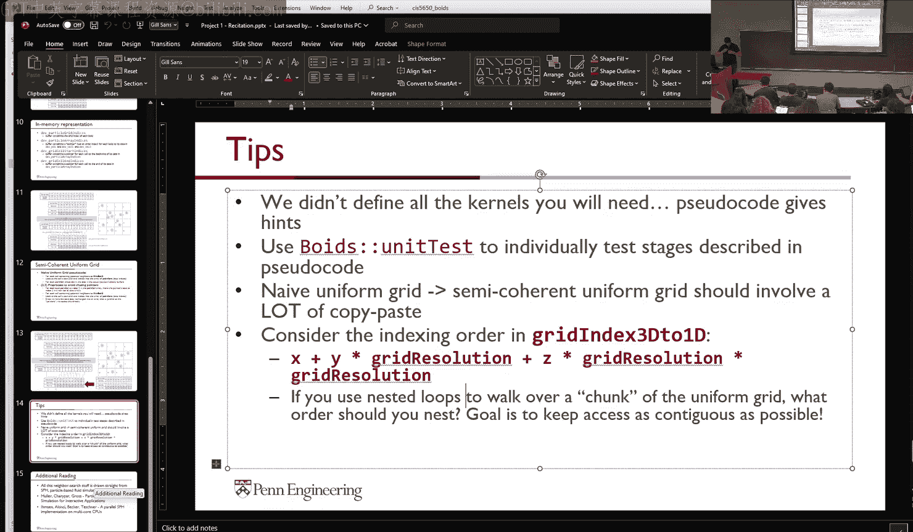
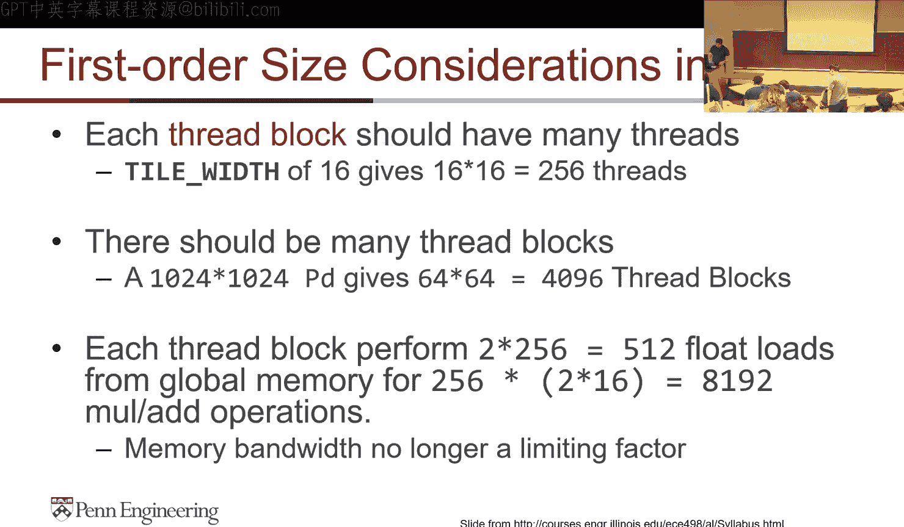

# uPenn《GPU编程和框架｜CIS 5650 GPU Programming and Architecture Fall 2024》中英（Claude-3.5 p03 2024-09-04 - 2-CUDA-Introduction-1-of-2 -BV1sRtresE67_p3-

Yes。Toite everyone hope everybody had a great Labor day break。

 I know it's always weird to have the first class and then have a Labor day break so let's get started here。

😊，I want to get started with maybe before we even do this a quick show of hands because I know a bunch of people missed last Wednesday so just to show of hands to see if anybody missed all right we have one two。

😊，Three and you guys were able to watch the recording to catch up okay。

 any comments on the recording was the audio clear and stuff because again we try to use we try to improve every year but any feedback would be good so that we can act on it this semester itself。

Yeah， the south。Sound is a bit low， okay。Oh oh so the Monday one is actually prere from a few years ago but but thank you for that feedback Was the Wednesday class good Okay Wednesday class good。

😊，So it's optional and that's my next question。We， we'll get to it。 Allright。

 so wna do a quick round of introductions。 I don't do it last class because everybody's new。

 Everybody's like why wided。 So maybe a quick round of intro with with this。

 let's start with you and then we'll go around like a snake Yeah hi， I'm Nick。

 I'm a senior I'm gonna graduate from undergrad like in spring in 2025。

 but I just applied for another semester for C GT。 so I'm assist undergrad。

 And I interned at Samsung for the past couple summers one doing like bulk an internal debt toolsols and another doing compilers compile stuff in the same place as。

😊，这什什么。What。Hello I'm Matt。 I am a CGGT student。 I've been part time for two semesters I'm now full time。

I haven't interned anywhere in the games industry， but I have been in software for a while at Amazon。

He care for that。So yeah， I'm just doing a little bit of a careership and I'm excited to take the thoughts and meet everyone。

And Matt made be last year， right， for attending the class。How about you。Hello， my name is Alllan。

I am also a CT student。 I plan to graduate next summer。And as for my previous internship。

 I introduced Samsung this summer。 I worked on the project Mohan。

 the Xer device they were making with Google and Op of3co。And最。I'm first succeed a student。Next year。

My early looked internship would be it。你婚的这个。Hi I' Kevin， I'm a first year B student CIS program。

 while I did an internship last summer the NCSA， which is a supercomp intern in UIECC。Dan요。嗯。

Over summer， I was at Esri doing some graphics program and he's like having the some stuff vent later。

I'm Denette， I'm a senior in DMD graduating this spring。

 and in the past for this past summer I worked。Respon EA on ApX Legens as a technical。A cool。Hi。

 my name is Cchelle and it's my first year at CG。I expect to graduate。Spring party on some and。啊。

Last year I was working as a end player。あの。哦。Yeah I'm to。 I'm I'm also a second T student and have。

Dened at in games。And mainly develop some QE5 engine development。

 and also I have internal turn at Apple to some activities。呃，对。嗯。加3呢。And technical， a third years。进来。

嗯 I我看。内苦他人你。Hi， I'm Joanna， I was a DD undergrad graduate。Last year that being this year。ly。Okay。嗯。是。

I'm also a senior in VMT。 this past summer month， I'm the research at TU。 And before that。

 I worked at。我。こ。喂。Avoance。还说这个。And before。Hi everyone， I'm Jordan。

 I'm a senior majoring in computer science and mathth。

 haven't interned anything related graphics before but last summer of the CASC AI。好。

I am Kyle for my second year E student。If they graduate in spring。系会家那我你再发。I think Mike。

 I'm a part time CC Houston expecting can graduate May。for a lot March full time I graduate later。

Yeah。Sorry。Now let's use your GT I was probably again。I miss the person in the classes。

 explained I was entering video along the。第个。It my very close experience with low level map。So。Cool。

他没见人。那呢。My happen。I second yearsで。And ready。P。下面啊。In terms of guidance working。I everyone。The you。呃。

然后姨就间。I'm抓。欢声音。没有。です？嗯，他人。でする？In the past summer， I was in from Ed personal dynamic。H。Hi， my name is。

 I'm。呃哪定。那那呃电。Cargos。C to these students that near the library room。没有不。is so。I am Michaelchael。

Pian MCCA APS。For a year and。InSp。Before I was studying， I was animation and TV at animal Lo。

I go movie and stuff， so that was fine。And I from Australia。Yeah。My name is Arrey。

I'm a Z S M student， I inter in Pla people and。啊年可の最个月资出这个。发か我反该。啊。他这个。Sorry。

 I didn't catch your name that you say Billy。Okay， thank you。My name is Sha。 I A my sister。

And I will that。嗯嗯。co。I am Dominic。 confusion。 I don't have any previous。不认真不。啊，看到什么问题。H。最すね。And I。

And this summer I was doing。啊I。我去前。好的。And was maybe the mention of。没。啊嗯。All right。

 we'll skip Han and Kristen。I。まし。Everyone are fun。我定。Yeah， I was working。我们。我湾。我れ当。等 far。又系。

My interest is in。The rain of。B。I have a second year。I still the name of all these。

This summer I the computer and AI company called the。A building some。Large beer models for project。

开始。这这你可是个。哎M不包。は。啊，还马什么在个。A。You在。I enjoyed that And come and。嗯，对。把上买个机机号呗。そ。I am just Smith。

Double match that。That some。いでし。啊。Second year robust student。Iそ video sorry。Hi， I'm Paul and I'm。

I terms regarding on A I can。还 will大你。我么说。Hello everyone。

 my name is A and second year is Yu it is my last year and hope going to graduate。

That's very really positive。I was。你看谁改。l game company this summer。In charge of team play stuff。嗯。

Anybody who came late and didn't get a chance to do interest？有那个。You can find a seed。自一。And this not。

 this summer。好楚。对。好意见。Very cool， you're planning a cautions planning project， so that could be cool。

Do you want to give a quick introduction？Yeah， you can see what you want to see here。さははとだ。Sorry。

 you go by Andy，And。And。エつし。我来决定です。错。嗯他。嗯。喺呢哋诶。反正你天现在三分。Cool all right。

 thanks everybody for those introductions really thank you Joanna for the round of applause clearly I'm not gonna remember all of your names I'm not gonna I'm going to try to I'm going to try really hard。

 but if if I don't remember all I ask is that you guys do say if I point at you and I don't call out your name please send me your name okay。

 that's a clear sign that I don't remember your name otherwise I'll call you by your name I don't like it pointing at people。

😊，So for the next few lectures， use your name if I don't ask you for your name。

U。All right， I'm going to do a pop quiz， who's ready？

Second class pops。For zero points， okay， so it's fun it's just a revision because Wednesday to Wednesday with the Labor Day weekend in the middle。

 everybody forgets everything so there's a quick recap。All right。

 who wants to list a few differences between CPU and GPU？Just shout it out if you want。아きこ。你是。Yeah。

Yeah， that's one difference。Who else？うか。可以说示。嗯哼。😊，Okay。Other are the differences？No。我他不是别人。Yeah， Cdy。

 Cdi is definitely a difference。One more， maybe before I show you next。What about memory？Yeah， how。

AB可呃一8可8号。Yeah there's there's definitely registers and stuff then the architecture of the memory on CPU and GPU is very different so here's here's kind of the difference from a slide I've borrowed you can see the link at the bottom。

A CPU is more compute or less compute dense， whereas a GP is more compute dense。

 there are different control logics for C or general purpose compute， caches， parallel operations。

 the pipelines are very different so these are all some of the differences。

Just a slide from last time around talking about the differences between host and device and how a QUDa program is structured。

All right， what are the terms used for CPU and GP and Kuda？Yeah。Host and device， that's correct。

What is the data panel function called？Acur good。So kernel is this and our normal program goes with serial code。

 run some kernel， run some serial code again。What is a specifier for a kernel？好 yeah。Nick， thank you。

 underscore underscore global underscore that's correct。 So that's that's called the specifyifier。

 This basically tells the compiler this is a device function。

What are the levels of logical constructs of parallelism on the device？What。

Gid block thread that's good so we have a grid a grid is all the blocks in a kernel and then within a block we have threads。

😊，And a grid can be 1D， 2D or 3D blocks can be 1D， 2D or 3D as well， special rules in a block。

 they can synchronize， they can share memory which blocks in a grid can't do and we'll get into why more today。

How many trends in a block？No。So 10，2，4。What's the qualifier on that？It's up to11024。

 so even I don't have the up to one on the slide， but it's up to you can configure it your way。

What can threads in a block do that blocks in a grid can't do？Yeah， share memory， What else？

One more synchronize yeah， so they can synchronize and they can share memory and the reason this is because they'll execute on a same SMM and we'll get into that in a little bit。

What are the different types of memory you on a GPU？嗯。Yeah。

 but specifically what are the names that we explored last time？1 else in texture1 L2 texture。

 that that's one answer， which ones did we use last time around？Global memory。Local。Yeah， okay？Yeah。

 so so there's registers that， you know， if you do an int X in a kernel that that's going to use registers。

 global memory constant memory and of course that host host can write to global and constant and we'll get into more into memory today。

What are the built in variables in QUudDa for determining thread ID information？나요？

Thread index and block index and that's what we are going to use to calculate each of these has dot xY z components to them so you can use that for calculating where in the global scheme does your thread lie。

What are the ranges？HowHow big can thread IDX and block IDXP？完。对对对。是。对は。

How do you generalize it more？嗯。Yeah， so tell me has the dimension of the block then。

I guess you can figure that。That some。I making that up。你' makingだろ。Yeah， Alan。我 in。Yeah。

 so so thread IDX can range from0 to block Tim of that component minus1 because it's zero indexed and same as block index it can go from 0 to grid dim or x minus1。

But Matt did bring up an important point， we didn't explore in the last class how many blocks you can have we clearly said that no matter what the configuration is block size has to be 10 24 threads。

Block I blockd as in gridd the number of blocks you can have is basically infinite I think like just in the x per x dimension you can have 2 billion blocks and then you can have 65000 in y and 65000 in x and when I say 65000 it's really 65536 which is2 power something right so so those are the multiplications you have basically the limit is how much memory or kernels you have in your GPU。

😊，Okay。How do you calculate globally unique index for 2D block in a 2D grid？

You can just say the general formula it doesn't have to be bird perfect or letter perfect。WhatM。

Make sense to me is you get the block index， you multiply that by block in x block and y block set and then you do。

Walk index times， spread index wide。Right， so you do something like this this is the matrix edition example we explored last time you get the globally unique x and the globally unique y so you're getting the row and column and then doing y times n plus x math yeah speaking about this and wondering。

好 the。Like the way that we've been talking about it。

 the formula that we use depends on the parameters。嗯哼。😊。

Which sort of seems to defeat the generality purpose of those parameters。

 and I was wondering if you could do。Have one equation that。

Works whether it's the blocks or one dimensional， pre dimensional。

much if it's one or two dimension because you can just substitute block IDX like let's say your one dimensional block IDx do y will always be0 so if you multiply0 times some anything you're just getting third IDX dot y。

So this is a generalized formula that you can use pretty much anywhere。

It just you just need to know if you have x components and y components or not。So。Okay。

What are the three basic QDa memory APIs we explored？Okay， let's start with one， who has one？来这果他们。

Yeah， what's the API for that？You you go to you。cha Michaelcha。CouldCould a mallic good。

 do you have one more copy Okay， me copy last one。Kudafr exactly。

 so Kuda Malik does copying to and from global memory or Kuda Mala creates the memory。

 Kudafr frees the memory and KudaM copy will copy that memory between host and device。

What are the different directions memory copy can happen using Ka API？黄丽娜。Yes。

's that's four direction so we have host to host， host to device device to host and device to device。

 and this enum here essentially defines which direction the copy is happening。All right。

 so that conclude it questions for me before we get started with the class。Yeah， Michael。Yeah嗯。觉他买块。

Iapp that。Like just。Basically yeah so you can you can use like pin memory and stuff with it to make it asynchronous if you want。

 so there's some advantages that we'll explore much later in the class。

 but if you just have regular host memory there's no real reason to use codeM copy。Other questions。

All right。Before we get started， how many waiting to still register for the class just to show off hands？

1，2，3。4。All right， so most of you are in just want you to do one thing after class come up here so that I can add you manually to Ed discussion because it does like automatically it syncs with canvas when I hit the button but。

Because we have such a long way to list， I don't want to add everybody to a discussion and create noise so if you come up to the podium after class。

 then I can add you in。Sister was saying that there may be some difficulty in getting everybody access to the dungeon where the office hours are being held。

Office hours， I think we should be fine because the T will be there， they'll open the door。

My question was more about how many of you don't have access to a QUD GP or not thus using the labs？

One， two， three， four，5 and do you have computers in your respective labs that you're using or do you need to use a computer in the dungeon？

난주 오케이。Anybody else？哦。It's only dominic traces and， so if you guys can send me an email。

I think if it's three people crystal， I think we can get the access， I'll send a note to Dr。 Lane。

 if it's like the whole class， then I can imagine that might be difficult， Joanna。So后。嗯哼。😊，Okay。被么的。

I charge。Okay。Okay。Okay， all right， so I'll try an email thread with Dr。

 Lane so that I'm in the loop as well。Yeah， and then the Mo lab stuff， I'm talking to sets。

 let's see what happens， hopefully that you're able to at least do the QUDa programming in MoLb or other labs and then for profiler and stuff we can access the dungeon them。

But we'll try to make it as smooth as possible。Okay。

All right how many of you watched the kuda debugging recording for like that I posted last week it's optional is there to help we'll do a live one in the class but did anybody watch it that and found it helpful okay we have a few。

Okay， all right， so as you do project one， go back and watch it because it will definitely help with debugging project one and we'll do a live version maybe in the next class or two。

Okay。Anybody that didn't complete project zero again。

 no deadlines for project zero so it's just to make sure that you can you're up and running and as we get to project one we'll do the recation today that you're not facing issues after today。

Everybody looks good。こ。Anybody finished Project one？Allright。

 we have one two maybe al right good stuff there's always one or two who finish it I'm really for a few days So before we start the class we'll do recitation one after the break so crystalrystal will come up here and talk about project。

😊。

Project one。All right， let's get started then。

Me switch。Oh。All right we' are going to cover a lot of ka today and please again basic rules apply right if you have a question raise your hand to ask if you want to interrupt me that's fine too no problem。

All right， we' are going tovisit a few topics， we are going to do a little bit of an architect overview to tell you about how KudDa has grown over the or GPUs have grown over the years specifically KUuda GPUs。

 then we'll do memory synchronization and then we'll revisit matrix multiply if you remember from the last class we said there were certain limitations we'll explore how to remove those limitations now。

All right， let's start with schedulecheduling threads。

So Kuda was released if you remember in the last class I had that slide with all the APIs。

 Kuda was released around 2007 and the first architecture was called the G4 80 or G80 back then Nvidia's nomenclature was G4 808008600 like that and then they went to GTX。

280380480 all the way to 1080 and then they went to rx2080 so it's changed from four digits to 3 digits now back to four digits so this was a G literally this i'm not this is not simplified on anything these were how many chs were in there you can probably counted from where you're sitting so this had。

This was the first general purpose unified shader architecture where all the shaders ran as well as the general purpose computer ran on the same course。

This is a view and if you can read here it's SP， sorry for the blur resolution。

 but each of these is called a streaming processor。

 that's the technical term we call it a core so when NRdia says there's 4，000 cores in a GPU。

 they're talking about each one of these。So that's a streaming processor combined then they become streaming processors and then combined this is called a streaming multiprocessor an SMM that' is going to be an important term remember it so in a G80 there were 16 SMs with eight streaming processor each so 16 times 8 I believe is。

128 and that's all they were 128 cores in the first quoa GPU。So that's what it looked like。

So that SMM， the GADSM， could host 768 threads。What we mean by that is it could run 768 threads at any given time。

So that could have been six blocks of 128。Three blocks of 256， one block of 512。

 notice how these first examples multiply to 768， but the last one doesnt。And that's because again。

 we' will get into a little bit more of this later， you can't exceed hardware limits。On GPUs。

 that's a key point to remember。嗯。So the question is。If we have 768 threads on each SM。16 SMs。

 sorry I should make that image a little bit smaller。

 16 SMs can host 12000 threads so 768 threads on each one of these SMs， 16 SMs 12000 threads。

 but if you remember we said there only 128 cores。How can 128 cores run 12，000 threads？

So that's where。The concept of zero overhead swapping comes into play wherein you can have these blocks。

 right？And they are very easy to swap out one gets scheduled。

 it hits a stall another one comes into play， so we' will get into that a little bit later。All right。

 this was the next architecture it was called the GT 200 and you can start seeing how it's starting to get bigger very quickly。

 30 SMs8SP seat or 240s so you know pretty much double。

So that could host eight blocks of 1024 threads each again we can have different combinations of those here。

In flight that could host 30，000 threads so we went from GAD having 12，000 threads to a GT 200。

 having 30，000 threads and we could host 240 blocks in that。This is a Fermi architecture。

 so for Fermi was the first GPU I used that was the。For80。

 I believe back in the day so yeah there was。I fancied that GPU back then then Kepler came out and blew it out of the water and it was embarrassing in performance then the Fermi GPU had 16 Ss so you can see how the SM count actually decreases in Fermi so Fermi had 16 Ss of 32 cores each so they upped the core count in SMs but reduce the SMs each SM could host 48 watts now wts is a new term I'll tell you a little bit more about that and that could host 15 36 threads each in flight it could have 24000 threads。

The Fermi architecture also introduced this concept of giger thread engine and graphics processing cluster。

 what that meant is it combined a bunch of SMs streaming multiprocessors and a raster engine into one unit。

And that helped improve the performance for graphics rendering quite a lot I know we are talking about more kai here but for those of you interested in graphics this Raster engine concept made a big leap in graphics performance。

And you will continue to see that ra engine over the years。

 so this is the Kepler architecture so 680 and 780 where Kepler architectures now you can start seeing how quickly they start getting much much bigger man。

Why is the everything called。That's a very good question， anybody want to take a guess？Yeah。质量差不。

You're not wrong。nick。It's separate。For。No it is part of the it is an SP。

 it is part of the SM other cases， maybe well take one more。So your guess was pretty good。

 so GPs GP came from graphics， right？😊，What's the most common data type in graphics？Not triangle。

 I mean， like what type of number is the most common？Float， how many bits is a float？

302 bed so Dominic you guys do scientific computing what's your favorite unit？

Your spot on there so what do you think these these yellow things are they're all doubles they're all for double precision compute so back in the day when you try to use a desktop a gaming GPU essentially for scientific computing。

It would give you one by x the performance。 that x depending on what GPU uses。

 most graphics GPU was were 132 of the performance of a floating point。 So if you got like。

1000 gigabopps for floats， you've got1 by000 by 32 gigabflps for double precision compute。嗯。

It was different for different GPUs， so Tesla GPUs had that if you remember there was a range called the Tesla。

 so Tesla has had one half， it had way more double precision core so that went a lot faster so all the data centers and stuff used to have the Tesla GPUs back then。

Any other questions so far？Okay。So Kepler started like a range of more modernized stuff。

 so here we have as you can see it calls the DP unit the double precision unit here in the diagram so the Kepler started this 192 single core in a SM so it started calling it SMX we'll just call it an SM for all intents or purposes。

It also had 302 special function units， which were hardware break in for performance。um。

And that's where all the new SN started coming up。Next came the Maxwell again you know starting to get bigger and bigger and bigger I won't go through all the numbers but they start getting really impressive right so this is a Maxwell SM Maxwell really focused on performance per what so the reduced the amount of power to that eachSM used。

好。tThen you have Pasll which is on the 1080 series。

 so again that like compare the GAD that was about 10 years before this to this and it's absolutely crazy。

Then touring which started the rate tracing cores， so now you see tensor cores， RT cores。

 which was hardware rate tracing that started coming in the ray tracing or the touring architecture。

So this was the Pascal SM， again no ray tracing cores here。

 this was the tuuring SM so you start seeing the tensor cores and the RT core down here。嗯。

Most consumer GPUs are now at the Ampire architecture which is really really powerful。

 has a lot of course， lots of performance there's Ada and Blackwell now。

 Blackwell is the most recent one that was announced at GTC I don't think anybody actually has their hands on it。

 but that's like server scale completely interconnected GPUs that are all used for machine learning。

All right。So that's like a brief history of all the architectures。

 just for you to remember about how GPUs have grown over the years and what you have in your laptops were better than server scale GPUs a few years ago。

Okay， all right， so let's talk about scheduleing threads。

So the question is what actually happens when you launch a kernel？

Let's say with a random number of blocks， I chose 100 here and with 64 threads each。So on a GT80。

 when we think about it， it had 16 Ss with 8Ps， right？

And match threats per block on a G8 was 512 so I know。

For our class we will always keep discussing 1024， but here it was 512 and max strs per SM was 768。

Soう。If you wanted to launch a kernel on that one GPU and you wanted 100 blocks of 64 threads。

 you could have maximum 12 blocks scheduled。At the same time， so what that means is。

The GPU could host 12 blocks。Once those 12 blocks finished， it would load under 12 blocks。

Then it would load the next 12 blocks and so on。What you should take away from this is the fact that。

Kuda does not guarantee the order of block execution。

which is what we said in the last class and thats basically because of this ever since the start。

 Kuda has not guaranteed that one block executes before or after another because it can do this process scheduling independence from what a programmer may set up so that the GPU always remains occupied。

On the SM so 12 blocks will equal 768 threads which is 24 wts so one warp is 32 threads and then on a G80 again this is back in the day right there were only eight course per SM so what the warp would do was have a threads then eight threads then eight threads then a thread so you can kind of see how the level of detail builds up。

Any questions on this， we'll of course go much deeper into this as we talk about performance and stuff。

 but this is like a microcosm of kuda scheduling。Any questions on this？No。This现在发。

What was the damage you still early to。Yeah， the the definition for Wal always was。

 and in my opinion will always remain 32 if they try to change that all hell will breakthroughs on every QDa program that's ever been written。

Any other questions？Okay。All right， so let's recap。In the last class we discussed。

Kuda threads are the units of execution， blocks are group of threads。

 and then within that they can synchronize and share memory and blocks execute independently。

A warp is a hardware， so we discussed these are logical constructs these are something you can program and configure。

Wps are hardware groups of 32 consecutive lanes。How many of you noticed when you were running Project zero and opened your compute or profiler and you saw the term lane。

 how many of you remember that？All right a few hands going up。

So a lane is essentially the hardware equivalent of a thread。One thread runs in one lane。

 so you can generally use it interchangeably， but when you say lane is like the hardware part of it。

 so one warp is 32 consecutive lanes， which means that。A warp runs 32 threads at a time。嗯。

A block thus compute constitutes many， many wars depending on your configuration。

 can it can have many vers， these vers they don't really have a 1 d 2D structure。

 you can consider them all 1D for all intents and purposes。

This is also why we want to keep warps or blocks multiples of 32 otherwise if you have let's say a block of 100 threads。

 what will happen is youll get 32， 64， 96 and then the last warp will only have four threads but it will still be a full warp。

Like you can't have a warp of4， it has to be a warp of 32。So that becomes really important。

There are also the units of scheduling， the scheduler does not schedule one thread at a time that would be impossible with millions of threads。

The schedule sets up a warp schedule and what that means is it's going to load an entire warp or take out the entire warp。

At the same time and that's where the zero context or zero overhead switching comes into play。

There is a variable called W size， which is an implementation detail if you need to use it you can。

 but I may have used it once at best。嗯。It's an implementation detail。

 you will never write code that says warp right almost never。

 but if you think of what gains you the most performance optimizing for warps gives you the most performance in cor and we learn more about how to do that。

So logically， this is kind of what it looks like from a high level you have。

Your memory and your kernel， your kernel sets up some shared memory。

 you have thread blocks within a thread block， you have warps。

 and within the warps you have threads and registers。

And this is another way to look at where you have a third block that has hardware view of 32 threads each and those get run on a single SM。

Notice how I don't have multiple blocks here。Each block can get run on a different SM。

Any questions so far on this on warps？Everybody everybody got it，lan。

If I remember quote it correctly， you said a block can be solve in and out pending on。嗯哼。

Does that also mean a block can be swapped between S or is it very good question so I did for simplification I did say blocks and we swapped but more accurately warps are swapped out。

When a warp is， os， sorry。When a warp is swapped out。

 what really happens is it's not necessarily saying move all of your memory。

That would have an overhead what the scheduler does is it says keep your memory， keep your registers。

 keep your shared memory。I'm just going to make another thread executed in that same lane or same lanes for a warp。

And that's why blocks can't switch SMs because that would have overhead then so once a kernel launches and the block is assigned to a single SM it stays on that SM for its entire lifetime。

Other questions。Okay so workp is going to be one of the most important concepts like I said。

 for performance， so if you have any questions or if anything comes up。

 please raise your hand and ask。Okay， so this is kind of where the scheduler comes in right the scheduler is always going to try to optimize for execution。

😊，And when I say execution， I really mean compute execution。In when we think about compute。

Fettching memory for example， is a wasted time its latency。

 you may not think of it from a CPU programming perspective， but on the GP it really matters。

So in an example of this is so we have， let's say。Blocks or wars， and。

Its it's executing here so it' you know executing instructions， then it hits a stall。

 a stall can be anything， it can be a memory read， it can be a synchronized。

 it can be any type of stall。😊，And then this has to wait for X amount of time。

 which is kind of given by this red color。What the GPU is doing is its what I'm going to wait for this that's wasted time time is important so what it going to do is going to be like hey you stop here wait for your thing to finish I'm just going to load something else and run that。

😊，Then that is going to execute it is going to hit the same stall and it' is going to wait the GP is going to be like okay I have more threads I am going to load those and so on and so on once it hits a point where。

😊，something hit a stall and the other warp is ready， it's now going to load that and continue on。

So this is pretty much why having a saturated GP as we call it having enough threads running on the GPU is important last week we discussed a question about is it enough to run a 32 by 32 matrix multiplication on a GPU？

Of course there is memory overhead on it， but lets say the memory was already on the GPU right you didn't have to copy it on over PII is it worth running it on the GPU just by itself？

😡，Not really， but that may be the only option， so because it's not going to saturated。

' barely going to fill one SM for get one GPU。😡，So the idea here is basically to have enough warps and I say warps because they are smaller schedule then。

That blocks on the GP to keep it busy because every time something is going to hit a stall。

The GP is going to swap a warp， so you want to have the compute to hide the latency。

Remember this as we get to matrix multiply。Any question。

It's happening on each SM multiple times on each SMM because an SMM has 192 cores right that means if you divide 192 by 32 that's 8 ws so even within an SM there can be eight wars in flight。

 even of different blocks。So this can be happening very frequently even within N SM。Yeah。So。Oh。

A global memory read is the best example of that a global memory read has a latency of about 200 cycles which is like a float ad or a float multiplies one cycle or maybe four cycles a global memory read is 200 cycles so now you can start imagining how slow that is。

Still faster than a CPU， like if you try to copy CPU Ram to like into a register。

That's going to be many motorcycles， so the GP is much faster。But for a GPU。

 200 cycles is a lifetime。We'll go to Mike and come to Mac。Bigger picture。你是。Focusing on。没有。嗯哼。😊。

It's like say in this sample， say only in these four blocks。啊。What it be啊。

You that bying your spot on there， the answer depends on your GPU。But yes。

 that is exactly what you should be focusing on again last time we discussed should a block be always 10 ready for should you always have 1024 thirds in a block。

 maybe not because of this， so sometimes you want to reduce it so that you have more blocks spread across more essence。

Because let say let's take one of the bigger GPUs， right you have， let's say 30 Ss。

But you're only launching 16 blocks of 1024 threads each。

 it's going to occupy half the GP whereas if you spread the load， it can use the full GPU man。

I系 had a question now have把我。Good。How do you then write good software that is agnostic of the underlying hardware？

Yeah， so there are APIs that KUDa provides to query the device so you can query how many Ss there are。

 how many you know threads per SM， how many blocks per SM， how much global memory。

 how much shared memory you can query all of that， and then you can use that to build your programs。

Most of the general。Programming advice doesn't even have to get to that level where you have to query the device。

 once you start putting your blocks and threads in a decent size that applies to that algorithm。

 you'd automatically be let' say at 95% performance and the last 5% can be gained by tuning it for the GPU。

Other questions？Nothing else。O。All right， so let's talk a little bit about divergence so one of the things a warp does is it executes instructions at the same time。

 so all 30 do threads in a warp。Execute the same instruction at the same time。

 That's like a cardinal rule。So what happens in something like this？Hlen， the French out。

Ps that does not apply to this current beverage。哦，改呢个。和利个。还有。Okay， so。

Can you can you give an example in this for what happens， So threads are here。

 Let's say the threads are at this instruction， What happens next。ち。呃，两个之内0啊7。

And zero to three will execute AB while the other four will just wait into nothing and it this。

Right Aen' is exactly right so what happens is the threads are executing and then there is a point of divergence which is this if statement here。

😊，The if statement clearly is going to make some threads go one way， other threads go the other way。

So。AB， some threads are going to execute AB， other threads are going to get execute X Y。

 and then they'll reconverge here。The problem is it takes double the time。😮。

Wors case if you have a 32 way if condition is are going to completely serials you are going to take 32 ways to execute this is clearly not good right so so we want to try to avoid it。

So just remember this as you're doing QDa programming， this is something you want to minimize。

Almost it's impossible to completely avoid。Unless you're being really， really smart。

 but you at least want to make sure that you're not having too many divergences within your kernel。

But。嗯。So this is something we discussed earlier， but let's do a little bit of math so on a GT 200 we can have 1024 threads。

 how many watts is that？How many  watts required for 10，24 cents？32 all right。

 32 if three blocks are assigned to each SM and each block has 256 threads。

How many total warps are there？So。So， I said last time powers of two are a friend you also want to make multiples of 32 a friend all right so I'll do the math here so we have three blocks 256 threads each so three times 256 is 768。

Divide that by 32， you'll get 24。 you you had a question。Okay， all right， so okay。😊，So。

So we have 24 blocks here， so now you have 32 threads per warp right and you have eight sps per SMs。

And the question is what gives， and I kind of alluded to this earlier。Is。This concept of。

Scheduling the war so when in this case and we are going really back in time right when we don't have enough core in NSM。

When the SM schedules a work， it schedules eight threads in the first cycle。

 eight more threads in the cycle cycle， eight more threads in the third and fourth cycle。

 so that way it needed four cycles to dispatch a war， clearly not the case in modern age GPUs。

 they have enough codes and SMM， they don't have to do eight threads at a time。So。

Taking an example of a stall， a kernel has let's say it has a global Man read。

 so basically even if you're doing something like SAXPY or matrixtri edition where you're reading A of I。

 that is a global Man read。So let's say a kernel has one global memoryan and four non independent。

A non dependent multiplies and ads。So。Those non independent multiplies and ads would be about four cycles each。

So the question is how many wars do you need to hide that latency？So our latency is 200。

 so a warp comes in， it wants to read memory that requires 200 cycles。

We can have some compute alongside that， which is just four non dependent multiplies and ads。

Those are four cycles each。How many wars do we need to hide that 200 cycle latency or how would we calculate that even if you don't have the exact number？

What。Something like doing like by bye。我的。是个さ。For each celebrations。

So like 16 right you spot on there so you have four multiplies and ads which is 16 cycle each so four instructions of four four multiplies and ads so 16 cycles to cover 200 cycles you need 200 over 16 so about 12 and a half rounding that up you need 13 warps to cover 200 cycles of global memory so now very quickly you get to see for one global memory need how many threads you need to have to cover that so when you think of that waterfall diagram we had you need 13 of those to cover one global memory need and thats how that's how expensive global memory can be。

All right， let me pause there because we are going to change topics and take any questions so far。

It's over just saying it's like board cycles for。放了 gPU啊。Other questions？Yeah。可为咗部呢啲个食变准。我来。

What is that what said？So。No， there' is no course dedicated to global memory。

 there is a bus so the bus reads global memory and puts that into the registers man。What overhead。

 if any， is there in a swap？0ero。Absolutely zero and why and that's why GPUs are fast because they can have that many threads without having a million core so you can have 4000 cores but have a billion threads if you want to and the swapping is really fast and that's what makes the GPUs high performance。

Other questions。Everybody have a big core understanding of scheduling threads and wars and how it works。

Okay。If there's a question， let me know and I'm happy to explain。

Going a little bit deeper into programming you're not seeing a lot of code。

 it's more architecture style stuff， but I'm happy to answer any questions if there are。Okay， again。

 please raise your hand if something comes up。So let's talk a little bit about synchronizing threads so one of the things we say is threads in a block can synchronize right what does that mean？

You know that whenever you do parallel programming。

 whether it's on the CPU or GPU at some point you're going to be like hey let's wait for everybody for whatever reason so in QudDa a block threads in a block can synchronize using a sync threads call so that's like the threads here。

So what happens is when you put that into your code。

All the threads in a block need to hit that sync threads before execution can move on。

 so it's like a weight， it's a barrier before execution can move on。

So let's take a look at a simple example let's say we have these three instructions and we have that sync threads in the middle and for PowerPoint's sake Im going to make our warp size2 okay war size will always remain 32 for PowerPoint its 2。

😊，So we have Warp 0， which is the first two threads， Warp 1， which is the next two threads， okay？

So at time zero， we are what zero is executing， it going to execute the first instruction。Okay。

That's done， it moves on to sync threads， what do you think happens now？No。嗯我存的。

Right so this is basically now a stall we said global memory reads are a stall sync threadreads is a stall so the execution for warp0 can't move on so the scheduler is going to be like all right War0 hang on there let me get everybody else on board to the sync threads as well。

So third0 and1 are blocked， so execution is going to move toward one。😊，At port one。

 it' is going to execute the first instruction and then it's going to hit the sync threads to now what happens？

Wellep。は。So right， so so the first thing it checks is has every has all the threads in the block hit testing threads in this case。

 yes。So， what it is going to do is it is going to say all right， I don't need to swap out。

 everything is ready， Im just going to move to the next instruction。So it finishes Warp1。

So what point is done， it goes back to War0 because it needs to finish that and so on。

So any questions about this？This is a really simple， small example。

 but it really showcases how sync threads becomes a stall。

 especially when you think of hundreds of threads。Yeah how does still a state of all the wars that？

可能。That's based on the scheduler theres no as far as I know theres no at least develop a control memory for that it's all in build there are probably special registers and stuff so that's what I understand。

嗯。Okay。啊。

啊什么。Hello， hello。Yeah，Project one investigation。 So what we do is。We have like this。

 This is what is shown on the project。 Okay， I can turn， I can turn it on my needed。

And the mouse goes up it's very intuitive。And then， I also have。He through me。

I believe it combines in France。Yes。对。I don't think the starter call fantasy。If you wanted on it。也不是。

Oh。So you want to show anything here like in all the books are。Yes。就于心起。没。我们。mean think just。

You can fill that on your call。你生不是。你开是不的关。The you。🎼Otherwise， the point。Yeah。Quite everybody。's。

 let's get started with the project。Chrisin is going to do that and then off the back。

 we continue the。Hi everyone and this is Project one is the boys flocking on GPU is's basically trying to for you guys to learn like to be more familiar with the Quda programming and what is boy is just like we were trying to simulate the bird behaviors in flocking and。

It's already is developed like the 90s。The all the birds physical property are only have like position and velocity and。

Simulation。Are using like parallel buffers like we do like in GPU， usually。

And what the flocking is just means the usually the bird flying like a group behaviors。

 and we' trying to search the the boys in a certain radius， like in our real life。

 like the birds is flying in a group。And。This is the three role we define for the bird behavior。

 the first one is the cohesion and second one is separation and sorry one alignment。

 the specific pseudoco we already written out in the instructions in our ripple and you can just find that in the instruction MD and。

The very naive method you can do is just search through all the birds you have and trying to find which birds is the neighborhood and this is our a power implementation and。

Books。嗯。In each time step， we're trying to examine the neighboring birds and to determine the new velocity。

 and for using this new velocity， also need to update the position accordingly。

But this have some problems since we need to use the velocity from previous time timet， and also。

 we need to update the velocity accordingly， but we only want to use all the。好。嗯。

好。Testing。

Alright， so let's。あの。嗯。Oh。不orrry。So one of the things we've been discussing so far is that especially on the host to device that the memory copies are really slow right so let's take a look into how we can speed that up。

So GPs are generally useful because the memory bandwidth is so far。

 so on a 1080piI it's 330 on a 4090， it's like 1000。嗯。

But the hosted device memory transfer is really really slow compared to that on a PCIE3+ which is still very popular you get about 1 gig per lane so most like if you have just a single GPU most likely you have 16 lanes at best theoretical speed is 16 gigtes per second practical limit is about 13。

嗯。But if you do a benchmark of KudaM copy。😡，You're going to get4 to6 gigabytes per second。

And if you divide that， that's like 55 times slower on a 108TI， even slower on a more modern GPU。

So what can we do about this， there's two solutions。Don't use Hoster device copy。喂。

But that's not really an option。So you want to optimize。

By reducing some form of overhead that goes on the copy。So let's look at how we do that。So。

The first thing to remember is that the host data allocations are pageable if you've taken an operating system course。

 you know what this means where the operating system manages the memory and can move it into virtual pages and so on。

 so basically the operating system controls this memory。The GPU transfers。Require。

That the operating system not control the memory because everything is asynchron as the GPU driver is going to control it。

 not the operating system。So what it does is it moves the memory into something called the pin memory。

😊，The pin memory is not operating system controlled。

 it is fixed and the operating system cant move it and that gets copied into DRA。

So what's happening when you do kudamalik or sorry not kudamalik？

Just mallic on the CPU is that it's allocating pageable memory。

 then when you do QAM copy that's when it's copying it to pin memory and then when it's copying it to global memory on the GPU。

😊，So clearly， this is overhead。😊，We don't have to do this。😡，So how do we go to pin memory directly？

To do that you have to use sorry， I don't know why all the formatting is messed up today。

 I will take a look。😊，So to do that， you have to use the scuda Malik host call。Okay。

 so Ka malloco allocates pin memory on the host。Do check for errors because kuda malocose can fail and it can fail because you don't have enough RAM or enough pin memory to be allocated。

So you can then use couldda free host to clear the memory， okay？

Heres the code is an example of that so you have some pageable memory。

 you'll use Malup to allocate that whereas for pin memory you can use kuda check which can be a macro for error checking。

 kuda malloco similar to how you do kuda Malop， just regular kuda Mal not kuda malloco。

 you do the white star star。D referenceence a and pinned and then also give the size and bytes so this will allocate pin memory for you once you do this then usage is basically the same you don't have to change anything about how you use pageable pointer versus a pin pointer they are all the same in programming。

Any questions on this？Okay。Yep， check。稍等回。So KudDa check is like a macro it's all over the internet。

 I think it's included in the projects as well so if there's different ways of doing it。

 this is a macro form， basically what it does is hashtifying kuda check do you know int error equals the actual kuda statement so in this case Maic and then if error it throw a statement or something like that so you can there's various ways to do it。

 this is just one form of it。Yeah。Other questions。So。On a performance way。

 so this is on a GTX 7701 of the older GPUs I used to have。

So we can see this is a good comparison for all the memory copies。

 bandwidth that I've been talking about， a host to host pageable copy just like。😊。

CPU copy not using KaM copy you get over 15 gigabyte on CPU Ram pin memory is also the same so not too much difference if you are doing host to host Mem copy either with pin or pageable。

The real transfer difference comes here pageable transfers you get about 4。

6 out of 16 being theoretical whereas for pin memory transfers you get 12 so almost three times faster it's nearly impossible to hit all 16 but this is still much better right and then finally device to device me copy as a comparison on a 770 it used to be 1180 gigytes per second I think this I might have again is there a purpose in the memory aside from sort of overhead like what is the actual purpose？

😊，Oh。The primary purpose for pin memory in a kuda context is for faster memory transfers。

Other uses on like just if you ignore QUDa programming。

 if you ignore GPU programming could be if you want to lock the memory in place and not have the operating system mess with it。

 if you know what you're doing with low level memory APIs and stuff if you don't want the operating system moving them around。

 that's when you can use pin memory as an advantage。Any other questions on pin memory？

When can pin memory cause your problem？嗯 using so much。Exactly， if you use a lot of pin memory。😊。

That the operating system can't do its function because you've used up too much and the operating system can't move it around。

Youre in for a bad day so don don't do that the the first thing to do is to use kuda free host right use kuda free host actively。

And then clear memory up as needed and don't allocate too much memory either。

 so that's why it's also important to do the error checking because if you're trying to allocate too much at some point it' will throw an error。

Okay。All right， so let's start revisiting matrix multiply and I will apologize up front that。

I don' to take enough time for this， but I won't try to take too long and we may go over my 730 ballpark that I said this might be the only class where I do that so I'll apologize up front。

All right so let's revisit matrix multiply， this is kind of our CPU implementation we saw this last class on the host you have a double fall loop。

 then you have the sum that accumulates the dot product。

 you have the K for loop that does the dot product over the row end the column and then you finally store the value in sum。

Right。This was the Kuda kernel。We start with the global which is the kernel specifier void because we don't return anything from the kernel and then we have the cons floats for inputs。

 just a float for output。Then we calculate the row and column of the matrix。

We set the accumulator to 0。We do the for loop to do the dot product。

We compute the indices based on one dimensional access of the matrix， do the dot product。

So maybe a question here， do we need synchronization like we learned about Kudas sorry sync threads right do we need a sync threads here？

😊，Why don't we need symptomss？Yeah。道我这麻烦。I depend。Right。

 so there's no right exactly so there's no dependent operations your P value is a register m is a register n is a register。

 so you don't have anything that's shared to decouple。And then finally。

 once you have done the dot product， you can drag the value into the P matrix。Any questions so far。

 if you've reviewed the slides from last week， any questions on this？Okay。

So there were problems last week and we discussed three of them， he said。The matrix size was limited。

 so 32 by 32。We were doing a lot of memory access， so here we were reading Devin and Devon in the for loop。

And the third was。The square only matrix right so this is 32 by 32 so square only limited size and too much global memory access so now in this class having learned about war threadchedul centralization。

 shared memory all of those things we are going to see how to optimize matrix multiply。Co right。

So the problems were limited size and global memory。

So lets fix one of those first first we want to remove the size limitation okay so we want to go from 32 by 32 to something by something still square we will keep it square。

 but first we will remove the size limitation。The way to do this is by dividing your matrix up into tiles。

 right？Think of tiles as blocks of the matrix。If you divide the P matrix into tiles。

 then each of these like yellow tiles can do an independent like a sub matrix multiplication within that completely independent of other parts。

So again， the reminder。The calculation for this element in a matrix。

 regardless of the size of the matrix is completely independent of all other elements。😊。

It doesn't depend on any other elements， nothing needs to be calculated before that you have to calculate this。

So you can divide the matrix up into these tiles and each tile can then run in a block。😊，Right？

So if you say one block equals one tile， now you can start scaling this up in a good way。

 so let's take a look at how that' is done in a different way。

So let's say we have a 4 by4 matrix and our tiled width is4。

You' are going to have block 0 comma 0 do the top left， block 0， comma 1 do bottom left。

 block 1 comma 0 do top right and block 1 comma 1 do block right。

You almost get this hierarchical level of detail as a qua tree within that matrix that allows you to do the matrix multi。

Coring this in a way to understand the dot product。So。😊。

These two elements both use this entire row of input right and then these two column elements use this entire column of as inputs。

Again， completely independent， they use the same memory as read only。

 but the calculationulations are completely independent of each other。😊，Okay？

So let's look at any questions on this so far before we see the code。No。Okay。

So what we are going to change is in the kernel first we are going to start by computing the row and column again we have multiple blocks now。

 so you need to compute the global row and the global column and this formula by now should be familiar to you。

So we are first go to compute the column of column index of p and M again。

 where the thread indexes are for p right， we allocate them based on P， so column index of P and M。

The row will be row of P and M。Okay， and then。Each thread computes one element of the P matrix right so that's where you get the accumulator。

We'll skip this for now and we'll write the value to DP once computed okay。

We will come back to this in a bit。The reason this works。Is because you don't have to。嗯。

Repeatedly or different blocks do any dependent stuff， all the reads are independent。

 all the rights are independent。I left this here， M&N just to show that before we had it。

 but we no longer need them。So going back。😔，To our old code。

So here we have m equals this and equals this and then we are doing p plus equals m& N in this code I wanted to remove that but I wanted to also show you that how we are changing it from the previous code into the new code so here we are doing P value plus equals devM and devN and the indices get you the global index of M and N。

So any questions on this scale version of matrix multiply？Yep， what。First。

Is P the sub matrix stem that we're filling in？DeP， no， it's go so right， so when you see。

 let me go back。So all of this is P， right？Each block is calculating this much so when you if you go back and compute the ranges of indices for each block this is what you end up with and then that block will end up with that that block will end up with that so the memory is not getting divided it's just the ranges of which threads are acting on which output memory that's what's changing。

Other questions？Everybody get how we remove that limitation using the full block size and thread size using these tiles。

It's kind of what happens in Ma edition as well， except that you don't have to do this dot product。

In matrix edition， you have the entire matrix， but you're doing element wise addition。

 whereas here you' are doing actual matrix multiplication。Sorry， could you go back to the。This one。

Dont optimize one， okay。Yeah。是吧。谢什。Right， because it's one block。Yeah。

So all we are doing here in this new example is adding more blocks so that we don't have a 32 by 32 limit anymore。

Any other questions？If you understand this， then I'll move on to the more complicated。

Part which is actual performance optimization。Okay， all right。

So I'm assuming by now you're very comfortable with block IDX， thread IDX， and so on。

 and this makes sense。On the horse side。Here's what we have to do instead of doing one by one。

 we have to do tile width by tile width so that the dim blocks is the number of threads in a block。

Dim grid is whatever the width is divided by tile width。😊，I'm assuming that this divides equally。

 otherwise you actually do a roundup for so that the number of blocks is there。

So once you have the dim blocks and dim grid， you pass it to the matrix multiply kernel。Okay。

 so basically two changes， one on the device， one on the host。

 and you'll be able to scale up matrix multiply。Any other questions on this？Okay。

So the other thing was， what about global memory access？How much global memory access are we doing？

我还。So let's look at this code， how much memory access are we doing？CE operation。2515。

So let's let's say our matrix is 1024， easy numbers， let's say our matrix is， let's say 1000。

 let's make it easier。😊，How much memory access do we have？Let's break it down how much per thread？对。

宣传。Two times number of two times width yeah two times it so in in the dot product。

 if I go back a little bit more。Let's say in this example we have a 4 by four matrix right each thread needs four elements in row four elements in column generalizing that with number of elements in row with number of elements in column two times with elements essentially per thread and they' are all independent every thread is doing this so now if you have a thousand by thousand matrix each thread is doing 20 reads。

And multiply of that by a million elements， you get 2 billion reads from global memory。Not very good。

 not when global memory is so much slower， at least relatively to how fast a GP is going to do compute。

🤢，So here are the numbers for that。The problem is。That as we saw in that colorful diagram。

There's a lot of memory overlap。😡，Neighboing if you go， if you look at horizontal elements。

 they use the same row， if you look at vertical elements， they use the same column。😊。

We can optimize those right so if we don't have random memory access。

 we want to batch them up and make them。Cohesive。So what is an idea？Or let me hold that question。

Here's some math， and this is actual math here。On a GAD。

The peak gigap flops is about 350 just under 350。Based on the performance we have from our scaled matrix multiply。

 we would need 1386 gigabytes per second of memory bandwidth to actually achieve that。

This isn't even possible today on a 4090。So let alone a GAD which has 86。4 gigabytes。As a result。

 the scaled matrix multiply kernel that we have only gives us about 21 gigabopps。😊，That's measly。

 that's miserly for a GP， right？In practice it will run at 15 gear flow。

 so we drastically have to increase global memory access。So looking at this further。😮。

As I was saying， the colors are reused， so every column reusees green， every row reusees yellow。😊。

And that has good data coherence。How do we optimize this？Hlo。Sttored the goals and columns。Yeah。

Your spot on there。Here's the question I'll ask you。For a scaled matrix。

 so let's say each block is hundreds of threads。That means you have to store all the values for hundreds of rows。

 hundreds of columns for the entire A and B matrices or M&N matrices， how you want to call them。

Do you think we have enough shared memory for that？Probably not， right？

So we have to think about that too。So。But you are on the right path shared memory is the answer。

 so just to recap each input element。Is read by width threads， right？嗯m。

We want to use shared memory to reduce that， but so let's take these two examples， right？

They use the same row and the same column， but if you think of it as a square here that' is going to use these many rows and these many columns and it's hard to fit that into shared memory。

😊，At once。And that's the key right at once is the key。You don't have to store it at once。

 so let's take a look。All of you assume have heard of some kind of sliding window algorithm。

And that's what we are going to do here。What we are going to do is the output is going to remain the same the block operates on the output。

 right？😊，Every thread of the block has one element it computes for the output that doesn't change。

What we want to do is。😮，To compute the output。😮，We don't want to copy all of the shared into shared memory and we don't want to copy all of that into shared memory。

What we can do is we can copy。A block sized amount into shared memory。😮。

And that block sized amount in shed memory。Then we can do a partial dot product for these elements and that elements。

😊，That's it。Buse。Once that's done， move the window， copy the next batch of shared memory。😡，Orange。

Do the partial dot product， do the partial dot product。

And then slide the window across the entire matrix。So that's the key here。

And any questions because this is the key to understanding how you can improve performance for every algorithm。

 we are just showing it for matrix multiplied， but this cannot apply to many algorithms once you start breaking them down。

😊，And does share memory good。I say like memory set inside device。

You're asking where it gets allocated。We'll get to that， I'll show you that in the code。

You have a question？Other questions？Okay， so let's dive a little deeper into that。

So shared memory essentially is acting like a user controlled cacheier。The first way。

First thing you need to know about shared memory or declaring shared memory is this underscore underscore shared qualifier by now this should be non obvious everything that needs a declaration in Kuda is underscore underscore something underscore underscore and pretty obvious what that does so shared underscore underscore shared or underscore shared underscore underscore。

The sharedd memory， as we've said， you know， probably 15 times by now。

 is available to all threads in a block for both read and write with full random access。

To allocate shared memory。😊，There are two options。1。😮。

Is static and you can declare that within a kernel。So that this is how you do it。

 this line goes inside a kernel， the size of the shared memory needs to be known at compile time。

You can't calculate it at runtime， this needs to be at the hash defined pre as a macro or 32 written like this。

The second way is where you can have it be more dynamic where well declare an external shared memory float my myar inside the kernel so what you are saying by doing this external is saying the amount of shared memory allocated per block will be defined externally and that externally is within the Cheevron brackets so you have blocks threads and the amount of shared memory in bytes。

B block。You're not allocating total shed memory， you're saying shed memory per block。Okay。

 any questions on how to allocate shared memory？Different arrays of day that are。Sre memory is。Oh。

 you're just whatever you say， shared bites in the bracket that's for。

Yeah spot on so shared memory is the total amount of shared memory you in your kernel you can put two pointers with some offsets to then divide up that shared memory yes。

Other questions？Okay。All right， so let's continue to dive deeper and move into the core part。

The shared memory essentially is now what we're going to do is。Read global memory。

 put it in shared memory and then access shared memory so we want to reduce the amount of global memory read and increase the amount of shared memory needs because it's faster it has random access。

 it's cache so we don't have to worry too much about that。

The one detail here is that it is divided into 32 32 bid banks。

 you don't have to worry too much about that right now we will cover that in a future lecture。U。

They can be accessed simultaneously and sometimes it can be serialized again don't worry about it now we'll cover it later。

All right。So how are we going to optimize our matrix multiply？First。

What we are going to do is for each of these blue and orange styles。

 each thread here will read one element here。Each element of the block will read one element into shared memory。

That way。We reduce the amount of memory read that or duplicate memory read that each thread is doing。

So let's take a look at the code。So first we will allocate some shared memory and we will do it in the static way。

 the amount of shared memory we allocate like we discussed before is a tile width or a block size amount for M and for n。

 so we have two shared memory allocations here。And again， note the prefixes。

 so I start calling them S something so shared we had D for device H for host S can be shared memory。

Okay。We will store thread IDX and block IDX。Technically you don't need to do this I'm doing it for shorthand notation。

 basically you're using up extra registers， you can use block IDX directly if you want。

Then you want to store the global row and column to actually access the memory。

So this represents the P index again。Block is for the output and will will calculate the input in so row and column are for the outputing index。

All right。So now we want to get into the sliding window part。

This m represents our sliding window the number of sliding windows we need is the total width divided by how many blocks we have so the total width divided by the block size will give you the number of sliding windows you need。

And then we'll itterate over that using m++。The first thing you need to do。😮。

Is to read the first batch of global memory into shared memory right and we said one thread will read one element from global memory into shared memory so thats what is happening here SMTY TX reads from devM。

And note how we are doing M time style width plus Tx。And same m times style with times dY。

 so this is to create that offset of the sliding window。

And then we' will store that in shared memory， did you have a question？No， no。

 I'm happy to take a question。You safe。In this case。

 we've determined that the memory leads are more expensive than any parallel or sacrificecrificing。

后加话是不是？Because。是呀。没。All right， any other questions on the shed boundaryread map？Before you。

Be careful about。Right。嗯哼。😊，Yes。Yes。This is an exception， I guess。It is an exception。

 and why is it an exception？There's no possibility for。All the friends have to。Exactly。

 so there is no in this condition in this branching condition there is no possibility for threads to diverge all the threads will either come inside this or not。

 there is no threat divergence here。Other questions？Okay。So once we read all of the shared memory。

Okay， now you can do the partial dot product。See how we are doing k equals0 k less than tile width。

 we are only doing dot product for a tile width number of elements， partial dot product。

 we are not doing the dot product for the entire matrix only for the block size。

And then P value now look at this， we are reading shared memory。Now， inside K。

 we can access shared memory as many times as we want and randomly。😊，Whereas in global memory。

 this would have been really expensive and that's what we are trying to solve right so we will use sharedd memory here。

😊，K can change really fast， no problem， it's all random access。Why do we need these two sync trends？

Yeah。You start with the second one。来基本。P。Okay，这。Possibly yes， that's only one part of it。

But logically we have four three more sunset。Like subset dog products revising that person。喂。意思。喂。

Herer road share road shares call。Like a logic of like they're sharing the same read axises。这个考虑。

Yeah。As we progress。Okay。Previousreous。You're on the right track， you have U still have。Oh I just。

Because comes。都比较。在。Yes， and can you explain further？why do you have to wait。

 that's the question why do you have to wait？What's causing the requirement to wait。

 that's what I'm trying to get。ま。At different exactlyact， not just different heads。

 wars are rounding at different paces， so even though this is all happening within a block。😊。

Different wars execute at different times， they have different stalls even though the code they execute might be the same there's some little offset so before we start computing the or reading from shared memory so weve written to shared memory then we are reading from shared memory so before we read from shared memory always always put us in threads between the write and a read always put us in threads because you want all the threads to finish reading otherwise this memory even though for this thread that current thread is valid it may not be valid for another thread because that thread may not have finished reading it。

😊，So that's the reason for the first thing trends。The second thing threads。Sorry。

 I forgot your name Logan， Logan partially right that it needs to wait for the final output。

 but there's one more reason why it needs to wait， Matt。😊，よ。

If a given thread goes on to the next iteration。Before。So if you hide this， yeah。

If you didn't have that， then a given thread might start writing to location and shared memory that a previous start is still reading from exactly。

So thread， let's say threadread zero。😮，Willll do this operation it'll do the fall loop let's say theres no barrier here there's no sync threadreads it can say okay I'm going go to the next statement what is the next statement for loop after that wants the next statement write to shared memory but there might be other war that haven't read on are reading from that same memory so now you get memory corruption so you put under the sync thread so put a sync threads。

Write between read and write， but also put a sync threads between write and read as well okay so both ways you want a sync threadreads。

And that way it also ensures that before this， like if we just needed it for that reason Logan。

 we could have put the sync threads out here。😊，Whereas you need the sync threads in here so that it doesn't move on to the next iteration of the sliding window。

Yeahep， Ron。别日。Shared。Y。对。Sure。So you're saying replace P value。Ill put the share end。T，Yeah。

appreciate appreciate that。Oh， yeah。It goes back to the banks that I mentioned to not worry about right now。

 but yes， there can be a performance difference， but don't worry about it right now。

In most cases you won't have to it's very specialized on our teacher that in a few lectures。

Other questions？Everybody get how we are optimizing performance here？All right。

 so I have the reasons for why we need the sync threadreads。

So once we calculate all the partial dot products then we can write the value out there' is no reason to use a shared memory value for this because P value is independent to the thread no other thread needs to know P value there is also no need to use any sort of shared memory for this because for de P because we are writing it once you are not doing it in a fall loop over and over。

Any questions on this？Okay。All right， how do you pick a ti？

How do you pick up a tile with that's optimized for performance？Hello。たまいそうで。by太。Exactly。

 so you want Twis to be big enough that you're optimally。

Using resources so that you're saturating the GP。It may not mean。😡。

That one block of shared memory fits on1 SM。You may want to have multiple blocks on the same S。

Right so so that you have enough latency covering remember in that simple example we need a 13 warps to cover a single SM so in matrix multiply you may need more because you are doing two global memory read so you want to pick a size where you may have multiple blocks running at the same time。

How can it be too large？Maya sorry it can be too big for shared memory right it can reduce occupancy it can it can reduce the number of blocks you put。

😊，So that's what I have here。All right， and how can it be too large again the masses here and here's an example where you know GATT you have。

 again， we kind of solve this before 16 kilobytes， 80 cents per block，2 kilobytes。

perer block the maximum you would want to use per2 kilobytes is 1 kilobyte for n，1 kilobyte for n。

 which means your tile width would be 16 by 16 the4 is 4 bytes per float so your tile width youll want to be 16 so that's kind of a deduction you can make on how big you want to make shared memory。

So。Sure， how do we get？😮，To。You remember how I said we had， we were getting 21 gigab flobs。

 but we wanted 346？Right， and that was because of global memory。So here's the map for that。

we saw here that our Twis should be 16 on this GPU we want Talwis to be 16， right？

What did we say about how many global memory reads we were doing？Before in。

 in our unoptimized version。We were doing with by width right per thread we were doing with by width now all the threads run in parallel so it's really。

With divided by tile width。Amount of reads that we were doing per thread。

Now we are doing one read per thread and all in parallel or two read per thread and all in parallel。

 right？So what that means is a 16 by 16 tile width with that sliding window。

Reduces it by a factor of 16。Because you're doing sliding window you have。2 per thread。

 but then2 per thread times the sliding window is the total number of global memory read you do for matrix multiply and that reduces by a factor of 16。

Or more generally by a factor of width， tile width。On a G。If you multiply。21 are the。益谁啊。

I thought I hadn't met that。If you multiply 16。By 21 gigab flops that we had before。

Approximately 340 gigrops。So there's a direct correlation。😊，Between reducing our global memory reads。

And the performance can we get， of course， slight overhead and shared memory。

 slight overhead and sync threadreads， but nothing close to how much global memory was killing us in performance。

Okay。嗯。So。Each T width is 16 by 16， so 256 threads。Let's say our 1024 by 1024 matrix Sp。

Will give us 64 by 64 blocks。1024 by 16， 1024 by 16 gives 64 by 64， so we have 4，000 blocks。

Each thread block performs 2 times 256 loads， 256 threads。2002 times 256 loads。

And then you have 256 times 2 times 16 multiply and ad operations， this is your dot product。

So this is the K4 loop that you will do and that has 892 multipier adss。Because of this。

 if you go back to all of our theoretical latency hiding where we were doing。

 or you have four memory operations and you have 200 cycled global memory and you want to hide that latency。

😊，This is the latency you're hiding 512 loads and 808。

000 multipier ads that's where the latency gets hidden if we go back to our code I'll show you there。

So global memory read。😊，Compute， this is pure compute。

 we can ignore that shared memory has a new overhead。He needs。Now， if you think of it as warts。

 if one warp is doing reads， many other warbs are doing compute。

And that's what you want to happen so all of these reads get hidden by the compute in that waterfall chart that we had。

So that's where you gain all the performance。It's not like you're doing less work。

 it's just how you do the work gets you the performance。All right， so I think that's at the end。

Of the。The lecture today I'm happy to take any questions， Matt。So。Seems like， because。

This way that we're optimizing this algorithm using shared。Is it fair to say that。

Having more shareded memory。givesives you a correlation to like increasing the speed。

 like we said that the tile width will be used as a factory。

algorithmrithm and you can get a larger power if you have。MeSo is that like a trend that？

To try to increase again， it depends on the algorithm again because。

Even if you had more shared memory and you made your block bigger。

 youre making the number of wts bigger， so somewhere or the other you're going to hit a limit。

 if you have more registers you're going to hit the same limit so you want to optimize it so that you have enough blocks and wars because if you don't have enough blocks then you' are not going to distribute across sessions。

If you don't have enough war， you're not going to distribute enough within NSM。

 so there's a balance to be had， there's no one true answer for all of it。Oh。Any other questions？

everybody' is done with me sorry for taking extra time please go look at project one started build it don't wait for last minute。

Use the office hours， ask questions on that discussion， and I'll see you all on Monday。

Or if you don't have access to it， please wait， I'll add it for you。Why you。It is great。给我总。来喜问下你好。

He， thanks， Logan， good questions。你买嘅。还没这。什？