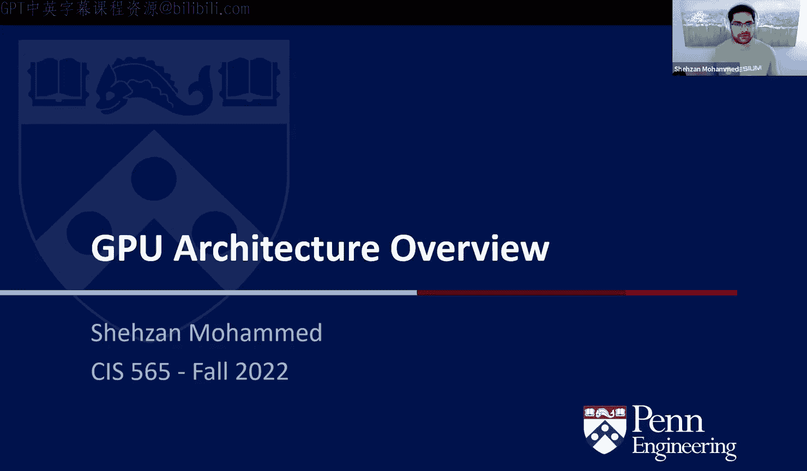
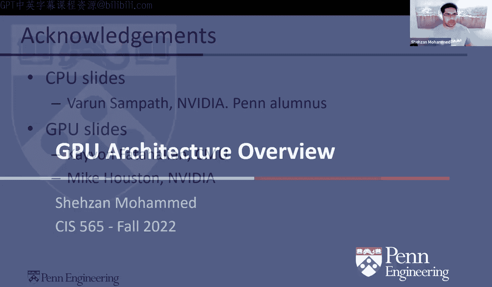
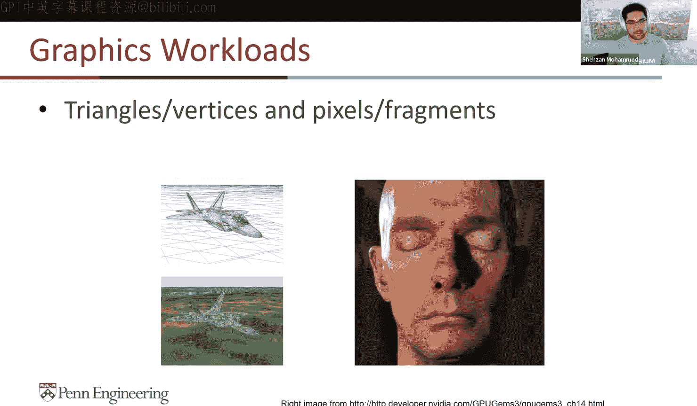
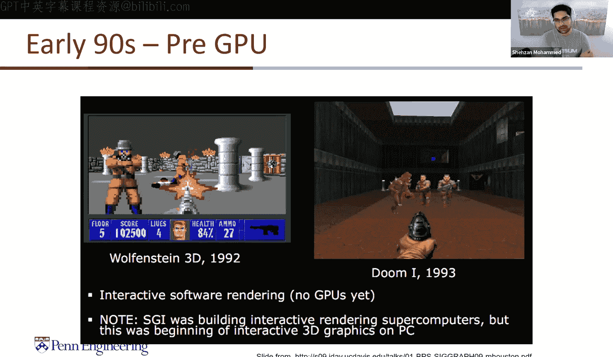
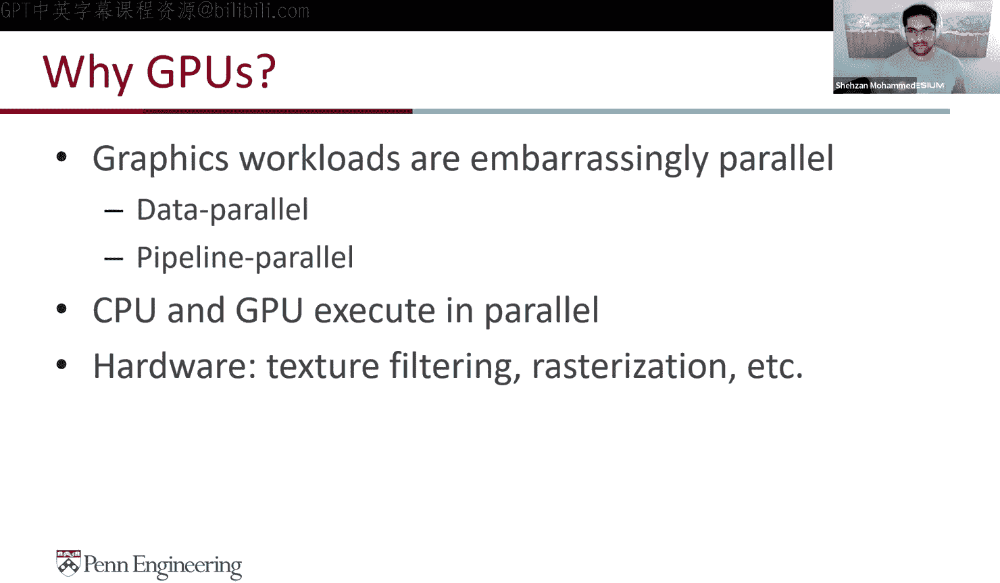
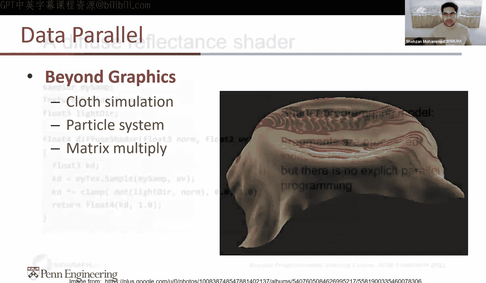
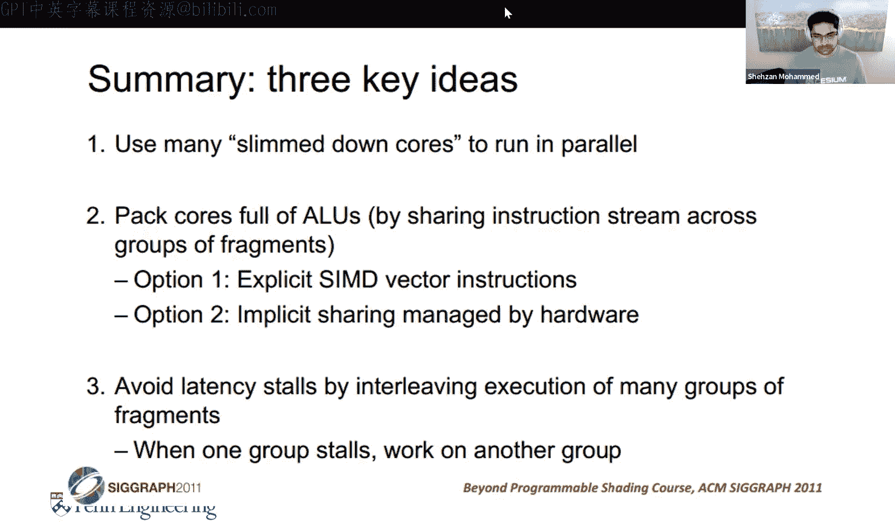

# GPU编程和架构：第5讲：GPU架构概述 🚀

在本节课中，我们将学习CPU架构的历史及其如何影响GPU的设计。我们将从CPU的基本原理出发，逐步构建一个简化的GPU模型，以理解现代GPU如何实现大规模并行计算。

## 课程概述 📖

大家好，欢迎来到今天的课程。由于紧急出差，我无法亲自到场，因此我将录制本次讲座供大家观看。本次讲座内容理论性较强，非常适合录播。我们将不讨论CUDA等具体框架，而是专注于理解CPU架构的历史及其对GPU设计的影响。我们将共同构建一个“CIS 565 GPU”模型。

## 性能衡量标准：FLOPS ⚡

首先，我们需要了解如何衡量计算性能。CPU和GPU的计算性能通常以**FLOPS**（每秒浮点运算次数）来衡量。这本质上是衡量处理器每秒能执行多少次乘法和加法运算。

现代GPU的计算能力已达到**万亿次浮点运算**级别，而超级计算机甚至达到了**千万亿次**级别。例如，几年前的高端CPU（如AMD Ryzen 9 3900X和Intel i9-10900K）的算力约为1-1.5 TFLOPS，而同期的GPU（如RTX 2080 Ti）则能达到16 TFLOPS以上，性能差距超过10倍。

这种性能差距不仅体现在独立显卡上，也体现在集成芯片（如NVIDIA的Tegra、Jetson系列或苹果的ARM架构芯片）上。GPU能够为并行计算算法提供远超CPU的算力。

## 性能趋势与限制 📈

自2008-2011年左右GPU开始崛起以来，其单精度和双精度浮点性能的增长速度远超CPU。内存带宽也在同步提升：CPU端有DDR4、DDR5，而GPU则采用了GDDR5、GDDR6甚至HBM（高带宽内存）技术。

连接CPU和GPU的PCIe总线带宽也在不断翻倍。从PCIe 3.0的约16 GB/s，到PCIe 4.0的翻倍，再到未来的PCIe 5.0和6.0，数据传输的瓶颈正在不断降低，使得使用GPU加速计算的额外开销越来越小。

然而，性能提升也面临限制：
*   **功耗与散热**：尤其是在超薄笔记本或移动设备中，功耗和散热限制了芯片的时钟频率。
*   **芯片尺寸与成本**：芯片的物理尺寸、制造成本和功耗在近年来显著影响了GPU的性价比分析。
*   **移动设备能效**：在手机等电池供电的设备上，优化算法以节省电量并高效利用计算资源变得至关重要。

## CPU架构基础 🖥️

为了理解GPU，我们首先需要回顾CPU的设计理念。CPU主要针对**轻量级线程化的桌面应用**进行优化，例如文本编辑器（Vim）或文件列表命令（ls）。这类应用的特点是：
*   包含大量**分支判断**。
*   频繁进行**内存访问**。
*   实际用于计算的**向量指令**占比极低（通常不到1%）。

这意味着CPU的任务不仅仅是追求最高计算性能，还需要高效地管理分支预测和内存访问。

### 简单的CPU核心

一个简单的CPU核心包含五个阶段，构成一个**指令流水线**：
1.  **取指**：获取下一条待执行的指令。
2.  **译码**：将指令解码为硬件可理解的操作。
3.  **执行**：在算术逻辑单元中执行该操作。
4.  **内存访问**：将结果写入寄存器或从内存读取数据。
5.  **写回**：将最终结果写回寄存器或程序计数器。

在简单的设计中，一个时钟周期只能完成一条指令的所有阶段，硬件利用率很低。

### 流水线与指令级并行

为了提高利用率，现代CPU采用了**深度流水线**技术。它将指令执行过程拆分成更多、更细的阶段（如Intel Core 2有14级，Pentium 4有20级）。这样，不同阶段可以同时处理多条指令的不同部分，实现了**指令级并行**。

**公式**：`吞吐量提升 ≈ 流水线级数`（理想情况下）

流水线化显著提高了时钟频率和吞吐量，但也带来了挑战：
*   **增加延迟**：单条指令完成所需的总时间可能增加。
*   **增加硬件复杂度**：需要更多晶体管来控制流水线。
*   **依赖性与分支**：需要处理指令间的数据依赖和条件分支带来的不确定性。

### 分支预测

条件分支（如if-else语句）会中断指令流的连续性。CPU无法在分支条件计算完成前知道下一条指令是什么。解决方案有两种：
1.  **停顿**：等待分支结果，但这会降低性能。
2.  **预测**：预测分支最可能走的方向并提前执行相应指令。如果预测错误，则丢弃已执行的结果并重新开始。

现代CPU的硬件和编译器协同工作，分支预测准确率可达90%以上，这极大地提升了性能和能效。但代价是：
*   需要更多晶体管来实现复杂的预测逻辑。
*   增加了取指阶段的延迟。
*   曾引发过如 **Spectre和Meltdown** 这样的硬件安全漏洞，攻击者可能利用分支预测执行来访问本不该访问的内存。

### 内存层次结构

内存系统遵循一个原则：**容量越大，速度越慢**。
*   **SRAM**：用作CPU的L1、L2、L3缓存。速度极快（纳秒级），但容量小（几MB到几十MB）。
*   **DRAM**：系统主存（如16GB DDR4）。容量大（GB级），但速度较慢（几十纳秒）。
*   **闪存/SSD**：存储设备。容量巨大（TB级），但速度更慢（微秒到毫秒级）。
*   **HDD**：机械硬盘。容量大，但速度最慢（毫秒级）。

延迟主要来自**寻址时间**，而非实际的数据读写时间。缓存技术通过利用两种局部性来提升效率：
1.  **时间局部性**：最近被访问的数据很可能再次被访问。
2.  **空间局部性**：访问一个内存地址后，其邻近地址很可能也被访问。

CPU的缓存层次通常包括核心私有的L1指令/数据缓存、共享的L2和L3缓存，然后是主存和硬盘。

### 现代CPU架构剖析

观察现代CPU芯片的布局图可以发现，很大一部分晶体管面积（约25%）被**L3缓存**所占据。其余部分包括多个CPU核心、内存控制器、I/O控制器以及集成GPU/媒体处理单元。这凸显了CPU设计中对**缓存和内存子系统**的巨大投入。

## 从CPU到GPU的演进思路 🔄

上一节我们介绍了CPU如何通过流水线、分支预测和缓存来优化串行和轻度并行程序。本节中，我们来看看如何将这些思路推向极致，以支持GPU所需的大规模并行。

### 超越流水线：更多并行策略

CPU除了指令级并行，还采用其他技术：
*   **超标量**：在一个时钟周期内，从同一指令流发射多条指令到多个执行单元（加宽流水线）。
*   **乱序执行**：硬件动态分析指令间的依赖关系，重新排序执行，以填满流水线气泡。
*   **向量指令**：单指令多数据。例如SSE（操作4个浮点数）、AVX（操作8个浮点数），对同一数据执行相同操作。
*   **线程级并行**：
    *   **同时多线程**：在单个核心上交错执行多个线程的指令，以隐藏单个线程的延迟。
    *   **多核心**：在芯片上复制多个完整的CPU核心。现代架构还采用“大小核”设计，兼顾高性能与高能效。

然而，即使采用这些技术，现代CPU也只能同时处理几十个线程。那么，GPU是如何实现成千上万个线程并行执行的呢？

### GPU的工作负载特征

GPU的爆发式增长源于其擅长处理高度并行的工作负载：
1.  **图形渲染**：对数百万个三角形顶点和屏幕像素应用相同的变换、光照和着色计算。
2.  **通用计算**：矩阵运算、物理模拟、粒子系统、机器学习等。这些任务同样具有“单指令，多数据”的特征。

早期游戏（如《德军总部3D》、《毁灭战士》）完全由CPU软件渲染，证明了图形计算本质上是并行的。随着硬件发展，GPU不仅包含可编程的着色器核心，也保留了用于纹理过滤、光栅化等任务的**固定功能单元**，以在提供高性能的同时保持硬件效率。

## 构建“CIS 565 GPU” 🛠️

现在，让我们基于CPU的设计理念，一步步构建一个简化的GPU模型。

### 起点：一个简单的着色器核心

考虑一个在数百万像素上运行的片段着色器。其核心模式是：输入一个像素，执行一系列相同操作，输出处理后的像素。

最初，我们可以设计一个类似简单CPU的核心：取指/译码、ALU、执行上下文（寄存器）。但这样效率太低。

### 核心理念1：用晶体管换更多ALU

CPU将大量晶体管用于分支预测、乱序执行等控制逻辑以优化单线程性能。GPU的第一个设计转变是：**削减复杂的控制逻辑，将节省出的晶体管用于增加算术逻辑单元的数量**。

首先，我们在一个核心内复制多个ALU。但每个ALU都有自己的取指/译码单元，而所有像素执行的是相同的指令，这是一种浪费。

### 核心理念2：共享取指/译码，SIMD执行

因此，我们让**一组ALU共享一个取指/译码单元**。所有ALU在同一时钟周期执行相同的指令，但操作不同的数据（来自各自的执行上下文）。这实现了硬件层面的**SIMD**。

此时，一个“核心”包含1个取指/译码单元和多个ALU（例如8个），每个ALU有自己私有的寄存器上下文，同时它们还可以访问一块共享的存储空间。这开始类似于CUDA中的**线程块**概念：线程私有寄存器 + 共享内存。

### 核心理念3：复制核心，构建多级并行

接下来，我们在芯片上复制多个这样的核心。假设有16个核心，每个核心有8个ALU，那么就能同时处理 `16 * 8 = 128` 个片段。

不同核心可以执行不同的指令流，这提供了**线程块级**的并行。而核心内部的ALU组则提供了**线程级**的并行。

### 处理分支和内存延迟

在GPU中，分支和内存访问延迟会带来严重性能问题。

*   **分支分歧**：当一个ALU组（例如8个ALU）中的线程遇到条件分支时，如果部分线程走if路径，部分走else路径，GPU会先执行所有走if路径的线程，让else路径的线程等待，然后再切换执行else路径。这会导致ALU利用率下降。最坏情况是每个线程都走不同路径，利用率降至 `1/8`。
*   **内存延迟**：从全局内存读取数据需要数百个时钟周期，如果线程在读取数据时只是空等，硬件将完全闲置。

### 核心理念4：零开销上下文切换，隐藏延迟

GPU的解决方案是**大幅增加每个核心内可驻留的线程数量**，并实现快速的上下文切换。

我们不再让一个核心只管理8个线程（与其ALU数量一致），而是让它管理更多线程（例如32个）。这些线程被组织成若干组（在CUDA中称为**Warp**）。

当一组线程因等待内存数据而停顿时，核心的调度器会立即切换到另一组就绪的线程，继续执行。由于线程上下文（寄存器状态）都保存在核心内的高速存储中，这种切换几乎**零开销**。

通过这种**时间切片**的流水线式执行，虽然单个线程的完成时间可能略有增加，但整个核心的吞吐量得到极大提升，有效地隐藏了内存访问延迟。

### “CIS 565 GPU”规格总结

根据以上理念，我们设计的GPU模型如下：
*   **16个流式多处理器**：相当于我们模型中的“核心”。
*   **每SM包含8个ALU**：共 `16 * 8 = 128` 个ALU。
*   **16个并行指令流**：每个SM可独立执行不同指令。
*   **每SM支持4个Warp上下文切换**：共 `16 * 4 = 64` 个并发交错的指令流。
*   **总计并行处理片段数**：`64个Warp * 8线程/Warp = 512` 个线程。
*   **理论算力**：在1 GHz时钟频率下，可达约256 GFLOPS。

## CPU与GPU架构对比 🆚

最后，我们来总结CPU与GPU架构的关键区别：

| 特性 | CPU | GPU |
| :--- | :--- | :--- |
| **设计目标** | 优化低延迟、强通用性、复杂控制流的**串行任务**。 | 优化高吞吐量、规则控制流的**数据并行任务**。 |
| **核心结构** | 核心数量少（通常<32），但每个核心功能强大（深流水线、乱序执行、大缓存）。 | 核心数量极多（成千上万），但每个核心简单（顺序执行、小缓存），专注于计算。 |
| **晶体管用途** | 大量用于控制逻辑（分支预测、乱序执行）和缓存。 | 绝大部分用于ALU计算单元和寄存器文件。 |
| **内存系统** | 强调低延迟访问，大容量多级缓存。 | 强调高带宽访问，缓存层次相对简单，全局内存带宽极高。 |
| **并行模式** | 指令级并行、向量指令、多线程。 | 大规模线程级并行，硬件管理的SIMD/SIMT。 |
| **适用场景** | 操作系统、应用程序逻辑、数据库事务等。 | 图形渲染、科学计算、机器学习训练/推理等。 |

### 带宽限制与计算限制

GPU的性能并非总能完全发挥。考虑一个向量逐元素乘法的例子：
*   **计算需求**：GTX 480显卡在1.4 GHz下每秒可进行约 `1.4G * 480 = 6720亿` 次乘法。
*   **带宽需求**：为了保持所有计算单元忙碌，需要高达 **7.5 TB/s** 的内存带宽。
*   **现实带宽**：GTX 480的实际带宽约为 **177 GB/s**。

因此，该任务在GTX 480上的理论效率只有 `177 GB/s / 7.5 TB/s ≈ 2%`。但由于GPU的绝对算力远超CPU，即使效率很低，其速度仍然是CPU的8倍。

这类问题被称为**带宽限制型问题**。反之，如果内存供给数据的速度足够快，但ALU计算跟不上，则属于**计算限制型问题**。优化算法时需要识别并针对不同的瓶颈进行处理。

## 课程总结 🎯

本节课中，我们一起学习了从CPU到GPU的架构演进思路：

1.  **精简核心，增加ALU**：将用于复杂控制逻辑的晶体管转化为更多的计算单元。
2.  **共享控制，SIMD执行**：让一组ALU共享指令流，高效执行“单指令，多数据”任务。
3.  **零开销切换，隐藏延迟**：通过驻留大量线程和硬件管理的快速上下文切换，掩盖内存访问等长延迟操作的影响。

这三大核心理念构成了现代GPU高性能并行计算的基础。GPU本质上是一个由大量简化计算核心、固定功能单元和高带宽内存系统组成的并行处理器，其调度器负责将海量计算任务映射到这些硬件资源上。

下次课程（周三）将是关于项目三“路径追踪器”的专题辅导课。这是一个深受同学们喜爱的项目，期待大家创造出优秀的成果。谢谢观看，我们周三再见。