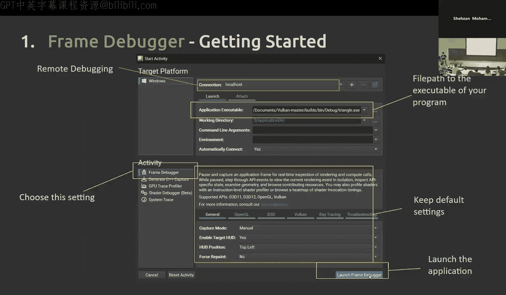
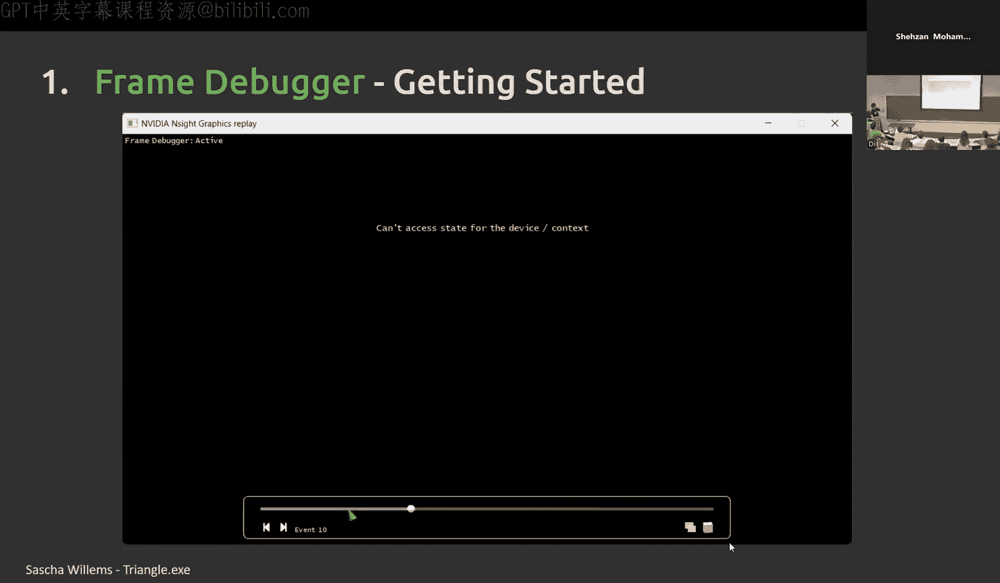
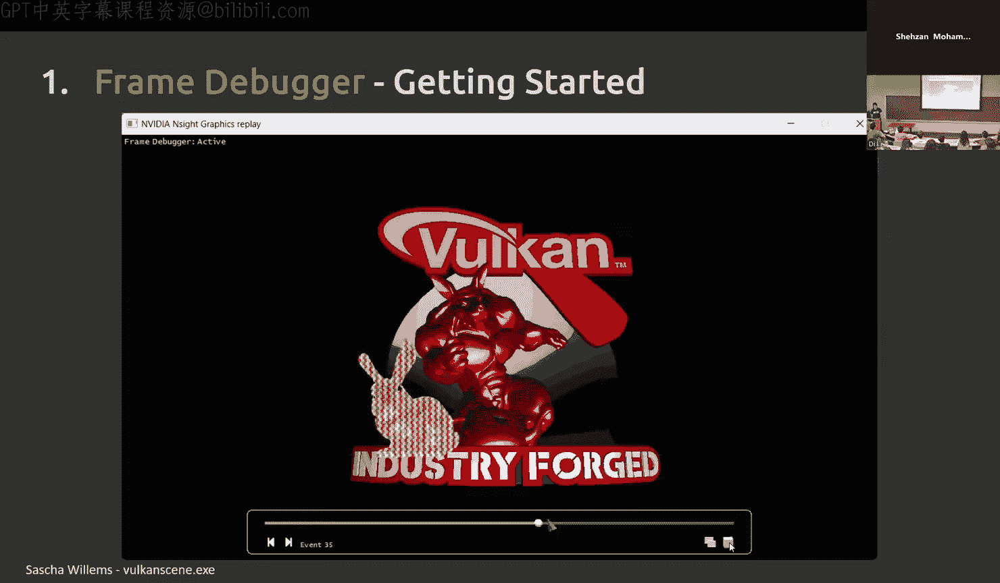
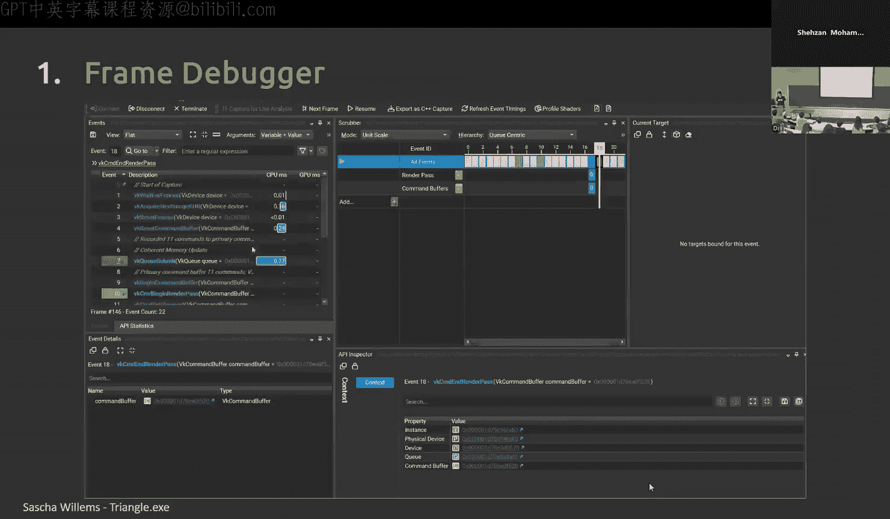
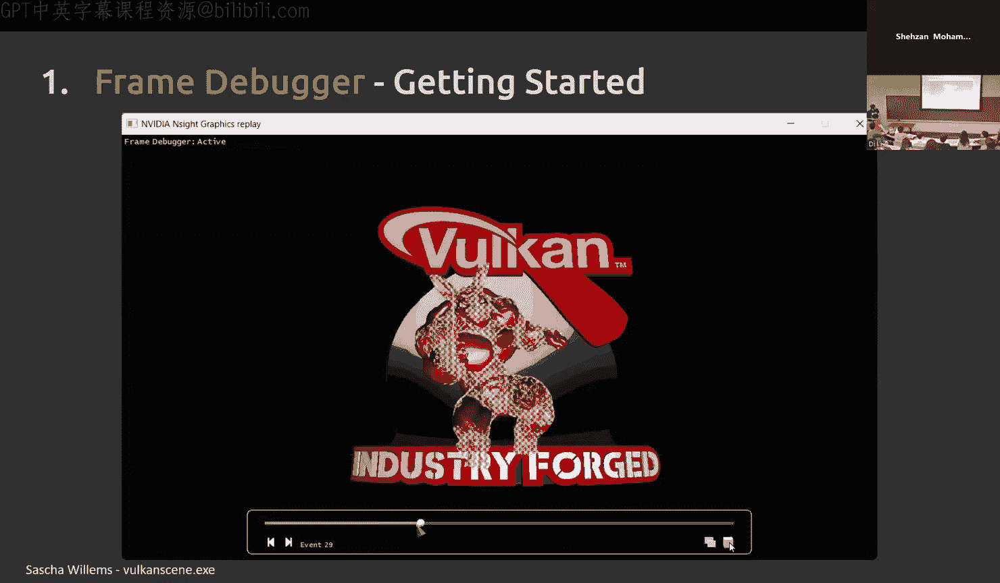
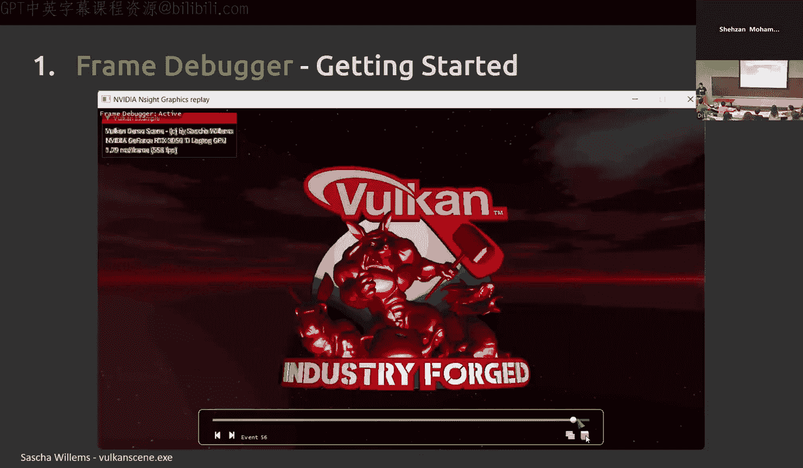
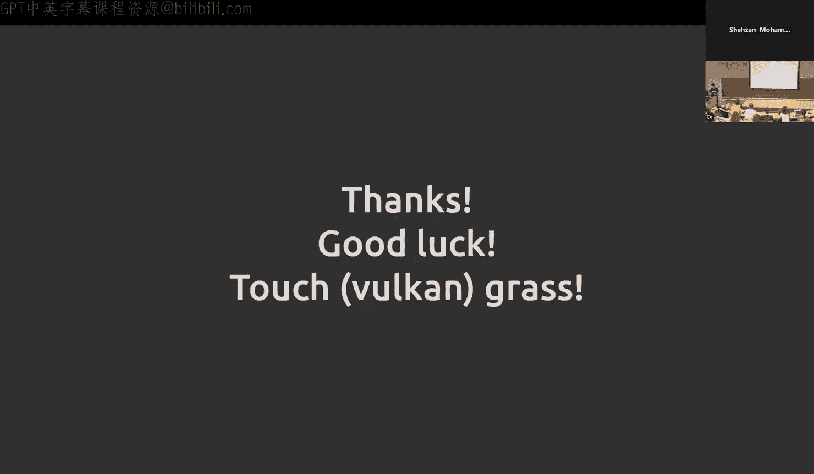

# GPU编程和框架：课程编号：NVIDIA Nsight Graphics 工具介绍 🚀

在本节课中，我们将学习NVIDIA Nsight Graphics工具。这是一个强大的图形应用调试和性能分析工具，能帮助我们深入理解GPU的行为，优化图形和计算工作负载。我们将重点介绍其两个核心功能：帧调试器（Frame Debugger）和GPU追踪（GPU Trace）。

## 工具概述与生态系统 🌐

上一节我们介绍了课程目标，本节中我们来看看Nsight Graphics在整个Nsight工具生态系统中的定位。

Nsight是NVIDIA为开发者提供的一系列工具套件，旨在帮助程序员更好地理解和优化其应用程序的性能，并进行调试。目前主要的独立应用包括：
*   **Nsight Systems**：用于分析CPU工作负载。
*   **Nsight Compute**：用于分析CUDA内核。
*   **Nsight Graphics**：用于分析和调试图形与游戏应用。

典型的工作流程是：首先使用Nsight Systems确定应用是受CPU限制还是GPU限制。如果确定是GPU限制，则根据具体用例（图形渲染或通用计算）选择使用Nsight Graphics或Nsight Compute进行更详细的分析。

Nsight Graphics主要有两个核心功能：
1.  **帧调试器**：提供对应用程序单帧的逐绘制（draw-by-draw）回放。它允许你检查渲染错误、查看GPU上的资源和管线状态。这对于确保正确使用图形API和设置渲染管线非常有用。
2.  **GPU追踪**：一个性能分析工具，用于了解各项操作的执行速度、各硬件单元的吞吐量，并提供逐着色器代码行的性能信息。

## 帧调试器深度解析 🔍

上一节我们概述了Nsight Graphics，本节中我们来看看帧调试器的具体功能和使用方法。

### 启动与捕获流程

当你打开Nsight Graphics时，首先看到的是登陆页面。要开始新会话，请点击“连接”按钮。连接窗口允许你进行远程调试，但大多数情况下，你将从本地机器启动应用程序。你需要在此处填入应用程序可执行文件的路径、工作目录以及任何所需的命令行参数。

以下是可用的活动列表，帧调试器是其中之一。你还可以选择每个API的设置或通用的捕获方式。准备就绪后，点击“启动帧调试器”。应用程序启动后，按F11即可进行捕获。

捕获完成后，你将看到刚捕获的帧被逐绘制地回放出来。

### 用户界面导览

帧调试器的整体界面包含大量信息，我们将逐一介绍各个部分。

顶部的通用设置包括：
*   **断开连接**：停止帧调试器，但程序继续运行。
*   **终止**：停止程序并结束帧调试器会话。
*   **下一帧**：分析下一帧。
*   **恢复**：让应用程序继续运行，以便手动进行另一次捕获。
你还可以将帧导出为C++捕获文件，以便独立地逐步执行。

### 核心功能面板

**事件查看器**
这是一个记录的API命令列表，也包括与设置命令队列相关的内容。你可以用它来控制和导航会话。点击某个事件，程序的其他部分会自动高亮显示。它按执行顺序提供了帧相关的所有命令列表。

事件查看器中的命令顺序与你编写的代码顺序基本一致。例如，在Vulkan三角形示例的渲染函数中，你会首先看到`vkWaitForFences`，然后是获取下一个渲染目标的`vkAcquireNextImage`，接着是重置围栏和命令缓冲区，最后是开始记录命令到缓冲区的`vkBeginCommandBuffer`。

一旦开始命令缓冲区，你就可以开始记录命令。在开始渲染通道（`vkBeginRenderPass`）之后，你会设置视口、剪刀等命令，执行绘制索引（`draw indexed`），结束渲染通道。所有这些命令都会按顺序出现在这里。完成后，调用`vkEndCommandBuffer`。

从代码角度看，你需要在将缓冲区提交到队列之前记录命令。然而，从GPU的角度看，它首先接收到队列提交，然后才开始执行缓冲区上的所有命令。这就是为什么在API列表中，这些命令都出现在你的队列提交调用之后。

**擦洗器**
这是事件查看器的水平视图，你可以通过点击事件ID来浏览所有事件。它提供了以队列为中心或以线程为中心的层次结构视图，你可以选择任意一种查看方式。例如，如果一个应用程序先使用了计算着色器，然后使用了图形管线，你会看到先在计算队列上做了一些工作，之后在图形队列上使用了这些结果，并按队列分开显示。

**当前目标视图**
显示当前正在输出到屏幕的内容，并显示输出目标，如颜色缓冲区、深度缓冲区和模板缓冲区。

**事件详情**
允许你查看传递给每个API调用的参数。你还可以点击这些链接来检查每个参数本身。

**API检查器**
这是大部分信息的来源。例如，如果你的命令在图形管线上，你会在左侧看到输入装配器、视口、顶点着色器、光栅化、片段着色器等选项卡。每个选项卡都提供了相应阶段的信息。

以下是各选项卡提供的信息：
*   **管线信息**：显示你设置的管线状态，是检查设置是否正确的好地方。
*   **渲染通道**：所有设置阶段都应与此处匹配。
*   **输入装配器**：在此阶段应看到顶点信息输入。例如，链接到缓冲区的顶点绑定可能包含三角形顶点的位置和颜色数据。
*   **视口**：大多数情况下只告诉你宽度和高度。
*   **顶点着色器**：告诉你预期的输入和输出，以及使用的任何统一变量。这是检查你是否正确传递和使用这些变量的好地方。
*   **光栅化状态**：包括多边形绘制模式、正面、深度偏置等设置。
*   **片段着色器**：告诉你输入和输出，也可以在此查看源代码。
*   **像素操作**：显示你设置的像素操作方式。
*   **上下文信息**：提供关于物理设备、逻辑设备、所在队列、当前命令缓冲区、管线布局和渲染通道的信息。

如果你使用的是计算着色器或在计算队列上，则不会看到上述图形管线信息，而是看到专门的计算着色器信息，例如管线着色器阶段为“计算”，可以查看源代码和计算模块等。

对于包含曲面细分控制和曲面细分评估的图形管线，它们也会显示在这里，并提供类似的信息。

**API统计信息**
提供CPU时间和GPU时间的粗略概览。虽然这不是进行性能分析的主要地方，但可以从此开始思考性能问题。它会告诉你哪些API调用执行了多长时间。

**几何视图**
允许你检查应用程序是否试图绘制所有正确的三角形。

**所有资源**
允许你查看绑定到GPU的资源。例如，这可以代表等待绘制的不同管线帧，以及变换矩阵、顶点数据等。它还提供了你所选资源的每个修订版本的视图。

**像素历史**
你可以检查这些资源上单个像素的历史记录。打开像素历史会带你回到资源选择器，选择要查看的资源后，会看到所有不同的修订版本。点击任意一个版本，然后选择目标像素，它将给出该单个像素的精确修订历史，以及是哪些绘制调用或调用修改了这些像素。

如果你有加速结构，它也会作为资源的一部分显示出来。点击它会带你进入加速结构视图。

**着色器分析器**
着色器分析器是GPU追踪和帧调试器共有的功能，但帧调试器版本显示的信息较少。不过，帧调试器版本允许你实时编辑和编译着色器。

例如，导航到源代码视图，选择你感兴趣编辑的着色器。会弹出一个小窗口，左侧是原始视图，右侧是你可以编辑的区域。假设你有一个Vulkan计算粒子示例，你决定不希望颜色是彩虹色，而希望它们都是蓝色，你可以在此处编辑，然后按“编译”。随后的回放将显示你刚刚所做的更改。

**关于修订版本**
修订版本是指图像发生的任何更改。它不一定对应每一帧，因为在单帧内你会看到多次绘制。它更像是每次资源被修改（可能由不同的API调用引起）时创建一个新的修订版本。

**实时编辑的限制**
帧调试器只能捕获一帧。你对着色器所做的任何更改都只应用于当前帧的回放。当你按“下一帧”捕获下一帧时，它将使用原始应用程序的数据，而不会读取你新修改的着色器信息。实时编辑功能主要是为了快速原型设计，减少代码修改、构建、部署和查看结果所花费的时间。

## GPU追踪与性能分析 ⚡

上一节我们深入了解了帧调试器，本节中我们来看看GPU追踪工具，它用于分析应用程序的性能。

GPU追踪本质上是一个性能分析工具，它允许你查看GPU上的单元吞吐量和线程束使用情况，并提供着色器性能分析信息。其动机在于，GPU追踪允许你观察GPU上随时间运行的工作负载，而帧调试器只显示事件索引。它还能让你看到哪些工作负载花费了最多时间和资源，以及它们具体发生在帧的哪个位置。这样，我们可以确定性能限制因素，最终目标是减少帧或工作负载的运行时间，或提高FPS。

### 捕获与GPU概念

首先，我们谈谈如何捕获追踪。在设置中选择GPU追踪分析器，你可以设置每个GPU的设置（通常能自动检测），在“追踪设置”中，你可以选择手动触发或等待一定帧数或提交次数。建议打开“实时着色器分析器”以获取着色器信息。

与帧调试器类似，准备好后按F11。但与帧调试器不同，GPU追踪不是基于回放机制构建的，因此不会有逐绘制的回放。

在深入细节之前，我们需要了解一些GPU概念：
*   **GPU饥饿**：意味着你没有给GPU足够的工作。
*   **延迟限制**：意味着GPU完成某些操作需要很长时间。
*   **吞吐量限制**：意味着单元一次可以执行的最大操作数已超出。
*   **延迟**：考虑的是**时间**。
*   **吞吐量**：考虑的是**数量**。

你需要关注的关键指标包括：
*   **GPU活跃度**：表示GPU的利用率。
*   **单元吞吐量**：显示GPU上哪些单元正以其最大性能运行。
*   **SM指令吞吐量**：是单元吞吐量的逻辑下一步，进一步细分SM单元的性能。
*   **SM线程束占用率**：告诉你平均在任何给定时刻，一个SM上有多少个活跃的线程束，以及它们是哪种类型的线程束。

“单元”指的是硬件中的各个独立单元。

### 像素着色器执行概览

简单回顾一下像素着色器在SM上执行时通常发生的情况：
1.  SM开始发出指令，线程开始活跃。
2.  当线程请求的信息不在本地时，它会向L1缓存发出请求；如果不在L1，则请求L2；如果还不在，则访问VRAM（全局内存）。
3.  最后，信息返回给SM，进行计算，然后像素通过ROP单元输出到屏幕。

### P3性能分析方法论

我们将讨论P3方法，即峰值性能百分比方法。这是由NVIDIA的开发者技术工程师Louis Bavoil在2019年GDC上提出的，是开始优化工作负载的一个非常好的方法。

方法步骤如下：
1.  **查看GPU活跃度**：如果低于95%，转到Nsight Systems，找出你没有给GPU足够工作的原因。如果大于95%，则开始查看顶部单元吞吐量。
2.  **查看顶部单元吞吐量**：
    *   如果**低于60%**，意味着该单元没有完成很多操作，可能是你没有给它足够的工作，或者它完成当前工作花费了很长时间。例如，如果该单元是VRAM，你可能需要减少VRAM访问。
    *   如果**高于80%**，但工作负载仍然很慢，那么向该单元添加更多工作不一定会让它更快。此时，你可以尝试将工作从这个单元转移出去，放到其他单元上，以便其他单元能更快地完成这些工作。

### 案例分析：粒子群模拟优化

我们通过一个案例来实践P3方法。这是2022年的一个粒子群模拟项目，需要从均匀的内存访问模式转变为连贯的内存访问模式。

在调试模式下，对包含50万个粒子的均匀网格进行追踪，CUDA内核执行了约252毫秒，帧率极低。切换到连贯网格后，内核时间下降到约200毫秒，改善不大。然而，在发布模式下，差异变得非常显著：均匀网格约38毫秒，而连贯网格约2.7毫秒，性能提升超过10倍。

我们使用P3方法分析均匀网格版本：
1.  GPU引擎活跃度大于95%，符合在Nsight Graphics的GPU追踪中分析的条件。
2.  查看顶层吞吐量：发现L2和VRAM吞吐量很高，但SM吞吐量异常低，尽管正在执行内核。
3.  查看SM线程束占用率：大多数活跃线程束是CUDA线程束，这很正常。
4.  查看平均线程束延迟：这个指标衡量绝对着色器性能，显示一个线程束的平均存活时间约为120万个周期，这相当长。
5.  查看SM线程束在发出阶段停滞的原因：顶部指标是“长记分牌”，平均约有72%的线程束因为等待长记分牌而无法启动。

**理解记分牌**
*   **短记分牌**：指不导致SM停滞的可变延迟指令，例如平方根、超越函数等。
*   **长记分牌**：指导致SM停滞的可变延迟指令，例如纹理读取、缓存读取等。

从分析中我们了解到：
*   大部分时间花在获取数据上，而不是执行指令。
*   单个线程束的平均寿命非常长。
*   依赖于数据的指令可能导致SM停滞。

可能的原因包括：
*   **缓存颠簸**：当一个粒子读取其邻居的位置或速度时，每次访问都会带入一个缓存行（大约128字节）。如果下一个邻居的数据在内存中不相邻，这个缓存行就需要被替换，导致不断向全局内存发出请求，从而引起缓存颠簸。
*   **内存延迟**：随机内存访问效果不佳，因为内存控制器难以预测和预取数据。

**优化措施**
通过着色器分析器查看热点，可以发现访问位置向量的代码行占据了大量样本。样本数量可以近似代表执行时间。因此，优化措施是：**根据位置对粒子的位置和速度数据进行排序，使得在空间中靠近的粒子（更可能相互读取）的数据在内存中也靠近存放**。

**优化结果**
优化后，性能指标发生了显著变化：
*   SM吞吐量上升至83%。
*   L2吞吐量下降至18%。
*   VRAM吞吐量下降至约4%。
*   内核执行时间从38毫秒降至2.7毫秒。
*   平均线程束延迟从120万个周期降至约8.5万个周期。
*   因长记分牌而停滞的线程束比例从约68%降至20%。

### 用户界面与功能导览

GPU追踪的界面与帧调试器相似，但时间线现在会显示每项操作花费的时间。图形和计算队列的工作会分开显示。

主要视图和指标包括：
*   **时间线**：显示各项操作的持续时间。
*   **GPU活跃度**：显示GPU或复制引擎活跃的持续时间。
*   **顶层吞吐量**：我们之前查看过的各单元吞吐量。
*   **SM指令吞吐量**：进一步细分SM本身各单元的性能，如指令发出阶段吞吐量、ALU（整数运算）、FMA（浮点运算）等。
*   **SM线程束占用率**：如前所述，显示典型活跃SM上平均有多少线程束活跃，以及它们的类型。
*   **平均线程束延迟**：着色器性能的绝对测量值，显示在选定时间段内线程束的平均寿命。
*   **线程束发出停滞**：显示如果SM无法发出线程束，原因是什么（例如，在等待什么）。
*   **指标信息**：显示时间线信息中所有离散值的平均值，可以针对选定的帧、持续时间或整个报告进行计算。

**注意事项**：机器是否连接电源会影响帧的持续时间，因为它会影响性能。因此，为了获得可比较的结果，请确保在相同电源状态下进行分析。

**API事件列表**
与帧调试器类似，但也有所不同。在GPU追踪的事件列表中，你可以看到命令缓冲区对应于哪个命令队列，绘制调用对应于哪个命令缓冲区，提供了一个层次结构视图。对于同时执行的API，它们会分组显示为一个标签，而不是两个独立的任务。

**实时着色器分析器**
这与帧调试器中的呈现方式略有不同。
*   **指令混合**：告诉你着色器中哪种类型的指令占据了大部分。
*   **热点**：提供每个源代码行的细分，显示哪行代码花费了最多时间。
*   **火焰图**：以执行顺序显示所有着色器函数，每个条形的长度代表大约花费的时间（样本数），上面的后续条形代表调用的任何子函数。
*   **自上而下/自下而上视图**：函数排序视图，你可以看到函数被调用的上下文。
*   **着色器管线/对象/源代码**：应用程序中所有着色器的综合视图。灰色的着色器表示未检测到活动。你可以按管线对象、着色器对象或着色器源代码查看。
*   **着色器源代码视图**：此处不能编辑着色器，但会提供源代码视图与中间语言视图的对比。例如，对于Vulkan，你会看到GLSL视图和SPIR-V视图并排。

**追踪比较**
允许你比较优化前后的追踪文件。在优化前进行一次追踪，优化后再进行一次追踪，然后比较两者的性能，它会给出两个追踪文件之间所有指标的比率和对比。

## 总结与职业建议 💡

本节课中我们一起学习了NVIDIA Nsight Graphics工具的两个核心部分。

对于**帧调试器**，我们主要探讨了：
*   渲染问题排查。
*   管线状态检查。
*   资源检查。
*   实时着色器编辑。

对于**GPU追踪**，我们讨论了：
*   使用着色器分析器进行性能分析。
*   使用P3方法分析GPU工作负载的性能。
*   通过粒子群模拟项目的案例，实际演练了性能分析过程。

最后，分享一些职业和生活建议：
1.  **从零开始构建项目**：亲自动手搭建框架，这能让你在众多求职者中脱颖而出。
2.  **与同伴和他人共度时光**：在共同学习和解决问题的过程中相互学习，分享经验。
3.  **聪明地工作，善用工具**：利用调试器和其他工具提高效率，从长远看可以节省大量时间。
4.  **掌握小众知识**：学习他人不会的技能，或者付出额外的努力，这能真正让你与众不同。
5.  **保持现实的期望**：求职市场充满变数，优秀的候选人也可能被拒绝。尽你所能做到最好。
6.  **学习永无浪费**：花时间学习新事物，这些知识终将在未来以某种方式回馈你。

希望这些工具的介绍和职业建议对你有所帮助。记住，在学习和使用这些强大工具的过程中，你积累的每一分经验都是宝贵的。