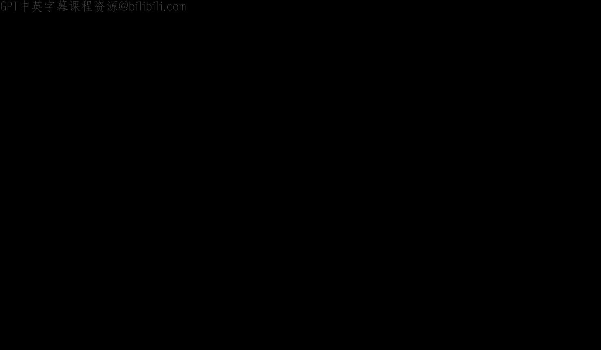
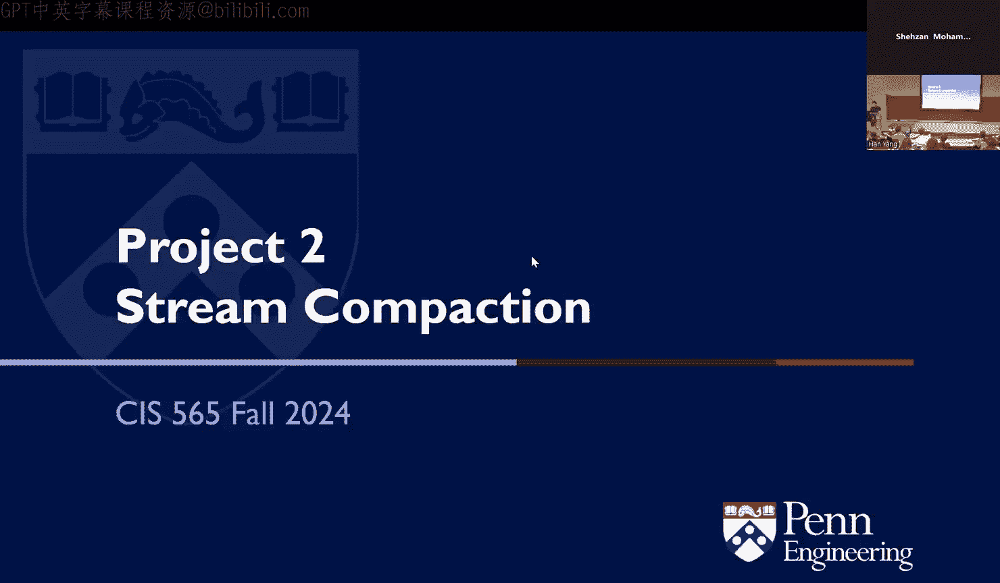
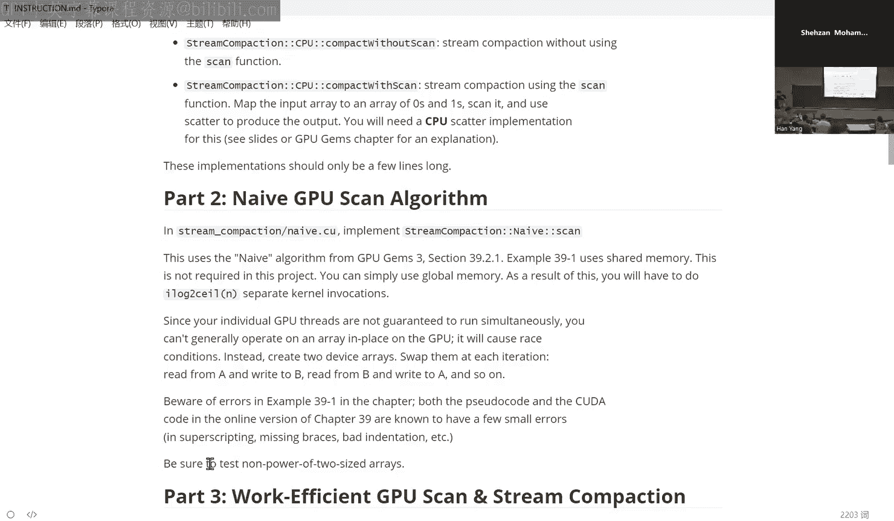

# uPenn《GPU编程和框架｜CIS 5650 GPU Programming and Architecture Fall 2024》中英（Claude-3.5 p07 2024-09-11 - 4 (Recitation).zh_en -BV1sRtresE67_p7-

Yeah。Hi， everyone。 like this project too is going be pretty different from previous one because like previous one。

 you are not like doing。Actual like really useful computation you're just like showing some fancy results and to give you the confidence to programming Ka。

 but for project to stream compaction， you are required to like implement some actual parallel algorithm。

😊，And to start with， we can implement some CPU algorithm。 So because you can sort of。

Get away with some kind of like。呃。Different kinds of problem you may encounter when you are writing Kuda。

 actually， So it is always a good practice if you are trying to implement some algorithm on GPU。

 But before that， you can always try to。Implement on the CPUs that's a good practice to do that and for the actual algorithm like Shazang already did the presentation on Monday that saved a lot of work for me so my like today's recit is going to be like fairly short so you're going to implement the naive and efficient algorithm in the separate C files so your C files is going to be called by some test files so there will be a CPU function in each of these naive and efficient C files。

And this CPU function will will be called by the task file so you can get the performance result。

And also the correctness of your program。And before I do you have any question for that， this page？

It's just。One thing alert， so。Compared to project one， which was you random。

 this is very deterministic。 Now bad was， but the output should always be an exactly the same result。

 So that's why doing the CPU implementation and getting it right， as that says。

 is extremely important because it's going to compare those of。

 And if your CPU implementation strong。Then you won' know if your GP implementation is character around。

 so it're important to spend some time to mention the CP implementation。Yeah。And after that。

 you can test s。Library for the scan and string compact algorithm， it is a fairly easy。

Saing you can just call the API， I mean so and。After all of this。

 you can also like try to implement some extra credits for using shared memory。

 that's an optimization。 and also you can。After you implement your efficient。Scan with share memory。

 You can also try to use。You can also try to avoid bank conflicts in shared memory。

 which will be will I think bank conflict is a conflict that we'll be introducing in next lecture。

Yeah， and。here， like， we already provide some upper function for you inside a common。

Do C and common dot age， which you can first implement first to look at those function signature and try to implement those function and you'll be like calling them a lot throughout your whole implementation。

And last， I think will be the performance timer。You can call the GPU or CPU timer inside your function calling。

And here we are using the SDD library to actually measure CPU time。And we are using Kutuda even。

 which is another very。Like useful concept for Kuda so you can use this event to keep track of your Ka program。

And some。Yeah， yeah isn something covered in classmark show So like how event will be like bookmark and you what time is events and。

 So it's very powerful。本人。Yeah， yeah。 And some tips for implementation is to。

When you are measuring time， be sure to exclude any memory operations such as like allocation or copy。

 so we only care about like the actual kernel running time。So， also。If youre are finding， youre like。

In theial implementation is GPU implementation is slower than CPU。

 You might want to check your kernel dispatch where。You can check。

 is there like a lot of stresss are doing nothing， so you can reduce the。

Number of stresss you're actually dispatching。Also， you can。

You can add like new files to the existing product， you can add like new Cs to this existing product。

 but currently our Baco doesn't support if youre trying to call one device function from another kernel from another kernel inside another file。

That's not supported。 You can only call like。The same device the device function from the same file。

And。Also， the ka kernels are as synchronous。 So you might need to use a gooda device synchronize to。

嗯。To actually wait for you to finish so you can get a consistent result。

And you can use a lot of like code intrinsics， such as a Po， Po F， which is the。can。

Which which is the internal function for KUa so you can get a more。Yeah。

 there's a floating pointarrow so you can get away with it using the Kudos's internal power。

And that before， like after all these tips， there is something I want to mention is that like。

After you actually implement， like finish all all of your implementation。

 you can like take some time to really think about like these。Algorithm to actually compare the。

Scan and the reduction。So。I mean， you can you can like easily get lost inside the details of the implementation。

 but without like knowing why this algorithm is designed the way it is。

 so you can take your time to think of these questions after you have implemented this and you can have a like much。

 much more deeper understanding of it if you like really think about it。Yeah， I mean。

 don't just like focus on implementation。 like it is always good if you can like learn the。

General idea behind parallel algorithm， if you like really。Trying to find white， white。

This this algorithm is designed this way。And always test in release mode。

 this has already been mentioned by。By第一 yeah。And yeah， that's it。

I will leave all the hard work to yours and good luck。What's。you给。But one。Colonels are sacred。

That means like it is on the CPU like they't be。Youing after。Yeah。But our。

 but I think we are using the default stream。 The default stream will be。例。SoSchronouslychronousYeah。

It is like it is especially true if you're doing like GPU programming you always need to think about the synchronization between CPU and GPU。

う。好好。嗯。I was going to。In part one。And by the instructions that doing the compact with scan。It says。

You will need a CPU scatter implementation for this。I know that was。It was in particular， like a CPU。

Just like copying the slides of white。Yeah， basically， basically。And again，'s no。

 there's no expectation that the CPU version is marked。研究新的事。啊。So what is scatter。

If you look at the slides， scatter the operation where you go from the data to checking the bits on the scan and then combine the it will come back。

So this your version is just take for us to wait yeah。

So it's like it's the core standard essentially that the GPU output is going to be tested against。

Yeah， no， yeah， you're going to have again， think about the readinging slides I showed last。

 You want to think about size of。 don't test around thousands elements。

 that's in the of the interview。 So you're thinking of that's say a million elements putting that into a test file and all of that is painful。

 So you generate the numbers random。Through the gold standard on the CPU。

 run it on the GPU and compare the you。 then you're more if youre getting the right。

That's why I get in the CPU version。Yeah， and CPU version is almost always easier than GPU version。

So yeah， you've ever tried something new you can。Almost always first tried CPU version。怎么么？是。

It's the unit tests that run as part of the。Like projectYeah， you can see the test code。

 you can debug in it， you can put points inside you test I make more。In a test code or want。Yeah。

 you need to mention you read me if you， yeah yeah。ゆずゆ thatろ。So yeah。

 I'm just going to say one thing about Yeah， so this project is one of those where before you submit。

 you know that getting。Unless you know something very wrong in your recommendation and you know。

嗯唔 check the for but。よ。Oh， also， I want to mention like if you have some。Yeah。

 questions about the algorithm。 You can like always reference to the our slides on Monday and also the G few James Cha 39。

 Yeah， G few James is the。Great book， and。Yeah， be sure to always check the books before you implement something。

And also think before you copy something。That's the question。 you can go back。Yeah。photo my it to。

Okay。Thank said this。Inment the naive algorithm from this section。

 I think there's a two algorithm Are we supposed to implement the second one the one double。呃。哦。

Are you talking about in place wasn maybe I just ski through。I saw like two coat snippets。谢谢。

I think it is just one。No， I think theres the there's two third of the last line basically a copy of and then Yeah。

 okay。And the other thing to remember is that。And this is life and place。Don't benchmark just once。

 you order run micro itrations of it and then average them out。

 so that's why swap them at each itration means each itration of the test。Yeah。Yes。私なの。Rest station。

 but with this buffer dropping。I at least in my implementation。

 the only way I basically was doing a food of men coffee from one buffer to the other for part of it on each iteration No no need to you can just like I was for what for the the output was becoming the input for the next iteration Yeah。

 but the input which is。Like I swap them， but then one of them I found that like at least。系。Minus。

N minus that， whatever， like there's some number of elements that you get to copy。So you're not。

 you're not necessarily。Checking performance on the many copies。

 but then that would be device device I think if you Yeah I think you asked a question。WithYeah。

 I think you dont need to actually copy it paper you can just swap the pointers instead of like copying the memory chunk。

 like normally you be way。Oh excuse。Ging one， great place。The council officers for this project。

诶这个是位。Okay。And then I think Han， you've sent me a message that。

Office hours on project deadline days are good now of course for this project project deadline is on a few date and we will have office hours as will be back to school so you have additional office hours so that'd be good and then for future project yeah that is something so you will be hear of special office hours and stuff for the coming weeks for especially for projects before months。

Yeah， just my takeaway is like after I was doing this， I， I'm like not surely like。😊。

I'm not like confidently understand how the algorithm is designed， but I like just implemented it。

And from the book， So yeah， I just encourage you to think more about it。 It's just that's all yeah。

Yeah。我 everybody。Right。

少可谂蚊。