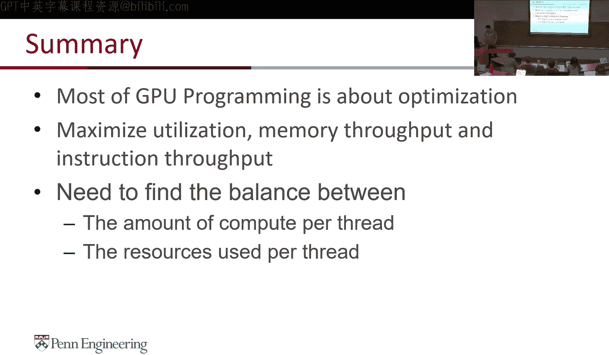
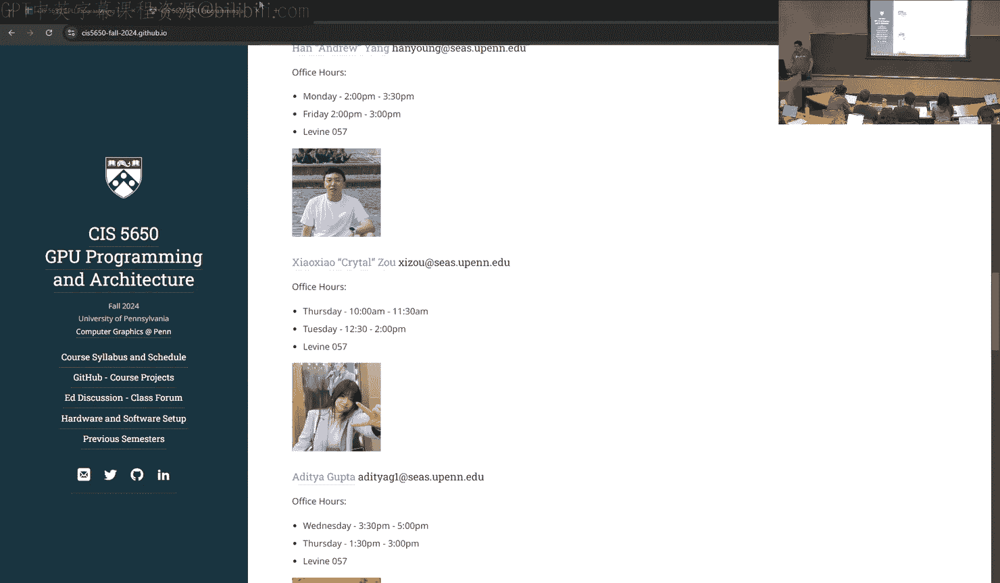
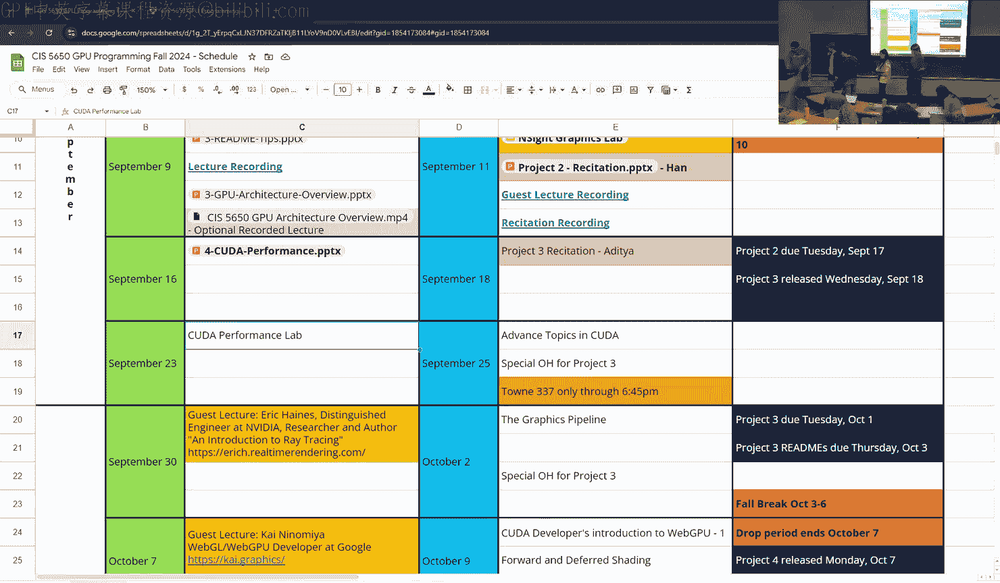

# uPenn《GPU编程和框架｜CIS 5650 GPU Programming and Architecture Fall 2024》中英（Claude-3.5 p08 2024-09-16 - 5-CUDA performance.zh_en -BV1sRtresE67_p8-

All right， so in today's lecture we' will start discussing more about performance。

 so we did intro to Kuda we did。Matrix edition， SxBY matrixtri multiplication and last week we took a look at some of the algorithms and how you take what are commonly CPU algorithms serial in most cases sequential and convert them into parallel algorithms and then add some performance right in this lecture we dive more into that performance side of things how do you take what is a naive algorithm and how do you make it faster by just thinking in a different way and thinking a lot more about memory and stuff I' also caveat that usually I do coda performance in like two or two and a half lectures by calling the second part the performance lab a lot of the slides do overlap so it's like I cover them twice I'm going to try a new thing this year where I may jump between those slide decks because I haven't combine them so。

Bear with me as I do that， I'll try to make the slides available as much as possible。Okay。So。

All right， so some slide acknowledgements。 So in this。

In this lecture we'll cover these kind of topics here we want to think about performance in different ways。

 we want to think about utilization which you know again if you think back to D's gear lecture there were these different vectors that De said you know we could opt our performance on so this is kind of like that maximizing utilization which is saturating the GPU and making sure that there's enough work for the GPU to do。

Maximizing memory throughput， which means optimizing the bandwidth and then maximizing instruction throughput。

 which is how do we make sure that we are essentially pipelining our instructions in a way that's optimized。

Just the basic equation of performance。If you have efficient data parallel algorithms and you combine that with an optimized GPU architecture that can add a super amount of parallelism。

 you maximize your performance， our entire lecture is basically going to be this equation here okay。

All right， so let's revisit parallel reductions。How many of you remember this from last lecture？

Okay not going to do a quiz， but let's let's take a look so here's here's what we did last time we had a vector here eight elements for the sake of slides but could be a lot more。

😊，And we added two elements， then added two elements。And then added two more elements。

 right and this gave the reduction。What were some of the properties of this？

What are some things you can notice in this diagram that you can immediately call out as potentially characteristics of the algorithm or maybe even performance problems of the algorithm？

I place。It's in place here， which can be good or bad depending on your workflow。在劳劳公司。Yeah， exactly。

 look， this last thing， seven threads aren't doing anything。😊。

Like you have to have like login like layers so it'll be like sync through their implicationss。

other things you notice。Number of elements is power of2 and we discussed that in the last classes for this algorithm to work。

 you always need to pad your vectors。other properties of this。Okay。嗯。

One of the other things you'll see is。The indexing pattern， right？

We are always adding to the right and the last element is where the result gets stored。Right。

What if we？😮，Flipus。Sorry。That was dramatic。What have you flipped this？Again。

 no change in the algorithm， it's not going to change performance at all。😡。

But what it is going to do is it will build up to some of the performance improvements we want to make so again this is this is a thing you you will have to think about is that mirroring pattern as well。

So here's our algorithm， okay？😊，And here's what our equation for that will look like and this is you know within a block so we have our shared memory。

 we have our stride， we have the sync thread as you get called out and then we have this equation here so again if you look at the diagram。

Look at the look at the mods here or the indices， zero，2，4，6。040 right much much easier to index。

 even if you have padding or not or powers of  two or not， this is much easier to index。

So that's what we have here is this T， which is the index。

More two times stride equal this equal zero is bad programming。

 but I want to make it explicit here like you never have if you are writing double equals zero just don't。

😊，And this goes beyond GPU programming， and just don't write this part。

And then you can do the sum here， which kind of gets you this diagram。Any questions about this？

So I'll walk through here once again， compute partial sum。

 we have the stride and then the stride sync threads I think we already discussed why and then we have this so there's a question down here as stride increases what do more threads do and that was answered before that more threads don't do anything。

RightBut let me take any other questions on this before we move on。Everybody understand。Okay。

 all right， so heres， here's a pattern of。How many threads are not doing work。

 so this is eight threads right or eight elements with eight threads。In the first iteration。

Already four threads are not doing anything。You have eight elements。You launch with eight threads。

And already in the first step， four threads are not doing anything。They may have read the memory。

 but they are not doing anything more。😡，So。You really need only n by two threads for n element。

 so that's the first optimization you want to make。In the next iteration， only threads2 and are。Now。

 in addition to 1，357，2 and six are also not doing anything， so now you're done to 25% utilization。

You launch right threads， now only two are doing actual work。In the final verse。

 only one thread is doing actual work， seven threads are not doing anything。

So this is pretty bad utilization of your GPU。It may still be way faster than the CPU。

 but it's pretty bad utilization and we can improve that。

So the pattern that we are noticing here is that at each itration at each log and depth we only we are having the number of threads we use right so and this is something we want to optimize。

So。How can we tweak this implementation， what do you guys think。

 so I'll pull back here what are things we can do in this implementation to make it better？

But to do more work。On the first iteration you can have。Yeah。Yeah。

 and we'll take a look later in the slides。So I don't know if this will actually help but instead of saying like if equals zero do thing。

 we can just say if not equals zero return and just like stop doing computation you mean you mean for these threads。

 potentially yeah。And then you would need to get the shared memory back。So we'll get to that。

 you'll see how next idea makes sense in a little bit。As it yet， did you have an idea no？

Any other ideas for this？Does this indexing make sense？嗯。

We might be able to like have things be like more local because like。

What do you mean by that as you go down the tree just like you have to reach further into Yeah。

 so how would how would you change this diagram？Like。

I guess possibly have a reshuffle step like at occasional intervals what is a simpler version of that idea？

Oh。I guess we can we can write to we can make it to that instead of writing to just like the cell below you just write like to sell divided by two like below you so instead of writing five here。

 write it like on thread one on the thread one yeah you're right so。In this algorithm。

There's actually no requirement that you add neighbors。😮。

You could add any two numbers here as long as theyre in some reasonable pattern。

 you could add any any two numbers there。So let's look at a tweaked implementation。😊，So we have。

 again， our vector of eight。In the next step you will do this and I put the old diagram on the top right for your for reflection。

Notice how these two are different。What's the main difference here？TheThe indexing pattern。

 obviously， but what's the result of that Nick the threads that are not doing work are adjacent to each other。

 the threads that are not doing work that are adjacent to each other， right？Scaling that up。

 what does that mean？That means that like well we'll be able to like get rid of entire works instead of just exactly that is exactly the point。

 so imagine this being a 1024th thread。Right lets let's say they were 1024 elements here half the threads are not doing anything so that first 512 threads they' are going to get discarded the schedule is going to be like okay wars I'm done with you you can go away so that happens and then the next stage half more wars are gone guarantee。

😊，A indice in the same war warp is always 30 to consecutive threads' that's a rule indice。

I thought maybe theres Yeah， so you don't have to think of it in the X Y in these format。

 you can think of it from a best way to think it' in a sequential format。

 so X will change first then y than z but if you lay them out in a flat array what 32 threads are next to each other so even if you have some random thread block size like 10 and 12？

So 120 threads， all that x10 will go first for y equals0， then y equals 1 x equals 0 and so on。

 so those first 32 threads will be what1 the next 32 threads will be what2 so yeah。Theね。すごいです。是。

Because you only have four threads that are not doing anything or in any case， what is less than。

32 the right， so， so if you have。Even one thread active in a warp the warp has to stay active and that's the problem of this right like until until like much later in the in the kernel are you actually going to get 32 threads that are not doing anything and until then the scheduler can divide it so let me go to let me forward the slide so we can see that more visually so again we'll continue that we'll right to the left completely and get get down here。

So here's the implementation of that。And all we are changing from our previous implementation is the fall loop。

😡，We we are starting with the stride being the maximum， so half the block width。

We are going onto up till stride greater than 0 right if stride equals 0 then we exit and then we are havinglving the stride every single time。

We do the synchtra as before， that doesn't change in this algorithm and this doesn't change one more thing changes。

That's this if condition。Because。T only needs to be on the left side。

 so we don't have to do a modular。Okay。What I want you to is remember。😮，Is that molo？

Is perhaps one of the worst operations you can do on a GPU。Compared to this。

 which is probably like maybe four cycles at most， a less than comparison or a greater than doesn't matter。

 a mod is few hundred cycles。If you see a modular in your curl， change it as soon as you can。Like。

When I was working on a ray fire and we had to do modulo we would actually do two operations。

 we would do a divide and then do a multiplication and find the modo that way we wouldn't do a modulo directly。

嗯。So。So any questions on this implementation？は。Ping。Of like。No嗯。carding on。

Oh we'll definitely come to that so youre you're asking in this diagram here。😊。

Even if we have 1024 elements。WW are we not launching 512 threads or the other way to think about it is if I want to launch a block of 1024 threads。

Why am I not operating on 2048 elementss right yes。

 that is absolutely possible so but that doesn't change the algorithm itself。

That just changes what elements are read in by each thread Matt。

Maybe you will say we make to this later， but I'm still confused about how shared memory would go back into global if you're retiring for it。

Like so the only shared memory that needs to go back into the kernel is the first one and shared memory doesn't get retired even if a warp is retired shared memory is not retired。

😊，S in the scan out for them。A。Yeah， but you can write to global memory before the thread is retired so you can check if the thread is going to be valid in the next iteration and then retire it。

对啊。Does say you had a question？WeThere a function for the lomotion。家到诉。

II'm pretty sure that's very slow Yeah， unless it's the intrinsic version， I think it's pretty slow。

 you can run a benchmark like compare these two versions in your implementation and you'll know pretty soon whether it it's the good or bad version。

Yeah。あすよア。From my approach when we were sorting everything in the last。

Is that a huge performance difference。Actually， there is， so it wouldnt be it won't be as big。😊。

As some of our future improvements that we'll do in this lecture。

 but it is a meaningful difference and the reason it's a meaningful difference is because of the memory access patterns。

thanMore than the threads getting retired， which is fine。The threads retiring will help you。

If your memory size is big enough。😮，That is saturating the blocks more than once。

If you're launching so many threads that your entire GP is saturated。

And more blocks are waiting for the GPS to complete the task。

 then you'll find more benefit of this because Wa will start getting retired quickly。

You' will see a memory benefit because you don't get into crazy access patterns where you're jumping around。

This will be much faster。It'll be faster。P by a smaller amount。

 there are more optimizations we make that will make this much faster。有。

It's like if you have three works，1，2，3， like in that order of threads inice， right。

 So can one retire before three。Yeah， the warbs are completely independent of each other。

If warp 1 is done before Warp 4， yeah， it will return and all the resources are freed。

There's no warp dependency between each other。Other questions？

All if you get this initial optimization。😊，Yeah。Once you reduce it so much and you start getting low PPU utilization。

 does never makes sense to。That just prematurely return to the CPU and finish it up。Potentially。

 but when you think about it on the scale of millions right millions of elements。

 what you are going to end up with， let us take the example of 2 million elements。

Blocks of 24 operating on 2048 elements each okay， so we need 1024 blocks for that。

What you're going to end up with is 24 partial block results。

You are getting a thousand block results， launching a block just for that may not be very fast。

You may consider bringing that back onto the CPU。That is an example of， let's say， stream compaction。

And using the CPU for that now you have to consider where the PCI me copy may or may not be useful。

So the trade off basically based on the size， there's no universal answer for that。

And it also depends on what you want to do with the result if you have to copy it back onto the GP。

 then it doesn't make sense。Any other questions？Okay。So。

So let's take a look at this visually so in this example。😊。

The first four threads are all on the right， like we discussed， the next next iteration。

 the next two and then the final one。So if we compare these two。😊。

Here's here's the difference basically， you know， first is the indexing。

And here's the core difference， right？Basically those two lines if we ignore the follow loop。

Those are the differences and as I said， don't do the modulo。

The lesson is a lot faster operation compared to the modular so you don't want to avoid that and once you remove this your algorithm will be more quicker because of this。

Than for war partitioning， for example， or war retirement， so keep this in mind。All right。

Let's look at what partitioning。Oh。So。The main concept here that we learn is how are warts in a block divided and how that knowledge can be used to optimize our algorithm？

嗯。So like I was answering Matt earlier before。The each whf is 30 to consecutive thread。

 that's a rule no matter what again if NRdia changes that someday。

 every good algorithm in the world will break。So。So each ver will start at 30 to n and go till the next 31 elements from there。

And the last warp is padded， even if the block is not a multiple of 32。

 so just like we were talking about reductions。In Kuda， it will just launch 32 threads for each word。

 regardless of what your block size is。So here's an example of。A 1D warp。Heres the 2 d warp。So again。

 now you have both x and y incrementing。And what0 will go from 0 to 31 on y 0。

And then 32 to 63 on y0。Then y will increment to 10 to 31 and 306 to 63 and so on so depending on your launch configuration of the 2 d blocks your warp。

Indices may change a little bit。Any questions on this？

Here's like a visual representation of what you can imagine it to be。

Of course four elements in this case， but yeah， this is what your war partitioning for a block will look like in a 2D block。

Here's the 3D version， basically 2D， but also with Z， but the same rules apply here again。

Questions on this。Okay， so we learned about divergence right and although this there is a new slide for you guys I've shown a different version of this where。

😊，If you have a， let's say an if condition where some threads are doing work A and other threads are doing work B。

 it's as if all threads are doing work A and work B。

 so you get less performance and in worst case scenario you have a 302 way conflict and everything is sequentialized。

 right？So we don't want this。So。For the website 32。😮，Does this example have any branching code？好。

Sorry。All right， what's the trick answer， No， there's no half for。

So it should diverge as what Nick is saying is anybody saying it shouldn't diverge？

It is a trick question。I'll give you guys that you guys have started identifying when I asked trick questions。

😊，能。All right， how many of you say this will diverge？Now。

 let me qualify that how many of you will say this will diverge 100% of the time。And if not。

 why not it？嗯。Yeah。Okay， anybody want to agree or counter Nick。

 hypothetically a few had like some silly dimensions for threads where we just said like， okay。

 we'll use the y dimension only and thread ID x that x is always one then we're not going to have any divergence sure。

What's a simpler example of that？Okay， what's even simpler form of that？

I don't know why I said one instead of zero but so what if you have a 1D block。

 what if we have a 1D block of let's say 256 thread， what happens then？The first war for diverge。

 the other war won。Right in a 1D case， but I agree with you guys if there is like a third if a block configuration is 32 by 32。

 then every block every war will diverge so this may diverge depending on the block configuration。😊。

Okay， is this anymore here right？Yeah， so that's why the first one will diverge， the others won't。

All right。So for any size， war size is greater than one， so war size can't be0。😊。

Does any warp in this？In this court have divergence。What do you guys think now？知道。Who says no。

 all right， no， we have one no or other nodes or other yeses。It's okay to be wrong。哦。😊。

I don't see why the answer would be no。啊。So。So assuming 1D， assuming a 1D block， this won't diverge。

Because no matter what your war size is and I'm not using 32 here。

The threads within the verp will always do the same operation。😡，So let's take 302 as the example。

If war size is 32， all threads less than 32 will have 0 to 32 and then this will be a different number and they will all do the same operation。

嗯。If you don't have the minus1， then yes， you will havee divergence。All right。

 enough with the trick questions。So let's go back to a reduction example where we have these two differences。

 right？😊，And。Between these two， I've kind of told you already I've jumped the slides and told you that this is better。

Because it doesn't have that wart divergence， so if we are looking at it visually。

Here's the old method and here's the new method on the right。So if we look at it step by step。

In the first iteration。All four warps in our example are divergent on the left。On the right， none。

Because there is no like this this condition here won't diverge on the right。

 and if you scale this up to you know block size or real block size number of elements。

 you are going to get a lot more divergence。😊，In map you had a question。This one。So。

Assuming that you're like retiring half of those threads。Under the if statement。

 would that qualify as divergent？otherwise continue a return or something Yeah。

 because at this statement they're divergent。You could yeah， even if you have。

 let's say if t greater than stride return and then do the partial sum which is an option。

 that return is still a divergence。No。At larger sizes no because stride。

 the starting condition for stride is blocked in divided by 2。

So strike starts much larger whereas here you're doing the modular and checking zero。

 so every alternate thread is divergent。So。So this is our first condition here all four divergent second would be not divergent and we we'll assume。

I block what size of two just for the sake of the slides。In the next iteration， again。

 no divergent watts on the right and two divergent watts on the left。In the last one。Yes。

 we do have divergent warp here， sorry I didn't circle it。

And the right one and the left one also has the same one in some cases you can't avoid it。😊，喂。

But you want to at least minimize it。 That's the most important thing。嗯。Any questions on this？

On how you're seeing war divergence here， so we spoke about war retirement。

We are talking about warp divergence here， so even within a block， how you can optimize the wars。

If works then have dive yeah， you have divergence on every single one。Other questions？Okay。So。

So basically this equation。Kind of gets you to this point of reducing reducing the waterat divergence that means your threads execute much better。

Also retires the warps early。So if you look at this again， from a war retirement perspective。

On the right， you know immediately two ws can be retired。Or if you double your element count。

 then you know after in the second stage， they'll get retired。

 but on the left nothing will get retired。Then on the second iteration。

 youll have two more wars retired。Whereas on the left you have only two wars retired。Then finally。

 you'll have three to total on the right。Three on the left， but you still have that divergence。

So that's kind of how you reconstruct the algorithm。To。To better improve performance again。

 we still haven't added any shared memory or anything。 this is purely indexing。Right。

 you've seen it in project one， you're kind of seeing it in project two。

 indexing really matters on the GPU。So so this is why this kind of just reconstruction is really important to help with the compute utilization again when you think of very big sizes of memory allocations again machine learning is like a perfect example of this right that's why you need so much memory。

 that's why you need bigger GPUs is because you can have more blocks and more wars and more threads running at the same time。

If the GP can't。Doesn't have those many hardware resources， they'll just wait。By retiring wars early。

 by reducing divergence。We can have more threads running at the same time， even on smaller GPU。

 so that's why you want to think about this more。Before we move on to the next optimization。

 any questions？Did you say why you married。So。That。

We mirror the indexing so that we can do the C equation。And we can retire the warps early。

You could do it the other way too， so you could have everything go to the right。

But the main issue with that is the padding。If you have an element that's let's say 153 elements and you're padding it to 256。

That changes how intuitive the algorithm is。Whereas if you do everything to the left。

 you know0 is always the starting index no matter what。😊。

So that's why moving it to the left makes more sense。Any other questions？还兄咩。I'll answer that later。

😊，All right。Other questions before I move to the next topic？Okay， so next topic。

 I'm going to talk about memory。Which will help your project too as well if you want。So。

Given a row major matrix。What threat pattern makes this most accessible？This is not a trick question。

 by the way。It's just making you think a little bit more。So。Wp should access continuous memory。

 that's a good statement， how do you make that possible？So let's look at this example。

Which example would you use to have Was access continuous memory？没。How many think you？Okay。

How many things be？Okay。So。How is so memory is stored？Like this。0ero，1，2，3， n， n minus1。

One n plus 1 n plus 2 n plus3 now tell me which one is more intuitive。Yeah。So。そう。Oh yeah， so sorry。

I can。I about。Yeah， so。I get used to thinking GPs as always column yes in this diagram yes。

 so row major all the M zeros first Ms and so on。That's why I use x major and y major whenever I talk about this row major gets me confused to so between these two。

Which one so rows are continuous then then so on， which one is the more optimized access patterns if we want to think that wars accessing contains news memory is good。

ね对。1。对不对？So。So these guys think， he， are you still stick to be？And why are you sting to be？Because。

If the red 0 is accessing the first column column and the red1 is asking to practicing the second color。

 that means。They're accessing continuous entries and memory and because wars are。出。UBS。Yep。

So let me just check if I have a slide on that。So this is what。Happens if you do A。嗯。In iteration1。

Thread one is going to read this， thread two is going to read this so I'll come back to this image。

So if you're accessing this way。Thread zero is here。

 thread one is here just these two elements are strided。Yeah。

Whereas these two elements are neighbors。Right， that's the whole purpose for having this slide here。

So。These two are neighbors in memory。Right but thread1 will access them in different iterations。

So when you think wars accessing continuous memory， this is not happening。

 the warp is accessing this column here。😊，This is what you want the war to access。😡，Right， so again。

GP need a different way of thinking a little bit。You want the thread to be strideed in each iteration。

😡，Neighboing threads， accessing neighboring memory。Okay。So here's a comparison view of that。

You have to think in terms of parallel access， not in in terms of a single thread access。Okay。

 any questions on this？嗯。是呵哼。😊，No。Everybody get this， I know it changes how you think but。

Understood right？All right。So global memory is something like this， right。Different GPUs。

 the newer ones are much faster than the previous ones。

But this is only accessible if you access consecutive locations， if you don't。

 then you're getting into random access patterns。Um。This is where I'm going to jump into。

The slides from the next class， because I feel like they'll give you a different perspective。U。

let' see。All right。So let's skip the text slide。So in this here we represent using caches。

So what happens is when you're reading values from global memory。😊。

That memory is going to get first read into cache and then the threads are going to access them okay。

😊，And。Depending on the GPU you have。😮，The memory will have what is known as a bus width and you can find this for your GPU that bus width is 384 bytes it can be 256 bytes。

 it can be 128 bytes， but it's a pretty large number compared to a single float so you're always accessing many。

 many floats at the same time。What that means is even if you do nt I equals some global memory index。

The GPU can't read a single float， it will read whatever the bus width is。

And it will take the same amount of time whether you read one float or all the floats。

Because that's how much memory has to get transferred， that's a hardware thing。U。

So that's where you get into utilization。So。You have。You have these specs for L1 and L2 GPUs。

 but what I really want to show is this。So for an L1 cache。Which is 324 byte aligned words。

 so 128 bytes。If you read the whole thing from the GPU， straight into L1 cache。😡。

You get a bus utilization of 100% that's the best case scenario you're reading the entire memory and using the entire memory。

Okay。Any questions on this？All right。This is also totally fine where you're reading the same amount of memory。

 but different threads accessing it。😡，Right， but the the hardware instruction to the memory and the bus remains the same that it's saying read between memory locations。

 128 and 256。The bus transfers that memory， you can access it anyway。

But the memory transfer is still optimized。Okay。😊，Any questions yet？Let' us look at this example。

 so now we are we have some spillover okay we start from let's say approximately 80 or 96 address and go all the way to 256。

😊，Maybe we have some strides in the mirror， okay？Now what happens is even though we are useful。

 memory is still 128。😊，We're reading 256 bys now。😡，Okay。

Because you can just start from here and read to here and then call it let's say 80% utilization can't do that it has to read the full bus width。

😊，So this is where utilization comes into place。Now， if let's say it was going into the L2 cache。

Del to cache chunks are smaller， they are 32 bytes each。In this case。

 if we were doing the same read where we were starting， let's say at 80 and going to 256。😊。

Now we are only going to use， let's say five slots。So。

 we don't have to read into these slots right so now utilization， let's say becomes 80%。So now。

 of course， you buy。By programming， don't control whether L1 or L2 gets used。

 but this is an important consideration， the fact that you want to have continuous memory reads like we just discussed before having the warp read consecutive memory becomes really important。

If you do the bad way， you know， where we were doing the column by column。

 you're literally having like 4% utilization because you're using four bytes out of 128 for example。

😊，Right so that's that's like worst case scenario this is also kind of worst case scenario。

 even though you have a broadcast where I was saying you're reading one value and all the threads are using it。

From a utilization perspective， this is really bad。Because you are reading one float。

But all the rest of the memory is useless。Again， sometimes this might be fine。

 just like we said one wall diverging at the end introductions is fine try to avoid it。

 this is fine too sometimes just make sure you're minimizing that as much as possible。

If you do the same thing and goes into an L2 cache。

 you will get a bus utilization percentage thats slightly higher because the amount of memory that' is being read is smaller。

😊，So when you go into compute or inside systems and you see bus utilization。

 this is what its talking about is how much memory is being read compared to how much memory is being used。

😊，The worst case scenario is kind of this randomized pattern。

Where you have random blocks reading from random chunks。

Maybe that's the transpose matrix size indexing right。

 and in that case you're going to have some formula like this where you have really bad memory access。

Same thing in L2。The only difference is the chunk size is smaller， so you may use less。Wasted memory。

 but ultimately the utilization still remains pretty bad。Let me pause there and take any questions。

No。How do you think our memory access pattern was for reductions？我我关。やた。Tell me about both。

The one that we didn't optimize is pretty terrible okay。

And which example would you take from the slides I showed for that？はい。Hi。还在。Like， even。你的啊。So。Yeah。

 and if we haven't started using shared memory in those examples， but yes。

 once you start using shared memory it can be more optimized because then youre separating the read from the compute right the shared memory kind of becomes a barrier there。

 but if you don't and you're continuously using global memory。

 the first knifeive is way too horrible compared to the left sided version that we did。So one second。

 I'm just pulling my slides back up。All right， so so kind of our previous example for reductions did that。

 so I won't go through one of the examples， but we'll go to our next topic and then well come back to reductions but before I do that again I'll call for questions on memory coescing。

所以就 say。でしか的。Reading from global。Yeah。Yeah。系。Yeah， so if we compare it here。

You don't want thread one accessing your thread2 accessing here， you want thread0， thread one。

 thread2， thread3， and then all of them stride， right so that's the main thing。Sure。F不意思。我不会。If。

Then if the threads are accessing neighboring memory， yes。

Because if you lets let's say not reductions， but let's say you're doing some memory matrix operation。

If you by mistake do the wrong ordering， then without realizing it。

 you're going to get a very bad memory access pattern。Other questions。Okay。

Me coescing is perhaps the number one performance thing you can improve in any GPU algorithm I'll just make that statement and shared memory is a good way to solve that。

All right。So let's talk about bank conflicts， how many of you saw this term when you're doing profiling for your reductions？

O stream compactions， Mike。有。Matt， you mentioned it earlier to me during office hours。Okay。All right。

 so here's the detail and I kind of mentioned banks in one of our。

 I think the second lecture where I where I started talking about shared memory stored in banks。

 so let's look at what that means here。So。Hardware architecture。

 and I claim to be no expert of hardware architecture。

Always has some tradeoffs that are made so in the case of shared memory to make it faster。

Shared memory on an SM is organized into banks， okay？嗯。So。Before I get into how it's organized。

 things to know about the bank。A bank can address one address in its bank。At a time， okay。

 and that one address can be 32 bits， which is one float or one inch so you know。

 you can consider it that way。A bank conflict。Is when。

Multiple addresses are being requested from the same bank at the same time。So。

The one thread at a time is a hard rule， it's like burnt into hardware。

 that's what the transistors do。If you try to access more than one。It essentially becomes serialized。

So here are our visual examples。On the left， do you guys think there's a bank conflict？No right。

 each thread is accessing a unique bank and again you have to think of this at the warp level becausep warp execution happens at the same time you don't have to think about it across warps。

So 32 threads in a warp， accessing 32 banks each and one to one mapping。No bank contract， Okay。

 we all agree。 What about the right？No bank conflict again。

 random access pattern is totally fine as long as the address is being requested in each bank are unique Matt。

It's arent the same 32 banks Oh because the works on kind it's very。

 very unlikely that within the same clock cycle that the addresses are being requested。

Other questions？Okay， so on the right， no bank conflicts either。What about this？Where on the left。

 let's do the left side first， where two threads access the same bank at the same time。でか。

How would you quantify a little bit？You're going take two cyclesYeah， so this is。

This is called a two way band conflict， two addresses being requested of the same bank at the same time。

What about the right？설？It looks like freeway。Look look at the stride here。

This would be a four way band conflict。Or aidway。Anyway， yeah， sorry。

 eight way bank conflict because you'll only have four banks being accessed 0，8。

 16 and 24 and eight threads each will be accessing them。

 so that's called an eight way bank conflict。The the more the bank conflict。

 the slower your algorithm is going to be。So this is the fast path， right where。

All threads access one thing uniquely or maybe in a random way， totally okay fast path。

But what about this？Is this a fast path or is this a conflict？Sorry。It's a fast path。

 why is it a fast path？Exception。被讲啊。The same thing。It's okay。Correct yourself。系。You're right。

 but you said the wrong term。Right。TheSame bank at the same time。If yes， exactly。

 if all the threads or many threads doesn't matter。

 access the same address in the same bank that's called a broadcast and that's totally fine because it's accessing the same address。

 the limit is on the address in the bank， not the bank itself。😊，Okay。嗯。

This is kind of the slow path where you have these randomized conflicts and stuff。The cost。

Would be the simultaneous access that you get？Mike。Mmhmm。No conflict。

If they're accessing the same address， no conflict the the example that we had before。S on the left。

Then we had like linear dressing strip too， so that would mean it's accessing different memory in that bag。

What。は。QQ。No， it's true for all。Bnk conflicts can happen on any GP I mean there。

Like the less you're original。早然。And as long as you're addressing like not all threads accessing the same address and the same a couple threads。

It's same the same thing that that gets like multicast so oh， so you're asking。

You're asking let's say four threads in a verp are accessing the same address in the same line。

 no conflict if you have four threads accessing one address a different four threads accessing a different address。

 that's a two way conflict。But a broadcast can be for 32 threads， it can be for two threads。

 that doesn't matter。Other questions on this？怎么と。Just an offset to your memory access equations。

This is basically code you write。Of how you're accessed and shared memory。Other questions on this？

Mike嗯。You don't have any。Okay， yes， well， I'm going to switch to the other deck。

Because that other deck will give you a whole。New perspective on bank conflict。

 because I explain it in a very different way。All right。

 so let's take look at banks in a different way。😊，So this example in the performance lab。

 we do matrix transs。Mattrix transfers if you think about it。Is。Basically a memory copy。😡。

Theres no compute happening in a matrix transfers if you ignore indexing。

 there's no compute in transfers， it's basically a copy。😡，So in an idealal world。

 a matrix transfers and a coda M copy should run at the same speed。

Right so thats what we look at in performance lab， one of the optimizations we have to do for that。😊。

Is resolving bank conflicts and why do you think bank conflicts occur in a matrix transpose？

I'll explain it， but I want to see if anybody can guess。What。不问。They're accessing。Yeah。Right。

 and how do you think that applies to transpose？As you can do one。Okay。

What's much more inherent with the transpose itself？So let's say in a matrix transpose you read。😊。

In the optum manner， which we discussed earlier。Where we say warps green access continuous memory。

What do we know about the transfers operation？That if you read continuous memory。

Where are you writing it？gFragmented memory， exactly， right， so that's where。Back conflicts come in。

 so here's here's a way to look at it。 I want to explain I can show different diagram items of matrix transport。

 but I'll save that for the next class。But here's what you want to think。

 you have your warp that's 32。And then let's say we have some block level shared memory that's 64 elements。

Here's kind of how it's stored in the bank， you have these banks here。Remember。

 threats can only access the bank， they can't look at the memory。They can only say B0。

 give me index0， they can't say B 32。U。So youll get indices 0 to 31 and then 32 to 63。Okay。

So that's how banks are organized， that's how memory is stored within the bank itself。

One way to think about it and you may have your old analogy， I love the analogy of a tallll booth。

You have cars that want to go through a toolll booth， but only one can go at a time。

So that's one way I like to think about。So if you want to access。Memory。

Each thread can access one bank at a time， no problem， no bank conflicts， okay？

Two threads trying to access the same memory。😮，嗯。That will create some conflict。

Both thread zero and thread1 want to access different addresses in Bank0。

RightSo that's going to create a conflict。So that's a two way conflict， sorry。

This is a two way conflict。My bad on the equation there？So in this equation here。

 we have thread0 trying to access index0， which is bank0， right this index here。

Thread1 is trying to access index 32， which is also on Bank0。

So that's why you have a two way bank conflict。Samely for the other threads down here。

My point doesn't longer look yet I think the battery is gone same thing for the threads here where。

Thread 30 and 31。Although accessing。You know， TIDX is different， this is different。

The indices are different， they'll want to access the same bank。That's when you have a conflict。

This was what Matt was asking before where you have the same index in different banks getting access by multiple but not all threads。

 this is fine。This is a conflict， okay？So in matrix transpose。We have this， right。

 at least on the read， we have this。Where you read memory from global memory and put it into shared memory。

 continuous access pattern。How do you think？Let's say for a 32 by 32 block。

 the transpose read is going to look for this。Because you have to read from shared memory and write back into global memory。

How's it going to look then？32。It's going to be a 32 way conflict。So it looked like this。

And why does it look like this， as Daniel mentioned before？Because your read is this way。

 it's consecutive， but now you flip。😊，X and y， so normally y would be here。

 X would be there right in when we were reading， but when we are writing we are flipping X and y。😊。

So for all threads in a warp for a 32 by 32 block。😊，Why is the same？Right？

Remember how we saw what partitioning before where y was the same for 32 by 32 threads。

 that's what's happening here， the y is the same， this x is changing and thus you have a 32 wayband conflict。

So that's bank conflict， any questions on that？呃是 뛰어。Potentially so。嗯。

I'm not going to talk about how to resolve it， I'll save that for next class。But。

If I change the question， it is， okay， what if my block size is 16 by 16？Right this can still occur。

 it may not be a 302 way conflict， it will be a 16 way conflict， but it can still happen yes。

Other questions？Let it go。What if first thread one to assess medical address。And那保这个。

You can't access multiple memory in the same time。That's like programmatically that's not possible。

 like even if you think of an assembly level perspective。

 you can only say move or read you know a single element a single variable at a time。Nick。

 so like would it be better to have a work like access to a square of like。You know， for well。

 rectangle four by eight rather than this like a contiguous sequence of 32。

 if we want to like minimize a bank conflict or is there like。A better way of doing。

So if you have 32 threads reading 32 elements in the shared memory。

You want every one of those threads to access a unique bank。Yeah， that's the best case scenario Yeah。

 but in the case of Franco I was like， can you do better than just like saying， okay。

 I'll have an eight way conflict。Yeah， there's there's a way to improve。

 but I won't cover that today okay maybe if you have time and you guys want to go over it I'm happy to。

 but I won't cover that right now at least。But yes， there are ways to resolve this。

They're way more counter than you think。Also very simple。Mike， sorry， I'll continue you。

2 degree conflicts is adjusted two degree。嗯。Yeah， but for that statement。

 it's two ways serialkeization essential。And you want to think of it on how many of those you have in a program if that's the you can't avoid it sure。

But you ideally want to minimize it， so let's say in a transpose which like I said is basically a memory copy。

 it's not actually doing any compute。That's 32 way serial utilization。

You're copying the value 30 to different times instead of once。So that can be pretty bad。

 it depends on the algorithm and what you're trying to do with it。

Just one question is say you're doing。just。You add01 and write it in the 3ll be a two way comments。

No， no， because the read happens at a different time from the right。呃，这个。

So you have to think almost at an assembly level for when the simultaneous word is going on， read。😊。

Read， operate， write， correct so that there is a time difference between that。でな？我问这个。

The number of threads trying to access different addresses in the same bank。So in this case。

 youll have 32 threads， 32 threads accessing 32 different memory locations of the bank。Same bank。

 yeah， yeah， it can be you can have different banks as well。But that's not a bank conflict。

 the bank conflict is only within a bank， how many do you have？Yes。Other questions？

Everybody get bank conflicts based on the two different ways I've explained it。Okay， all right。

 so so try to resolve this for reductions， I won I'll try to see if we have enough time later on I'll try to cover。

How we resolve it， but this the theoretical knowledge for now is sufficient。All right。

 so I think I kind of covered this。Okay。So let's talk a little bit about SM resource partitioning。

 so we spoke about war partitioning now let's talk about the resources in NS SMM。

So in a very simple high level block diagram， these are kind of your resources within NSM。

 you have block slots where blocks can be scheduled。

You have thread slots where threads of the block will be scheduled。

 then you have registers and shared memory， there might be other stuff but for the sake of this discussion these four are good enough。

Let's take。These GPUs as examples， so the GD we had eight blocks at a time on a Fermi。

 we also had eight blocks at a time on Kepler we had 16， newer GPUs may have more。Similarly。

 for thread slots， that's how many threads can stay active。Within an SM at the same time。

 so remember what war return and and warp sending soon in reductions。

This will this is what will be affected most if war return early。

 the number of threads that can stay active。嗯。Also registers。

 as you can see there's different stats on that and similarly for shared memory there's different amounts of shared memory that can be allocated by SM。

So。No。If we look at。If we look at why SM partitioning is important。

 we kind of discussed this in one of the previous classes where we said what happens if there are more registers a colonel wants to use right and we were like okay the amount of threads that will run is reduced and that's kind of what is happening here so a GAD GPU like this。

Can have 8 blocks of 96 threads which again is 768， it can have flow blocks of 192 threads。

 which also is 768， but it cant have8 blocks running simultaneously of 192 threads。

Even though eight thread block slots are allowed。RightBecause the limit will come on threat slots。

You can't have more than 768 active threads。At the same time。So what partitioning？

Is essentially finding the least common denominator。

And then the number of threads and blocks that run on that SM have to adhere to that。

That's why understanding compute occupancy of your GPU becomes really important。So。

Let's take a look at another example。If we have blocks of 256 threads。

Then for 768 active threads maximum limit。We can have three blocks using 10 registers each。

 so three blocks would be 768 threads，10 registers per thread would be about 7。6。Thous0 registers。

 right， and our limit。Of 8k registergistrs assuming four byte words of floats。

Would fall under that limit。But if our threads use 15 registers each。😊。

Then we would exceed that register limit， we can't store that many registers in hardware。

 so the SM would reduce the number of blocks that run at the same time it may still accept them。

 but it just won't run them at the same time that going to reduce your theoretical occupancy of your GPU。

So。That what I just said would decrease parallelism。

Is there any way it can increase parallelism if we were to exceed the number of registers and reduce a block count that can run at the same time？

不的。So under what scenario would less threads more register yourself， right？Kind of a gap here， but。

Thank you。It be like each strategy。More computation， possibly。Look， just in general sense。

Using like one or two registers per thread and the threads are just like the bottleneck on our。

On a resource usage， then youd want to go the other way around。

Right but then you you're solving the register problem what I'm trying to say is sometimes。

It may be fine to use more registers， launch or have less threads working simultaneously and still get more performance how。

嗯。I guess if you decrease the runtime of each。And what is an example of how you do that？

So which is the mic？A knowments。Time point。Something that's more than you。So along those lines。

 the way this can be theoretically possible。Is。If your register count can hide global memory。

Basically， if you're like doing more work per thread as was one of the examples given before。

 if you're reading that into a single thread， adding it to reduce the number of threads but increase registers。

 that would be fine yeah。So again， a theoretical example。

 it depends on the algorithm you are implementing。So these kind of limits where you go from 10 registers to 11 registers without realizing it and then see your performance drop in half。

😊，That's called a performance cliff。Basically， that's where you're exceeding one metric of the usage level。

And seeing a dramatic reduction and this is at this point when you see performance reductions like this run inside compute。

 it will immediately shout at you about what you are doing wrong。😊。

So the occupancy and there is a Quda occupancy calculator Excel sheet that Quda installs if you search Quda occupancy in your start menu on Windows。

It's a open an actual spreadsheet where you can input numbers， how many registers are using。

 how many blocks you're launching， how many threads you're launching。

 and thatll give you your occupancy of your GPU itll take into account how many Ss you have。

 how much global memory you have etc， so low occupancy。

Means that you have less threads and less warps running at the same time。

What does that mean it means less memory latency hiding you remember that global memory how we were hiding latency by launching more wars if you don't have enough warps running you get less latency。

If you have high occupancy， you can get better performance because you are actually utilizing the GPU more you are running more data。

😊，In parallel。But that parallelism isn't at the cost of more time。

 it's at the latency hiding way of running the same amount of data in the same time。

The not always there is because if you're。If you're not balancing it the right way。

 if you're launching too many blocks or too many wars。Then you can again hit a performance cliff。

 so just be careful of that。But in most cases， you'll get better performance。So as GPU programmers。

 your goal is how do you？How do you define those limits。

 how do you make sure that you understand what the limits of your GPU are and how you're optimizing the algorithm to run well there's a bunch of memory Qa APIs that do this。

These are certainly some of them， there's also one thing called Kuda device Pro。

Stands for Coa device properties。Um you can query your GPU with that and get all of the stats for your GPU and then use that for computing your block sizes and stuff。

So let me stop there at SM partitioning and take any questions？It feels like these。

Sking this balance with these pretty。you add a register use to something and it completely changes the performance。

So Hollywood yeah。Yeah， it's a good question。I'd say in practicality it happens less often than you might think。

Because。The SMs aren't that different in every GPU。The the core fundamentals are that there's enough。

Registers and enough word for most cases， and unless you're using some extreme amount。

 you're not going to hit those limits in most cases。If you're running those algorithms。

 it's always good to check against the device properties but it。In practical matters。

 it happens a lot less because even if you compare。

 let's say I showed those GAT and Kepler stats right so Kepler is was 12 years old at this point 10 years old。

If you compare that to an MPpi SM， most of those stats would remain the same。

I guess you'm talking less about how the hardware changes and more about if another developer goes in and needs to update the algorithm you wrote and they add something that uses another register like。

Yeah， that's what I mean that most cases you're not hitting those limits。Like in most cases。

 you at least have some buffer on each of those cases。

The register one is perhaps the most dangerous one that a developer could change and could hit a performance cliff。

With threads and blocks， it's much harder because it'll just make launch it on a different SM or something so you won't see that performance cliff shared memory and registers are where a developer could。

Make the word slower for sure。系啊。Other questions， didn't it？对不对。嗯。Do you control like。

Just readability count how many times you are doing Nt or flow text。

That will give you the number of head。In a more advanced way， run an inside compute。

 show the kernel and it'll tell you how how many registergistrs you're using。

I don't know if I have any reports stored on my laptop， but certainly in the next class。

 I can show you some reports on how。Those get gender。Other questions yeah。know， why in the park go。

Go my go。对不对。So。I would normally implement the what I'll call a knife or a。

Or a human optimized algorithm first， right， like， for example， let's say you， you do。In scan。

 you do the knifeive version and you do the work efficient version。

And then you run the profiler on it。And then you check， hey。

 am I under the limit on all of these before you start optimizing it more？Other questions on this？

Okay， should we move on？Okay。So。Data prefeting is。Like a compiler optimization。In a way。

So in this example。😊，You have a global memory need， okay？

Then you have some completely independent instruction that are not dependent on the previous line。

 right， so none of them use an M。And then in the next line， you have。Actual use of M。

So in data prefetching， what it does is the compiler understands the code that you've written。

And when it's actually being deployed and run。The compiler can tell the GPU。Hey。

 this M is going to be red。😡，Make sure you have it ready。

So that's data prefeing it's very common on the CPU， it's also available on the GPU。

 so when you order your instructions in your kernel， try to do more of this。

If you have independent instructions like the first two。

 order them that way so that by the time the the M is supposed to be read that you have that ready。😊。

You can do that in every situation。But when you can take advantage of it because it'll hide a lot of the global mandate。

So recall this from matrix multiply。What were we doing in this if anybody can remember。

 we were doing a shared memory load first， right we were using readinging global memory。

Into the tile shared memory。We were calling sync threads so that all the memory was read。

And then we were doing the dot product on shared memory before doing sync threadreads again。Right。

If we want to do prefeting， right？We would do something like this。

Where we deposit the registers into shared memory。Okay。Load the next tile into registers。😡。

This also goes into the concept of。Can you use more registers to accelerate performance？Okay。

What you are going to do is read registers into shared memory just like we were before and the dot product is also going to happen on the shared memory。

 not changing that。😊，What we are doing is saying， hey， there's a line of compute I have。😮。

I can use this line。😮，To cover some memory latency。😮，So I'm going to read more memory here。

So now youre reading memory and computing at the same time。😡，Right。

What is the obvious question I'm not asking here， and I'll go back to this slide。

The question that could be asked validly is， okay， we are doing compute here， we are doing read here。

 why aren they hiding themselves？😊，Exactly， because of syn threads。

Synnc is a barrier that doesn't allow the read and the compute to happen at the same time。So。

By doing this where youre depositing registers into shared memory。

 so you in the first batch you'll read first T into registers。

Deposit those registers into shared memory because again， remember。

Youre only reading one thread reads one value from the matrix from the titled matrix in here。😡。

So one register gets used here。😊，You say shared memory equals that register。And you're good。

Sync threads so that shared memory is synced up。Then you use reuse that register to load the next tile while youre doing compute on the shared memory。

😡，Okay and then you can do a sync trends。来。呃。And when we previously talked about hiding latency。

 it's because we were like scheduling and swapping in different warfs。

So I guess I didn't realize when you're loading。Global memory， that's asynchronous。

So it's asynchronous to compute if you have two memory read operations then that's not going to be async but yes sort of asronous it's prefeting yeah so that's why we don't call it asynchronous we call it prefeting so that it becomes ready for the next step when it's actually going to get used。

If these registers were getting used here， no， you won't have any prefeting， you'll have to wait。

may be a silly question， but what is actually loading a number of registers that isn't like some constant look like because as you said。

 like normally allocate your register register English。Cl declare this is an int or a float。

 whatever you want。So the next tile is like you know a number of tile of elements right so let me let me pull up the。

嗯。That slide deck， hold on。And let's look at code。One second。好哦退。没しに。All right。

So what we are going to change here。Is。we are going to add two values， okay。

 lets say we add two values temp m and temp n， only two registers per thread。

Tempamp n temp n imagine these two lines being read read to temp n temp n okay and then equals temp n equals temp n okay up to here it is the same thing。

Snc threads。And we have a dot product， but before the dot product。

 what we will do is temp m equals this。M plus one。Tam n equals this n plus 1。That's the next tile。

Right。So now you have values being read into temp M and temp N here while the dot product will be happening。

So youre only adding two registers per thread， but you could potentially significantly improve your performance using data prefetching。

The one thing you'll of course have to pay attention to is the itration count because you don't want to exceed how many prefetches you do because the last iteration may you may be reading out of bound。

 so just be careful of that。😊，Any questions based on this example？Plinina。あし？Yeah。

 so remember when we said reading global memory text like 200 cycles。

The thread isn't actually doing the read what's actually happening is the bus that we spoke about earlier that takes 200 cycles to gather all of the memory and put it into cache and make it available for registers on a hardware level。

😊，The thread is free to do whatever it wants in the same time。

What we previously said is the thread would be stalled and weigh。

We would say the threat can't move on from if it's doing a global memory。

What I'm changing here as we learn more about Kuda is that the thread can do independent compute of that memory read if there's compute thats based on the memory read then it can't do that it has to wait but if it's doing other compute then that's totally fair game。

So that's why the thread can do work while that memory read is going on。Other questions。Like。

 I just think that's super cool awesome。😊，Yeah， I mean。

These ideas was great and really good for performance or almost always come from CPUs and other things where these are possible。

Like some gentle that。That right。然后。是个。Oh。I mean， matrix multiplier is the best example of that。

Because it has a bunch of compute that's independent。嗯。Try to think if anybody else has examples。

 please chime in。Here's an example and it may be pretty bad， okay。😊。

You're going to do the path tracer。Okay。In the pass tracer。

 you're going to use a random number generator。Okay。

 a random number generators complete computer doesn't use anything from global memory。😡。

So what you can do is you can say read global memory。😊，Then generate the random number。

Because the random number generates like six or seven operations。

It's a pseudoor random number generator like mass twister or something。

So you can call the global Man read， do random number generator and by the time you finish the random number generator the Man reads becomes ready so that's like a very simple example of saying that。

other questions on prefeting。And what degree does the compiler of。I think as much as possible。

to a very high degree I would say because the compiler can also do instruction reordering but not always so it will try to reorder instructions it will try to create these kind of prefeing availability so if you。

Look at the compute PTX code， which is assembly for Kuda。

 you may find more of these in your code than you think you may have programmed。

Similar reasons because I mean， if you do it yourself。

 you might find that you don't get a performance。It was already optimized。In some cases， yes。

 but not in all cases， the compiler is not AI based or anything get。You know，Maybe in the future。呃。

O我们。It'll happen at some point， other questions。😊，Not a question， but just the dumb comment。

For each and there's some threads。You know what I did see that when I was presenting the slides。

 I'm going to collect that now and save it。And I think it's on a V slide。

You don't move the wrong guys。All right， I'll fix that later。嗯。Okay。So。

Although spoke about this a little bit earlier some of these special function units where you have these intrinsic functions those are all burnt into hardware so those can be used to optimize your kernelence as well。

 but only use this if precision is not important to you if you' are doing scientific computation like Dominic does don't use this this will give you errors。

Okay。Let's talk about loop controlling。嗯。Loop controlling is a fairly well known concept on the CPU where if you have a fall loop that's predetermined。

And you're only writing the follow for human readability。Then the compiler can optimize it。

So here's an example。嗯。In this this line of code， whether it's CPU or GPU doesn't matter。

How many operations are there， there' is one multiplication， one addition。

 but how many other operations are there？Okay。开说。😔，They increment， yes。And then in comparison。

 we ignore the assignment， that's a one time thing。So you have。

For doing one floating point addition and one floating point ad， you also do an increment。

And then you also do the branch。Okay， so that gets pretty。 And then you have the indexing， obviously。

 the arithmetic indexing。 So even if you write it like this the。

The system has to actually find the correct address for this so it's actually doing some matrix or address arithmetic there。

And then you have the loop counter itself for the fall loop， right？

So all of that to do a matrix or to do an addition and multiplication。So if you think about it。

 two operations， one operation， two operation， one operation。You're only using a third。

Useful computation。Compared to all the other computations。Now I will tavi it by saying。

I have said many times in the past that compute is free on the GPU and you don't have to worry about it。

 that's true for the most part。But if you want to get that last 1%。

 this is the kind of stuff you have to think about。You can get to 99% without this。

 this is the last 1%。So。So here basically what I' was saying， a third of your compute is useful。

So if you want to unroll loops， you have。😮，One option， which is you write the follow loop yourself。

Not the best option。I'm sure you can。But at some point you're just going to get tired of copy paste and the code is not going to look readable。

The way you can use the compiler to do this， and this may be unsubervissing to any of you who've used and rolling on the CPU。

Is by calling this pragma unroll block size。And then putting that before the follow。

Here's the key point。Block size needs to be known at compile time。😡，Okay。

 basically this entire fall loop should be fully deterministic at compile time。If it's not。

 then the compiler can't optimize it。So what what's happening is even in the high level C plus plus code。

 which we can read and write。The compiler is going to take that and add additional steps in the assembly code。

 that's what the F on rule will tell the。Tell the compiler to do。嗯。That's one disadvantage。

Because this loop controlling can't be very flexible because you need to know that at compile time。

What are some other disadvantages of this Matt？あま。不能回。But likes。They load more。嗯。Yeah。

That you are absolutely right that well， the exact thing I had written as well。

 instruction cash misses are potential disadvantage here as well。Nick。

 not so much disadvantage is there way to request a partial roll loop could not so you could do block size by two or something。

 again as long as it's known compile time， it could be unrolled。

The other option is you break the follow loop into two parts。Or four parts that's possible as well。

Other questions？So what's the other disadvantage of this？Let's feel。Independ。Yeah， for sure。

 it the whole thing needs to be deterministic at compile time， so yes。

 you can't depend on runtime memory user join anything for it。So。

 the last disadvantage here is potentially increased register usage so at the assembly level。

Remember， this unrolling happens at the assembly level， right？

What happens if you underroll this loop？You will get p value plus equals this times this and so on you know kind of kind of like this right but on the register level these two operations once complete have to be stored in a register。

These two operations when complete have to be stored in a register。

 then those two operations have to be stored in a register。

 so there is potential for increased register usage。

 but again it goes back to a previous statement where increased register usage may allow for more performance if it is hiding some global memory bandwidth。

嗯。Or global memory latency， sorry， so just a thought to remember that。Yeah。嗯。

I think we are at the towards the end of this deck， so I know we didn't take a break。

 but I think we are in a good place。So let's talk about thread granularity。😊。

Which is essentially how much work should a thread do。

 which was given us an idea earlier in the lecture。嗯。So in parallel reduction。

A thread may do as little as add two threads。Or add two elements it sometimes it will do more。

 it may add。Eight elements or 16 elements， you know， based on multiple itterationations。

How much compute does a matrix multiply do？Compared to a reduction how much a lot more because essentially if you think of a dot product。

 that's a reduction。Each dot product is a reduction， its a multiply and reduce。

A dot product does a lot more work than a reduction operation does。

 so this is from our previous slide。嗯。So threat granularity。😊，What it's saying is that by reading。2。

If we look at this。What it's saying is， should there be a concept that multiple elements？

Be computed by the same thread。Right so even in a high compute algorithm like matrix multiply。

Because both of these thread elements use the same memory， at least on。M。

Should they be computed by the same thread？Right。So。The answer there is perhaps a maybe。

Because what happens is global memory usage decreases by a quarter if each thread is computing two elements。

It could be more if it's computing more。But whats what's the cost of that。

 what happens if you are computing multiple elements using the same thread？Anybody， Nick。

 it's one thing is you reduce the number of threads you have so you'd like you can't parallel exactly if you。

 if you reduce your threads too much， all your the block and thread count becomes。Too small。

Then you won't have as much occupancy。Whereas if if your occupancy is through the roof and you know it's through the roof。

Then what you can do is you can do multiple elements per thread and that way you optimize how much work each thread is doing for the overhead it adds。

When you have a。The goal of having a high need a hide global memory laency but you can also hide the latency by doing more work in the same thread so it seems like it's half a dozen it could be it could be potentially so again I'll use the matrix transpose example。

Right。By definition， it's a mem copy。But to do that mem copy。

You're doing a global memory read global memory right which is obvious that that's the me copy。

 but you are also doing indexing， youre doing shared memory， youre doing bank conflicts and so on。

 so there is overheaded and to say thread indexing matrix or arithmetic right？

So all of that is overhead for the same amount of work。

So if you are doing multiple elements within the thread。You could potentially。Have that overhead。

Be applied to multiple or spread out across multiple elements and so on。

 so again if I if you think back to the lets say think back to the reduction example。ok。

We had seven elements or eight elements。We were adding two elements in each thread。

What's to stop us from saying at four elements in each thread？Nothing。Literally nothing。

 we could add four elements per thread and the algorithm would be exactly the same。

That is more trend。So that way you do multiple elements per thread。

And then that way you're reducing the number of threads。

But you may or may not reduce the number of blocks。

Or you could keep the number of threads per block the same and reduce the number of blocks that is up to you and it's up to the algorithm。

😊，And I decide that in a joint way。It doesn't apply to every algorithm。

So you want to think about what is the overhead per thread that I'm doing for the useful amount of work that's taking place。

So that's more around threat granularity and its implications。Other questions on threat granularity？

All right。So。In summary， to conclude this part of the lecture。嗯。

What we went through was looking at utilizing performance in different ways by how do we saturate the GPU。

 how do we have good memory access， and then once we have both of those， how do we do even more？

how do we get that last 1% out of it and that's what this this lecture covered in the next lecture well take these two examples reductions and transpose。

And run them through both the profilers。And we'll see what the profiler tells about our naive versions and then we how we optimize them even further。

 we'll call that the performance labs I open the schedule back up。

嗯。嗯。So Wednesday we'll do the rec for Project3 and then we'll do Qa performanceance lab and I'll send out instructions for this probably in a couple of days it' is not graded or anything but it's a good exercise for you to do and it's especially great for running In compute and insight systems and learning from that so i'll send out the performance lab code and workflow for you guys I'll post that in Ed discussion so try it out。

It's not mandatory you do that before Monday， but it's highly recommended and you can follow along in class if you want to。

So I'll stop there and take any last questions if you guys have。Right。What。

Obviously curious do libraries。Just anyone doing GPU programming。

 do they like take into account the size of the data that you're giving it before deciding the red talent as like？

有。Yeah， depending on the algorithm， absolutely， so for let's say something like one dimensional addition。

 probably not。Um for something that's like convolution filters and stuff， yeah。

 it they do take into account， especially multiple dimensions。

So let's say you have a three dimensional con or you have a 2D convolution filter applied to three channels。

 RGB。You could potentially have them run as three separate kernels aschronously。

 you could have them run in different blocks and so on so yes they absolutely take into account how what algorithm it is and how to optimize it the best way。

Any other questions here？For like modern reduction， like for us。

 we still do have the whole recursives scan。A documentation。

 or is it kind of like like I know in the exclusive span of computation。

 they do this coupled look backingy， which does it involve deep forward path， that or similar？

You're talking about the thrust implementation itself。

I don't know to be honest trust is an open library so you could potentially open the head of files and take a look if you wanted。

 it's not the most readable code， but you could you could take a look if you wanted。

But they do optimize the hell out of it， there's no doubt about that。Other questions？All right。

 so let's let's India， I'm happy to stay around and answer any questions or career advice and things like that。

So yeah， let's end here and I'll see you all on Wednesday。は。Let me just stop the recording。

