# GPU编程和框架｜CIS 5650：项目3：路径追踪器项目辅导 🎨

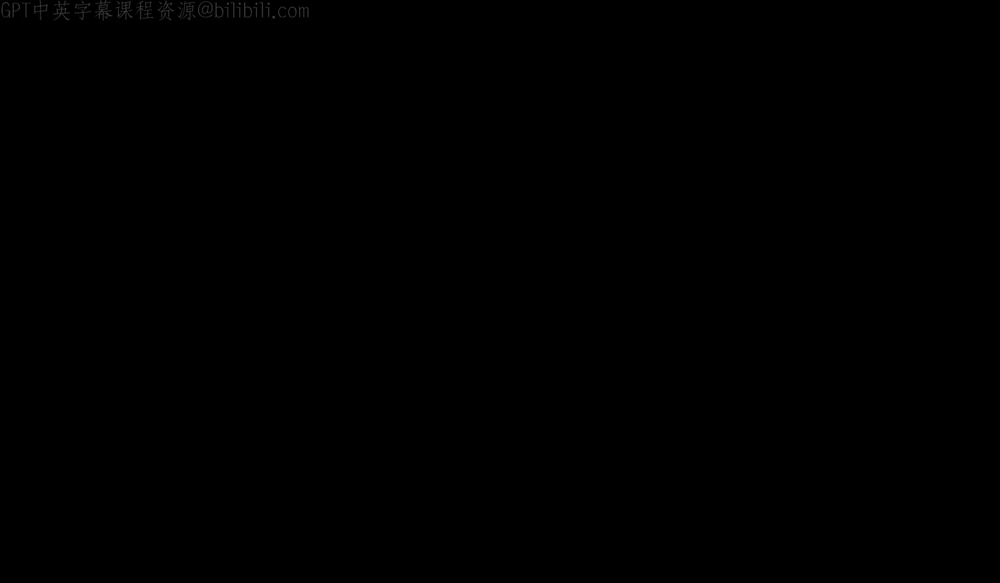

在本节课中，我们将学习如何实现一个基于GPU的路径追踪器。我们将从路径追踪的基础知识开始，然后深入探讨如何在GPU上高效实现，并介绍一系列可以提升渲染效果和性能的额外功能。

## 路径追踪基础 🧠

上一节我们介绍了课程概述，本节中我们来看看路径追踪的基本原理。

在现实世界中，光线从光源（如灯、太阳）发出，在场景中的各种表面和材质上多次反弹，最终到达我们的眼睛或相机。光的颜色由它沿途击中的物体决定。

然而，在路径追踪中，我们反向模拟这个过程。我们从相机发射光线，让光线在场景中反弹，直到击中光源。通过这种方式，我们可以计算出图像中每个像素的最终颜色。

### 渲染方程

光线传输使用渲染方程计算。以下是其核心公式：

```
Lo(p, ωo) = Le(p, ωo) + ∫Ω f(p, ωi, ωo) Li(p, ωi) |cosθ| dωi
```

让我们分解这个公式：
*   **`Lo(p, ωo)`**: 从点 `p` 沿方向 `ωo` 出射的辐射亮度（最终颜色/亮度）。
*   **`Le(p, ωo)`**: 点 `p` 自身发射的辐射亮度（对于光源大于零）。
*   **`∫Ω ... dωi`**: 对以表面法线为中心的半球 `Ω` 上所有入射方向 `ωi` 的积分。
*   **`f(p, ωi, ωo)`**: 双向散射分布函数（BSDF），决定光线如何从方向 `ωi` 散射到方向 `ωo`。
*   **`Li(p, ωi)`**: 从方向 `ωi` 入射到点 `p` 的辐射亮度。
*   **`|cosθ|`**: 余弦项（Lambert余弦定律），考虑了光线以掠射角照射表面时接收到的光更少。

### 什么是BSDF？

BSDF定义了光线如何从表面反射或透过表面传输。它接收入射方向和出射方向，并输出一个比例因子。BSDF是一个统称，可以细分为：
*   **BRDF**: 用于描述表面反射。
*   **BTDF**: 用于描述表面透射（如玻璃）。

以下是几种常见BSDF的例子：

以下是几种常见材质类型：
*   **漫反射材质**: 光线均匀地向所有方向反射。例如未加工的木材、混凝土。
    *   核心概念：`f_lambert = albedo / π`
*   **镜面反射**: 像镜子一样，光线根据法线精确反射。可以带有颜色色调。
*   **折射/透射**: 光线穿过材质时方向发生改变，遵循斯涅尔定律。常与镜面反射结合来模拟玻璃等材质。

### 蒙特卡洛积分

由于不可能对无限多的路径进行积分，我们使用蒙特卡洛积分来估计渲染方程的值。

蒙特卡洛估计器的公式如下：

```
<F> = (1/N) * Σ [f(Xi) / p(Xi)]   (i=1 to N)
```

其中：
*   `f(x)` 是待积分的函数（在这里是渲染方程的积分部分）。
*   `N` 是样本数量。
*   `Xi` 是从概率分布 `p(X)` 中抽取的样本。

随着样本数量 `N` 的增加，估计值 `<F>` 会接近真实的积分值。

### 随机采样抗锯齿

在路径追踪中，抗锯齿几乎是“免费”的。我们不需要进行超级采样，只需在每个像素内随机抖动光线的起始位置。随着样本数量的累积和平均，锯齿状的边缘自然会变得平滑。

### 递归与迭代实现

路径追踪的核心逻辑可以通过递归或迭代的方式实现。

以下是递归实现的伪代码：

```cpp
Color traceRay(Ray ray, int depth) {
    if (depth >= MAX_DEPTH) return BLACK;
    Intersection hit = findClosestIntersection(ray);
    if (!hit.hasHit) return BLACK; // 或返回环境光
    if (hit.material.isLight()) return hit.material.emission;

    // 采样BSDF，获取新的光线方向和BSDF值
    (newDirection, bsdfValue, pdf) = sampleBSDF(hit.material, hit.normal, ray.direction);
    Ray newRay(hit.position, newDirection);

    // 递归追踪，并加入蒙特卡洛权重
    Color incoming = traceRay(newRay, depth + 1);
    return bsdfValue * dot(hit.normal, newDirection) * incoming / pdf;
}
```

迭代实现则使用循环，并维护一个“吞吐量”变量来累积光线在多次反弹中的颜色衰减：

```cpp
Color pathTrace(Ray initialRay) {
    Color throughput = WHITE;
    Color radiance = BLACK;
    Ray ray = initialRay;

    for (int depth = 0; depth < MAX_DEPTH; depth++) {
        Intersection hit = findClosestIntersection(ray);
        if (!hit.hasHit) break;
        if (hit.material.isLight()) {
            radiance += throughput * hit.material.emission;
            break;
        }
        // 采样BSDF
        (newDirection, bsdfValue, pdf) = sampleBSDF(hit.material, hit.normal, ray.direction);
        // 更新吞吐量和光线
        throughput *= bsdfValue * dot(hit.normal, newDirection) / pdf;
        ray = Ray(hit.position, newDirection);
    }
    return radiance;
}
```

迭代方法避免了递归调用，更适合GPU并行架构。

## GPU实现策略 ⚙️

上一节我们介绍了路径追踪的基础算法，本节中我们来看看如何将其高效地映射到GPU上。

路径追踪有一个显著的优点：每个像素的光线追踪计算是相互独立的。这被称为“令人尴尬的并行”问题，非常适合GPU处理。

### 朴素方法及其问题

最直接的想法是为每个像素启动一个线程（一个内核），每个线程独立完成完整的路径追踪循环（迭代方法）。伪代码如下：

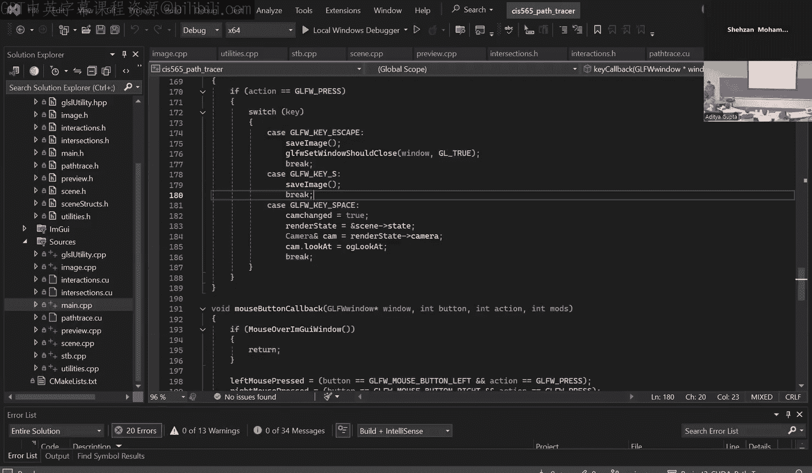

```cpp
__global__ void pathTraceKernel(Color* image, ...) {
    int x = blockIdx.x * blockDim.x + threadIdx.x;
    int y = blockIdx.y * blockDim.y + threadIdx.y;
    if (x >= width || y >= height) return;

    Color pixelColor = BLACK;
    for (int s = 0; s < samplesPerPixel; s++) {
        Ray ray = generateRay(x, y, randomJitter);
        pixelColor += iterativePathTrace(ray); // 调用上面的迭代函数
    }
    image[y*width + x] = pixelColor / samplesPerPixel;
}
```

然而，这种方法存在两个主要问题：
1.  **高发散性与低一致性**: 当光线开始反弹后，同一个线程束（Warp）中的不同线程可能执行完全不同的代码路径（例如，一些击中光源提前退出，一些击中漫反射表面继续反弹）。这严重降低了GPU的执行效率。
2.  **线程提前终止**: 一些线程可能很快击中光源并完成工作，但必须等待同线程束内其他长时间反弹的线程，造成计算资源浪费。

### 解决方案：分段路径追踪与流压缩

为了解决上述问题，我们采用“分段路径追踪”策略。我们将一个庞大的、包含循环的内核，拆分成多个按顺序执行的小内核阶段，并在阶段之间对活跃线程进行管理。

以下是核心的四个阶段：
1.  **光线生成**: 为每个像素生成初始光线。
2.  **求交测试**: 测试所有活跃光线与场景中物体的最近交点。
3.  **着色与采样**: 根据交点材质计算颜色，并采样生成下一次反弹的光线方向。
4.  **最终聚集**: 将完成追踪的光线颜色累加到最终图像上。

关键优化在于**流压缩**。在每个阶段（尤其是求交和着色后），我们会有一批光线终止（例如击中光源、达到最大深度或射出场景）。我们可以使用类似`thrust::copy_if`的函数，将仍然活跃的光线数据压缩到一起，移除已终止的光线。这样，下一个内核启动时只需要处理更少的、密集排列的活跃线程，极大地提高了Warp利用率和缓存效率。

### 按材质排序

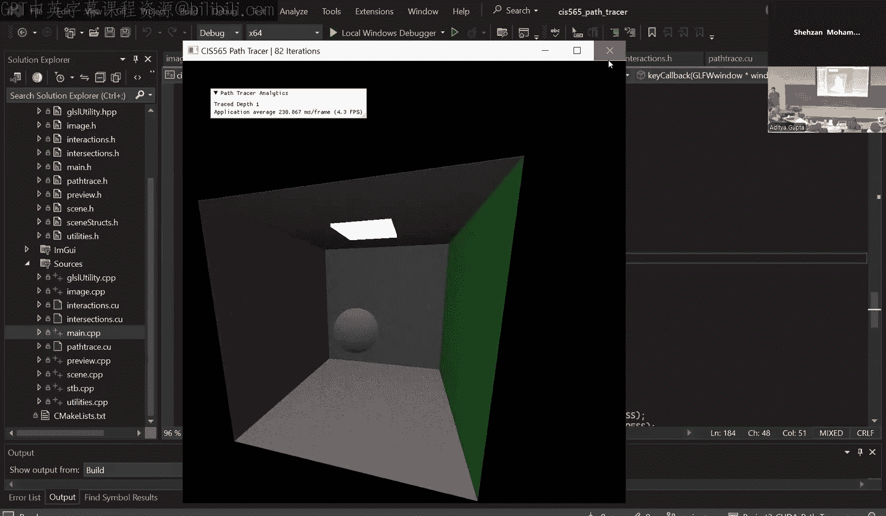

即使进行了流压缩，相邻线程处理的材质仍可能不同（例如一个处理漫反射，一个处理镜面反射），导致着色内核内部仍然存在分歧。

进一步的优化是**按材质对活跃光线进行排序**。这样，在执行着色内核时，相邻线程极有可能执行相同的材质着色代码，大大提高了线程一致性，从而提升性能。

以下是优化后的管线流程示意图：
```
生成所有光线 (活跃)
    |
    v
[求交测试] -> 压缩掉未命中的光线
    |
    v
[按材质排序] (可选但推荐)
    |
    v
[着色与采样] -> 生成新光线，压缩掉终止的光线
    |
    v
否 -> [是否达到深度或无活跃光线？]
|                             |
是                            |
    v
[最终聚集] <------------------
```

## 项目结构与核心任务 📁

上一节我们探讨了GPU实现的优化策略，本节中我们具体看看项目的代码结构和必须完成的核心任务。

### 项目布局

基础代码已经提供了框架，你需要重点关注以下文件：
*   `pathtrace.cu`: **核心文件**。包含了四个内核的框架（`generateRayFromCamera`, `computeIntersections`, `shadeFakeMaterial`, `finalGather`）。你的主要工作将集中在完善`computeIntersections`和将`shadeFakeMaterial`改造成真正的`shadeMaterial`。
*   `interactions.h`: 包含材质计算辅助函数，例如`calculateRandomDirectionInHemisphere`。
*   `intersections.h`: 包含几何体求交函数（如球体、包围盒）。如需添加三角形或其它图元，需在此修改。
*   `scene.cpp`: 场景加载逻辑（基于JSON）。如需支持自定义模型加载，需在此修改。
*   `preview.cpp`: 包含OpenGL显示和ImGui控件代码。你可以在此添加交互参数和性能统计显示。

### 核心要求

项目分为两个主要部分：

**第一部分（人人必须完成）：**
1.  实现**漫反射**和**完美镜面反射**材质。
2.  实现**分段路径追踪**，并集成**流压缩**。
3.  实现**按材质对路径段排序**的功能。
4.  实现**随机采样抗锯齿**。

**第二部分（需完成至少10分的功能）：**
你需要从项目README列出的功能列表中选择并实现，以赚取至少10点积分。例如：
*   **直接光照与多重重要性采样**：显著降低噪点。
*   **加载自定义网格模型**：使场景更丰富。
*   **空间加速结构**：如BVH，用于加速网格求交。
*   **基于物理的材质**：微表面模型、纹理贴图、次表面散射等。
*   **物理相机**：景深、鱼眼镜头、运动模糊。
*   **降噪器**：如Intel Open Image Denoise，能极大减少所需采样数。
*   **程序化内容和更多功能**。

**重要提示**：
*   所有实现的功能都必须在你的项目`README.md`中清晰展示和说明，否则将无法获得分数。
*   鼓励创新，如果你想实现未列出的功能，请在Ed讨论区申请预审以确定其积分价值。

### 使用ImGui

项目中已集成ImGui库，你应该利用它来：
*   暴露渲染参数（如相机FOV、光圈、最大深度）。
*   显示性能统计数据（如每帧时间、各阶段耗时、活跃线程数）。
*   提供功能开关（如切换是否启用材质排序），以便进行性能对比分析。

## 额外功能与灵感 ✨

上一节我们明确了项目的核心要求，本节中我们将浏览一些可以大幅提升作品质量的额外功能，并从中获取灵感。

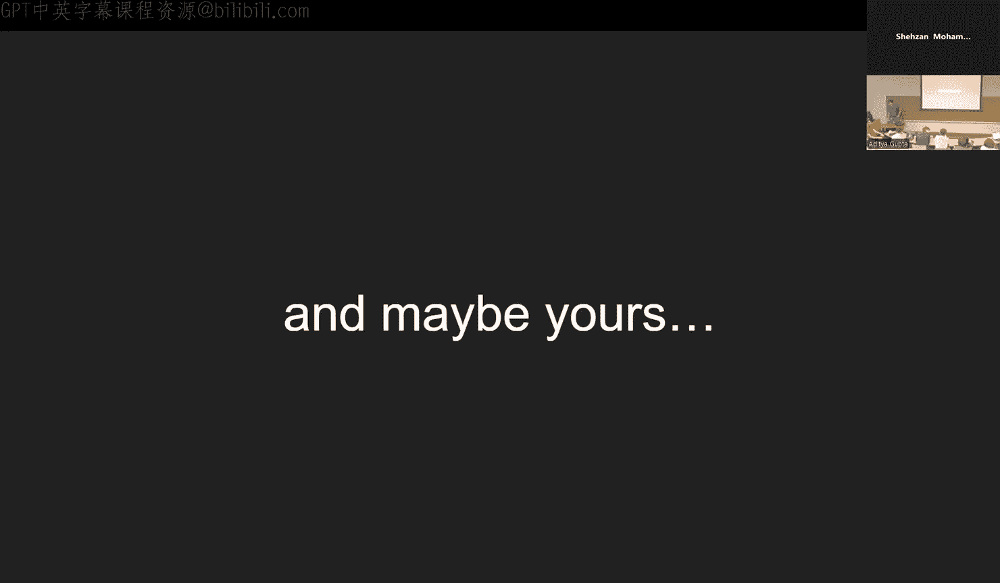

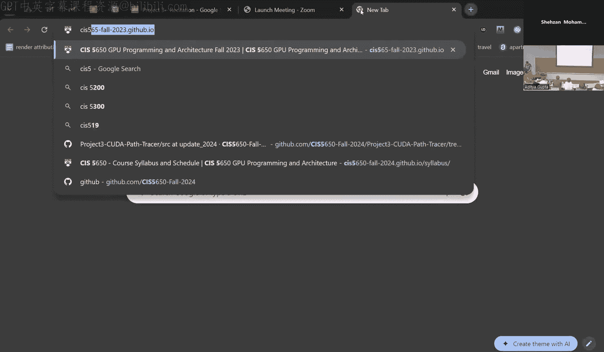

### 关键额外功能详解

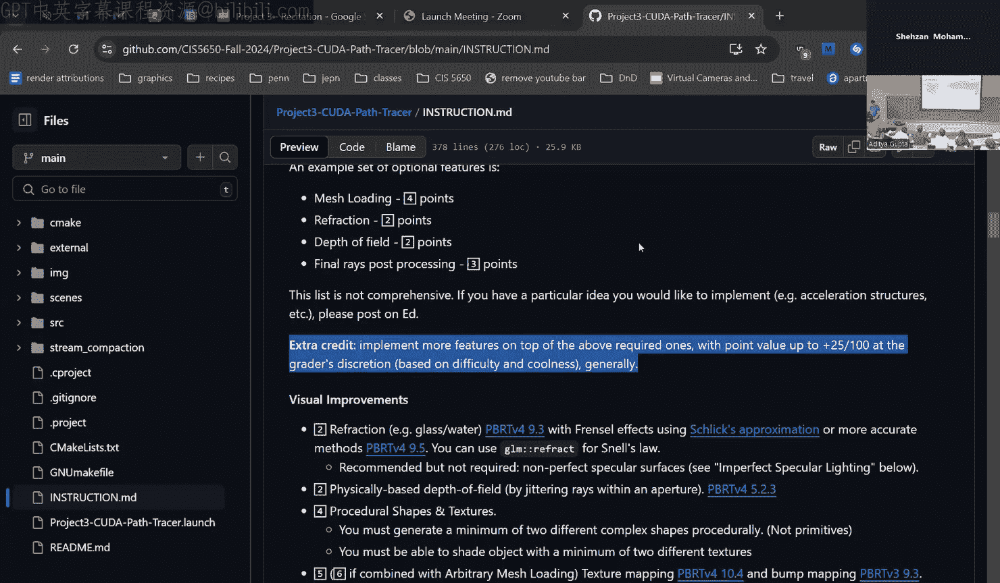

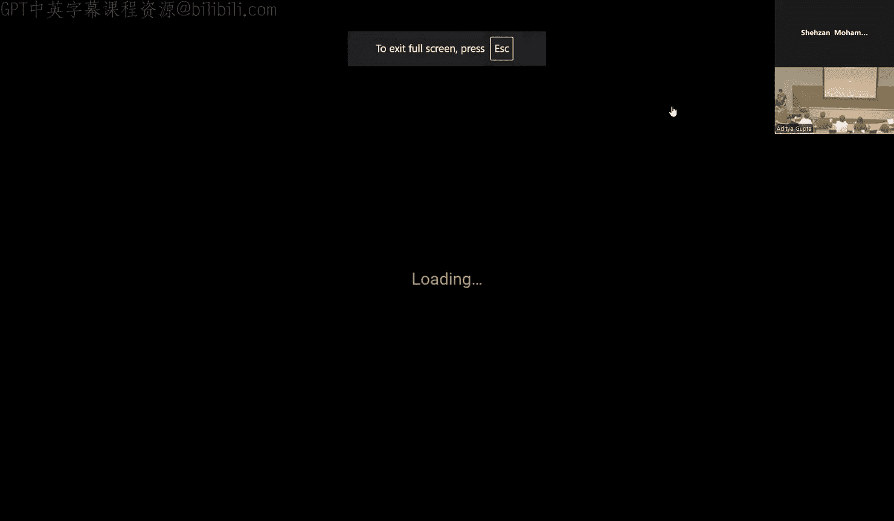

1.  **直接光照与多重重要性采样**：这是减少噪点最有效的方法之一。与其等待光线随机击中光源，不如在每次着色点时直接对光源进行采样。结合BSDF采样，使用多重重要性采样来平衡两种策略，能在各种材质和光照条件下都获得稳健的结果。
2.  **自定义网格与加速结构**：加载外部3D模型（如GLTF、OBJ格式）能极大扩展场景可能性。随之而来的挑战是性能。为复杂网格实现一个**包围盒层次结构**（BVH）是至关重要的，它能将对所有三角形的遍历减少为对树形结构的遍历。
3.  **降噪**：**Intel Open Image Denoise** 是一个易于集成的、基于AI的降噪库。它可以直接在CUDA内存上操作，并能利用法线、反照率等辅助缓冲区提升质量。仅需几十个样本，就能得到近乎干净的图像，能节省大量渲染时间。
4.  **高级材质与相机**：
    *   **微表面模型**：实现粗糙度参数，让反射变得模糊，更接近真实金属、塑料。
    *   **纹理贴图**：为模型添加颜色、法线、粗糙度等纹理，增加细节。
    *   **景深**：模拟真实相机的聚焦效果，让画面更具电影感。
    *   **参与介质**：渲染雾、烟、云等体积效果。

### 往届作品画廊

看看往届学生的优秀作品可以获得很多灵感：
*   **复杂场景渲染**：包含自定义导入的模型、环境光照和高级材质。
*   **创意构图**：使用景深、鱼眼镜头等相机效果营造特定氛围。
*   **技术展示**：同时展示降噪前后对比、BVH可视化、性能分析图表等。
*   **艺术化表达**：精心布置的光照、色彩和模型，创造出具有美感的渲染图。

**请记住**：你的封面图不应只是一个简单的Cornell盒子。努力创造一个独特、美观、能展示你技术实力的场景。

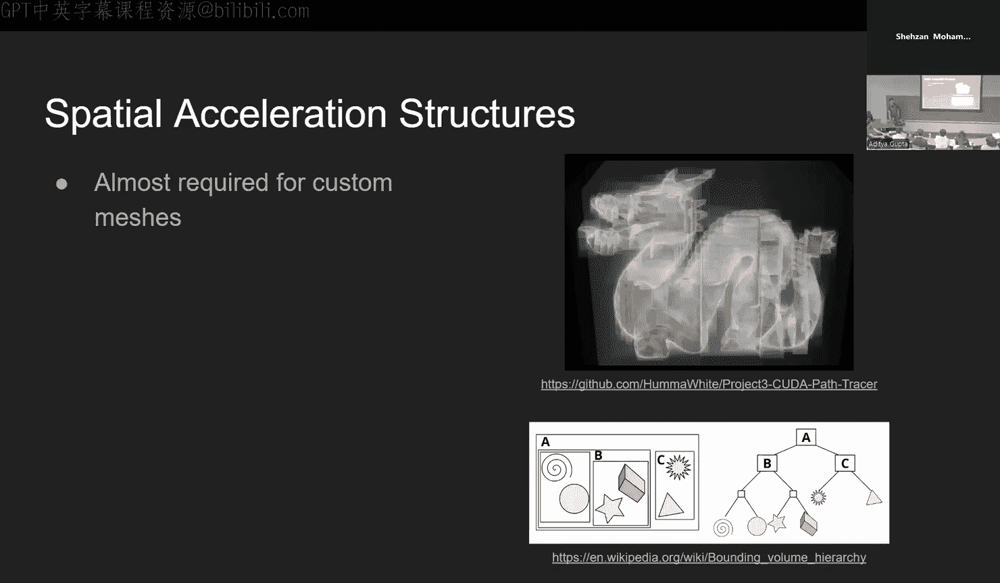

### 实用建议与截止日期

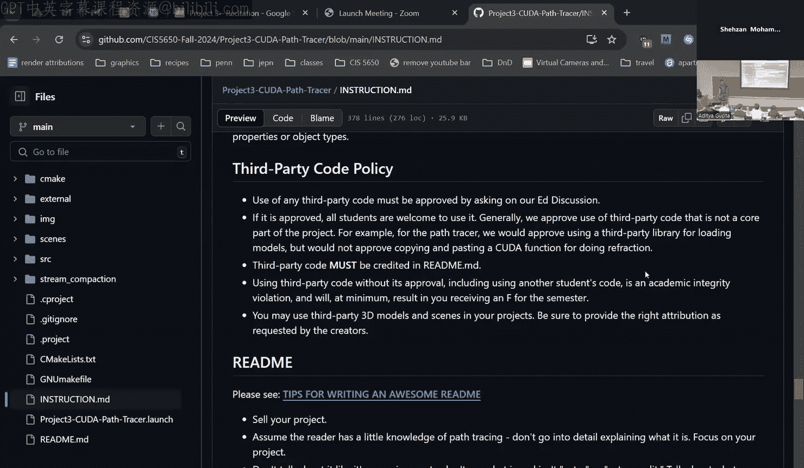


*   **开发策略**：建议先快速完成核心要求，确保基础路径追踪器能工作。然后再有策略地选择额外功能，先实现那些性价比高（如降噪器）或你特别感兴趣的功能。
*   **第三方代码**：对于像BVH构建这样的核心算法，直接使用库可能无法获得积分。但对于像Open Image Denoise这样的复杂库，则是允许且鼓励的。如有疑问，请在Ed讨论区提问。
*   **README的重要性**：README是你项目的门面。它应该包含精美的渲染图、功能说明、性能分析、实现细节、引用来源等。投入时间制作一个优秀的README至关重要。
*   **截止日期政策**：
    *   **代码截止日期**：10月1日（周二）晚11:59。
    *   **README截止日期**：10月3日（周四）晚11:59。
    *   这两天间隔是专门用于完善README和生成最终渲染图的，不应再提交新代码。
    *   迟交天数可以应用于代码截止日期或README截止日期。

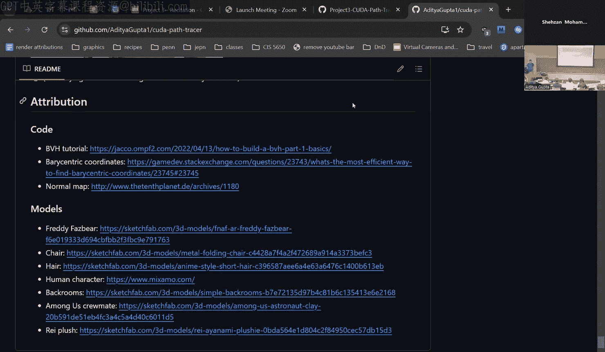


## 总结 🎯

本节课中我们一起学习了GPU路径追踪项目的完整流程。

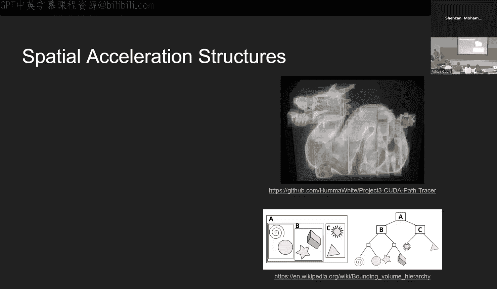

我们从**路径追踪的基础原理**出发，理解了渲染方程、BSDF和蒙特卡洛积分。接着，我们探讨了如何在GPU上**高效实现**路径追踪，分析了朴素方法的缺陷，并引入了**分段追踪、流压缩和按材质排序**等关键优化策略。然后，我们梳理了**项目代码结构**，明确了**核心实现要求**和**可选额外功能**。最后，我们通过往届作品获得了灵感，并了解了一些**实用的开发建议和截止日期政策**。

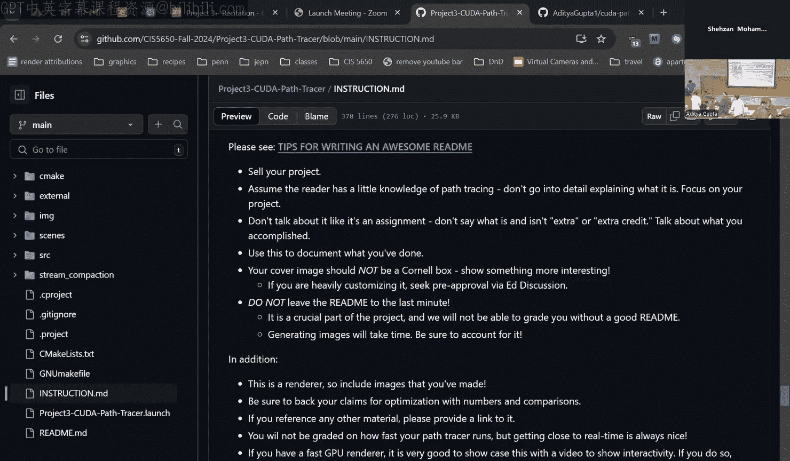

现在，你已经具备了开始这个激动人心项目所需的基础知识。记住，这是一个展示你创意和技术能力的绝佳机会。从基础做起，逐步迭代，勇于尝试新功能，并最终呈现一个令人印象深刻的作品。祝你编程愉快！