# GPU编程与架构：第8讲：图形渲染管线与实时渲染技术

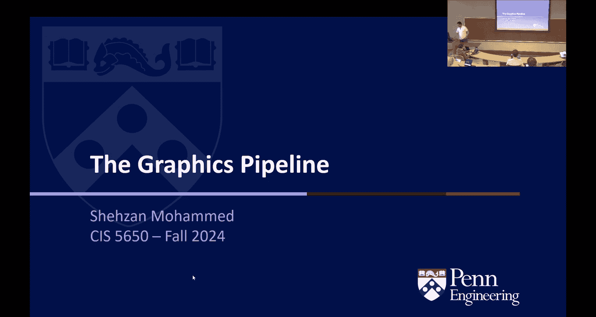

在本节课中，我们将学习传统的图形渲染管线，了解其如何映射到硬件，并探索实时渲染中的两种关键技术：正向渲染与延迟渲染。我们将从最基本的顶点处理开始，逐步深入到像素着色，并理解GPU架构如何演变以支持这些计算密集型任务。

## 概述：渲染的目标与挑战

渲染的主要目标是将三维场景转换为二维屏幕上的像素图像。这涉及两个核心问题：**可见性判断**（哪些物体/部分可见）和**着色计算**（可见部分应呈现何种颜色）。实时渲染需要在极短的时间内（例如每秒60帧）完成这些计算。

传统的图形管线提供了一种流水线化的方法来解决这些问题，我们将逐一剖析其各个阶段。

## 图形渲染管线详解

### 顶点装配 (Vertex Assembly)

图形管线的第一步是顶点装配。在这个阶段，我们需要将三维模型中的顶点数据（即空间中的点）组织成GPU能够高效处理的格式。

每个顶点通常包含以下属性：
*   **位置 (Position)**: 顶点的三维坐标 (X, Y, Z)。
*   **法线 (Normal)**: 顶点所在表面的朝向，用于光照计算。
*   **纹理坐标 (Texture Coordinates)**: 用于从纹理图像中采样颜色的二维坐标 (U, V)。
*   **切线 (Tangent)** 与 **副法线 (Binormal)**: 这两个向量与法线一起构成一个局部坐标系（切线空间），主要用于法线贴图等高级着色技术。

顶点装配的任务就是将这些属性打包到连续的缓冲区中，以便GPU读取。一个高效的技巧是，通常只需存储法线和切线，因为副法线可以通过两者的叉积快速计算得出：`binormal = cross(normal, tangent)`。

### 顶点着色器 (Vertex Shader)

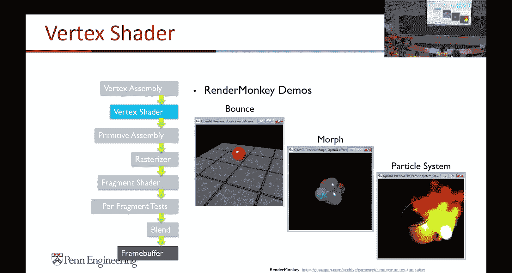

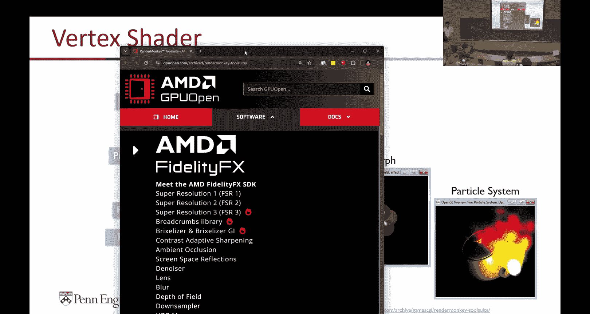

上一节我们介绍了如何准备顶点数据，本节中我们来看看如何处理这些顶点。顶点着色器是管线中第一个可编程的阶段，其核心任务是对每个顶点进行坐标变换。

每个顶点着色器线程独立处理一个顶点，主要执行以下操作：
1.  **模型变换 (Model Transformation)**: 将顶点从局部模型空间转换到全局世界空间。公式为：`world_position = model_matrix * local_position`。
2.  **视图变换 (View Transformation)**: 将顶点从世界空间转换到以摄像机为原点的观察空间。公式为：`view_position = view_matrix * world_position`。
3.  **投影变换 (Projection Transformation)**: 将顶点从观察空间转换到裁剪空间（一个标准化立方体）。这模拟了透视效果（近大远小）。公式为：`clip_position = projection_matrix * view_position`。

这三个变换通常合并为一个**模型-视图-投影矩阵 (MVP Matrix)** 传递给着色器。顶点着色器还可以进行其他计算，例如基于时间的顶点动画（如脉动效果）或从纹理中读取数据用于置换贴图。

### 图元装配与光栅化 (Primitive Assembly & Rasterization)

经过顶点着色器处理后，我们得到了变换后的顶点。但这些顶点仍然是独立的点，没有形成几何形状。图元装配阶段将这些顶点连接成基本的图形单元，如三角形。

接下来是光栅化，这是一个固定功能阶段。它的任务是将屏幕空间中的三角形转换为一系列**片段 (Fragments)**，你可以将其理解为候选像素。这个过程包括：
*   **裁剪 (Clipping)**: 丢弃完全在屏幕外的三角形，并将部分在屏幕内的三角形切割为新的、完全在屏幕内的三角形。
*   **片段生成**: 确定哪些屏幕像素被三角形覆盖，并为每个被覆盖的像素生成一个片段。

在光栅化过程中，顶点属性（如颜色、纹理坐标）会在三角形内部进行插值，为每个片段提供平滑过渡的值。这里引出一个重要的性能考量：**三角形与片段的比例**。对于一个简单场景（如一个立方体），片段数量远多于三角形，计算负载集中在后续阶段。而对于一个复杂场景（如包含数百万三角形的城市），顶点处理可能成为瓶颈。这种不平衡催生了GPU架构的演变。

### 片段着色器 (Fragment Shader)

一旦我们知道了屏幕上哪些像素需要被绘制，下一步就是确定它们的颜色。这是片段着色器（在DirectX中称为像素着色器）的职责，它通常是渲染管线中最耗计算资源的阶段。

片段着色器接收来自光栅化阶段的插值后数据（如位置、法线、纹理坐标），并输出该片段的最终颜色。其核心工作包括：
*   **纹理采样**: 从纹理图像中获取颜色或其它信息（如漫反射颜色、法线方向、粗糙度）。
*   **光照计算**: 根据材质属性和光源信息计算颜色。一个经典的简化光照模型是冯氏光照模型：
    ```
    color = ambient + diffuse * max(dot(normal, light_dir), 0) + specular * pow(max(dot(reflect_dir, view_dir), 0), shininess)
    ```
*   **高级效果**: 实现凹凸贴图、环境反射、雾效、卡通渲染等。

片段着色器非常强大，但计算成本高昂，因为每个屏幕像素都可能执行复杂的纹理查找和数学运算。

### 逐片段测试与混合 (Per-Fragment Tests & Blending)

在片段着色器输出颜色后，管线还会执行一系列测试来决定最终是否以及如何更新帧缓冲区。

以下是主要的测试类型：
*   **模板测试 (Stencil Test)**: 根据一个模板缓冲区来丢弃或保留片段，常用于实现轮廓、反射等效果。
*   **深度测试 (Depth Test)**: 使用深度缓冲区（Z-Buffer）来确保只有离摄像机最近的片段被保留，这是解决可见性问题的关键。
*   **混合 (Blending)**: 将当前片段的颜色与帧缓冲区中已有的颜色进行混合，用于实现透明效果（如玻璃、烟雾）。

完成所有这些步骤后，最终的颜色被写入帧缓冲区，显示在屏幕上。

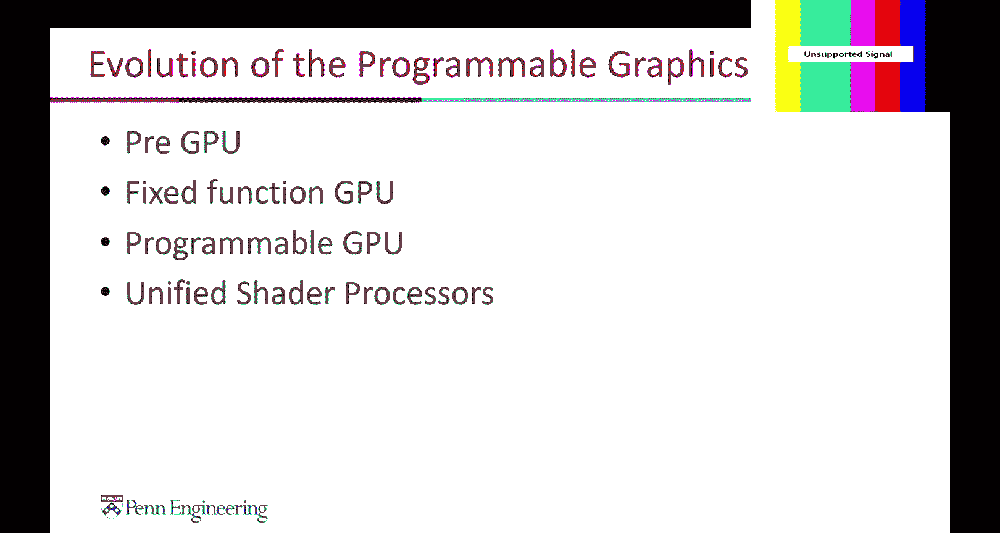

## GPU架构的演变：从固定功能到统一着色器

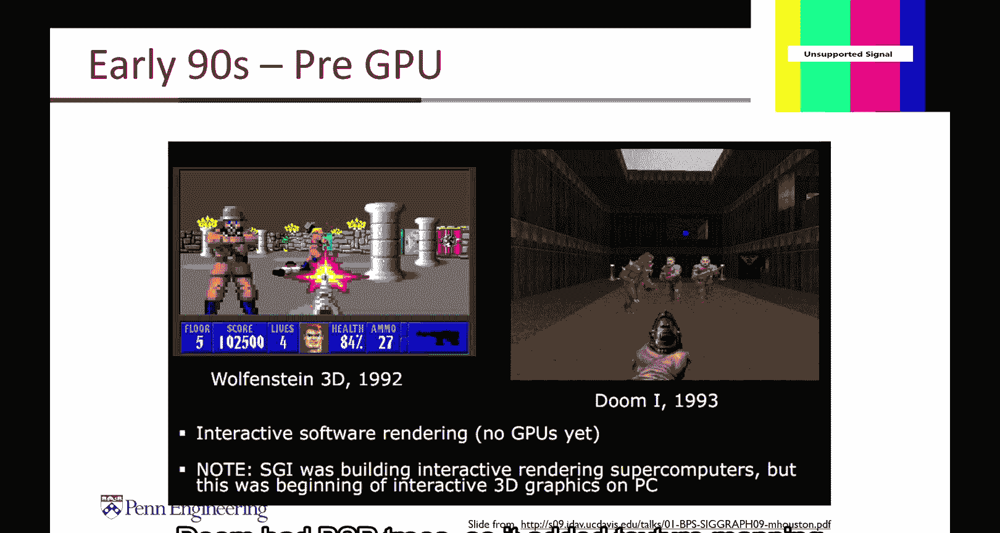

回顾整个图形管线，我们看到了可编程阶段（顶点、片段着色器）和固定功能阶段（光栅化、测试）。这种划分深刻地影响了早期GPU的设计。

早期GPU（如1999年的NVIDIA GeForce 256）拥有独立的、专用的硬件单元来处理顶点变换和像素填充。这带来了一个问题：如果场景顶点密集而像素简单（如线框渲染），像素处理器就会闲置；反之，如果场景像素复杂而几何简单（如全屏特效），顶点处理器就会闲置。

为了解决这种负载不平衡问题，现代GPU采用了**统一着色器架构**（如2006年引入的架构）。在这种架构中，大量的通用计算核心（CUDA Core）可以动态分配用于顶点着色、片段着色或通用计算任务。这极大地提高了硬件的利用率和灵活性，也为CUDA这样的通用计算框架铺平了道路。

## 现代渲染技术：正向渲染与延迟渲染

传统的管线通常被称为**正向渲染 (Forward Rendering)**。它对于每个物体，遍历所有光源来计算其光照并直接输出到屏幕。这种方法简单直接，但当场景中有大量光源时，计算量会急剧增加（物体数量 × 光源数量）。

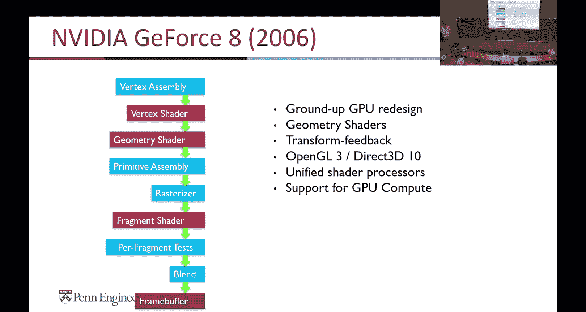

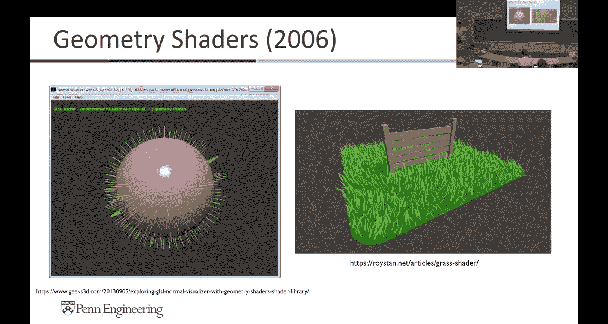

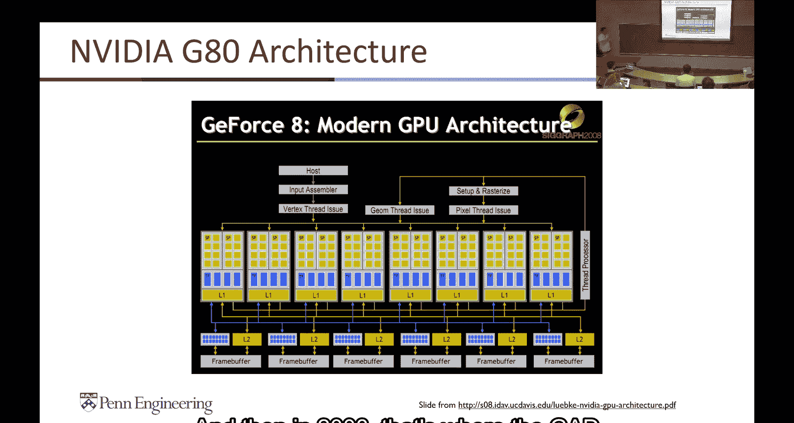

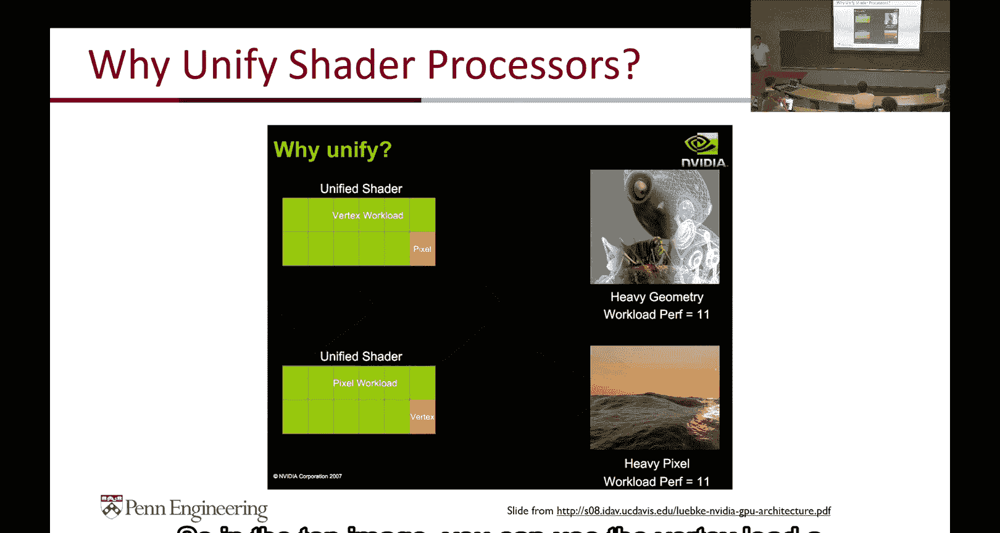

为了高效处理大量光源，**延迟渲染 (Deferred Rendering)** 技术应运而生。它将渲染过程分为两个主要阶段：
1.  **几何阶段 (Geometry Pass)**: 遍历所有物体，但不计算光照。而是将表面的各种属性（如位置、法线、漫反射颜色、镜面反射系数）渲染到多个缓冲区中，统称为**G缓冲区 (G-Buffer)**。
2.  **光照阶段 (Lighting Pass)**: 忽略场景几何，直接对屏幕上的每个像素，根据G缓冲区中存储的信息，遍历所有光源进行光照计算。

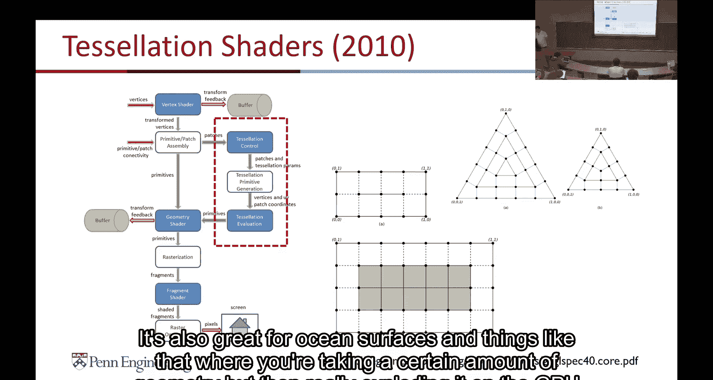

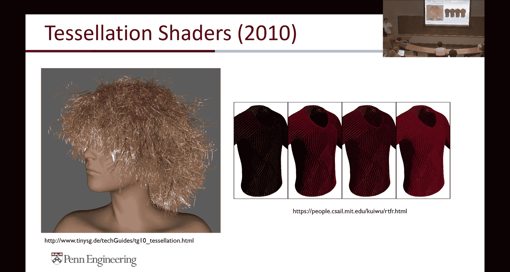

延迟渲染的优势在于，光照计算的复杂度只与屏幕像素数量和光源数量有关，而与场景几何复杂度脱钩，非常适合拥有大量光源的场景（如夜间城市、有许多灯光的室内）。其缺点是需要更高的内存带宽来存储G缓冲区，并且对透明物体的处理比较困难。

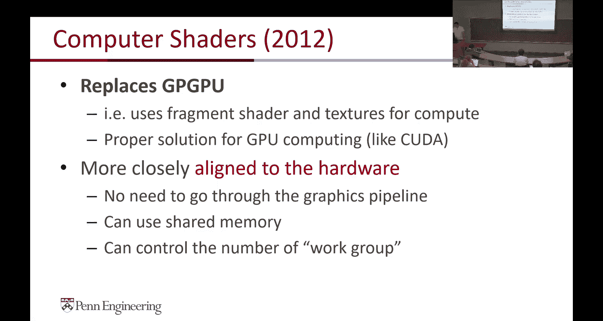

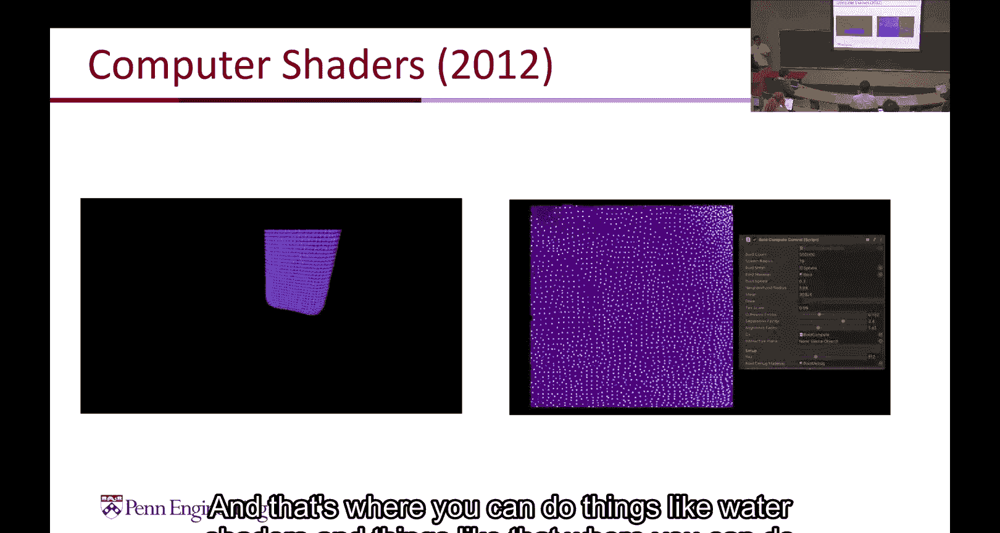

## 总结

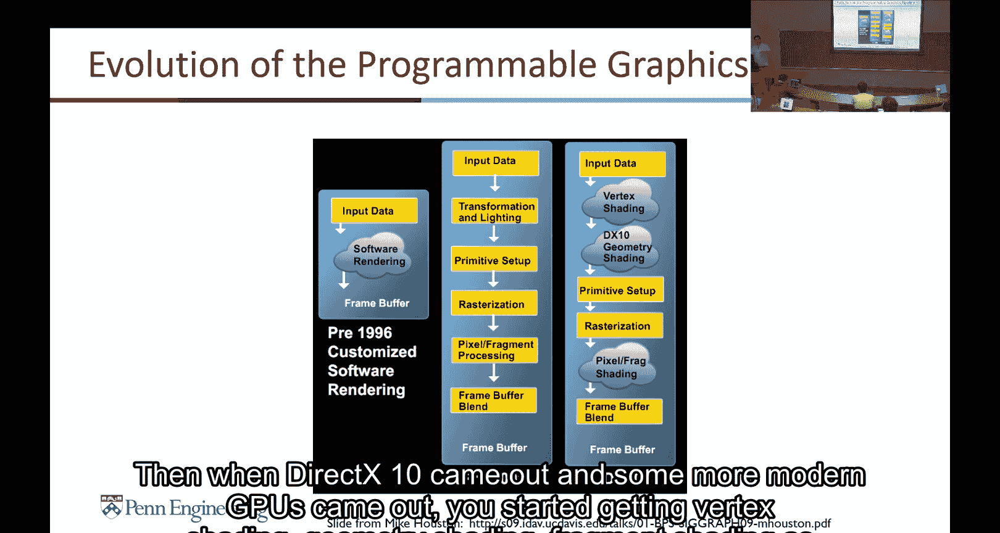

本节课我们一起学习了实时图形渲染的核心流程。我们从传统的正向渲染管线出发，详细了解了从顶点装配、坐标变换、光栅化到片段着色和最终合成的每一个步骤。我们看到了图形管线的设计如何影响了GPU硬件的演变，从专用的固定功能单元发展到如今灵活的统一着色器架构。最后，我们探讨了为应对大量光源挑战而出现的延迟渲染技术的基本原理。

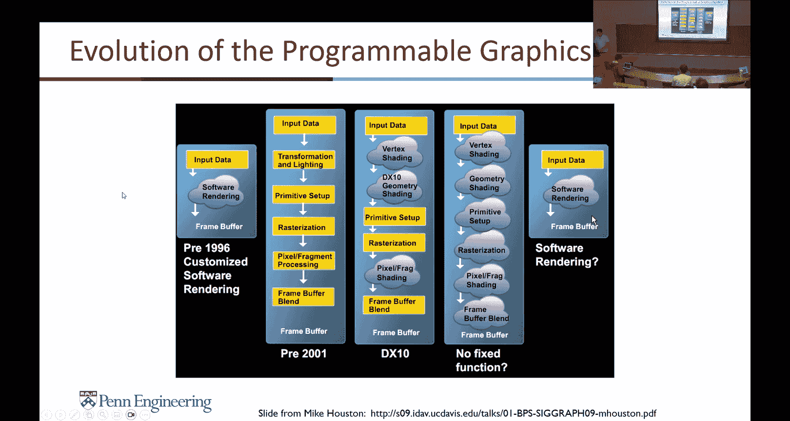

理解这些基础概念，将帮助你更好地进行Project 4的WebGPU开发，并让你在编写CUDA内核时，也能洞察到其设计思想与图形编程的深厚渊源。