# uPenn《GPU编程和框架｜CIS 5650 GPU Programming and Architecture Fall 2024》中英（Claude-3.5 p14 2024-10-09 - CIS 5650 GPU Programming Fall 2024 Lecture 9.zh_en -BV1sRtresE67_p14-

觉。All right， let's get started so。All of you or most of all of you， I suppose， will would have。

Done some of of form of graphics API。Open G， welcome， web GL， etc。And。

The key thing and now you've learned Quda， right？The key difference between those APIs and Kuda is that。

Kuda is computed first。Right， you can start main， you can launch a kernel， you can exit。

 you don't have to do anything extra， whereas in the graphics API， even if you wanted to do GP GPU。

 general purpose， GPU compute， you have to launch a frame buffer。

 you have to use the raization pipeline， you have to use the shaders。

So that's a big difference in a way。We GPU， I think kind of bridges that where it can be both depending on how you want to use it project4。

 you'll be using a lot of the graphic side of it。But you can also use the compute for those of you especially interested in things like client side machine learning inference using GPUs and don't want to rely on KUDa and the user having an Nvidia GPU web GPU can be a fantastic option because it gives you that so what we do today。

I we kind of revisit。😮，The first two lectures。That we had in Kuda。

But we look at it from a web GPU admin。Right。So。So let's do that。

 let's see how an API like web GPU which evolved from graphics APIs can really be used for compute as well。

All right。

So I have a few slides here that are kind of borrowed from Brandon slides from two years ago。

 but also from Kai's slide on Monday。I can kind of skip that。

 but let me know if you guys have any questions from KaI's guest lecture and I'll be happy to cover。

 but otherwise you know we can breeze through them and I can get into the meat of the lecture and actually doing things hands on to show you guys how things evolve。

Okay， so so WebGL real time graphics， we saw this， the history， if anybody has a question。

 please raise your hand。

The evolution of graphics， how webGL came up to be how WebGL is not sufficient this is kind of a new slide I think this may not have been there so this is kind of how web GPU sits within the stack where you have your app then you have web GP API you have the OS and then you have multiple backends for web GPU so this is where you can have web GPU as a platform agnostic API thats web native first but cannot use that same acceleration that the GPU can give you。

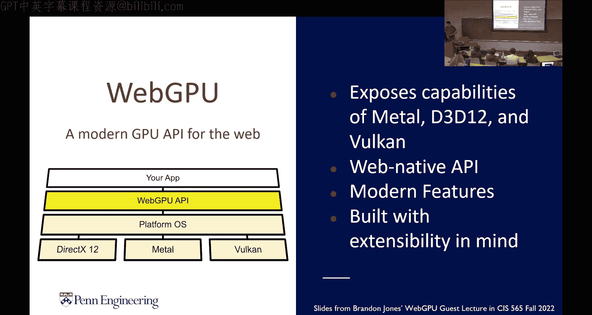

嗯。Lots of new features， again， Kai discussed this last week。S you the demos as well。

 and we also discussed why not have welcome we saw this base code。Always fun to see that。

I think this we saw as well， and then the fact that Web GPU is built for the web it blends that those requirements of safety。

 privacy security with the graphics APIs in a really nice way。

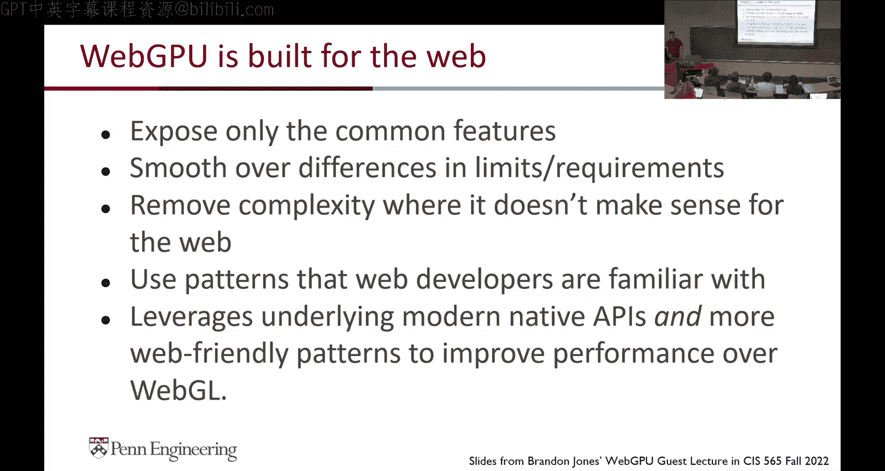

All right， theres again a comparison of WebGL and WebG， web GP is slightly more but not crazy more。

 so that's always a good thing。

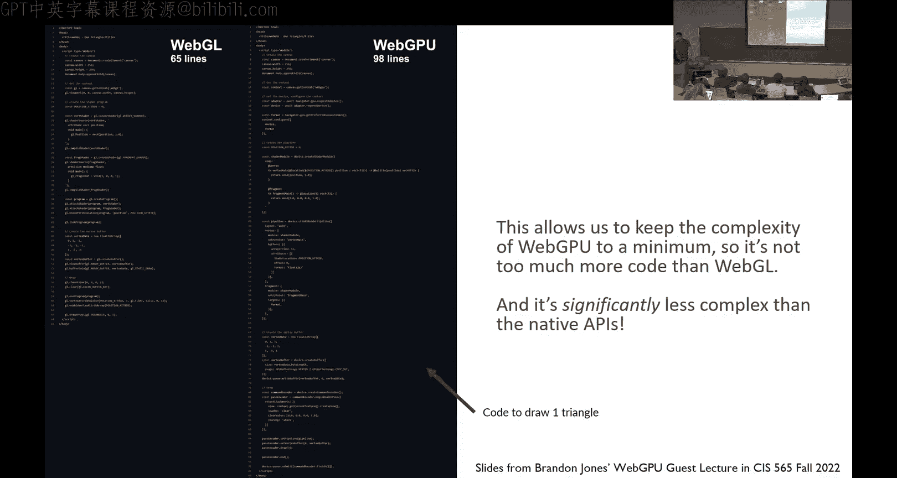

All right， so this is where I get started， right？So， kuda is。

You know the GP GPU platform dedicated for Nvidia。Nobody else has it。

 it's an awesome API platform architecture because it's really all three。

But it's exclusive to Edward that is their mo sure the federal government now is trying to you know claim monopoly and stuff I don't know how far that's going to go but what they've done is awesome and they should be。

Awarded for that for that success， but it's also limiting。

 it creates a closed environment where not everybody can access it you don't have NVDdia GPUs on your phone。

 how do you take advantage of that level of compute or devices that don't have NviDdia GPUs and can't have NviDdia GPUs really。

So that's where web GPU can come in as that graphics plus compute for the web that can be really flexible。

 WebGL isn't that flexible in terms of compute but web GPU can be and eventually once it gains more adoption。

 itll also be across all platforms and browsers。嗯。Okay， here's a comparison of KudDa and web GPU。

 I won't read it out， I think you get most of it but take the time to read it on your own as well。

All right， so at the heart of the lecture， we want to take。

SX PY and matrixtri multiply and port them to Web GPpU and see what concepts map。In the slides。

 I really have SAXPY， I may make another set of slides that will cover MAM。

 but it's essentially the same concepts。For the class well do SAXPY and depending on when you guys have to leave for the Pixar event。

 we will try to cover some matrix multiply hands hands on and I'll try to show you some quirks of WebG view that you'd be oh my god。

 why is it this way？All right， so let's get it。So recapping SAXPY。

 its an element wise operation that does z equals a times x a is a scalar a times x plus y。

 right very common operation， but it provides us a simple way。To be like， okay， our kuda curl。

 you can pretty much imagine what the ka curl is in your head。 I don't even need to tell you。

But taking that simplicity and how does it port to the web GPU， what's the overhead there。

 that's what we can see。All right， so here's the KudDa program， right？So on the CPU side。

 you're going to create some size， you're going to create the memory。

 you're going to create the GPU memory using Qaalc， then you're going to do Q DMM copy。

You're going to run the kernel。And then you're going to copy the memory back to do whatever you want to next。

 including just check the results。Right， so it's。Initialize。Alllocate memory， initialize the memory。

 copy the memory。Run the compute and then result right so that's kind of the flow we have in mind。

I can skip that。And then the kernel of course， is a simple one dimensional  equals block IDX times block10 dot x plus thread IDX。

 and then you do element for operations while checking the bounds。Any questions before I move on？

Everybody， like this should be something you could do in your sleep now， I think。Yeah。Okay。All right。

 so we want to take this。And map it to web GPpU now again。

 for those of you who've done any of the graphics APIs。Doing something like this。

 which is probably maybe maybe at best 60 lines of code。😊，Depending on how you write it。嗯。

Converting that to an open GL or a FGL would really blow up the size。

 even though it's something very， very simple that you want to do。

So let's see how the GPPU helps us with that。All right。So。

 we want to follow a very similar flow to Kura even forward GPbu。

 this is kind of the skeleton we will have。😊，We'll set up the HTML page as the wrappper。

You could potentially like paste the code in your browser console and it will still work。

 but we'll set up the HTML page just so that it's convenient。Um。

We'll set up the CPU code because it's the first time we are doing WebTP。

 we want to check our results。Then something you don't do in Qa is。😮，Initialize。

 initialize the device and stuff that you have to do with web GPpU as you do with generally other graphics APIs。

Then similar to KudDa， you're going to copy the memory to the GPU。

 you'll set up the compute shader pipeline， which is kind of like setting up the kernel。

 you'll execute the shader pipeline， copy the result back and make sure that it's actually correct。

So some of these like four and 5 are completely reorderable， that's totally fine。

 we will just do it in the order because again we are coming from Quda and learning web GP so I try to want to mirror that as much as possible。

Okay。Allright。Hopefully。All of you can read exactly what's going on here， there's HTML page。

Has the title has some CSS and then in the body view this is the main line the script module web GPxpyY。

js that's what we want to focus on the other two are just elements for beautification of the page。

Any questions on this？Okay。Then。We want to do the CPU part， okay。

So first this is exact JavaScript and I'll show it in visual Studio code and we'll run it together as well。

So in JavaScript。Pure CPU， we are not doing anything GPU yet， Ive created a function called SAXPY。

We we want to ittrate over different sizes just to make sure our kernel works really well or shader works really well I need to make sure I use the correct vab and we also test non powers of two sizes just so that you know we are not。

Checking for bounds and stuff。嗯。You can get used to syntaxes like this and you can use them in project 4 where you return multiple things from a function。

That's some of the goodness of JavaScriptscript， there's a lot of bad。

 but this is some of the goodness。And for each iteration of the size。

 well print a small log to say what size you're testing。Any questions on this？Yeah。

 I think I covered most of that。Oh yeah and the result from this Z vector will serve as a control。

 so we'll use that to test。We use that to test the GPU result to make sure it's correct。

So any questions on this so far？What's missing here？反正。Ting sure I'm not。

I can cover timing and I can show you how it works。

 I didn't include it in the slides intentionally just so that we could cover it in the time we have。

 but I can show you how that works。But what else is missing？Fation。

I mean on CPU what are you going to verify with especially random numbers so two things missing we haven't defined in it SAXP1 and we haven't defined CPU SAXpyY right so let's do that。

Oh。it is one of those two obvious to notice kind of questions so so in it SAXPY we call well create two functions create random vector and create identity vector so identity vector essentially populate zero so that is up here create random vector will create a float array and then populate with random numbers just so that we you know tricking our API。

😊，Scaalar can be a random number and we return all of that from the inlet function。

Any questions on this？Okay。CPXP again， you will probably imagine this pass all the inputs and fall loop and I put this extra return of that programming on my part。

 but yeah it really doesn't do anything， but otherwise that this should be exactly what you would have expected。

Um。So any questions on this？Okay， so I'm going to switch tool。嗯。Pual Studio code。

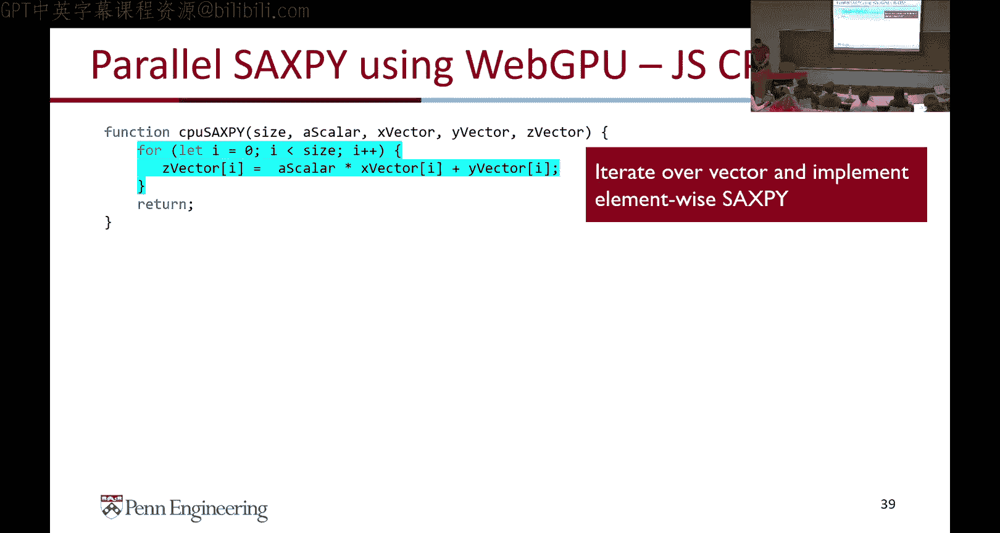

Bring this up here。So I've kind of done this， but I'm going to do it all fresh again。

 so I have an HTML page， I'm going to make a copy of this。And let's call it。In class。Okay。

And then we'll create a new JavaScriptscript file。Web G， S A X， P， Y， and class dot Js。

AllI'm going to close everything else， actually I'll keep one file。So this class。

t entity that you see I have open it basically all of the code that we are talking about in the slides。

 I've just pasted here so that I have the flow and I can copy paste rather than type everything。

So let's open this so here I'm going to simplify this。And of that of that。Module。

 I'm going to call this in class。😔，And then we can get rid of these so we don't need them。Okay。

 so this should align to what I had in the slides a little bit ago。And then in this function。

 which is completely empty， so I'm going to copy。This function which is a CPU AXPY identity vector random vector in it as AXpyY and then these functions so we covered all of these in the slides and I'm going to paste this here。

嗯。Let's save that and here I'm going to do NPpM run or NPpM start just so that my web server is starting。

And then I'm going to use Ch Canary to run this。😔。

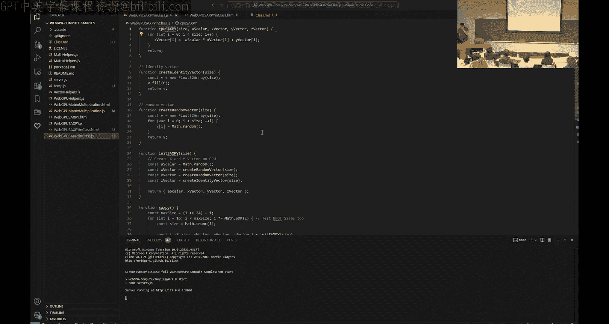

す。So canary it's linked in the instructions as well Canary is the nightly build of Chrome so it's much further advanced and they have let's say。

Less strict checks before things get to do production。

So basically there's a lot of experimental features and stuff in WebtGU， so for example。

 if you wanted to do performance timers， you have to use Kary。

 even Chrome doesn't support performance timers for web GPU。

That's why you see that big I have enabled unsafe web GPU there。All right。

 so now I can do Lolo 3000 slash web GPU， S A X PY。In class dot Ht Okay。

 and then everything is going to be on the console。 So that's where we focus。

 But you can see that the the page ran。

嗯。And that' it so it says SXPY complete。All everybodybody follows so far。

 so we've done basically the CPU side。

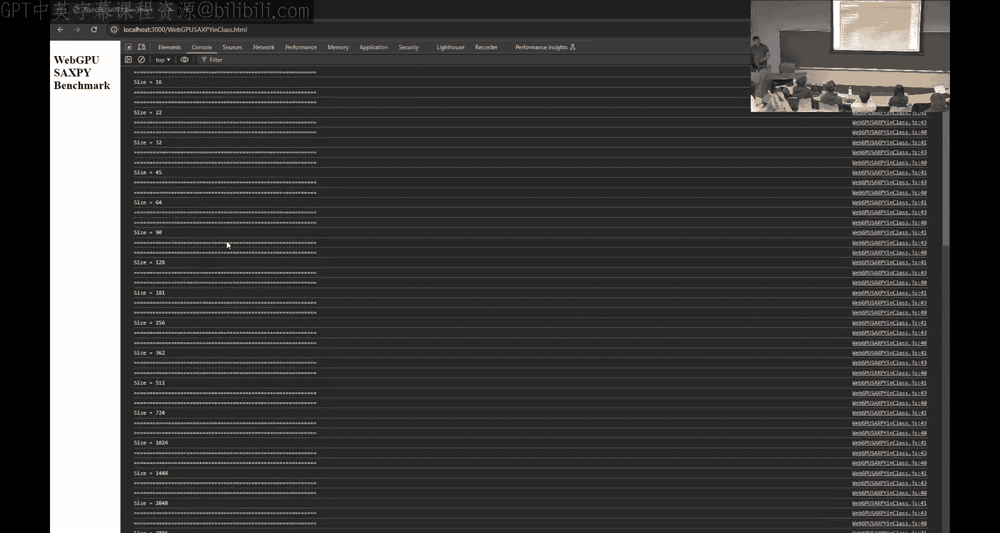

All right。So now what was after this， so we've done the CPU。

 what was next after this in the skeleton？What is the natural step， so now we've done CPU。Yeah。

 so we want to try to do it on the GP， what was the first step towards doing that？

Initialize you right， so let's do that so we want to initialize web GPU。

And to do that we are going to have these two functions so let's start at the bottom this our old SAXPI function and we are going to do something very simple we are going to in it web GPU and just get the adapter information and the device okay so we discussed even when Kai was here about what what is the adapter info and stuff so we are just going to create the device and then print the device's information。

So init webG is my simple function there， formatting for slides。

The navigator is you could essentially say is your browser。

 it's web GPU independent if you do Windows dot Navigator anywhere you will get that information。

So if that doesn't exist， basically it's telling you that the browser itself doesn't have a GPU connected so you can't do web GPU。

The adapter。Is GP adapter class so even in your project in project4 you're going to see these classes called GPU adapter GPU buffer those are actual JavaScriptscript classes and there'll be reference doc and stuff associated with them so in this case an adapter is the type GPU adapter and it really represents the information about the GPU it's not the GP itself it's just representing the info about the GPU so this is kind of like now here I get to how I'm comparing Quda and where GPU。

This is like Kuda device Pro in the KudDa API if any of youve used KudDa device Pro or have seen it used in performance lab and other places。

 that's what Ad adapt info it's just giving you the properties of the GPU。All。

Let's store adapter info so that we can return it。And then。We do the device。

 So this is the main part where you're requesting the action GPU you guys。All right。

 I'm going to pause here because we have a special guest。

 so remember how at the start of the class I said Jacob Khan and I are collaborating。😊。

That's Jacob Khan for you。 Penn Alllum， Jacob， do you want to do a quick introduction。First。

 thanks for having mecheza， I am one am I， I was hiding class in 2018。

I did CS us here in engineering。I'm currently a research manager。Do a lot of research。

Engineering as well at Facebook's a research vision。嗯。All right。

 back to web GPU in the previous slide we spoke about。How。

The the adapter info is like quo a device prop once we have the adapter info。

 we want to get the actual GPU device and this is what's going to。

Be used for most of our red GPU programs so this is。

I don't think most of you have used it or maybe any of you。

 but there's a Ka set device function in Kuda that allows you to select between multiple GPUs。

In the case of Web GPU， we discuss with Ka that you can't do multi GPU right now。

 so this is the only way you can get a GPU device。

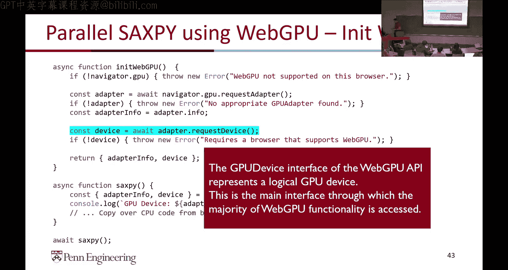

I want to show you something quick。In our browser。

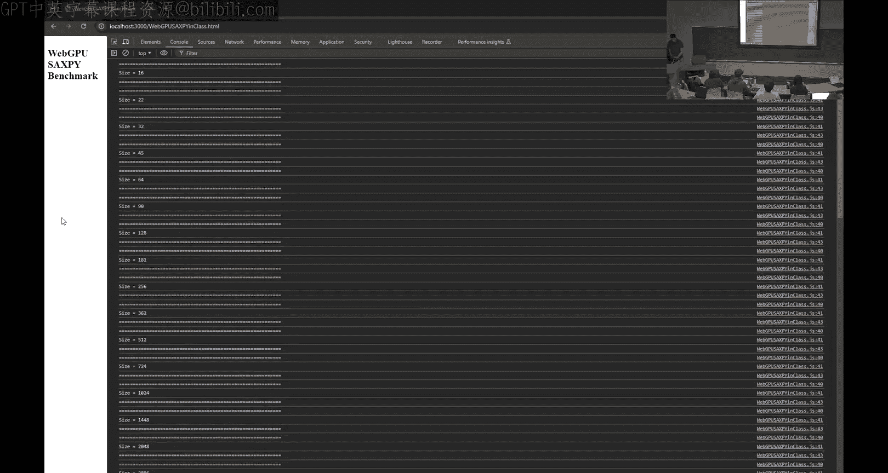

So I think I print， I'm not printing yet。

You can go to webgpUreport。org there' is kind of like the webglreport。

org and you can see the device information now if I go to let's say edge。

And I haven't said high performance for E， and I run the same thing。

It will show you Intel so be very careful， especially as you do project four。

And maybe five that you check with GP you're running on。

 your performance will vary drastically based on that as not just performance but your configurations and these limits will vary drastically based on that。

 so make sure you're running on the correct GPU。

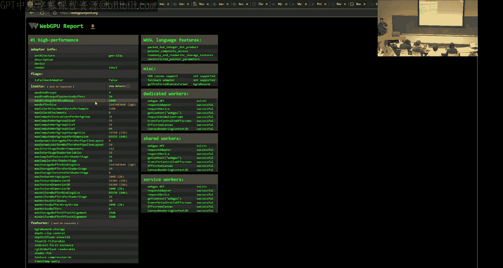

Allな。嗯。All right， so request device and then we'll return the adapter info and devices before and then print the device info here so let's do that quickly and see what the code for that looks like。

嗯。So。All right。

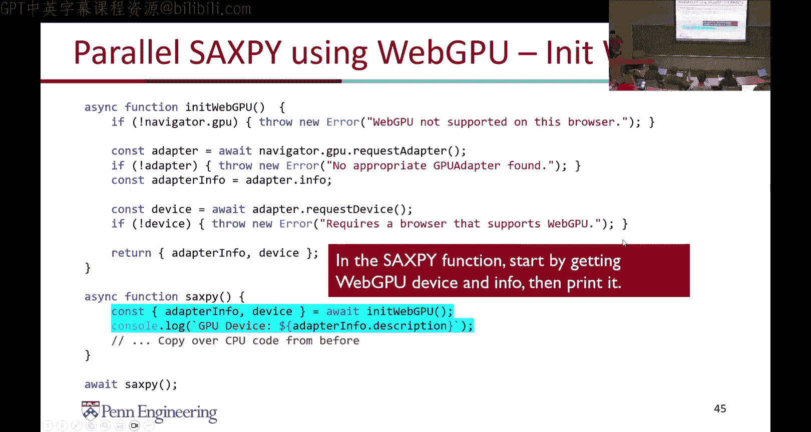

Freshwood Studio。 Alright， so again， I'll go back to my markdown file， and I'm going to copy。

The third function here。Which is in GPU and this async。All right。

 and I'm going to paste these before everything else。Save that。Switch to the browser。

And now， if I run。

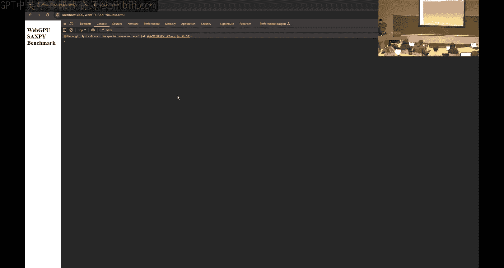

56。

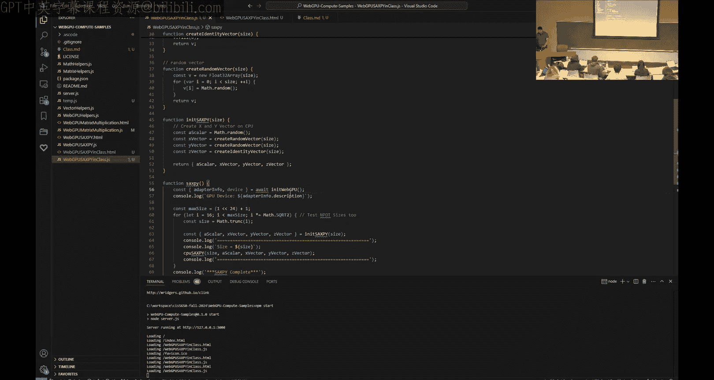

哦哦。Unexpected to serve word。

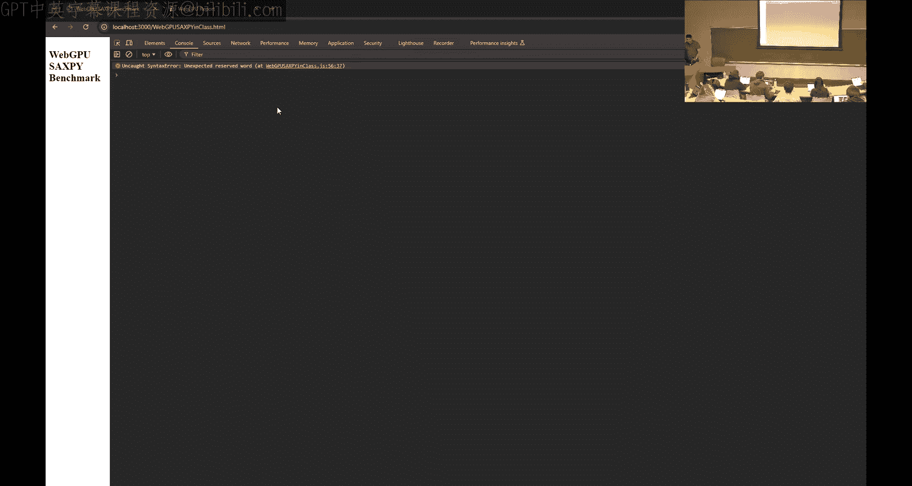

That didn't happen before。

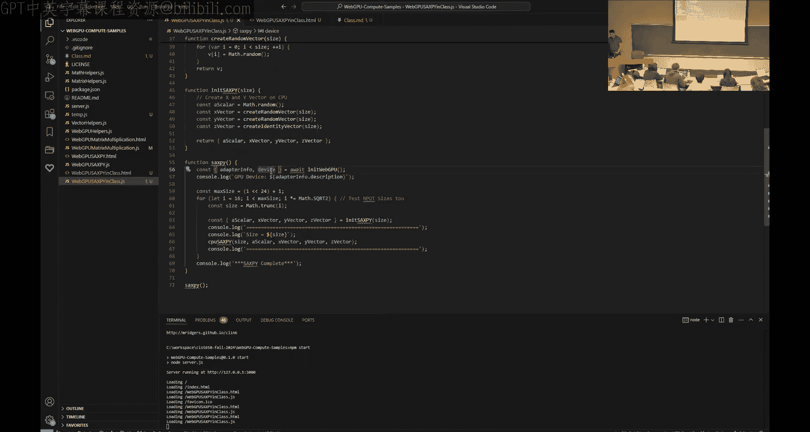

Sorry， one second。No seemed to set it before。

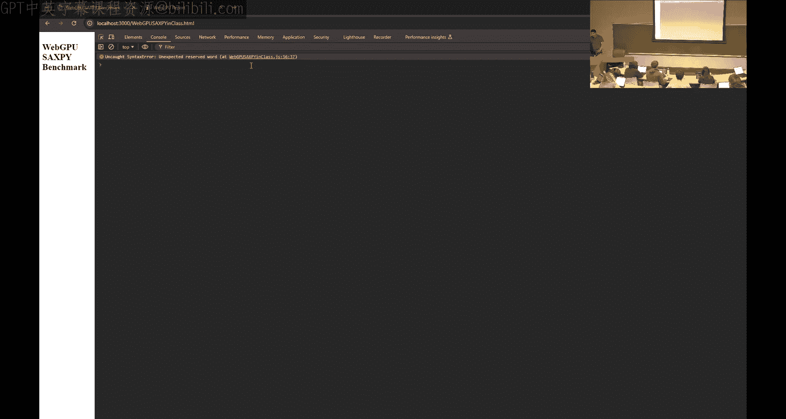

Complete 6，37。Oh you know what， my function is not。Is't yet。Or actually I need to make a I think。

That's why。That's what happens when you try to program life。

All right， so our CPU is running， but now we can identify the GP well now again， if I take this。

 paste it in edge。Once I find the browser。

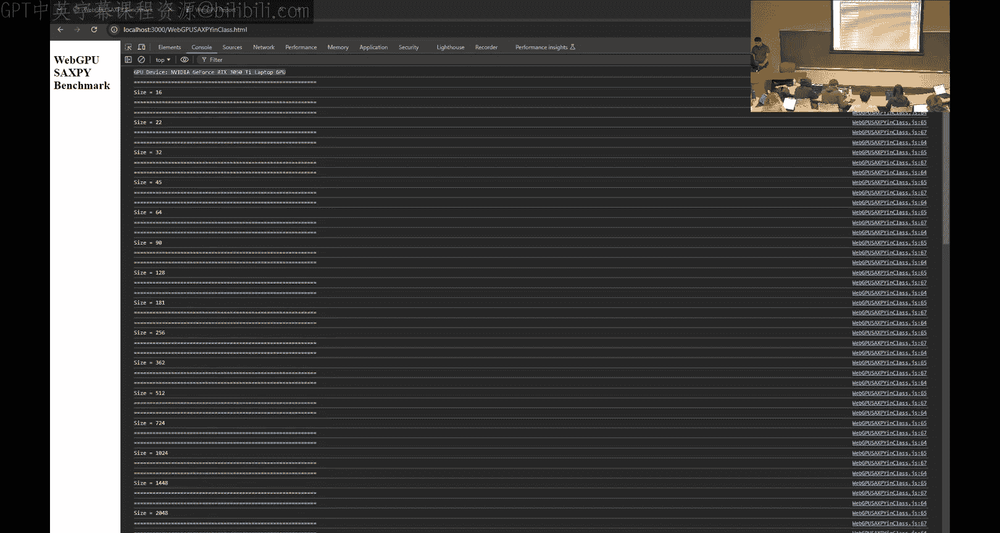

好吃好的。Do ask one。Open dev tools。

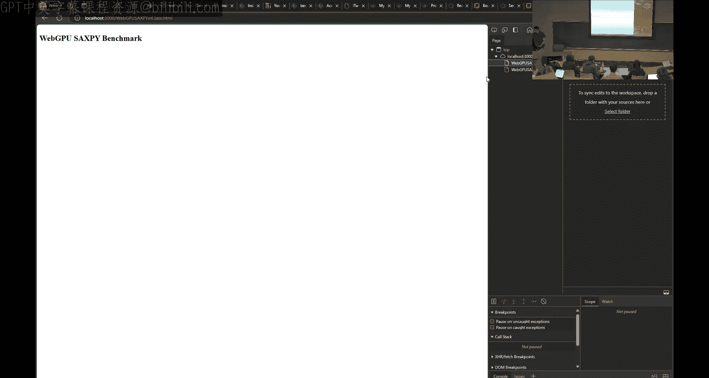

And you can see that it didn't even print the device name because the adapter info for that is not populating。

So， yeah。Let me refresh this just in case it might work a second time， no。

 so it's not even working here。Okay。

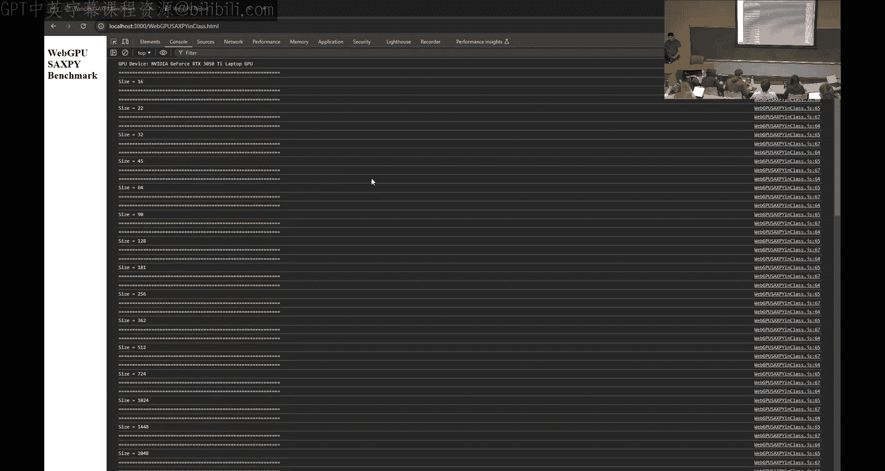

All right back back to a slides the one thing to note is especially for those of you who may not have used promises before in Web GPU is this async await concept async await is how promises are handled in JavaScript E6 before you used to have to do some jumping around and nesting and stuff but now it's really clean with async await so async tells which functions are asynchronous and then a says which。

For which asynchronous functions you're waiting before moving to the next line。Again。

 very similar to。Although the CPU side， this is still similar to how we do QudDa device synchronizing stuff in QUuda。

 any questions on nasyroate？Or on init with GPU。Okay。All right。The one thing to note。

Compared to other graphics APIs， we haven't done any canvas presentation format or anything else here we've just initialized compute。

Right when what you'll see in Project4 as well as from KaI's Gu lecture is that there was a canvas。

 there was a presentation format， RGBA8 and stuff， nothing of that sort here we are doing pure compute。

O째。So now let's start with setting up our web GPU SAXPY so in in the CPU code I'm going to create a new function here that's web GPU SAXPY it's going to pass device and all the other information。

And then we'll print whether the web GPU was a success based on whether the results of the GPU and the CPU match。

For now， well just set up an empty function and pretty much all the slides from here on out will be in the Web GPU SXPY function。

 okay。All right。So。The first thing we want to do like we did in a kuda program was copy the memory right we had the host buffers the first thing we do is copy them。

 allocate them and then copy them to the GPU right so it was you have you initialize the host you do Kuda Malik and then you do kudaM copy that's what we are doing here。

The first thing in WebGPSUS AXPY。First， we will copy the x and y vector and we do that first by doing the create buffer functions。

Create buffer is basically kamalic。except that in this function you can do a couple more things and again I'm not explaining the API exhaustively I'm just giving you comparison points between code and Web GPU。

So you do could device。 createre buffer， it does a Maic essentially， and then you can use labels。

 labels are fantastic for debugging， I use them everywhere。Mat at creation。

 so mapping is essentially having a mirror of the GP memory on the CPU。

So anywhere you see map that's what it means so map at creation is saying hey make a CPU copy of this as well。

 you're giving the size and then the usage as buffer storage so in this case you're not going to rewrite from it right we are setting it once and then we'll be using it as storage。

嗯。In the second way， I'm showing a different way of copying using why here we don't set Mat creation。

 but instead we set the copy destination flag on the buffer usage。

 so just two different ways of doing it。嗯。So that's good a mall now to do the me copy part of it。

 when you have the map， what you do is you get the array buffer from the buffer from the GPU buffer。

And then you set the X vector to that buffers note that we are not doing a GPU copy。

 we are not giving it the X vector GP buffer as a pointer。

 we are copying it to the CPU buffer the X vector array buffer and that will copy it by itself when you do this unmpped function so un mapping is removing the CPU code and CPU memory and copying it to the GPU。

Questions about this。Is there an efficiency difference？あさご。

I I don't know the answer to that I'll be honest these are both ways I've seen on the internet and I'm learning web GPU basically right so I would love to know if there's a performance difference so far I haven't seen anything that says it's drastic。

But somebody like Kai would know the answer to that better so I can pose that question to him。

Let's go to you。可以。I didn't know。That's okay。So extract rain bumper。That gives you。

It gives you a CPU mirror to the GP function， so it's like it gives you a CPU map a pointer essentially to the GPU buffer。

And then cru said。しきで？I咖啡。Yeah， so exactly， it's doing a copy by doing the X it saying set the values of x vector array buffer to x vector。

 That's what it's doing。Okay，So I think this will happen， I think unmap forces the copy to the GPU。

So it seems like the first course does not use a coffee destination。いやあです。

There are other flags that will set that may offset it and so again I haven't done that level of micro benchmarkchmarking yet to have a definitive answer but we'll see in future code that we will set it as read only so I think the impact should be the same。

Other questions and we are also not repeatedly using it we are doing one SXPI and exiting so that's where I'm not sure I' know the micro benchmarkchmarks to say that。

it also， I guess， seems like。We're not really。I think it that way。1 want0。You might be。

 but at least at this point， we are doing a comparison between QUDai API and Web GPU API。

 so we're not doing a comparison on the performance of QUDa versus Web GPU。Yeah。

Any other questions here？Okay。All right， just other way of copying it which is here we actually do a right buffer which is kind of like coa and copy。

 we do the right buffer from CPU to GPU。OK。For the Z buffer。😮。

Here we don't have to copy the memory we just have to create right so we we are going to create theze buffer give it the byte length and then we are going to do a copy source。

The reason we want to do a copy source is because at the end of the shader。

 we want to copy the memory back so that we can check our result if we didn't need to do that。

 we wouldn't have to do copy source。The flags are a little bit。Backwards where。

Copy source really means copy the source of the buffer after right。

 whereas copy destination means you're copying to the GPU buffer。

 so you have to think about that a little bit。Any questions on this？All right。

There are two other things， sorry go ahead。你收。Yeah， okay。

There are two other variables we need to pass through the GPU what are they？So we passed x， Y， and z。

 what are the two other variables we need to pass？To do SA X PY。Lth of the vector N。

 how should we do that？How would we do that in Qa let me ask that first。Yeah how。Seets。

Don't know what killed。Exactly， you would pass them by value。

 they'll be in teachers of floats and you would pass them by value and they'll be basically stored in constant memory or registers for all the threads how may we do it in a computer trader？

SB。You might be complicating it there。What is constant and for all threads。

 you know Kudakal the properties right， what is constant and for all threads？In a shader uniforms。

 so we are going to use uniforms for that。So here's how we are going to set it up。

We are going to create two value flow， so8 ps I know we have to be 16 by line but this is fine for now and。

We are going to use the create buffer again， but this time we are going to pass the uniform flag to it so we are going to copy it to the destination and set the uniform flag and then we are going to use the device you write buffer to write the uniform values which we stored as an array into the uniform buffer you don't want to copy each value by itself like like Agaya said like Kaai said you want to create thestruct and then copy that and we'll see how to read these in the shader soon enough。

Kind of covered that， covered that， also covered that。

So at this point you've basically set up the program where you want to write the kernel。

 like if you were at this point where you're writing Kuda kernel and passing your properties now you want to go like your actual kernel right so let's work on the shader now。

So this is what the compute trader for SASPY will look like。

First we have how we want to read the uniforms， we create thealarstruct again you can call it anything you want but I'm calling it scalarstruct and we have size and scalealar there for convenience I've made them both floats again of course you can define that as an array buffer and have different types in there I've just made them floats。

And then for these binds and groups。Kai explained this a little bit on Monday。

 but I'll do it again here。Binings。are essentially the order of the parameter so in your in your k kernel you' will be like size a X y z right so that order is what the bindings define they are like which parameter goes into which hole。

UmOr let me put it this way if in your CP， you were saying。Devicice or sorry。

 if in your CPU call to the ka kernel， you were saying。Size A X， Y， Z， but in the kernel。

 if you were reading size a Z Yx， you would have problems。That's what the bindings are doing。

 they're making sure the right parameter goes to the right location。The group is the group of mining。

 you can group them together and lay them out and we'll cover how that does and how that happens in a little bit。

You define storage and types as well as read only so these two X vector and y vector like I was saying before a read only for Z vector you do read and write。

You could potentially do right， but I don't remember if that's a flag or not。

 and then you also define what types they are。This is different in web GPU where you define。

The block size。In the kernel。 So work group is a block in Web GPU as well as other shades。 Yeah。

Are both zero。 And what are they like。Subgroups。So you can use the same shader with different memory。

Right different buffers so you can bind different buffers to the same slots and have like ping ponging or other ways of using the S X PY shader so you can have different groups and that group would have different bindings or you can have。

Different binding layouts for the same group so theres different ways of mixing and matching depending on how you want your shader to run again if you think of it from a coa kernel perspective you can pass different memories to the same kernel kind of like doing that。

Yeah。So let's say if you do four the same group。Should the one passing。すまイこ。

Like two different orders， finally。好。So you're already finding like 0，1。怖いつ？Yeah。Do like see my。

But still in group zero you would have to change， you would have to write a new shader for that order then so that's why you have to do the bindings。

 both the shader and the CPU have to match， otherwise you're going to create errors。So based Ukraine。

Yeah， and like a quo kernel， you if you change the function definition。

 you have to change the or you know， at least create a function where you're reordering the parameters and calling the other function。

Okay。嗯。So types， I was saying this is different for K and Web GPU where workgroup is a block and within the shader you're going to define how big。

 how many threads in each block。So work group size goes here。

 so remember that and we'll come back to it later。This compute main is the main function that gets called when the shader gets executed。

 you can have other functions， the compute main is not a keyword。

 it is whatever you want it to be but you have to tell on the CPU side about what the entry point is。

The built is kind of like the thread IX block IDX of。

Compute trailerrs here I use global invocation ID which is equivalent to doing block IDX times Bin dot x plus T IDX and then you have xyz components to that so you can get xyz there are other in builtins included not an exhaustive list but like local invocation ID is equivalent of T IDX work group IDs block IDX numb work groups as bed dim。

So you can use different， whatever is required for you， you can use。Whenever we do matrix multiply。

 I actually use three of them to do matrix multiply。Okay， I realize we're coming。

 so I'll take a pause maybe at 650 is for anybody who wants to leave for the Pixar event。

Let I equals indexes basically this line here comparing again Kuda and web GPU and then we want to check for the bounds and then perform a development wise operation this is very similar to Kuda no real change here and that's a good thing so any any questions on the shader itself。

Mck， sorry if you already said this。The binding and the built in。It's the order of the bindings。

After the built。the independent Yeah， so although the compute main is looks like a function call and is a function。

The built ins are completely separate from how you're sending。

Pointers essentially from GPU buffers into a shader so so those come here。

 these are all built ins that you're going to call in the function API。嗯。是可以。的我。Yeah。

 and we will see that in matrix multiply。Okay， other questions on this？Okay。

 so let's run through as much as we can。So now you take the shader code and then you have to create the shader module from that。

So shader module is like what essentially gets the shader to be compiled and stuff and you pass the shader as a string。

 so in your project4 what if you dive into the preprocessing code。

 you'll see that some of this is happening there as well。

You can use work group size which is a JavaScript variable insider shader。

 but you can template it and stuff so that way you don't have to hard code everything。All right。

So now you've written the shader， but that big question about bind groups and stuff telling us。

 so let's look at that。First， you're going to tell。The CPU side， what the layout actually is。

 what is the order of parameters right that matches the shader。

You can as long as whatever order this in， this is it matches the shader order youre good。

 so there's no compulsion to put one thing before the other。In our order here， we did uniform X， Y。

 Z， right so that's what I'm going to do here。Uniform。

 so you see the visibilityities computers of visibility defines。嗯。

whichhich type of shaders or first binding defines what location it's in and then visibility defines what type of shaders can use it。

 you can have bindings that can be for vertex shaders。

 fragment shaders etc in our case we only have a compute shader so everything is compute here。

And then we also say the buffer types so read only storage for X and Y， again。

 going back to Alan's question about you know， can there be forms difference。

 I think this will mitigate it。So so that's the main layout here so right now we've just said the order we haven't actually mapped any buffers here。

 we haven't actually said this is why except for my comment， we haven't said which is what here okay。

In the bind group， so this was bind group layout。😡。

This is bind group so here you're actually mapping the buffers itself so now you have the bind group layout which you' are going to specify here so again you can have different layouts for different shaders so that's why you can connect this。

And then for entries， you can have uniform buffer， X， Y， and Z。

Okay so lets say lets say you had two shades， one that did SA X pY。

 one that did minus y okay just for the heck of argument。

 you could have the same layouts and the same bind groups except call different shaders from that。

Okay。So again， this all of these are basically going into how you call the compute shader without parameters。

 you don't get parameters in shaders， so this is how you bind your device pointers to the shader。嗯。

Okay。Let me pause here if anybody wants to head out。

 I think I will finish this lecture and keep it as a recording so I would recommend that everybody watch this I won't cover。

Could advance quoa part one and then matrix multiply and save that for a future lecture。

So it's all Web GPU today yeah。Okay。I here。あ有没。Thank you。没有为。ませ。道没开始。是。Thank。一个。I just got。どうでへ。到我。

对发。嗯我。经我这个套东西。一嗯。I the same cater。So you're saying instead of calling with X Y Z。

 I want to call it with ABc， yeah that this is what so you would have Xy Z bind group and an ABC bind group。

 but your bind group layout can be the same。So this is all about the reusability of certain components。

我是。反对作业。还。Iing其。Okay。So。So you're not saying which is fled。

 which is not the bind group doesn't actually care about that。Again。

 if you think of how things are map between KudDa and Web GPU， which is how I've learned Web GPU。嗯。

Each one is like a separate part of the line of the function parameter， so if you have cons float x。

The con is being defined here。The x is being defined here。And then float has being defined here。

 so it like it is like all in different parts， but they've kind of tried to modularize it as much as possible so you could you could potentially do SAXpyY with integers。

 right？😊，So now before we said， could we do。ABC， yeah。

 using a different bind group but your bind group layout can stay the same the shader can stay the same。

Let's say you wanted to do in teachers。You don't want to use floats， you want to use integers。

 you would write a new shader， but your group and your bind group and your bind group layout can stay the same。

But have different in teacher shader。一请你这下回包过来。Do you need to have the buffer at all。Yeah。YesSorry。

In buffer。系。是吧。But this one。呃，那个好。Oh， that's because it's a uniform。所以那我基于你。

Maybe but I don't know like we can try it out right now。

 it will complain to us or it may complain to us。Let's see。

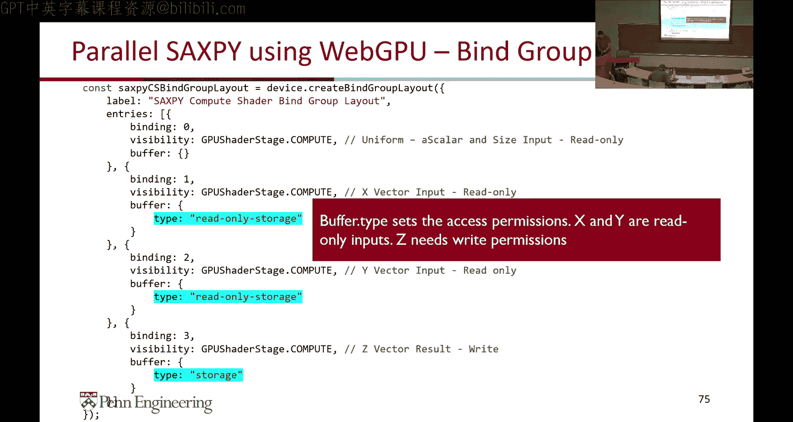

So go here。有规本。R。Alright， so I have the。Coy memory function。And these two lines here。All。

And then we'll copy some of just setting up the vectors。😔。

I'm not sure if itll call itll complain to us before we。

Execute the whole pipeline so we can take that as an experiment once we get there。

Because all of these commands are completely asynchronous。 There's no guarantee that。

There's no guarantee about when they actually run。Okay， then another copy buying group。哦。

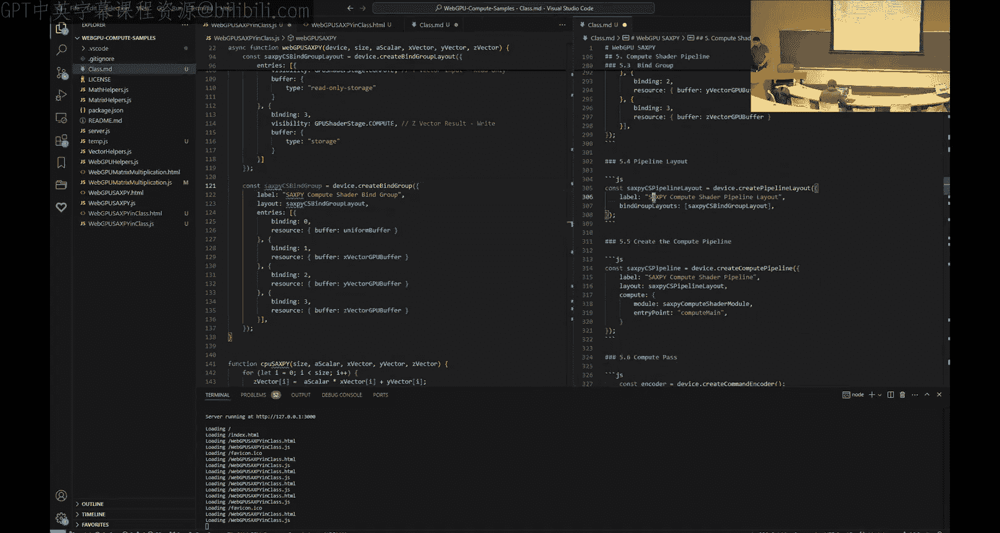

All right， so I'll save that here， but let's come back to it。All right。

So now we've basically set up how the。How the memory should be passed through the kernel， right？

What we want to do next is actually how do we invoke the shader？We've spoken about。

Setting up the shader， we've spoken about how to map it， map the GPU and the buffers。

 but we haven't actually said， how do we call the shader， you know in kernel in kuda curl， we do。

Colonnel， Chevron brackets and the parameters， we've done the parameters。

 but we haven't done how do we call the kernel， so that's what's happening here。So from the shader。

And the bind groups we create a pipeline layout a pipeline layout is a list of bind group layouts that one or more pipelines can use there's basically all of that flexibility if you have many shaders。

 if you have many bind groups this is what it's going to help with。

So and then once you have the pipeline layout， you're going to actually set up the compute pipeline。

So layout will give you the pipeline layout that we just set up。

The compute bracket so that's where the compute shader you're creating is module is the compute shader module that we compiled before with the string text and then at entry point now youre defining what the main function of your shader is like I said main or compute main is not a keyword it's whatever you want it to be so that's where you are going to name it。

嗯。You could potentially have multiple main functions in a shader and have different shader pipelines for each one or compute pipelines for each one of them。

 so again it's about that reusability in compute。这台灯。Oh yeah， definitely。

 I can show like I think your project4 will have that yeah。Again。

 here I'm simply showing how do you do pure compute？In your project4。

 you'll definitely see how do you combine with other stages of the pipeline as well。

Other questions on this？All right。So now we actually get to invoke the shader。So for that。

 we have to do a compute pass and you'll do like render passes and stuff and project four here we are doing a compute pass。

And we start that by doing this create command and code function。So encoder is essentially。

Creating a list of commands and the order of those commands to actually execute here it's simple we are executing one computer trader so it's not going to be that complicated。

 but let's go through what we do。So first for the compute pass。

 you want to actually begin the compute pass， so you're recording the order of execution here。First。

 you set the pipeline， so this is like saying my kernel right。

 you are just saying my kernel in the bind group you are saying what your buffers are from your CPU again mapping this back to Kuda right？

And then in dispatch work groups here you're creating the Chevron brackets for how many blocks you want to launch。

So for blocks， we do the worldro size and the total size。Whyren't we doing number of threads？行。

But where are we setting the number of threads per block？

Back in the compute shader you guys remember I said work group sizes we define it in the shader itself。

 so that's why we don't pass the work group size here again just make sure you're using the right size for divide otherwise you'll have the wrong number of blocks。

So that's， again， a difference between Kuda and WebGU that in Kuda you will define both number of blocks and number of threads at the CPU。

But in web GP compute shaders， the number of threads per block is defined within the shader itself。

 and then you're defining how many blocks on the CPU。Okay。Finally， you do a compute pass end。

And then do this device Q submitmit encoder dot finish。

 which is essentially saying O GPU go run these commands。This is asynchronous。

 so it doesn't mean that as soon as you're done with that command， you'll have all the results。

 even if you put a weight in front of it， it's not going to do anything because it's asynchronous on the GPU。

The one thing to note。These encoder function API and the class is essentially unusable。

After you use device to a submit， it can't do anything more if you try to call it。

 it will actually give you a error happened to me。So once you call encoded or finish that encode is done just discard it what you want creating new encoders is essentially free so you can create as many encoders as you want for this purpose。

Okay。What are we mess her？What did we not do？If we are same device you submit and execute all the commands。

 what are we not doing here？Reading back results exactly。

 so there's two ways we can do we can read back results。

One is read back results before device Q submitit or we start a new encoder and then do device Q or do the compute pass。

In this example， I'm going to do device or copy back within that queue。

So to copy back is kind of similar to how we copy two GPU memory。

First you stretch a staging buffer essentially on the CPU。Or sorry， no。

 on the GPU you said a staging buffer and because we haven't given the Z buffer that we originally created all of the right permissions。

 so we are creating a staging buffer that will do a GPU to GPU copy。

So that's why we have copy destinations so we are copying to the staging buffer and we are passing the map read so that it maps to the CPU and we can read that memory。

If it were map right， we would map to the CPU and write to the memory。

 but here we are doing map read。嗯。So once you've done that。

 then you can do copy buffer to buffer which is like kaM copy device to device and then you can pass in the buffers here I'm not using any offset so it's pretty straightforward。

And then you can do a device queue submit as well。Once you do that。😮。

Then you have for reading that buffer on the CPU you again have to do that map。

 so first you do the staging buffer map acing so youre actually saying okay map this now。

And then you do a new float from that map range， so Z what the GPU result is actually on the CPU。

Kind of like back reverse of what we did to copy data to the GPU， we are doing the reverse here。

Any questions on this so far？No。So when you do await Z vector stationging buffer that may not be。You。

 you get the results after。Like everything。Like in the compute pass is finished or yeah。

So this map async。We'll make sure that this this function it' done。

If you if you didn't do something like this and did this and then try to read it on the see it won't work again。

 by experience when writing this example I ran into that I was like okay， this is not waiting。

 my results are on garbage， you actually have to do it this way。

Any other questions on this on actually invoking the compute trader？

对你 kind be other the way to the children the。So we let me go all the way back。

So in to copy from CPU to GPU we have these two buffers right two ways we can do deviceq right buffer and then we can do this map method as well。

 so we are doing the reverse of this to read the GPU memory back now。Can you use right buffer to？

To copy from GPU to CPU I haven't seen an example of that again I haven't covered the API exhaustively as I know Kuda so there might be a way I'd love to learn more I haven't explored all of the documentation to know the answer to that。

So that's why this。This method of copying back here is what I've seen across all of the online resources。

 so that's what I copied as well。Yeah。Okay。Once you are done with that。

 so now you have the vector on the CPU， we'll actually do our comparison here and if there's another we will exit early。

Once youre done with that， you want to unmat the staging buffer so the memory actually gets released and then we will return whether our results actually matched or not。

嗯。So that's basically all of the Web GP AXPI function。嗯哼。😊，So that's releasing the CPU memory。

So it's saying， okay， I no longer need the CPU memory， I will unmap and release it。That。咩食嚟啊。

That's like， yeah， if you， if you in Kuda， you would do。Host the Kam M copy device to host。

 And then this is like。Fre freeze horsezy， essentially。有。这安。Thankking buffer。Z vector D result like。

anything no， because again， the flags， the flags are。Set to yeah， set to maine。

 copy destination and mappingine。Yeah exactly now if that's why you want to limit the number of flags you use if you have more flags then youre you may be creating a dangerous environment to be doing something like that。

 but so use the minimum flags possible。小朋车。回章。M hes saying。他推着的。CPU we know。That have be。You。

Maybe but I haven't tested it， we can test it right here， like once we have the court。

 we can do those experiments。Other questions？Okay so at this point we are done with the Web GP AXPY function there's two more things we need to do one actually define the work group size so this is basically threats per block I'm going to use 256 although traditionally I've seen most web GPU kernels use less like 643s per block 8 by8 and 2D but for this I use 25600 word fine equals epsilon so we use that function here again they might be floating point differences between CPU and GP I'm just going to compare it based on an epsilon。

All right。

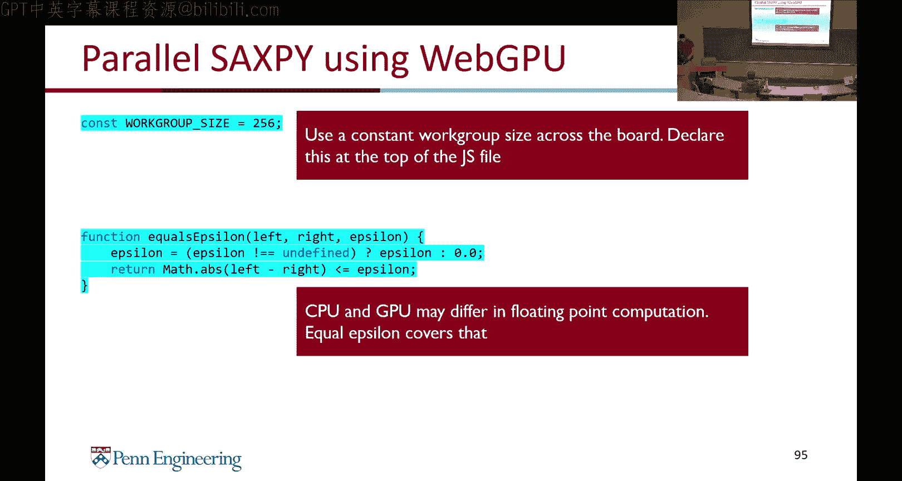

So， with that。Let's go back to our code。And I'm going to copy these。😔，Additional things。

 which I think we have one or two off。You couple this morning。All right。

 basically that's it and I will set。These two values are pop。

O。So let's go back to our browser and we're going to run this。Oops。

S A P I CS S pipeline is not defined， okay。

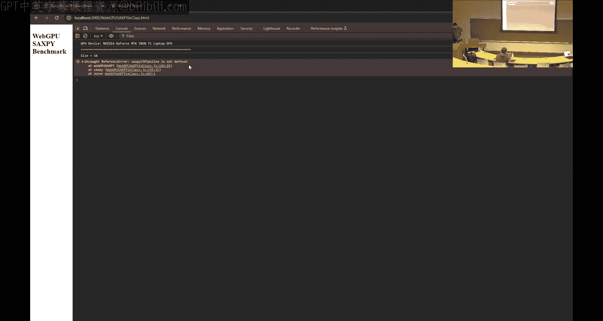

1，49。So I have a working version of this， but I want to figure it out here。拜拜。

Maybe we need copy some of the code。65 pipeline。5 monthsces。Then we need to copy this tour。可以经是。

I mean， I know the code works， so。Oh， I have no idea。 So with these things， it could。

 it could be either way makes。哭得慢了。Kuda Malik managed is something we'll cover in whenever I do advanced Kuda lectures。

 but yeah， it is similar。But， but K a Malleik managed。Yeah， that's using the uniform memory layout。

Yeah， let's see what happens I don't know all right， so this word。

 look at how web GPU success is trooped throughout。The one thing to note is。This， right？

And this is going to be the annoying part of Web GPU。

What is the saying and this is like good error reporting， so I'm glad at least we have that。

Disspatch World group count 65536。Which is for 16 million elements divided by 256 exceeds the max compute group for an NviDdia GPU。

So the same GPU that you run could a kernels on。That we've said web GPU compute traders map really well too。

Can't do more than 64，000 blocks or two power， whatever it is number of blocks。

That is going to be the annoying part of WebGPU， in my opinion。

And each GP may have different limits for this。So this same value on a kuda kernel is like 2 billion something。

And here we are being limited to 65，000 yeah man。Yeah， I'm pretty sure you can。

 so if you go back to Web GPU report。嗯。Max compute world groups per dimension， 64，000。So 64，000 on x。

 64，00 on y， so there are ways you can you know make it 2D and stuff and do it。It should work， but。

It's still compared to KudDa it's underreable limits。And unnecessary limits， in my opinion。

 but I think the reason they have to do it is also because。They have to even on GPUus。

 they have to like。Build web GP for the least common denominator so I think that's why they have some of these limits。

 but then again this is something very specific to the GPU so I don't know why why this limit is there。

You could or you do two dimensional so your second dimension is you can have one dimensional blocks。

 but you can have two dimensions of blocks right so that way you can if you if your block is y equals1。

Then you already offset it by a certain amount， so you can have  d blocks but 2D number of blocks。

 but 1 d block itself。So there can be other ways around it。Okay。Alright。

 so let's let's do some of our experiments that we spoke about。

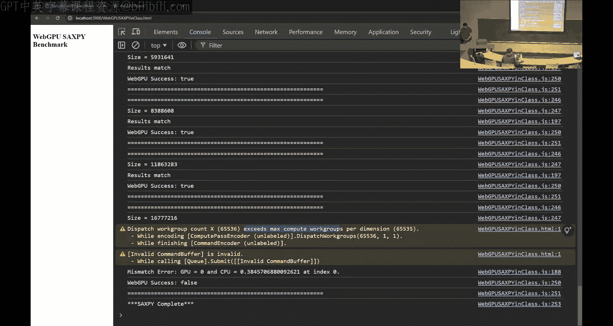

嗯。First， I think was， do we need to pass buffer anything， right？So let's do that。

Then let's see if it complains。No， oh， it did complete。

It did complain so again notice how all the compilation happens before any of the execution so because we are compiling at once and then the GPU might be caing it so just by turning off the buffer it's saying bind group layout had none no entry of buffer sampler texture etc now。

We could say， okay。What if we did buffer， I mean if you do buffer but undefined you kind of get into the same thing as if buffer was not defined so I'm pretty sure we'll run into the same error。

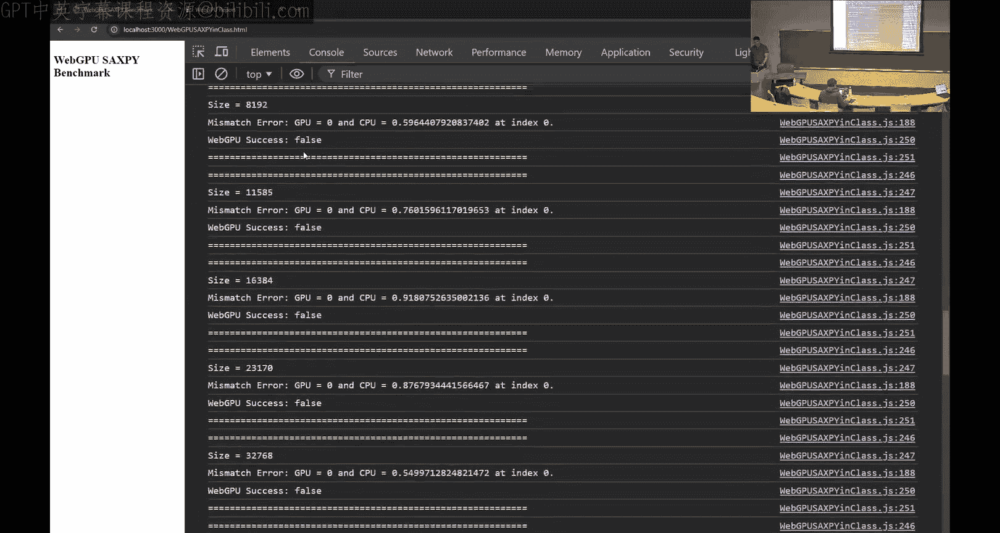

Yeah， same error again， so yeah， we would have to define our empty buffer。Because you can have。

 I guess you can have uniform textures and stuff too， so something needs to be specified。Okay。

The other experiment was we can we unmap before， right， so let's try that。

I'm going to delete that line from there and put it after here。

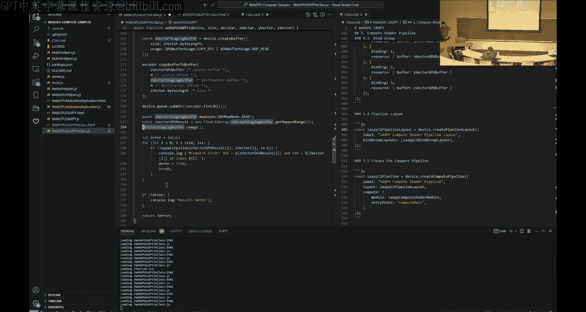

Right，That's the right place。If it unmaveps badly， then we should be seeing failures。Yep。

 you see failures。Look at how the values are undefined now。Yeah。

 so it's completely deleting the the memory synchronously。

 not even asynchronously synchronously it's clearing all the memory。他们拿这。There before you do the。

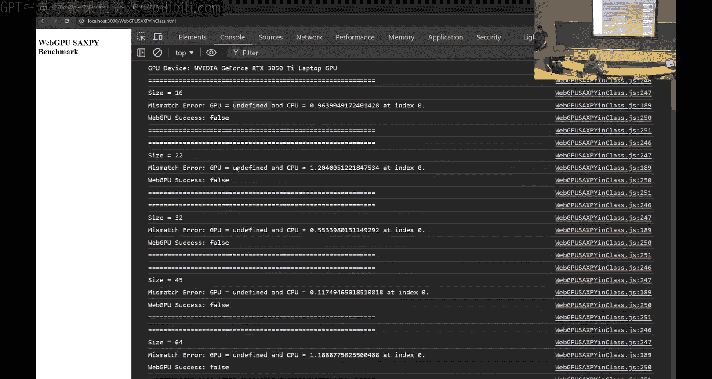

嗯哼。😊，So we've done the map async。We've copied the memory。

And then we one mapped and then we are checking for errors。 and it's saying yourre。

Your Z vector GPU result is undefined now。So no， you can't unmap before you're done with the CPU。

Yeah， yeah， unless you make another CPU copy of it and then delete it。😊。

So that's another way of doing it。Okay。I'm at the end of SAXPY。

 so I'm more than happy to take any other questions around any experiments here。So。嗯哼。😊，So海 the。So这。

No， I thought the result matched。

广告的。Oh， the last one was a false。Because of the block size， so look at how everything is true。

 the last one is false because it didn't actually launch the kernel。Any other questions？O。

We'll cover matrix multiply in the next class， so I'll go over similarly for matrix multi my go ahead。

there's such things as like you。

嗯。说。I mean， if you want to go sneak peek。

It's in the 2024 reap already， and I've deployed a web page。W， where do I find web page。

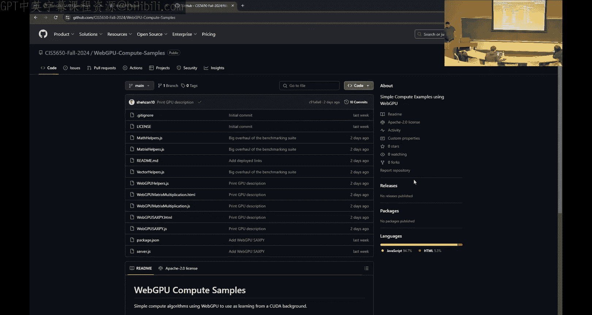

Alright， I would just put it here。 so I I made it a little bit more beautiful where I actually had this is this is my level of web programming and I'm proud of it。

 Okay， so I've I've made a beautiful table It has colors as well， so I will take that。😊，Yeah， okay。

I struggled with this， so I'll just put that out there。

 it does use a table library so it's not I didn't do all the CSS and stuff。

But you see some pretty good results like compared to the CPU you get。

 I mean on the smaller size I would have expected a smaller difference but。😊。

You know on the bigger sizes， you still get a decent speed up。

 let me run this again in case it's caching。Yeah， this makes more sense where you actually get pretty and notice how powers of two get you a bigger speedup this is a power of two。

 this is a power of two， this is power of two know this power of two and this power of two you get significantly better speedups than nonpowers of two just something I've observed for that GP。

All right， SAXPY done。Here has matrix multiplication。So let's run basic squared only。

And it runs a bunch of sizes。嗯。Let's see how that goes。But yeah， there is shared memory。

It has some weird quirks。嗯。Oh no shared memory doesn't have your quotes sync threads version of F GPU has heard quotes shared memory had to look deep into it because there's not too many people actually use a shared memory so I think my example might actually be a really good use case for how to use shared memory but yeah that is a concept of and it does give performance improvement so let's wait for the student slightly it's taking longer because the CPU is slow not because the GP is slow。

嗯。Any other questions while this friends？反正。Yeah。行。Okay， so you're saying JavaScript。

 SaxP versus a C plus plus SaaxP。So I don't think there' will be a performance difference。

Javascript JavaScriptscript at that level is fast enough I many years ago I did a benchmark like that。

I didn't see a difference。嗯。Just pure compute， I don't think you're going to see a major difference between JavaScript and C++。

Of course， if you and I'm purely limiting it to Saaxby at that level of benchmark。

 I don't think you're going to see a result。I think this map hung。什么呀。😔，Let's read。

 let's run this again。So yeah， I mean， the VA8 engine and Chrome and stuff is pretty good now to convert JavaScript into native code and run it。

 I don't think that overhead exists anymore。Yeah， Mike。Something that I L I。好去。

This完毕。可说。

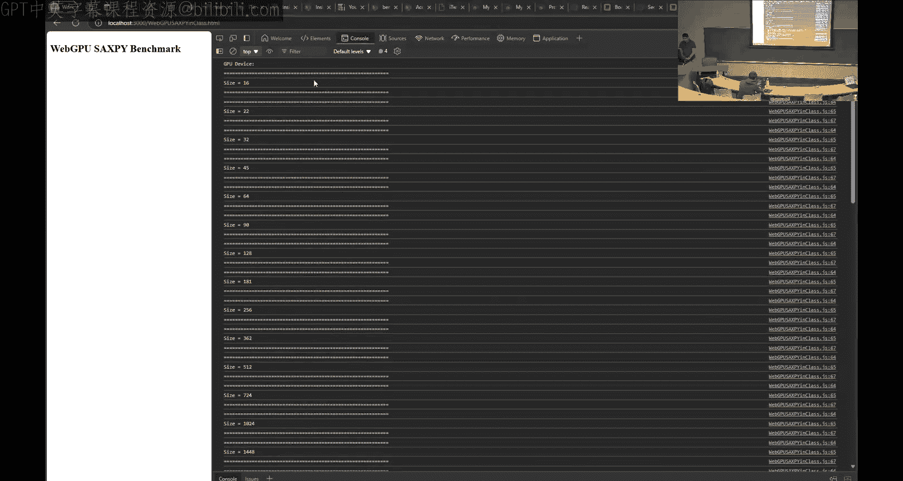

likeI'm running this in edge， which willll run it on In。

All right， so it's running pretty well。But here as well， it's giving a workgroup count error。嗯。

I'm sure there are other things we could do that would break this so was your example like can I use 1024 threads per block or something let's try it。

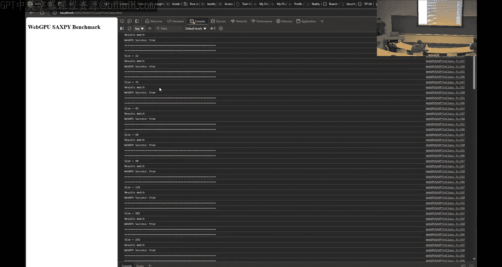

Why not。

But before we run it。Let's look at Web GPU report。So this is Intel clearly there's no description。

 so that's why that was empty。嗯。You want to see work group size x， all right， so it does do1000。

So that's pretty reasonable。Computer dimension yeah。

 there might be other things that it may not be good at， but。

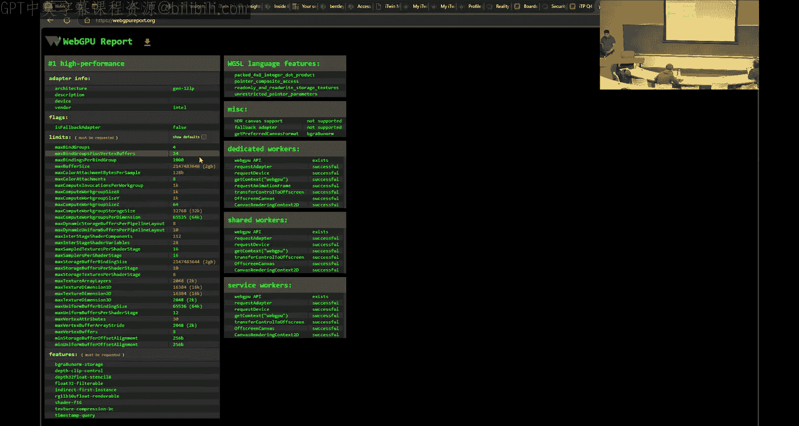

So at least it' on the compute side， it's really good。

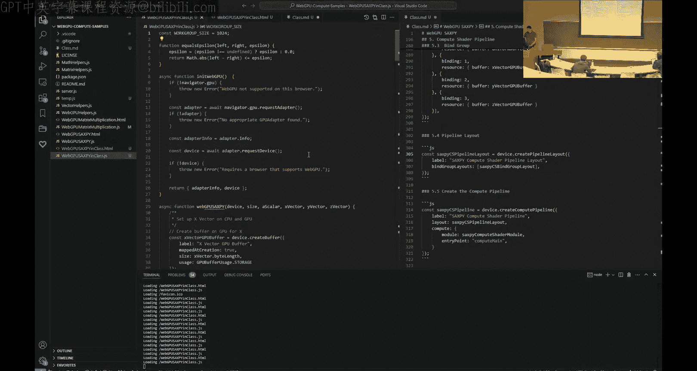

Okay， let's come back here。You have to know just as hanging。

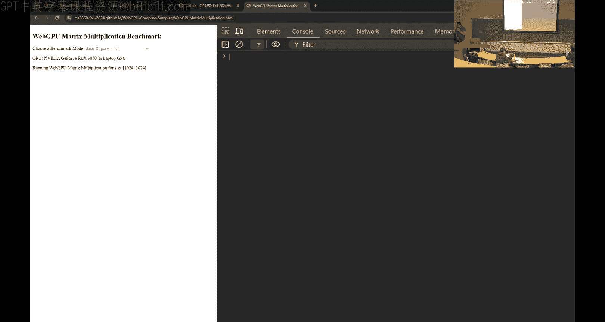

Yes。Okay， send updated to 1440。Hopefully it will go to 2048。Otherwise。

 I can just run my local version。I can change those sizes and run my local version。

Let me do that until then？哦。

AllThat's already nine， okay， so good。Let's see did this work。😔。

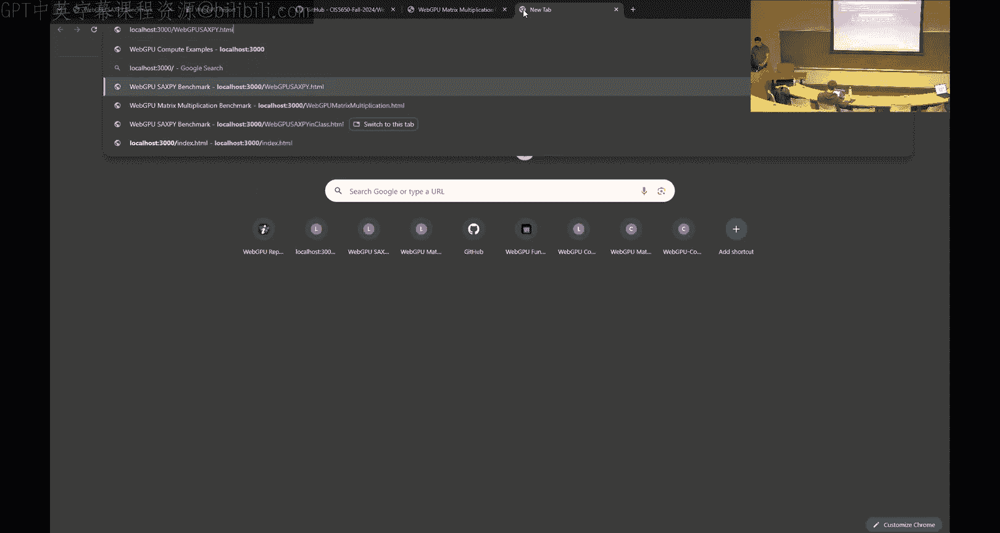

So I'm running my local version that only goes to。5，12。

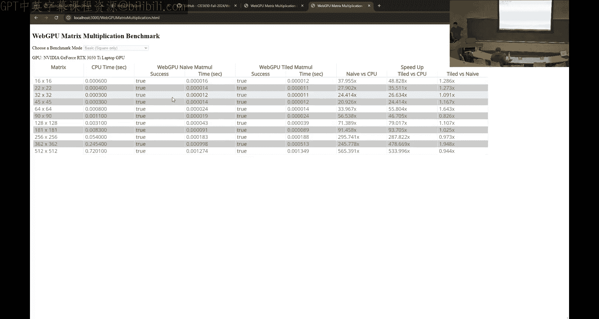

So here you can see， actually let me run until 1024， I think that might be better。

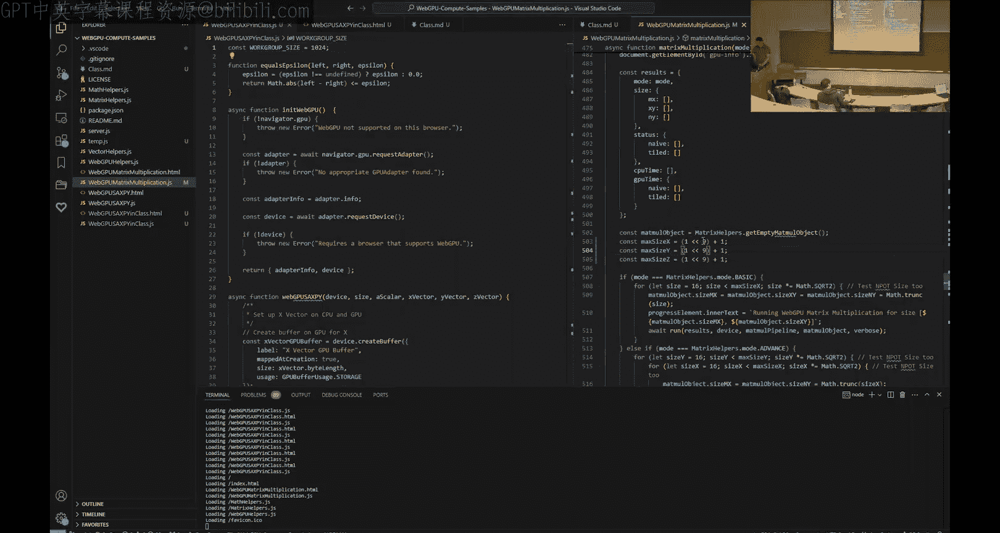

Okay， so here I have the live MaM again which we covered in the first lecture and then the title MaM that uses the sharedd memory and you can see the performance improvements here。

Some of this， again， weird  quoterks。Sometimes I've seen drastic performance improvements between tile and knife like here it basically says no difference and I'm not entirely sure why but you still get pretty awesome speedups over CPU for sure let me run that again to see and maybe me running this might be affecting it too。

都不可。One thing I'll show about the bind groups and stuff。

嗯。

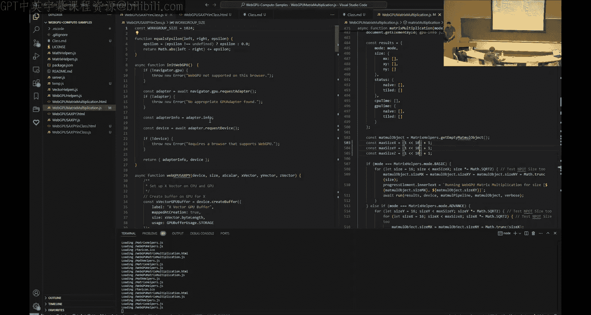

So in this this was a cleaned up version of the code so I've combined everything before I had a knife JS file。

 I had a tile JS file here I've come pretty much combined everything。

Zoom in so now I have this matrix shader object which has both the shader so it has the knife shader and the tile shader this is how you do 2D blocks by basically having 2D work sizes and this is their version of shared memory no not that sorry this is their version of shared memoryops。

You say war work group size for sharedd memory and you can see that we are defining it2D。

 but what I want to show is。For naive and tiled everything is the same except the shader。

 everything is the same how you call the shader is the same the bind group is the same the layout is the same everything is the same right so that's what you're going see here is we copy the memory like we did5 CxpyY no difference copy the uniforms no difference create both shaders so in this case we are doing the knife one first so you'll see this flag here will help us do the knifeive。

😊，We only do one bind group layout because the order of and the buffers are the same。

 so one bind group layout。One bind group because the buffers are the same too。Then you do。

The compute trade pipeline。And again， you just do one of them because they're independent of the shaders。

But your compute pipeline itself is where。Things start getting interesting where you do different modules for that。

嗯。And then this is how you do performance cybers， I'll cover that in the next class。嗯。

And then you can do the compute pass here。Based on that。So。All I have to do is。In my CPU side。

 what I do is I call this with two different。Options。

 kernel live and kernel tile and these are basically inums here so I've just defined these as that。

They arere nothing but string so once I define these two。

 the function that runs the shader will just pick which shader to run so it does reuse those components when needed。

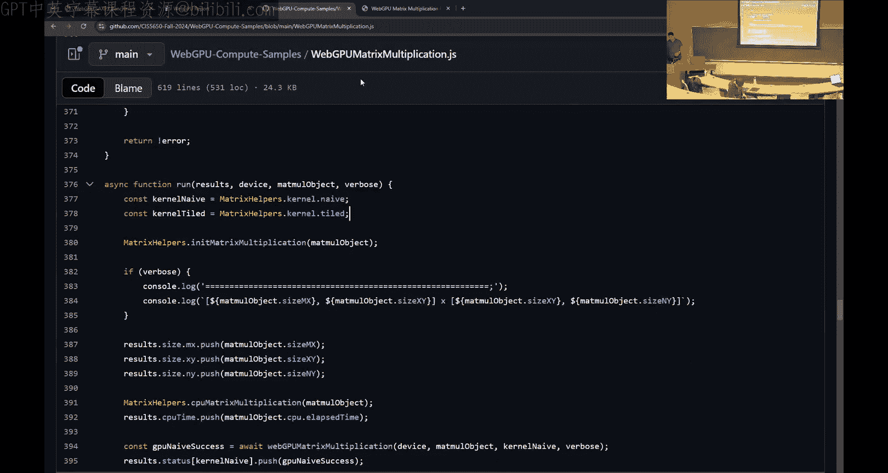

All right， let's see。 Okay， this ran Yeah I don't I don't see a huge difference here。

 not entirely sure why， but this is public here。 so you can go to。

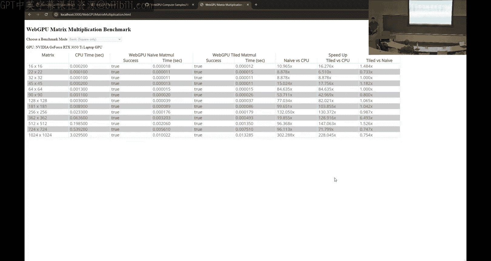

Go to our 2024 repo and you can run it on your laptop。

 you don't even have to compile anything that's the beauty of Web GPU that is all available at the link right you can just click these links in your read。

好的。Any other questions on how Kuda maps to WebGU because thats how Ied I thought it would be like you guys will do project for。

 but this way of learning having learned Kuda can help with the compute side of it。

 especially if you want to do pure compute。that is deployplable across devices。

 so if you want to do a pure computer project for your final project， for example。

 this is great instead of doing some like you could potentially do ray tracing using this。

You can take all your path tra curls and stuff and do it using this。肯定拿的其实能。Limited in。

I'm pretty sure it is， but I don't know if it's limited less， but let's check it out so you have。

Dynamics storage。M Bush。storage buffer oh interesting there's a storage buffer binding sized limit so you cant have buffers more than 2 GP。

 I think。Subgroup size。Yeah， I'm not sure I'm not entirely sure which variables I'm looking for。So。

Work group size， work group standard size， I think this is， yeah， work group standard size is 32k。

I think on my NviDdia GPU， I think it might be either 48 or 64 k so again。

 my there is there is definitely a hard limit。Is it less than your traditional kuda or not it may depend on the GPU。

Yeah。So I think this adapter info is going to be very helpful to make those decisions。喂。是2。嗯哼。😊，So。

So in and this is the only way I've done it I don't know if there's a dynamic way of allocating shared memory or not。

But that's a knife kernel Yeah， I basically did work group size， work group size。

 which is what we do in matrix multiply as well。Again 1D buffers in matrix multiply example。

 I think we did 2D arrays here it's all 1D， but you can again do the same linearly。

Linearization that we did for other places as well。Yeah， love。这就是不能。No。

 you have to use different modules， I didn't use the same modules。

 so I have two different shader objects。Mattrix shader object of this enum is this and then I have a nine version and then。

What you'll see here is I have this kernel option， which is the enum and that will be used in compute trader module。

And it will pass which kernel to create that for。科技公。You could。

 you could say in the same function if you wanted， if you wanted to modify the code。

 you could do everything the same。And。You first let's say you do the naive version of this compute pass。

 copy everything， do the comparison， and then call the tile version in the same function itself。

 in which case you can use everything to be the same I haven't done that yet but that's certainly a cleanup thing you can do if you want to。

Thank is。No have other。So you do this and project five is going to be optional that GPU。

 so you'll have Walcan or web GPU option and we'll do caution plas for that。分十八十边。

Yeah that's why I do it in final projects， that final projects， whether you include Ka school。

 Walcom School， where GPU school， the final project is there for you to explore that。Okay요。All right。

 let let's end here and then we'll meet on Monday to hopefully cover the matrix multiply part just to cover the basis and then we'll do that once coooter as well。

嗯。

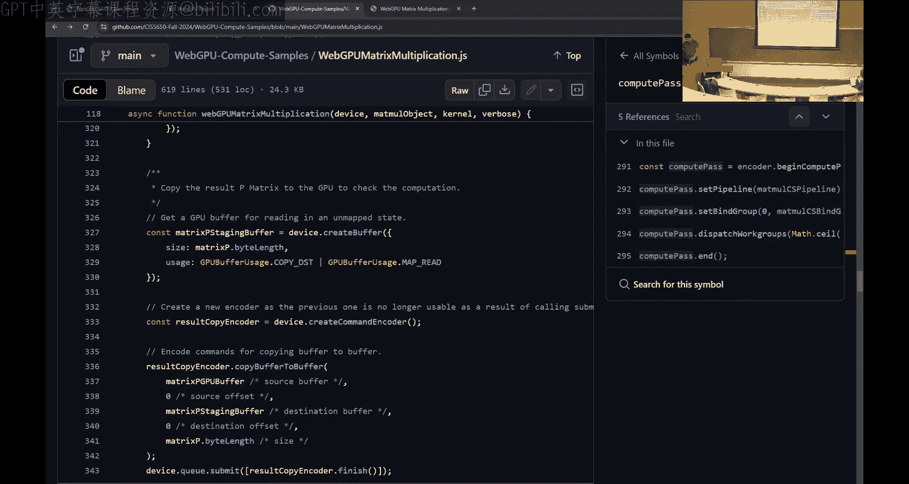