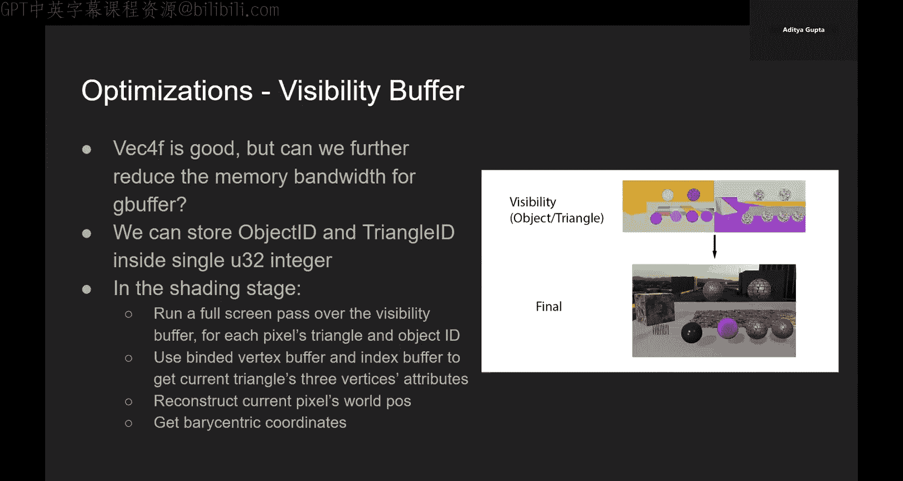
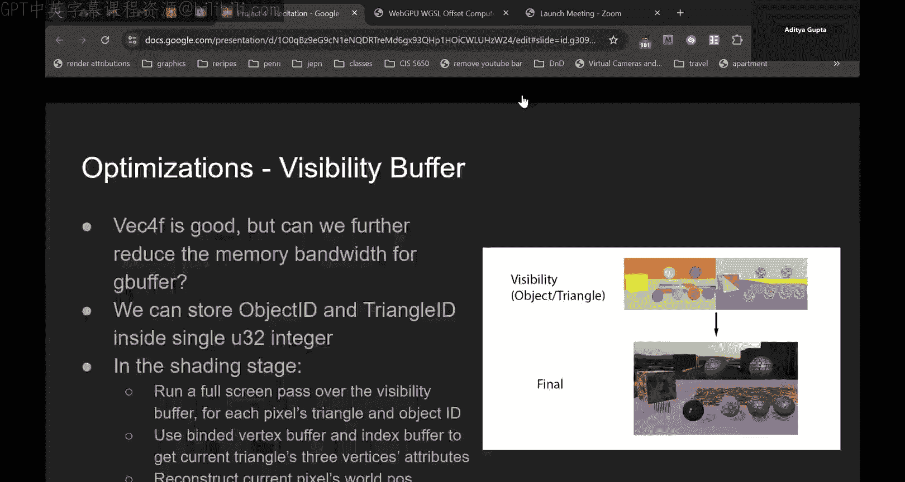
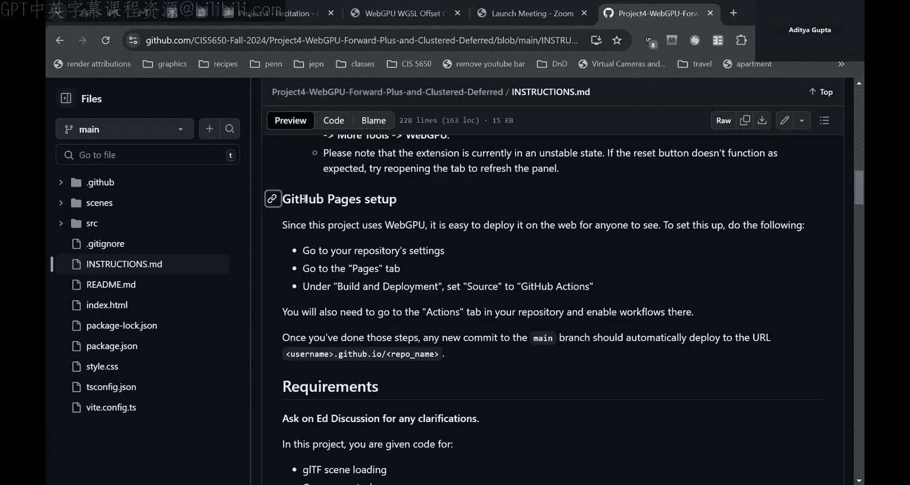
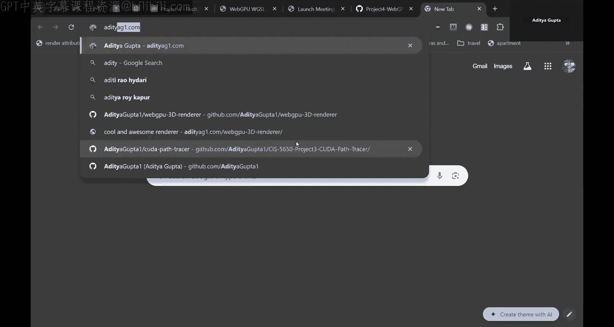
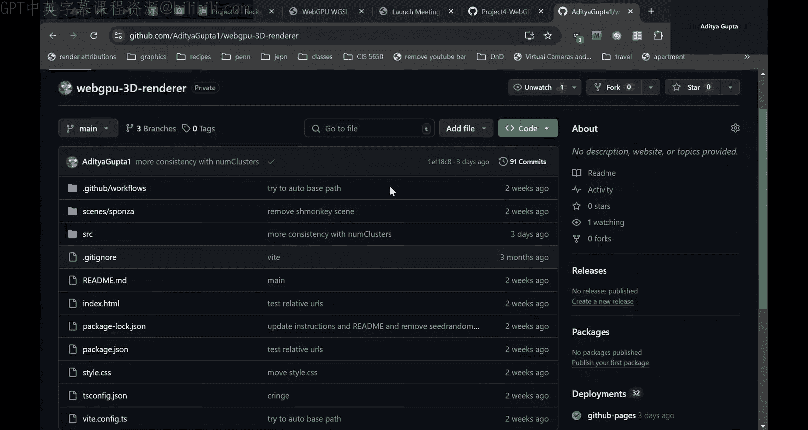
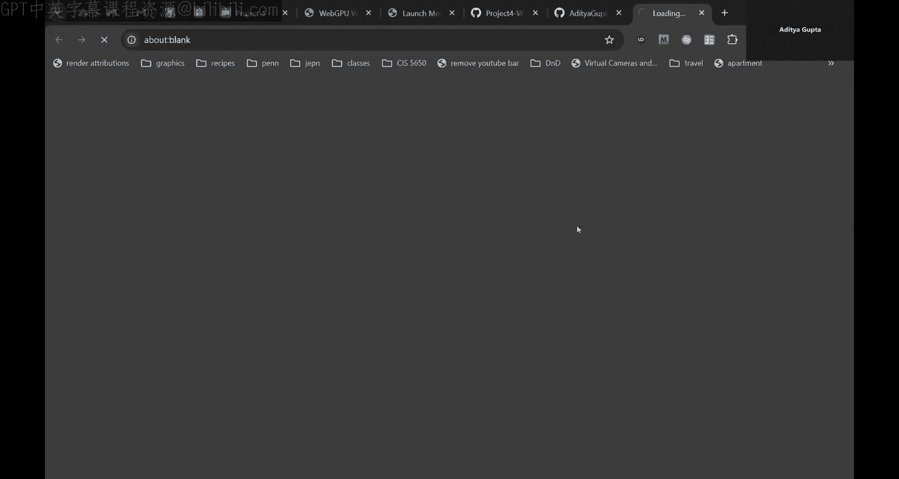
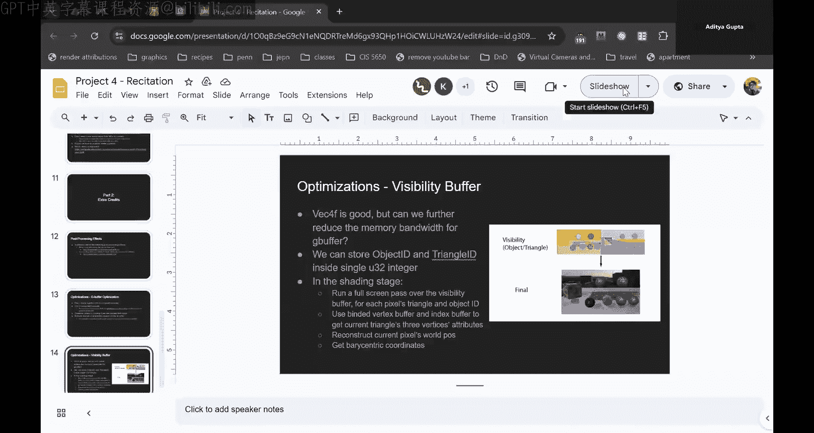
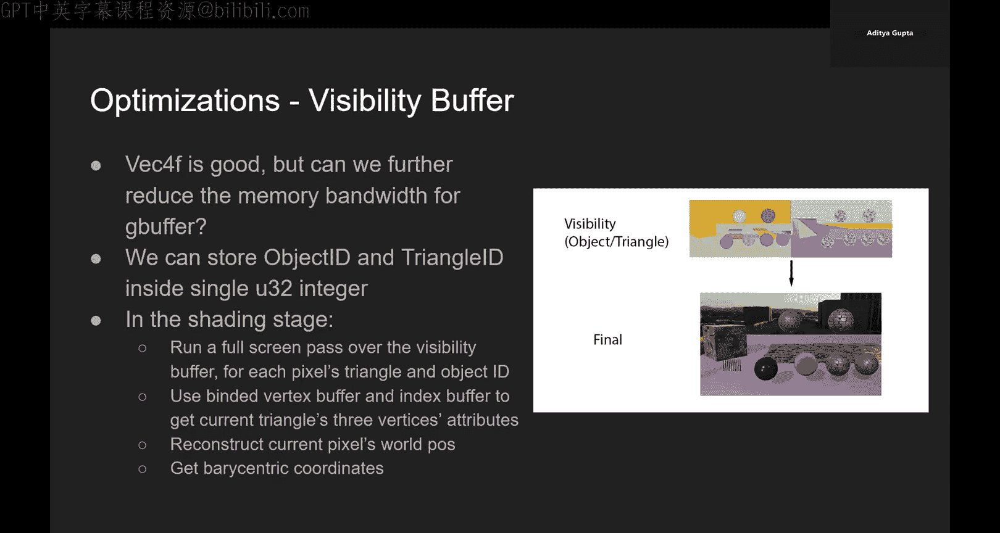
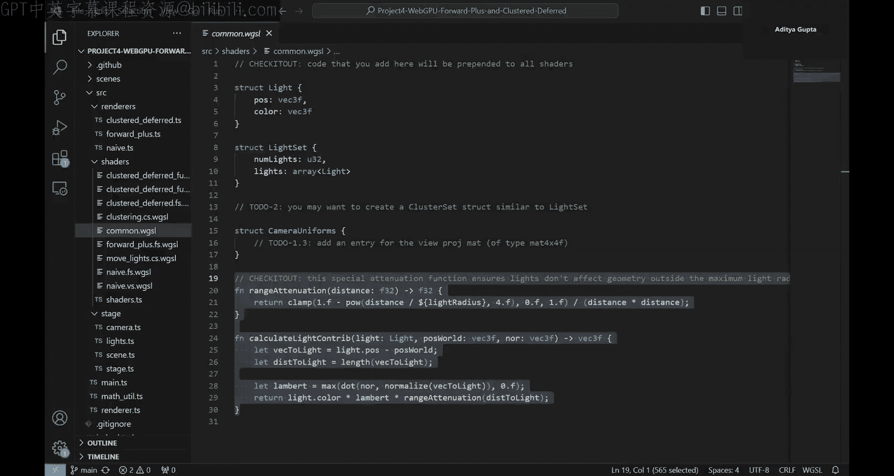

# GPU编程和框架：9：项目一基础与渲染技术概述

在本节课中，我们将学习课程第一个项目的基础设置、三种核心渲染技术（前向渲染、前向+渲染、延迟渲染）的原理，以及项目代码结构。我们将了解如何优化光照计算，并熟悉WebGPU项目环境。

## 🛠️ 项目环境与工具配置

为了顺利完成项目，你需要配置以下开发环境。

以下是推荐的工具和配置步骤：
*   **Node.js**：项目需要在本地Web服务器上运行。安装Node.js是必需步骤。
*   **浏览器**：推荐使用**Google Chrome**。它支持所有必需的WebGPU扩展，并内置了调试和分析工具。
*   **代码编辑器**：推荐使用**Visual Studio Code**。它可以方便地配置语法高亮（例如WGSL着色器语言）并设置linter来捕获错误。

项目的基础代码已经搭建完毕。你只需要下载项目，运行 `npm install` 安装依赖，然后运行 `npm run dev` 即可在浏览器中自动启动项目。当你修改文件并保存时，页面会自动刷新。

上一节我们介绍了项目的基本环境配置，本节中我们来看看项目的核心任务与渲染技术演进。

## 🎯 项目任务概览

项目包含三个主要部分，引导你从基础实现逐步优化渲染流程。

以下是三个部分的简要介绍：
1.  **基础前向渲染**：你需要填充一些代码空白来完成基础的渲染管线。这部分完成后，你将能看到彩色的灯光效果，但性能会很慢。
2.  **前向+渲染**：此部分通过**光照簇**技术优化光照计算，只检查影响当前片段的灯光，从而大幅提升性能。
3.  **延迟渲染**：此部分通过使用**G-Buffer**来避免过度绘制问题，为每个像素只计算一次片段。

## 💡 核心渲染技术详解

### 基础前向渲染的瓶颈

在提供的基础（Naive）前向渲染代码中，每个片段（像素）都会检查场景中的**每一个**灯光。这会导致巨大的性能开销，尤其是在有多个物体层叠的场景中，那些最终会被覆盖的片段也进行了不必要的灯光计算。

### 前向+渲染与光照簇

前向+渲染的核心优化是引入**光照簇**。它只检查当前片段所在簇内的灯光，避免了全局遍历。

光照簇是3D空间中的一部分，与2D屏幕上的**平铺区域**相对应。它们不是与场景对齐的轴对齐包围盒，而是与相机对齐的**视锥体平截头体**。这意味着当你旋转相机时，这些簇的边界在世界空间中也会移动。

在实现时，通常更容易计算片段在**视图空间**中的轴对齐包围盒来进行相交测试，但簇的实际形状是平截头体。

以下是实现光照簇的主要步骤：
1.  **计算簇边界**：使用一个计算着色器，为每个簇计算其在屏幕空间（2D）的边界以及起始与结束深度。最大深度可以基于场景硬编码或简单计算。
2.  **转换到视图空间**：将屏幕空间坐标转换为视图空间坐标，这需要用到相机矩阵。
3.  **分配灯光到簇**：对于每个灯光，检查其是否与簇的包围盒相交。如果相交，则将该灯光加入该簇的灯光列表，并记录该簇内的灯光数量，直到达到预设的最大值。

### 延迟渲染

前向+渲染仍然存在**过度绘制**的问题。延迟渲染通过将渲染分为两个阶段来解决此问题。

以下是延迟渲染的两个核心阶段：
1.  **几何处理阶段**：将每个物体的材质属性（如反照率、法线、位置）渲染到多个纹理中，这些纹理统称为 **G-Buffer**。
2.  **光照计算阶段**：从G-Buffer中读取数据，每个像素执行一次光照计算，合成最终图像。

这意味着无论场景复杂度如何，每个像素只执行一次片段着色器（光照计算）。项目中的延迟渲染可以复用前向+渲染中编写的光照簇计算逻辑。

## 📁 项目代码结构导览

了解代码结构将帮助你高效地开展工作。主要工作集中在 `src` 目录下。

以下是关键文件与目录的说明：
*   `src/main.ts`：应用主入口，负责初始化WebGPU、加载场景、设置灯光和相机。你可以在这里修改GUI控件。
*   `src/renderers/`：存放渲染器类。
    *   `base-renderer.ts`：所有渲染器的基类，包含场景、灯光、相机等通用属性和 `onFrame` 方法。
    *   `naive-renderer.ts`：基础前向渲染器，大部分已实现，你需要根据 `// TODO` 注释完成剩余部分。
    *   `forward-plus-renderer.ts` 和 `deferred-renderer.ts`：需要你完整实现。
*   `src/shaders/`：存放所有WGSL着色器文件。`common.wgsl` 会被自动附加到每个着色器前，用于定义共享的结构体和常量。
*   `src/stages/`：包含核心功能类。
    *   `camera.ts`：相机类。你需要在此处向相机Uniform缓冲区添加视图投影矩阵等数据。所有Uniform应打包到一个缓冲区中一次性上传，格式需与着色器中的结构体定义匹配。
    *   `lights.ts`：灯光类。`doLightClustering` 方法是实现光照簇计算的核心位置，其中的逻辑可被前向+和延迟渲染器复用。

## 💎 实用技巧与额外挑战

在实现过程中，以下技巧和挑战可能对你有帮助。

### 内存对齐

WGSL/WebGPU中的内存布局可能有别于你的预期。例如，一个包含 `vec3<f32>` 的结构体后可能会插入填充字节以满足对齐要求。你可以使用在线工具来验证和计算结构体的内存布局。

### 额外挑战

完成基本要求后，你可以尝试以下挑战以获得额外加分：
*   **实现后处理效果**：如泛光、色调映射等。
*   **优化G-Buffer**：
    *   将数据打包到 `vec4` 中。
    *   使用双分量法线（因为法线长度为1，可重建第三分量）。
    *   使用八面体法线编码将整个法线打包进一个 `u32`。
    *   通过深度和相机矩阵重建世界位置，减少G-Buffer属性。
*   **实现可见性缓冲区**：这是一种更极致的优化，只存储物体ID和三角形ID，在着色阶段手动获取顶点数据并计算光照。
*   **支持其他光源类型**：如聚光灯、方向光等。

## 📝 总结

本节课中我们一起学习了第一个项目的全貌。我们从配置开发环境开始，逐步深入探讨了三种渲染技术：基础但性能低下的前向渲染、通过光照簇优化性能的前向+渲染，以及能有效解决过度绘制问题的延迟渲染。我们还快速浏览了项目的代码结构，明确了主要的工作区域。最后，了解了一些实用的调试技巧和可供探索的额外挑战。现在，你可以开始动手填充代码，将黑色的屏幕变为动态的光影世界了。