# uPenn《GPU编程和框架｜CIS 5650 GPU Programming and Architecture Fall 2024》中英（Claude-3.5 p16 2024-10-14 - CIS 5650 GPU Programming Fall 2024 Lecture 10.zh_en -BV1sRtresE67_p16-

Okay。Okay。在。O。Start from the top。

Okay。So， let's。So I'm going to kind of start with。Restar with the Web GPU SXPY function。

And now that you have a little bit more hands on， feel free to stop me again and ask any questions。

So here before this， we did the CPU SAXPY。We did inner GPU here that I won't really go through I think all of you know that by now。

 so now what we have to do is we have to take our inputs X and y cop them onto the GPU copies the。

The uniforms and then do the' say XpyY， okay， using a compute shader。

So these two again I'll go slightly faster than I did on Wednesday。

 these two are examples of how you can allocate memory and then copy that memory to the GPU。

 so this is essentially if you compare to Kuda Kuda Maluk and KudaMco operations on the CPU for these buffers。

The the one thing to remember here and we will see this repeatedly is these flags like usage which really define what are the controls around that memory in KudDa we have cont for example。

 here you're going to define whether it's read write map to CPU map or whether it's map for reading or writing and so on so there's a bunch of flags that youll have to take care of。

Thena。Un。So un map， so mapping is and you have this in other graphics APIs as well。

 where if you want to copy memory from CPU to GP or the other way around。

 you have in Kuda KudaM copypy， very simply API just does the thing it says。In most graphics APIs。

It needs to em map。 So what you're doing is you're taking。

Memory from CPU and GPU and mapping them to each other， and then you do the copy。

So once you do the copy， you have to do the unmpped to release whatever memory that youve mapped。

 otherwise you will have a memory read later。Or potentially be unable to use it。原本啊。Outside。是。

In this case yes， because we are copying from CPU to GPU。

 so it's going to take the host memory and create a map of that on the GPU and when you do this line here it will essentially copy that to the GPU。

Right， so if you remember in Kuda I showed one slide many weeks ago that had the pin memory side of it。

 so you're taking host memory， putting it into pin memory and pin memory to the GPU。

That's kind of like this where you mapping the rage you're saying， okay。

 this can be copied to the GPU and then you're actually copying it there。Other questions on this？

Okay。All right， so I've run through that for。The thing to note on the Z side is again。

 the flags here。And you have to pay particular attention to the direction flags。

For Z remember that we are not copying any memory from host to device right all the memory is going to be written on the device itself what we need to do is copy the memory from device to host to actually do the error checking you know is our computation correct。

So that's why the flag is copy source， we are copying the source of the buffer from the GPU to the CPU so you have to think of it from the GPU's perspective about which flag you want to be using。

 so that's why copy source。嗯。So and then we look at uniforms as Joanna mentioned earlier these need to be4 byte aligned in my case I haven't found that to be necessary for less than four bytes。

 so I've just done two and。不是。I guess if youre using a flow 32 array。

 it's already 4 by line no matter how many you use。So here， again。

 if you think of SAXPY on a kuda kernel。What are your arguments with the colonel？It's x， Y， and z。

 and then what else？What are the two other arguments you need to pass？Number numberumb of values and。

The scale of value so you need to pass the a value and the length so that's why we have these two floats here and again compared to Kuda you can pass these y value in web GPU and other graphics APIs you need to create a buffer for them to put them onto the GPU。

Uniforms here are very similar to constant memory where they read only by all threads and write only from the CPU。

 so that's why we use the copy to destination flag because we are copying from host to the GPU remember its from the GPU's perspective and then the uniform is saying this is for as uniform buffers。

Create the value， and then we actually copy the values to the uniform buffer on the GPU。

Any questions on this？So again， think of all of these write buffer。

 create buffer as kudakuuda M copy。For buffers think of uniforms as pass by value generally。

 it's not a universal road， but anytime you think oh how am I going to do this in Ka that you would map it to something like this on web GPU？

Other questions on this？Okay。All right so I've covered that so at this point we've kind of set up our arguments or our memories on the GPU now we are basically ready to call the shader。

So this is what our compute trade is going to look like。And there's a few differences。First。

 we set up astruct that takes on our uniform values。

 you could potentially have multiplestructs for each uniform value。However。

 that practice in Web GPU is is。Discouraged thank you if you're passing multiple uniforms to multiple shaders and stuff then sure you can have multiplestructs。

 but in this case I just have one compute shader I have two values I'm just going to make them onestruct。

😊，This groups and bindings we will come back to in a little bit。

 but essentially what they what they are there for is。😊。

Again in your kuda kernel you pass let's say length a X y z right there's a certain order to it and then you have to use that same order on the CPU as well if you use a different order on the CPU you' arere going to mess things up。

RightSo that's basically what's going on here just defining the order of the parameters going into the compute shader and we'll look at how the CPU side of it uses it in a little bit。

Okay。Then you have what types of arrays they are and what kind of usage you have again this is very similar to the usage patterns you have in kernels Matt。

So the verse two that vector or xor y vector count't have like。I believe default is read only。

 so that's why readr is defined for Z vector。Yeah。Other questions？This might be so。So， the the。

Like is there a reason high or do we do like write only is there a reason read I don't think that is a right only in yeah。

 okay。I think the answer is just that there are optimizations for。I anything right。Yeah。

Other questions？Okay， so that's the pipes。Then one of the major differences between KUuda and Web GPU is that。

In Web GPU。The block size isn't defined on the CPU side。The block size。

 there is a number of threads in a block is not defined on the CPU。

 it's defined inside the kernel itself， inside the shader。Okay， so this。

TheLine here is what the work anytime you see workgroup think blocks in terms of kuda。So work group。

 you have to tell what dimensions and size that shader is going to follow and all invocations of that shader will have to use the same sizes。

So that that brings some level of。Strictness to it。

 but also helps with the portability of the shaders themselves。Okay。

The compute main is a user defined term， its something you can write。

 but remember it because you have to point to it from the CPU that's the entry point of the shader itself。

And then in red CPU。Just like we have in Kuda。Theres a bunch of built in variables like we have thread IDX block IDX etc in Quda you have a bunch of built in variables in web GPU as well in this case all we need is the global index we don't need any local indices so we are going to use the global invocation ID give it a variable name and the type the type is usually web3。

嗯。And then you can use that so global Invocation ID is essentially if you do block IDX times block int X plus thread IDX。

 you get global Invocation ID。So we don't have to do that computation now inside the shader。

You can copy the value， do a check， and then sayXPY， nothing special about this line itself。

 this should look very familiar。Any questions on the shadowr？啊。Pa imvocation， what is。はい。

It is global in unique axis， and I'll show you matrix multiplication for that。Other questions？嗯。

So now that you have the shader， you need to。Copy this into what is known as a shader module and pretty much the simplest way of doing that is。

Labels use labels everywhere I love them and then pass the shade code into the code property of that shader module。

Now， what we have to do is actually go back and connect all of the memory and types and parameters that we spoke of。

 so we have we have the memory on the GPU。We have the shader， but we actually have to。

Map the memories and then actually invoke the shader。

 so that's what you're going to see over the next few slides。First we have the bind group play。

The bind group play is essentially。嗯。A layout of how。

The buffers are going to be called into the shader。So again。

 if you think of C+ plus and Kuda you don't really have to do this it's a very strongly type language you call everything gets mapped but you are ensuring that the order is correct again if you mess up on the order that's your fault here again you have to define everything explicitly and it's not as straightforward but essentially its doing the same thing。

Where for the layout， it it's。Ordering which buffers and parameters go where。

 so if you go back to the shader here。We have uniform storage storage retried for Z。

 right so remember that order。Here we have buffer for uniform and this buffer empty needs to be there。

 we tested this last time and if you remove that you will get an error。嗯。Then you have X buffer here。

 Y buffer， and then for Z， you have storage， instead of read only storage， you have storage。Y。

Is there any reason the layout is not like intrinsic in the group itself because when you find the group？

Right。In graphicras APIs， that's the challenge， it's not always there because。

They are designed to be a little bit more flexible， I think， in their intent。

 so you could potentially have multiple layouts that call the same shader。

Sometimes you can skip a buffer or not and so there are things like that where it's not strictly typed and that's why you need to give it differently else each time。

Other questions？Okay so bind group layout is the skeleton essentially of how the parameters are going to be mapped so the next question is okay how do we actually map the parameters right and that's where。

I covered those and that's where buying group comes in so now buying group takes the layout so you see how we are calling the layout there and it's actually mapping each of the buffers into the bindings。

So this is now saying。On the kuda kernel side， if you think about it。

 it's actually saying which buffers go into which holes or which parameters for the shader。嗯。

Any questions so far here？Okay。All right， once you have created the layout you then create the pipeline layout again this is it is a simple command essentially what it' is doing is。

😊，Us it。Creating a list of bind group layouts that a shader can be called with。

So a little before on the question we were discussing how you know you can have different layouts calling the same shader。

 that's what pipeline layout is going to do for you so you can have different groups of layouts calling the buffer again if you if we go back to the shader quickly。

You can see that there's groups and then there's binding。

 so you can have multiple groups and multiple bindings。😊，The bind group is one of those groups。

 so if you have multiple groups， you will create multiple bind group layouts。And then combine those。

With multiple binding groups。And then create an array of the different by group layouts to create a pipeline layout。

It's a little bit more verbalboos or probably very much verbals than what Kuda does。

 but it's all there to give you that flexibility in how you call the shaders。Any questions on this？

Okay。All right。From there now we have bind group layouts， we've mapped our buffers。

 we've said which buffers go and which parameters now what we do is we take the pipeline layout。

And the shader module， and now we compile it into one。

And remember when I said compute main is user defined， but you need to remember it。

 so you're saying entry point is here。Now you could potentially have multiple entry points in the shader。

Being called with different layouts and different shader modules。

 but ultimately for each shader invocation， you need to give it one entry point within that shader itself。

Any questions on this？Okay。Co right。So now we've set up everything， we've mapped the memory。

 we've created the shader pipelines， in which case we are saying， okay， how should the shader be run？

Now how do we actually call the shader， right how do we do the Chevron brackets of kuda and actually call the shader here？

So to do that we have to create a command encoder， this is essentially a series of commands for the actual invocation of the Scher。

For a compute pass you can do big compute pass in your project for your you probably have big render pass here I'm only doing compute so I don't have to do a render pass so I do big compute pass I'm setting the pipeline I'm setting the bind group so pipeline is which shade should be run。

And the bind group is which buffers should be passed。Right。

And then dispatch work groups is our Chevron brackets of Kuda。嗯。Shave your passing。

Disspatch work groups， seal of size by work group size。Is there something missing compared to Kuda？

So Mike， so this is number of blocks here。So what's yeah？Exactly， block size is missing。

 so I think you were there in the class the other day， where is block size gone？😊，Exactly。

 block sizes in the shader itself。You only pass the number of blocks to the pipeline。

So in my simple SAXPY pipeline， all we have to do is call compute pastor N because that's all we are doing here。

Once you've finished your commands， then you have to call device。submit。

 which will actually execute that set of commands for you。So now we finish calling the shader itself。

Any questions on this？What。comment。全部という。Assign to the block size。Start it in that way。

ULike I could see， I mean， I don't know if for' here。

 but I could see like for example that you might want to change the block size depending on like and the size of whatever your process。

That's definitely one way to think about it and it's not。

Unreasonable that you could query the device parameters using adapter info and set up a variable that gets passed into the shader。

it's entirely doable right the reason I think they've done it this way is a because it has that flexibility that I just said。

 but B web GPU and any web graphics thing is almost always about lowest common denominator so if you want to hard code that this shader should run be run with eight by eight。

That's what it should be run with right so you get the author of the shader gets a little bit more control in that perspective too。

So you could balance both in this way。Other questions on this？All right。

 so the other thing to remember is that once you do deviceQ submit on any encoder。

 that encoder is no longer usable encoders are essentially free to create so you can create as many of them as needed but once you submit it it's done that just discard that throw it away。

嗯。But even though we've executed our shader， there's one thing we are missing or one thing more we need to do here。

Anybody remember what that is？It's not in the shader itself。So we passed memory， we ran the shader。

 what do we need to do？Bring it back four。😮，Bring it back forward。No canvas。

 only compute pipeline here。What do we want to do with the result？没没是。Or check for errors。

That or in our case， we want to check for errors， did we actually do the right thing， right？

If we do a device submit， we would have to create a new pipeline or new encoder to do that copy。

So instead of doing that， what we can do is we can create a new buffer here。

That we call staging buffer that is。Essentially going to map the Z result into a buffer that can be copied to the CPU。

So for that， we are going to create the staging buffer here and the usage is copy destination。

So we are copying from GP to CPU， that's why copy destination。

And GPU buffer usage is map read so we are mapping it for reading purposes。

 the GPU buffer is going to be read and then encode copy buffer to buffer is KudaM copy in this case device to device and we are copying thezeva to GPU buffer to the staging buffer and this is the amount of bytes we want to copy。

So including that in our encoder is going to make sure that once the encoder runs the shader。

 then it will run this soon after that。And then we can do the encoder device submit。不的。

Questions on this part。Okay。😊，All right， once you do the summit。

 now you actually want to use it on the CPU right， just mapping and or doing the map read here and then the copy buffer buffer hasn't brought it to the CPU yet。

So after device Q submit you want to do an await so that's asynchronous。

 all the graphics APIs are asynchronous and compute APIs are asynchronous so a weight and then you do a map async and GPU map moderead essentially what you're saying is map this staging GPU buffer。

Onto the CPU so that I could read it。Once that's done。

 then you can actually copy that staging buffer into a new CPU side array that you can actually test。

Any questions on this part， so this is essentially Kuda me copypy back， KudaM copy device to host。

Yeah， so I don's like to practice use。Pot cases so you continue do。

Technically would is there anything stopping you from skipping the buffer buffer or just mapping the destination as far as I don't know。

 I did it for claiming that sake， yeah， you know？So， in this case。re not useNo。

 we have to worry about done mapping， so that's the next slide here。So so once you have the map。

 you want to use again， notice how we use Z vector GP result。

We are using the CPU side values here and this Z vector staging buffer is important。

And needs to be done after our use。😡，Otherwise， if you do this before this follow。

 the Z vector GP result is garbage。Okay so that's very important again we ran this test somebody asked the question we ran this test on life code and that result was garbage so make sure that you always copy always write unmap after whatever usage youve completed on the CPU now there might be a scenario where you take Z vector GPU result and create another new vector from it and then you can unmap easily sure you can do that but you're essentially trading more memory for unmapping early so in some cases that might be useful but not necessarily always。

So， once youve done the unmap， then you check the result and return return the value。

 whether it's success or false。Questions on this。That's the end of Web GPSPS A XpyY。No。

Any questions here？嗯。😮，All right， two other things that we literally cover。

 you saw this work group size variable in a lot of places that's number of blocks。

 number of threads in a block， so that youll have to define as a global variable and then this equal epsilon function that we saw here。

 that's like the simple function which tests for floating point data is essentially so because that might be a difference between CPU and GPU。

Okay， any questions before I show you matrix multiply on this？No。

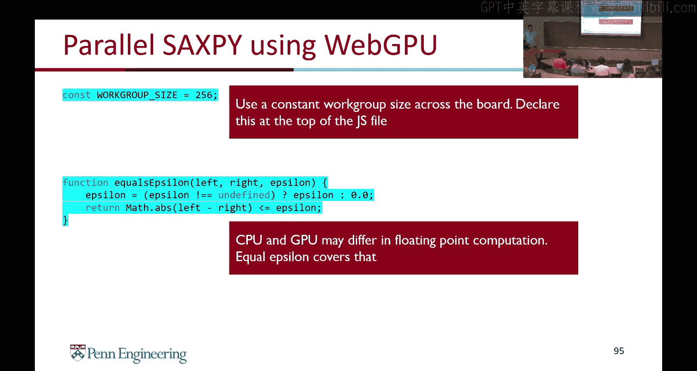

Okay。All right， before I jump into matrix multiply。😔，I think I'm going to show you how to do timers。

Okay。So if you want to do performance timers on web GPU。

 and I think this applies whether you're doing compute or not。It's a little bit。Convoluted。Okay。

The first thing you have to do is。

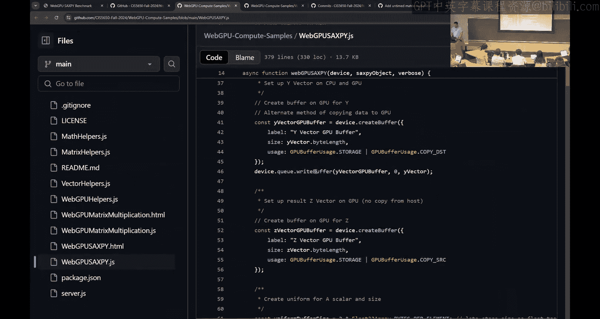

Com here。

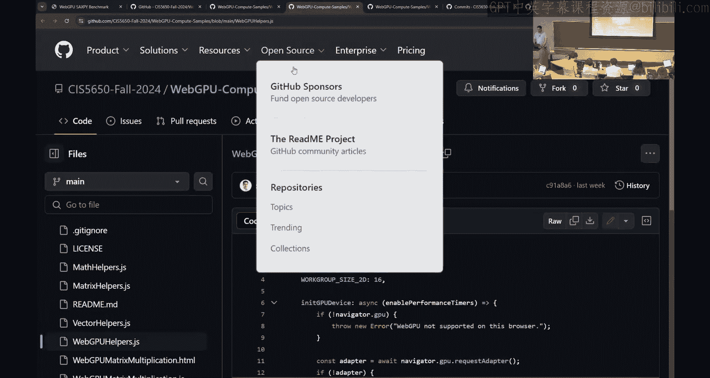

The first thing you have to do is in your init function。I live in you see。嗯。Sorry。

I'm using an older version， which is more straightforward。All right。

 the first thing you have to do is in your in GPU device。You're going to have to pass this flag here。

嗯。One more this required features timequeries time time query again you are going to see this especially as you get more and more advanced you're going to see more of these flags because again the baseline is supposed to be least common denominator and then everything else is added on so in this case。

Timetime query is added on and at least on my computer。Normal Chrome does not run time tra queries。

 it will give me an error it won't return the device。Whereas Chrome Canary。

 which is the nightly build， does do timestime queryries。

 so that's why I'm using Chrome Canary to demo this to you。So once you do the timestime query。

Then you can have a simple function like this， which does where GPU timest and all it's doing is setting a timestamp at a certain point。

You can't use JavaScripts performance now JavaScriptscript performanceform done。ow is synchronous。

 you can use it for CPU， you can't use it for GPU， for GPU。

 you need to use these encoded or right timests， okay。

And then when in the shade when we are invoking the shader， so I'm going to come down here。

Once we have the encodeder。We have to call a function like this。Which is basically getting you。

Buffffer space on the GPU to write times timess。Again。

 the times timess that we have in KUuda are very nicely done because theyll return results on the CPU。

They're doing some polling and other things on the GPU to get you the timets onto the CPU web GPU doesn't do that。

Wed GPU computes the timest on the GPU and you need to give it memory space on the GPU to write those timests okay timests on the GPU so essentially what you' are getting here is。

嗯。Query set is going to be how many times do you want to query the device individually or independently you can reuse these query timers。

 but how many times do you want to individually and independently query query the time so that that's the size of the count here okay。

Once you have that， then we are going to do something like what we did with the Z buffer in SAXPY where we have a buffer for the timets to be written to and then a buffer to copy that onto the CPU so that's why we see the copy destination and map read flag here same as what we did for the Z buffer on SAXPY。

So here's what's going to happen。I need two times timess， start and finish， so my count is2。Okay。

 that's myquie set。My performance resolve buffer is where those values need to be written。

And I'm doing eight because it's eight bytes each long double precision， essentially。

And the usage for that is query resolved。And then copy source because we are going to copy the source of the GPU into the result buffer here。

And then the result buffer after the copy will stored the performance prims。

 which will copy back to the CPU。Okay， so that's happening here。So on the compute path。

 we will add the start time and the end time。Okay， so this is where the query gets set and again if I go back to this function here。

So。See how。I'm that function sorry its scroll to work here。

 notice how I have a query index and query index plus plus so each time the query happens I'm incrementing the counter so that I use the next next space in my query set。

So here's the query set and I'm increasing it by one and it's out creativeative when I reset it to zero with each call。

Okay， so start time end time。Then to actually copy the buffers back like we said。

 we have to do the resolve query set and that is going to map the buffers to the resolve buffer like we see here。

Once the resolve buffer is ready。😊，Then we copy the resolve buffer into the result buffer to copy that back to the CPU。

 so that' is the copy buffer to buffer here。Okay， now that buffer is mapped to the CPU。

And to copy the performance buffer and actually do things with it on the CPU。

We have to do this big in array because it's a long essentially。Long ends。

 performance result buffer and get map range that' will give you your times。

And then you can check what your benchmark is。So I know that was a little bit convoluted。

 but hopefully it makes sense where the the timers are being written to the GPU。

You need to resolve it。Put it into a buffer， copy it to the CPU， and then from on the CPU。

 you can do other things with it。any questions on performance timing because this this kind of stuff is going to be universal no matter which algorithm you use？

No。Okay。

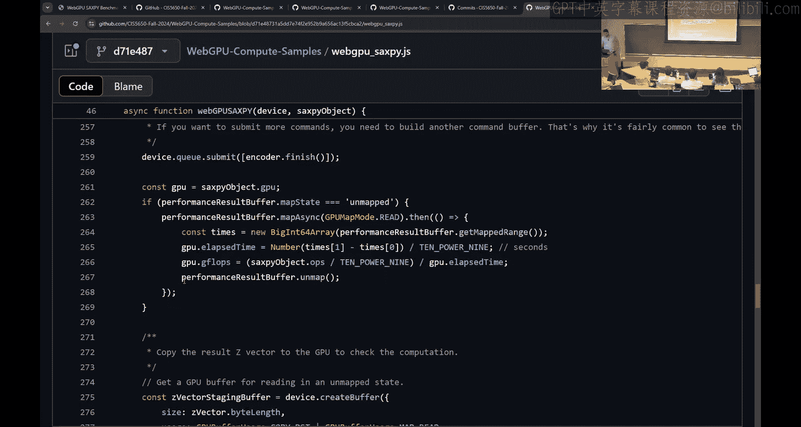

All right， let's look at matrix multiplication then。I'm going to use the simple older version。Again。

 the structure is pretty much the same and all of this code is open source so you guys can look at it。

Matrix multiplication what we are going to do is initialize an m matrix initialize an n matrix and do p equals m times n in matrix multiplication right so that's what I have here m and and then it has to be。

There's a common dimension and then you have the M rows and N columns and so on。

 so that's what we have here and then MNP。First I'm doing in multiplication which will create random matrices。

 just like we did in SAXPY just here we are doing matrices。

Then we'll do CPU matrix multiplication which you know shouldn't look unfamiliar to you。

 it should be pretty much the same where you have two fall loops on the outside and a K fall loop to do the dot product。

Okay。And then we of course， want to do the web GPU matrix multiplication。

 so let's take a look at this。It's not going to be too different from SAXPY。

 but there'll be some things you'll want to take note of。Same as SA XVY。

 look I even have a copy paste mistake， create the buffer for M。Create the buffer for n。Okay。

 so all good there。And then for P， you only need to set up the output。

 you don't need to copy any values to it。Here for uniform parameters。

 we are going to send three values。But just for my cleanliness mistake I made it four values。

 so you're passing size Mx， which is number of rows in m。

 size x y which is columns in M and rows in n and size and y which is number of columns in the y matrix or sorry the n matrix and then I just put a0 I did it this way because I thought I have to pass in another value never needed to use it。

All right。Now let's look at the compute。Same as SAXPY， we start with thestruct for the uniforms。

The parameter is actually quite similar because even in SAXPY you had uniform X， Y。

 Z here you have uniform MNP， so that's what we are seeing here， same arguments and everything。

SX PY was one dimensional here we have matrices so we want two dimensions。

 so notice how work group size has changed to two dimensions here。

Right and I've also reduced my work size work group size it's only 16 now instead of being 256 for SxP1 in one dimension。

 it's 16 by 16。嗯。And then this is naive matrix multiplication。😊。

So you take the you check for bounds and then you do the dot product within the for loop and then write the result to the GPU memory for P。

Again， this shader。😮，Should be pretty familiar to you based on what we saw in the kuda kernels itself right pretty much I copied the code and pretty much changed just the syntaxis of wire and let and so on。

Any questions on the matrix multiplication shadow？No， how we deal with shared memories。

Oh you're getting ahead of me pretty much bind group play out bind groups everything because the parameters are kind of the same for SAxpyY pretty much everything remains the same for matrix multiplication here you can do side by side quote comparison and I'm sure you'll see it's very much the same thing。

😊，嗯。And yeah， then you do encoded path and call all the values。

Just with a 2D invocation and you'll be all set， that's all matrix multiplication needs between SXPY and matrix multiplication that's totally different。

Any questions before I answer next question？啊。So going from SAXPY one dimension to matrix multiification two dimension。

Basically， all you're changing is your shader invocations1 2D instead of 1D and both in the shader and in the CPU side of the invocation。

No questions。

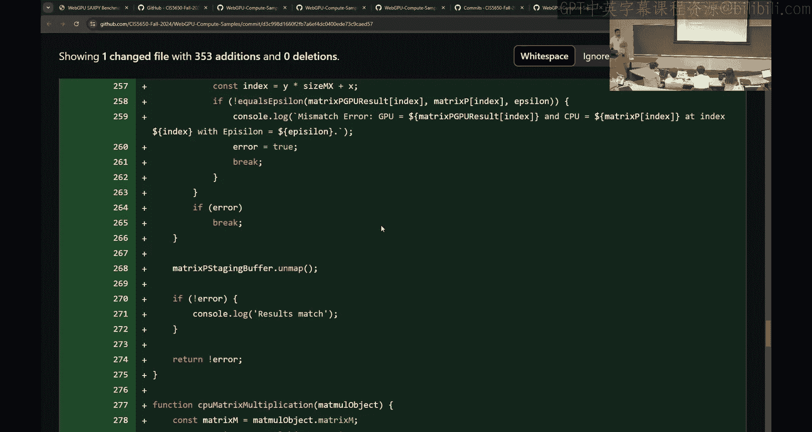

Okay。All right， let's look at。Matrix multiplication width we're going to do。滚。

I to hide the simple panel it keeps annoying me。 Okay， allright， let's see。So。Even in Kuda， we said。

 okay， naive is good， but it has a lot of unoptimized memory usage， right？So can we do better。

 can we use tiled shared memory？And before I actually did this example。

 I didn't know it was possible I actually had to dig quite a bit to figure out how to use shared memory and if there was even a concept like shared memory in web GPU。

 fortunately there is。😊，嗯。So the code structure you're going to see may look kind of different because there's a updated file which is more modular。

嗯。But。Essentially， so this is the knife shader and here we have the tile shader。

Can anybody remind me what they remember about tile matrix multiplication in Kuda？

What was like the general idea like general idea you have with a ship？You split up your makeups。查。

It's quite better just squares and like each。That allows like each spread to access the。

I'll always be accessing number but coherently but on re debris。Yeah， so so the goal is。

Your your launch configuration is always for P so one thread per element for p right and for that element you have to do a dot product of one row and one column。

Instead of each thread over reading from both M and N。

What you do is youd create these styled windows where all the threads read and then all the threads reus so now you are reducing the amount of reads that you have to do。

So that's what we are going to do in web GPU as well。😊。

Where the first thing you need to do is define shared memory。

And these are the two lines here that you need to know。

War work group is WebGPU's version of shared memory instead of underscore shared you are doing v work group so a variable that is the scope of a work group。

Then you can define the dimensionality of the size of the the shared memory。

 note that in Kuda you can have two dimensional or three dimensional de referencing。

 so size size square brackets in web GPPU you can't it's all one dimensional that's the main thing you have to remember。

Once you have that。😊，These are the same for whether it's tiled or naive。

 the parameters you're passing to the shader are the same。Your computer size is the same， okay？

And now。Here we see something new， we need the global IDX or global education ID。

To get the output indices， right？But to use shared memory， you need thread IDX。

Right your shared memories for your block， so in KUa we need thread IDX。

In web GPU that's called local Invocation ID， so global Invocation ID is global ID。

 local Invocation ID is what's my ID within the block， and that's a V3 as well so you get XYz。

What do you guys think work group ideas？Very easy， right， so that's block IDX。

So you can have block IDX。To know which offset to use again in the tile window that we use for matrix multiplication you need to create offsets。

 those offsets are determined by the block ID and thats why we have to use work group ID here。

All right。So here we start seeing some quirks of WebGU。그째。First。

 we can save the sizes just in registers， no problem， nothing new there。But here's the kicker。

in Quda， you can check for bounds and do return， right？

Nobody' has ever seen a problem with that if something is out of bounds。

 you just return and everything else is normal。I ran into this myself， I got a shader error。

 I wrote this line and did a return and it gave me an error that says work group barrier。😊。

Must be called from uniform control only or something like that。Uniform control flow。

 what do you think work group barrier is？It sink threads。Basically in web GPU。

You cannot call sync threads from any place that has divergence。

In Kuda we said don't call sync threads from where it is actively diverging。

 like don't put it inside an FLs， right？But calling synch threads after a return is totally fine because that thread is marked as inactive。

😊，And it will only poll the other threads for syncing or not sinking right webje you can do that if you return threads you can do。

You can't do sync threads basically inverb GPU， so we can't have this line。

So now we get into the meat of the dot product itself and the tile window operation。

So here we have a tile factor which is how many windows do we need？

So we are dividing the size by the number of block the threads in the block。

 so that gives us how many windows do we need to cover the entire matrix。

And then we we do the tile offset just so that we have which what is the starting position of each window？

And because we cant do return here， we have to check the bounds for every single one of these。

So this is if within bounds， copy the value， if not set it to 0， same same here for n。

Then we have a work group barrier so this is basically sync threads here。

 you've read some memory into shared memory， put a sync threads there。Once all the threads are there。

 now we can do the dot product using shared memory。And remember， again。

 back to matrix multiplication slides。This second work group barrier is so that that thread doesn't go and start overwriting the shared memory for the next iteration。

 so you need both S threads here。Once you're done with all of this。

 write the memory back to the GPU onto the P matrix。And youre older done。

 that's matrix multiplication tile。So it' is not too different from Kuda of course there are some quirks and other things that you have to remember and learn about just is because Kuda is much more mature whereas web GPU is just getting off the ground but。

😊，It's really possible to do a lot of things we would do in QudDa to do with that GPU。

 that's why when I say that GPU can be very powerful for things like clientside inference for AI。

I think this is what's good to help if you can do matrix multiplication like this。In a browser。

 that's going to make matrix or AI inferluencing very easy to do on clients。Okay。

Let's run benchmarks， right put we put benchmark timers， let's run those benchmarks。

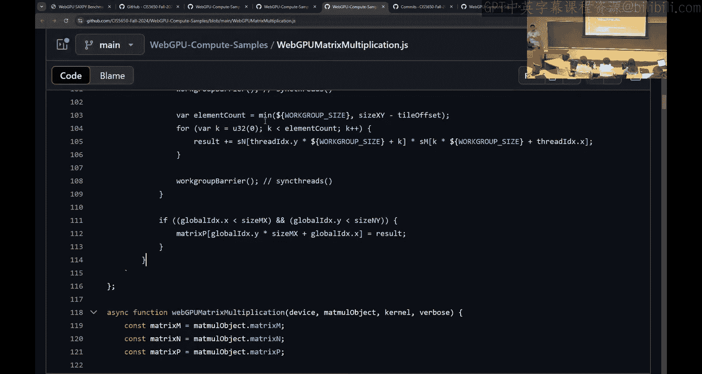

So this is SAXpyY， I'm going to refresh it， it's going to run a bunch of sizes。

And this is all one dimension， right？So。Pretty pretty good results now Ive had some varying results based on whether Im plugged in or not。

 so make sure when you are doing benchmarking or plugged in。😊，I am plugged in here， but it's not。

Nesly charging at full speed， so I think that's why some of these results may not be。

As high as we would expect。嗯。So， they are about you know the square oh one other thing I notice about web GPU powers of two are really friendly to web GPU they will be a lot faster so like 1 million is 1 11 times faster but 1。

5 million is 6 times faster， 2 million is 17 times faster。

So this can really change how dramatic your performance improvements are。All right。

 who wants to see matrix multiplication benchmark SAXPY very simple it's it's one operation who wants to see matrix multiplication what' how much faster do you guys think it'll be based on what we see from SAXPY？

To the year beyond beyond。Okay。One order of magnitude， okay。Any other guesses？Will it be slower？😮，No。

 okay， all right let's do matrix one application。All right here I have a couple of different options I can do square rectangle or advance which is like a full variation of different sizes I'm not going to run advance because I think it'll take too much time so I'll just run basic for now。

So as you go， it starts getting slower and it's actually slower on the CPU。

 that's why it's taking more time。So let's see how if sometimes I've had bad luck where it doesn't go to 2048。

你查也带着。

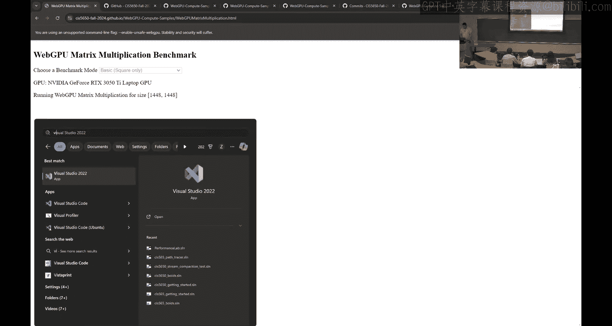

I'll just add a local version just in case。

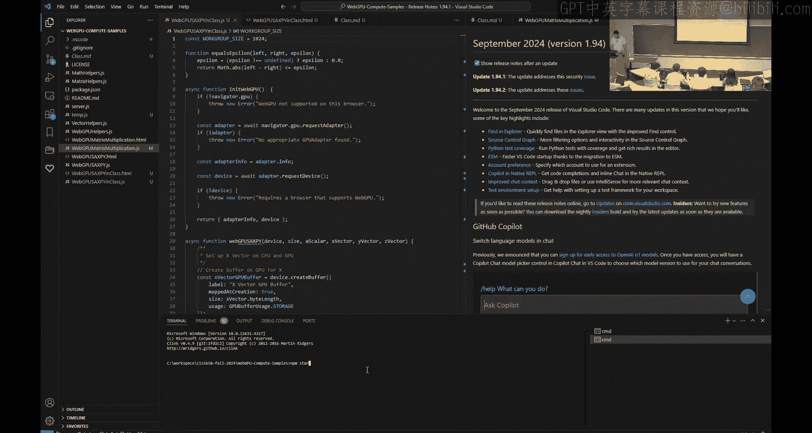

Yeah， I think this one hang。

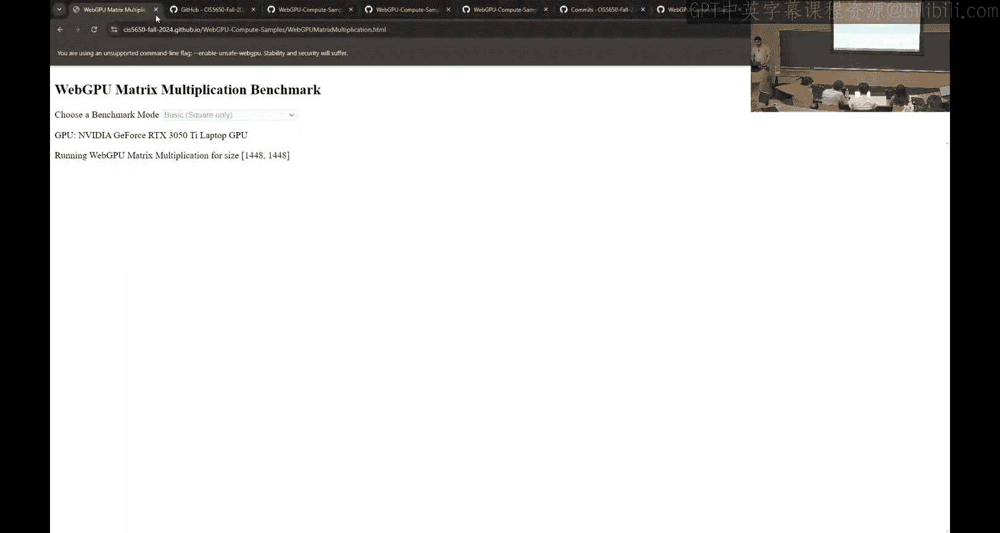

对。

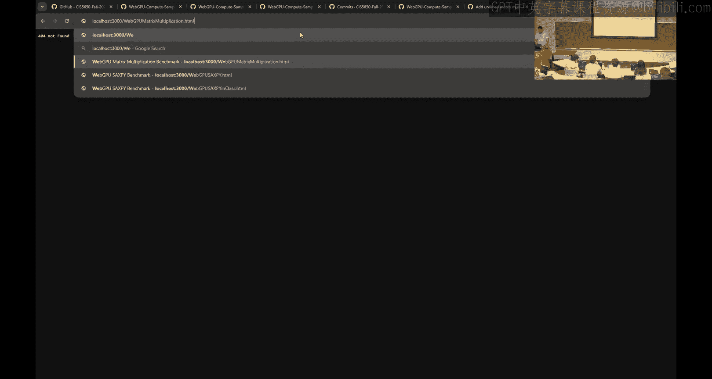

Okay， so this one is only going to do up to 1024 not 2048。

 and we will see the result for that in a bit。那被告。So。

CPU tile versus G or GP tile versus CPU is like 6500 to 600 times faster for the bigger sizes。嗯。

Tyed versus knife， it's not gaining that much on web GPU and I'm not entirely sure why I don't have a good reason。

 but still compared to the CPU it's a lot faster and clearly worth writing web GPU shaders for devices that have it。

The disimmentation。More personal keep you。Caramel shared Bank memory column。

I don't know that's where I'm like I'm not entirely sure why the performance improvement is not as big I think it'll also be hardware dependent shared like shared memory and banks are like ka architecture literally hardware architecture。

 whereas that may or may not be replicated across Intel or AMD。

So those kind of things could also be having an impact。

So it really depends on implementation on those kind of things。你爱的。

I haven't seen any reason to believe otherwise the only other thing I would recommend checking is if you go to vgpUreport。

org。

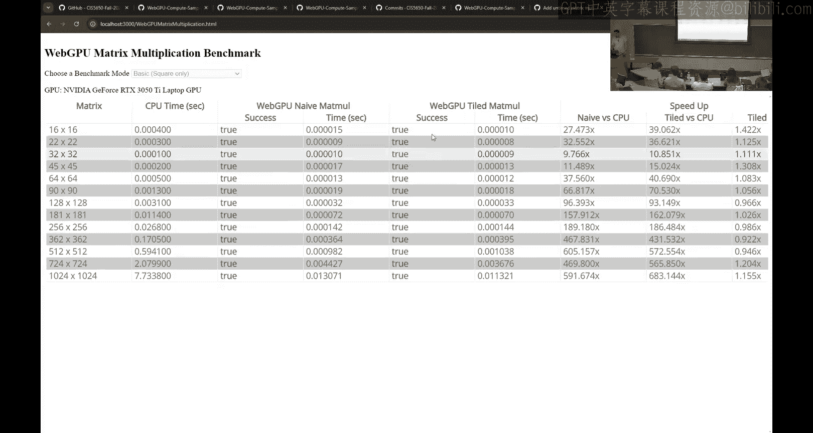

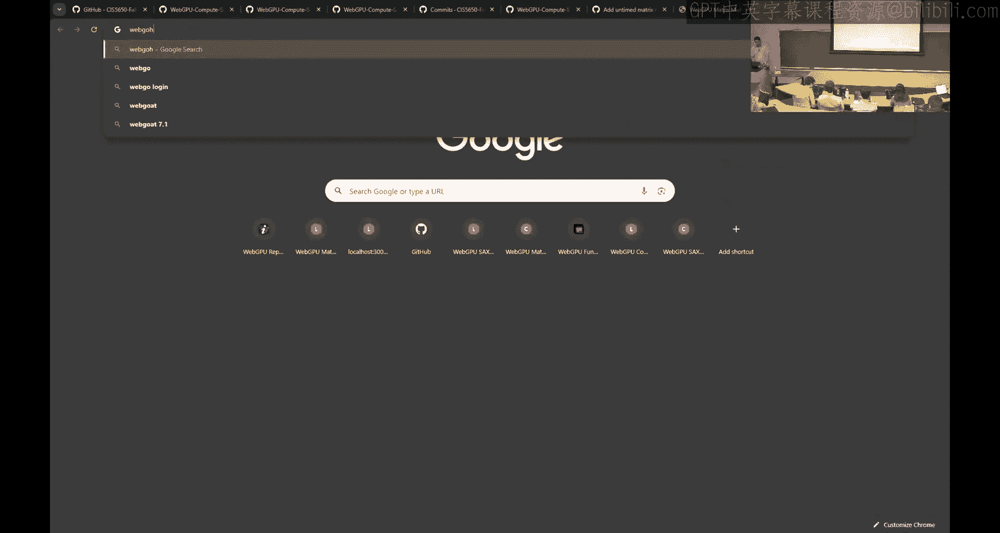

Then you can check for things like work group storage size。In case this is zero。

 I imagine this is why it's saying I don't have any shared memory。

That's the only thing I can take of。Other questions？そう。Yeah。And you have to do that in Kuda as well。

You'll use KudDa device Pro to do that in KUa just with WebGPU， even being in this class。

 you're shipping your code to everybody， whereas for QUa the code isn't going to most people it's just to read me。

 whereas this will run everywhere， so that's why you have to think a little bit more about it but if you're deploying Qa applications in production。

 especially with hardware you don't control you have to do all of that。

Any other questions on web GPU and especially on the compute side？Okay。

All right I hope this was helpful from mapping how having learned Quda things could be mapped to web GPU concepts。

I know it's not the most straightforward and easy thing， that's how I feel about graphics APIs。

That they're not very straightforward， but with web GPU and especially the compute side。

 it's something I picked up very quickly and hopefully it helps you as well。

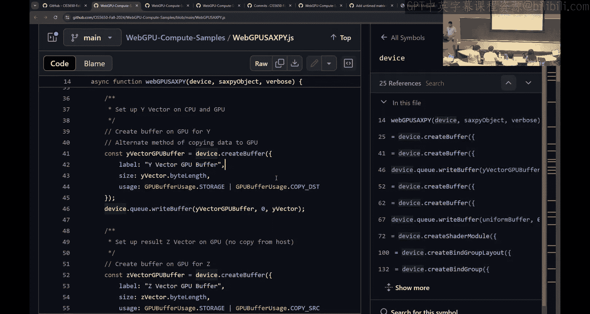

Okay。So let's pausester。嗯。And I'll start our lecture on Kuda。

And then at some point we'll take a break。All right。

So this advanced topics in KUDa was previously one lecture。

 but with new upcoming topics in QUa is being broken apart into two。

We'll try to see how much hour we get through today at some reasonable stopping point and then we'll cover the rest later。

All right。So there's a few topics we are going to cover today。😊，First unified memory， which is。

To tell you that it exists and not only tell you to use it。

The zero copy streams which you've heard me reference a lot of times you'll finally get to it and then finally could our graphs okay。

 so let's get dive into it。So who a unified memory？

For your uninitiated friends is basically a way of saying， hey， you guys know how to use scoo。

 don't use unified memory。So Kuda Unified memory is essentially a memory manager。

All it's doing is it keeps two copies of your data， one on the CPU and one on the GPU。

And these are allocated using Kuda Malik managed or the underscoreconesco managed keyword。

And then you do Qa free from that。You never actually do Kuda Memcoia， that's the main thing。

The QudDa M copy always happens at a synchronization event like QUa device synchronize。

 that's not the only synchronization event you can use others as well。

 but it will always happen at a QDa device synchronized。

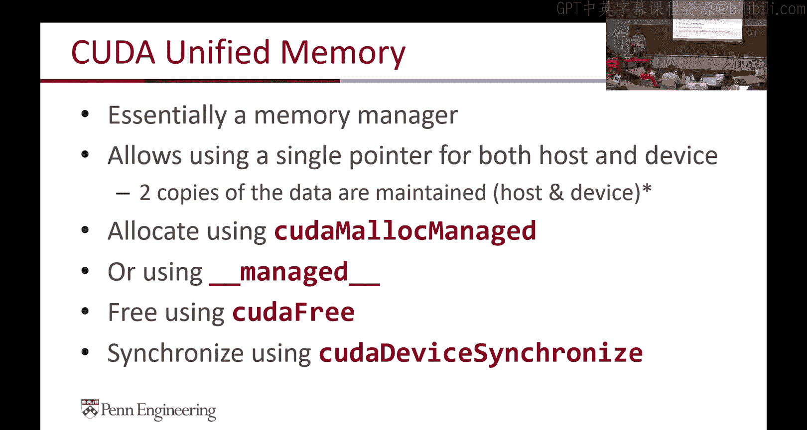

So what does this look like？So on traditional developer view or the code that all of you have written。

 this is kind of the view you have， you have your host memory。

 you have your GPU memory and then this red arrow is KudaM copy。

 you call that explicitly you call when and where it happens。

Unified memory is a little different where that view of the device memory and the host memory is abstracted away from you。

And all you have to take care of is ensuring the copy happens at a synchronization event。

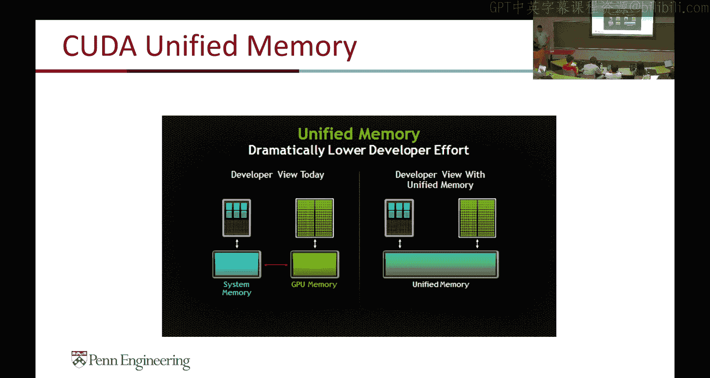

So this looks something like this in an example。You do could a malik managed。

 have x and Y be allocated。You initialize those same pointers on the host。

You send the same pointers to the GPU as well notice how these are both host pointers host usage you're passing host memory to the kernel you're like oh my god what's going happening that's because these are manage memory and Kuda knows that if you pass X and Y to the kernel then it should actually pass whatever actual pointer for the device it has for X and Y。

So it's abstracting that away from you。Then you have to call a Qa device synchronize to copy any result you want back to the CPU。

And then you do kuda free when you're ready to free it。Okay。Questions on this。你明这么です。方括。

So you don't have to， that's where memory corruption can happen。If you're not careful。

 if you're modifying both the host and the device at the same time。

 that's where you can run into issues， but yes。Yeah。

 so think about freeing whatever abstract class they have for managing both pointers。

So then it will trickle down and free both GP and CPU memory。Other questions。嗯。

So the reason I say this is for un initiatediate friends is because if somebody you know is is trying to use Kuda may not be a computer science major or is just trying to try something easy this is good for them it makes it easy they don't need to use Kuda me copy they don't have to do kuda Malik and stuff like that they do kuda Malik manage everything happens for them right these are for people who are not trying to get the last1% of performance right you guys are not those you are trying to get every percent of performance so that's why if you want to recommend this to others it's great to know in theory it might get you off the ground quicker but I always recommend to have explicit APIs。

On all the hardware， like Kepler and Maxwell， we are talking about 680。

 780 up to 980 for Kepler and Maxwell。😊，Really no advantage there to use Malic manageage。

 but on new hardware they added more features on the CPU and the GP side。

 which help with things like page faults and memory prefeting if you want simultaneous access if you want to access。

Re CPU physical memory onto GPU cons over PCI， those kind of things help。

 but again you really truly need to know what you're doing and why you're doing it to use this in a perform way so again。

Don't always recommend using it write kuda code。This code also creates multiple synchronization events。

 as well see later in streams， you don't want that。Good when new hardware。

 most of the hardware you might be using today， especially for like AI and ray tracing will support all of this。

 but again just be very careful of when and how you use this。Any questions on unified memory？嗯。好了。😮。

What子。Pross。我啲。Slower than using the explicit API。Okay， so for a basic program。

 let's say you're writing our matrix multi just a benchmarking thing。

 I don't think youre going to notice a difference。you're writing a multi threadreaded parallel application that's making multiple ka kernel calls and doing lots of different things。

 yeah you'll see a difference。Where is that gray line switching in terms of performance forms depends on the algorithm and the program。

But I would rather lean towards writing explicit APIs than writing unified memory。等于。嗯。

It did it first time and like， set my timing in。I did对。Like， I included the man copies。

Which wasn' incorrect we're only close to tiny kernels， but including the many coffee， it was like。

 oh， it's like just as slow because many coffee is so slow Yeah， like wouldn't you get away？

Without having to do men copies， you get more speedy or right。Yeah。

 that's where having a full program is different to benchmarking an algorithm for an algorithm。

 you're benchmarking the compute speed， whereas for a full program， yes。

 absolutely memory is supposed to be taken into account。

 otherwise we would be doing even the smallest addition on a GPU right？😊，What。

still also I would assume that this unified memory API is still copy me， it has to still copy。

Yeah yeah it's yeah， it's still doing could a M copy just in the background so whenever you do that event synchronize or in this example。

In this example you can wonder， hey， where did you actually copy it to the GP？😊。

Coppping back clear there's a Qa device synchronized copying to the GP is not explicit here。

The kernel is that explicit operation where it's saying hey， I need to use x and y。

 make sure you have the latest x and y the kernel on the GPU so there is a copy event happening here and a copy event happening here。

To do that。This is not。pilot。Oh that's a good question I think the compiler takes care of most of it。

 but I may be wrong about that， that's my guess。Other questions on unified memory。Okay。嗯。

Theified memory is kind of what we see in web GPU also， by the way。

 that's why you have mapping and unmapping and stuff like that。嗯。All right。

So let's take this a step further and talk about zero copy。Soう。Unified memory。

 they abstracted away CPU and GPU。And they said， we'd manage it for all of you， here's a pointer。

 use this， we will take care of CPU and GP。Zero copy takes that a step forward。

It's saying there is only one buffer。Okay， there is only one buffer。Physically。

 it has one pointer and you can use it from both CPU and GPU。

So in a way that's saying if you have memory on your host on your CPU RA。

You can use that in your GPU。Over the PCIE， it is going to have limited speed。😊，But you may。

Get a lot of memory space right if you have CPU memory of let's say 256 Gb。

 you can put a lot of data on there。Of course， modern day GPUs with AI and stuff。

 you get 48 gigabytes on a single GPU rate back when zero copy came out if you were lucky if you had eight。

 like were you had the best GP in the world if you had eight。So the world come a long way。But yeah。

On the desktop you might be wondering why would this even be useful？

It's useful in the context of out of course situations where you can't put that much memory onto the GP and incurring the cost of access over PCI is still better than doing it on the CPU itself。

Those cases are rare， but they do exist。So why is this actually used or why was this invented， right？

What do you notice in this picture？😊，This is a Tigergra K1， I think， oh no， it's a later GPU， but。

What do you notice about this？不关。So these are GPU cores， that's the arm CPUU。嗯。

A lot of fixed function pipeline yeah， they burn a lot into into fixed hardware yeah。

Just like we see that on regular kuda GP， there's like special functions for like power and square root and stuff。

 there's a lot more fixed function here on on your。😊，On your system on the chip because。

It's more power efficient。Right if you have a fixed function video decoder that means the videos you are watching whether it be from TikTok or Instagram or a Netflix movie they are going to be more efficient on your batteries so more power efficient fixed function stuff what else do you notice from a couda program perspective。

Logically， yeah， that's true even in hardware that can be true yeah。😊，What else。Okay。

 what do you notice different in this or what's unique about this？This is a much older architecture。

 but also more simpler。Think of it from a QUDA program perspective。So there's the CPU and the GPU。

What else does your CODa program need？Makeick。です。You don't need it， it's on the same ship。没有。

What else do you need for a Ker program？Memory， okay， what do you notice about memory here？

Say that lovelyly。2 gigabytes of DDR2。EMMC is a memory card essentially ategra K1 used literally an SD card does it actually just like share the same。

So what do you think is happening here？There is only one physical memory on these devices。To g。一个法律。

加。128 bit L DDR4。There' is only one physical memory on these chips there is a CPU and a GP right there is a CPU and a GP。

 but there is only one memory。Now can you make the connection to zero copy？

So if you took a normal KUDa program， you I good ahead。I don't know whole lot about。

But when people feel like integrated， like if your TQ is integrated， does that mean to that？Yeah。

 pretty much。Yeah。So that's not necessarily even like an old uniquely thing。

This is what Apple chips are doing why do you think Apple chips are able to claim the performance and efficiency that they are on graphics applications especially it's because there are systems on the chip。

 they don't have a need for PCIE， they run everything on the chip。

And whatever gigabyte you have for your RA is the same storage for your GPU as well。

 so if you're doing graphics heavy workloads， get more RAM on Apple computers。So yeah。

 system ownership get you this advantage。And remove that overhead that Michael was saying before of actually having to copy memory to the GPU。

 that's when zero copy comes into place。So on these system on chip devices。

 the GP and the CPU share the same physical memory。

Which means you don't actually have to copy the memory over PCIE。In fact。

Don't even fear two copies of the memory in the first place， don't have the CPU and the GP version。

 right？😡，So on the right there， we see our standard pipeline， we have allocate an initialized host。

We have allocate the device arrays using Kuda Malec， then you do Ka M copy。

You run the kernel and then you do a kam copy back standard pipeline。

 we've done it a thousand times by now， right？Good。On a zero copy。

What we have to do is we have to use mapped pin memory to take advantage of zero copy。

This is no unified memory， is no copy literally read if you're doing system ownership programming。

 whether it's ategra， Jetson， whatever it might be。Zero copy is very powerful。

So here's kind of what it looks like in code。The first thing you have to do is enable zero copy that is done by using Ka set device flags first time you're seeing this I know。

But again， even Kuda has these flags， just like we saw the performance time of flag in Webt GPU。

 even Kuda has some flags you need to enable。Well create some host array。

 but notice that we are not allocating the memory here or calling new or anything。

 we are using Kuda hostst Allc， new API。And then we called it with a flag of Kuda host Ac Matt。Nick。

 if you don't have a system on a chip， is there a software a fallback for this or we'll No。

 so this will work。It'll just be over PCI and it' will be horribly slower。So it will still work。

 yeah。So yeah， you do coulda host allo to allocate print and mapped memory。On the same memory。

 I'm not even going to say on the CPU memory or the GP memory on the memory itself， okay？

Then you do some initialization with data。嗯。Instead of doing a kuda Mem copy。

 which is normally what you would do， you do coulduda host， get device pointers。

 so you are telling for this host memory， get me the device pointer。Okay。And then once you have that。

 you can call the kernel with the device pointer。And then once you're done， do free host， that's it。

 you don't do free device， you only do free host。Because there is no actual device memory。

 you're just mapping the pointer to the GPU。One thing to remember on action systems on a chip and it's been a while since I tested this out。

😊，A lot of times Bn is the same as hn like literally the same pointer。

You could get away by not calling this， but I'll say that that's bad practice and your program may run into issues。

 so just that call that function I'm pretty sure it's free。Okay。So。

 your kernel remains the same no change in your kernel right what you are essentially changing is how your device and memories are allocated and mapped。

You use pointers as usual， no duplicating memory， no sync or copies。

 so this is where you start getting performance advantage of really using GPs on system on the chip because compared to normal desktops you don't have that overhead of Me copies。

 you can do a lot of stuff with system on the chip。To the right there。

 very old Tena system on the chip， but even on that you can see。

A big difference in using transpose for a transpose circle。

 how much zero copy pipeline will improve the bandwidth essentially all of the time you're saving there is that mem copy time。

Okay。Questions on this。嗯。聊会呢。第说。あほ。What。I would imagine I don't think so。

 that's what it's abstracted away from you。Because if you run it on an Intel。

 you run it on a Samsung phone or Google phone or iPhone that those concepts are abstracted away from you Kuda is a very explicit API。

 it is a strongly typed explicit API whereas web GPU。

 its in TypeSscript which is not necessarily strongly typed。

And then you have the portability of billions of devices and different configurations。

 so having that flexibility is really important to that portability。

So if any of you have Macs and you want to run the web GPU benchmark and see what you get。

 I'd be interested to see if you get a nice performance boost。Even on laptops。

 like I have an intel chip with an Nvidia GPU right， still copying over PCIE。

But if I could run the web GPU benchmarks on my In CPU plus GPU integrated stuff。

But the integrated GP is a lot less powerful， so you won't see that performance push。

 so it will be interesting to see how these these concepts evolve and how where GPU is able to。

Maybe either improve performance or give you more tools so that you can optimize it when you identify those architectures。

Okay， other questions on this？All right， let's do streams and then we'll see if we'll take a break。

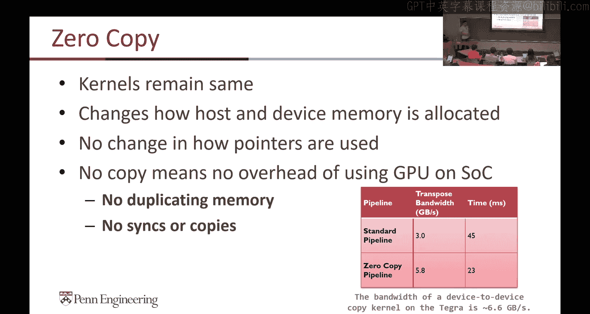

All right。所以。Okay， back to standard Kuda pipeline。You know I've said this a few minutes ago。

 but worth saying again， standard Ka pipeline input and memory onto CPU， copy that to the GPU。

 launch the GPU kernel， get the result back from GPU to the CPUU repeat many times rights that's a standard pipeline no change。

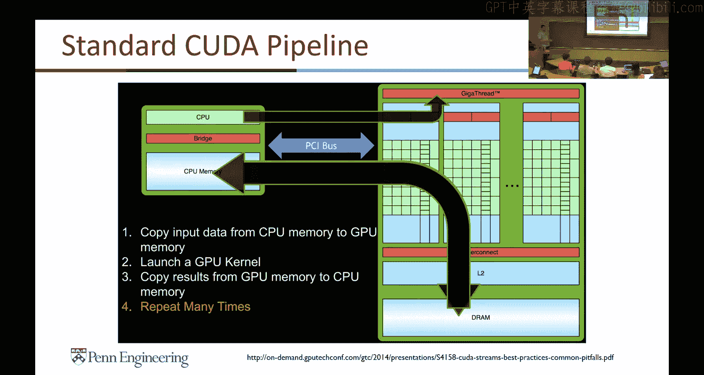

But then you go to ask。Kud is design for parallelism。

 like everything we do in a kernel on the GPU is screams parallelism， right， embarrassingly parallel。

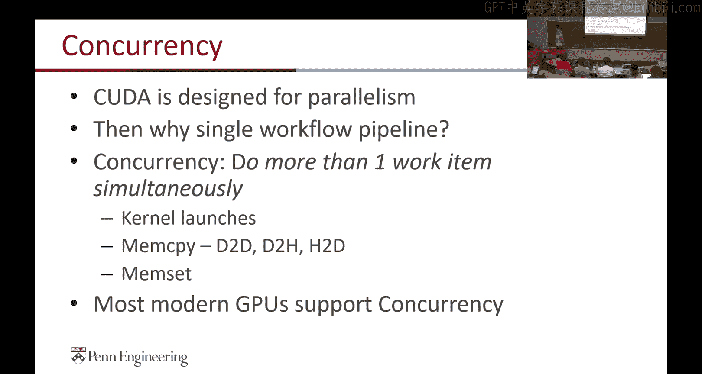

So why should we limit ourselves to one pipeline， why is there one order of events we have to follow？

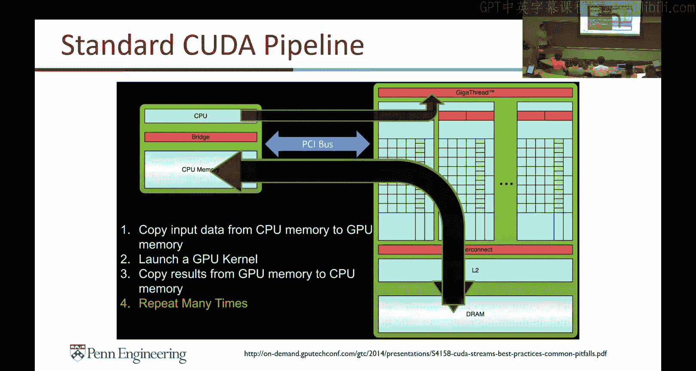

If it's for if it's。Paalism， it should be for CPU parallelism as well。

 and that's where streams come into place。Where can you do multiple functions？Simultaneously。

 for example， launching codea curl simultaneously as memory copies is happening。

 they are independent。youre not memory copying the same variables and buffers that the kernel is using。

 you can copy different ones， but they are independent and so is Kuda Manet which is setting values to a GPU buffer。

And so that's the concept that Stams introduces。So a stream is essentially a queue of Kuda commands。

Just like we saw in web GPU encoders， so I know we are kind of doing this backwards in this case。

 but you have web GPU encoders。Basically， kuda streams。

You can have multiple encoders doing different things simultaneously in coa we call them streams。

And these create task level parallelism。Where you can have different set of tasks beyond different streams and then each each one of them executes。

Those tasks in order， but with respect to each other， they are completely independent。Okay。

 so let's see a few examples logically。😊，Which ones of these are the right orders of execution？

So let's go with a is a valid。Yeah， because A2 comes up or after a1。

 A3 comes after A2 and same for B。Is B is option B the right order of execution？

It is because A and B are independent。😊，The task and A have to be in order。

 the task and B have to be in order， but there doesn't matter if they are not in order for each other。

 what about C？Yeah， in order yeah what about D？Not an order。

Because we are messing up with A3 coming before A 2， B3 coming before B2， not allowed。

A3 can come before B3 or B2， no problem， it can even come before B1。

 but it can't come before A2 okay。So that streams。What about this， what if we have two streams。

 which ones are valid？So left side is two streams， right side is two streams。

 is the left side a valid order？Yeah， is the right side of valid order？Yeah。

 both are valid orders here again they can execute on different pipelines。

 but as long as they are in order， they are good。😊，Okay。Yeah咩。や head。

U think multiple streams hide latency from。Global memory， like。Maybe your one front event。You know。

 doesnn't have something to's swap in when you're fetching or like some other stream。So。

 I won't say that。Stres hide。Latency within a kernel。They hide latency between kernels。

Or what we'll call compute copy overlap， and we'll see that in a bit。So。

H do operations that can be streamed？Are of two types asynchM copy so we saw Kuda mem copy navising asynchronous manm copy asynchMm copy and kernel launches so kernel launches are asynchronous as well and I think I've told one of few of you during office hours kernel launches are async put Qa device synchronize and so on。

Asyncch Mem copies hoster device and device to host always need pin memory if you don't use pin memory it will create pin memory for you and you'll lose control of your program okay so don't do that always use pin memory for asynchronous mem copies。

Okay。So you might be wondering， hey， I haven't used a stream so far， how is my program even running？

Right。So that's where the default stream comes into play default stream is always ka stream0 okay。

And。It's special because it's always synchronous on this GPU。

Other streams are not this special default stream is always enched on the GPU that's why you haven't had the need to call Kuda device synchronize as explicitly as you would need to。

嗯。In Kuda 7 plus， which was essentially when I was programming a lot of kuda。嗯。

Added a bunch of you know new features like if you had multi threadreaded CPU。

You can have each thread have a default stream as well， so that was added。Okay。

So how do you create and destroy stream？Very simple， they have these type de for streams。

 kuda stream T， error could errorRT you've already seen。So to create a stream。

 it's could a stream create。😊，Who does stream destroy to free it？Very simple。

 nothing complicated about it。Then we spoke about Kuda me copypy async。

 so this is essentially Kuda me copypy， but in an asynchronous way and it takes a stream argument。

So you have Ka and copy async。Destination source and count same， no difference。

Kind which is which direction hoster device device to host also the same the new thing you add here。

Is the stream。If you leave it stream zero， it's a synchronous man copy because it's always synchronous to the GPU。

But if you give it any other stream， then it will do an asynchronous Mem copy where the asyncch MeM copy command will be launched。

To the GPU， but the CPU will move on and do other things and the GP will execute it whenever thingss is needed。

Questions on this。On creating or destroy streams or the asynchronous Mem copy。No。O。

So kernel launches are also on the default stream zero， so everything you've done so far。

Where you provide streams is back in the Chevron bracket， so we have you've seen blocks。

 we've seen threads， we've also seen shared memory per block in examples like the performance lab。

Your fourth argument is stream。Withhi stream should the kernel launch on？And based on that。

 it's going to create the order of tasks that need to run。Okay。Any questions on this？All right。

 let's see a simple example。And I've broken the code into multiple slides。

 so let me know if you want me to go back。So we are going to create two streams。

So that's why we have kuda stream T stream of two， we will create two streams。

For each stream we will initialize it using Ka stream C。And then to use that stream we need。

Pin memory， so we are going to use kuda malco to create that pin memory for us。

And we'll give it two times size because each side can do half the memory as an operation okay。嗯。

Then in another the follow once that' is done。Will dokua mem copypy async。Copy hostster device。

 run some kernel on it， I've made this up。And then you want to copy the memory back aschronously from device to host。

Seems all right right seems to be you're creating for each stream you're doing。Hostster device。

 kernel device to host。 and what's going to happen is。

The CPU is going to launch all of these commands， the GPU will execute them whenever it wants。

In order， but whenever it wants， right that's the asronous part of it。

For each of them you also assign with streamam， they're also going to get called on。

Once all the operations are done。Destroy the stream， but also free of your memory。

 I don't have that in this example here， but free of that memory。嗯。

Any questions on this and we'll see how this actually looks on a profile and stuff in a little bit。

 but any questions so far？这个我2是。北欧是。The next please。Does it fail to destroy it or does it point？

It waits， yeah， it it waits until。Yeah， it waits until the stream is executedecut fully。

Any other questions？四。Yeah。So， so when i equals0， a， when i equals 1 b and thats。

Yeah so all of these commands can be executed by the GPU at any time， except that the a commands。

 the hoster device has to happen first， then the curl。

 then the device to host that order can't be flipped， but between A and B they can be in any order。

Yeah。Other questions on this？Okay。嗯。The other thing you'll want to know is stream synchronize。

 so we've seen coa device synchronize which synchronizes everything， right？😊。

You don't want to synchronize everything especially in a multi threadreaded or multi stream program。

 you don't want to synchronize everything， you only want to synchronize what you have to so for that you have the stream synchronized function。

And you give it with stream you want to synchronize and it will only synchronize that stream。

 all the other streams will be free to execute asynchronously。

All the commands up to this point here on that stream。

Will be complete when that kuda stream synchronize completes。

So that's the key thing to remember here is use device synchronize， stream synchronize as applicable。

 use the least impactful one as possible。Any questions here？Okay。

All right there's a few other explicit synchronization so we've seen device synchronize already I just spoke about stream synchronize there's also event synchronize so you've used coUDa events for timers you could use coDa events for synchronization as well so if this event synchronize will block all commands until a certain event is completed so you can use it in a more flexible way。

So events can also be used for timing and they're also used in your profilers and stuff。

But essentially they can be used to monitor devices' progress。To do benchmarking。

 tradefl we solve with web GPU if the GP is asynchronous， CPU timers are useless。

You need GPU timers and that's where events come into play events are the way of recording time on the GPU and getting the result back to the CPU。

So to do that。You create Kuda events using unsurprisingly Kuda event T， a type definition for events。

And here we are going to create start stop to do benchmarking。

Create those events and then you can record events so we record a start event and a stop event。

And then you can use the Scuda event Eappsse time API to figure out how much time ellaapse between those events。

嗯。Kuda event synchronized stop is a synchronization function that will essentially say。

Until the stop event is recorded。Don't move on from here。

 so it's another way of controlling asynchronous slow you don't have to do device synchronize。

 you don't have to do stream synchronize so device synchronize synchronize is everything。

Strech stream synchronizes everything that's in that specific stream。

Event synchronizer is more flexible。😊，It synchronizes all calls regardless of stream until that event is recorded。

but not the entire device。There might be other threads， other things that are doing things。

It doesn't care， it will only record before that event happens。Any questions on this event slide？No。

Whenever you're doing Qa benchmarking use events as much as possible， cover all of that。Okay。

So what do you think is wrong with this now that you know aboutron asynchronous nature of Kuda。

 what do you think is wrong with this？No。It's fairly obvious。All of these commands are asynchronous。

Or no， sorry， the mem copies are synchronous。The kernel is essentialous， so what happens？Exactly。

 so the kernel is asynchronous， so the CPU will launch the kernel and then go do a M copy。😊，Right？

So that order of execution will fail， the CPU doesn't wait to do the second mem copy and that can result in a race condition。

So you don't want to do that now there's one exception。Because all of this is on the default stream。

😡，It's fine。The moment you start using streams， you' are going to be in trouble okay。

 so in this case。You may intend that the kernel is asynchronous and maybe you're doing mem copy for B。

 B and DB， okay？That may be your intent， but because you didn't assign it a stream。

 it' is going to be all synchronous。So you have to think about how you're going to use streams much more carefully。

What about this？How do you think this function will run？Or this code will run。Same to you。と。Exactly。

 so assuming my CPU function takes enough time， we will make that assumption。😊。

What will happen is GPUs running kernel， CPU is running my CPU function in parallel。

 so now you get computed on both sides you're maximizing your concurrency okay so that's one concept you want to remember。

So why stop at GPO lab where CPU is doing work and GP is doing work， why do we stop there？

We also want to。Allow。Clonnels and mem copy to overlap。

So have concurrenent operations on different streams run at the same time。

Which means a kernel might be running on one stream。Men copies might be running on another stream。

You don't want man copies running on this buffers that。

The could a kernel is using but maybe other main copies， right？So on different GPUs。

 you have different levels of confer， even within NVD architectures。

 you'll have different levels of confer。You can have x number of kernels running usually a pretty big number I've seen 16 up to 128。

And then you can have one meM copy in each direction。

 depending on the ASync engine count as it's called。

 and all of you can query this using your Quda device props or go into your In info for your GPU to see how many concretecur currents you can have and how many async engines you have。

So let's take a look back at that example that we saw earlier。Okay。

 so in this case now we have end streams， we are not limiting ourselves to2， okay。

And each one of them is going to do a partial operation of some sort， you know。

 doesn't really matter。In an aschronous way。Let's take。

 if you want to imagine the most simplest example of this， think about SAXpyY in a very。

 very large buffer that you're breaking apart， maybe you're doing a million elements at a time。

So you're going to create streams for each stream。😊，You're copying a partial buffer to the GPU。

You are working on that partial buffer， notice the streams divided by block size as well as the stream I。

 so you' are working on that stream。You're passing an offset so that it knows what the starting point is。

And then you're doing the mem copypy async pack。Okay again。

 the simplest example you can think of SAXPY very very large buffer multibillion buffer。

 youre breaking it apart into chunks of a million or 10 million or something like that right if you imagine that this will make sense pretty easily。

嗯。So the question is， is this sufficient？Compared to our standard do the mem copy。

 run the kernel mem copy back， is this sufficient？Okay。You know how I ask questions。

 so this is no concurrency。All right。The top orange bar is the CPU。😡，Is what is happening on the CPU。

 right？On the CPU， it's launched a me copy。And then there's this big mem copy here。

That's a view of the CPU。So this mem copy here is hostster device。

 you're copying the full host buffer to the device buffer the and you you can see that that mar sorry that maps。

😊，Cremely to the GPU where you have these orange bars。This is the full context view。

 this is the stream view and everything is in the default stream， so this is default here。

So on the default stream of memcopy host two devices copied and that's being reflected in the full context as well。

Once that happens， you have to run the kernel， the kernel takes X amount of time。

And then going the GP is going to do the me copy device to host。

This lever here is all the CP is doing to launch the kernel。What happens when it launches the kernel。

 it needs to wait for the map copy device to host to finish， which is this。So CPU is done。

 CPU can move on to other things。But it has to wait until all of this is done to actually do something else。

What？这咱咖啡。There's nothing else for the CP to do except wait for M copypy like we are not giving it work to do the initial copy。

And this is the thing。There's a small bar there in no no。

 no that's like that's how it is thats why that's why I have the orange bar but when I highlight it and use visual profile or something like that for this。

 you'll see that if you mouse over this， that's what gets highlighted。😊，So this is no concury。😊，Okay。

Looks pretty bad again when you think about Kudar being designed for parallelism。

 that's not parallel。😊，Right so this is what our fall loop does。Okay， so this device。

 I ran it on old GTx 950M。 it had one copy engine and one async engine essentially。

So now we no longer use the default stream， it' is completely empty。

 we have a few different streams here。😊，Now we are doing Memco， float， kernel mem copypy。

 and break it apart and so on。Now you might say still not so good exactly it seems to take approximately the same time or at least from100% perspective。

 it's not really optimizing it。😡，That's on that GPU。This is on a 1080ti， which had two async engines。

Now you start noticing the difference。Again， think of an algorithm like SAXVO， it's very simple。😊。

Initially， you do the M copypy Hoer device to copy the first buffer on of the GPU。

Then you run the compute kernel， which is happening here。As soon as this mekobe finishes。

The GPU knows that it can do another M copy for the next iteration。😡。

It can start copying the hoster device for stream2 or stream1， how you want to count it。

So that starts while the kernel is running。So the kernel is operating on the buffers for the first part while the second part buffers are being copied。

When the kernel is done。😊，The device to host for the first part starts。

Hosster device is happening here。Clonnel is long for St2， but notice this gap here。

Why does this gap exist？没有。There is only two async engines exactly。

 so it can do device to host and those two async engines have to be in different directions。

 they can't be in the same direction。😊，So it can't do device to host and then copy this device to host it needs to do host to device and device to host copy simultaneously so when this copy is done this copy starts while this kernel is being executed when this copy is done this copy starts and so on you get that staircase essentially Matt。

在他给你。声音不会见面。A think。到我。I don't know if they've had if they've raised the restriction on。嗯。嗯安南。

Asnc engines or device copies。In different direction。

 and that makes sense that because PCIe as a bus is bi directional。Right。

IfIf you have all the copies and have in one direction。

This you're using the maximum bandwidth regardless。

If you have copies happening in different directions over PCI。

 that's when you're going to get both by directionality of it。

So it like it's like two lanes on a road， essentially。

Any questions on this or hopefully this is obvious to see how the streams have benefited。

What you want to pay attention to is if you think about all the blues， all the kernel launches。😮。

They actually don't take any time。Theyre all hidden by memory copies。😡，嗯。

So this is called compute copy overlap within the GPU itself。はて time。If you made them shorter。文けも。

Potentially， but。The the bottleneck is the mem copy， so even if you move this mem copy to right here。

This mem copy and this mem copy is still staircased anyway， so maybe very minimal。

 but you know even if you have very much bigger kernels， you're still hiding a lot of the computer。

Other questions on this？Okay， so。We solve it on a 1080TI。

 but we want to go improve it on all GPUs like this is unacceptable， right？😊。

So let's change our code。Okay。What do what do we know from She？

We know that all the host to device mem copies。Need to happen before all of the kernels。Right。

And then all the device web copies happen after the kernel。

 so let's use that to our advantage and see what happens so here I'm going to break the follow apart into three parts。

All of them are the same i equals 0 i less than stream i+ plus。Right。

What the CPU is doing different here is it's launching all the host device me copies first。

Then launching all the kernels and then launching all the Kuda M copypy ASync device to host。

Now think about this。Within each stream， the order of operations is exactly the same。😡，No difference。

For each stream。The host to device map copy happens first， then kernel happens。

 then device to host happens within each stream orders the same。

 it's how the CPU is invoking them that is changing。Okay。😊，So that changes how it works on a 950m。

So here we have the initial Me copy device tool host happening。Then the kernel launch happening。

When the kernel launch happens， it can begin the next device hoster device。And so on。

 so you get like kind of a staircase effect here now what you don't see because this has only one async engine。

Is a device to host copy happening in Pa here？That's what you don't get。啊，It cause。

If you don't have enough brown， like。Havingping all the memory have once development it。

That's going to happen regardless like even if you're in a standard pipeline。

 if you're trying to copy all of the memory， you'll hit the same bottleneck。

 so this is not adding any additional memory。In fact， if you have too big a buffer。

 you can potentially free memory。Before before you copy all of it。Any other questions on this。

 how just changing the invocation on the CPU has changed us now I can't tell you honestly why this is with a big deal of confidence。

What I think happened， and this is purely theory。Is that。And let me go back here。In this example。😊。

嗯 sorry。With this chor， I think what's happening is because this if you think about the CPU invocations。

MM copypy， host a device。Clonnel hosted a device to host right thats the order on the CPU and we say the GP is independent of that。

 but I do think it is taking that into account where。It's giving priority to this device to host。😮。

Compared to the next kernel launch。So I think that's what we are seeing here。

Where it's doing this device to horse。It should launch the kernel and in parallel it should actually do this mem copy hostster device。

 that's what's happening in our good example。You would expect this mem copy to happen here。It's not。

😮，Because and this is a guess。I think it's giving priority to the device to host and it's not kicking this off because it's waiting for this。

嗯。That's my guess， I don't have a perfect explanation， but that's what I would run with for now。Okay。

 other questions on this。Same thing the on the 1080TI。

 not really much of a difference it remains the same because it was already optimized so the 108 DTI doesn't care which way you launch the asynchronous operations。

 it just cares that you have those two asyyn engineents。Questions on this。No。Okay。So in conclusion。

Streams。Are really good， especially when you're thinking of Quda programs rather than Quda algorithms。

When you're building these big programs that have many copies in different directions and stuff。

 you can get a lot of performance out of streams。But there's also no one size fit at all。

 I can't tell you how to organize your streams for every QUDa program。

 that's for understanding what your program is doing and then using streams to fit that。

So it's very important to understand what the queue of your commands is and what is the independence of the operations between them。

That's key to maximizing performance on a GPU。Okay。I have a few more slides here on Kuda graphs。

 let's wrap those up and maybe we can。I'll take a poll in a bit。All right。

So the problem with stream based APIs。Is that those streams？😮。

Perform a sequence of operations to prepare the kernel。You're doing your Me copy。

 hoster device and so on。And you're preparing the kernel。And each time you do the kernel。

 there's an overhead to it， a small overhead， but that overhead exists。

What graph does is help you define an order of kernels to run。

 right it creates dependencies and instantiation。Where you can connect different kernels and this is what Jacob when he was here。

 Jacob from Meta when he was here last class was saying that Qa graphs have very useful and AI pipelines because they can help combine different kernels with different types of learning。

 so they use this a lot there。So this is kind of what a kgraph can look like where you have these different operations happening in a graph。

 so in streams you can have them in columns essentially。Whereas in Kuda graphs。

 you can have a full graph that's combining different operations at different times。

Any questions on the conceptual nature of a kagraph？Okay。So to create。

 let's say create a simple one like this where a calls B and C。😊。

And then those two call you when they are done， okay？So for that。

 you want to start by creating a graph。Then， you add。The graph kernel， A， B， C and D。

 all of them to the graph。Right。At this point you you are not defining the order or the dependencies。

 you're just saying all of these operations are part of the Kudar graph。Now， once you've done that。

 now you can create dependencies with using the Scooar Cr Add dependency API。

And then you're creating the types of dependencies here。

 theyre all one to one dependencies and one direction I believe。

What they what you're essentially doing is by saying。

B depends on A and C depends on A you're creating these two arrows。Similarly， you're saying。

D depends on D and D depends on C， you're saying B and C need to finish before D can run。

Is that add node programss like a parameterss for each node or is that like actually the same for like every？

Rad note from。The nose grams yeah this or nor pro supposed to actually do the same pre that。

That's a good one。No，I think they can be separate。I'm trying to let's， let's look at them。

It's been a while since I looked at Kagraphs。呃。W。And。Cutgraph at node。I disappear。Okay。

Newly created node parameter， so that's the return value， you have draft to add node。

 you have dependencies of the node。Number of dependencies。

 parameters for the GP execution of the road， so they're different here。

Each one of them can have unique ones。哦。Sorry， one second。

So yeah it can be it can be defined like this so so these are like different blocks and grid sizes which kernel to call and so on so in ABC D are essentially。

Just operations like abstract operations， the Kuda kernel load per is actually what you're calling the Kuda kernel with。

So you cant copy you can't call Chevron based kernels right。

 so this is how you agree to call them using nodeal。O。Other questions on this？

So if you read the documentation， you can even add host site stuff through this。

 it just doesn't have to be kernels， you can add different types of operations to this。

The other thing you can do is。You can capture。A certain set of operations kind of like we did with web GPU encoders and save it to a graph。

And then you can recall that entire graph itself。So instead of having to define the graph up front。

And you want to call those same kernels in a repeated manner。

You can save that graph and call the graph again each time。So this is an example here where。

If there's no graph created。You can do a big capture。

 you can run the kernels and then end and then you instantiate the graph to save it right and then each time this time when you do this big capture the kernel isn't actually running。

Okay， important thing to remember。Between begin and thencapture， the kernel doesn't run。

When you do Qa launchcraft， that's when the kernel is running。

This is more similar to things like Web GPU where we saw the encoder way。

 so it's capturing the commands and then when you actually launch it。

 that's when the execution happens。Okay。All right。So then there are questions like what happens if you need to update the graph and stuff which the answer is it reduces performance。

 you ideally want to re instantiate a new graph rather than reuse an old graph。

So that would be the recommended way， but if you actually have to do it。

 then you can use these update options， Kuda G update Exec update and Kuda Gra Exec with the node set of parameters to make that update into the Kuda graph。

Okay， so that's the end of advanced quoa part1。嗯。2 hours。

I don't think I want to go another hour with you guys。

 mostly mostly because I think you lose concentration。

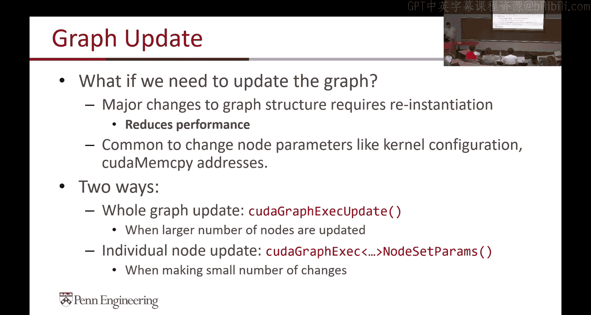

So I think we can end here just for your curiosity， I can open up。

Part two slides part two slides is already in linked， so if you want to go check them out， please do。

But essentially next time we look at atomic functions in Kuda along with warp Quda dynamic parallelism。

Independent threatcheduling and cooperative groups。

The last two are new concepts include I haven't actually used them hands on。

 but it's something we can take a look at in a future lecture。

So if you are curious and want to take a look at the slides， feel free to do so。

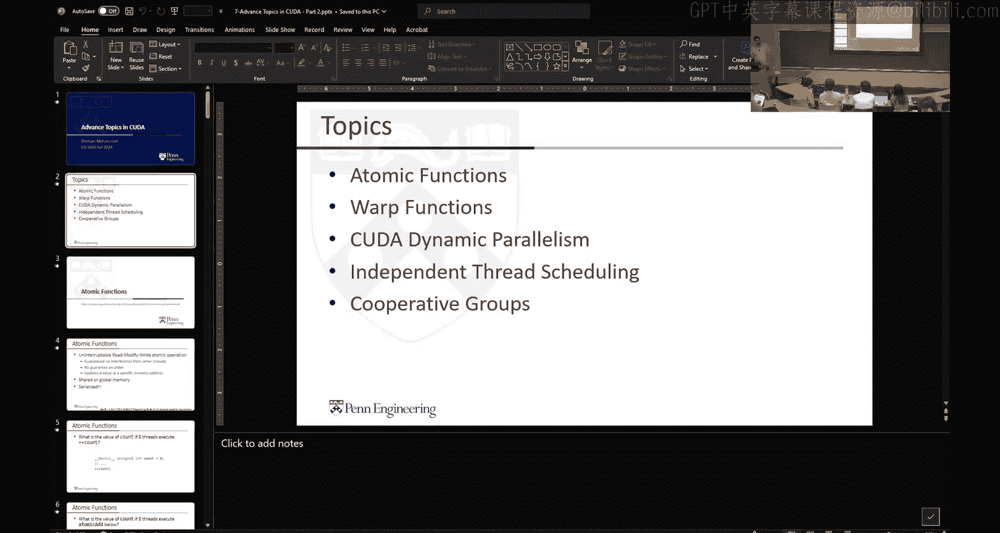

The other update I have is。I have a big hands on thing happening at Cium on Wednesday。

 so I won't be here in class。嗯。Han is going to be doing a very exciting。

Two part Walcom introduction like hands on and Deep in previous years we've basically done the recitation and the feedback has always been heavy we need more than this for Walcom so I'm glad Hans putting those presentations together kind of like what we had for web GPU but in an equal perhaps more ind depthth way for Walcome。

So Han will take the whole lecture for Wednesday。There's also an update on Project5。

 Pris making fantastic progress on setting up the base code for Gaussian Spting。

 and I'm sure I've said to many of you that project five was going to be Gaussianplts and you could choose whether you wanted to do it in Web GPU or if you wanted to try your hand at Walton。

没事对。Unfortunately over the weekend， Han went climbing and hurt his hands。And can't code anymore。

So if you see him， please ask him how he's doing， but that also means that the Walcan base code for caution spting won't be ready。

What that means is that we still want to give you the option to do where GPO or welcome depending on your interest。

And well make the previous Walcan cord which was compute traders for grass rendering available to you。

 so you can choose between Ve view Gausuts plats or try your hand at Vcan compute traders with grass rendering completely your choice no penalty or advantage for either one of them so well make those available when at the next time Project 5 is supposed to be released。

嗯。Yeah， so those are the updates for me sorry we won't have the Walconcasutions Plath project hopefully next year and some of you will be TAs and might help with that。

So yeah， let let's end here and I'll see you all on next Monday。

