# uPenn《GPU编程和框架｜CIS 5650 GPU Programming and Architecture Fall 2024》中英（Claude-3.5 p17 2024-10-16 - CIS5650 GPU Programming Fall 2024 Lecture 11 (Vulkan Lab I and Reci -BV1sRtresE67_p17-

开嘛，你要开车哦好。He was like。要啊。好没。没有人没有。Guess we will start right now。 Okay， let's get started。 And today。

 we have like a three acceptance。 The first section is。あ。

If you view and the next session will be introduction to open the lab part one and the last section would be like a open grassro。

系。Yeah。😊，Okay， I will represent represent the Gaussian buding Web GPU project for project 5 and because this one will intensively use the GPU。

 But the Chrome or default， use the integrated graphic card。 if you have one for power safe。 So you。

 you should change to your， if you have a nicer one。

 you should definitely check on your chromrome GPU and check the G render。

 whether you showing the GPU you want to use for Chrome。And。

Let's get start to the actual information。

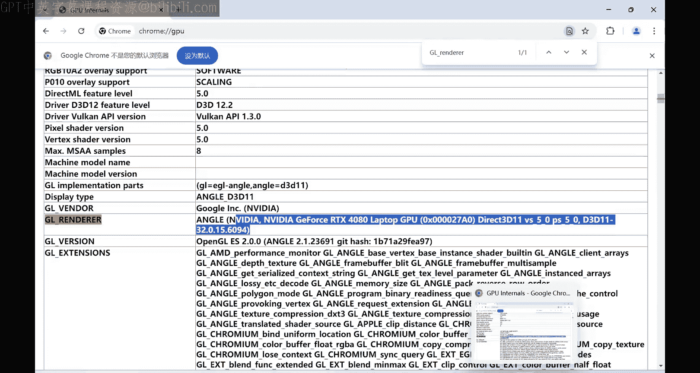

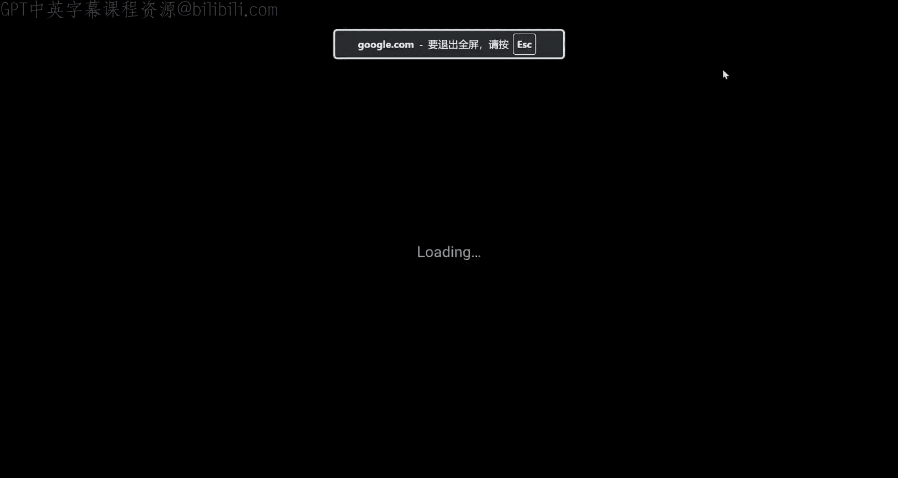

Yeah。How many of you guys have her like a3D go flooding， already。Okay， many of。

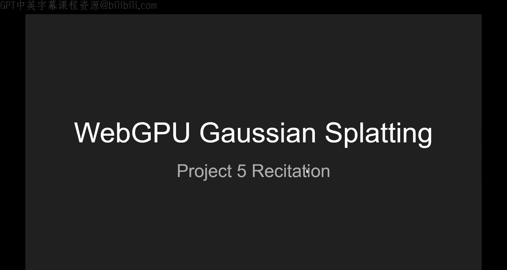

Yeah， the Gaussian spla which is very different from what we do for usual geographic rendering。

 instead we not rendering triangle， we render render a points called and you splabs it' like a Gaussian distribution around that point and you have like some color variations and different things to represent each point and and then you blend all the colors together or to form the thing and。

The basic idea is from some statistic things called Caussian distribution from stats and if you guys have learned some basic statistic and the cautionsian distribution it's just a uniform distribution all from the center and you can see the 1D 2D and the 3D the 3D is what we will do for our project and it basically have like a distribution and showing likesopher。

 it's not always be uniform like this after you applied a rotation and Scing and different things and。

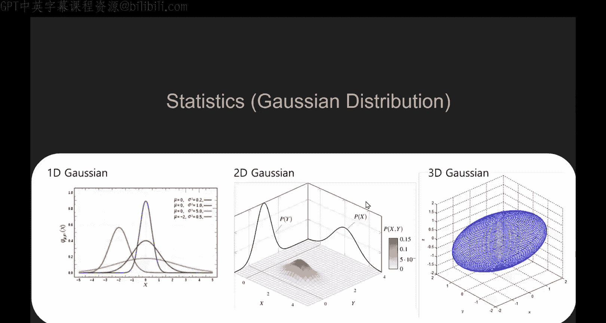

The， the main importance in the covariance we we will need to use for our。

Project and mean is just the position of the point。 The covari you have learned before in that。

 it just means a。How many variation you have for you all data sets from the center。

 the whole data variation and respect to the center point or the mean and in our 3D thing is' just the center point and the outside data data cloud。

 like the things just showing here like how variations the color is respect to the center。

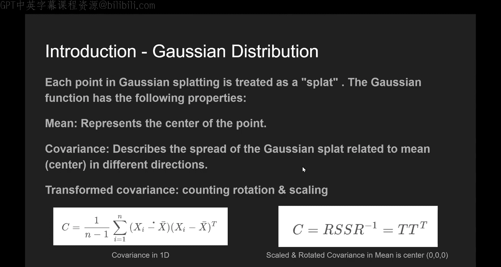

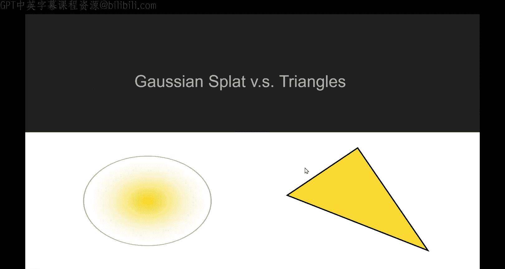

Yeah hands。And also we can transform the covariance just like here you see the rotation matrix and the scalinging matrix。

 like we usually do on work graphic pipeline。Yes。This is more a visual representation of some standard Gaussian distribution after we transform the covariance and this is what it looks like。

And in the。In actual paper for 3D Gausian spting， they train the actual scene from different cameras angles and they sample the points and then they do the Gaussian feeding for the point cloud。

 but in our project we don't do any training we only focus on the rendering part so we have the pretrained scene with the cameras file and the Po file with it's just the spot file and。

And this is what we do for the viewing stage and the Gaussian spot our protected from the 3D point to the 2D sps is from like a 3D and then you will protect to our view angles like we do for a triangle2 and。

Then we will render the small 2D quads from viewpoint each each frame pass。

 and then we blend all theus Gausians but the point of color color。

 we blend all them together and different from the original paper they because they are using and they do a towel base rendering and here we just do a we utilize the standardized rest。

A restization pipeline in webGP and we blend all the spts together instead of what they do is the forward words after they store the spt they add together all the color from to back until they reach some satisfied opacity but here we just render all the things from back to front and just like we do for transparency semi transparent texture so see similar pose like that I will talk about more details later。

And Gaussian R。In our pipeline， we first we need to preproces all the data。

 the first part is loading the 3D Ga data， which were already provided in pipeline and then after you have those data you need to preprocess those data into 2D screen like I just talked before the first thing you will need to do is calling the sps in the view for some。

Ting， I think you guys already do the project for it's very similar。

 you just need to of the get rid of the slot you can now see and also you will do similar things for the w grass the calling test and。

Then we compute the 3D Gauss variances covariance using the data you have input from your file because the file will provide you the rotation and the scaling matrix and just like I talked before there is like a matrix multiplication you can cover from that like you transform the uniform one into the split you want。

And then you come then the next thing you do is project the 3D covarient into the 2D equations。

 and in this one， you will also need to retrievetrive the maximum radius and also the max qua size for your next rendering task because when you render。

 you render the Gaussian like a quad interview the view direction and。Based on that。

 you do like something similar to procedural texture to reconstruct the color。

Then you evaluate apherical harmonic to get the color from the slide and this part we already provided almost for you the calculation part and you can also see the detailed mathematic proof I provided in the instruction in the ra and except you need to read the value by yourself and there is a function there you should implement and。

Then you store the sp data into later rendering restization pipeline and then。Also。

 because you need to sort the split in in the depths because you want to render from back to front。

 like what you do for transparent texture and。So we also provide the red resource already for you。

 So， but you still need to update the key sites for the red and also the indexes because you。

Call out呃 calling some搞呃。Some caution data already。

 So there' is only part of the data you only need to render and also the depths。

This is the value you need to sort。And this is an overview of the sort and。

There's a lot of interface you need to understand in this file and it's called general info and dispatch and for dispatch you need because we use indirect dispatch so all the dispatch count you need to update in preprocess step and also the ping pong buffer will just they use a ping pg buffer to switch be but we already updated for you so you only need to use the ping pong0。

And for the rendering because we render each spa just like a bonding quail instance and for here you also use indirect drawing because the instance account you don't really know beforehand。

 this is some information you need from the preproces step and also from that you use the information you just got from the preproces。

 the maximum radius and the quail size， and then in the fragmentment shadeator you calculate the color。

 the opacity color。Oacity amount from the co equation。 I will talk a little bit later and。

Then you render的。Final quote into the screen， like what we do for transparent texture。

And this is the CD covariant to the two projection。

 And this is actually very similar to what we do for the MVP W projection matrix we usually do for for our triangle rendering like。

It's just a multiply。Some Jacob O BM think because the covari is not like a factor。 It's a singular。

Matrix and and also the view transformations matrix reward。You。

And after we retrieved the 2D iconic equation， we need to finally render the s like that。

 And you can see the color is deating exponentially from the center and。Based on this equation。

 the center one is the colon coefficients， and we just treat X C to be the center because we always have the quad to be center like a zero。

And based on this。Comic， you can retrievetrive the expponent for capacity。

And this is the base code and we have the first one。 the render is folder like we do for project4。

 and there is two render is the Gaussian render and the point call render and。

The point cloud is almost implemented for you， it's just it will output all the yellow points。

 the point cloud to ensure your program is actually wrong。Ear just to go back this slide。

 earlier we're saying that this is like a comic is this just like the level sets of like quadraatic surface？

Or like different opacity or。I guess how is this like blur thing？

Because you blend all this you what do you mean by blur is opacity level is just like an alpha value you do for。

🤢，Yeah， what I mean is this is like a。This is like a 2D shape and aic is just like a curve in 2D。

 right？maybe有二。This is the chronic coefficient for elip。嗯。Yeah。

 so its like if the lips is just like the outline。 Oh， you mean all， Oh， you。

 you calculate the distance because you have to be0。 If the distance is less than  zero。

 you mean your insider。Your are inside。一口的。Okay， and the opacity is like a function of what that distance value So it it is a level set like level set。

瞌是。And。The。The Gausian render is the main one you need to implement on and there's like a three shader files and point cloud is you only need to add like an MVP calculation into that one in order to see the final result it's just for you to understand what is storedoring the point cloud data the point cloud data。

 the Gausian data and。The Gaussian the Gaussian W GSL is the shader for a Gaussian supply rendering。

 It's the rendering process。 And the the pre process is the compute shader。

And this two file is the main file you will also need to work on。你很。

All those file is more utility function you can see or you can utilize the camera folder。

 have the camera T S and the camera control because the camera T S we will load the camera file also the camera file is just for camera initialization to find a better viewpoint。

Because you load some camera on file and also some utility files like debugging and also the data loading。

And。The source file， you don't need to look a lot。 You just need to see the headers。

 They have like a lot of constants already in the file。

 you just need to to see a little bit and the actual implementation is already provided for you。

And there are some tips and tricks you need to be more careful on。

 all the data parsing to the GPU are using half floating points because theian data is a lot So we all use the half precision floating points and you will need to use the unpack and packing to pack the data and unpack data。

 but the actual calculation are all using S32 and half precision floating points calculation in shaded will be actually extra credit thing for you guys to do and for the because you need also to update the key size and the instance counts during the preprocess and since the preprocess in GPU you update you need to use the atomic ads to update the instance count and the dispatch counts。

Things for the order and also the later rendering and also remember to empty your sort info every every frame。

 setting the knowledge data to the frame to the sort and also to get correctly blending。

 you need to sort indices of the split based on their depths and render them from back to from。

 there's more detail how you should use the blending function and also the sorting logic in the in this line this is some openGL I in learn openGL websites。

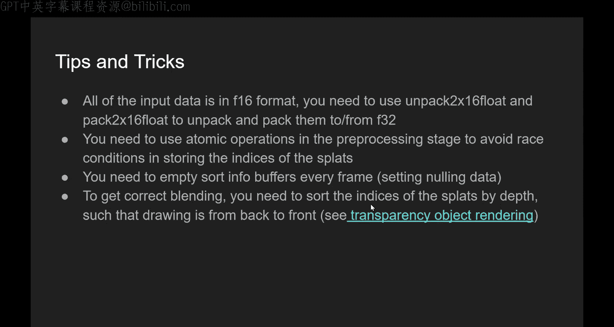

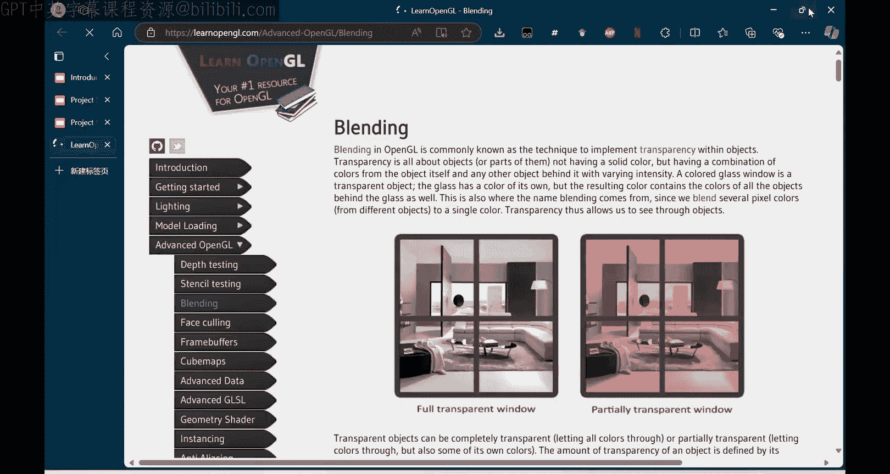

Okay。Oh， we are at。

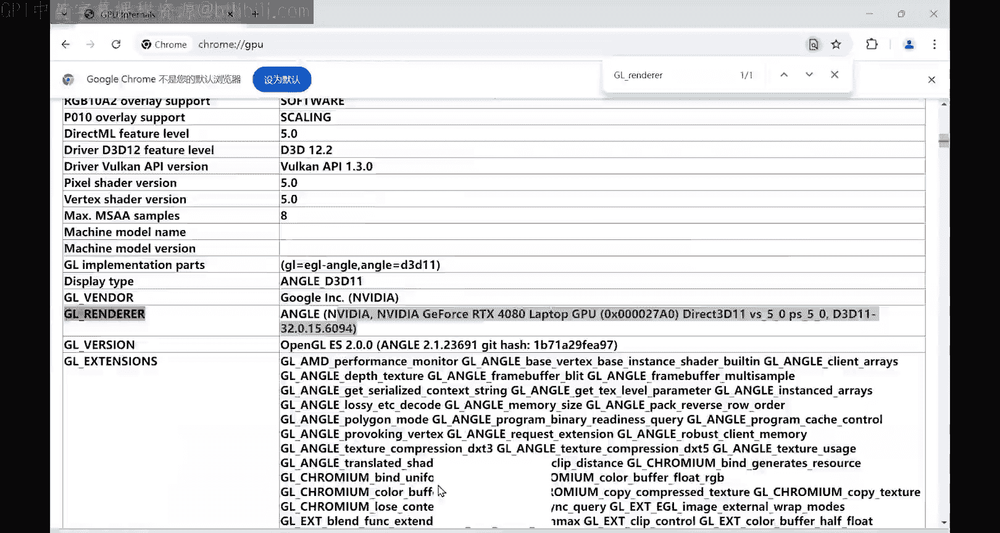

嗯。Oh。

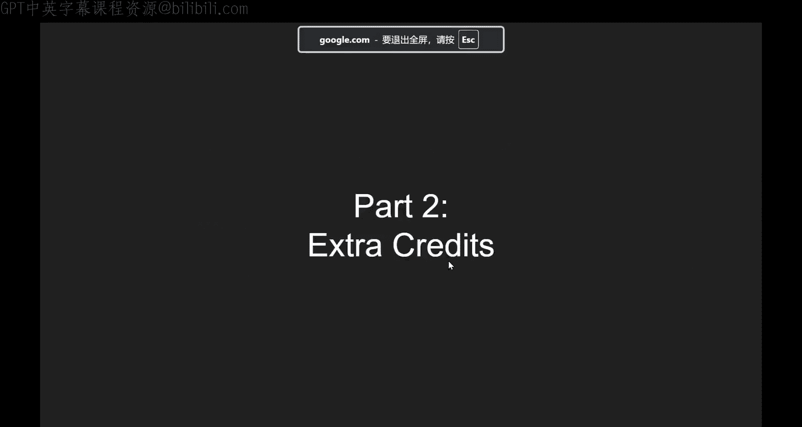

And this is the extra credit， just as mentioned before the paper last year。

 the implementcr how based depth sort and they could paid each Ga data also and they sorted like based on both tiles and the depths and what they render is。

For our pipeline， if we want to do this， you need to change the last thrustization pipeline into a comp shader to compose all the things from forward to backward。

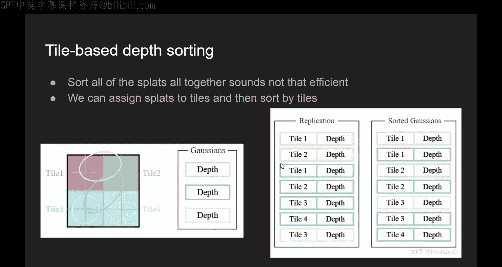

This is another thing I just mentioned， use F 16 calculations and arithmetics for web GPU thing。

For hours accelerations。I think that's pretty much it。Any questions？看 guess。

Oh I also in the instruction， I also linked S files pretrain S files。

 they already label with basic Me and high， which means how large the file is for some because the because your computer have like a maximum buying group buffer size and sometimes maybe your computer kind of able to loading the like a larger file size into the GPU memory and maybe best you can try with the basic one is called a song file and also their bicycle one is more basic the mid level should be okay with most computers but the high one is not is very pick on the。

hardware。Support， so be sure to also check what， what is your Chrome GPU is using。

 not using the integrated graphic card， if you have one。我人公。Now， let's start crystal。

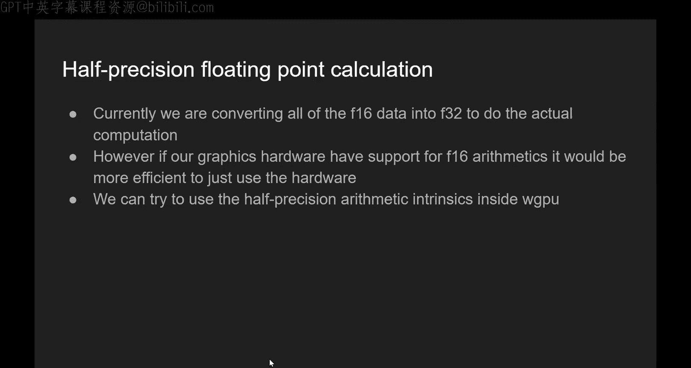

啊啊。Okay， did， did everyone already downloaded the Okay kind of stick and also the base code for this lab。

No， know。If you are using a Windows PC right now， you can go ahead and download it can。Yeah。

 I post a。Announcement inside the a discussion this afternoon， but。

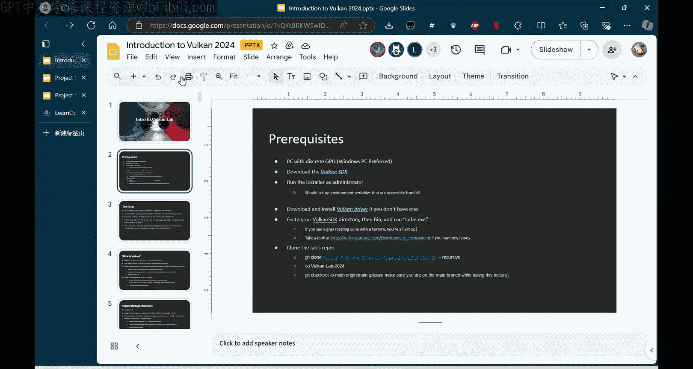

I'm sure not everyone's seen it before。So， yeah。So in this lab， we are going to go through like a。

Moocan code， which does something about asynchronously compute the recing and also using the buffer to draw the image。

The overall render pipeline is that we first try to submit the retracing job to a dedicated compute queue and then yeah。

 this retracing job is just like your it's something like your codepa freezeizer。

 but it is much simpler because it just do like very， very basic retracing things。And after that。

 you got a rett image。 but that image is。Its created with。With like exclusively ownership。

 So if you want so after you are using this image on the compute queue。

 you need to transfer the ownership to the graphics queue to actually read from the image。Yeah。

 that's the。 And the， the graphics pipeline was like the super easy。

 just rent the full screen pass and read from the image and output to the。ASlopching image。嗯。嗯。Do。

 do someone need more time to download the SD D K or download the code。ok， you can。

I will wait for you for five minutes。for。For those who already downloaded the code， you can。

Switch the branch to the reference branch and compile run the code。 You need to run semimic to。

Basically configure the project into something you can build like visual Studio project。嗯。Yeah啊。

Its great。好不。It will work， but。Just without the using computer， because you are。Using a queue。

 which is a。嗯。Yeah， yeah。 It will work， but I don't know。 I haven't tested on the。Innu GPU before。

嗯You can try。But if not， you can。Because all of the like。

 there are some like filling the blanks problem inside this lab。 But all the answers are on the。

Are both on the reference French and also on this slide， so you can。

Go back to home I use another PC to run it。But do you see there's a reference branch that we should check out。

You should check out the M branch during the class because there will be some like a few in blanks problem for you。

 The reference branch or just like a fully complicated code fully completed， yeah。Yeah。同。行。Oh。一？Yeah。

 yeah。The name of the。Q dot the X is this actually V K Q instead of Q。Yeah， because we are basically。

Working you through all of the code from creating a like a logical device to synchronization。

And it's going be to be a long journey and in two parts today。

Today we are not going to make you code work， but next time we will。Okay。

 well you are downloading the rifle， I will。First， put some disclaimer and also take away from this lab。

 The first one is no one fully understands or remembers everything about Vcan。

 So whenever you have like questions about Vcan's API。

It's always like easy for you to go to the Vcan specification and look out for the API。

And the second one is， no matter how complex you think GPU is more complicated than you think。

And this is true。 And you will find， you will find out。 It will eventually find out。And。

And the third one is trying not to reciting any API。

 but instead you just you can just try to use it and learn from coding it bit by bit。

And the first one is the specification I mentioned before， it's not easy to read。

 it may be hard to read， but it's also rewarding for you if you can really take some time to think think about the wording of the specification。

How they designed。And the last one is。Vokcan is super， super hard to use。

 And once you have a relatively solid understanding of this API。

 you can try to build your own infrastructure upon the raw API。

 such as a rendering hardware interface to make it much。

 much easier to use or you can build a render graph upon it so you can make the synchronization automatically after you specify the render graph。

And do。はい。Do someone still need some time to。Don the code were We a good。

 You said we're building with。I just did't it regularly。See make。

I made a folder and like domate that much broke， but don't see any vi。

What isYou need to A semi is not a you too。 It is a con to to like。To cross。Yeah我で like。这个。嗯。表な。Okay。

好了。Or I don't see where they're executable。嗯。我没点。我。怎样等待哦。それ場。Okay，我毕。I like。没。Okay。

 so let's just get started。And。So what is Vcan。 And it is a modern graphics API， just like T 3。

12 and metal and also Web GPU。 But I still think like Web GPU is a early release version。

 So it's not that like complete compared to the other two or three like Vcan。 And also。

 it is like a a fairly low level and explicit and also cross platform。Abstraction over your GPU。

And it compares to like legacy API， like Open GO。 It has like much。

 much clear concepts and consistent naming and also like the calling of functions and also the drugs you learn a lot about openstruct。

 And also， there's no global states inside Vcan。 And it is your own responsibility to tell the API what states you want。

In every， almost every calling。And there's a multi threading board for the command buffer recording。

This gives the programmer a lot of control and also you need to more a lot of work than before because you need to like basically tell everything to the API what you want to do and also a lot of room to make mistakes because yeah。

 when you are writing like 1000 lines of code to draw a triangle。

 there's always a lot of room to make mistakes。Yet， there's a lot of space for optimization。

 because you can。Like experienced Vcan programmer can achieve much much faster than not。

 not much bus， but a bit faster than like a good open G driver。I achieve。

And it is through structures。And。You are going to create a lot of strikes in sea to create some objects inside Vcan。

 For example， this V key instance is created using Vki C instance， very straightforward。

And it needs the parameter of V instance grade info。 You write a lot。 Great info for Roken。

Which contains like a structure time and application info and also the layers and and layers to be added and the extensions to be added。

 etc cetera。

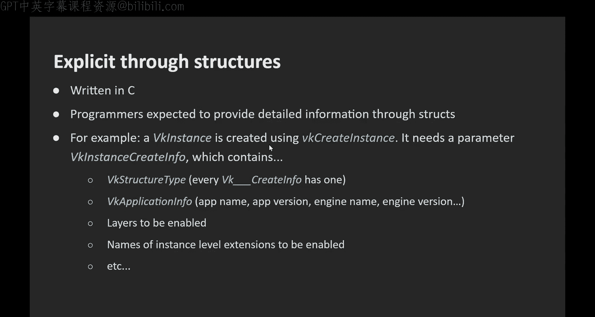

嗯。This is elements of a how to triangle and it is complicated and we can just ignore it and there's a lot of like jargons for Rocan let's ignore it and let's just jump right to the code and the part one is a fairly easy is initialization in Vcan。

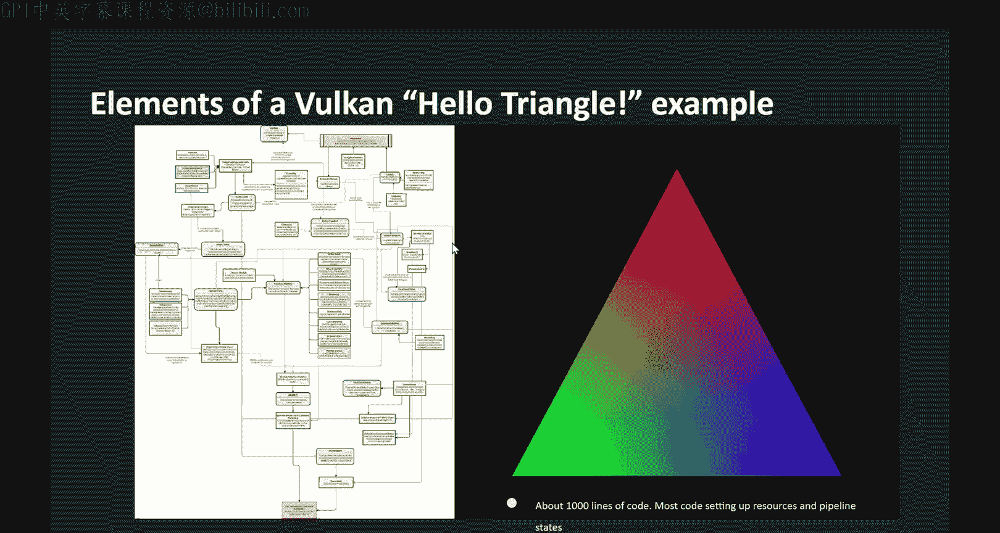

And so this is the instance， which is V instance we have mentioned before。

 it actually towards the application state， remember our statement about VOcan doesn't have any global state and all of the Vcan state global state is stored in the application in the instance so whenever your application is Vcan it needs to create a V instance。

So， there's a。There's first one look at and another to do instead you can use your ID to search for those look at and to do and to relook at it。

The V application in isn't that much。 It's just about the name and the engine name and also the version of the your application。

 your。And as for the instance grade involve， you also need to。

Add the extension you want to enable and also the validation layer you want to enable inside this instant instance grade info。

 It is like a something like a global information， but it is confined in this current instance。

 So go， you can go ahead to finish to do 1。1。 According to the slide。 Its its not that much。

 It's just。Pass some pointers to the vector， or pass the。A size of the vector to the count。

It is yeah， really straightforward。 And about extension and difference between extensions and layers。

Extensions is something like the。Some something like every。Every vendor。

 every GPU vendor can like develop some extension about their own GPU and you can enable their extension here and the layer here we are using the validation layer for debugging so one thing I like about V is that it is being very like explain it so every time you make some mistakes。

 the validation layer will tell you where the mistake is and what could have been wrong。And。

Is everyone like following me for the。Cold and to。Yeah， if you are， if you are not， don't worry。

 like we have the reference branch and also the slides for you the answers are all on the slides。I。

 I'll just go to the next page， which is。I're doing in more time。O。So you can use the auto。

 auto completion of your I D to help you write some long book email。Yeah， it is。Oh yeah。

 And so each create in each book structure will starts with a type， which is which is just。

To declare the str type， like for this， this ice type is different for each vcan structure。

 and it is like a unique， unique identifier for each type。And the other thing are just some。

Some naming view， which is pretty straightforward the from the name of it， yeah。And yeah。

 let's go to the next slide。 And another thing is that you can。Represent your current GPU。

 a single GPU in your system using a handle called like a BK physical device。Which you can enumerate。

The current available device using VK enumerate physical device。 And you can look at the code1。2。

 which is。Wch is呃。First， you can get the count of your available GPU into the GPU account。

 I see if I can zoom in the slides now。Okay， it's just first。

 it will get the GPU count from the V in physical devices。

 and then you can create a vector of this size and put your actual data into this is。

In intoto this vector is a little dumb。 You need to first query the。

Act and then create a vector of this data size and then call the same function again to get the actual data。

 but it is what it is。And there's a to do for you to get a discrete GPU。

 But for those one who don't have a discreted GPU， you can just， you could just fix， skip this part。

 It's just get the。So now after we inumerate all of the physical devices。

 it's being put into a like a vector， which you can。

It read over it and to get the physical device property using the this， this function。

 And you can check the device type。If you have an ID with you。

 you can go to the definition of the device type or go to the definition of this V physical device type。

 this GPU。On Vi studio， it will be like， let me show you。哦。Yeah。Yeah。

 here I'm using the reference branch。 So everything is completed。 and you can go to this definition。

To actually see other types of。Every possible of this。You know， like I don't know what it is。

 but this is integrated GPU and it's just your GPU on your CPU chip and this is this great GPU is something likeV or EMD GPU that comes with your laptop or not。

And I don't know what it is。 And this CPU you。 And this is， I think this is just a placeholder。

 And every time you are confused about something， you can always like， put your。

Moo sound usess and to get the actually the function signature of this function where further you can like just Google it and work on specification will tell you everything。

Like。And let's go to the next slide。 you have completed the to do of this slide。Yeah。

 here you can like select the most suitable GPU for your need。

 like in case you have multiple GPU like both integrated and disc GPU。

 you can always select the discrete GPU because it will。Perform better for your application。

 but for like mobile device。Maybe you only have like， integrated you。Yeah。and。Yeah。ok 。

There's a lot of， like。防身 to look at， yeah。嗯。Yeah， there's aside from the。

Vhi physical device properties。There's another thing this about the specification of your current GPU device。

 which is device features and also memory properties and also Q families。

And also the extension properties。This extension properties is for this physical device only。

 but our previously introduced extension is for Vi instance， which is a relatively global thing。

So you can query those kind of features and properties using these functions and。Yeah。

 there's really a lot of it。Yeah， there's something interesting， for example。

 there's a physical device features。For example， it will show you if it supports like retracing shaders and also the device memory properties。

 it can tell you like how many share memory for each each work group or each block is available。

 the maximum available size of share memory。And also the Q family。

 we have like briefly mentioned Q ownership transfer at the beginning of the course。

 we will learn more about it throughout this lecture。And yeah。Yeah， and after we have picked the。

Physical device and have all of the information we need， all of the features and extensions we need。

 We can go ahead to create a logical device。W whichhich is。

Which is something like now we have this interface through this V device interface。

 we can interact with our physical device。And here is where we enable all of the device specific features and also device specific extensions。

Here， and also we。And if we want to create aque family， it is here to， to do it。And now。

 let's talk about a queue。AQ is just a command buffer submission pass provided by the GPU。

 It allows the application to send commands like a drawing commands or compute computer spa or memory transfer memory copy from。

From the CPU to the GPU， like。Now we have like a set of commands we need to submit it from CPU to GPU to make it actually works and HQ belongs to a Q family。

 which defineies the types of operation it supports I think most discrete GPU now have like a graphic a graphicsQ that can do compute and also a dedicated compute Q。

And。Qbooks can help you like manage parallelism by enabling different tasks to be。

As createdated concurrently on the GPU， we need to specify the queue to grid when we create a logical device。

Okay， another to do is here in case you get like sleepy。😊，Yeah。😊，Yeah， this is， this is。

 this is like normal vcan and。Here when you are， you can search for the first to do， which is 1。4。

1 and you can check for the Q flags。Then iterate over the Q family properties and check for the Q Fl。

 If it only contains compute and not containing graphics。 It is a dedicated compute queue。Like， yeah。

 one thing Ive omit is that。Why we need a in compute， because。Because sometime our we have like。

 a memory bonded job and。AL U B job， A L U， which is the arithmetic units for the computation。

 that means。We have work that is memory bond and also work that is a compute bond。

 We can use AsI compute to avoid our computing work to be blocked by the memory bond work。

That's a way of maximizeim the occupancy of the。GPU hardware。So。Yeah， there's two to do on this page。

 And the first one is a bit。It's just a little bit complicated。 You need write a for for it。

And the second one is just， it， it's not that much you need to fill in the pub breathing。 Okay。

 so far， any questions。ok 。Okay， everyone is doing great。😊，诶。Yeah， and finally。After we have decided。

 like。The extension skillss and features。We can finally create our logical device。Into this。

We can you all of the。We have view in a lot of queuees。

 create info and also the features and also the extensions into the device， create info。

 And we can finally create the logical device。And next。

 we will introduce a concept which is called Swwatching。Okay， swat like。

It is something that allows you to。Send image to the screen and present it and get it back to draw the next frame again。

It is just a collection of render targets ready to be presented it can be used for double or even triple buffering。

And it requires a separate queue for presentation， normally your graphics queue can already do presentation。

So you only， you， if you are only use a graphicQ and， and to draw something to the stretch。

 you don't need to。synynchronize between different cues。And to create a swap chain。

 you need to create a service with the V instance。嗯。Yeah， this is like a prettyer boilerplate code。

 so I would just let you to look at it。Yeah， something like that。 I just keep this。Okay， finally。

 like we have finished the initialization part of okay。😊，Next。

 we are going to look at some like resource and actually memorizing like the storage buffer or storage image or uniform buffer like something like this。

😊，Okay， first we， I think image is like more important in the field of graphics because like a lot of things are image in graphics and you need to draw image into the screen in graphics。

 So image can represent up to three dimensional array of data。

 that means you can have like a 3D texture。Or Swie image and。

It can like be used for sampling or render target or also the data storage， but the。

But way the way you can use it is determined while before you're creating it。

You need to specify the specify the usage of the image well in the creation youll see in the to dos。

I heard this page。And the format means the data layout of each texto in the image。

 which specified the channel and also the data wise means you are using either like 8 bit integer or floating point or something。

And the layout is a changeable physical state that an image is arranged in memory。 This is something。

嗯。That you， you didn't see in Web GPU because Web GPU automatically transit the layout for you。

 and Vo is annoying because it is like explicit in everything， so。Like。For each stage。

 maybe the image。Requires a different layout。 You need to like manually manually perform the layout transition between stages。

And layout transition is done by placing V image barriers and using V combined Tline barrier。

Between different stages。And we will go back to it when we are talking about synization。And yeah。

In our example code， we are using a like a storage image。

As the buffer for recing in confuciator and also were sampling this image in a full screen pass。

During the graphic stage。 And here the， this code is， is really done。

 Like we're using like a texture size of like equal size texture。 But after that。

 we are like sampling it to like a screen size。 We， like， I think it is better。

 if we are doing like a。If we are creating this texture with a screen size here。

 but it is what it is。 It's just an example that can run like。We need to specify the format。

In the studio and also the format is just a variable which is created from above。

 which is it's just RGBA8 or something。And the texture side would be like just like a square rather than a rectangle。

Of equal side。Yeah， and now we can see the usage like。

Like every image will be created with some usage needs to be created with some usage like if we are not creating this image with the VP image usage sample bit and we are trying to sample from it。

 the validation arrow will with screen。And you'll get a validation error。

 And here we want to use our image in the compute shader。 We want to。

If we want to use it like by randomly accessing it。We can by by randoming access， I mean。

 like random accessing， both read and write。We can use the VP image storage bit。

 which means that this is a storage image。 And also， we want to sample it。

 So we want the VP image usage sample bit。And。Yeah， for the image to be used。Actually。

 in the compute shader， we need to。First， actually bind actual memory to this image。 And also。

 when we first create this image its just like a。When we are like binding some memory to this image and this memory is just full of like garbage data。

 So we want to perform a layout transition to like a B key image layout general so we can some it is something like like memory initialization。

 but it is more than that we have like this layout transition because。

The comprtor needs the image to be in this layout， which is V image layout general。

So we we are going to use the memory barrier and also the command pipeline barrier to make the layout transition。

 yeah。And also。We are creating this image with with lets go。

 let's go back to the code to see the creation on this image。

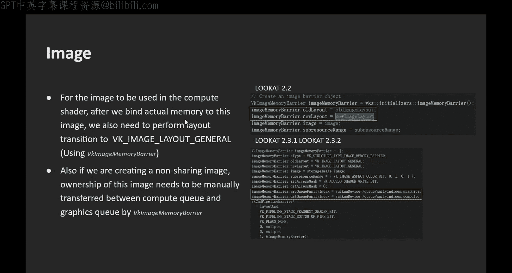

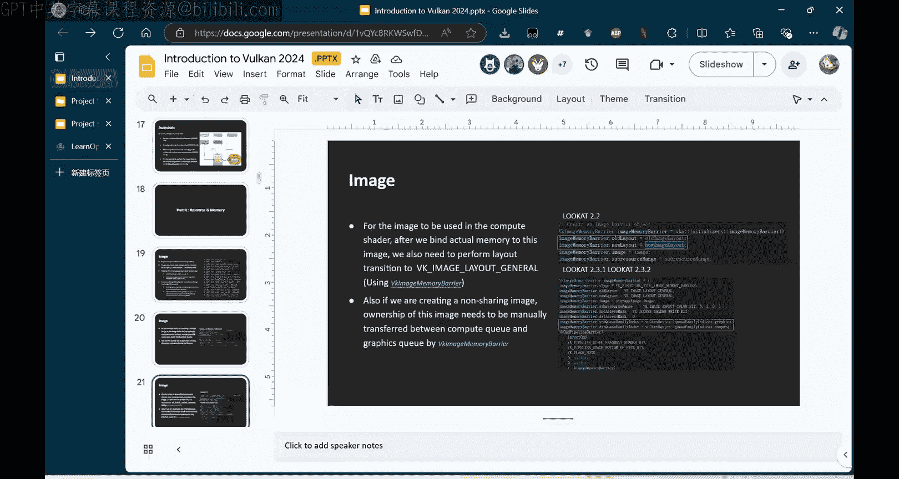

And。Yeah。Yeah， storage image。 Where are you。Oh， it's here。Yeah， so。

We are using this VK image create info so you can like。Go to the definition of it。And to see。

 what is this。And that's really a lot。 But here we are focusing the V key sharing mode。

 which we can also go to this one's definition， which is either exclusive or concurrent。

 and this one doesn't count， which is either exclusive or concurrent by exclusive means that this image can only be used or owned by one Q。

And if you want to use by another queue， you， you need to transfer the ownership。

 But if creating this with concurrent， you don't， you don't need to worry about the ownership transfer between different queuees。

And this here， were creating with some like a default function， which basically initializes one to 0。

 And this is some cur bracket of some like C plus feature to。Crazy this one with all0。

 So if you can go back to this and check the this share mode and you find out this。

 this is just exclusive。 So it is created with Vki sharing mode exclusive。 So we need to handle the。

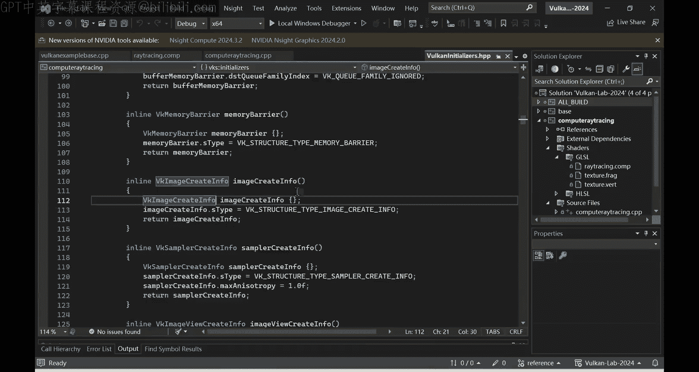

Ownership transfer ourselves for this image。

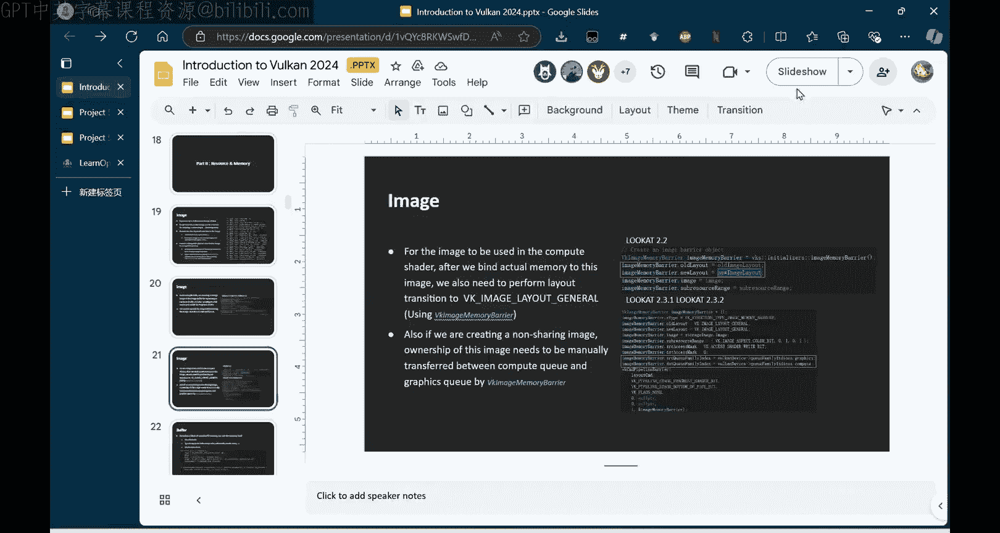

Yeah， this， yeah， this is really。Really a lot。 I understand。And so far any questions about anything？

ok。Okay， let's， let's move on。 And now we have buffer。 I think buffer is。

A bit simpler than image because you only need to specify the side of a buffer and the usage and whether to be shared like the image and nothing more。

 you don't need to specify a lot for a buffer because it's basically just a chunk of memory。嗯。

And for。And what it is like very strange is that like Vickki buffer and Vickki image do not hold memory themselves。

 you need to allocate device memory for them。嗯 yeah。You can。

You can use like Vki bind memory buffer memory or Vki bind image memory to find like memory that you are allocated with this specific buffer or image to this buffer and image。

嗯。Yeah， and the way of doing it is to first to after you created created the image。

 you can get the memory requirements for this image by using this one we get image memory requirements。

And you can get all of the required memory info inside of these memory requirements。And then。

 you can。Yeah， there's a。There's a guide memory type like for for each。Yeah。

 for this my certain memory requirements， you can use get memory type to actually actually。

 let's let look at the code。

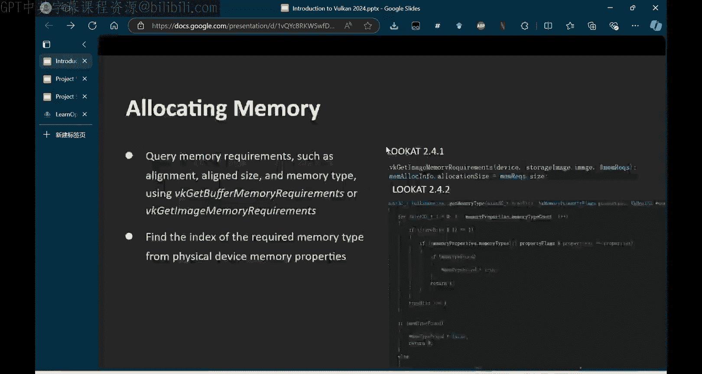

嗯。Okay， so we have this。Memory requirements from we could get image memory requirements。And then。

 we can， like。Plugging the memory type is into this get memory type function and note that we have selected this image to be a device logo。

 which basically means that this memory we are going to create is on the GPU's global memory。

And going to this function like。It just checks like the type is if sometimes how memory satisfies this type。

 it just can return the memory font and for most of the time it will return return the memory。

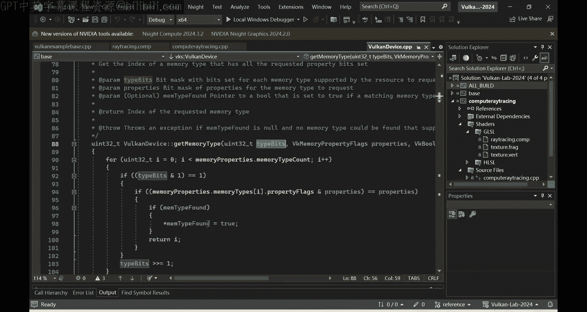

time you want。And you can。Plug in the type index。And you can plug in the type index into the memory allocation info and you can allocate the memory after you allocate the memory。

 you can finally bind it to the tour image okay。嗯。

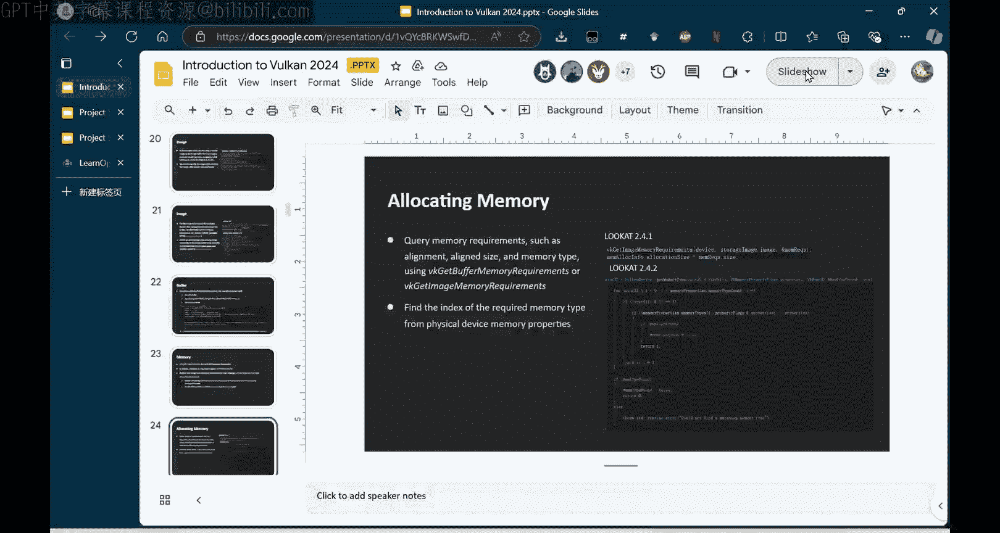

Everyone following me or。 Everyone is lost。Faling along to some degree， but it's in vgan。Okay。😊，Yeah。

 yeah， after we are getting the memory， we can find it。

If you want to update your memory from host like feeling a buffer from CPU。

 things become a little more nasty。Your memory must be created with like。呃。Yeah， there's two case。

 The first case is that like this is kind of like a。A very small buffer。

 You can just create it with like ho visible and ho coherent。

And this one is like simpler because you can just map the memory and just memory copy to this。

To this memory。And another case is that， like for。A block of memory that is not going to be used by the holes during the render loop。

 you can consider to make it device local instead of house visible because you can get like faster access from the shaders。

Yeah， things get complicated here。 You need to first create a staging buffer。

Which is house billable and house coherent。With this usage transfers worse。And then， you can。

Created your buffer or image， bound to the memory。I'm sorry。

 the image bound to the memory or the memory bound to the image and bufferbar must be created with transfer destination。

诶。This is very similar to the web GPU you have， if you have used it。

 there's you need to like specify the usage for the transfer and。Yeah。When you are creating it。Yeah。

 if the image， if the memory is for an image。The layout of the image must be transitionent to V image layout。

Fast for destination， optimal。 And this is yeah。And then you can finally copy your data into the staging bufferber。

 and then you can copy the data from staging bufferber to the destination using like V command。

 copy buffer or copy to image。And。Yeah， and after that， you need to。Place a pipeline barrier。

You need to place a pipeline barrier because you don't want your data to be to be read like before it is written。

 it is completely written， so that is like insurance to make sure the memory operation is synchronized。

And yeah， and lastly， you need to submit all of your commands inside this single operation。Yeah。

 this is just like updating memory from host。And。And。

 and new or base gold Ive leave like several to do。

 like we have like helper functions for you to create buffers and also。Yeah， and also。

great command barer。So command buffer is just like the command encoder inside Web GPU。

 so you can record commands inside the command buffer and then after that you can submit this command buffer to your NQ。

嗯。Yeah， there are some to do for this section。呃。Now our base code。

 we have a storage buffer because we are doing retracing。

 so we have a storage buffer for all of our same geometry。

We want to transfer our geometry data from CPUU to GPU。

And our GPU is our CPU is not going to access the data well in the render loop。

 and it is basically a constant data。 So we want a a device local storage buffer for better performance。

And we can first create like a house readable and writeriable staging buffer and copy our data from our CPU。

 which is the main memory and to this staging buffer。And then we need a device local buffer。

 and then we copy from Se buffer。To the device local buffer。

 lastly we need to destroy the staging buffer to avoid memory leak。

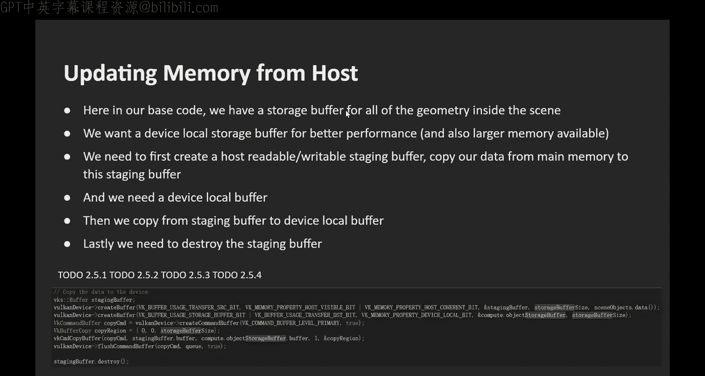

And。Where is the code？啊。

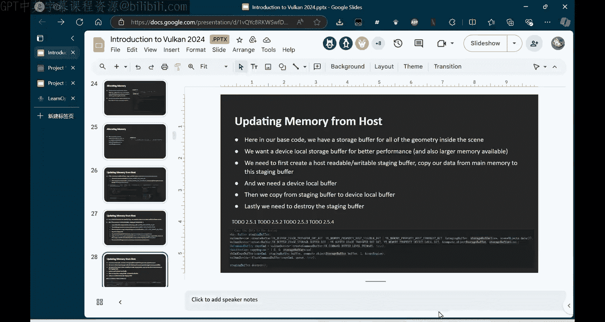

Yeah， the first buffer we're trying to create is the。A staging buffer。

Which is which should be created with like transfer scores usage and also the memory property should be like a house available and house coher。

 And this is a pointer to the buffer to。To let this function return。诶。

We have this size of the buffer of course， and also the actual data。 And also。

 this helper function automatically help you to。 you can go to the implementation of it and we。

 it will help you to actually copy the data to the。Offer that you created。You can， yeah。

It is really complicated。呵。😊，Yeah， and next you want to create it like a device local buffer。

 which uses should be like a transfer destination because you want to copy from the staging buffer to this buffer and and then you want to use this as a storage buffer because you want to random access。

To read the data from the buffer inside shader。And you want this one to be device local because you want like a better performance of shader shaderarrow。

嗯，诶 yeah。And after that， you can。Create a command buffer， which is a pretty。

Pretty standard way of like doing anything invocan。 And you can like。Said the copy region。

 And if you are confused about like what， what this this is， you can go to the。Definition of like。

 you can see this。 This is the source and destination of and the size of the copy。Yeah。

 whenever you have questions， you can either go through the definition if it doesn't solve。

 you can yeah go through the browser and plug in into Google and we would like。

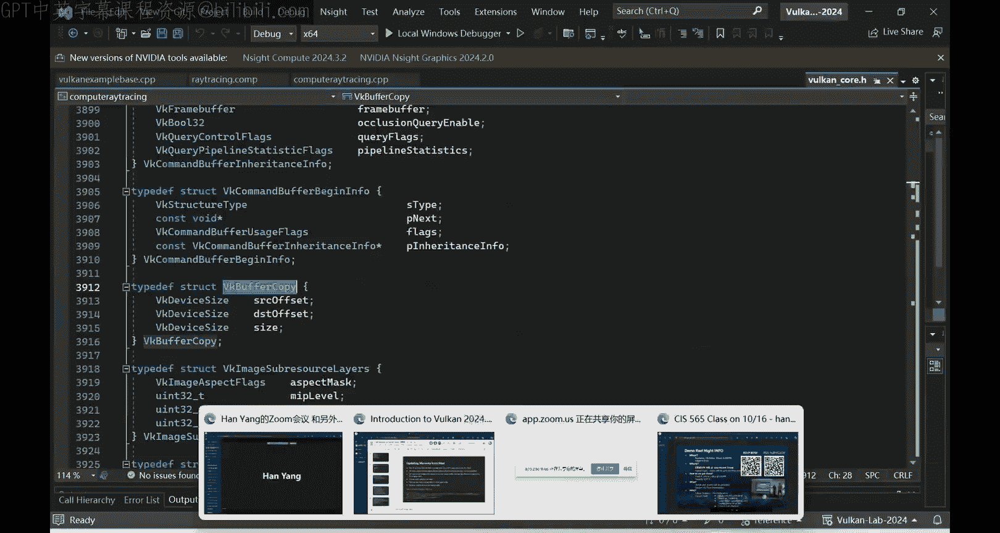

Go to the look specification。Yeah， but for this one。

 it doesn't help that much it just because it is pretty straightforward。

 but you can always do it for other structures or functions。

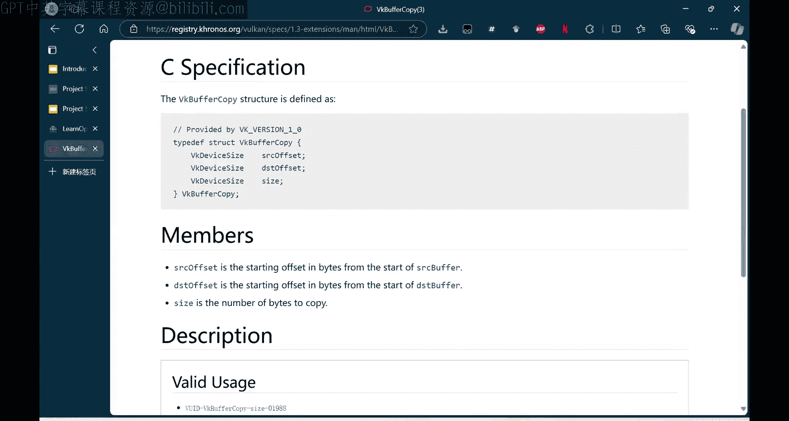

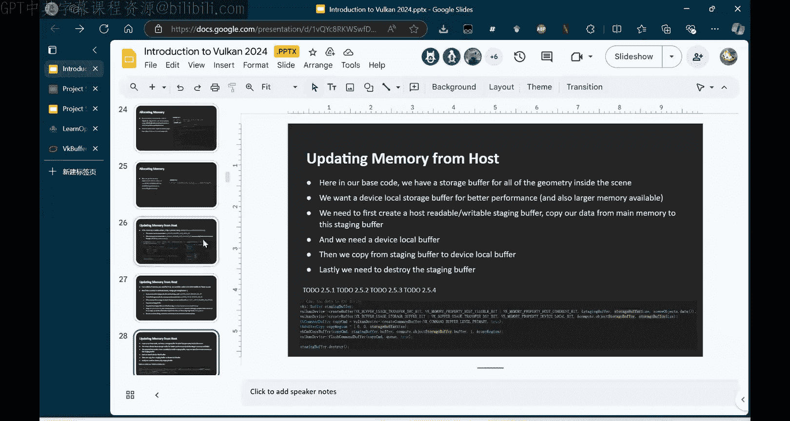

And。Yeah。And this is a。This is how we create， like create some session buffer and update our memory from host。

嗯。嗯。And。And。Another concept I want to introduce to you is a sampler and image view。

An image view is just a view into an image。 It describes how you can like access the image and also which part or which like rectangle of this image to access。

 It is possible for shaders can。They can just read like a single texts from image。

 but it is not very common because you there's like a filtering your。Using inside the shader。

 So you need like sampler to actually do the filtering for the texture。诶。Yeah， and， yeah。

 And after we create the storage image inside the code。

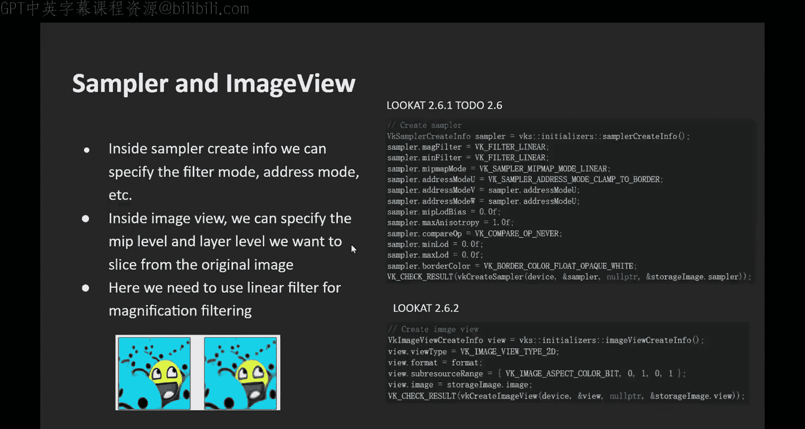

哦。Yeah， where's the story。

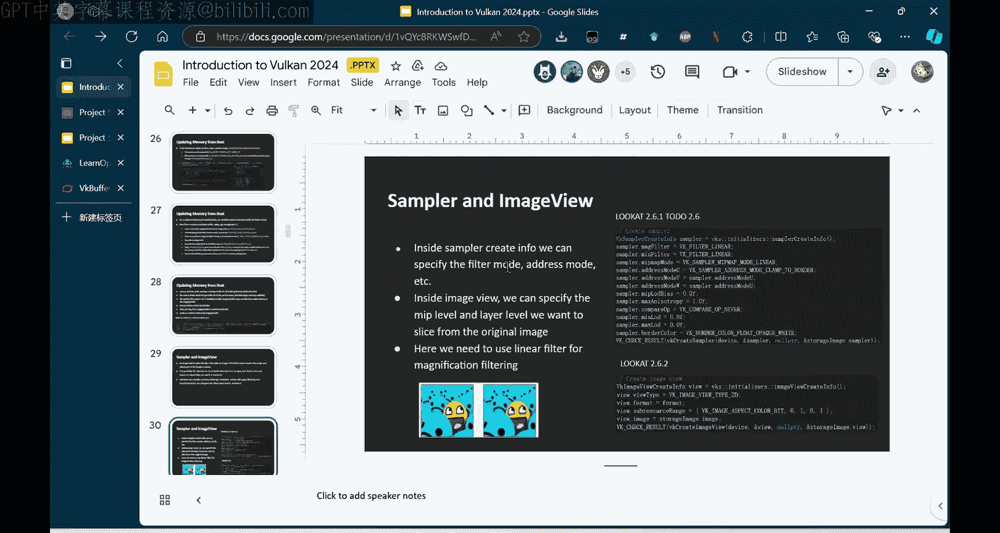

Yeah， let， let's just go to this to。Yeah， yeah， after we create this storage image。

 we can create like a sampler because we want to sample this from the from the graphics pipeline。

 from the fragment shader。 So we need to create a sampler for this。And here you。

All you need to do is to change this one to the nearest filter to linear filter。

 So when you're like z in， you can get a like a linear filter instead of like nearest filter。

This is the same as in like whole other graphics API。And you can like。

 pretty much specify everything here。After that， you can create the sampler for for please note that theres no。

There is no such field as。Image inside or image view inside the sampler。

 So this sampler can be shared by several images。Like as long as you you want the sampler to be the same action on the image。

 for example， you two image both want the linear filter， you can use the same sampler and yeah。

And also for the image to be usable by or bindable by the pipeline， you need to create an image view。

You need to specify the format。And yeah， this is pretty like a standard for every 2D image。

 You need to specify the type to B 2D。 And also， what is sub resource range， You can go to the。

A definition of it， and。Whether。A aspect mask and base level and level count and base a re level level count。

 layer count。And。It is just something you want to create like a。

Image with a different me level or image or image array with different layers。

 but here we our offset is zero and count is just one because we are creating a single image without any layers were。

Mip， map levelss。The mask is a color because this， this image is basically like a。

Image we are storing like the recing result into it， so we are using the color aspect。好 it。Yeah， and。

Yeah， you can like explore all the view or something into the this， this one is descriptor。 This。

 this descriptor is just like the。Just like the entries inside the bank group of Y GPPU。

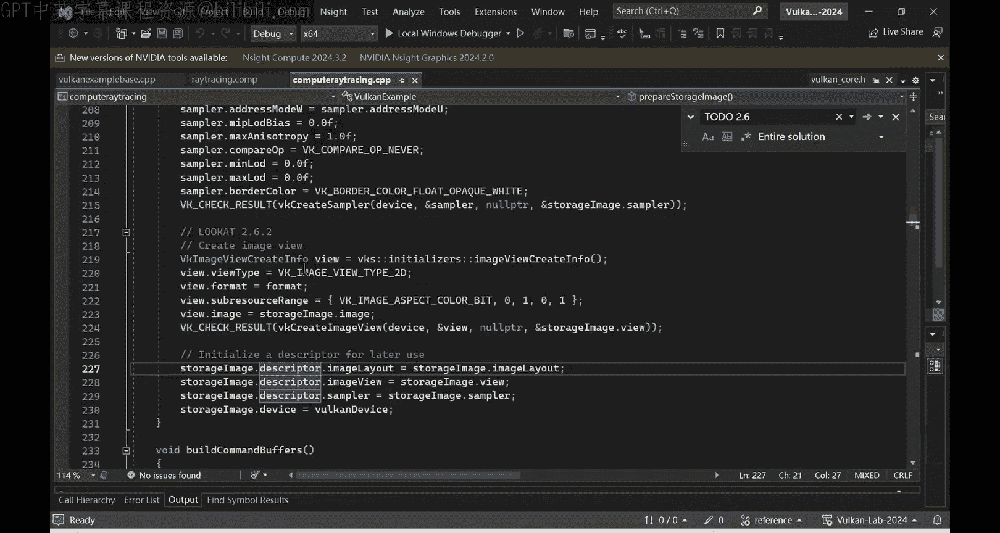

Alright， let's go back to our slides。

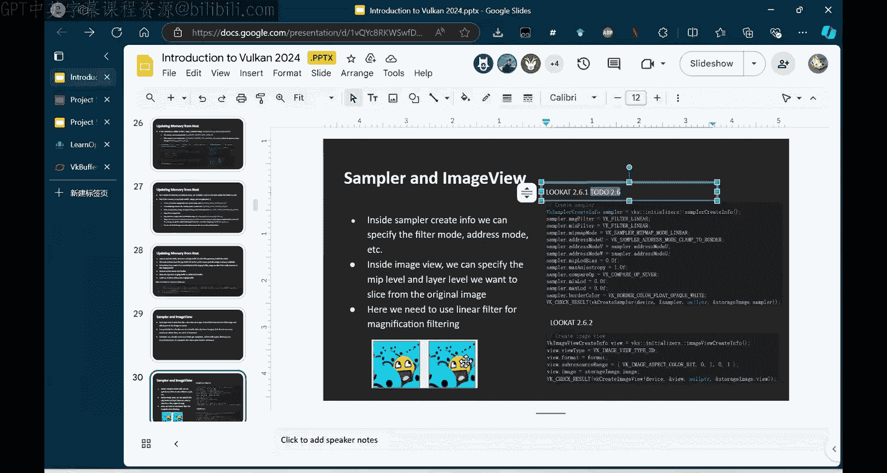

And。Yeah， after we create all of the resources on the CPU side。

 we can declare our shaded resources in GL for Vcan。And there are some like declaration reasons by。

I personally don't remember， like， a。A lot of the declarations in the shader。

 like we'll just look up for them because you don't get the same。Like， you don't get the same。

 like auto completion inside the shader。Unlike say plus plus。

 you will always get some like auto completion。 You can just look for it。

 And there are some like buffer and。Storage were uniform and also simpler and also texture were combined sampler。

That means you can like combine texture with sampler and bind them all together。

And also storage image。Yeah， and here， a thing to notice that there's a concept of like site and binding。

 This is exactly the same in Web GPU's binding group and also the binding。

The set is just means the binding group， and the binding is just the offset inside the。Bining group。

And next， we have the。Resources。Yeah， I think we can take a break here。Yeah。

 I just don't want everyone to be like。Feeling lost。 We can take a break here， and。Yeah， after like。

10 minutes more so。 we can go back to the。Thank。Oh。嗯。Yeah。Yeah。Okay。对。我们。不道。こことで。一个还。Okay。这出打到。咁曾经样。

没有。你工的。要证。还是我于我们。あまで。对。那我觉。只么说我们的。我你。你这个。这个。这看才这个。こいで。我我能打一个。嗯。Yes。对。我们这边。我想。还有。好知道。有啲系。这个。对。还没。

还是为什么？然。还是好。Yeah， it。系要。当。没什么。都我哋系。好。白慢困。朋好可以这。这这样。嗯。我一个人。Thank。I mean。Oh， I was just like listening。

はま。I subject这个 to do。今年。诶。YeahYeah， the end of the slide is not like how you finish， that's's really。

Thisは。Yeah。这关系。Yeah， I feel like it's also much as way。But we do both grass and figureuring it out。

哪啊。I at least we have some。Absorpttion by way。Geting the Bible of things。Right。第二。Oh。那几人。

I just finished my deferred render。哦啲啊嗯。For some reason， it looks bright than the。And。just why。

ButEverything else is fine， it just worth。没体是。Okay。Okay。反正反正。

Not a bit tune this morning or before is。他就回。之前。诶诶。哎啊这个。😊，当。呃，海到。没。And。呃，我。看还。不理。还想。系系。哦我自前。不行了。对。あ次。

如申请。exactly。And这两。Yes。你知道买。没问题。好。我。还就你自己。嗯。嗯，你还听来大家。で个は？好多呀，我是变。你可一下。不单算了。No， you道什。对。本来一起到这。本题最。

Like guess to have。我标的是A。啊，你就说吗。已经两种。It。我是。能。Okay。あの睇口ま。我有。Okay。喂。😊，还一个。所比说问高。系咯其实你你呢个讲出。我保证那就。

rather dont know。我 you。关。有。对。自己考虑。很早我。Yeah。嗯。是业模本来是你们。对。明白。这場な。こあ difference。我で。ます。Yeah了。で生明。点真系难我感受。

还有这。不是吧。可住呢个翻。可。Yeah。こういうある。不对不。な。In group。信じ的。branchesches are good。That flows。Yes。

They I start pro no。搞个睇见。I was literally willing to look at the number。で。😊，还些。Is there a？あのものですね。

What's that？This that。然后原。对。欢迎方。哦你啊。我的你。

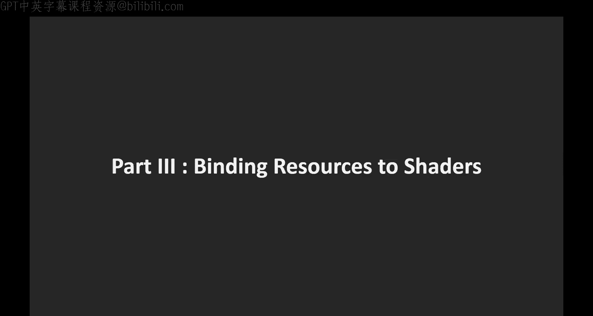

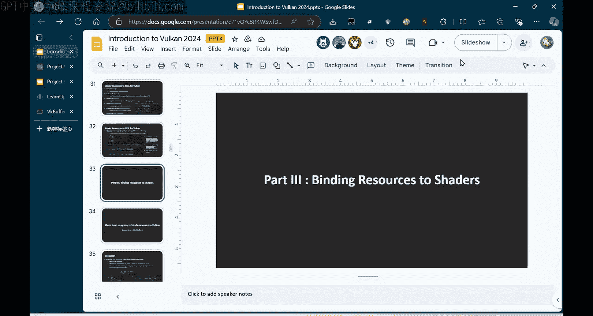

Okay。Okay。Yeah。嗯。好我。嗯。Yeah。Okay。你一。对。Yeah。一后我看不。Yeah。Yeah。Alright， let's。

I be to wen or you was still need more time to。And。嗯。😊，Now we have the all the， all of the。

Resources we need。We can。Yeah， we can try to bind them to shaders to actually our pipelines to use them。

Inside shaders。Yeah， all of the。All of the answers of the tools are in the slide， so。

Don't worry if you can follow it or you can just switch to the switch to the reference branch。Yeah。

 yeah。The way of binding a resource is also not that easy invoking。呃 lets。

Let's first introduce the concept of descriptor。It describes how a resource is bind to a shader resource slot。

 and that's that's basically after you are declaring inside the。Inside the shader。

 you need some descriptor to bind to this slot， but。

Van doesn't have this concept of a descriptor instead it bundles descriptors into a descriptor sets。

So you can only create like a descriptor set with at least one descriptor in it。

But it is actually recommended。 if you can， like， group some。

The descriptors that can share the same update frequency so you can avoid buying descriptors。

Like very too often， very too often。To create a descriptor set， you first need a descript set layout。

 which means all of the resource loss format inside one descriptor set。

So the descriptionscript set layout is basically the all of the formats for bindings of each descriptor you can created using like this layout grid info。

 It can support it can specify the bindings。The point pointers to the binding data and also the count of the binding。

Which directly maps to our shadowr code。You can see the binding 0，1，2，3， and here is a 0，1，2，3。

 and all of the。Da type should be mashed from for example， we have a buffer here。

 which is a storage buffer， so we have a storage buffer display type。And also。

 this stage is that it specifiedifies the stage that we want this binding。For example， it is， yeah。

 it is easy。That you can just specify all of the stage that you can。

 so you can find it wherever you want。And yeah， this is some knowledgey。

The descriptor set is just like a set of like different memory different member types。

 So for each member type we have a descriptor for it。And yeah， the layout is a class declaration。

 and the descript set is an instantiation of the class。And in our base code。

 theres another to do for discscript set layout， which we gave you the first discscript set layout binding and to require you to finish the second and the third you can open the code and check those to do。

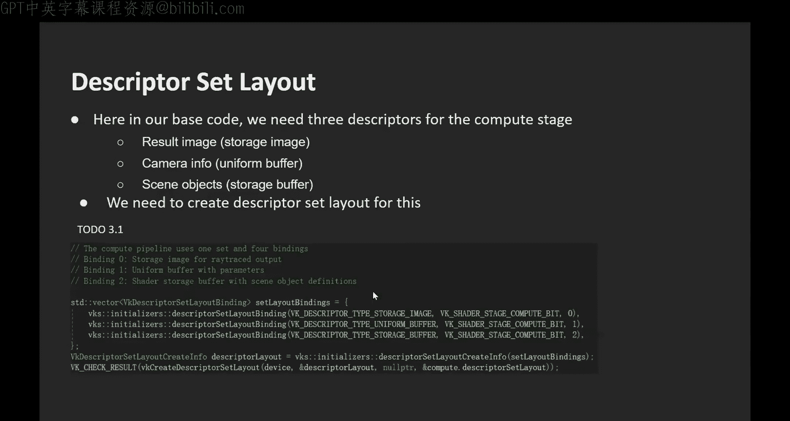

嗯。

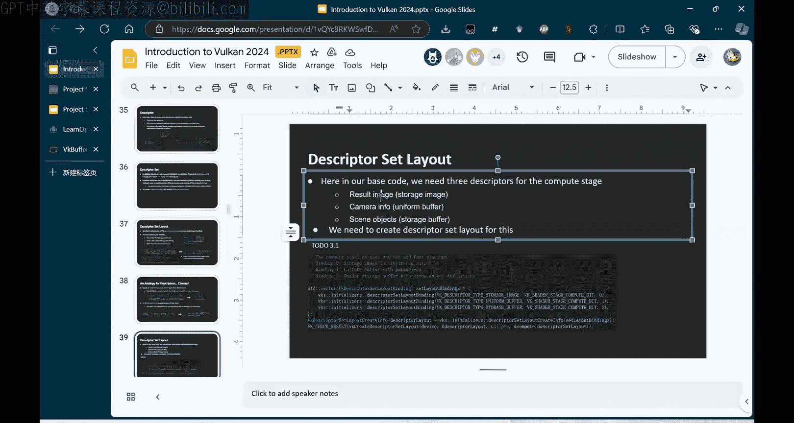

There's to do 3。1。And here， the code is already completed for you because I'm on the reference branch。

 but you can check out the。First， you need to。Figure out which file。

 which hit file your descript Saly is going to use。 Well in this case， is the retracing the dot com。

 You can go to the。Ser and。Look at all of the binding。 And the first binding is a。

It's a storage image。And the second binding。Here the image 2D is for the storage image。

Which you can write to the， which you can randomly access by writing to random address of this image。

 And then the second binding is a uniform buffer。You can see the binding equals one then uniform UBU。

 which is the camera's information。And the third binding is the another storage buffer。

Which contains thin objects。Yeah， and you can see。Now， we can create a。

Descript layout for these different binding。 I think the first one is already given to you。

 and you need to specify the second one and the third one。 The second one is a uniform buffer。

 which we can see from the rayrecing dot com shader。Here is a camera UBO， which is a uniform buffer。

 and yeah， the stage will be compute because we are using the computer here。

 we are only using this discscript set for computerr， So we specified the stage to be computed。

And yeah， the the last one would be like a storage buffer just as a code here。

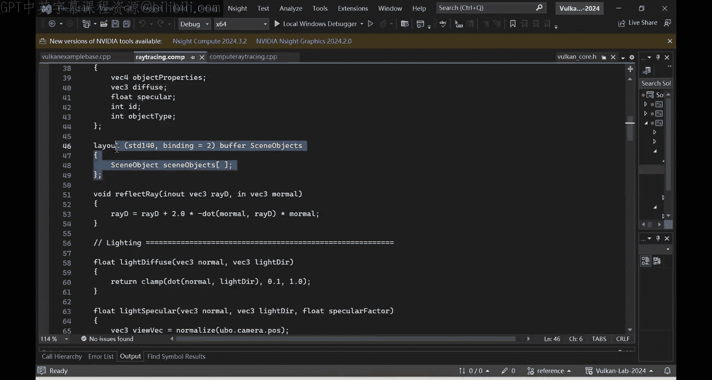

And we'll go back to our slides。

And after we create the layout using this Vk create disc cell layout， we can actually。

Alloccate the discscript set using allocate V he allocate discscript set。

Here we have a concept of a descriptive put it just another thing that is created in the initialization stage。

Yeah， and we don't worry。 we don't need to worry about the this way of this group said we only。

We only need to destroy the descript code and。We destroyed the pool all of the sets that were allocated on it will be destroyed。

And after we allocate the descriptor sets， we can finally write to it by using VK update descriptor sets to actually bind the actual buffers or image to the descriptive sets。

And there's another to do for you， for our。Yeah， compute stage。

Which is Ive already provided the first descript set， right descript set to you。And。

You need to go complete the second and the third。Which is to bind the。

A compute dot uniform buffers descriptor。 And this descripter is just anotherstruct。

 which which is just a buffer infostruct， which specify the buffer offset and the range of the buffer。

And the same for the last one， which is a storage buffer， and we have this descriptor here。

And the descriptor is basically just a V case descriptor buffer info。

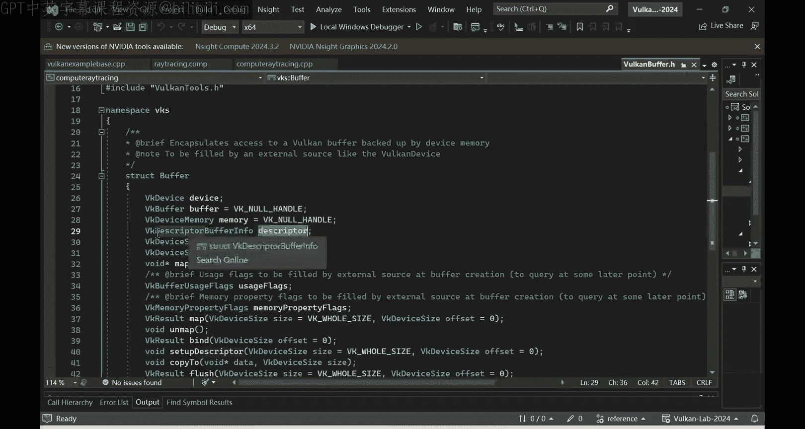

So。Yeah。

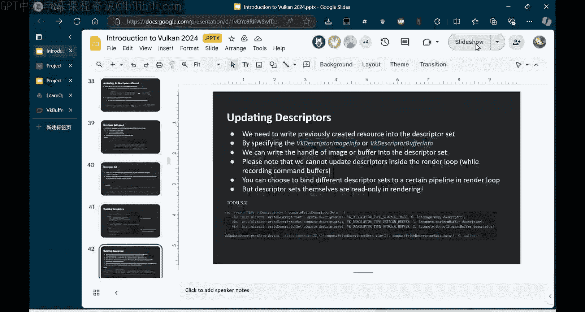

After we update all of the。Descriptor set， we can actually bind the descriptor set。

In actual in actual like compute pipeline， here is compute pipeline。

 but it is also possible if you are creating it with like a graphic pipeline。Yeah。

 but remember this but you need to yeah， there's one thing for sure De size themselves are read only in rendering so you yeah。

 so you can like update them again。So， but you can choose to bind different describescript sets for a certain pipeline in the render loop。

 so if you want to change something in the descriptor set。

 you can always create another descript set so you can find the first diser set or the second to change the data you are binding。

2。And。Yeah， and， and， and each stage has its own namespace for binding。 for example。

 if binding equals to 0 in vertex shader。And it is not this it is like completely separated from the binding equals0 in the fragment shader。

And。And each resource type is， is also namespace。 Like you can use like binding equals 0 for buffer and also binding。

哎。And， and you can also also use like binding equal0 of an image。

And one resource can be bound to multiple laws at the same time with the same sitters stage。

 but that's not like a useful at all。I don't think that's useful and。Yeah。

And it is a better practice for you to group your descriptors into descriptor sets by its usage and by scope like。

 for example， you can have like one set for your graphics pipeline and another set for compute pipeline。

 and this is exactly what we are doing right now。 So we have this。

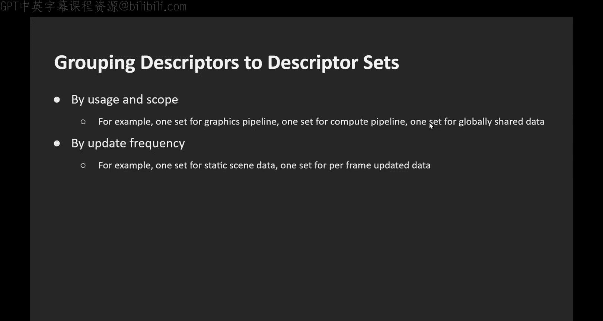

Yeah， computer no。 yeah， we have this compute dot descriptionscript set here for this compute stage。

 And we have a， we have also like a descript set for the。Graphics pipeline， which is here。

 graphicraphs style disk group set。Yeah， and。

And also we can group descriptors into descript sets by its updating frequency。

 and we can have like a one set for the static data and also another set for per frame updated data。

Yeah， descriptor pool was created at the creation stage。 like there's a code reference。

 so you can look at the descriptor pool， but there's one limitation for descriptor pool is that you need to specify all of the sets and the size of each type。

 for example， if were like。Going to use like four combined image sampler。

We we can only allocate that much combined sampler for this descriptor pool so。

So you can like set it to a like a larger number or even to the maximum number of this。

A resource in case you don't want to like， recalculate it from from time to time。哦。

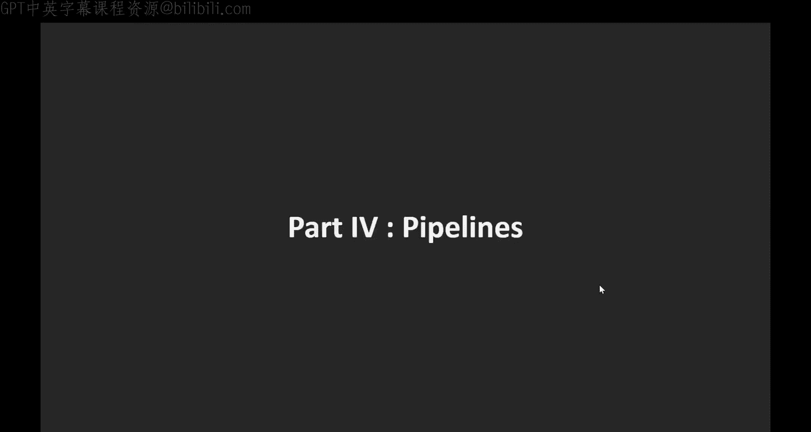

Okay， any questions for。The descriptor or descript says。okay let's。

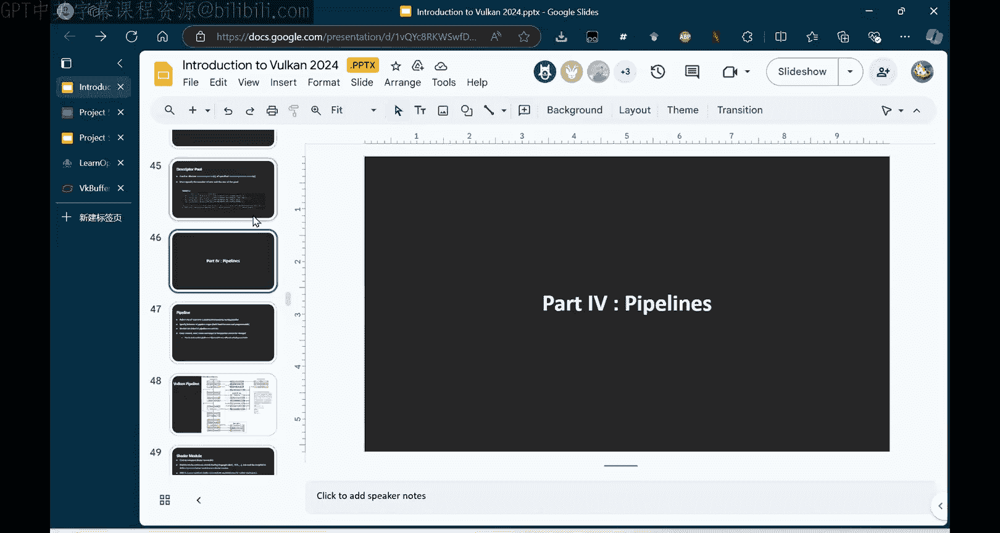

Let's talk a bit about pipelines。And after we have descriptors and descriptors sets， we can。

Especially the layout for the descript set pipeline， the descript set。

 we can use the layout to create like pipeline layout so we can create our pipelines。and。Piplines。

Pipelines graphics creation the graphics pipelines creation is rather complicated。

 but for a computer we reus， it is very simple。And we can like specify some behaviors of pipeline stage for both fixed function like raurization and also like programmable stage for for example。

 our verex vertex shade stage or fragment stage。And shaders are linked to pipeline on creation。

 once created pipelines， states and most most of the states and stages。

Shaer stages in the pipeline can now be changing。You want to。

 you need to like create another pipeline for a different like shader。

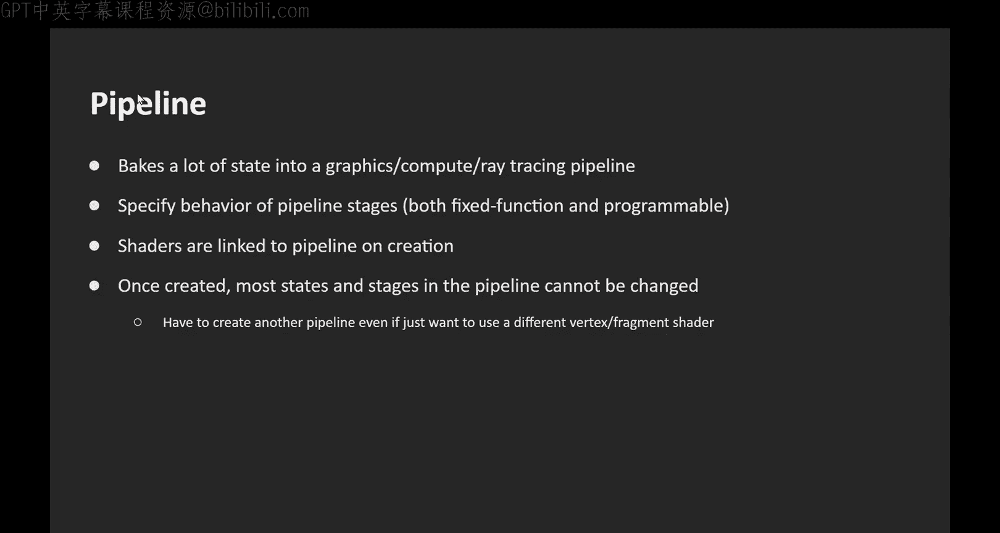

This is a some diagram for the pipeline。And yeah， you can see from the。From the draw commands。

 you have like， we have input input assmbler。 and next is the vertex shader and the teslation assembler and TC S and and teslation。

Permitive generator and T， E， S， T， C， S， which is a。

Tesslation control sheeter and evaluation sheeter。These two will we use in the vcan grass project。

And also， after the testlation stage， we have the geometry heater and。Next。

 we go into the primitive assear and restization。And。Fgent fragment shader stage and blending。

 finally。Yeah， this is a。This is a pipeline of the graphics pipeline， and but for the compute。

 it is more simpler。Much much similar。 The only thing you need to do is to dispatch the computerr。

 and it will run。

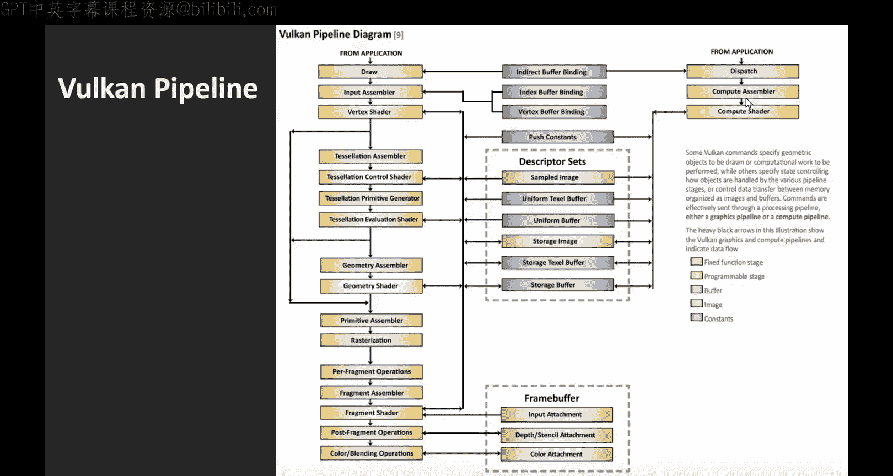

And。Yeah， and invocan shaders can be written in several shading language like G SL or HL SL。

 but it can be well it must be compared to Spvy by code before being loaded into a shader module。

Surberry is a cross platform shader and immediate representation for Boan and Open CEO。So， yeah。

 if you have installed a V SD DK， there will be like a shadow compiler that can help you to compare the GSL or HSL into Sp。

嗯。Yeah， and the creation of a shade module is pretty simple。

The only thing you need to do is pass your Spvy code here， which is the shader code。

pointers to the to the shader code and also the side of the code。And you can。

A crazy shade of more like like this and。Yeah。There are some compilers。 I think these two compilers。

 maybe I don't know the second one。 The first one is。

 the second the first one comes with the book SD D K。

 So you can always use the G O SL C or compilation。And。And you， for different shader stage。

 there's something called like a pipeline shader stage grade involved， which specify the。

Car stage you want to create， so you can。Use the， yeah， we can go through the code。I see it。嗯。Yeah。

It， it， it just a。Specify the shadery wantload and also the stage。

And this is something that we passed from the parameter。And。

I think the P name is the entry point for the shader， which is almost always main in GSL。Yeah。

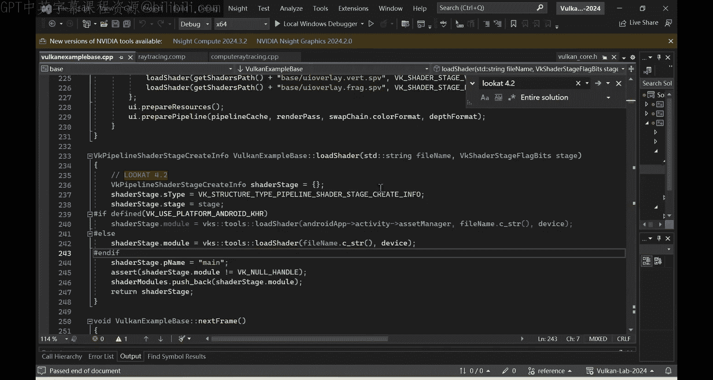

And after you load the shader， you can pass it to the pipelineline creation stage。嗯。

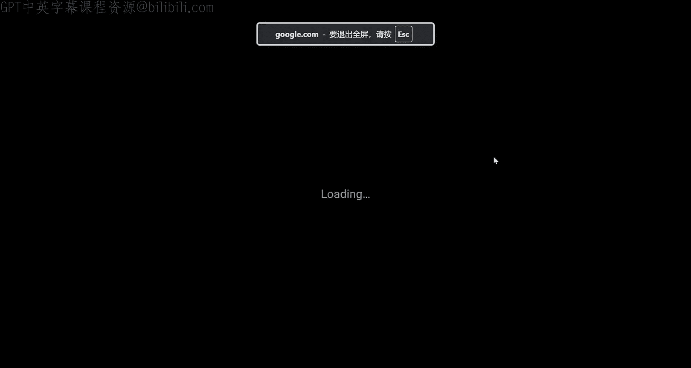

Yeah， and another thing is like a vertex input。 In our example。

 we don't have like actually vertex input buffer because we are hard coding because the graphics pass our our。

A example is just a full screen pass。 So we are hard coding the。

Argoling like a triangle that can cover the full screen inside the shader。and。

An example with the actual input vertex buffer will be as follows。

So we need to specify the binding description。And also， the。Attribute description。For， yeah。

 for for each for text buffer。In case you have multiple。This is。

 I think this is very similar to Open GL， more than open GL。And。Yeah。嗯。Let's go to input assembly。

Yeah， and you in in， you need to。ASp the。Yeah， I believe also in Web GPPU。

 you also need to like specify all the like topology， for example。

 whether you want to like draw a triangle or a line or a dot or something like a triangle fan。Yeah。

 you need to specify the input assembly stage。哦， ok。Yeah， but involving。

 you can like draw lines for the mesh or something。 And also the rust rid。Yeah。

 the ra writer there's a to do for you is to just one single like view blanks to set the polygammal to be few or to polygammal to be。

yeah。It can be other。 It can be other value， but only polygon Mo fuel is a。A validid here。

 because we are drawing like a triangle that can。Like， that can cover the full screen， so。

If you are like trying to do some like polyode line， it would be not like reasonable。And also。

 the rationalization stage create info is a。Yeah， it's something like this。

 You can specify the polygon mode， which can be a few where you can draw like a line。 I mean。

 you can draw like models like only with lines。 And also you can specify the call mode and also the front space。

 whether it's like a clockwise or color clockwise of the vertex。And yeah， and also other things。Yeah。

 there's really a lot of the， but you can specify all of them explicitly here。

And there's also like a lot of other states that would not be covered by this lab。

 which is like a colorblin state or multiple sample state or viewport state or depth central states。

Or other like dynamic states， like beport or blend。嗯。Okay嗯。Now， we almost a。

Have this information to create a pipeline。 Another thing we need to pay attention to is a render path。

Invo is render pass is the set of attachments， the way they're used and also the render work that is performed using render pass is only for the graphics pipeline and compute pipeline doesn't have like the concept of render pass。

And it represents the collections of attachments， for example。

 we can have like if we have a G buffer， we can have like one color buffer and one depth buffer and optionally another color buffer。

 maybe and also surpasses that means like。ASaas is another。it's a rather like advanced。

Concept for Vcan， it can allows you to run multiple surpas within a render path and without actually encourage the cost of passing the data from the。

From， from。From the like the the the from the cache to the memory back to the memory and then back again。

 it can like reduce GPU bandwidth if you're using like multiple surpas on。

In a a single render pass on mobile device。And there's also dependency between surpa。

And this concept will be introduced at the end of the。Part at the end of part two。

And also Spa can and also render pass can transition image image layouts of different render targets using something called Spa dependency and also。

This will be covered in the synchronization chapter。yeah。Here I。introduce sapa。Because。Yeah。

 this is something I。Copiied from from Samsung's page about the render pass。And and yeah。

The thing is that like G viewss have like optimize hardware for you to output to a color buffer or some attachments。

 But reading the attachment interferes with it， however， it like some。呃。

Rendering techniques such as a differentiating， rely on being able to access the result of the。

Of the same pixel of previously re age。So for a tailo basedase render。

 the result of like previously rendering can。Just stay on the chip。

 if like subsequent render operations are at the same resolution。 and they are reading from the。

Exact same pixel。So。If发 love得。If all of the like the surpas within a render pass share like the same resolution and tail arrangement。

 they can access the result of previous surpa without need to be going to the GPU main memory。嗯。Okay。

 we will go to Sapa defensiveency when when we talk about synchronization。嗯。

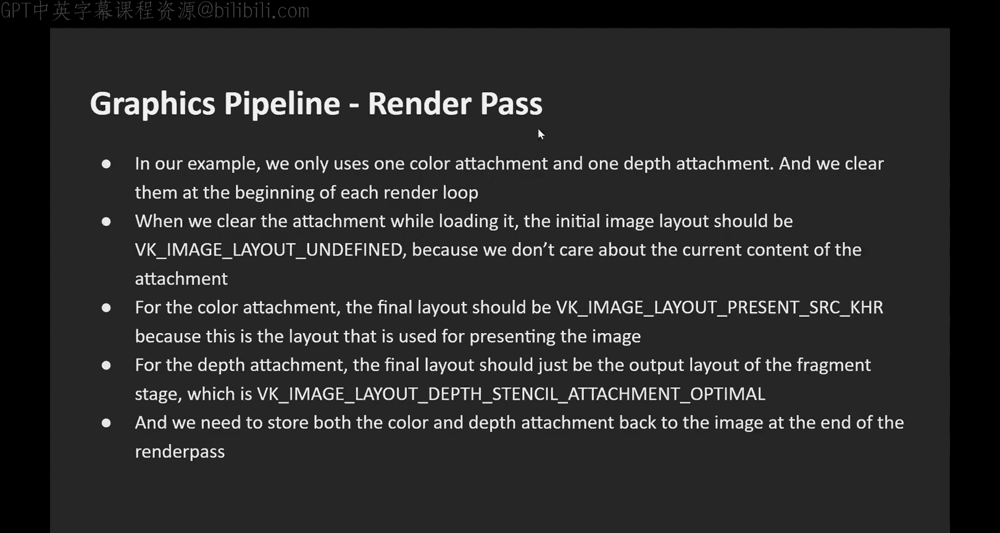

Okay， where are we right now。O。Okay， well only a few slides。

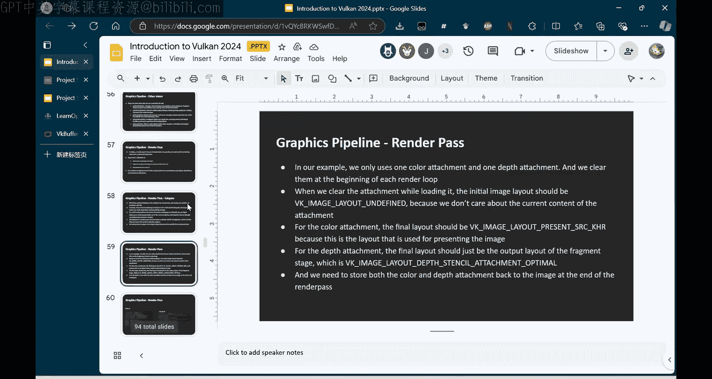

Yeah， there's another to do in this chapter， which。

Because we have talked about render path to let you specify the what you want to do with this attachment。

 so。In our example， we， we will need to clear the the color and also the。No，我 we don't need to呃。

Yeah yeah， we need to clear the attachment because we're like getting the image from the swapwa chain and we need to like clear it after like each render loop。

 so。And also for the depth attachment， we need to also clear it。

And also we also need to like convert the layout from some undefined layout to our desired layout。

So there's another to do for this， which is。Which is the two attachments of the graphics pipeline。

Were graphics render paths。 The first is that we。Are using this。

Some image from swaing and we need to clear it before where we are loading it。

 and also we need to store it back because we want this image to be present to the screen。

And the initial layout is undefined because we don't care it is。

 We won't just want to clear it because we are loading on clear。 So this is undefined。

 And also the final layout should be like a。Desir for presentation。

 so we set this layout for to BK image layout presents towardss KHR。And。For the depth of Hashman。Our。

Load operation is also clear， because for。哦。Yeah。Yeah， actually。

 we don't care actually because we are only， because we are only drawing like a full screen pass。

 actually， we don't care。We don't we don't actually need the depth attachment in this pass。

 and this is something like from a common base code because other other example need this like depth attachment。

 but our full screen pass actually don't need this like depth attachment so。We can。Yeah。

 we can just ignore this depth attachment。嗯。Yeah， and this。

 this is how you create a render path with all the attachment info and also the surpas info。And also。

 we need the dependency of the surpa， which which is the synchronization topic for later。嗯。Yeah。

 frame buffer， frame buffer when you have image views。That's not enough for your render pass to use。

 you need to specify a frame buffer to make it usefulable for the render pass。You can。

Because it references V image views so you can like specify。

 can you can put in like different image views into the frame buffer so it can be used by the render pass。

And lastly， I think this is a pipeline layout。Yeah。

 pipeline layout is basically just combines all of the。

Descript precise size layout that this pipeline is going to use。Also。

 there will be there can be some like optional push constants that can define like a very tiny block of data that can be sent to the shader on the fly without like other complex binding。

So， now we can。Create this pipeline layout with。Some with all of the graph with with all of the。

Descriptors at odd。Here we only have one because we only use one descript set and we just pass the pointer to this chunk of data and specify the number to be one。

And we can use a VT create pipeline layout to actually create the pipeline layout。

And this is push constant。 It will not be used in this example， but it is like a very useful。

 so you can。Lcate by yourself afterwards。And after that， we only。

 we now have like all the information we need to create a graphics pipeline so we can pass all of the previously defined structures into this。

And into another new structure， and we can now create a pipeline。And yeah。

This is a graphic side plan。 And it is like， I think it's super complicated to create。And。Next。

when we're looking like a compute and retention pipeline。

 things will be like become much much easier。 We only need to specify the shader。And also the layout。

 that's pretty much of it。Yeah。Yeah， and yeah， that's it for today。

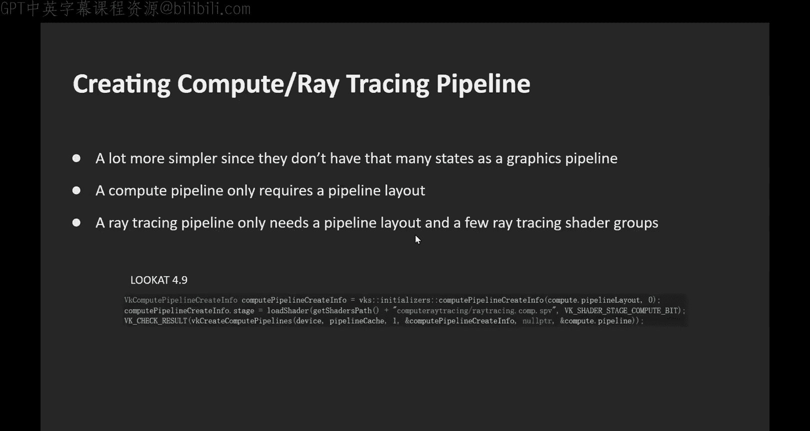

Yeah， I hope like at least like you understand something of it， but if， if you're not。

 like you can just go where all the slides where。Let's go go over the recording afterwards。系啊，下俾开钟。

Thanks。

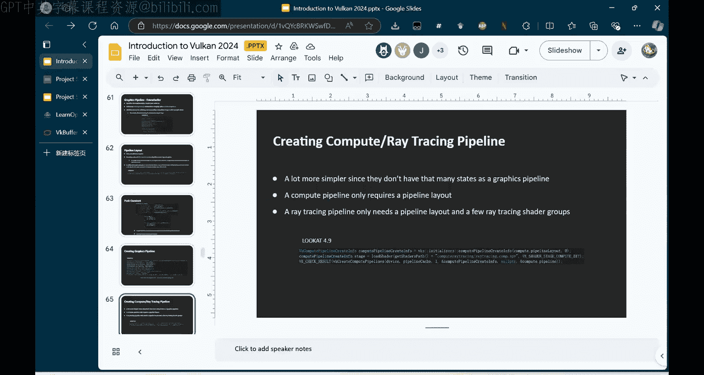

Yeah。