# GPU编程与架构：第12讲：高级CUDA概念 🚀


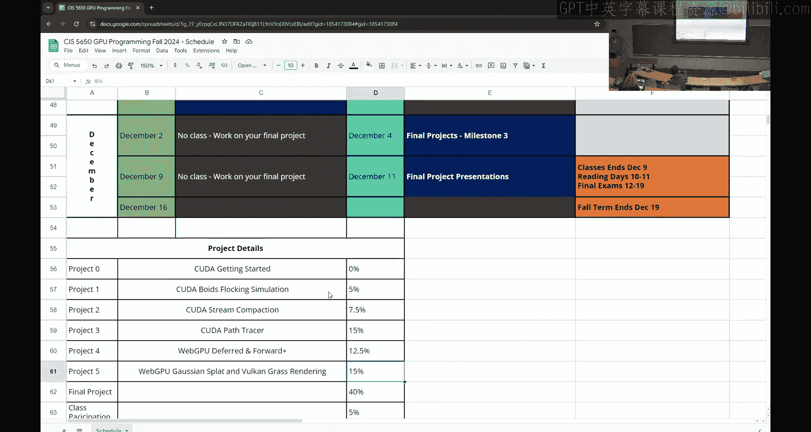

在本节课中，我们将学习CUDA编程中的几个高级概念，包括原子函数、线程束（Warp）函数、动态并行、独立线程调度以及协作组。这些工具可以帮助我们编写更高效、更复杂的GPU程序。


---

## 原子函数 ⚛️

上一节我们讨论了流和事件，本节我们来看看原子函数。在并行编程中，有时需要确保对同一内存地址的操作是串行化的，以避免数据竞争。原子操作就是为此设计的。

### 原子操作的必要性

考虑以下代码片段在设备内核中的执行：
```cuda
int count = 0;
count = count + 1; // 由多个线程并行执行
```
由于多个线程可能同时读取和写入`count`，最终结果是不确定的，可能在1到线程数之间。为了确保每个线程都能正确地将`count`递增1，我们需要使用原子操作。

CUDA提供了内置的原子函数，例如`atomicAdd`：
```cuda
atomicAdd(&count, 1); // 原子地将count增加1
```
当使用这样的原子操作时，任何试图访问`count`的线程都必须等待当前操作完成，这可能导致严重的性能下降，因为操作本质上变成了串行。

### 原子操作的实现原理

虽然CUDA提供了内置原子函数，但理解其原理有助于构建更复杂的操作。一个简单的、基于锁的原子加操作实现可能如下：
```cuda
__device__ int atomicAdd_locked(int* address, int val) {
    int old;
    bool lock_success = false;
    while (!lock_success) {
        lock_success = lock(address); // 假设的锁API
        if (lock_success) {
            old = *address;
            *address = old + val;
            unlock(address);
        }
    }
    return old;
}
```
这种方式会导致线程在锁上循环等待，造成线程束内线程的串行执行和性能损失。

一种更高效的方式是使用“比较并交换”原语`atomicCAS`，它无需显式锁：
```cuda
__device__ int atomicAdd_cas(int* address, int val) {
    int old = *address;
    int assumed;
    do {
        assumed = old;
        old = atomicCAS(address, assumed, assumed + val);
    } while (assumed != old);
    return old;
}
```
`atomicCAS`比较`address`处的当前值是否等于`assumed`，如果相等，则将其替换为`assumed + val`。每个线程可以基于自己读取的旧值进行尝试，减少了线程的显式等待，但核心操作仍然是串行的。

### 原子函数的类型与使用建议

CUDA提供了多种作用域的原子函数：
*   `atomicAdd`：设备级原子操作。
*   `atomicAdd_system`：系统级原子操作（CPU与GPU之间）。
*   `atomicAdd_block`：块级原子操作。

使用原子函数的建议：
*   **谨慎使用**：原子操作会序列化内存访问，严重影响性能。
*   **作用域最小化**：优先使用寄存器或共享内存上的原子操作，避免在全局内存上使用。
*   **作为构建块**：使用内置原子函数来构建更复杂的同步逻辑。
*   **应用场景**：例如，在并行归约中，跨块的最终结果累加可以使用原子操作来完成。

---

## 线程束（Warp）函数 🔀

线程束函数允许线程束内的线程直接交换寄存器中的数据，无需通过共享内存，从而获得极高的性能。

### 线程束表决函数

这些函数对线程束内所有线程的谓词（条件）进行归约操作。

以下是主要的表决函数：
*   `__all(predicate)`：如果线程束内所有**活跃线程**的谓词都为真，则返回1，否则返回0。
*   `__any(predicate)`：如果线程束内任何**活跃线程**的谓词为真，则返回1，否则返回0。
*   `__ballot(predicate)`：返回一个32位无符号整数，其中每个位对应一个线程（0-31）。如果对应线程的谓词为真且线程活跃，则该位设置为1。

`__ballot`函数非常强大，例如，可以用于统计活跃线程数，或在流压缩中判断是否整个线程束都已退出，以便提前终止执行。

### 线程束洗牌函数

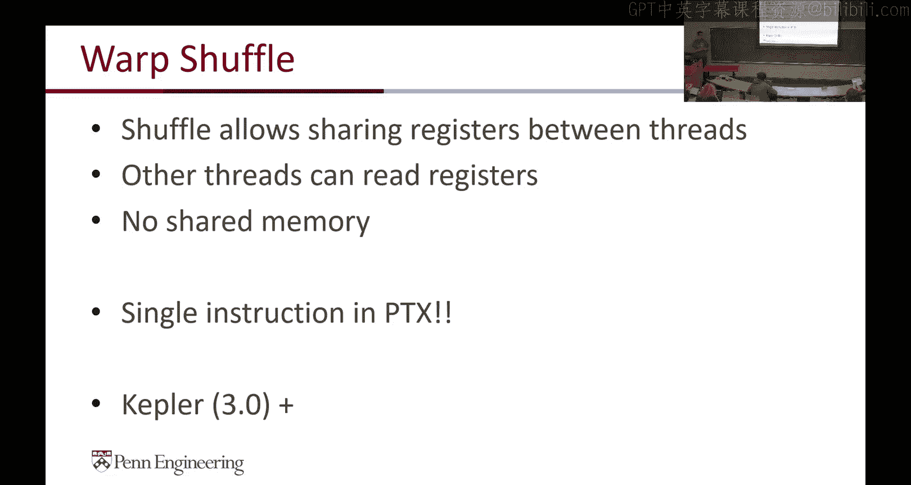

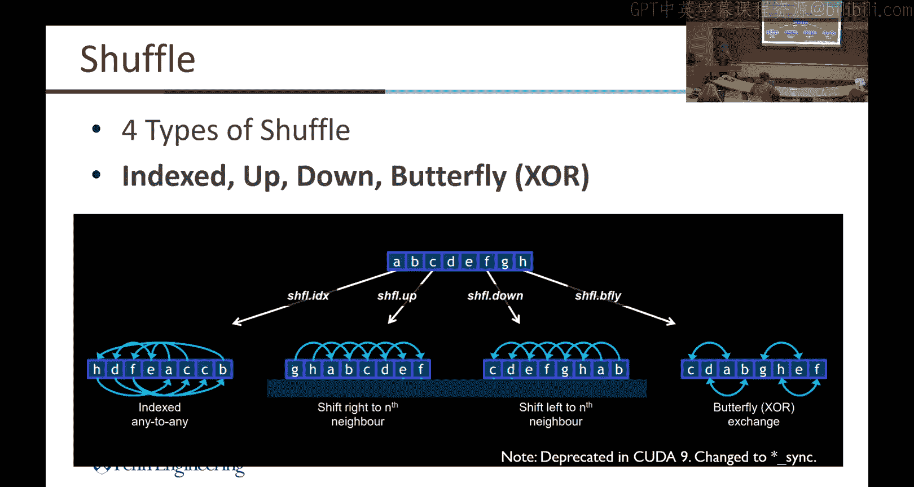

洗牌函数允许线程束内的线程直接交换寄存器中的值。

以下是四种洗牌类型：
1.  **索引洗牌** `__shfl(var, src_lane)`：从指定源车道`src_lane`的线程获取`var`的值。
2.  **向上洗牌** `__shfl_up(var, delta)`：从车道号比当前线程小`delta`的线程获取`var`的值。对于前`delta`个线程，结果未定义。
3.  **向下洗牌** `__shfl_down(var, delta)`：从车道号比当前线程大`delta`的线程获取`var`的值。对于后`delta`个线程，结果未定义。
4.  **异或洗牌** `__shfl_xor(var, lane_mask)`：从车道号为`(lane_id ^ lane_mask)`的线程获取`var`的值。这对于实现蝴蝶交换模式非常有用。

洗牌操作是单指令、无需同步、且不依赖共享内存，速度极快。

### 洗牌函数的应用：归约优化

在并行归约中，最后一步通常在线程束内进行。传统方法使用共享内存，但利用洗牌函数可以完全在寄存器中完成，从而提升性能。

传统共享内存方式：
```cuda
// 假设 warpSize = 32
volatile float* smem = shared;
int lane = threadIdx.x % warpSize;
int wid = threadIdx.x / warpSize;
smem[threadIdx.x] = value;
__syncthreads();
for (int offset = 16; offset > 0; offset /= 2) {
    if (lane < offset) {
        smem[threadIdx.x] += smem[threadIdx.x + offset];
    }
    __syncthreads();
}
```
使用洗牌函数优化：
```cuda
int lane = threadIdx.x % warpSize;
int wid = threadIdx.x / warpSize;
for (int offset = 16; offset > 0; offset /= 2) {
    value += __shfl_down_sync(0xffffffff, value, offset);
}
```
通过洗牌，我们消除了共享内存的访问和同步操作，所有数据交换都在寄存器中完成，显著提高了性能。

---

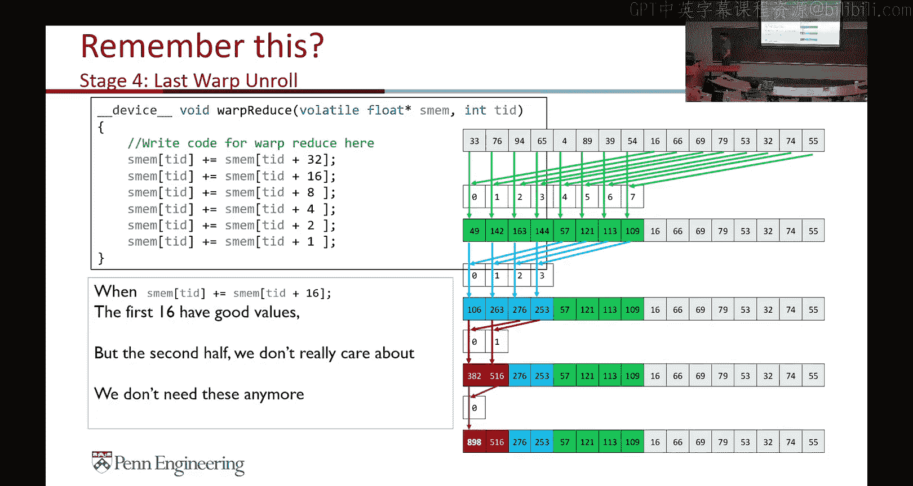


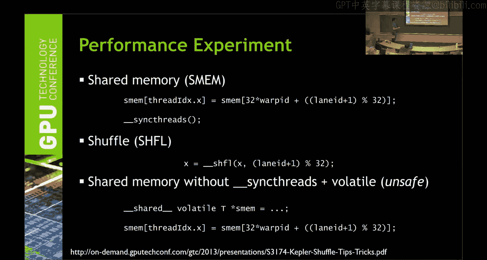

## 动态并行 🌳

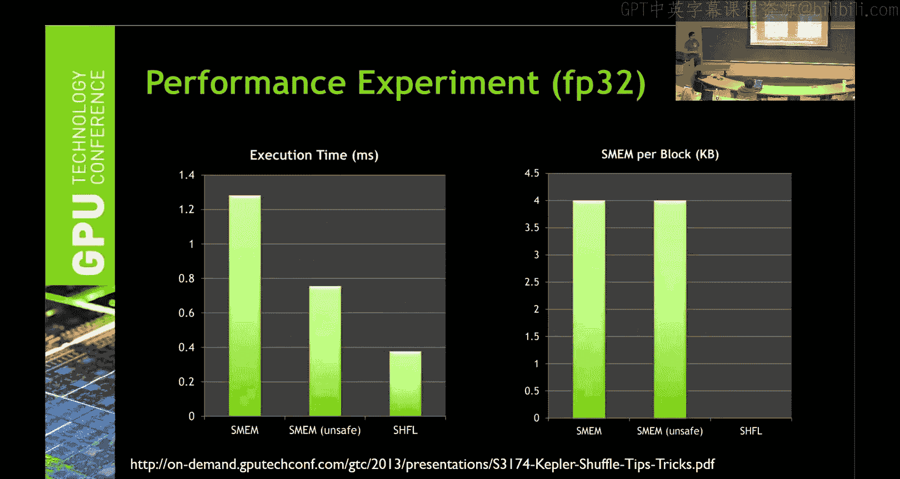

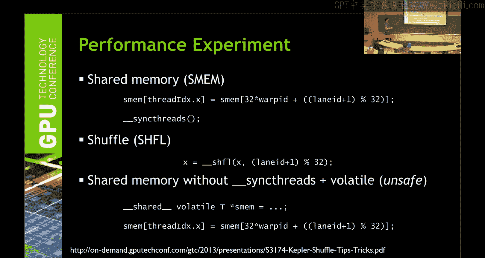

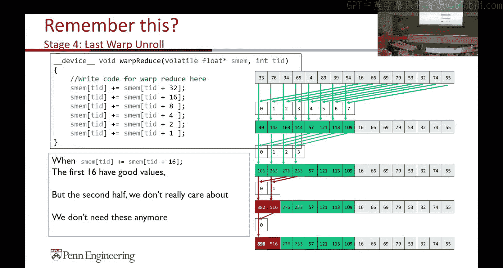

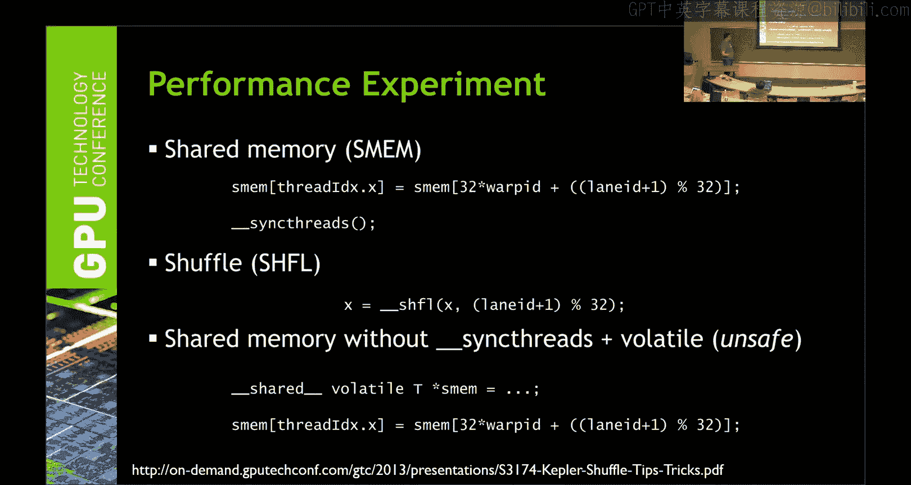

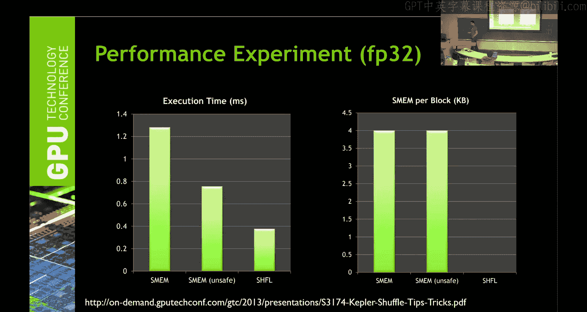

动态并行是CUDA的一项高级功能，允许内核在GPU上动态启动新的子内核，而无需返回CPU主机端。

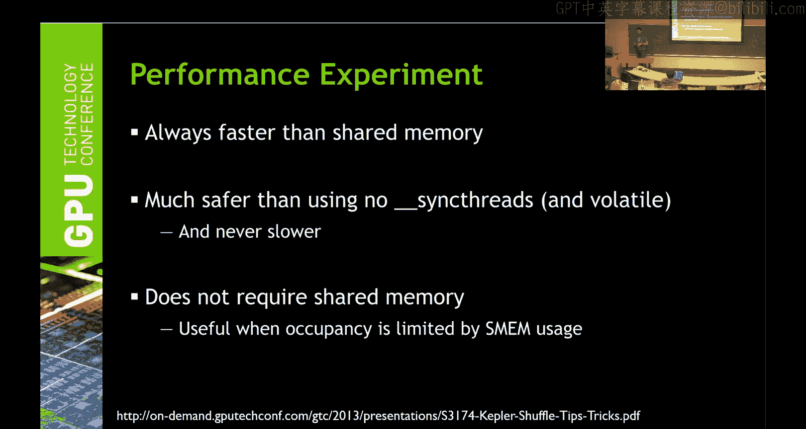

### 核心概念

*   **父子关系**：启动新内核的线程成为父线程，新启动的内核是子内核。父内核会隐式等待所有子内核完成后才继续执行。
*   **数据可见性**：子内核继承父内核的全局内存和常量内存视图。但子内核的局部内存和寄存器对父内核不可见。
*   **流与事件**：动态并行同样支持流和事件来管理依赖关系和并发。

### 示例与用途

一个简单的动态并行示例：
```cuda
__global__ void parent_kernel() {
    if (threadIdx.x == 0) {
        child_kernel<<<1, 128>>>();
        cudaDeviceSynchronize(); // 等待子内核
    }
    // ... 父内核其他代码
}
```
动态并行的典型用途包括实现递归算法（如递归归约），它可以使代码更清晰，但并不会自动增加硬件并发度，且需要注意父子内核间的数据传递（主要通过全局内存）。

---

## 独立线程调度与协作组 🤝

随着Volta及更新架构的出现，CUDA的线程调度模型和同步机制变得更加灵活。

### 独立线程调度

在旧架构中，线程束是调度的基本单位，线程束内的32个线程以锁步方式执行同一指令（处理分支时会有部分线程停用）。独立线程调度允许线程束内的线程更独立地被调度，减少了线程束内部分线程因分支或长延迟操作而导致的空闲，更好地隐藏了延迟。

为了配合此特性，CUDA引入了：
*   `__syncwarp()`：同步线程束内的线程。
*   `__activemask()`：返回一个掩码，指示当前哪些线程是活跃的。
*   线程束函数需要显式指定同步掩码，例如`__shfl_sync(mask, var, src_lane)`。

### 协作组

协作组是一个更灵活、可扩展的线程同步和协作编程模型。它允许开发者定义任意大小的线程组（可以跨块）并进行同步。

协作组提供了不同层次的抽象：
*   **隐式组**：如`this_thread_block()`（当前线程块）、`this_grid()`（当前网格）。
*   **显式组**：可以从隐式组中划分出来，例如：
    ```cuda
    cg::thread_block tb = cg::this_thread_block();
    cg::thread_block_tile<32> tile32 = cg::tiled_partition<32>(tb); // 将块划分为32线程的片
    cg::thread_block_tile<4> tile4 = cg::tiled_partition<4>(tb); // 将块划分为4线程的片
    ```
*   **集体操作**：协作组支持丰富的集体操作，如`sync()`、`memcpy_async`、`reduce`、`broadcast`等，这些操作可以应用于自定义的线程组上。

协作组的优势在于其**模块化**和**可扩展性**。它允许更精细的线程控制，并为未来在多GPU系统上编写可扩展程序提供了更好的抽象。

---

## 总结 📚

本节课我们一起学习了CUDA编程中的多个高级主题：
1.  **原子函数**：用于实现安全的并发内存访问，但需谨慎使用以避免性能瓶颈。
2.  **线程束函数**：包括表决和洗牌函数，实现了线程束内寄存器级别的高效数据交换与通信，是性能优化的利器。
3.  **动态并行**：允许内核启动子内核，简化了某些递归算法的实现。
4.  **独立线程调度**：现代GPU架构的特性，允许更灵活的线程束内调度，需要配合新的同步原语使用。
5.  **协作组**：提供了一个灵活、可扩展的线程分组与同步模型，支持更复杂的并行模式。

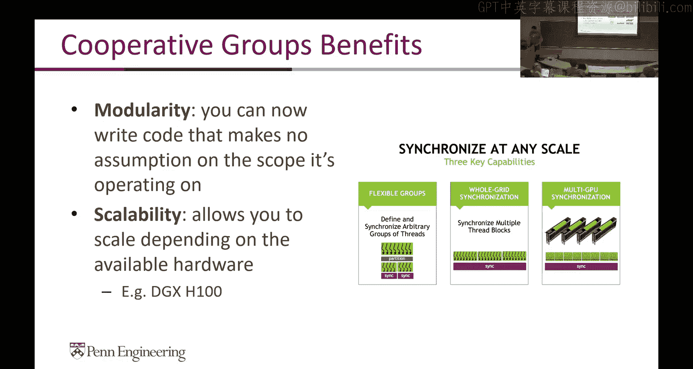

这些高级概念为你提供了更强大的工具来优化和设计复杂的GPU程序。在最终项目中，合理运用这些技术可以帮助你实现更高的性能和更优雅的代码结构。