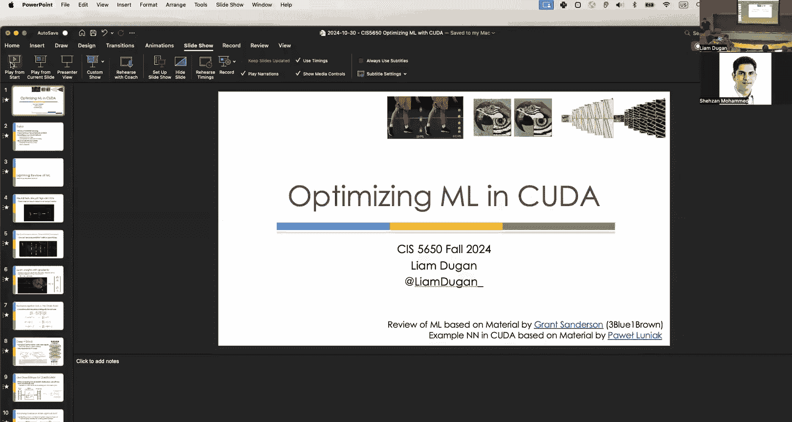
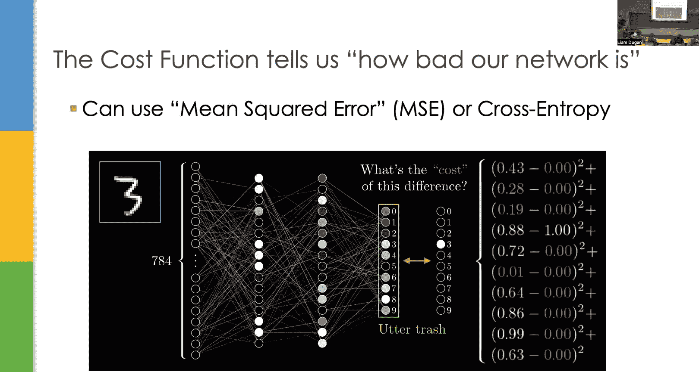
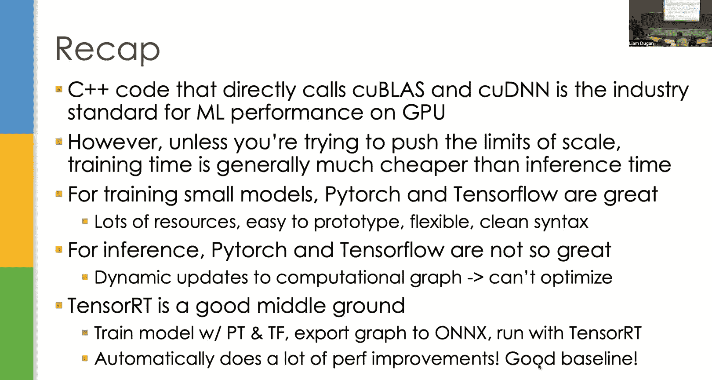

# uPenn《GPU编程和框架｜CIS 5650 GPU Programming and Architecture Fall 2024》中英（Claude-3.5 p21 2024-10-30 - CIS 5650 GPU Programming Fall 2024 Guest Lecture 5.zh_en -BV1sRtresE67_p21-

Okay， so I'll test my audio to see if you can hear can you hear。

variable variable rechaing can be done wait'All right。😊。

Work。So。Let's get started。So today's lecture is going to be a lot more。I guess what's the right word。

 let's say grindy than the previous lecture because we're going to be going through neural network optimizations in Kutuda directly and I'm actually going be walking you through the code for a neural network in Kuda so there's going to be a lot of code on the slides for the first half in the second half will relax a bit more and sort of talk it a little bit higher level but I always feel like I have to preface this first half of the lecture because this is probably the most like in the weeds part of either of the two lectures and I think it's really necessary just primarily because a lot of people don't really open up the black box of like machine learning implementation they like use pi Toch or they use other libraries but they never actually see like how would I directly implement this and how would I optimize it under the hood and then I'll talk a little bit more about when we get into the code what optimizations you can immediately see from the code that we have and then yeah we'll go from there。

Cool， so。Like I said， the first bit review of machine learning。

 second bit is directly implementing a neural net in coUudDa and then the second half is going to be at a higher level like what are the ways we can speed up our neural network optimization using KUDa and then some linear algebra subroutines and then going beyond talking about hightorch and tensorflow finally and other things you can use to optimize those networks。

Okay。So the lightning review of an already pretty fast review of machine learning so first off neural networks are just simple high dimensional functions they take an input vector and。

Have a function that's parameterized by tons of weights and biases and then output another vector。

In order to train a neural network， we have to introduce this concept of a cost function that tells us how bad our network is for a given input。

 this can be either a mean squared error or cross entropy depending on the task。

And then using that cost function， we learn all of our parameters by doing gradient descent。

 which is iteratively stepping in the direction of the negative gradient of the cost function。

So the way that we update the weights using the gradientss called back propagation。

 it's literally just the chain rule， we calculate the partial derivatives starting with the very last layer and working backwards all the way up through the network to get the derivatives with respect to the first few parameters。

 we typically call this a backward pass a forward pass is the initial prediction and the backward pass is calculating the gradients backwards。

And so improvements to neural nets the main thing is just add more depth。

 this is the deep in deep learning and this is very expensive but it works very well。Finally。

 a few of the optimizations we talked about when doing classification use cross entropy loss。

And don't use sigmoid as your nonlinearity instead use relu or other sort of activation functions that get rid of the vanishing gradient。

 which allows for much faster back propagation。When doing steps with our optimizer we use adaptive momentum。

 which is not only adding momentum to each gradient update but also paying more attention to rarer features and giving those a much higher boost and then of course don't forget to pick a good learning rate one thing I forgot to mention is even though we have this fancy optimizer we still have to at the end of the day just pick a learning rate there's no way to learn a learning rate there never will be。

The other thing we talked about is convolutions， so these are really really great for images。

 these take advantage of translational invaris and they can save you a lot of parameters when optimizing for classification tasks on images。

 we also run max pooling to further reduce the dimensionality of our filter outputs。😊。

And so a CNN or convolutional neural network is basically just a sequence of convolutional layers followed by a sequence of the traditional linear layers。

 and these deep convolutional neural nets work really well on images。Okay。

Convolutional neural nets can learn filters for really high level features。

 so in the first few layers we have sort of low level features and then as we get deeper and deeper we can compound the layers so that by the end we're learning filters for high dimensional high level features。

And the whole point is that we use different architectures when doing machine learning to exploit some sort of symmetry。

 some sort of property of our input or task there's a lot of different neural network variants。

 one of them is a recurrent neural network for speech。😊，Sequence tasks， I should say。

 can use for speech， transformer networks， generative adversarial networks， et cetera。

 but all of them take advantage of some sort of property of the input that we want to preserve。

And then finally CNNNs can be used for many different tasks。

 we talked about this at the very end yes of Monday's lecture。

 but you can apply CNNs to a lot of tasks that are really important for graphics such as image denoing and resolution upscaling and that you should really make sure to pay attention when you can generate as much data as you want because those sorts of tasks are ripe for training a machine learning model。

Okay， are there any questions on the material from Monday go something I' was curious about let's say you have a CNN trained on like said images of an animal like a or y and then you after it's trained to give it animal seed。

 which is not in the training set just completely of an animal is there any meaning like if it classifies it as something like is it can you say like oh well animals E therefore most resembles something from this training set or in the meeting class。

Maybe。I think it depends， I would say you would have to look at which specific filters we're activating。

Oftentimes the way that we visualize these filters is by looking at the input that makes them the most active so on the far right you'll see like the goose filter。

 the honeycomb filter ETC right if I have like some variant of some species of duck。

 let's say but it's not in my training set but I test on it and then I classify it as a goose and then I see that the goose filter is really really highly has really high weight then you can probably reasonably say like I see the network thinks this is a goose because it's closely resembles a goose。

That being said， if I had like， I don't know， a tree and everything I've ever looked at as an animal。

 it might get some like some small but non-zero activation from every filter and then the network will just pick basically a class at what in essence is random and so I don't think that it's fair to say for that case that like a yes。

 tree is most similar to like automobile or like you know whatever animal at the site let's say giraffe。

Cool， is that。 any other questions on？On Monday's lecture。Okay， if not。

 we'll start getting into the weeds。So how do we actually write a neural network in KUuda？

So for our neural network， we first have to define what our task is and I'm going to give the simplest yet most illustrative task there is。

 which is given。A set of coordinates of a point x comm a Y predict whether it's in the first and third quadrant or in the second and fourth quadrant this is another classic task in machine learning and the reason is related to my question the very first question in order to solve this task can we solve it。

As a linear function， AKA is the solution slable by like something like Ax plus BY greater than or equal to C。

Why is that？You want to go？Yeah， they just sort of just visually there is no line dividing the two different sets from our。

 Yeah， exactly that's exactly how I would have explained it where if you take a line。

 you cannot separate the two sets of points if they were not opposite quadrants。

 you would be able to do that But since you can't， this is not a linear function Thus a single layer neural network couldn't possibly learn the correct answer to this function no matter how much training we gave it because it's a linear function you cannot learn nonlinearities with one layer。

 And so this necessitates us having two layers with a nonlinearity in between and it turns out that with that now it's possible to learn the function。

Is that clear to everyone？This actually was the example in the 1950s that people used to prove that single layer layer neural networks couldn't just learn anything like the original iteration of machine learning was built by the Navy it was called the perceptron。

 but it was just one layer， they would just learn the matrix weights and then a paper came out that just said you can't learn this task and this is a very basic task so in fact。

 you know these neural networks aren't all what they're cracked up to be。

 turns out that you know in the future they were wrong， but for other reasons。

そ in other words are you saying that。Deterministic task that can be done algorithmically rather than learned。

Is is akin to a single layer neural network or better than a single layer here I don't know how to frame that part of it no it's not that it's not that。

It's a good point， it's not that all like deterministic algorithmic tasks are equivalent to single layer neural networks because for example。

 like how about I'll kick the question off to everybody what function would solve this task？Yeah。

 say again yeah XO so if you just applied XO you'd immediately solve this task that's algorithmic that's totally fine。

 but it's just nonlinear so there's a distinction between like what is like a deterministic solvable task in code and then what is a solvable like task in linear space。

Neural networks also can solve things that aren't immediately。Implementable by code。

 like if you had to write code to detect a bunny， like that would be very difficult。

But I'm giving this as a sort of toy example。So what is our input dimension and then what's our output dimension for this task？

Anyone at all。嗯。😊，Yeah， exactly， and what is the output space？

Yeah exactly perfect and we always have to think about dimensionality here because like I said on Monday if your dimensionality gets too big it like seriously constrains what sort of neural networks you're going to want to learn like when we talked about image classification a simple two layer neural net had or actually it was just one layer had 196 million parameters because our input dimension was too large and our output dimension was too large in this case we're totally fine with linear because it's two and one okay cool。

😊，So here's the neural net architecture that we're going to go with， we have linear layer。

 Reello linear layer， and then at the end sigmoid。Why aren't we using a softmax here at the very end and just sigmoid？

等会儿。The 01 classification like having two different minus Yeah exactly so sigmoid and softm are equivalent in two dimensions。

Or sorry， in a singular dimension， I should say， since our output is one dimension。

 then we don't have to care， it just cls between zero and one。

Everyone good and then our loss function is cross entropy loss but it's just binary。

 so since we have one output we have y which just the output and then one minus y as the opposite of the output。

So。We are going to be using stochastic mini batch gradient descent。

 which as a review means that we sample M inputs from a generator and then we run gradient descent on all of them at the same time and we do this all in parallel to make training go much faster。

Our dimension of the input is two， but if we sample M mini batches， we have。

2 by m input right so that's the actual dimension of our input would be a  two by M matrix where m is the number of our input points and then we need to compute the loss for all of the examples in parallels that'll be n by one and then we'll back propagate for all of those Ms in parallel and then average the gradients。

Okay so what classes do we need first off we need a matrix class this is also really useful just to store the weights and the biases and the activations and the gradients we need the actual layers so we need sigmoid we need re we need linear layer and then we need a cost function BCE cost binary cross entropy。

😊，I kind of gave you all the answer to this question。

 but the reason why we're making classes for all of these inputs or for all of these things is because we want to be able to store the gradients as we're computing them in order to do back propagation。

 you need to have the gradient from the previous layer to multiply to your current gradient and if we don't have classes it's much more difficult to store all that information。

So。We're going to start to get into actual C++ Ka code。U。So a high level overview。

 this is the forward pass of the entire neuralNe class。For each layer。

We just pass the input matrix through all of the layers。

 so we call Xz because Z is usually used as input it's just convention and then for each layer we take the layer do the forward pass and then set it to Z。

All the way down。And then at the very end， we're going to compute the cost and then pass it back through the layers。

So。I'll pass this question off to the class。re any possible race conditions here？S owe one nod。

Does anyone want to try to guess what the race condition here？Yes。You afraid that's the guess。

 but I guess like if the if the layer is。Harway through like changing like back propagation or something that like you know。

Inside your Hollywood。Especially it's particularly in step three。

 right as we're passing the cost vector back through the layers。

If we're updating the weights along the way here， those weights actually change what the gradient is because as you're computing back propagation it's the weight times activations and therefore the derivative is the weights。

 so if I update the weights and then I go to compute the gradient I'm going to get a different result so we need to make sure that as we're going we do a sync threads before every time we update the weights so that we don't have other threads reading in weights that have been updated by the back propagation right so if we're doing all 32 in parallel we're updating all of the weights for all of the examples。

好。All right so now let's step through the coDa code it's not important to understand literally every single line of the code i'm going to give you like sort of a more broad overview if you're curious these slides will be up somewhere public I assume and I highly encourage you to just download the code run it yourself and then step through the example okay。

So first things first a matrix class， the key points for this class is that the way that we do allocation is we typically have a Boolean variable and this keeps track of whether this matrix is allocated on the device or on the host host being CPU usually devices usually GPU and then we have both the host and device pointers in the same class this is common practice for almost all machine learning libraries and I'm going to answer the why and the why is because we like to do just in time allocation of our resources so when we load a really big model and we do one pass through we only want to have to instantiate the memory that we need right now。

And so typically。A lot of these classes also have space for the gradients。So when you do backwards。

 you want to instantiate all of the space for the gradients as well。In essence。

When we have these pointers。We can say that oh， this is not allocated but the class exists。

 and then once we go to use it for the first time we just check if it's allocated and if not we create space for it。

You couple questions here， from a programming paradigm perspective。

 how common is it to use something like unified memory and stuff from QUDa in ML？

I if by unified memory， you mean shared memory or do you mean like， no。

 I mean could a unified memory， which kind of abstracts away hosting device pointers from you？

I imagine that it's common， I'm running through this as more of a toy example to stop doing this。

CanCan you speak about best practices around allocate memory， I imagine were probably allocating。

Pows of two and giving some variable length and yeah exactly that's actually going to be in the next part of the lecture for sure。

Okay。So really quickly just to recall our naming convention， the activation layer。

 the inputs are the z's and the outputs of the A's， so Z's and then A' is for activation backwards。

 we obviously take the derivative with respect to the outputs of the activation layer and use them to get the derivative with respect to the inputs。

😊，Likewise， with the linear layer， the inputs of the activations of the outputs are disease。Okay。

So this is the parent class for a layer， we have to define a forward function and a backwards function。

 the forward function would take in A and then output your Z and the back prop takes in DZ and outputs the A。

Sigmoid class inherits from the neural network layer parent class and just reimples this forward in backdrop function。

Here's the sort of host function， not the kernel。It basically checks if the memory is allocated。

 if so allocates it and then calls the sigmoid activation forward kernel。

And then likewise for the backwards function checks if the memory is allocated。

 if not allocates it and then calls the back kernel from this point forward I'll be omitting all of these host functions。

 but just know for all of the kernels we go over， this is the general structure。😊。

Very simple okay so sigmoid forward kernel is just about as simple as it gets it's an element wise function so it's inherently embarrassingly parallel we just have a device function that just implements sigmoid and then we index into the matrix and then update sigmoid of Z is a。

Got it cool。The back kernel is similarly extremely easy because it's element wise and the derivative of sigmoid is in fact。

 sigmoid times 1 minus sigmoid。😊，So we don't even have to implement undue device function。

 we can just literally call the same sigmoid function again and we get the correct output。Okay。

 this is the easiest one。Actually， all lied rarely is the easiest one。😊。

So we have F max F with your assessed float max， and we take the max between z and zero and then for our backwards。

😊，Same thing。Usually we want to avoid if statements in kernels but。

This one is perfectly fine because both of these lines are basically just the same thing。

Taking memory and putting it somewhere else。Okay。So now we get to the linear layer class。

This one is the one that has a little bit more heft to it。We define forward backward function。

 same things as always， we implement these get weights matrix and get bias vector。

 they're just standard getters and that's useful when doing the actual full back propagation。Okay。So。

Same thing as before， we just allocate memory if it's not allocated and then call the linear layer forward kernel。

And here's the For kernel， okay。So。For each thread。We find row and column。

And then we do a dot product， so we loop over all of the indices of the row and column and then compute the dot product and then put it into the matrix。

I don't want to foreshadow some optimizations that we'll make too quickly， but。

Sharp eyed students can notice a few things that we might want to change about this implementation。

 especially if you paid attention in the matrix multiplication optimization lecture。Yep， yep， well。

 Cheson instantly sees it， right？😊，This is a toy example。

 right I use it almost because of these things that you can quickly change， you know。😊，Oh。

Does anyone want to。Take a shot at pointing it out。No pressure， if not， we'll get to it。

I assume most people IYeah， yeah yeah， they may have't afraid to say it， okay in that case。

 we'll go forward， but if you have the answer in your head and you later find out that you're right。

 you can be proud of yourself。Okay。So oh wait actually， one more important thing。

So is it possible to do this without the for loop here？Does the extend block size？

Xt is it's the size of the weight matrix， so it can be bigger than the box size， yeah。So like。

Theoretically， you could do like atomic a for all of this。It's not worth it。

 it's much better to just loop over it， it's fine also because you're reading if you do your memory correctly you just read one contiguous thing of memory so it's quite fast。

However， for other functions in the future， we will be using Atomic a。All right。

The actual linear layer backprop code is just first we compute and we store the back error。

 then we update the bias update the weights this is of course doing the gradient updates so we get the error like compute the derivative。

 update the biases， update the weights it doesn't really matter which order we do bias weights。

 but it's important that we do them in separate kernels。

Okay so when computing the actual derivative we need to do three different derivatives。

 one for the weights， one for the biases and one for the inputs because we have to pass it on to the layer before us in the very first iteration of this lecture I attempted to just derive these equations directly on the board it's not that important that I go do that I feel like I lost most people when I went to do that if you want to drive them yourself feel free to they're just the basic derivatives they're all linear it's just with matrix math derivatives get a little bit more like annoying。

嗯。Just as a reminder， M is the number of batches here。Okay。不 so。

This is us computing the derivative for the layer before us， the DA。

 the derivative of the activations of the previous layer。

 same exact structure except instead of the weight matrix， we do transposeive weight。过。

And then the linear layer update weights is the same thing now。One thing I want to note is。

That when we do this dot product， we're doing DZ times a transpose and then when we get the full dot product。

 we're actually directly updating the weights here now before I was saying that when you're updating the weights。

 there might be a race condition。But the race condition only happens if you're updating the weights while other threads are calculating the gradients still。

 because if you update the weights， the weights will change what the gradients are。Over here。

We first compute the gradients and then we update the weights afterwards。

 so there shouldn't be any race conditions because we've already used all of the weights。Okay。

Weun clear and then also we have our learning right here and so we're doing。Yeah。

 so Ax dimension is the M， and we do one over that time learning rate。

Cool and then likewise for bias so here's where the atomic ad comes in for whatever reason this implementation instead of just doing a single accumulation in one thread they wanted to multi threadread it and so they have atomic ad over a single thread。

😊，So sorry， I shouldn't say over a single thread， they have many threads computing this one single accumulation。

😊，Probably fine。But。不。I'm sorry。If you've ever done a micro benchmarkch of this。

I don't think I have is it better to atomic ad on a global memory point though you rather calculate within a register and then pass it down I don't know yeah that's a good question I wonder。

I would imagine that。There's probably faster doing another a register and then pass it down。

 but I don't know or it depends on the size right Are you wastings right if you don't get the you don't have to do the right I don't know yet it might depend on your dimensions also of the memory but。

bo。The ratings are competitive in scoring。No， so the forward pass just stores all of the activations for all of the different inputs right so we have to store not just what the weights are。

 but also like what the actual output of each layer was that we know what the activations are。

And then the backwards propagation uses those activations and the weights to calculate the gradients。

Awesome。Okay， so。The last thing we have to talk about is our loss function。

 so here's our binary cross entropy loss， we have cost and then the cost derivative of cost。

The function for the derivative is there if you want to see， I mean。

 derivative of log natural log here is one over， so y over， why hat simple derivative。The Ford Colel。

Does the same atomic ad trick where we go over all of the M different examples。

 we calculate the cost for each of them and then atomic ad cost divided by batch size。

To the domain cost variable。And then likewise， backwards kernel， basically the same thing。懂。

All right。Now that we finished most of the nitty grty stuff， taking one step backwards。

Now we have our neural network class。We have a vector of layers。

 so we have this here get La function that returns a vector of neural network layer pointers。

 and then we have matrix Y and Dy。What do those represent and why do we need them to be in the neural network class？

Why is straightforward， but what's DY？我没嘢。Yeah， the gradient with respect to the final outputs of the neural network。

 right？Yeah， so like。Y is our outputs， and then DY is like the gradient of the cost function with respect to each of the outputs。

And then we have forward pass which should compute the forward pass of all of the layers of the neural net it would literally loop over the layers of the neural net and just do forward forward forward forward and yeah so let's do it。

So this is our forward pass， it's beautiful， I just want everyone to appreciate how beautiful this is。

 right？For each layer， call forward and then return the final output。

Backrop is slightly less beautiful， but only slightly。

 so the first thing here is to note that we have this matrix called error。

And this is the BCE cost function that we defined， and it's the derivative of the cost function。

 we have the outputs and then the true outputs and then DY。

 which is where we save all of the derivative information into。😊，Now this error gets written to。

During our reverse iteration over the layers。Why is error getting written to over and over？

Can and just sleep。In order to do the。That propagation for one layer you have to look at like the error something layer after yeah exactly like every single one of these layers takes in when doing back propagation the gradients from the layer before it and so we have to we're using error over and over and over again to continually remember what the gradients are and then passing it back through back propagation as we go all the way up。

And then finally this coulda device synchronize， I'm not 100% sure why this was necessary。

 I'm not even sure that it is necessary。But to some extent， I think if I had to give a reason。

 it would be so that they made sure that they write everything to all of the weights。

 all of the gradient updates before leaving。Probably not necessary。

 but I guess that's a shaiseison question really more than me。If you think个。

Toho asynchronous nature of quoda that would make sense。嗯。Yeah。It's safer to have it there than me。

Like on some low end GPUs， you may not need high GPUs that you on multiplelycent engines。

 yeah that's a good point。Cool， cool， all right。So finally here's how we are initializing our neural net。

 we first just create the glass and then we add our different layers。

 we have linear layer re linear sigmoid note the shapes here so why。😊。

Do 30 that's a very weird shape we have two as the input to the linear layer and then 30 and 30 and then one two and one makes sense。

But 30 seems kind of odd。So now that you've appreciated how odd that is。

 the reason why we do that is。Machine learning reasons。😊。

Hidden states can be whatever size you want them to be and depending on like the complexity of your function you should make the hidden state larger or smaller。

 obviously larger means that you have more weights。

 but the larger your hidden state is the more different sort of combinations of features you can actually learn and there's a very famous theorem that says that a two- layer neural network with infinite hidden state width can learn any function you want because you can make arbitrarily many combinations of features now obviously 30 is not infinite。

 but we do have to have a pretty sizable hidden dimension in order to learn this X or function because inherently it's just not a linear function。

just wanted to pick up on that so two is import one is out。

How are we making cur like I understand it's arbitrary Okay， it is yeah yeah yeah， it's it's just。

A lot of machine learning is sort of heuristics and a lot of it is like looking at published papers and seeing what they do and then starting from there and then tweaking it to see whether or not 30 is a reasonable choice so totally reasonable and that probably is another good optimization。

I might have asked something like this last time， but I do even know if it's。

 I guess probably a dangerousistic thing again， but like the trade off between more a bigger layer versus more layers。

You never know。Usually so I will say that that。Linear layers n times k right if n is input K is output dimension。

 so if you increase the dimensionality of the output it's like。

The costs grow quadraically because the matrix will just get larger and larger and larger so typically people go for depth rather than width in neural networks。

 but that's not to say like you know like most neural networks have like。

Probably roughly 2000 size hidden dimensions in the interim states， so it's still quite large。Yeah。

 so so the main trade off is like what do you value more accuracy or speed and if you're okay with sacrificing speed for accuracy。

 then you make the hidden dimension larger and larger like a larger hidden dimension is not going to make your accuracy go down the more you add to the network there's more weights likely is going to make your accuracy go up The problem is there's like a sort of。

The engineering tradeoff curves， what you would do in practice if you really。

 really cared about this parameter is that you would try maybe 10 or 15 different values and then graph what the resulting accuracy is and then sort of pick one on like the sort of midpoint that you think is a reasonable value。

 but there's no like theoretical underpinning to what your hidden dimension state should be。哦。

One more thing I want to mention is that there's a bit of a distinction in machine learning between what dimensions of a neural net。

Can literally like what is literally required for a neural net to do the task。

 like technically speaking since we need only two lines。

To do this task you should be able to have a neural net with only dimension2 hidden state because all you need to do is learn two different lines and it's a combination of those two lines problem is that it's actually really hard to do gradient descent to find those two lines when you don't have enough different parameters to try so if you have 30 different potential lines that you're looking for the neural net can try out a lot of different combinations of lines to find out which are the correct ones this is a sort of toy version of the real examples which is of course like you know vastly overparameterized neural nets don't literally need all of their parameters but the more you over parameterameterize the easier it is for the network to learn a good local minimum。

is a way to imagine what you just said is we are trying to find those two axes， right？

Let's take a circle， even though a circle has infinite degrees。

 let's take 360 degrees and in teacher numbers。And if we need to find those two degrees。

 zero degrees and 90 degrees。There could be 300 or 180 times 180 combinations。

 I suppose and trying to find that one magic combination with two lines is very difficult right so we are trying 30 line 30 yeah。

 I think that's a reasonable way of thinking about it。那好。Do after training set neural network。

I'm assuming that you would only have like two nodes that are actually activating so can you just like or like press it yeah you absolutely can and this is a huge subfield of machine learning like optimization is it's called pruning usually where you sort of take a lot of weights that are basically zero always and you just get rid of them we'll talk about that in the sort of back half of the lecture but this is a common optimization that's made。

Okay， cool。So in order to train our neural network。

 luckily we have a task where we can just generate our data again， we have unlimited data。

 right for neural networks， we just create a coordinate data set object and the constructor just generates a data set with 21 batches where each batch contains 100 data points。

All right， so here's the training function， so we have for each batch we just do that neural networkwork。

 forwardward pass on all of the batches and then we back all of the batches and then we accumulate to this cost variable and the only reason why we do that is just so we can print out what the cost is for one pass through all of our data typically in ML parlance one pass through all of the data in your training set is's called an epoC and so we are currently for this function running 100 epoCs and then printing every 100 epochs what the total cost is for all of the batches。

The question I have on the slide here， and you might notice in the for loop。

 why do we loop until batches less than number of batches minus one。

 that means we're only training on 20 batches。What happens to the 21st batch？Yeah， exactly。

 like we need we need something that we haven't trained on in order to actually get the accuracy of our neural net。

Oh。And so next slide we have compute accuracy， this is on the batch that we left out of our training and all we have to do is just do a forward pass and then our output will be the wises and then we can just compute the accuracy with just why。

😊，So no need to do back proagation on the test set。

 like you shouldn't because that would be training。Okay， so putting it all together。

 we see that the cost goes down over all of our epos and if the cost goes down then there you go。

 you're training oftentimes when you're debugging machine learning models。

 the cost just stays the same or potentially goes up or has random fluctuations that's when you know that something is wrong and that the model isn't really learning if you see the cost go down on the training set you usually you're usually in business note that it takes a pretty long time。

For the network to learn the right function and only after roughly epoC 700 does the cost actually start to go down。

 that just means that the neural is like trying out a bunch of different things without a whole lot of direction until it finds one thing and then eventually catches on that that's something good and then there you go another reason that this could potentially be it would take this long is that we're using sigmoid on the outset。

And sigmoid with the wrong initializations has vanisheding gradient problems。

 so we may do hundreds and hundreds of epochs with barely any gradient change because we're all saturated in the sigmoid layer。

Okay， final question to everybody， so at the end of all of this。

 our accuracy is only 93% on this X or task。You'd think that with all of this power and a thousand00 passes through the data。

 like we've seen 20，000 points in training， why haven't we learned the test yet？

Anyone have any intuition？As to why that could possibly be。Somehow stuck and look it doesn't go Yeah。

 totally。准备我。对的好。Right， and so when we're optimizing with gradient descent in this neural net。

 are we using any sort of mechanism to？To go past the point。 and did we talk about any。No。

 but you're absolutely onto something， sure。Not like utilizing yeah exactly right right right so if we get stuck in a local minima there's no way for the gradient to actually just pop us out of local minima and like we talked about on Monday we have things like momentum。

 things like atom adaptive momentum that will help us learn much， much faster。It also seems me like。

If you think about we're looking for basically the x and Y axes。

 can you like offset those by some angle， you like if that's what it ends up guessing is like， oh。

 maybe not quite the X and Y axes like。You might need quite a lot of data points to actually get that really close access because that's a really really important point and that's one of the main ones that I think when I look at this。

 if we don't have points that are right on that line。

 then the neural net is not going to learn the correct boundary lines and importantly if the test set has points that are very close to the line or if we construct a test set that is adversarally difficult like we give it the maximally most difficult test set by giving points that are just barely off of the axes。

 if you don't have enough representation of those areas in training the network's just not going to learn to do that correctly。

There's one more point。I want to make sure it's clear， yeah。Absolutely， yeah， yeah， say more。非是主意的。

You know one starting point you know'll get stuck at the bottom and then maybe move it over over here yeah 100% this could literally just be an unlucky run this could be the one in a0 like we initialized it and all of the weights for like 100 just randomly because we sampled from a Gausian and that can happen and then we're just we're just screwed so running neural nets like multiple times and then averaging would be a good good way to dis sanity check。

So the last thing I want to mention is reminder that I said that an epoC is one pass over the entirety of your training data and we have 20 batches roughly I think 100 points each right so we have 2000 points。

And we take those 2，000 points。And then we train on this exact same 2000 points。A thousand times。はい。

So our network may be overfitting to the specific training data right it may get really high accuracy on the training data because it's the exact same 2000 points but it doesn't have enough data to actually learn the correct function。

 which is basically some variant of what you said since we have a generator we should have just generated brand new data we should never have1000 epos we should have one epoC with 100000 points because we can generate as much data as we want so this is also another thing that's very common when you have not a whole lot of data。

And you sort of oversample， you train on the same data over and over again。

 then the neural networks usually don't get really great as a side note。

 when training large language models you do exactly one epoC。

Because you have all of the text on the web and you have more text than you know what to do with。

 so you just pass over all of it once， never seeing the same text twice。Okay， cool。So。Final recap。

 their own networks are fairly simple to implement in Kuta。

 especially when dealing with just basic linear layers。

 for each type of layer you want to implement all you have to do is just do a forward function and then a back propagation function to compute the derivatives。

😊，For the full neural network forward backward pass。

 you just loop over all of the layers forward and backwards and then when training。

You need to accumulate the total cost over the batch and then print， but otherwise。

 if you've implemented your things correctly， you just have to go forward back a bunch of times。

One more final thing to mention is once you implement a neural network class。

 you can just use the same class over and over again to learn any arbitrary function at any arbitrary depth if any arbitrary size。

 now of course some of the optimizations that you would make need to change based on the size of your memory again we'll get into that but just because you wrote a linear neural net to solve the XO problem you now can solve like handwritten digit recognition with the exact same code so you really only have to write it once。

オ cool。So time to speed up our neural net， time to implement some optimizations。

So this implementation is good， it does parallelize our gradient computation across mini batches。

 it does do parallel dot products， but there are plenty of optimizations to be had。

 one easy way to improve the performance is of course to improve matrix multiply because it's used in virtually every single computation that we're doing both in the forward and backward pass。

I guess now is the time to reintroduce。The memory coalescing optimization。

 so this was the slide that I stopped on earlier in the lecture。

What access pattern is being used here， we are looping over in our indexes I。

Are we doing good practice with memory indexing here？Nope。Where's the problem？

It's like it's keeping by size of like probably rest。Yeah， yeah。

 or we're skipping by size of AX them every time，So if you have coalesced reads。

 obviously much faster than sort of more sporadic reads。

 so very easy optimization is just transpose and then everything's fullless。

That's actually not something I explained in the class but really that specific way of doing it Okay okay matrix multiplication and how to use shared memory to do that。

 but one of the things that nobody asked for and usually nobody ask for is doing matrix multiplication using a transpose so trans to matrix first and then do matrix multiplication to avoid。

so'm glad you' that's good to know maybe I'm like forgetting things from six years ago I don't know we covered it or not but the next slide that I was going to mention is exactly what you just said which is we can also just load things into shared memory and then matrixableply with with the rows and columns and shared memory so another quick optimization obviously if you don't have enough shared memory to load a gigantic weight matrix then it gets a lot more tricky you have to worry about like tiling and stuff but for now。

😊，At least for our neural net， this is a very， very quick optimization。Okay。

 one thing I wanted to point out also， remember last lecture when I talked about Alex Ne。

So Alexnet was the sort of beginning of what a lot of people see as like the rise of deep learning and the reason why is because。

They put the network on the GPU and therefore was able to make it way deeper than any other neural then。

The Alexnet source code。When creating creating this lecture I wanted to see what of these optimizations I could actually find in the source code for AlexNe and so I sort of stepped through it and I found tons。

 so first off the filter function so this is the function that actually runs the convolutional filters so each block applies 32 filters and we have shared memory for both the filters and the images。

We also have。Parallel copying of images and filters。

Uses pragma unroll write are coalescce in the output array you wait to sync threads for all the threads to finish before writing the output image so a lot of the sort of optimizations that you talk about in the optimization lecture are actually implemented here and I was pleasantly surprised to see that。

😊，You know most research code is like okay just do the most basic matrix multiply and then go but this actually was like optimized to heck in order to get it to be the the implementationation that it was those aren going to be some big previous code yeah they're huge oh yeah。

They're also huge in just the amount of lines of code too。好时。

They can be completely adore there's enough registers and stuff in there。Again， you have to。

You have to think beyond the laptop and think about， I think kind。Alex not， at least。Like 2008。

 like you would be thinking a 780 PI which is all laptop process better than a 780 PI， but you know。

 even if you go to 2017， 28 and youre working won' touch GPs and stuff we areize some of us of value。

But before that， you've also had the Tesla lines which were compute only and could do this in the bulk of an。

I think somewhere in this lecture， I have the actual GP that it was run on but。Oh no。

 maybe it was the last lecture。Something before the 1000 series for sure。Okay。Okay， good memory。

Sweet， all right so。So this implementation is great。😊，But can we do even better than this？

So the answer is kind of。If you are writing all of your code directly。

 it's unlikely that you're going to be able to outperform Alex's kernels without knowing exactly what your memory dimension is。

 one thing that might be really useful to instead use is。

What's called a basic linear algebra subroutine so these functions are a standard set of functions for fast matrix operations and they're implemented often by hardware manufacturers on particular machines to take advantage of things like vector registers and SIMD which is single instruction multidata and there are many Bcomputable libraries if you've ever you seen like sort of scientific computing libraries like MATLAb。

 nuPI GLM these are all implemented under the hood by these sort of basic linear algebra subroutines。

So in general there are three levels of blast functions level one is just a vector operations dot product it's called AXPY level two is vector matrix operations so typically they're called gem V generalized matrix vector product and then the final one which is the one that most people often use and talk about is colloquially said。

Coloquially calledG， GEMM generalized matrix multiply。

 and that's a times B plus some C matrix with coefficients。Okay。

 so yeah go sorry'm to me are is this like a specialized hardware produced operations or yeah that's an important question。

 so it's not that there's specialized hardware。Let me put it this way so so this this bossss was like a sort of standard that was accepted and is。

Widely used。From like roughly the 60s or 70s onward and so when you're making a new CPU architecture a GPU architecture you typically have these functions implemented in a specific way because you know that everyone is going to expect you to have these sorts of subroutines implemented really optimally so yeah if you want to talk more on this shows on it so think of b as a standardized API like if you know you use gem。

WithWith certain values that no matter what hardwares you're running on， you will get。

The correct result and the best performance now under the hood iss up to the library its ultimately these are all libraries it's up to the library about how they run it and where they run it so a lot of times you have to decide based on what hardware you have which library you're going to use so on Linuxux for example youll get BL and a similar library to B like FFTW or La class and stuff so you get these libraries that that but if you were let's say on Indtel hardware you'd want the NPL library。

On Ka you want flu+ and so on， which don't necessarily take advantage of hardware。

 but Intel will take advantage of AVX。You vectorize instructions。

So they new like assembly level optimization， essentially into maxim。

So like when when I didn't do this in class， but if you were to。

Measure performance of your glass compared to cool glass。

 you always see that cool glass has that edge over what armever you can。Yeah。

 my understanding is that a lot of it is implemented directly in assembly and that' they're。

 you know， they could save like two or three instructions， it's like a big deal。过。

good to know that the material in the lecture is of it this way。😊，嗯。

We can't even imagine how many machine learning tasks are ongoing on AWS plus Azure plus GCT plus every of machine in the world。

 right？If you save a few instructions every time a MAma is drunk。

 think about how much energy you're saving。It's meaningful'。

Even from a saving the word perspective yeah I don't know how relevant this has been like modern day。

 but like my boss since Amazonung said that like he was working for like like compiler job and the one big optimization he made was like searching for like handswritten versions of matrix multiplying optimization recognizing that and me like oh。

 let's just do the loss optimization for that and they like got like 10% faster and like but other companies out of business because of it。

Yeah， so unfortunately writing all of the matrix multiply and all these kernels yourself like。😊。

You're usually going to get beaten by Bloss I don't know whether or not Alex tested against Coublos。

 whether it even existed at the time， but yeah， maybe in particular implementation since he knows exactly how much memory he has。

 maybe he could do but I don't know most of the time just you know using Bloss be will be the best bet。

Cool， all right， so I talked about KubBs just now， but what is Kubs it's a BLs implementation that was written by NviDdia that uses Kuda it is closed source so we don't know exactly how it's implemented but it's likely written directly in machine code and every major ML framework uses it under the hood to implement their forward passes like we were talking about it's not impossible to beat if you know specifics about your task but。

😊，Don't try。So there are a bunch of different gem functions that are in Kublo and they depend on your data types so we have S gem for short precision re DG long precision reel so on and so forth when in doubt just use SG I think a lot of the networks have short precision reel so it's fine we're not using complex numbers in the weights of our matrix。

Should they do get used clear scientific computer right right they're not useless right but for our purposes and one thing I add here like I said the the API nomenclature is very common across if you go to Mkn you'll see the same things and the same order of the parameters itself so this is very important。

I actually didn't know that the the parameter ordering sort of the same across all them and last time I know that because when I was working for a apire we were doing。

So it was high level light that had CPU and Mid openCL implementations over the whole and we had to write the glass API and then internally we were managing which glass library default so。

This was bread and butter for months so me and then dried because there could be various combinations and if you see for example。

 if I can call out one of them maybe let's take as gem。What you're doing there is。

I'll forget the handle that not very important the transa is is a transposed。

TransBs is B transpo so when you think of matrix multiply you think of a times B。

 but you could have a transpose times B， you could have a times B transpose without actually transposing an additional time。

 so that's very helpful M and Kr sizes。Alpha is the scalar。E is the other I have no idea。

 I've never worked with these functions directly。There's something the L。

 LDP and LDC are like some scalealrs that indicate some length or something。

 I think they're like offsets because you can have different。

You can do like some matrix mortification and stuff like that so so yeah and and if you any of you have a laptops open and search。

Glass。As Jen， you'll see a very similar API to what you're looking after here。

And that's why it's so portable that anybody on any system can use glass and get the best performance that there is to offer。

Sweet。So。So directly using the B APIs is somewhat cumbersome。

 so there's quite a lot of state to set up like Shazaa said。😊。

transransposing the matrices before putting it into the BL function sometimes is necessary I looked for some sample programs that use the BL functions directly I have a link here if you want to check out the slides。

The sample runs SGM to do matrix multiply as just sort of like a sanity check to make sure that everything is running fine so if you want to check out how to do that go ahead。

The library that I。Have run， which is one level higher than KubBOSs is coupDNN and so CoupDNN is a library for implementing other layers that are not matrix multiply like theoretically if we wanted to make a linear layer really fast that really is just a matrix multiply with a bit of extra state saving you know instead of running the coto kernel we just directly put the coOSs function and then we would have our first bit of code much much faster however。

 if you were trying to run like a convolutional neural net。

 a transform or a recurrent neural net all of these other layers are not just matrix multiply so coDN is another close source library for NviDdia that's built on top of coublos and it provides functions for forward and backward passes of convolution max pool softm sigmoid relu and it doesn't provide a linear layer because for obvious reasons you should just use coOS directly。

So。Similar to KubBss， CoUDNN can also be cumbersome， but that's the price you pay for performance。

 there are a lot more resources for using QUDNN than there are for using KubL。

 at least from the last time I checked。And C++ code with Kublas and Kudan is the industry standard for ML performance and so if you're going to do some sort of inference optimizations。

 this is really worthwhile stuff to learn， a lot of people use the other sort of high levell machine learning libraries。

 but if you want to get the extra bit of performance for inference， this is necessary。Okay。

I want to go over some of the optimizations that coDNN can make that are not just better matrix multiply but actually take advantage of some some neural network internals and one of the clearest optimization is in the convolution so we talked about convolution on Monday。

But in essence， we take a filter and we sort of。Swipe it across an image and then compute the activation of the filter for every single pixel in the image and then we pass it on so here's a sample of an improvement that coDNN likely makes。

 although i'm almost entirely sure that they make this optimization we can't over for sure so normally to do a convolution you need to take the filter and apply it iteratively however if you unroll the pixels that would be multiplied by the filter and then also unroll the filter you can use。

😊，Jem。So as you can see， if you have the first patch， the second patch， so on and so forth。

 you just take all of the pixels there and unroll them into one long vector。

And then if you unroll the kernel， you can just do a dot product and that is the kernel times all of the pixels in the image。

And then there you go， it's way faster， you can just use their optimize matrix multiply。

What are the drawbacks of this performance improvement usually' get all you don't get performance improvements for free always。

 right so？Can anyone tell me what the drawbacks are of influencing this？

Where go making copy Yeah exactly takes time andor Yeah， and not only that， but。

You're copying certain pixels multiple times so if your filters have any sort of overlap in this image we don't have any overlap between the patches but most of the time you're going to have some overlap and so that means that most most of the numbers in each one of these patch vectors are going to be copied from the previous set of pixels so it actually results in a lot more memory usage you might take your image and you might blow it up a factor of two or three and so if you're really memory constrained you can't do this optimization but if you're not then it's much better。

Does that make sense， everyone？哦。All right。To quickly recap so BloOS is a standard set of linear algebra routines that are typically implemented and optimized by manufacturers Blos has three levels。

 the most important of these is matrix multiply for our purposes of course CoubBOSs is a parallelized Bs implementation on the GPU and it's highly optimized and QUDNN is a library that builds on top of KubBOSs for deep learning purposes specifically and they have optimized versions of each of the different neural network layers so they implement convolution softmax so on and so forth and all of modern GPUbased deep learning is built on top of coBOSs and coUDNN so when we call Pytorch code and we go to do inference what it's really decompiling to is is coUDNN code。

Okay， cool。So。Going beyond Kubla and CoudDionN is there an easier way to do all of this of course there is otherwise I wouldn't ask the question so C++ code that directly calls Kubla CoudDNN is pretty much the best performance you can get but it's pretty cumbersome if we don't care that much about our prediction speed and we want to just rapidly prototype new networks is there just a way less cumbersome option。

😊，And of course there is and that is to say use Pytororch or TensorFlow so these are the two main frameworks used by decoing researchers today Pytorch is far and away the more popular of the two and that's just because of certain design decisions that they made early on in their library's lifespan the TensorFlow later had to adopt in TensorF version2 I'll talk about it but both of these have C++ and Python bindings and both of them use coD and N and coub+ under the hood when running so even if you write your code in Python you will still be using coudD andN when you do your training。

Only right right so well you can't use K and analyst CPU doesn run yeah。

 so my understanding is that they just use standard boss instructions on CPUs， but I'm not 100% sure。

哦。So both of these libraries are amazingly easy to use in comparison to all of the stuff we've talked about so far。

 there's built in classes for pretty much every type of layer you need and there's a very simple API and there's。

Little state setup tons of resources and blog posts and lots of built in models one of the built in models I'm showing here I have a screenshot can anyone tell me just from looking at the screenshot alone what neuralNe this is。

Sorry if the text is quite small。You should be able to recognize this directly from the Pythtororch code。

Not quite again。Just the comment。Anyone？It's like。I will just this number that's a reasonable guess。

 but it's not that one。Anyone else want to guess？It is a convolutional network for sure we have conf 2D Relu Max pool right just as I said。

 I did not lie to you guys， that is what a CNN is。😊，It is an image classification。

Yeah this is Alexnet so up here for our first set of convolutional layers we have four different convolutional layers and then。

😊，For the next part， we have three linear layers， so that's Alex Knight and it's nice because。

Obviously first of all， they implement this for you， you can just download AlexNe and run it。

 but the other thing is that just by looking at the forward pass you can usually get a pretty good idea of what the neural net architecture you're looking at actually is。

 whereas in a lot of other implementations there might be a whole lot of boilerplate everywhere whereas this is like really clean syntax。

😊，Okay。So the only thing you need to implement to implement a machine learning model in pitorrch and Tensorflowlow is the forward pass because and this is one of the main sort of improvements from a coding perspective of the backward function is auto generatedrated under the hood based on the forward function so once you have a forward function it is like deterministic what your backwards function should be as long as you know the derivative calculations for all of the different layers of course you can't implement a layer that isn't already a class in ptorrch so if you wanted to use a brand new layer good luck you're writing raw nupy have fun but yeah so for all of the layers that they do have the backward function is automatically generated so in order to so for example right like this forward pass is just average pool and then they will do the backward pass automatically for you。

Finally， the training loop。Is here in its entirety。Use the neural net function to get the outputs。

 calculate the loss and then do loss dot backwards and so that will。Save all of the gradients。

 pass the gradients all the way back through do the optimization and update the weights。

 and then optimizer。step is what finally applies the gradients to the weights given the optimizer you choose。

 so if you have atom if you have momentum it will calculate how you have to change what the gradient update vector is based on those optimizers。

Okay。So this is like four lines to do pretty much all of what we did before。

If that's not bad enough shield your eyes for this next part so if you want to send data to the GPU in these libraries all you have to do is run dot ka open close parentheses right I slightly prefer dot2 device syntax because at least it makes a little bit more sense dot kuda just can't stand so if you want to train a model on the GPU nothing about your code changes whatsoever as long as you have run dot kuda on both the model and the input data all of the training will happen on the GPU automatically so。

😊，It's all too clean that there's got to be a catch somewhere right and the answer to that is。

Honestly there's not that much of a catch so for training and prototyping this is definitely the best way to go it is actually running coy and N under the hood so it's not that slow。

😊，However， right so a couple more things to note， once you start the training loop like I said。

 they're quite fast unless you're trying to build the world's biggest neural net。

 training time is quite cheap and the reason for that is say I'm Google。And I trained my model。

The performance I really care about is when I'm serving the model to 100 million users inference time is much much more costly than training time because that's directly proportional to latency that actually scales with the amount of customers you're serving training time I can just run that in the background and I don't have to actually care how long it takes really so anyway so a vast majority of ML researchers and engineers use Pytorch and a lot of optimization work has gone into it but there are certain like structural things built into Pytororch that are inherently suboptimal and these are wellknow well understoodod tradeoffs but it's worth talking about them。

So to better understand where Py torch and Tensorflow are weak and where we could actually improve on their performance。

 we need to first talk about computational graphs。So computational graphs are just a way of representing a neural network's information flow。

 so it helps us understand what derivatives gets back propagated where。

 so each node in a computational graph will be some state of the network and each arrow is basically where a derivative or a forward pass would go so this output is L standing for loss back propagating to an addition and then back propagating to multiplication with weights and then back propagating back to a with partial derivatives all the way along。

The question up here， does a computational graph fully describe a network architecture completely if I showed you a computational graph of any arbitrary neural net？

Will you be able to construct the neural network perfectly。

 assuming that I give you the dimensionality of all of the inputs and stuff？对。With the activation。

Okay。Yeah， so like assuming that assuming you have the actual functions already。

 so let's say that I'm just limiting myself to just multiply and add and other such things like exponentiation。

我问唔单。Yeah， yeah， so like。The question actually is a bit of a trick question because yes。

 the answer is yes and you can reconstruct and if I didn't give you like the dimensionality of all of these things。

 then you wouldn't be able to， but since I do then yeah。Okay so。

One of the cool things with conversational graphs is that they can be used to kind of。You know。

 observe a neural network。And then make optimizations directly onto the computationalal graph。

 because if I can optimize that， then I'm optimizing the network directly。

Itor and TensorFlow as part of their like core design allow you to do dynamic just in time updates to the computational graph things like adding a layer via a conditional statement things like adding debug printing things like you know stopping training halfway and then adding a brand new layer and then continuing training right these are updates to the computational graph that are happening。

As you're training the model。Tensor Tensor4 V1。0 didn't use to allow this like they made it so that you had to define the computational graph upfront without adding new things to it。

 but version2 now does because it's so much easier to prototype when you allow just in time updates。

However， this is quite bad for optimization because a lot of the optimizations that we can make。

Require us knowing that the computational graph is never going to change。

So I'll get into what those are so the first one I want to talk about is layer fusion。

 so if I go back here actually。So in this computational graph here， we have y equals a times x。

 so matrix A times x， and then we add B afterwards so the bias right this would be split up into two different operations potentially two different kernels。

 we have one that's a matrix multiply and then one that's matrix addition in Pytorrch because we're allowed to do just in time updates to the graph we can't combine these two layers Another classic example would be in a convolutional net。

 we have conv 2D and then we have max pool。These two things have to be separate。

If we are loading things onto the GPU into shared memory， computing the matrix multiply。

 why wouldn't we just do Max poolol immediately while we have all of the different memory on the GPU and the answer is you can。

 but because of Ptorrch。You're forced to have them separate because you don't know whether or not we're going to want to put a debug statement in between。

Doing the Ktuti and the max pool， so this is sort of the Achilles heel of Pytorrch as it is。

A lot of other things like pruning the model weights， I think we were talking about that earlier。

 quantization of weights， these things are actually structurally impossible on pytorrch because we can't know what layers sffuse if the graph can change at any moment。

😊，So given all of that， what do we do if we want fast inference on a tensorflow or Pytorch model Well。

 the first thing that you can do。Is use tenser Rt or some other optimization framework。

 so this is a software development hit SDK for fast model inference in production。

The input to Tensor RRT is just a model in。Onyx format which is just a serialized computational graph of the model and so once you serialize the computational graph we've decided okay。

 this is our final one， we can't change this and then loading it into Tensor RT allows the library to do any sort of optimization at once so combining layers pruning different weights changing memory allocation structures and stuff like that。

So Tensor RRT will do。These common optimizations， so quantizing from 32 bit floats to 8 bit integers and nowadays we even go lower than this so you can do four bit integers if you really want to that's a lot of precision loss。

For a neural network， 32 bit floats versus 8 bit integengers is a huge drop in precision。

 is this an issue， do people think？😊，Reminder that this is for inference optimizations。

 right we're not talking about training。So。Exactly that's the exact right answer with all of the appropriate qualifications is okay most of the time probably so what you have to do is you have to try it out and then see what your accuracy what happens to your accuracy and if it's fine then it's fine but if it's not fine then it's not fine it depends a lot on how your neural net actually learns the weights if a lot of weights are very close to zero then your intnate quantization might clamp them all to the same value and that's really bad so right。

😊，It's interesting how。The entire world uses powers of two bits and then and goes and decides and add six bits into the black architecture this year。

And if I kind of said even towards， I like to think that。Are there six bit data types in？

I guess there are right like we just I I think they're trying to find a balance between four to8 right like is too less than to Yeah so in my experience when I'm trying to do like large language models if you give up down to four bits that's when you see the really big drop off in performance 8 bits is usually kind of okay but yeah I guess that makes sense in that context like or libraries that'll tell you like oh like I analyze your weights and you know they're not all could probably drop down Yeah my understanding is that that's basically what Tensor Rt is doing well they'll try a lot of the different quantization strategies and then see like what the delta is between what what the true value is and then what the quantized version is and then choose based on that and other heuristics。

People use quantizations。It's really just they take between weight and then。

First perform from operation on them right they're not like fine tu exactly yeah that correct it's it's just that we're taking the train weights and then chopping off a bunch of precision so that we can do all the all the math faster so no actual like gradienting updates no updates to the weight values themselves。

I think that's doing some。Oneization aware the regularification loss function。Yes。People。

Yeah interestingly there's a couple of techniques in like the more ML world for fine tuning with quantization in mind。

 so like I don't know if people here have heard of Laura it's a low rank adaptation strategy for fine tuning it's basically taking matrices and like。

you know， fine tuning the low rank version of them instead of the full matrix and so usually if you're quantizing those you know in advance what the quantization level is so you can learn those parameters better。

 I imagine that knowing that in advance helps but I'm not too into the weeds there so can' I can't say anything definitively。

我嗯。I think among all of these optimizations， the one that is the biggest is the layer and tensor fusion。

 so being able to just load the same memory onto the GPU and do a bunch of different operations without having to unload and reload over and over again into shared memory is。

What I believe to be the biggest optimization here and that's one of the things that pitorch and Tensorflow they really struggle with。

Another thing is this kernel auto tuning feature， so there's a lot of different coudD and N kernels that implement the same thing。

 but with different sort of memory tilings， so Tensor RT will actually just benchmark a bunch of different coudD and N kernels and choose the best one for your specific model like parameters。

😊，One example of this can anyone。Does anyone remember what a really good example of this would be？

We talked about it slightly earlier。So if we had a coudion internal kernel that did convolutions the normal way。

 and then a coudion and kernel that did convolutions with the unroll。

If you had a certain neural net that had sufficiently large filters。

 the unroll might actually go over the amount of shared memory that you have and so that might actually perform worse and so you would benchmark both normal convolution and this like unroll SGM convolution to find out which one's the best the last thing is just resizing your memory to ensure high utilization another example of this is the same thing right it's having all of your unrolled convolutions。

Correctly in memory。Okay。So if Tensor RT is so good， why bother with Kubs and CoUDNN？

Like we were saying earlier， so Tensorarcht doesn't actually guarantee that you have any sort of it doesn't say any guarantees on the output of your neural net still being good it tries its best。

 but it doesn't actually evaluate on your specific test data it just uses its own heuristics so it'll say okay when we quantize the change in the actual value of the weights is quite small so it should be fine that's not always the case for a lot of problems maybe one small change in the weights does make a huge difference so it doesn't guarantee accuracy and it might not make an optimization that you want to make and that you know it would work because it decides on its own heuristics that this is bad and the main thing is that it's just a black box you don't have any control over what it does it's very useful as a baseline if you're going to try to optimize machine learning inference but you will be able to beat it if you know a lot about your specific tasks。

Okay， so。Final recap。C++ code that directly calls co+ QDN is the industry standard。

 I know that DLSS at the very least is implemented directly in the QUDNN in order to make sure that it actually is faster than just doing the sort of rendering passes。

 but unless you're trying to push the limits of scale training time is generally much cheaper than inference time and so for training。

Pytorch and Tensorflow are the way to go period there's tons of resources it's very easy to prototype flexible clean syntax however。

 if you're trying to do model inference Pytch and Tensorflow are not as great because they allow dynamic updates to the computational graph and therefore can't make common optimizations and Tensor RT is a fairly good middle ground where you still get a little bit of that like automatic optimization but you still can beat it with CrDNN if you know more about your actual task。

😊，So yeah， that's it for。For the lecture I want to make sure I thank a lot of the people that I talk to for this。

 I'm not an expert on performance inference optimization in production I'm a PhD student right so as much as I can mess around with this the people that really are boots on the ground are the people you want to talk to for information so many thanks to these people and thank you all for listening and giving me the time。

😊，对。So I think， I think we can open it up to。Question is for Leam Le also offered to share any advice and exciting projects that you can consider for final projects or can you please ask for any advice on that too I'll get started。

What are your opinions on influence on the web？B GPU as the upcoming re。Yeah。

 so I think that it's like I think that there's a huge opportunity for a lot of web GPU inference because it just sort of directly saves you costs on the server side。

 I'm a little bit surprised that not many sort of companies are doing this。

I imagine it's to keep models more private so in order to do web GPU inference you would need to send the weights to people to do the inference on the browser。

 it would probably save them a ton of a ton of resources another thing is that。

Obviously if people have different GPUs， it's hard to guarantee performance， like obvious reasons。

 but I think like as a at the very least as a final project。

 implementing certain networks that are usually queried over APIs directly in the browser is a really cool optimization you can make they' probably also doing filter inference accept they might。

😊，Sometimes like when you ask you or whatever， it'll be like， oh sorry I can't yeah。

 that's actually surprisingly enough that's baked into the neural net。

So instead of instead of having some sort of filter on the output input typically what they do is they train the neural net directly to give that output I'm not saying that they have no filters at all。

 they probably have some as like a sort of safeguard。

 but I would imagine that if you're training your model correctly that。

Just querying the model directly still has the same， you know， oh， sorry， I can't answer that。

Behavior so from a fine project perspective。嗯。It could be an option where。

You either train a model or somebody's model is posted on the Web and you have A is connecting out and maybe implement the Web inference for that model running in a browser。

 Yeah， exactly。 So I think in general， of the final projects I've seen for this class。

 A lot of them have centered around taking a model that's already trained and then optimizing it a lot for inference。

 and usually can get quite a bit of speed up。 And it's a lot of really nice optimization work that you can do。

I only had one team ever actually train a model directly。

 and that was the one path tracing team because they needed to have the model be very small。

And be very fast and also needed to be very fine tuned to our specific like Cornell box like scenario you know most denoisising models haven't seen like you know basic room with like one light and different walls so the other the other web GPU related infferencing projects have always almost been around super sampling right so I think there's definitely opportunities to do something around nlms for sure。

Serious what you think about like LLMs kind of dog footing their own content is when getting filled with AI generated stuff and how will that affect yeah I have a lot of opinions on this actually because so like my main research I think I mentioned this on Monday but my main research is in AI generated text detection and。

There's。The short answer to all of this is we don't know what happens when that happens right the long answer is that for a very long time in machine learning。

 it was considered very bad practice to train on your own outputs because any sort of biases that are present in the model will just get amplified over time and they may not be perceptible。

When you don't train on any examples or maybe only train on examples once or twice。

 but if you train on them four or five， six times then any sort of small like instabilities in the model get amplified exponentially over time these days people are questioning that assumption because of the quality of the output of these generative models so you know I don't think we're at the point where an image generator is going to train on generated images but for text we've long since past the like Tring test threshold so currently what a lot of people are doing is they're fine- tuning models on this sort of generated data so if you take like some task that in text let's just say like a sentiment analysis task where you take a paragraph of text and you want to predict whether it's positive or negative but this is specifically for cake restaurants。

Nothing like you could use data for normal restaurant reviews from IMDB， there's not IMDB。

 I should say Yelp， IMDB is very different。So those reviews will contain some reviews for cake restaurants。

 but not all of them will be and you want to create synthetic data that is just chat you with you generated of。

 oh， please generate me a bunch of positive and negative reviews for a specific you know subdomain and then using that gets you better performance。

Again， that's the long answer is we're currently not sure what the actual answer to this question is my personal belief is that if we train on generatedrated data。

 it's not going to go well for us because we don't understand what normal data is actually used for in the training process。

 but some people will disagree with me。😊，I have a question kind of是。

Because I'm still thinking about some ideas that we。当时我。对不个。对以，就是。多。

The I'm kind of into the machine memory like my teammates and high that has happened for years。Yeah。

😊，Fious about machine learning so under this under this circumstances。

 you still recommend maybe make machine learning project or project。Yeah， so of the。

 I think four groups that I've personally mentored for machine learning projects。

 I think three of them had team members where none of them had any machine learning experience beforehand。

That's not to say that it's easy， it's definitely very hard。

But they were all pretty successful and I think that they got a lot out of their projects as well and so if you're feeling particularly ambitious you absolutely can with no machine learning experience do a fine project I'll be there to answer questions I can't promise that I can always be helpful some of the teams encounter problems that they ask me I'm like。

I don't know， and they have to figure it out on their own。

 but I can promise I'll do as the best I can。Let's say maybe I may I want to make implement a。

Asscale resolution on video or maybe just let's say a simple image。

 so maybe would you please recommend me some for us to reference？Yeah。

 so if you if you send me an email I can give you literal paper links for good networks I do think that I think you were talking about this earlier。

 but we've had teams where like I know in this class we really like to do a project that no previous team has ever done So for that specifically we've had image upscaling on web GPU and then we've also had。

Yeah we've had video like frame interpolation I think that the frame interpolation team didn't end up going down below the Pytorrch level。

 though so if you wanted to do a frame interpolation，啊。Project that probably is also fair game。

 but at the very least we've had image super resolution on Web GPU already so we'd have to find something else for you margin Yeah my understanding was that the super resolution team did it again and that was before diffusion models really took off and I think that implementing a diffusion model would be a really really cool final project either an image generator or a diffusionbased denoer。

But I completely agree with what Williamam said is in terms of being way by trying it out。

 William's being fantastic with his time， the only thing I would。

Don't say don't do is rely on a paper where you you need a bunch of sample data that you have no guaranteed way of accessing that will be your one downfall if you if you can't figure out where you're going to get the sample data from。

So don't do any projects that have risk that is san。

Yeah I can't I will also echo this and I can't emphasize this point enough if you don't have the data you do not have a machine learning project and just to sort of further talk about this the one project that we did have that did train a neural net was specifically for path tracing and they wrote a pipeline to sample data from their path tracers so they waited until we went you know100 iterations and then sampled a bunch of frames from them and even then it still took like many days of running that pipeline to get enough data such that their network had good output so if you have a big data that you know exists great if you can generate your data even better。

But if you don't have data， you don't have a project。How about maybe we can use the thing the go。

Yeah， that's also perfectly valid， but in those cases you have to do a lot of inference optimization like if your project is centered around that the the core of the project is I'm going to implement this model and then make it fast。

不是。likeSo nowadays like these AI conferencees， like those large models I already wearing different models L。

like that。 So do you think that there's a space for like those rather smaller models to function to bird like for current。

Yeah， this is a good question I don't know the answer to that I think that。

Recently we've been seeing a lot more， at least in the LLM space a lot more models into like 1 billion ish parameter range that are sort of distilled versions of the really big models that are decent performance。

 they're not quite the big models。I think that the quickest way to get to a good small model performance is just train on the big model output and then hopefully you're approximating the big model that's against Open AI terms of service I don't tell them I told you that but。

That's one thing to do I think that there's a lot that you can do well a lot of people want to do this because they want to put models locally so like on cell phones on browsers。

 things like that， so it will always there will always be a market for small models The problem is that we've found out in the last three years literally since I've started teaching this lecture until now that。

Making models much， much bigger makes them better and that that continues way further than we even thought in 2021 so you know trillions of parameters I think that that's always going to be true。

And that small models will never quite have the big model power。

Is the difficulty of putting a large model on a device like memory constraints for the waste Yes guys it's not the inference library well I mean it also would be the inference time but it's mainly like sort of the amount of like GPU Ram that you have it's like the core constraint now there are a lot of libraries that will trade off memory for inference time by just taking different layers loading them in doing one pass and then loading those layers out loading the next layer in so on and so forth so you theoretically can get inference so it becomes an inference time problem。

But like if you asked me if I had a GPU， would I take double the memory or double the computation speed。

 I would take double the memory every time。😡，It used to be right。😊。

I wonder how long it'll be before low power devices。De。

A wrong for machine learning models specifically that's baked into the hardware and get only gets updated data with the operating system。

 but it's really fast and always accessible to the GPU。

I imagine that that's got to be in the in the future somewhere because you have neural core right Yeah。

 I mean， I guess the only reason why that wouldn't immediately happen is because you never know how big your model is going to be。

 But if you're someone like Apple， for example， and you have like a face ID model。

 you know how big it's going to be。Moving really was had a question about like the data and length stream。

 at least based on the Xor example， like where it's very like the checking whether like the coordinate。

 like the true answer I guess， of the data set is like very easy throw don chain。But then like。哦。

I was wondering like with like European students， I know engineers in general Canada。

With supervised data is think we it's called like where there's like like an image for instance that has a cat or something I was wondering whether like that's an aspect that's kind of like。

load rely on the supplier or this internet I guess how does that because I imagine that there's as much optimization ML goes into it like a lot oflies on quality data100% is that a whole separate domain specializedize entirely Yeah so unfortunately not as many ML engineers understand this core tradeoff because a lot of people see the fancy math。

 they see the fancy architectures and think that like this is where performance comes from one company that I think consistently has shown that quality data equals quality models regardless of architecture is in fact open AI like I've always said throughout the years that like the reason why open AI is open AI is because they spend almost all of their effort on data cleaning and data curation and they don't really care about architecture improvements they just take the same architecture and turn it on more and more data and make it deeper and deeper so for example G1 from 2018 is the exact same architecture as G4。

Sands extra layers right g1 was maybe six layers g4 is question mark layers。

 but probably more than 60 and the only difference is just the quality of the data and like。

Over tons and tons of ML projects， I've always come back to and this happened to me literally a month ago where my network wasn't training well。

 my loss was doing and I was trying to debug my code。

And then I looked at my data and I saw that there was a very clear bias in the data that made the model not generalized and I was like I just looked at the data first and saved all the trouble so yes quality data of course over everything。

是不是？I know we are in touch with like AI data fed back into the head and terms' some like data cleaning of data which tag users。

Yeah， there's a bunch of automatic things that you can do to data。

You know from a practical perspective as a practitioner there's nothing that beats actually opening up your own data and just grabbing 100 random examples and then sitting down with a cup of coffee and like looking at it。

 but lot of a lot of automatic libraries try to like you know clean text data take out special characters normalize things and try to remove biases。

 but yeah。So I have a poll up question on that thing someday I wanted to ask you。

Until let's say 2024。A lot of companies IP wast algorithms insist and copyright fraud and stuff。

And the data people， most people don't care about。I met somebody earlier year a course of my work。

They were working on identifying objects around our environment like that Scott and my my impression until I met this person was always like。

We could train a good model， even with limited amount of data。 but this person was it。No。

 you can have a crack or but give it enough images of bio hydrogendants and it will become where Im finding biohydants Yeah。

 and that' my thinking。 So based on what you just said。

 I agree with him completely as in like I think that well， you know， again。

 the two layer neural net can learn anything is only true for infinite width， but like。

With good quality data and a lot of it you can get almost any neural network to do what you want of course with appropriate constraints like a convolutional neural net it's going to be worse at learning you know when an image moves laterally across the screen right but it has a lot less to do with architecture and a lot more to do with data and I think we're also seeing that trend with AI papers as well so I've noticed a lot of the papers in top conferences。

Are moving much more towards evaluations， curating data sets than being just raw like algorithms and sort of optimizations。

This is also partially because the same architecture is now shared among text。

 speech and vision and is the best at all of them I was going to talk about transformers in this lecture。

 but then I realized that it was like really dense and really long and I didn't want to like you know send all of you to the hospital afterwards but that architecture is。

Basically able to learn anything with enough data， so I agree completely that part three that'ss。

我要思呢。Yeah not not a project， but with a lecture not a project lecture I would be totally open to I was。

 I was drafting the slides and it got up to like 35 or 40 slides。 I'm like。

 I cannot fit this into this lecture。 It just it just doesn't happen。

 Okay There's a lot of really cool optimizations for transformers also， but I would be over。不。何你要不要什。

你我是留言。Tirring。You interested into doing a PhHD。嗯对。Wow， crickets， that's crazy one person。

Yeah I had a friend actually he was my teammate Henry Zoo for the project he went to do his PhD in operating systems at UIUC and within year one he was like wait a second。

Optimizing machine learning algorithms is like extremely hot and has a lot of attention so he's just now kind of doing it half and half there's a lot of other people I went to undergrad with that also went into operating systems and then now are doing machine learning optimization the skills are very transferable。

😊，This been a general question not career since week or anything， but。

Like well I guess about the future direction of AI and like you know this bubble like if it's is it going to pop like what I don't know asking the question on everyone's mind what do you think yes yeah so I think that like。

Again， the data is king。And there's only so much data so a lot of our improvements in my opinion again all right first off。

 this is just my opinion okay I haven't actually worked at open AI anthropic so on and so forth this is what I see from looking at them from the outside and talking to people my understanding is that the improvements that we've gotten so far is because we've been able to scrape more and more high quality data。

😊，Now that。A lot of different companies are becoming aware of this and sort of locking down their data。

 copyright lawsuits， other licensing agreements， stuff like that。

 I see the data pool drying up pretty quickly like assuming we haven't already scraped all of the good text on the internet。

We have maybe like three more years before we scraped all the good text in the internet and then when that happens we have to do everything on the modeling side to make us more efficient at processing the data that's not to say that that's impossible because of course humans don't have to read the entire internet to be able to write a good essay。

 but that's way harder than just scaling。And so a lot of our quick improvements。

 like the current pace of AI is because we can use the same exact techniques， but just bigger。

 and so we can make improvements really， really fast。

Once we hit the calf we have to actually get smarter which is hard so that's my current opinion and that I think that you'll see the trend not quite keep the same pace that's not to say that something crazy can't happen。

micro potentially yeah Moore's law for data I think it's reasonable so's why a lot of people are looking into generated data to see if it's actually useful and。

I would like to know whether it's useful also just as much as the next person， but I don't know。我都不清。

All right， ask one， just quick。Like whenever I get super focused， I rather specific stuff like。系。

My math background kind of like all short like I feel this terms of just like I mean you mentioned like。

Like won you like circle。Like， of course， I could like go through old course notice and like recap over parking driven like talking this and stuff like what would you like recommend from your experience in terms of like just refreshing on so that you feel like you at least have a complete understanding of like older algorithms like。

Yeah， so so to first preface this answer， I have the exact same problem that you do and every time I read a paper where there's like a bunch of like hardcore linear algebra and I go man。

 like how come all of this falls out of my brain so quickly what I do is every time I feel that feeling。

 I take the opportunity then and there to go review it。

And eventually you'll get to a point where the math that you see the most often is the one that you've reviewed the most often。

 and ultimately there's not really much else you can do。

You know reading textbooks and making a bunch of flashcards or reading old course notes like that will obviously be the best thing。

 but it takes a lot of time and you might be learning things that you you don't really use so I just my current strategy is whenever I'm reading a paper and I see some math thing i'm like man I thought I knew this immediately look it up write down somewhere。

好好。喂你生见一你食啊。在可以。你好。I think。

No doingYeah， no problem， I。