# uPenn《GPU编程和框架｜CIS 5650 GPU Programming and Architecture Fall 2024》中英（Claude-3.5 p22 2024-11-18 - CIS 5650 GPU Programming Fall 2024 Guest Lecture 6.zh_en -BV1sRtresE67_p22-

is our final guest lecture of the semester， a special one we have Gi Brini coming from all the away from Austin gave leads Samung's GPU software decision called their XnoOS chip so really heavily involved in the graphics drivers and other software that literally runs the GPU so we are very excited to have you thank you for coming gave us spend the vast majority Samsung before that had to that Intelport and other graphic places gavebe's third guest lecture in the class all of them in person I think that might be a effort by itself I like doing certificateative guest person so Iscape and welcome I turn it of you thank you。

嗯。So that was a pretty good introduction， so I don't think I need to say anything about myself anymore。

No， it was good， it was good。So I try to talk about something that's different from all the other like super engineers and super genius as you've already heard from。

 and I think the one thing that makes me unique is that we are making GPUs for cell phones。

And there's a lot of constraints that come with having something that you can fit in your pocket that lasts all day and that doesn't burn a hole in your genes。

So I want to talk about what those constraints mean for GPU and graphics。

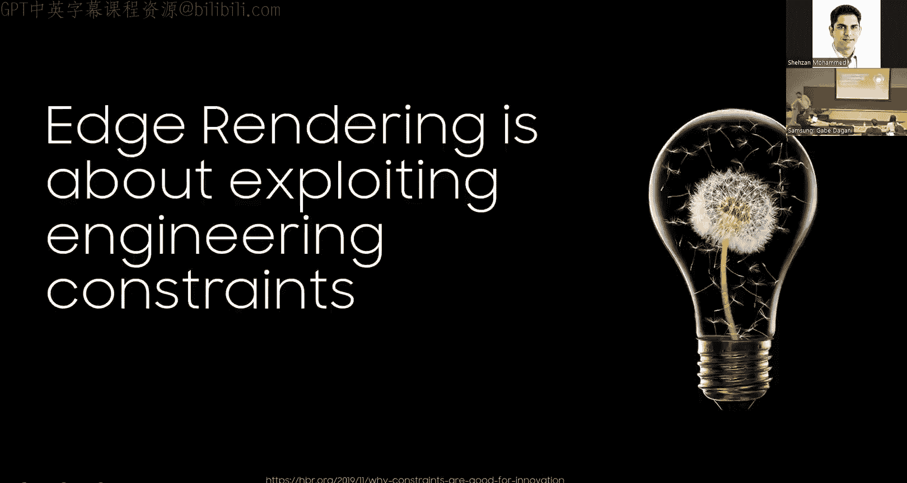

So as you can tell like I just said we have lots of form factors for graphics that don't just include a a big graphics card in a desktop or in a server or even in your laptop so I've worked in graphics and pretty much embedded almost my entire career I did do a stint of Intel working on like desktop graphics and then I've moved around to console graphics。

Cell phone graphics， automotive graphics， industrial graphics， there's graphics and airplanes。

 there's graphics and cars。

And so they all have different requirements。This is more of a joke slide。

 but it's also important where you've heard of Masl's you know hierarchy of needs。

 they just add WiF and battery for the modern human as something that's super important。

 in fact when's the last time I think anyone has turned or not used their phone in a day， right？

Like if you had like a phoneless day， it feels like you're losing a limb。

And so it's very important that you don't just get performance。

 but you also get long term battery life and you also have really good connectivity。

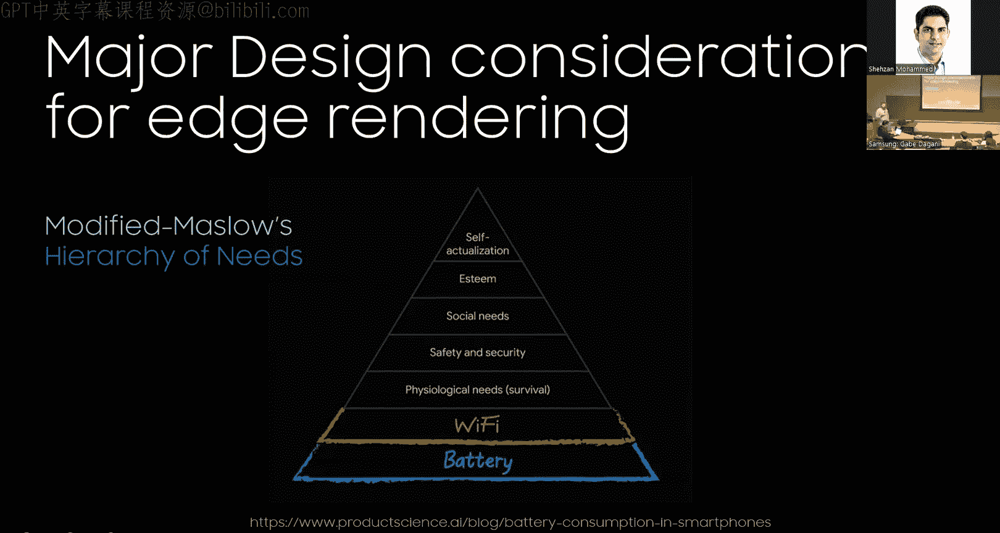

So one question that I like to typically think about is where does all this power go in your pocket？

And so this is a lot of information， I'm going to kind of talk over it。But with mobile phones。

 we call one of our main primary strategies or our targets is to maximize the DOU or days of use。

And so that's almost more important than having the most powerful rocket ship in your pocket that you could possibly have you want something that will last for a long time。

And so we look at the different mobile phone power settings and I think for us iddle is like 30 milliwatt。

 I know that won't say a lot to a lot of people people don't think in terms of that。

 but I'll kind of talk about it a little bit， We have gaming at two and a half watts。

Gaming at five watts and then super powerful peak gaming at something like 10 wts okay and so if you look at this we say in airplane mode when you don't have a lot of radio。

 you're using a basically 800 millwatts， which is mostly screen and a little bit of power。

Web browsing 1，500 millits for your TikTok videos。Okay。You got medium gaming， 2。5 watts。

 this is like your candy crush and your brawl stars。

Heavy gaming at close to five watts this is like something。Not quite ginian impact。

 but maybe something that's more along lines of。A of a lot more than a 2D scroll or definitely 3D。ok。

You have listening to music， it's almost nothing， a quarter of a watt。

 you can do that for a long time and then one minute phone call is one watt， it's actually a lot。

And so we look at this， where does this go， you say display can be anywhere between zero and 500 millwatts。

 half att， depending on your brightness。CPU is， so I should say 50 to 1000 watts。

 so I messed up GPU between 101 watt。Moem 800 ish if it's on and doing something and these are variables obviously this is what can change make it go higher or lower you can have brightness or frequency distance to tower for RF transfer rate on wfi and Bluetooth memories the transfer rate and Rams transfer rate and so I look at these kinds of situations。

And you just， you know， you just do regular algebra not algebra。

 but just simple arithmetic and you say flagships smartphones have about a half 5。

000 million amp batteries for 24 hour usage at five watts。You know， playing a pretty heavy game。

 you'd have about three and a half hours of gameplay。At two and a half watch。

 you'd have double that seven and a half hours。And if you wanted to be idle。

 it should last for something like 35 hours， that sounds about right？You know。

 just looking at that math。

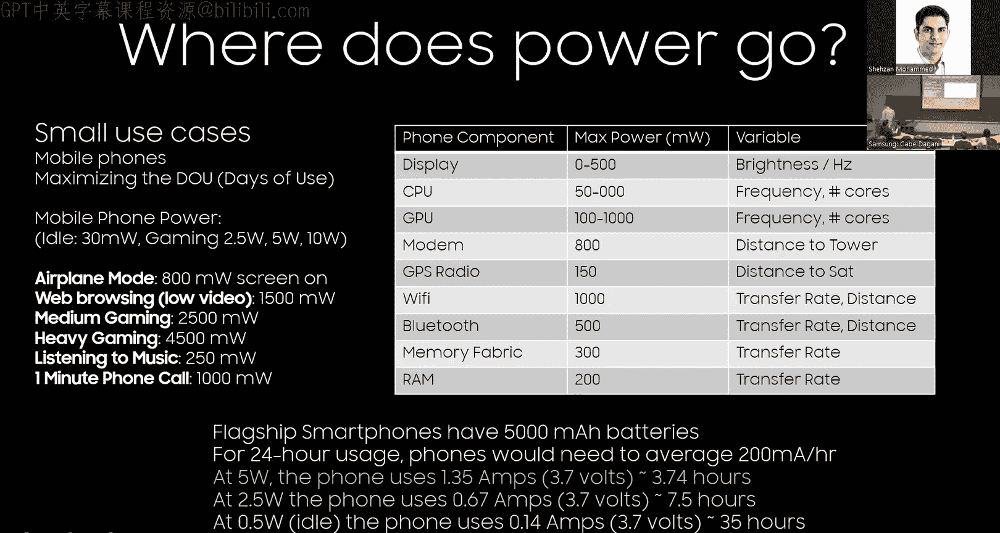

And you look at the battery life a little bit longer and we say most phones have between 5000 and 6000 milliamp hour batteries and so you see all the fancy phones from this past year have anything from 14 hours to 1819 hours of battery life just to general use just if you take an average of what most people do and that's about right to and this is kind of where that comes from。

So。

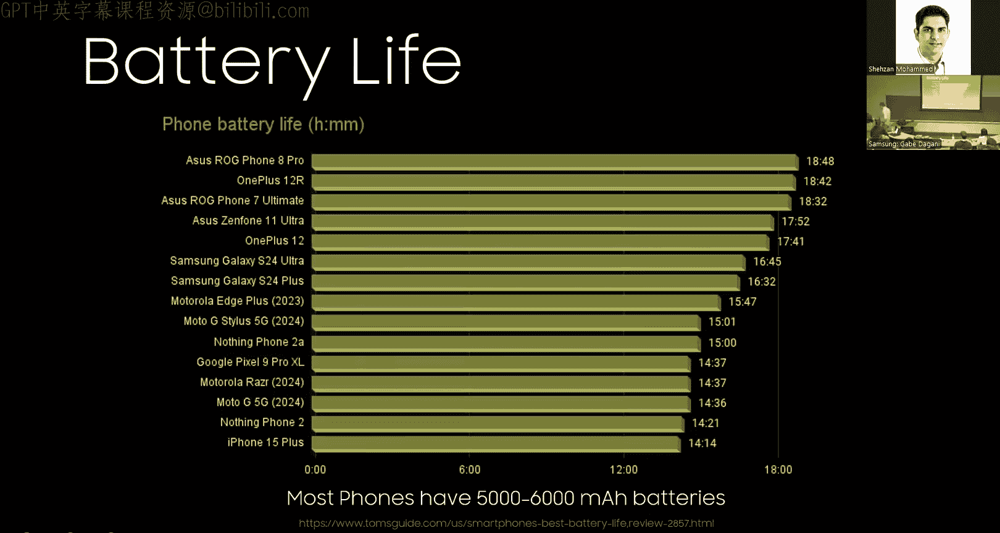

ま使かま。And so when you think about it， like what is where is all of the power going on the chip？

And I really like to point out that。Memory accesses to DM are over20 of magnitude more expensive。

Than any kind of arithmetic。So you have DMBrites， 16 ajoules doesn't sound like a lot。

 when everything else is in picojoules it is。Okay。You have off chip links。

 like if you have RA that's outside of the chip， anything that uses a Phi or physical output。

It has to have an amplifier up， an amplifier down that costs a lot of power。

 that amplifier costs power that opt amp。You have SRAM reads 50 picojoules， bus reachs。

 26 picojoules， but a 64 bit dot product it's only 20 picojos it's almost nothing。

 that's an expensive high precision calculation， which means that sometimes it's going to be more power efficient to procedurally generate the data if you need than to read it from a table。

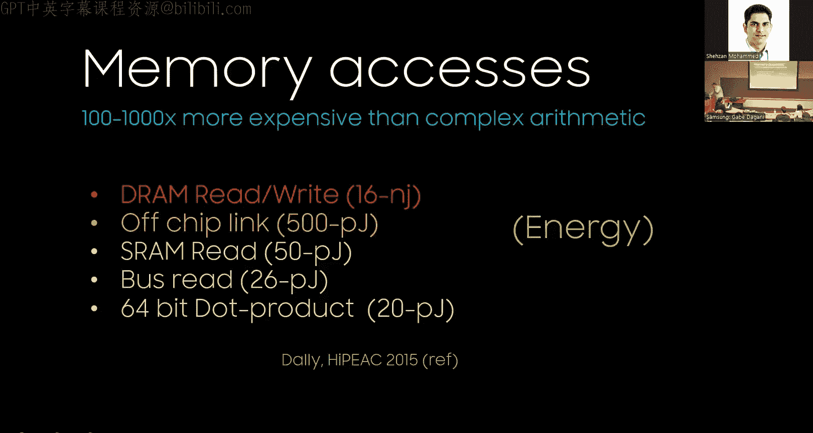

So another constraint I like to think about are how many pixels are enough pixels？

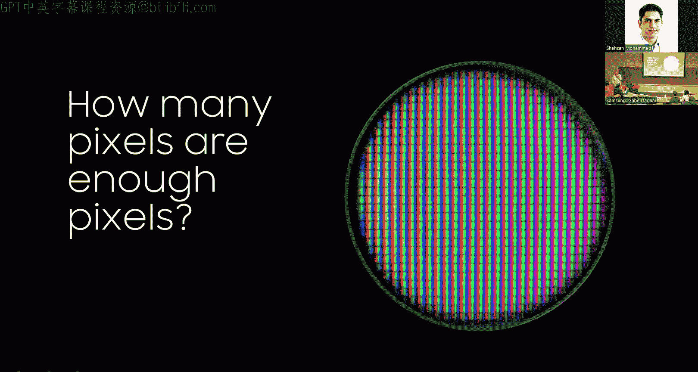

goinging back to like first principles。You know that humans older than five years typically can't focus closer than four inches。

Right even VR， they're making like they're doing some lens cleaning to get that perspective and focus。

At  four inches 2020 Vi， you have a max perception of 2200 pixels per inch。

Legally accepted 2020 Vis is about 900 pixels per。But I'll tell you， that's way， way too much。

So let's just think about like what we typically do， reading a book at one foot。

 the max PPI perceptibles， about 300 pixels perch， which is what a Kindle is。

If you look at the Kindle stat， it' 300 pixels perch。Using a laptop of two feet， about 120。

 you think about that because。Your ability to distinguish pixels is diminishing in a inverse。

Square law type of rate， watching a movie at six feet。

 50 pixels per inch and then movie theater at 30 feet front row is about textbook 10 pixels per inch and if you look at what we typically see in resolution。

 we're doing way better。Reading a book at the rate that at a Kindle is。

 it's already over 300 pixel per inch， that's maximum。

 can't really see anything lower using a laptop， we need 120 and typically a 4K laptop has 280 twice as much as you need。

 which is why a 2K laptop is probably okay。Watching a movie 4K is exactly at the max perceptible。

 8K is way overkill， you can't even see the difference。In a movie theater。

 this is the only one where if you're on the front row。

 maybe 8K would be better because at 4K you're at 5 to8 PPI when you can max seat 10 pI。

 that's just like perfect vision。But at AK， it actually is above the vision constraints and so I would say that。

We're basically at Max Pixel that's kind of what I'm trying to get at and the next slide kind of talks about that a little bit so at phones we're not going to keep jamming more pixels onto the screen there's just it's it's worthless。

 it's not actually providing value but it's taking more battery。

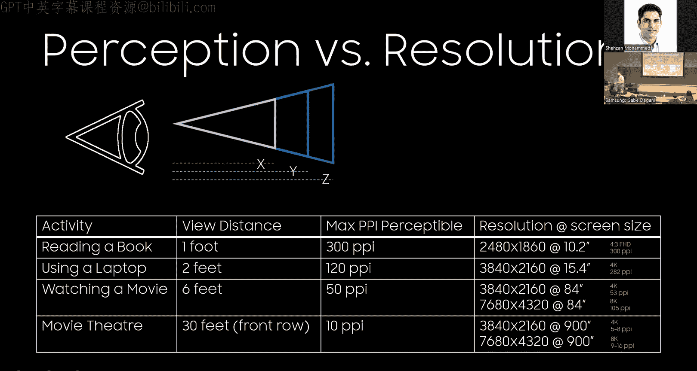

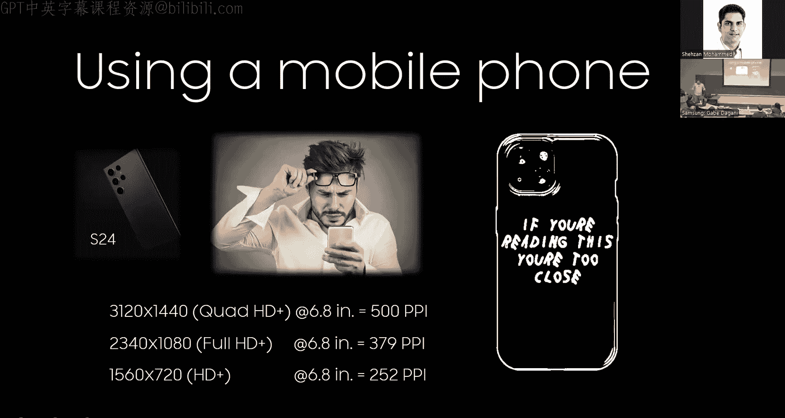

So I'm also going to go first principles， yeah， yeah。

we're about to go into the refresh rate that was a great transition thank you placed I planted this guy in the audience。

So what makes a picture move？I know there's a book called the Biography of the Pixel by Alvire。

 it's awesome， please read it， it's really good it's this thick but half of its bibblography so you can feel really good about yourself。

So what is the frame rate of your eyes， that's actually a trick question your eyes don't have a frame rate。

A parent motion kind of starts at 10 to 12 hertz， but the reason that's true is because your eye accumulates light over 100 millisecond sliding window。

So you're always seeing 100 milliseconds in the past。Does that make sense？So as your eyes accumulate。

I know right and this is called Bs law and so。Having the idea of a frame rate with a sliding window or two kind of orthogonal thoughts。

 they feel like they're the same and so you can have an apparent motion problem。

 but it's not exactly what a frame rate is。We also have critical flickr threshold。

 which is like what happens on the evolved to like see very quickly on the periphery。

And so we actually have a higher， let's say a smaller sliding window on the outside of your eyes than you do in the front。

 you're accumulating more light in the front， you're seeing movement quicker on the sides， which is。

Interesting， and it definitely makes it play in the ARVR， but less so for cell phones。

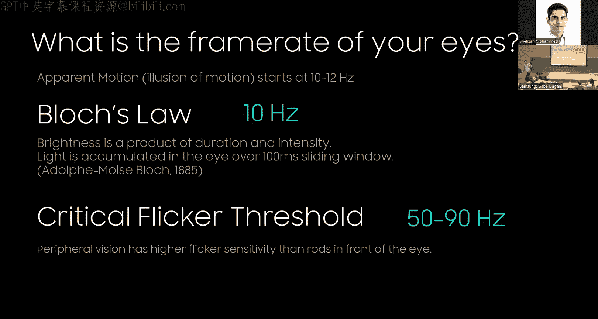

So you can kind of look like what does a refresh rate really look like and I know that you guys have seen things like this in the past but I thought this was really I stole this from a couple websites I thought it was really good so you see four frames per second horrible got off of it looks like a flip show right？

Eight frames a second a little bit better。24 frames per second looks pretty darn smooth。Okay。

 so that kind of speaks into the whole 10 hertz as of being apparent motion。And then on the right。

 you can see even a better kind of。Grannularity， you have 16 frames per second。

 which is what silent movies used to be。You have 24 frames per second。

 which is kind of the standard percent of photography today。Then you have 30 frames per second。

 which is what I would call like 2D console games and then 60 frames per second which is I call 3D games obviously you can go faster but this is just more of an illustration and so there's still you can definitely see now is there any any reason ever to have 120 frames per second or 240 the answer is yes。

Especially for watching sports， if you want to see where the ball is。But other than that。

 I would say for the most part， 60 frames per second is quite adequate。

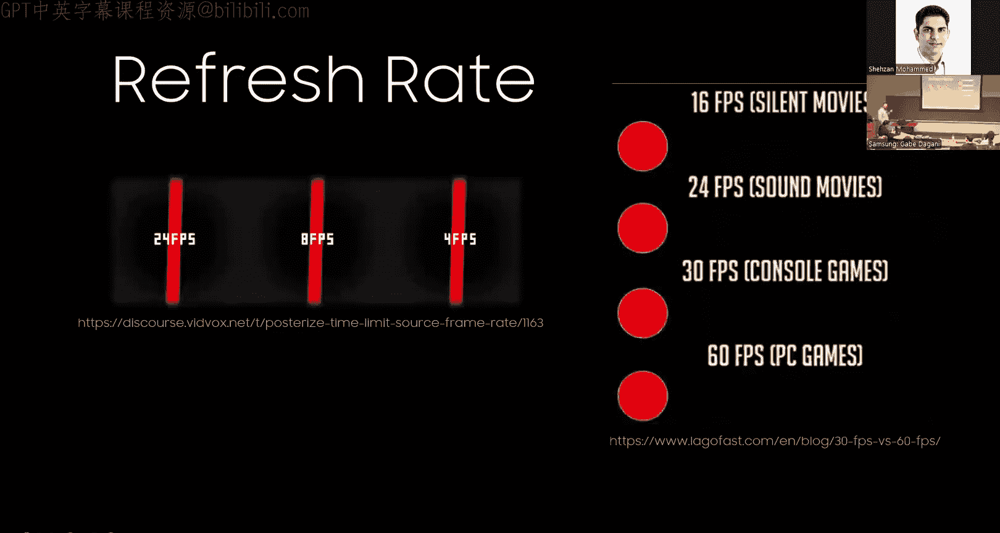

And like I said before， aesthetics can be more important than the limits in perception。

 if you've ever seen a movie not at 24 hertz， it looks super weird。

And that's because we've been kind of trained to feel what a movie is supposed to look like at 24 hertz because for the longest time。

 celluloid projectors were maxed out of 24 hertz。And so they would actually play the same frame multiple times。

 click click click same frame and they would show you the same frame three times just to get to the 24 hertz or two times and when we look at it like if you've ever taken a video and gone into something like。

After Effs Adobe Premiere and then you've changed the frame rate and watched the same exact clip at different frame rates。

 you're going to get a different feel too fast it's going to feel like a home video too slow it's going to feel wrong。

 but 24 hertz you're going to feel like well that looks like a movie。

It's really bizarre I' would actually tried that experiment。What about the thermal limit？

So this is something you hold your hands， so anybody ever had a really hot phone in your hands？

Not the greatest。So this is a study from NASA， it says at 45C。

Under 45 C and you have an okay thickness of skin， you can basically hold the phone forever without pain。

 but it's hot。ASlight over 45 seat。With a thick skin。

 you can hold it for 60 seconds and then it starts to actually cause physical pain。

And then as you go up at 70， you can see that you hit this critical pain threshold or you cannot get any hotter than that。

 and I know that sounds really bizarre， but like this is something you have to think about if you're going to have a handheld device。

You have to keep it cool and nobody wants a fan on their phone。

 so you have to think about passive cooling。啊对。I'm sorry， go ahead。不个我肥。Yeah。

 so this is a NASA study， so I think it is it's like if you have calluses I think it gets thicker。

Yeah。Well， that makes both the thermal dissipation worse。But it makes the insulation better。

 so what it'll do is phones have DVFS regulators， so DVS is like dynamic voltage frequency scaling。

So when the chip itself detects certain thermal limits。It will start slowing itself down。

And so if everything's working right， your phone will get slower and you might be doing less background processes。

 but you're never going warm up because they're very peculiar。

 they don't want to be in the news saying someone， you know the whole like McDonald's talk coffee thing they don't want that。

 right？And so they're definitely going to slow your phone down and that's kind of how we achieve you know thermal regulation。

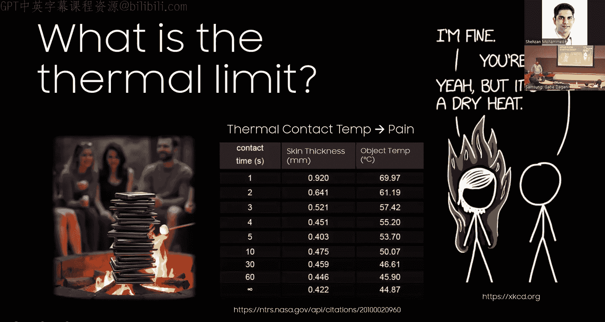

ま。So a summary of the section， so constraints help us focus the effort on what's important。

Let me talk a little bit。Another area that's different from some of the other talks。

I'm kind of like the last guy， so I'm trying to figure out what hasn't it already been talked about。

 so you don't have redundant talks。As mobile rendering。

So one thing I like to say is mobile is the dominant platform。

If you go to Wikipedia and you take the approximate numbers for every console that's ever been sold since like the Commodore 64 in the Atari to today。

It's about two billion units。Throughout history， that's even rounding up。Last year we sold 1。

2 billion fonts， all of them smartphone capable。So what what would you say is the like the dominant game platform。

 it's not the most exciting game platform， but it's definitely the dominant mobile game platform。

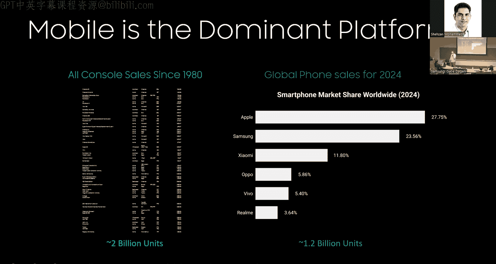

So what makes a mobile platform？Well， this might be obvious for some。

 but some people who aren't hardware centric this might be new。

Everybody knows what a system on a chip is， right？don't want to manplain。So we definitely have CPUs。

 we have the different parts history repeats itself。

 so what I mean by that is when I was early in my engineering career， all the chips。

 all the different segments of the SOC were the chips themselves and they had wires on a circuit motherboard。

And they did cross chip communication now everything's sucked into the same die。

 all the off chip communications on chip， the only thing that is escaping the SOC is power and Ps for inputs and outputs。

but on a desktop you have still mostly have the discrete desktop cards which for graphics goes through PCIE and VRAM。

 which is a different programming model， you have dedicated VRAM。

 but you also have latencies and apertures apertures is in you with certain memory range that you can write out of time through PCIE you have to do a lot of buffering to make sure you hide the latency and so forth and so on。

On mobile phones。You have unified memory， so the same RA that's being and written to by the CPU is also the same RA that GP is writing to。

 which means you can have zero copy， reads and writes。And it's mostly all in the same package。

 so the Ram for phones， especially the Ram's actually in the same。

Rubber plastic packages everything else。

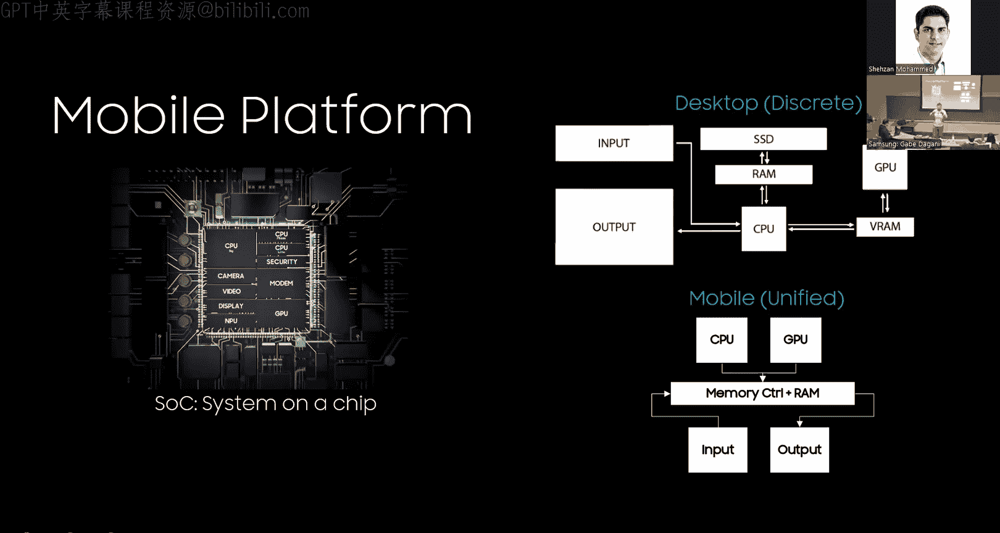

Now there's two types of renderers。Some people can say they're the California renders versus the grape Britain renders。

And so the California renderers are called immediate Mo renderers or IMs。

 and the reason they say that it's almost like a drag racer。Very simple。

 it goes through a simple pipeline and it's from A to Z。yeah， and so you have draws。

 input assembly for making your triangles， geometry processing。

 primitive assembly for creating your triangle strips， rasterization， early in late Z。

 fragment processing and coloring pixel operations， and then color attachments。

 just straight through very simple exactly how you learned in a textbook。

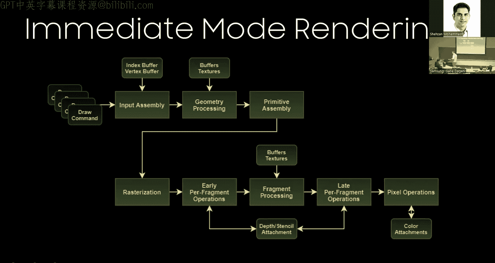

Now there's this experiment that a guy ran on the internet where he wanted to show the difference between IMRs and TBBRs and I'll talk about TBBR in a second。

 and so what he did was he drew。12 triangles， just very big triangles。On top of each other。

 and then he hit stop。In the middle and he said what's going to happen and so you can see that it's drawing down into the left and it's going from blue it's trying to draw blue on top of green and it just has a very clean clean stop you know just kind of how you think like you're just drawing pixel and pixel and pixel okay so just remember this we'll come back to it。

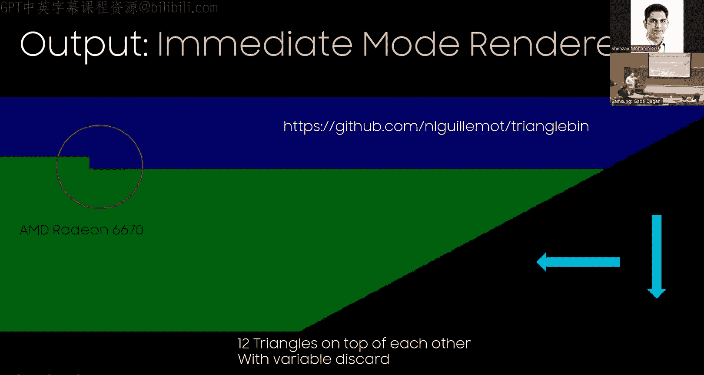

Then you have what I call the Great Britain or UK or。GPU。

 which is the TBBR tile based render and this is the dominant mobile platform type of render and I'll talk about why。

But you can see that it's not just a straight line we have draws input assembly geometry assemblyitive primitive binning and then we have per primitive bins that are being accumulated okay it's almost like if。

You remember think I ever heard of like？The name's coming。It's like a bailwolf cluster。

You're going to create a bunch of jobs， put them in a bin and then read them off as you get to them it's a binning architecture。

Then on here， we're going to read from that stack of tiles。And then each tile。

Is going to have its own on chip memory dedicated to just that tile and to do per tile rasterization early and lateency。

 per tile buffers and fragment processing， and it's going to store it as a tile。Okay。

 and the reason they do this is if you remember the constraints I talked about before。

 what's the most expensive thing you can do？Compute wise and it's right to memory。

And so by having on chip memory， which I talked about saying， hey。

 that on chip memory was something on the order of 50 picojoules。

But off chip memory or something on the order。By 500 nanojos。

something like that and go back and verify， but it's in order to Twittertters a magnitude to go to ramps so these guys are saying we want to save power by having a lot of onship memory and doing things and exploiting localization in the cache because you know that this same pixel is going to need the same types of memory resources to finish its operation than the one over on the other side of the screen。

And so by exploiting that localization， you can make sure that things stay in cache resident。

 you don't have a whole lot of cash thrashing， you can save power。Okay， however。

Bo way more complicated， a lot more hardware， algorithmic complexity。

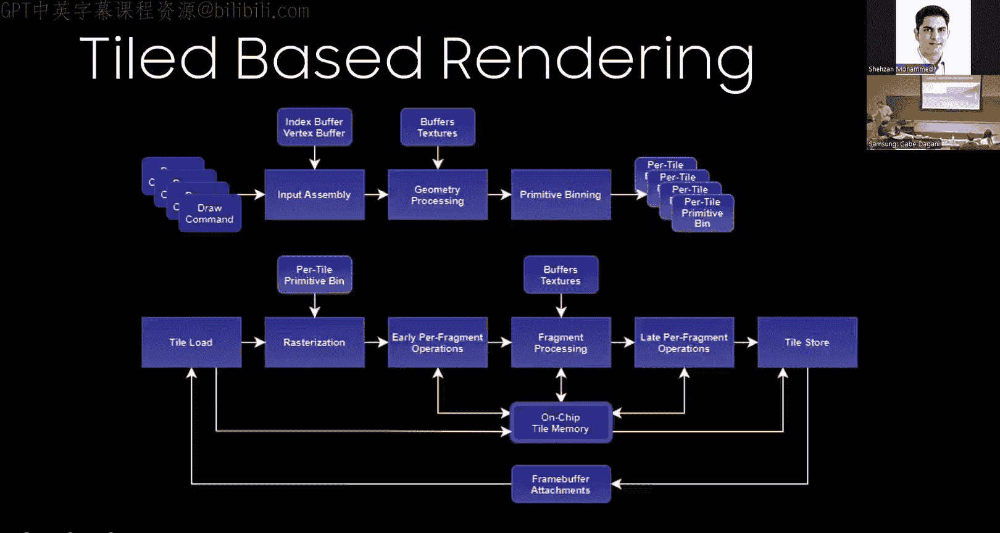

And when you draw that same set of 12 triangles on top of each other。

You end up seeing really random behavior。Okay， before it was very clean here you're seeing each child being written to as it was as it was pulled off of the bin。

And then some things are getting done to different triangles at different rates。

And so if you were to draw the whole frame and not stop it。

 you'd still see the same color all the way through and you'd see the last triangle drawn on top of the 12 triangles。

 but in the middle you see that this has some really quirky behavior。Yeah。That operate famous。好的。Yes。

And so with transparency， each tile is doing all of the work all at once。

 so if I hit pick this tile it's doing all 12 layers in that same tile。

 so it's reproducing all 12 triangles for each all 12 colors for each bin as a part of a greater triangle okay the transparency just means that one of the layers in that 12 triangle what might not be drawn or it'll be alpha blended。

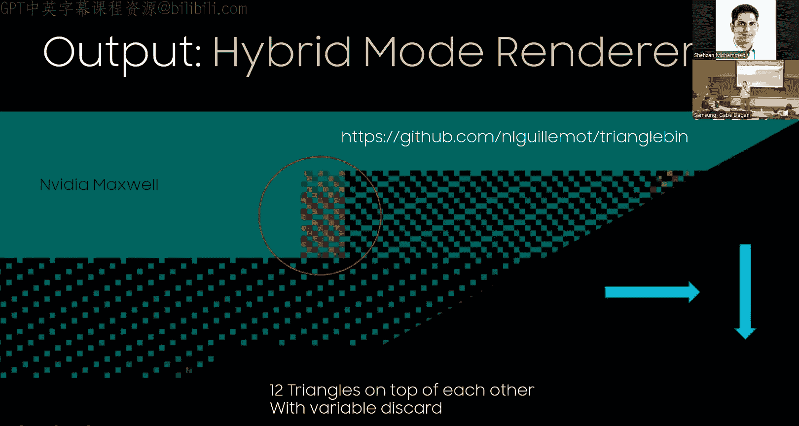

So that's kind of the introduction to like difference between mobile and desktop， desktops。

 mostly IMR， mobiles mostly TBR。So mobile GP programming。There's many platforms。

 my group works on the Samsung Xlipse with which is an AMD pedigree， took the AMD architecture reve。

Shrunk it and changed it for mobile。Quualcomm Adrino did the same thing they just did 12 years ago。

 so they kind of have an earlier。Branch from the same tree。

And we have a later branch from the same tree like they were branched out in like 2012 and we were branched out in 2020。

And so similar architecture， but different because all comess done its own thing and we're doing our own thing。

嗯。R Molly has been doing， it's one of the first TBRs with imagination。Imagination Power VR。

 Power VR was one of the first British UK kind of TBDRs。Apple actually uses an imagination GPU。

They called it the Apple G which really imagination， Oh yeah。

 if somebody did an experiment maybe a year ago or they like took the I am the imagination simple driver and they could still run an apple。

谢谢。😊，Everybody has their own branding。I'm sure they're starting to DV。

 I'm not saying they're not doing good things， I'm just saying that the architecture is still profoundly imagination。

Invidia Tegris， they're kind of like more portable。

 but still plug into a wall like laptop type battery that's in cars too， like it's in every Tesla。

Vvante is one for like。A lot of cars， and a lot of。

Wasashers and dryers and things like that and Brocom is all set top boxes yep。行。😊，嗯。So like。

O has an immediate mode not it's not really the same words get confusing。

 so immediate mode render just means it's not doing any tiling it's just going to draw it's going to z raster the entire screen all at once。

Whereas tiling means if you're going to think of it as taking a scissor of tiles and you're going to do end to end all the way from top to bottom on that tile and you're going to move on to the next tile move and so what they did was they。

They're subdividing their GPU capability to the point that if each core has a lot more memory and a lot more independence from other cores。

Whereas IMR。Really depends a lot on nearest neighbor and so it'll cheat and it' will use the same buffers and it'll say。

 oh， I'll just use that and so it's just assuming that it still exploits localization。

 but if the screen and the resources get too much they're going to pour over into RA and out of L2 Ca more。

Yeah。好。Be more specific。You can on an immediate motor render mean。

With a tile oh you can't it's doing a bunch of ones in parallel。

 that's why you saw otherwise you just see one tile like you did before。

 you saw so many different tiles， some of them were complete。

 some of them were halfway to completion， some of them hadn't started right。

And so they are happening in parallel and by the time your frame you know your vy happens they would all be done this guy like wrote a test to exploit the behavior to show you what it was like and stopped it before it hit that v sanc like sub eight millisecond。

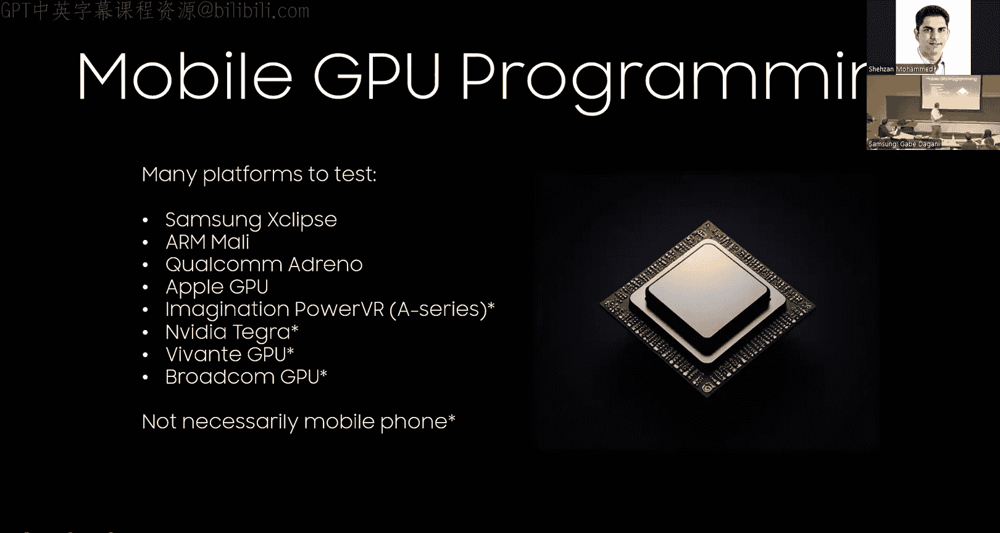

你看。So here's some example specs for the different phones from last year or this year actually。

 so you have the Qualcomm Snapragon HN3， it has about eight CPUs on it。It has G P core， the adreno。

 it has a 5G modem Wifi7 Bluetooth， and it runs on the4 nanometer process。

You can see similar Media tech has eight， Samsung has 10， Google has nine， Apple has six。Yeah。

 sometimes they label how many cores are on there， sometimes they don't our chip has between six and 8 cores。

嗯。Yeah 12 cores on the media tech one， I'm not sure how many on the adrenal maybe six。

So these are scalable architectures。Can someone tell me why we would have more than one type of CPU？

Like I'll be honest， so the prime core super fast， super big。You got performance course， medium。

And then efficiency core， small。嗯哼。😊，Yeah。we should write that on T shirt。

 you're not going to use the prime all the time。嗯。We actually the big cores are called x cores。

 cortex X4， you want to turn those things off as quickly as possible。

 so why would you even have them well sometimes you want to run some really intense applications and it's almost like having an afterburner。

So you turn it on， turn it off， things like compilation。

 so if you're doing shader compiles at runtime。You want to compile those things as fast as possible so the loading screen is not taking forever。

Or if you're doing an LLM， you want to be able to do that super quick。

But you want to turn off super quick， you want to powergate。

The efficiency cores are like the background course， they're doing a lot of polling and pinging。

 downloading， checking Wii Fi， blah blah， bh blah， they're almost on all the time。

So you want them to be super small， super lightweight。

 and the medium cores are doing the middleling work like the web browsing and the what have you？

It's all about power efficiency now why can't you just take a big floor and run it and then stop it when everything。

Some processes don't ever stop。And it's really hard to powergate a huge CPU。

 it's much easier to powergate or turn off a big CPU and then use a tiny CPU to kind of run all the time and do all of your background stuff。

If is architectures primarily coming from。The CPU world is dominated by arm。Now Qualcomm has a new。

Variation of the arm called the nuvea which is like arm and they kind of jacked with it and now it's like kind of fancy I don't it's kind of proprietary I don't know a whole lot about it but you can read articles on nuvea that everybody else is kind of doing and then apples also kind of jacking around with arm too and so they're claiming their own CPU but it's really just arm with like some apple special sauce。

But everybody's basically our architecture AR 64。嗯。And it's because arm。

Made their licensing fees super reasonable for a super long time and the ecosystem really thrived in the tool chains and everything like that now when there was a。

There was a panic， a panic of 22 when Nvidia is thinking about buying arm and everybody freaked out and they started pouring money into。

Anybody heard this， would they pour money into？Risk five。You know I'm talking about？

You know what risk like？So riskk five is the open source core。Now that was a great idea。

'm all about open source and Open corere， but the tool chain just wasn't， I mean。

 you can't catch up in the year。And so there's all this excitement and then N Vdia said， okay。

 we're just kidding like then all of the funding for risk fives kind of went away， it's not gone。

But and I think it's really interesting and it's probably going to have its day， but I think。

If envi did， by arm。Then risk five would have been like。Like kind of like the alternative。

 everybody needs something to leverage business wise if you're going to have a monopoly yeah。that我。

诶我就呢啲平动住下嘅。Do we have something we have。The performance code is what going to the I。Yeah。

 so there is， so sometimes it's handled in the operating system。

 sometimes it's handled by the application application， you have something called CPU affinity。

Actually， and you also have GPU affinity， if you're in a notebook。

 you can choose whether to use the integrated graphics or the discrete graphics。

 we call that GPU affinity。If you CPU affinity， you can say。I don't remember the command line。

 but it would be something like nice that had used this CPU。

And then you could run your program and you can choose which CPU you want to run on the BP or the board specific platform。

 which includes the OS， will also have like operating system procedures that it kind of pins to certain core。

Okay， so it knows that the modem's always going to run on this efficiency core， the graphics。

 this part of the graphics are going to go on that core。

 this part of the graphics can go on this core， so they know how to get the most out of your battery life and as an application developer。

U there are certain hints you can give to Android to say this is going to be an intensive application you might want to use export。

 but they're just hints， you can't enforce it。But in Linux， you can enforce it。

 so different operating systems， different rules。

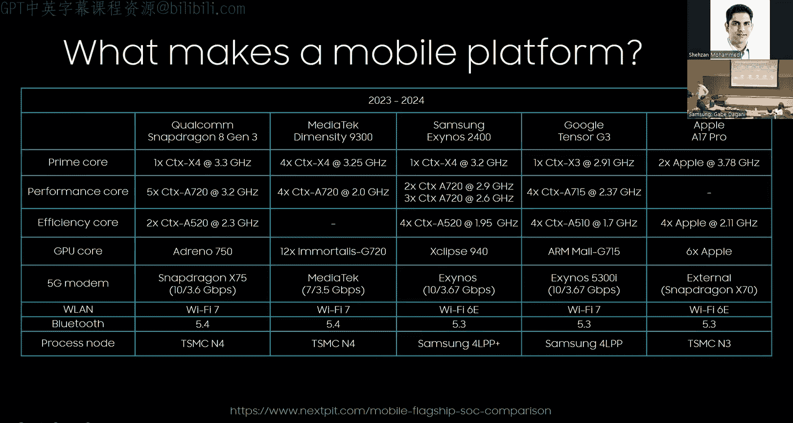

Okay， best rendering practices。So。So I was asked last year to add more of this because you guys were more in the practical side of rendering and I was giving kind of a business side a lot more。

 so I'm adding I'm adding some extra slides on what is good practices for running on mobile。

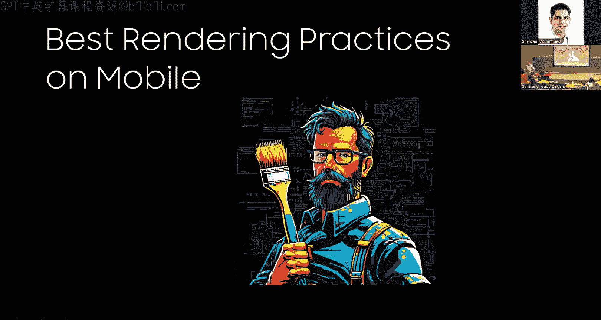

嗯。So one thing to think about is。Mobile programs have to run everywhere。Okay。

 and so what that does mean is that the ecosystem can only move so fast because if you make an application that can only run on the newest of newest of new phones。

You're going to have limited distribution。And so anytime you add a new feature。

 you're going to have to add an older feature workaround or be able to turn it off completely。

So if you're adding ray tracing。You're going to have to add a path that doesn't need ray tracing。

So if you're doing ray trace shadows， have crappy shadows。

If you're going to have ray trace genome reflections， you know， do environmental maps。

Something like that。Must be able to reduce total level of detail and scale down。

Some GPUs on phones are more powerful than。Fcier GPUs on phones， this happens with desktop2。

 the only time this doesn't happen is if you're doing it for console。Or you're running it on。

Actually， that's it if you're just doing it for console because if even desktops are always going to have different varying well like performance capabilities。

 phones are going to have different performance capabilities。

 even on Mac you have different GPs throughout the ages。到了。

Cars are interesting because the ecosystems like super closed。

So they're going to be able to tell you what app they're going to run and they're going to have a full list of things they have to support most of the time they just give you what you give you get one update for 10 years。

说这个。I mean， Tesla doing Tesla's doing a better job。

 but they're not really like superchar the graphics because they're like， you know。

 fixing jitter or something。Sometimes apps will require quirk testing。

 have anybody ever heard of quirk testing before？So you don't ever want to。Do a test。

This is kind of a software engineering principle。You don't ever want to do a test that says if you're on this GPU with this driver。

That's broken， so do something else。Because what happens if they update the driver？

What happens if they fix the problem？Now you've put in your code。

Like a specific combination of driver and hardware and you said， just do something else。

So what you want to do is you want to find a agnostic unit test。

That will show the same behavior where you're saying if you're doing the specific unit test and it fails。

 then do a workaround， if they do a specific unit test and it passes。

 don't do the workaround that way if they fix the driver。

 you don't do the bad behavior just because you've permanent hardcoded a driver hardware combination。

Also， you don't know if a later driver will fix it and so you don't want to make a magnanimous statement like if it's less than or equal to this driver version do something or greater than or equal to that driver version do something else that's so it's software engineering is come up with the unit test that isolates the problem you're seeing that way if that stops happening。

 you stop doing the work room。And this is actually true for video games， true for drivers。

 true for every application ever。But it's even more so for mobile。Optimizing shaders。

This is kind of controversial there was this like hip hop happening Uber shader thing with unity and all these other big engines where they would write one shader and they'd have so many permutations of that shader。

And it sounded like it was amazing because it's really just one shader right and the answer is no。

 it's not just one shader it's actually a lot of shader it's happening all at the same time and then you're chain huge forms so what happens with Uber shaders is while they dynamically update uniforms to reduce recompilees they increase shader register pressure which means that they're probably less efficient because they're always thrashing。

They also use more to compile， and I guess this is actually a do。

 not a don't use more compile time constants and shaders if possible， don't do run time constants。

And there is a difference。Be explicit when using FMA， don't assume the compiler will always optimize。

Okay， sometimes and I'm going to tell you why。Runtime compilers have a limited window how much work they can do to get your shaders as efficient as possible。

嗯。I don't know if this is a secret， we don't use LLVM in our compiler because it is so dog slow。

I mean， it's written by a bunch of PhDs and it changes every week okay。

 the positives of LLVM is it changes every week and all of these new algorithms get used all the time and every PhD is putting their thesis into it。

And it's great and there's actually some like joke web pages about how good or bad L ofVM is at any given day。

But the nice part is everybody knows LVM its kind of a standard。

 the bad part is it's runtime compile so do slow we can't use it and the reason is because you have this limited window on when you can compile or how long it takes to compile in order not to hit jitter。

And what I mean by that is when you're playing a game。

And you go to a whole new environment or you hit a boundary in your scene map， scene graph。

 you go to a different scene， you have to reload a bunch of new materials， bunch of new lighting。

 and if it's a uer shader， or if it's something else you have to recompile a bunch of stuff and it's going to cause unless there's like a loading thing you're going to see like a frame drop people can get pissed。

And so you don't do that。 And so instead you try to。Tried to be smarter。

 try to you try to put training wheel on the compiler a little bit because the compiler just can do like an O of one or an O of two not an O of three。

Because it doesn't have that much time。Okay， and so if you can be smart and you can be a very explicit。

 be very explicit because it'll make the compiler's job a lot easier。

 don't assume the compiler is smarter than you are。Discards and pixel is shaders。

 you know I know what pixel discard is？SoWhen you say stoptop， throw this away。

 it only works if the whole CD is discarded。Think about it。

 you have8 wide or 16 wide or 32 wide and SMD and half of them are discarded。

 the way that GPUs work is they don't just stop that work。

 they have to go through everything and still do the other half of that SD。

So the only time you really save any work is when the whole CD is discarded。That makes sense。

 so don't just assume I'm going to save all this work when I write shaders and put a discard here aha because if there's so much work after the discard。

Then you're in not saving anything。So you either have to A be sure that the whole thing's going be discarded based on localization or that you don't put a whole lot of work after the discard and so discards really they're hit or miss。

 sometimes they can be helpful， a lot of times they won't。Some operations are more expensive。

 this is like computer 101。I'm going to close this little thing here。嗯。So hyperbolic，  stgonometry。

 super expensive。Division reciprocal， super expensive， atomic， super expensive， if you don't have to。

 don't do them。And then sometimes loop should be unrolled explicitly in code to save register pressure。

Um this is kind of like an experiment I would recommend some of you guys do if you have an application that's going anytime slow try to do like。

You can do partial enrolls， you can do full enrolls in your code as opposed to doing a  fourI。

 whatever， and see what happens。I know it's counterintuitive， but sometimes。When you do a loop。

The compiler is forced to keep that basic block completely intact。When you enroll it。

 every line becomes an independent form of instruction and they can do better scheduling。

So what's easier for you to write a for loop is actually harder for the compiler to schedule。

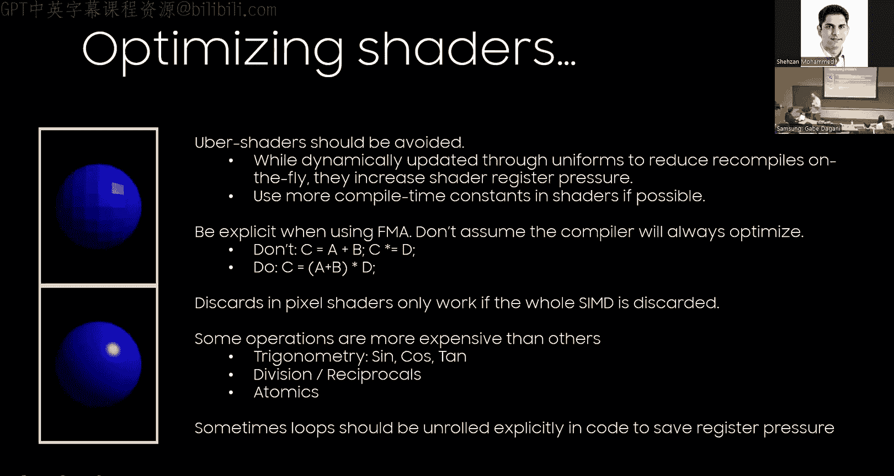

Games must exploit the limitations of a small screen。

I say MSAA is not really necessary in a mobile phone。So four times， even if it's built into hardware。

 it's four times the energy， you're not really saving that much work。

 you still have to do the resolve。Variable rate shading， though。

 good idea I know what variable rate shading is。Variable rate shaing is literally the opposite of MSA。

 someone tell me what MSAA is。Over。Over合文对。关。对。So take。Right。

 you're taking multiple samples for pixel and I can talk about so when you're in vector space and not on screen pixel space。

You're picking random spots， usually it's like。You know。

 like four poles around the pixel or you're taking one。

 you'd either take the center pixel or you can do like variations or you can have a random stochastic whatever。

 one pixel， you can do two pixels and you can sample them on the same pixel location and that average gives you a little bit better effect you get four pixels or eight pixels and that sampling and the averaging that oversampling will give you a better idea of if you hit the right color for that pixel because in honest you're degrading performance when you go into pixel space from vector space right it's not pure anymore。

So MSAA was a great solution when we had these huge screens and we couldn't feed the pixel shader enough and so they put this acceleration hardware in there to super samplele at the very last minute to reduce anallias。

Okay， multis anlyase。Are increasing variable rate shad does the exact opposite， it samples one pixel。

And it either blows that， dilates that pixel up to four or eight or 16 pixels it's basically saying this is a dark corner。

I don't need that much detail， so use one pixel shader and blow it up and just kind of do a paint fillll in this corner。

You know， and what does that do it saves you8 x， you it saves you maybe 4 x， 2 x。

 you can do a one by two and you can copy the same pixel twice， you can do a two by one。

 you can do a two by two， two by four by two， two by four。Even a four by four。

 that's as big as it gets right now。And if you do a four by four you're sampling one pixel。

 you're actually doing the pixel work for one pixel but you're splitting it and you're getting 15 times the work so you're dividing your total amount of work for that area by 15。

 which saves a lot of time and power， but it also degrades it because it means that。

You're not doing different pixel reaction for all of that， so if you over VRS。

Then you're going to get much worse quality and get tiling and bandit。

So artists have to know where the dark parts or the light parts are going to be。

 sometimes they can do an image processing step where they look at pure illinance， okay？

And when you look at pure luminance， you can say like what you do is you take the RGB and you find out how close it is to one and then you get that luminance or you think of it as grayscale。

 how close are you to white and when you get past a certain threshold if you're super white。

You can probably use VRS if you're super dark， like close to black， you can use VRS。Okay。

 and you can find different things sometimes you know that this is far away enough like an LD you can use VRS on materials themselves。

 and you can spit out of VRS so by doing these cheats you can actually reduce the amount of work。

Last thing is medium precision should be used whenever it's possible。

 medium precision being half floats 16 bit desktop barely uses 16 bit at all， 32 bits cheap and free。

 whatever， but if you most mobiles treat 16 bit floats as like firstclass citizens。

 which means if you can do 16 bit it means you can get twice the throughput。Twice the flops。

But be careful。Don't use it for depth or position because you'll get Z fighting。Okay。And。

Don't assign something to a half float that was originally a 32 or vice versa because precision conversions not free。

 converting from 32 to 16 actually takes like four or five instructions， you lose the whole benefit。

Yeah。One does the concept of really re shading on a mobile also take into account。嗯。

Processing different parts of the screen in different frame like I know you mentioned using luminant as a metric way to use there's two there's two tiers of variable rate shading there's tier one tier two and I can't remember which ones which so one of the tiers is a screen frame buffer or lookup table where you can you can use whatever compute shaders to figure out what you think is going to be a good candidate for VRS like low VRS or high VRS。

And the other one is considered a draw level VRS， which means at this draw the entire draw is going to be this VRS and so the application engineer can use your compute shaders they can use LOD to kind of figure this out Now there are experiments to do this in hardware where you can basically take like motion vectors or luminance from the frame buffer in hardware and then provide a lookup table for people to use in VRS and that's also an opportunity but that's not standard yet。

Second question I think see concept likels yeah in fact I talk about that a little bit it's it's super sexy。

 but it requires。I'll talk about this later， but the short of it is it requires you to have enough work because the cost of like super scaling and frame generation and denoising is high。

So you're not going to take if the rendering is cheaper than the neural net。

 you're not going to do it， so it really requires a super intense。

Application like ray tracing and a lot of other stuff in order to make that trade off overhead worth it。

And so we're getting， we're not quite there yet， I think it's almost like 50， 50。

 so but as the workloads get more and more complicated that DLSS for mobile looks more more attractive。

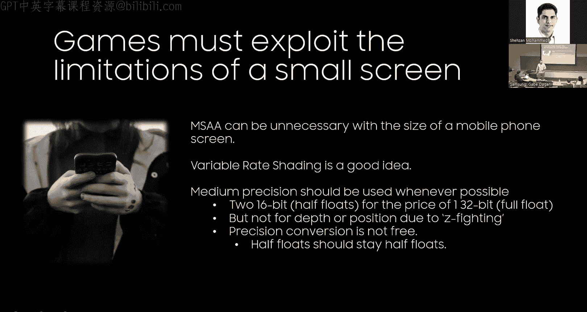

Games must optimize for cash usage。So be attentive when labeling memory。

Make as many buffers read only as possible， that seems like a pretty good idea， right？

You don't need them to be dynamic because they don't need to be dynamic they don't have to be shared if they don't even be shared don't need if you can read them once and throw them away or read them once and then read them again later and have them be read only。

 it helps the cash policy and the GPU and the lifeOs and POs figure out what's the best and how to get rid of that memory or how to keep it。

Storeop don't care as your friend。Don't clear memory if you don't have to。

 don't invalidate memory if you don't have to because we don't do a store up， don't care。

You're basically saying like keep it around just in case but if you're saying I'm going to write it to memory。

 I'm not going to read it for a long time to do a store up， don't care。

 It'll store it to memory and it will invalidate the cache。

 and then it'll allow you to have that scratch memory around。

 These are like subtle system engineering tricks。But I'm just trying to like。

Give you an idea that this stuff matters if you're really trying to get the most performance out of things。

Flow control is not horribly expensive unless。Your two F and L statements are completely different。

Like you should use if and L statements like。嗯。You're basically doing the same thing。

 but there's small variations and then you're going to get the most out of your cache if you have like i'm going to draw this and then i'm going to draw this completely different thing and they're completely using two different sets of resources than in you're trying to do it in the same kind of basic block。

嗯。Then you're going to thrash your cash。And so just be kind of wary of like maybe you should make a smaller shader if you're doing a shader and half of the shader is doing completely something different than something else。

 make that two shaders， attaches two different materials。Does that make sense， yeah？

There are trade off between。Having lots of shaders， like lots of pipelines versus。

I actually talk about the next slide。Um， sometimes you can use there's some tricks that are not new。

 they're like old hat tricks like these are like my dad used to say that trick is like this and this it's like when it was this old they already had a be beard this long。

 you know？And so not doing Fs and elses， but instead using step functions and zero math。

To accumulate the same response as if you did an if andL statement， you know what I mean？

I was thinking about that lately and wondering， like my understanding a flow control that you might end up with。

Doing both work both pieces anyway so is that really any difference in doing through or you're basically doing both of anyway if you looked at the code generated by conditional let's say it has a label it has some stack pushes stack pops and a go to。

And so that's like。And then there's like some iteration。and some conditionsals and stuff like that。

That that overhead's not free， it's not super expensive， it's not free。

 so if you're if your whole if thing says。If this red else blue。

Then just a step on the condition of this。Multiply and add to the condition of this and then what you're doing is a bunch of multiplies。

 which the GPU does for free。And then if you accumulate it and you get the same answer of if red or blue。

Then it's like you're doing， you're basically doing a lurp。Without the F。

I think like can put your words in， again going back to the concept of computers cheap。

 computers cheap， you then flow controller go tos and jumpets。嗯。

Pack vertices and attributes if possible in the smallest native format。

 this goes back to the whole like six half floats are good 6 teamss are I mean 32s are only used for position and depth and the other part is that sometimes a V4 is more efficient than a V2 two V2s you're not going to get that for free a lot of times。

And so just realize that if you can think through the V4 and hide information in X， Y。

 Z and W yourself。Instead of using2 V2， sometimes that'll save you a little bit because the compiler has to figure that stuff out for you。

And like I said， the compiler is going to be less good because it has a time constraint on how much optimization it can do at runtime。

More best practices reduce the number of render passes。

 combine GBuff and lighting passes if possible， breaking up bigger shaders into smaller shaders can improve performance。

Just because you're going to be doing less work， very specific and you'll be like very focused on the cash。

Right and the other part is using subpasses which are kind of controversial， at least in Vulcan。

 it has two benefits， one of them it saves the cost of a resolve。

Does anybody know what to resolve this？At the end of your shader。

 sometime you have to pack it or you have to change the color space or you have to do some kind of special no at the end of a shader。

Um to get it back into the frame buffer the way it wants to like you're most of the time in shaders。

 you're doing RGb。And then at the end of the shade， you might be doing SRGB。

Or you might be doing YZ or you might be doing。RB88， you know， some other random pixel format and so。

Because the shader are completely in RGBA all the time， RGBA8。

 that's pretty much how every shader operates internally。

 and then if you have something that's not RGBA， they have to do that pixel conversion。

So if you do subpases and your parent is basically working in the same data types as the subpast。

 then you can do that resolve way at the end versus having to do the resolves and then read them back in and then do the resolves again。

Does that make sense？Try not to read color or depth scil values from the frame and depth buffers。

It feels like that should be obvious， but a lot of people love to do GL read pixelix so to speak。

 also frame buffer fetch coherence， a popular one， especially for doing things like。Deals。

Like you got you know this super cool football player and you want to put a tattoo on them and so what you do is you'll read the skin color and then you'll blend a tattoo on top right that's actually a good usage for frame buffer fetch or JL Reap Pel but it completely destroys the latent senior pipeline。

You're basically saying， stop everything， I'm going to read this pixel。All right。

 you guys can continue。De buffer also， anytime you write to depth or do an invasive read。

 you're pretty much turning off any kind of earlier laency optimizations。No。

 you have early lights see and you have hierarchical Z， you know。

 it depends on what your GPU hardware does， but most of them have all of it。Course， Z。

 whatever you want to call it。你 know要。Trying to look up that systems of being。可以。Yes。Well。

 do depth tests。But in the shade， they' trying not to。Don't try to do the work for the hardware。Yeah。

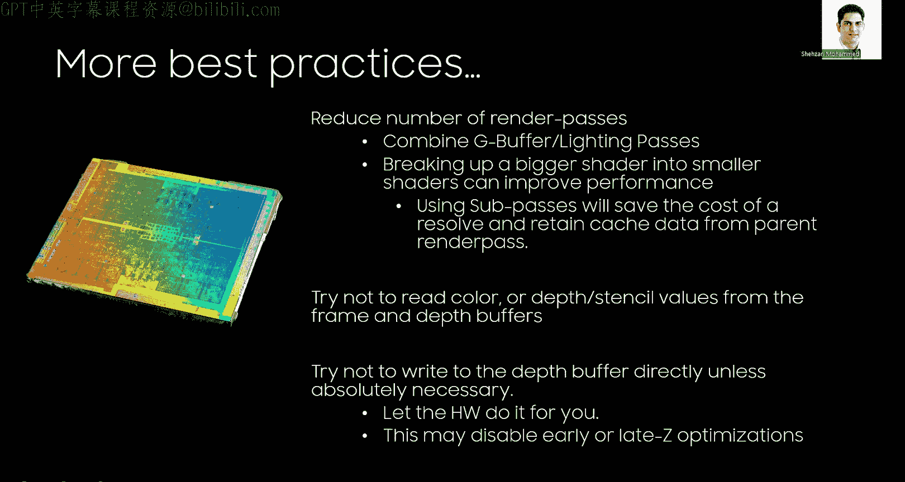

Okay， bar and graphics API， I love this picture because that's how I feel。

It's like they used to say about Linux， it's very powerful。

 it's very sharp and it will cut your fingers off。

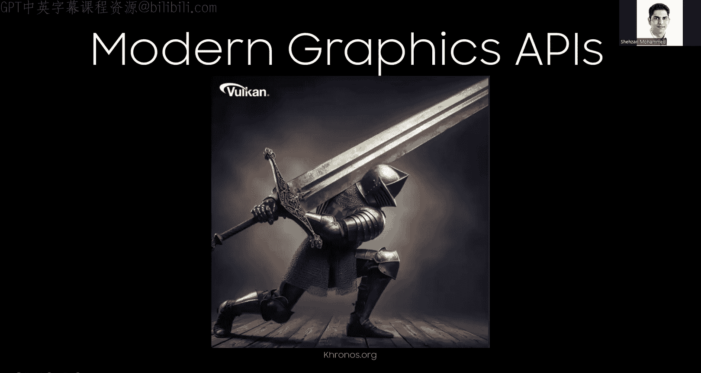

You know。嗯。New desktop games pre API， green is DirectX12， Vulcan is red。

 overall the overall story is that DirectX12 is doing breaks。

 Vulcan is doing pretty good but the low level explicit APIs are winning。ok。Now。

 why is Direct X12 doing so much better？Yeah。Actually that's pretty imperceptive， so yes。

 Dx12 is being treated as a hell， does anybody know what a hell is？Harbor abstraction language。Okay。

 because Dx12 is so explicit。You can actually emulate Dx11 on top of Dx12。And in fact。

 that's how they do it， so on a new Windows device。There is no Dx 11 native driver anymore。

 there's just a Dx 11 emulator on top of DX Dx12。I mean it's not funny it's actually really practical and useful Dx 9 is on dx 12 Dx 10 is on dx12 Dx 11 is dx12 so yes that's one of the reasons the other reason is because even if all the new games are coming they're being explicitly written dx 12 they're not really because they're being using a game engine and the game engine has been updated to Dx 12 now game engines on Dx12 have a。

Much more higher AAA focus because。Xbox 1x。Even the PS5 is a variation of Direct X 12。

 even though they call it PlayStation， something， something， PSGL or something。

Switch is using a deformed version of the X12。And then obviously windows。

Is using Dx 12 for all the AAA games on Windows and I have to be honest Apple doesn't belong in AAA like they're starting they just announced they're going to focus on AAA last year。

So they're much more of a creator environment and they do have games。

 but they're more like apps than hard corere games。

So DX12 is where the focus is once you write something in DX 12。

 you can actually get it to run on Vulcan fairly straightforward。

 like the translations not that big of a deal， in fact there are translation layers like DxVK。

 which does DX on Vulcan。Or Vulcan on Dx。And so that's one of the beauties of it。

 so the other part is that Vulcan only really lives in mobile。

Now it is available on all platforms that's one of the like but like the。

What do you call it the ubiquity is really on mobile so Google's pushing for Vulcan to be the primary API interface to deprecating GL if you want to use GL on mobile you're going to be doing GL on Vulcan。

And in fact， at Samsung， we were one of the first to do GL on Vulcan。

 we don't have a native GL driver at all， and so our only driver is Vulcan。But games。

 AAA games are having are not really being ported to lowbel as quickly because honestly。

 it's a little bit more awkward experience。You still want to play call duty warfare。

Which is a variation of call of duty if you still want to play like fortnite。

It's basically the same game with a lot lower level of detail。And that's fine。

 but sometimes you'll find that the。The variations on mobile are actually being written by completely different companies with a completely different engine。

But anyway， story I'd like to say is Vulcan's not winning， but explicit languages are。

few person that come to my and look in the chat first。

Do think well ever see a direct X for that for mobile。Um。

You know what do you think the market portal is the one that happens？

I'm going to give you a little skill button。HLSO。Is being the there's there's the the shader binary translator。

 the DxilL is being deprecated and then the。Yeah， so now Dx is actually being translated to Spervy as a first class citizen。

So now any Dx HLSl is going to have a。A Microsoft defined and supported Spvy creation compiled， okay。

 which is what Vulcan uses。So now both HLSL and GLSL， and now there's this new language called slang。

They're all going to be generating Sp V code， which can be read by Vulcan， and if I'm honest。

You know，70% of most games are shader。So that kind of makes the shader landscape kind of even playing field the rest of it has to do with like the state binding calls and scriptor management and that stuff has already been kind of figured out by all the big game engine companies anyway。

 so pretty soon they're trying to make it where the game API is for reference versus required。

And it's kind of been I mean， I feel I'm honest Chrons is a fast follower of whatever VX does because the same IHVs or independent hardware vendors are working with Microsoft as they are working with the open source community so the same people are in the room and they're pretending it's clean room but it's really not and they're saying yeah。

 we already know if this is coming for Windows so we're going to do the same thing we call it something slightly different for open source。

对。I think sources is only from after。Well， it's a lot easier to make change when you have a dictator than it is when you have the committee。

Also， it's not bad to be a fast follower because if they make a mistake， you don't have to adopt it。

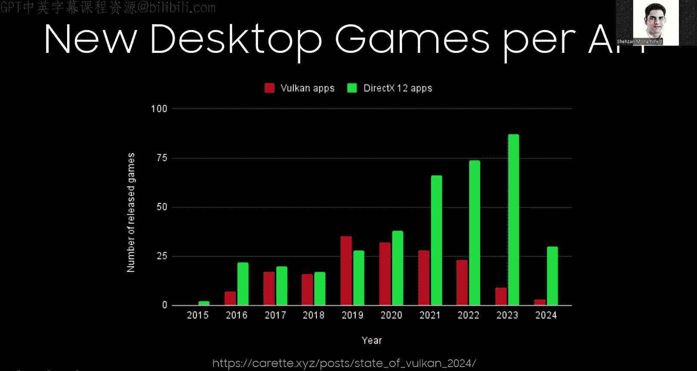

I'd like to talk a little bit about OpenGal book， how many of you guys know OpenGL。

How many of you guys know Vulcan？Do that again， we'll frame them high G。Put them down。Bken。

Basically the same， this isn't a very good sampling。继续点。😊。

The Open GL we need used for more than one project， Okay。

 have you used OpenGL for more than one project？Yes。

 have you used Vulcan for more than one project or outside of his class？Allrry， a lot less okay。

 and so openTL is great because you can do a triangle in something like100 lines of code。😊，Okay。

 vcan， not so great。Because it takes you more like a thousand lines of code。Now why is that。

 well everybody knows that because most of the classes speak in the choir is that they make you do all everything yourself from buffer management to threat management to descriptor management to material management to everything so。

But there is a benefit。

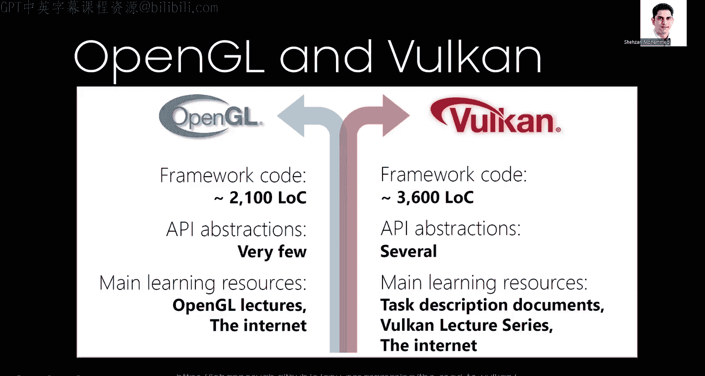

Of learning Vulcan。So yes， everybody knows Vulcan is verbose。

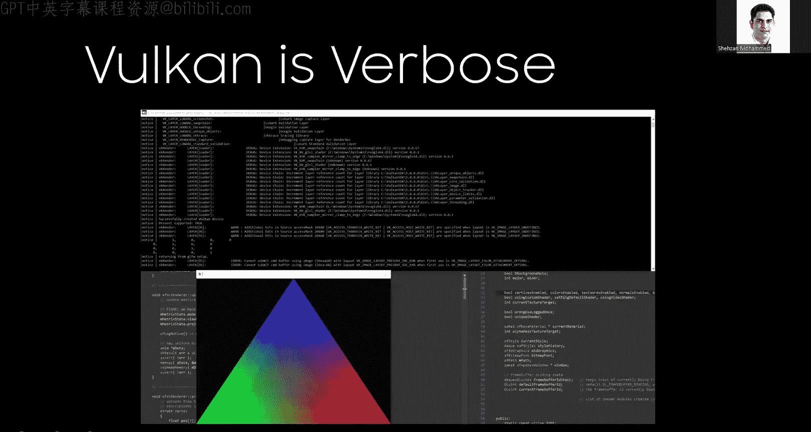

but don't treat your Vulcan first triangle as a metric for if Vulcan is good okay。

 and the reason is because that initial plateau is super steep。

 but then it starts to even out and you start to have a better grasp of how graphics work if you know Vulcan versus if you know open GL and actually there was a paper out。

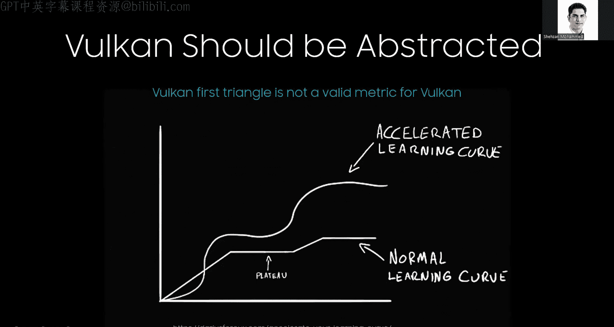

A paper is called Vulcan All the Way， transitioning to a modern low level graphics API in academia。

有行的松。No not this one I've seen a similar one that argued for web GPU as the next like baseline graphics API yeah so this one is an interesting one and so one is an A and five is an F okay？

So you're saying people who learned openGL， we basically had the same number of Fs。

 like if they didn't get graphics， they didn't get graphics。Okay。

 but then you start to see a push to the right， basically saying if they put that effort in to really understand Vulcan。

They're actually getting way more bees。Then over here。

 which was they were getting D's and C's and B's and A's and so if you put the effort and to get it。

 you really got it so one of the problems with openGL is why did it do that I don't know it's in the driver。

But in Vkecan it's like。Everything's so exposed， it's like you're the mechanic。

 you can look at it and be like， well is， I didn't use the right flag。

This in the documentations right here， whereas open GL， it was like。

 we hope the drivers doing something well or there's a lot of stuff being hidden under state machines。

But with Vulcan， everything is so explicit， it's like almost like writing assembly。

And so if you really understand it， you understand it， and so if you look at all these other metrics。

 what I just want to point out is there's assignment assignment appropriateness， difficulty。

 there's and usefulness and basically everything's shifting to the right with the candledsticks getting a lot smaller which means that as a learning language。

 there's going to be a high initial first triangle barrier。

 but then after that people are going to really kind of understand graphics for like how its with the machine a lot better。

Okay。So modern graphics advancements。Yeah。对。Yeah。here， but why can't it。

Why can't you sort of have the best in both worlds where it's like the defaults allow you to get started very quickly。

 but if you want the。Low levels they're available well we do so remember I said something about how。

And audit did they say it said something like explicit languages are like a how like Dx 11 on Dx 12。

The idea for Vulcan was never as a。Exposed language to the masses。

It was meant for much more explicit control to the engines。

So if you want to do graphics and you are not a graphics like super nerd。All of us， hopefully。

Then really， you're going to be using unity on real frostbite and you know， 10cent whatever。Um。

 you're not going to be like creating your V V and render unless that's what you want to do as a hobby on your weekends。

Not to say that you can't， but if you want to get started and I think this is I mean it's almost like reserved for academia right you want to get a first triangle and you want to know how to do every single。

Every single step to get that first triangle and get those pixels drawn exactly how you want that's exactly what academia is for the same way like when you're in a computer architecture class and you make an ALU from you know gateates。

You know， you do it once and then you let somebody else do it。Okay。

 you understand the principles so you can extract from the principles and create something more complex。

Vulcans kind of the same way Vulcan is you get the ideas。

 you don't understand what Vulcan is doing underneath knees。

 you could probably debug it if you need to， but you're going to let somebody else do all of the handholding and that should be an engine or you should create an engine to do this over time and that way you get the best of both worlds you allow the engines to be a lot more efficient because they have a lot more control。

But you get， you use the engines because they expose things hopefully to the masses that are more and more useful。

Yeah。Because the other cases were been。Are writing things spin way。

Maybe spoken which actually doesn't want like they based on their specific sense of oh if you want to do this。

 you have to do it this way。So yeah， I mean。So there's there's this like， you know。

 you can please some of the people some of the time。You know， have you heard that quote。

 we can't please all the people all the time。And so both unity and Un try to give you。

Enough rope to hang yourself， but not enough rope to hang in them。这。

And so there's going to be a little bit of like trade off between you getting full control and them giving you full control and also them being able to support everybody an ecosystem。

So I think there's going to be like that's why a lot of game companies。

Will buy a license of unity and completely。You know， do their own thing with it。

 they like take it as a base reference。And then they completely just annihiillate it。

And then another thing is let's say they're doing something completely wrong。

 what we usually find is oh they're using unity from 10 years ago and they're pole engines based on unity and you fix that in unity upstream from like one year ago and now you have to backport that change back there because they're doing something completely wrong。

いすませい。Soccer engineering。

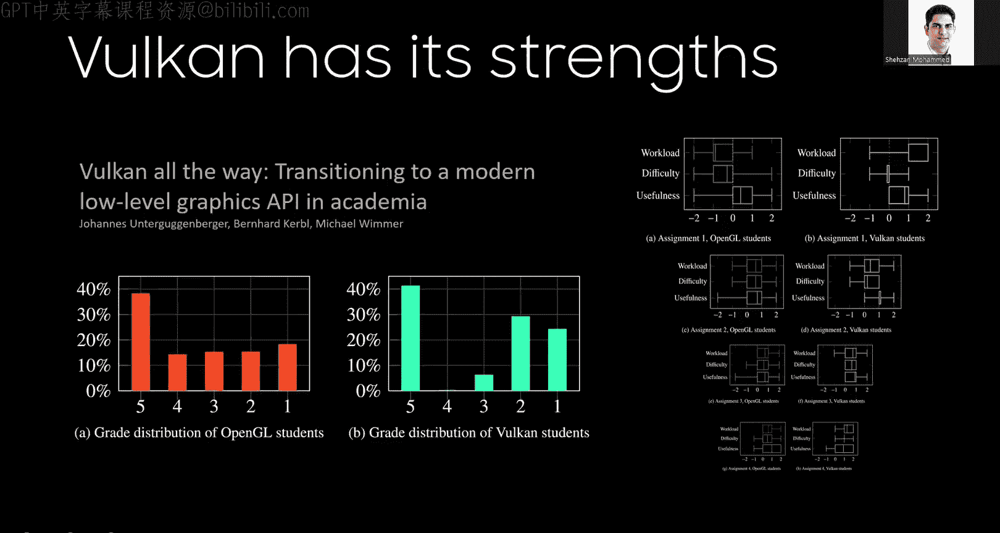

Okay， so we were talking about the superscalear frame generation at Denos。

 you want to do it all on the same neural net because if you're going to do all this work。

 you might as well train it to do all three things at the same time because it's amorphous blob of God knows what？

And but it's so expensive and you can only do so many millions of parameters on a cell phone。

And so you have to make sure that the quality of the IQ is good on the superkilling that you train it well enough that you're not gonna have ghosting and the denoising is good to make sure that the tradeoff。

 the uplift you're going to get from only rendering a small box and making it bigger is that that overhead is going to be hidden by the cost savings of not actually just doing the rendering yourself and I have to be honest we're kind of at a zero zero right here it's not quite a super win yet but as the scenes get more pixel complex I think that we will hit that boundary where it starts to become a killer rep I just don't think we're there and we probably won't be there for two or three years on mobile。

 but we're definitely there like Alllan W2 is definitely there today but that's on like a 4090。

Give your a signature because。The current geometry textures other requirements of mobile are already set lower than well and we're so power conscious and like these things。

 let's say it takes。Right now this neural net probably takes like eight to 10 milliseconds。

 so if you're trying to hit a 16 millisecond timeframe。

 then you means you only have six milliseconds of actual rendering。So is it going to be good enough。

 are you be able to put enough？Complexity in that six milliseconds to pay for the 10 milliseconds or do you need to wait for the GP and the CPUU to increase enough that that 10 milliseconds from neural net actually comes down to  six milliseconds。

 then you can do 10 milliseconds of rendering and six milliseconds of upsscale。

And right now that ratio isn't correct yet。Yeah。好。好对。Both and。

I would say both of those things are true and if we can make it like if we can train things and we can。

 I don't know what the word is， but if you can scalp it down to reduce the parameters to a point where it is a performance。

Then in order to， then you have to ask the question of like。

Here's what I want to get and let's say it's going at 20 frames a second， it's very complex。

If I scaled that down from 1080 to 720 and then scaled it back up。

Are we like if we're hitting the same like if we hit just the same exact quality。

 then why do all that complication just render it we have to get a you have to get a amplification of quality。

In order to make that worth it at all。And so that's going to come with two things。

 one is going to become the proliferation， I can't talk the proliferation of RT is going to make that more likely because RT is like having a supercomputer on every pixel。

And so the more RT you can save， the more likely that this will benefit because also the dennoing is also going to reduce the RT requirement。

 and then the frame generation is also going to improve it because it means that really instead of talking about 16 milliseconds we're talking about 32 milliseconds because you're actually generating a completely new frame。

Yeah。So， I don't know。哎，啊对。Most of this so far has been about light。Dealing with it， you know。

 given the constraints of limited battery， how can we make far and more efficient。

 but obscure you know anything about like what is what is the landscape like？

Development on better batteries in general that oh super bad I mean cars have done great for batteries。

 but they have a lot more physical surface area and volume to work with in a phone。嗯。

We're at the point now where like if our chip is a tiny bit bigger。

 they have to make the battery a tiny bit smaller because there's so little space in that box。Also。

 batteries heat up too。And so they're also adding to the thermal profile。

 and so even if your battery was like huge， then that would mean that your thermals were bad because batteries don't dissipate heat。

 they generate heat。And then， you know now you're slow down your speed anyway。

And so there's this like very。Crazy trade off and then the chassis actually plays into it and they're trying to throw like heat dissipation materials and thermal dynamics into it just to like remove as much heat as possible and so I don't know enough to like tell you for sure。

 but I don't think battery technology is moving fast enough。

And not of the space speed of like AP progress。嗯。And so we're going to have to we're basically going to be stuck at that five to six million five 6000 amps for a while。

 so it's almost like fixed pixels， fixed battery。Basically fixed wfi。

 you can't change frequency ranges， you like multiplemlim。

That's why like Wi Fi7 is really just like three Wifi6 is like jued together。

And so we're coming to like the point where we have to make huge physics breakthroughs in order to get some interesting things to happen and physics is hard。

So it's not as easy yeah。Yes。It like switch It's the index size。Then you' on the55 my tablet size。

 very different thing and like。I'm talking about。Aret like smart one really ethical the whole where theyre just want to be fair。

No as a consumer it's kind is I think it's thin enough and so I think we've we're basically reaching the。

How many years have there been cell phones like 20 some years。

 so we're reaching the point where people have found the。

The forms they like and now you're doing the flips and the flips are interesting for some and not for others and things like that until like a major paradigm shift happens like Star Trek where everything's just a piece of glass or some kind of like you know piece of like you know serran wrap or something we're pretty much kind of like' we've approximated where we're going to get to within reason and so。

Volume of the phone stayed basically the same pixels are basically staying the same we might fold them in half I don't know batteries kind of staying the same until something happens and so。

The problem they face is really constrained and so we have to do a lot with silicon and then glass is interesting。

 maybe they'll do something different I don't know， material science is amazing。

I just that's not my field， so I just wait and see just like you。

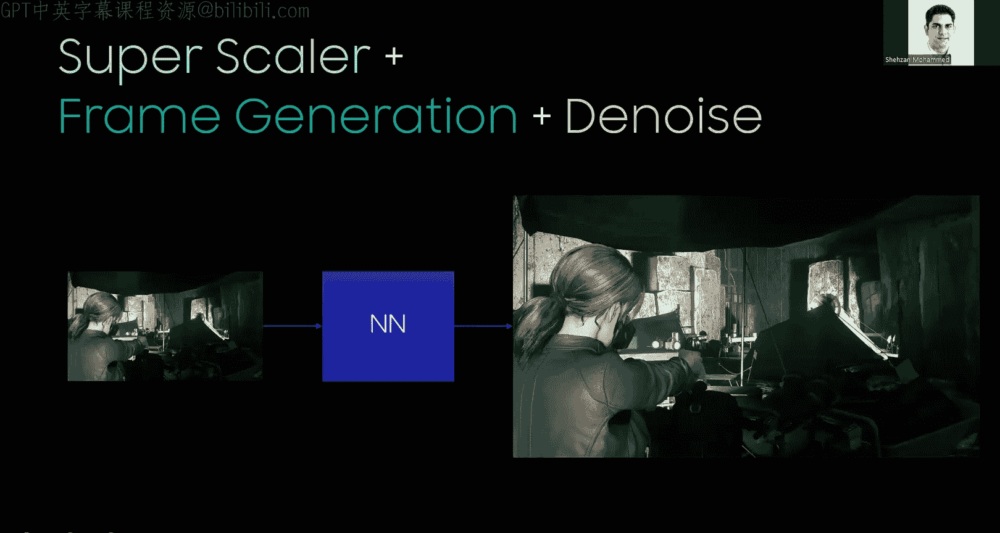

Yeah。Neurural rendering it's my favorite slides I show it every year。嗯。

So I kind of feel like that's how I feel like it because I'm like I'm like a classical analytical renderer guy and now they're saying no machine learnings can take over the world and I do think that it is going to provide a lot of goodness。

I think。It's going to provide a lot of good initially it's going to be offline for content creation。

Like if you create a model， you use AI and it can generate the meshes or the textures your God knows。

 whatever。Um， but in runtime， it's still too expensive to put on a phone unless you're doing some kind of server cloud client thing。

So for me， it's like a little bit into the future and until they can figure out really how to clip these parameter sizes down on these neural nets and make it so。

 you know， it's easy to run， here's the thing， even if we get it so our phones have an NPU。

 which is a neural processing unit。Even if we can get it down to the NPU， which is like 40 tops。嗯。

The power cost of transferring data to the NPU and to the GPU is so high that we basically have to do those computations on the GPU not to lose that transfer power。

And so now we just have to do all ML on the GPU in order to make it worthwhile if it's neural rendering。

 which means that neural rendering really becomes a GPU operation， not something you can offload。

And so you're stealing from Peter to Paypal， you're stealing from rasterization and rate tracing to neural render。

And so you really have to make sure that it's proficient before you can like jump all in。

And we' just had too many years of perfecting raster and now getting ray tracing under control to like say neural rendering is going to come in overnight。

 at least for mobile。And that because again， going back to the constraints。

 the chip size remains attain the number of transistors you're putting in generally is increasing by like 10 to 15% so so the transistors on there you have to take from GPU to。

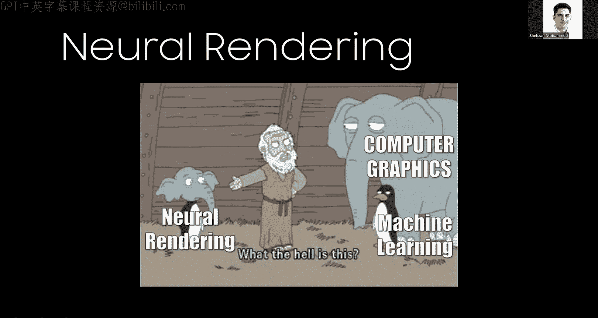

Or no， not even， I think even if the NPU grows and the GPU grows and the NPU can do this in a heartbeat。

 just getting the information like a full frame out of the NPU and putting it on a GPU costs a lot of power。

And so that transfer of frame data is not free。And we have to do this 60 frames a second。

 so 60 transfers， every frame is like eight megabytes。

And so it's all it's not just that just the power， not to mention all of the actual processing and the cash and everything like that。

So there are two interesting areas that we're focusing on。Neural radiance fields so you guys。

 you guys， I don't want to preach the choir， you guys have seen this to death， right？

And then neural texture compression， compression sh。

 those are two areas that we're kind of paying attention to because well neural texture compression could probably happen mostly offline if we can get a good inference to decompress。

 that's an interesting use case to reduce palets。And then the neural rendering is interesting in case well it's just interesting。

 I think it's more interesting for the camera and video locks。

Because then you can kind of get a three model from your phone。

What do you think of neural texture compressions compared to the GPU encodeed textures like ETC1S。

 UA PCC and so as that？I think that I'll call that analytical compression versus like machine learning fuzzy compression。

 I think fuzzy compression has a lot more potential。But ASTC is much more reliable。

And like predictable and low power so ASTC is going to analytical is going to win almost every time if you get a really good model down。

 but then the ML stuff has so much potential and everybody's always looking for something new so I don't ever want to downplay it because I don't know enough and we haven't reached its potential yet yeah。

嗯哼。😊，So。That's actually pretty interesting， I would actually say what if you created like superts with all of your character UVs in them？

Then if you could compress like if you had one texture per game。You know。

 you just found the Uvs and the Uvs had 64 bit per precision。I don't know。

 I'm just throwing out an idea。Uber texturerous。Yeah， I don't know about that。

Research guys will figure out something pretty clever and I'll be like，ooh， that's pretty cool。

But I'm not going to be doing it so yeah。Another thing is that like GP GPUs as GPGUs is not going away。

 in fact it's kind of accelerating especially with the machine learning acceleration。

 I just like this slide。I was a kid when the original transformers came out。

And so this is just becoming more and more true， like our compute team's getting really hot right now。

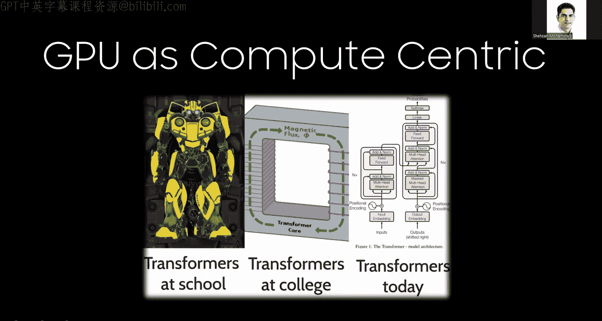

不对。And then I show this light every year， concepts without capability will temporarily fail。Okay。

 I've been in multiple projects there just out five years before they should have been out。Like the。

 like I would say。VR is kind of that perpetually。AR is getting a little bit better。

 but it's also like that like the technology is not quite there， but they're hype is。

Um and more stuff like I think ML is also here right now。

 at least for mobile and a lot of experience， I think a lot of people are saying that ML has so much potential and I agree。

 but they' they're the let's take call it the imagination of ML is kind of frustrating a lot of people。

I'llucinate thank you， hallucination of it and I wass kind of frustrating on people。Sorry。

 some questions。是不是不要钱。Oh。What comes to mind of technology that's very prominent today。Many。

 many earlier， which is a block。 And then again， as a block。 But then now it's。How。嗯。

That's a good question I actually think。Next。I mean， nothing's ever perfected。

 but there's a lot of things like I think。In the automotive space， it's pretty interesting。

We're getting to the point where I think in the next few years。

 you won't have rearview mirrors anymore。Because as funny as it is。

 rear vieers are 20 times more expensive than a tiny little camera and a screen。

That's what I mean side mirrors， yeah， all mirrors and cars are going to go away。

 they're going to become cameras and screens。Because you're already going to have the screens。

And the， the。The mirrors themselves are kind of like aerodynamically dumb。And yeah。

 and so those are kinds of things that like。You wouldn't have said that the other thing is like。

I do think like watches are now mainstream。I think before it， you know， when I was a kid。

 they had like calculator watches there but was like that's super cool so remember the Cassio calculator watch that was a that was a wristwatch computer back in the day。

I don'tIt looked a little bit like this， except it was all on one screen anyway。I had a palm pilot。

Yeah， the Apple Newton。Apple Newton was the first like pocket per computer。

And then you had the palmpi where it had its own little scripting language。And then you had。

I actually， I'll tell you what， I actually worked on some of the original MP3 players。

With fixed flash memory， and we had MP3 CD players。

Where we put MP3s on CDs because back in the day when you had CDs。

 you can only fit 10 or 11 songs on there。And then they compressed him and put on could fit 400 songs on a CD。

And so they had to create the put the codex on it to read the digital information and could decompress it for MP3。

 and then we had fixed memory so you didn't have the spinning motor。

And then the iPod came out and everybody died。But I was there and then the phone came out and killed the iPod。

Right， and so you just have this like。You know， it's the triorder effect。

 anybody know what the triorder is？You ever in Star Trek？

So back in the day at Star Trek and you had this little thing that kind of looked like it was a flip open and'd be like he has cancer and anyway。

 so they would be like。You know what I mean it was like it just did so much stuff and it was all just one big science fiction like there was magic in this thing science fiction it does everything and so there's this triquarterder effect where people are saying you know if these tiny things should do more and more and more than they are like your watches can tell your blood pressure。

 they can tell you're having a heart attack。You， know， your phones can like detectives like。

I don't know to so much stuff， right， do thermal imaging。You can do so much stuff now。

 and so I think it's just kind of this amalgamation of small steps。

I think if you were to ask somebody from 30 years ago and show the phone， they would freak the F out。

嗯不嗯。You feel like。わけ是哪这。biographic a lot of。It was by like material sciences things。

What you were saying about，Or the battery technology get better and then make the RNA。

I really think so too I think。Part of the whole dizziness effect is the fact that。

just the ability to， they call it chasing the beam refresh fast enough that doesn't make people busy and also follow your eye。

They need to sink that needs to go way faster and then you need to be able to power that up。

 but I do think that like the killer app going to be AR not VR。All right， careers and graphics。

 this is the final part。So what is it like to work on embedded GPUs？Here's kind of soup to nuts。

 three years to three months to three weeks， so three years in the future we're already planning the chip for three years later。

We do marketing requirements gathering to kind of look at everything out now the nice thing about being a mobile is we can look at a lot what's happening in desktop and if it makes sense and you want to put in your pocket we can probably say yeah that's probably something we want to plan for。

Software hardware code design， how are we going to make those performance because a lot of times it's just smaller faster。

 cheaper right how do we get things smaller， how do we get things faster， how do we do it cheaper。

Hardware architecture。We have to design what features we're going to put in if our silicon staying the same size。

 let's say we have to take features out or polish them to make them smaller in order to fit new things on。

Hardware RTL design， validation， validating the RTL， doing software emulation。

 so running our driver on top of an FPGA with the hardware on there。

We got physical design device integration where they get the recipes and they call the PDK physical design kits from the Fab in order to put the transistors on the wafer。

Software driver validation after we get the chips back， GPU tools， it's ecosystem enable。

 we have like， you know， you know， frame debuggs， frame profilers。Device productization。

 application development and field application engineering， which is like。

The phone's out in the field and this game developer saying my game's crashing on your phone can help me or a customer says this is problems only happening on this phone or。

Cashs。Instability。

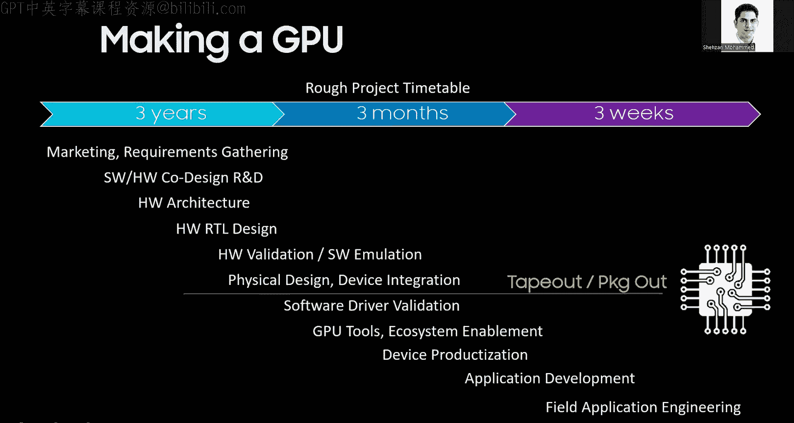

In my organization， we have to support， I think Europe just passed a law something like five or seven years。

 we have to support operating system updates on phones that way phones stop being a disposable device and starts being something that you keep for a long time like a car。

And so we're constantly， we're not really doing any new feature tuning or performance tuning。

 we're just making sure we don't kill it and then we do OS updates you know。

 for n minus something in the future。We have package out and then three years in the future we're using an old OS for what it's going to ship on。

 and then we do feature specs and then we do feature development and then we do OS integration right before we tape out and then we do development and validation。

 we have architecture， development validation， product release and maintenance。

So this is kind of like we do a new phone every year， I was telling them like。

We get the new silicon Christmas Day like baby Jesus。

And then we have up until like October the following year to get it like product ready and polished and then we get a couple months of planning and relax time and I get to give talks like this and then Christmas Day comes over and everybody freaks out。

 we do power on， we do driver bring up in Christmas eta cetera， rinse and repeat。

How is the conspiracy theory about oh， my phone got a new operating system update faith。

And my battery slow because the new form came， that's only Apple。U。No。

 I think what happens is that there's going to be feature creep， so every operating system。

 no operating system would be like hey， we reduced 300000 lines of code。

 no operating system does that。They keep trying to add new and new things and then there is something there is real battery fatigue。

 battery fatigues real that's why like when there's that Apple fiasco or like everybody got a new battery and their phones worked amazing。

Is because when the battery gets fatigued and it starts like registering like worst speed performance。

 then the system itself has to reduce its performance。And so that's kind of like longevity。

I think what should happen I'm not， this isn't Samsung。

 this is Gabe talking is they should just make batteries a lot more switchable out Hu。

Like a lot more removable so you can update them and I think what you would happen is that you'd be able to get more life out of your I think the battery has way more fatigue quicker than the chip。

The operating system definitely has like feature creep and then the chip itself。

Is like rated for like， you know， like you think I always think about hinges， you know。

 I've ever seen like these things like this hinge is rated for like 100，000 opens and closes。

Well transistors are like that too they have a certain amount of like opens and closes that they have ra has that too where like after so many they just they their're physical materials they're going to wear up。

And so when that happens， like with RA， you can create a lookup table that says don't use that memory anymore。

 but for CPUs， you can't really do that。And so when a CPU goes Kplanc， it just goes Kc。

 but right now， you know， I don't know if it's five or 10 years， part of the reason why automotive。

Uses older technologies because they have to prove this out because their product life cycle is 15 years。

You want to own your car 15 years before you have to replace an ECU， which is the computer unit。

On phones the lifecycl used to be like two to four years and so you could use like cutting edge technology。

 you didn't have to have like a performance rating on how long the transistor lifecycle would be。

 but they do do these measurements where they just flip the transistors on and off continuously until it starts to die and then they based on the frequency and the amount of time they tell you that's how many times the transistor is going to go up and down。

And so there is a life cycle like an old hige wearing it。

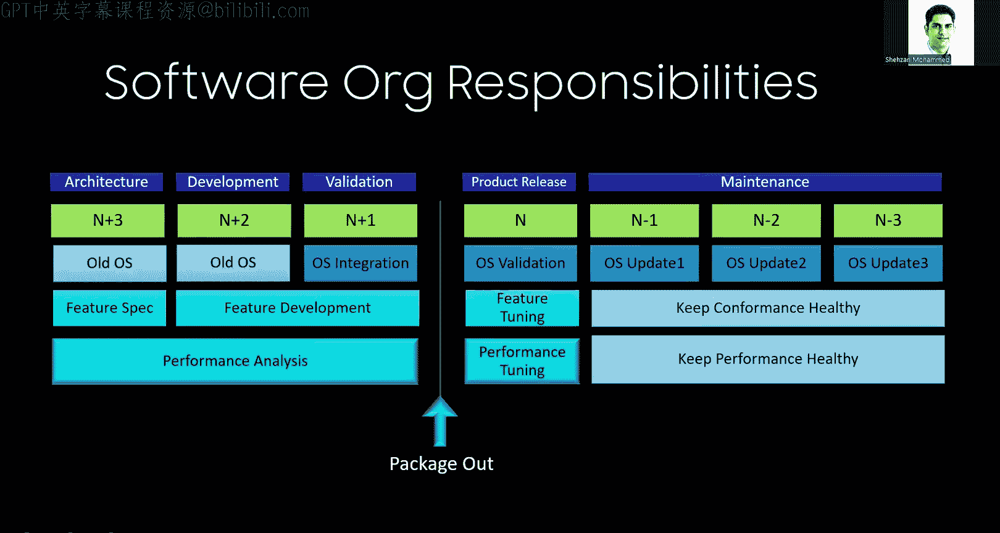

So pre silicon development is kind of interesting， how do you program on something that doesn't exist？

And we do this a lot through emulations modeling emulations and simulations so modeling is like a Coargraed model which is saying if we double the number of course what do we think that will do for our performance if it only gives us 10% it's not worth it what if we made the AOs wider what if we added cash or L2 cache or L1c or the last level cache what if we added this what will that do so we do a lot of modeling before we start doing any kind of real RTL work and change the hardware and once they've kind of convinced themselves both with like configurations and FPGAs and with models then they actually start to put these features in because they can negotiate the improvements for the cost RI。

Once it's in that， then they actually take the RTL and there's something called a C functional model where they've created a complete software simulation on like 10。

000 CPUs of what the RTL is doing and then they independently verify the RTL with the software simulation to make sure that they both have the same performance on the same complex inputs once they do that they feel like okay。

 the RTL is not completely bogus anymore。And then we put that RTL into an emulator。

 which is a huge FPGA server and then we actually run things and let's say to get to Android home screen or to do like first triangle。

 it takes hours and that's okay because we're basically proving the entire stack before we get it and we're kind of making sure the test so what would normally take eight hours might take eight weeks。

But what we'll do is we'll cut it down into unit tests and we'll run them and make sure that it's mostly okay before we go to tape out and waste any kind of fab time。

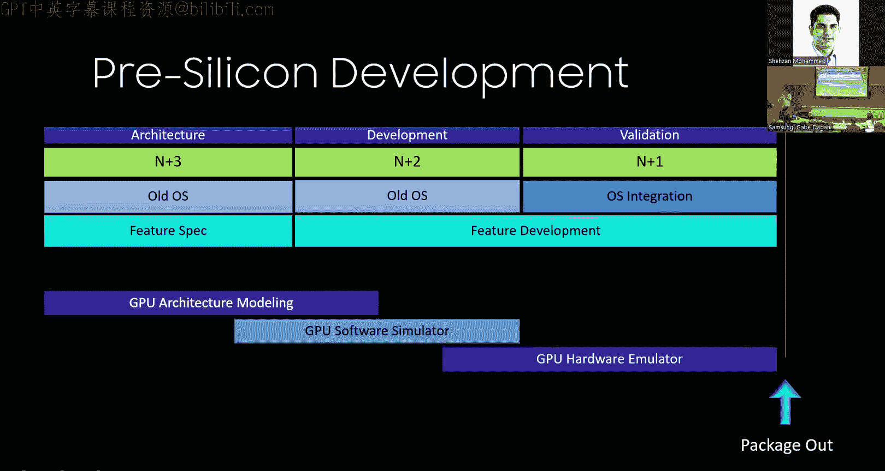

Careers and graphics I think these are kind of obvious for we have visual effects physics and physics modeling so a lot of guys I worked with at EA have now moved on to places like Pixar or they've moved on to like Lucas film they've moved on to like a lot of these companies that do like Houdini and all these other things which V effects they come up with special effects by like wrapping light and doing all these kind of models and pretty cool stuff they're almost all artists artists with math backgrounds。

Then you have game engine developers， which are more like they work with the artists and they try to come up with a lot of kind of canned possibilities for how game engine people can make special effects。

So think of it as like a bunch of scripts that are prewritten for you that you can put into a game to get the effects you want that somebody else has already verified that's a game engine developer 3 d tools maker is also similar where you're trying to create artifacts meshes animations。

Agnostic of the game that it's going to be in so other people can use them。

And then you can sell it on some kind of content zoo。

Or the tools itself get sold like Maya and 3D you know blender and all these kinds of things。

 you have technical artists， which are the guys that make things look pretty but they actually write the shaders and they work with the rendering engineers to kind of come up with that even trade off for image quality versus performance animators I've worked with a lot of them it's like。

They use Mocap or they might use like actual hand animation material designers that just literally create textures。

and then lighting experts， and I think if I'm honest。

 a lot of that category should be nervous unless they learn how to leverage ML to make their throughput a lot higher。

跟住四唔到佢身到干得十几啊呀。I think a lot of the things you're seeing at SigGph now are like how to make that third column a lot more high throughput。

Using Ml。Or AI。

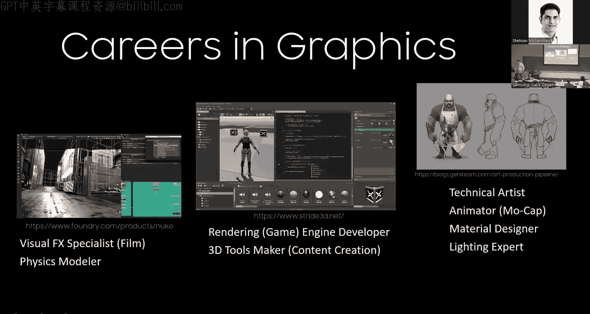

Other areas are you have like I call embedded computing like in cars， you have like you know。

 steam decks and so forth and you have like。You know， cloud computing。

 which is where a lot of the training is going on and they all want GPU people because you can make their training and learning a lot more effective and efficient。

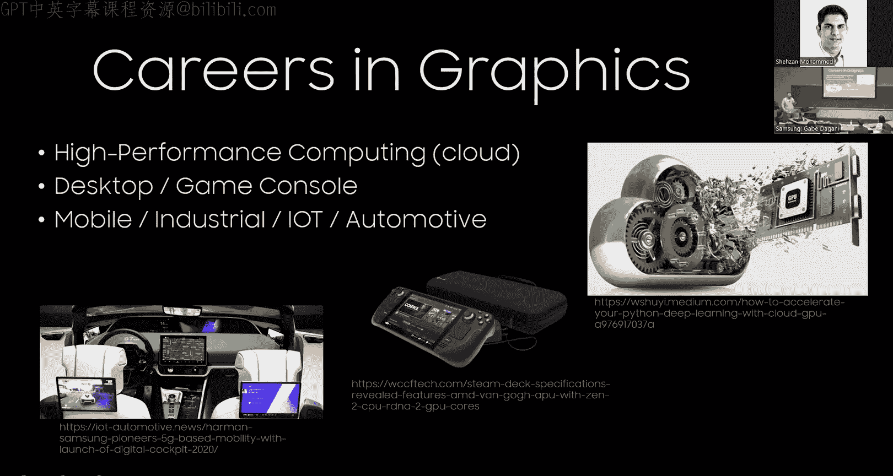

And then just in terms of like being an engineer in an engineering world。

 some of you guys have had jobs before you came back to grad school some of you have never been out in the workforce。

 so you always start out as some kind of engineer engineer too I think if you get an undergrad degree probably start out an engineer and if you get some kind of grad degree this might be a master's or PhD some kind of blur there being an engineer to a senior engineer which is kind of like。

You know， it actually does a great job self， I just trying to do what somebody else has told me。

 project， I get an idea of what's going on in my domain。

Team I'm managing people and am managing project and then here group I have multiple teams multiple and then principal is like I have a big perspective on what the business looks like and how our engineering affects the business and how you can work with multiple teams across a company。

And so it just has to do with like。Working from the mail room all the way up to the top it's always a good thing if you jump too high you're going to be out of your depth and so it's always good to kind of get flavors。

 but not just in one company I would actually say。Every company is like a university。

 but you get paid。And so treat everything as a learning opportunity。

 internships are good because you get to try out a company and say do I like this。

 do I like the work， do I like the company， am I seeing what I expected to be seeing is this going to grow my perspective because I've worked if you work on the driver。

 it's like you're being a mechanic if you work on the games。

 it's like you're being a driver of you know like if you use the cars graphics。

Like driver guys like being the mechanic。Uh， the being on a game might be like， you know。

 driving the car， working on a game engine might be like designing the track。you know。

 and you know whatever so like you get a feel for all the different pizza and then you know being a principal engineer is like understanding like how you're competitive next to the other guy's car。

You know， so there's like， I don't know if that's a great analogy。

 but you get the perspective of all the different flavors and all the different ins and outs of your career by trying different things。

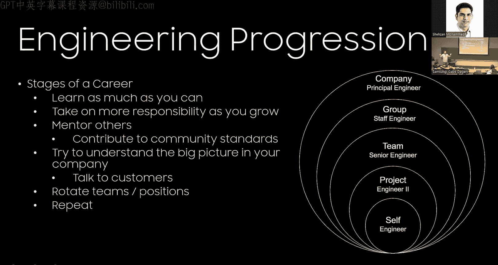

And Samsung is hiring。So I have a couple more slides if you guys aren't。Completely done with me。Um。

 one of them， as I did this last year， was I like to talk about wafer pricing and how expensive things are getting。

Back in 2004， a wafer at 90 nanometers was $2，000 and now in 2025， they're expecting a wafer。

 this is at TSMC that I want to tell you about Samsung。At CSMC。

 they're saying a wafer is going to cost $25，000， yeah。

It's a circle of silicon that you put chips on。I'm going to get there I'm going to get there and this is kind of just duplicate information。

 but basically saying in 2025 we're assuming and this is two different sources of information that TSMC is going to be something on the order of like for the latest and greatest process is going to be about 25 k away from。

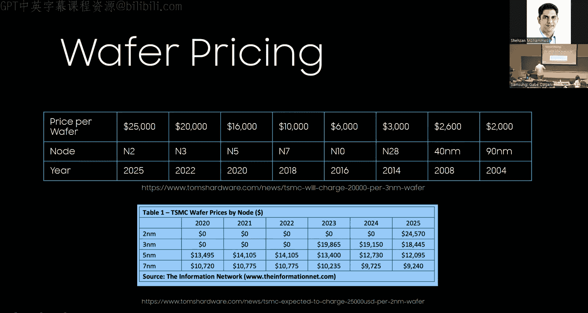

So silicon fabrication cost exercise， z 300 millimeter wafer。Okay， diameter。

 each SOC is approximately 100 millimeter squared。A 25 layer SOC recipe costs 20 k。

 I'll just do 20 because it's easier to do math on at three nanometers。

And 10% of the SCs are non viable because they like get cut off because it's a circle and you're putting squares on a circle。

Okay。Each package， because you can't just use the dye like it is。

 you have to put in a package with pins and everything like that costs about $10。Okay。😊。

So if pyR squared。That's the area 71，000， then you only get to use 90% of it because of the edge yield comes at 64 millimeter squared。

 you take 64 millimeter squared divided by 100 to get 640 parts。ok。20。

000 divided by 640 is about 32 bucks for each chip plus packaging about 42 bucks per chip。Now。

 have you ever heard of a yield be 100% and if you know anything， the answer is no。

 what if your yield was only 50%， then each SOC would double in price。

Which means on very new processes where you're getting 10%， that means that it's 90% more expensive。

Right。So that's an interesting thing， so now if your chip costs something like $84 and that's probably low。

 let's say it's 100 bucks。

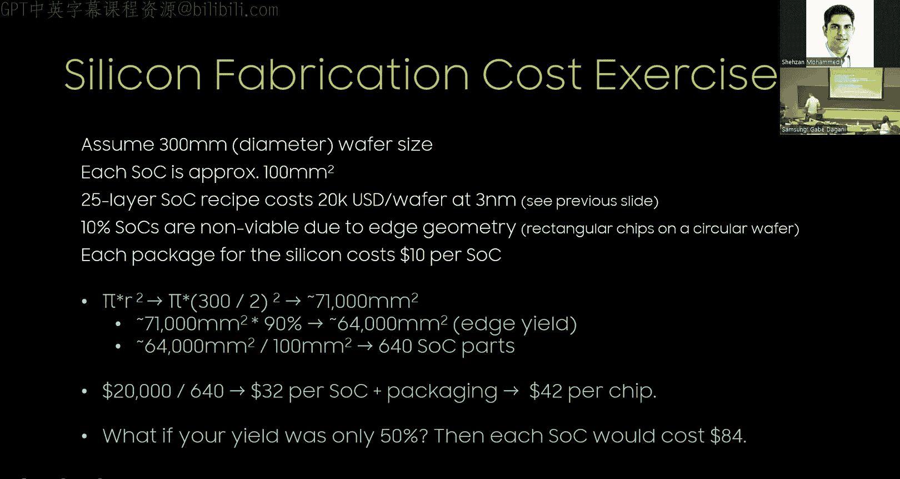

Then how does that roll up into the bomb a bomb is a bill of materials it's like all the pieces of actual hardware to make your phone and this is public information from this guy that looked at a Samsung Gal from a couple years ago he said 4 almost 500 bucks for your bomb。

Their processors are about $165。Your camera is about 66 bucks。Your display is 85 bucks。

 your memory is 50 bucks， and everything else is about 100 bucks。

And so you're looking at this and you're saying， okay。Let's say。

You know my chip was 84 bucks then youd get double， you get 50% margin，s not too bad。

 but you're also having to pay for all the engineering， all the research， all the testing。

lah bh bh blah bhlah blah has to get picked in。But when you start making more and more and more of these and you stop doing the research and you start selling more and more。

 how many， like I already said that the whole industry sells about 1。2 billion of these a year。

 so if you're making 50% margin on that it's not the bad。But let's just say like。You know， you sell。

10 million phones。So you just take that， so you're making， you know。800 million bucks， not too bad。

If this phone number is purely for a purely there's no software IP now Android's open source that doesn't mean it's completely free。

 we also have to pay the sprints and the verizs and everybody else for all their licensing and testing and verification。

 everybody gets us cut。So this this is just a bomb you buy your phone for。

Let's say 1200 bucks for a flagship。It's going up though。

1200 bucks for a flagship and I'm guessing another 200 of bucks goes to some the other middle men that make that phone happen。

You know。And then， you know， so it's less。I don't know the numbers， I'm not part of marketing。

 they don't showed me that stuff and this is on the web so I'm not telling you anything that's not。

Conjectured。

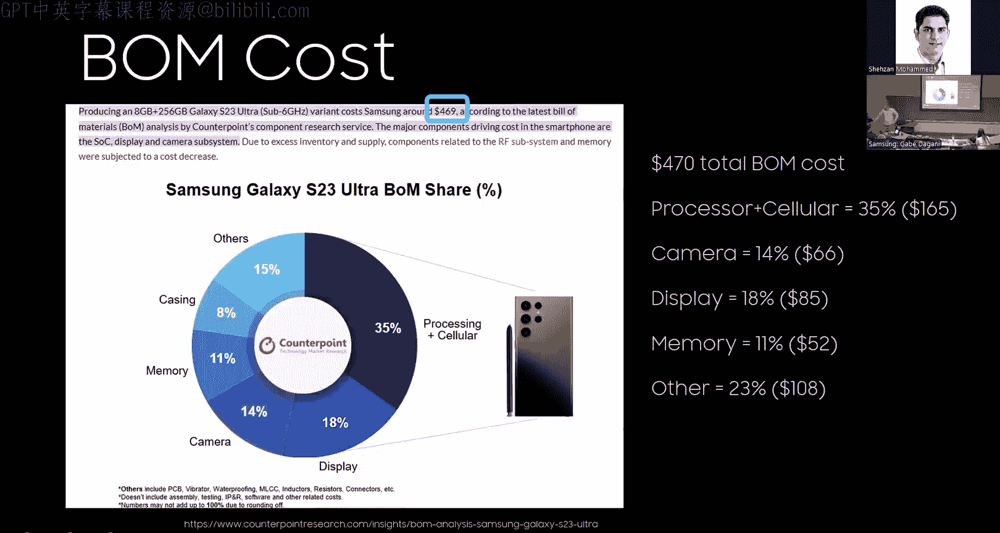

U and that that's pretty much it because everything else I think you guys know this is I gave this talk to non graphics people I said points and meshes。

 meshes and textures， characters， animation， pras lights。

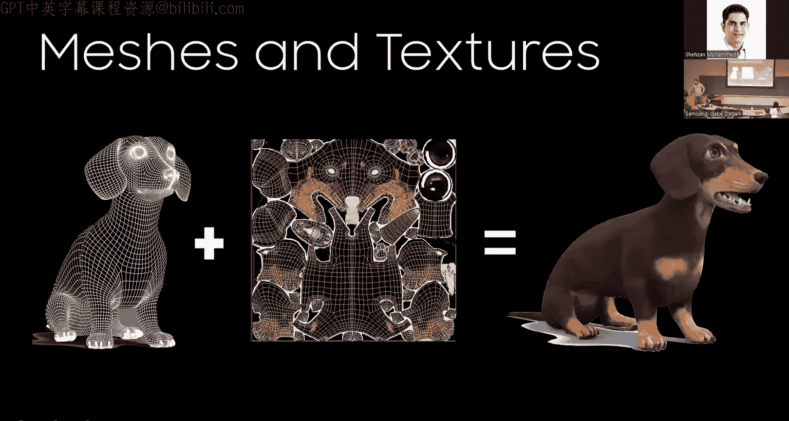

Graphics rasterization pixel， ray tracing， BvHs， that's up。

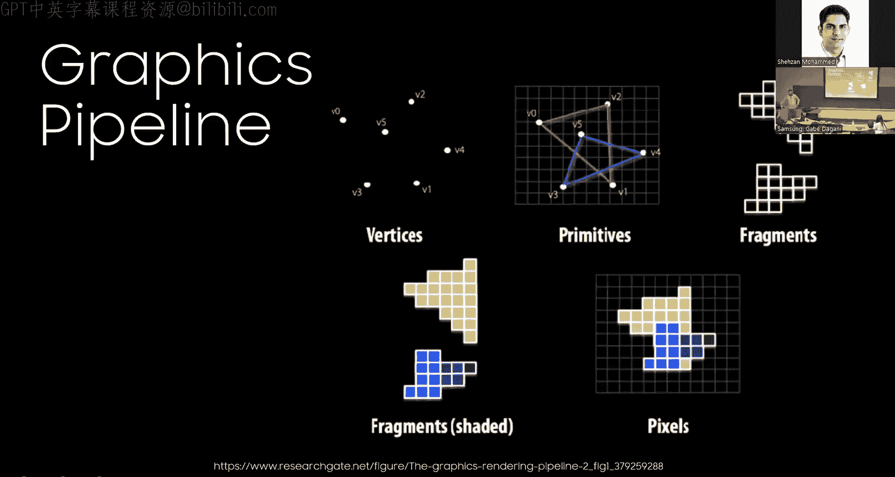

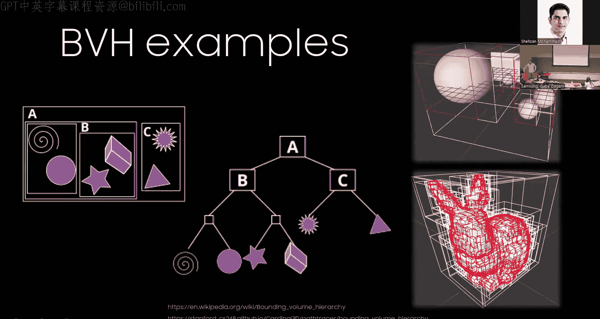

Okay。First let's thank you for his time and Mon。