# 004：并行算法 🚀


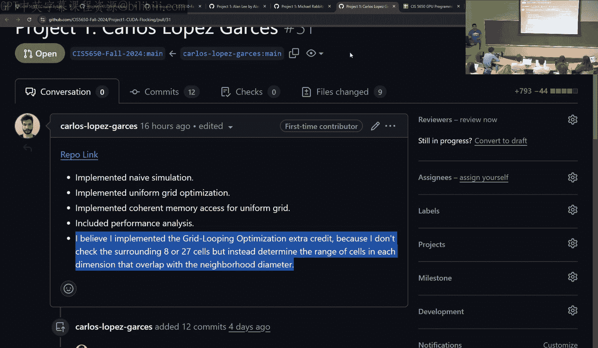

在本节课中，我们将学习一系列核心的并行算法，包括并行归约、扫描、流压缩、求和表和基数排序。这些算法是GPU编程的基石，能够将看似串行的任务转化为高效的并行计算。我们还将探讨如何优化项目文档（README）和图表，以更好地展示你的工作。


---

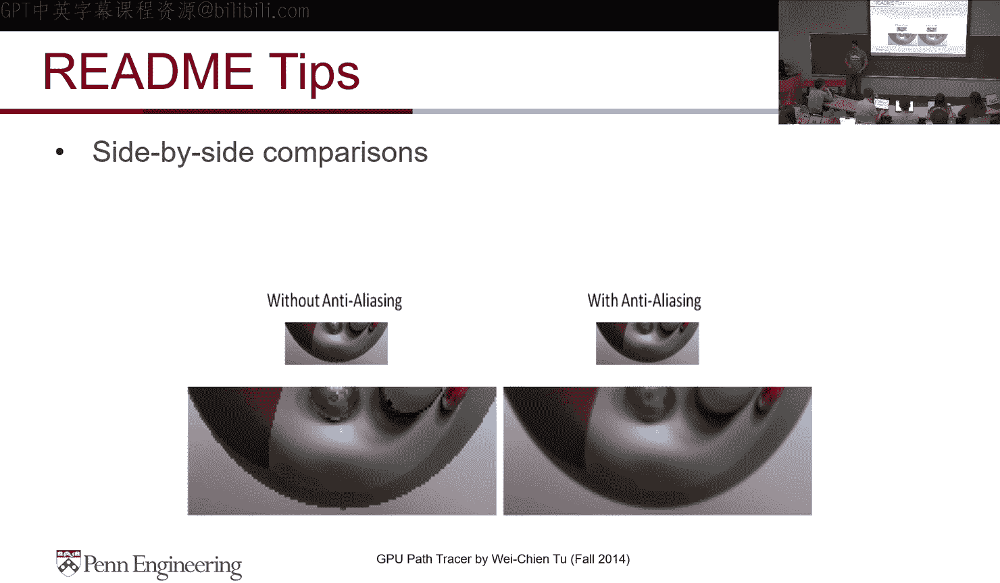

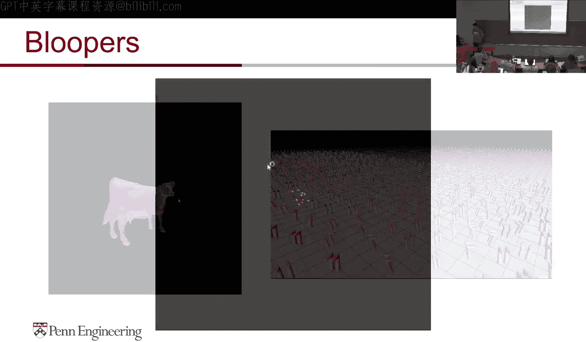

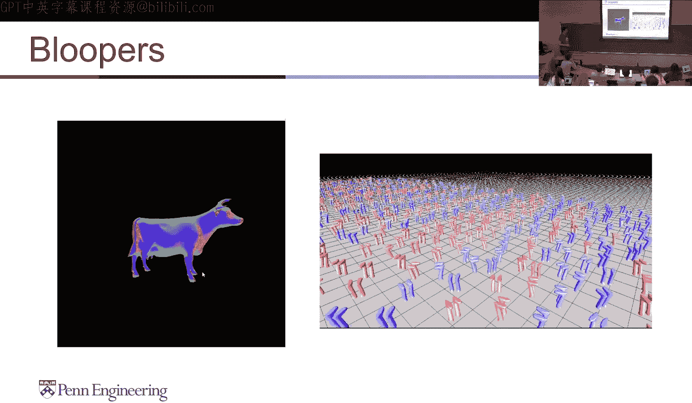

## 概述 📋

本节课分为两个主要部分。首先，我们将讨论如何撰写有效的项目README和制作清晰的图表，这对于向潜在雇主展示你的技术项目至关重要。其次，我们将深入探讨几种关键的并行算法，理解它们如何将串行逻辑转化为GPU友好的并行模式，从而大幅提升计算性能。

---

## README撰写技巧 📝

一份优秀的README是项目的门面，尤其对于求职者而言，它能有效向招聘经理和工程师展示你的技术能力和项目成果。


### README的核心作用

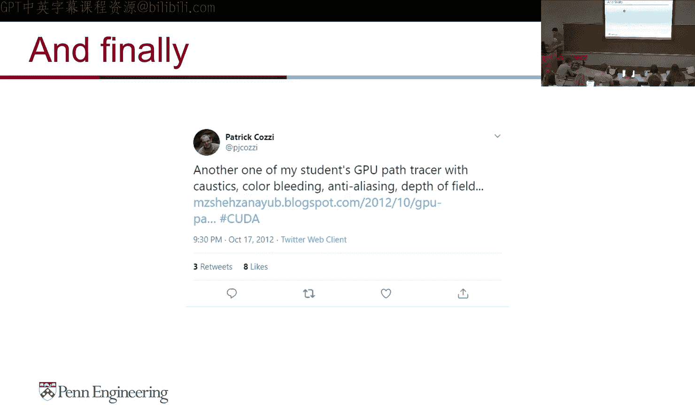

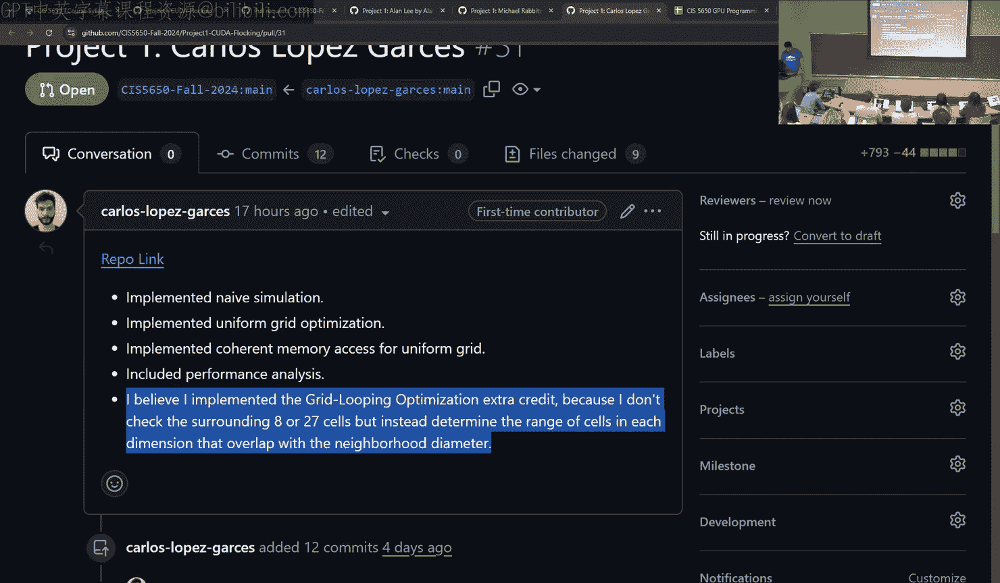

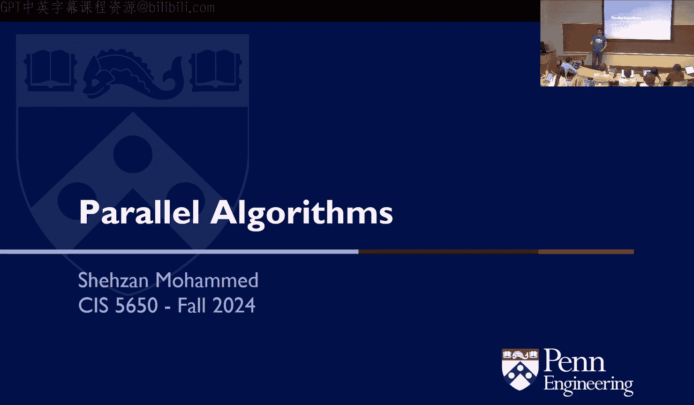

README应清晰传达项目信息。以下是其关键组成部分：

*   **项目概述与背景**：简要说明项目目标、技术栈和所需背景知识。
*   **构建与运行指南**：提供清晰、可执行的步骤。
*   **功能与成果展示**：通过文字、图片、视频等方式展示实现的功能。
*   **性能分析与对比**：包含图表和数据，量化你的优化成果。
*   **已知问题与待办事项**：诚实地列出项目的局限性或未来改进方向。
*   **许可证信息**：明确项目的使用许可。

### 提升README质量的实用技巧

为了让README更具吸引力，请考虑以下建议：

*   **提供上下文与视觉展示**：在开头部分提供项目背景、你的联系方式，并附上一张具有代表性的图片或GIF动图，直观展示项目成果。
*   **使用图解说明功能**：利用截图或架构图，逐步展示项目的不同功能模块。对关键部分进行标注，帮助非技术背景的读者（如HR）理解。
*   **展示调试过程与问题解决**：包含调试截图或“花絮”（Bloopers），这能有力地证明你遇到了实际问题并成功解决了它，体现了你的问题解决能力。
*   **进行对比展示**：使用并排对比图来突出你的优化效果或额外实现的功能，这能让你在众多项目中脱颖而出。
*   **制作演示视频**：一段简短的演示视频可以动态地展示项目运行效果，非常吸引人。

### 制作有效图表的准则

清晰的图表对于展示性能数据至关重要。

*   **标注清晰的坐标轴**：确保横纵坐标轴都有明确的标签和单位。
*   **选择恰当的尺度**：根据数据范围选择合适的坐标轴尺度（如对数尺度），避免图表空间浪费。
*   **明确优劣方向**：明确指出图表中“数值更高更好”还是“数值更低更好”。
*   **使用易于区分的视觉元素**：使用不同的颜色或线型来区分数据系列，方便对比。

### 积极推广你的项目

不要害羞，积极在社交媒体或技术博客上分享你的项目成果。这不仅能获得更多关注和反馈，还可能为你带来意想不到的职业机会。

---

## 并行算法 🔄

上一部分我们讨论了项目展示的技巧，现在让我们转向技术核心，学习如何设计并行算法。

### 并行归约

归约操作接收N个输入，产生一个输出（如求和、求最大值）。串行归约的复杂度是O(N)。

**并行归约算法**通过类似锦标赛淘汰赛的方式，将加法操作分层并行化。第一层，所有相邻元素两两相加；第二层，将第一层的结果再次两两相加；依此类推。对于N个元素，共需log₂(N)层。虽然总计算量变为O(N log N)，但由于高度并行，整体运行时间大幅缩短。

伪代码示例（求和）：
```cpp
for (int stride = 1; stride < n; stride *= 2) {
    if (threadIdx.x % (2*stride) == 0) {
        array[threadIdx.x] += array[threadIdx.x + stride];
    }
    __syncthreads();
}
```

### 扫描（前缀和）

扫描操作接收一个数组和一个二元运算符（如加法），为每个位置输出其之前所有元素的运算结果。排他扫描（Exclusive Scan）的第一个输出是单位元（如0），包含扫描（Inclusive Scan）的第一个输出是第一个输入元素。

**朴素并行扫描算法**通过多轮偏移相加实现。虽然算法复杂度为O(N log N)，但能完全并行执行。

**高效工作扫描算法**将扫描分为两个阶段，将复杂度降低到O(N)，减少了全局内存访问，从而提升性能。
1.  **上行阶段**：执行一次并行归约，在过程中记录部分和。
2.  **下行阶段**：通过一套特定的复制和加法规则，将部分和传播到所有元素，最终得到完整的扫描结果。

### 流压缩

流压缩的目标是根据条件（如布尔掩码）过滤数组元素，移除不满足条件的项，并保持剩余元素的原始顺序。它在路径追踪（剔除无效光线）和稀疏矩阵处理中非常有用。

**并行流压缩算法**分为三步：
1.  **生成掩码数组**：并行地为每个元素计算条件判断结果（1满足，0不满足）。
2.  **执行排他扫描**：对掩码数组进行排他扫描。结果数组的每个值表示“在此元素之前有多少个满足条件的元素”。
3.  **分散写入**：每个满足条件的元素，根据扫描结果提供的索引，将自己写入输出数组的对应位置。扫描结果的最后一个值即为输出数组的长度。

### 求和表

求和表是一个二维数组，其中每个位置的值等于原始二维数组中该位置左上角所有元素之和。它可用于快速计算图像中任意矩形区域的和，在图像滤波中应用广泛。

**并行求和表算法**通过两次扫描完成：
1.  **行扫描**：对每一行独立进行包含扫描。
2.  **列扫描**：对上一步的结果矩阵的每一列进行包含扫描。经过这两步，每个位置都获得了正确的二维前缀和。

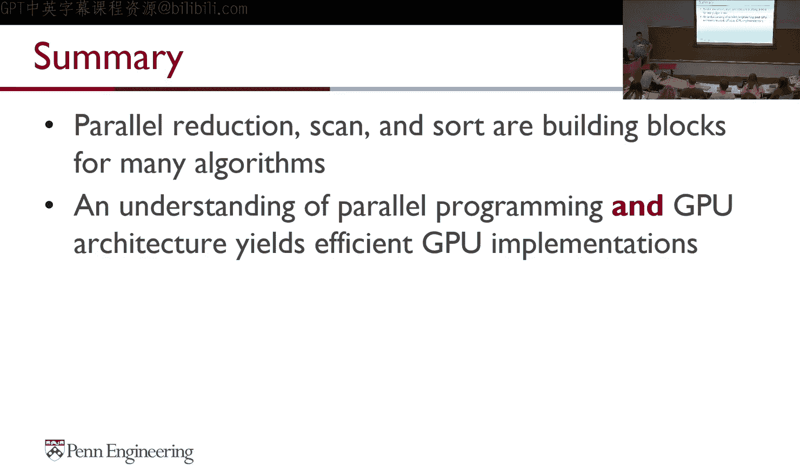

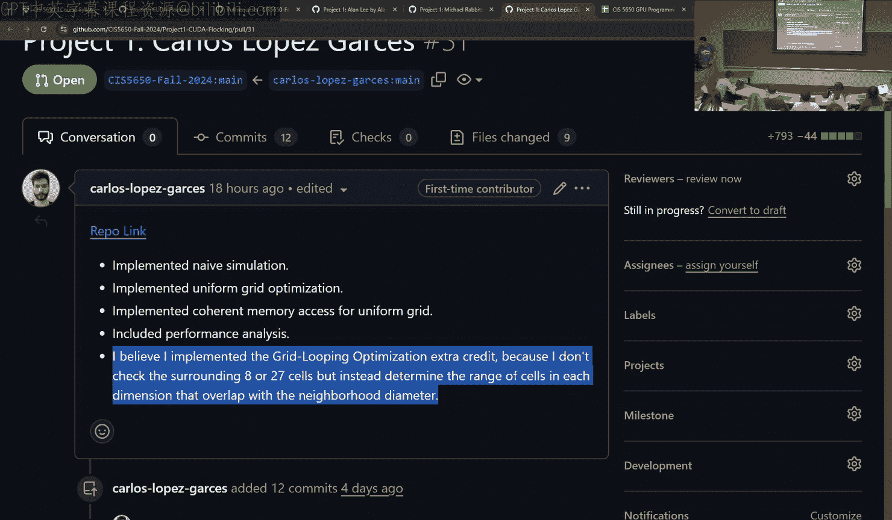

### 基数排序

基数排序是一种非比较排序算法，特别适合并行实现。它对整数按位进行排序，从最低有效位到最高有效位，每次根据当前位的值（0或1）将元素重新排列。

**单线程块内的并行基数排序**（以单次位排序为例）：
1.  **提取位值**：为每个元素提取当前排序位的值（0或1）。
2.  **计算写入位置**：
    *   对“位值为0”的掩码数组进行排他扫描，得到每个“0”元素应写入的输出索引（`F`数组）。
    *   每个“1”元素的输出索引可通过公式 `T[i] = i - F[i] + totalFalses` 计算，其中 `totalFalses` 是“0”的总数。
3.  **分散写入**：根据计算出的索引（`F`或`T`），将元素写入新的位置。重复此过程，对所有位进行排序。

**跨线程块的扩展**：要对超出单个线程块的大型数组排序，可先在各块内独立排序，然后使用归并排序（如双调归并）合并结果。跨块扫描也可通过类似“先块内扫描，再对块总和扫描，最后将偏移加回”的模式实现。

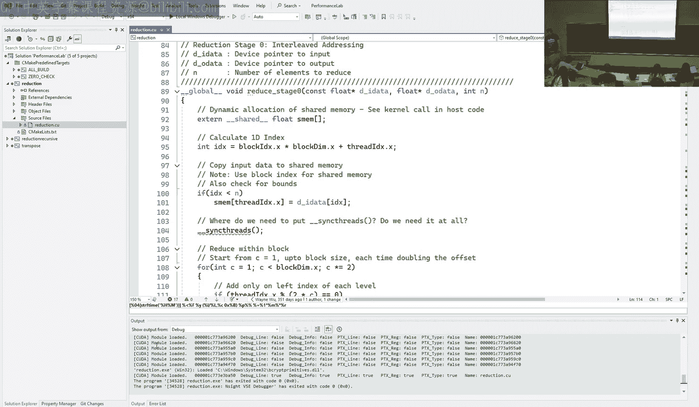

---

## 总结 🎯

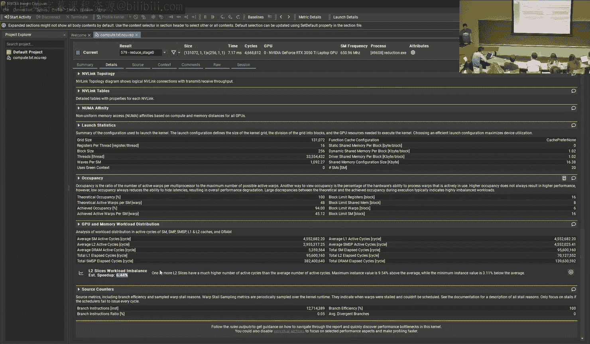

本节课我们一起学习了如何通过优秀的README和图表来展示你的GPU编程项目，这对职业发展至关重要。在技术层面，我们深入探讨了并行归约、扫描、流压缩、求和表和基数排序等核心算法。这些算法的共同点在于，它们通过巧妙的分解和重组，将固有的串行依赖转化为可并行执行的任务，充分利用了GPU的大规模并行计算能力。理解并掌握这些算法模式，是进行高效GPU编程的关键。在接下来的项目中，请尝试应用这些算法和展示技巧。