# 018：Vulkan命令记录与同步 🔧


在本节课中，我们将要学习Vulkan中命令记录的核心概念以及至关重要的同步机制。Vulkan是一个高度异步的API，这意味着开发者需要手动处理几乎所有同步操作，以确保GPU和CPU之间的正确协作。

## 命令缓冲区 📝

上一节我们介绍了Vulkan的基本架构，本节中我们来看看命令缓冲区。命令缓冲区是GPU执行命令的载体。为了使命令缓冲区对GPU有用，我们需要将其提交到GPU的某个队列中。

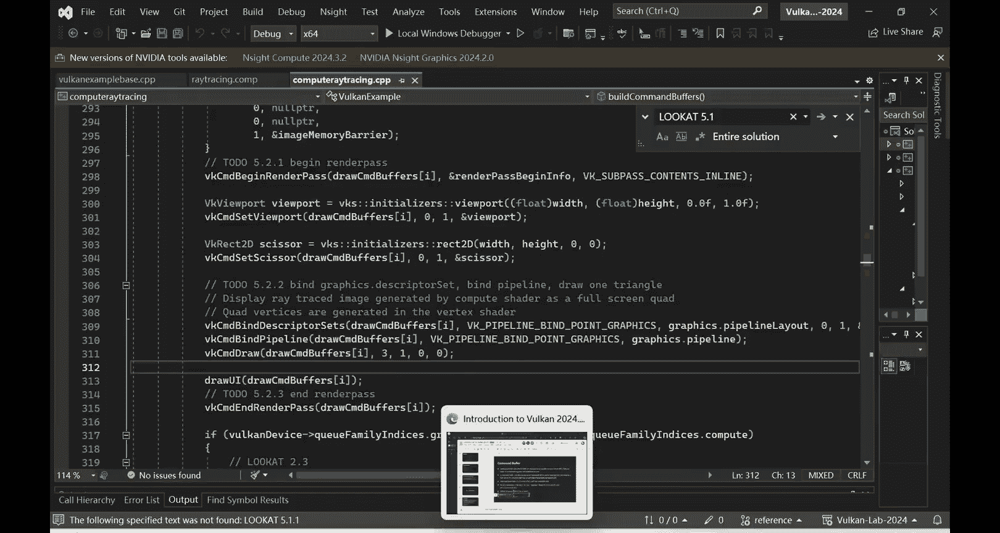

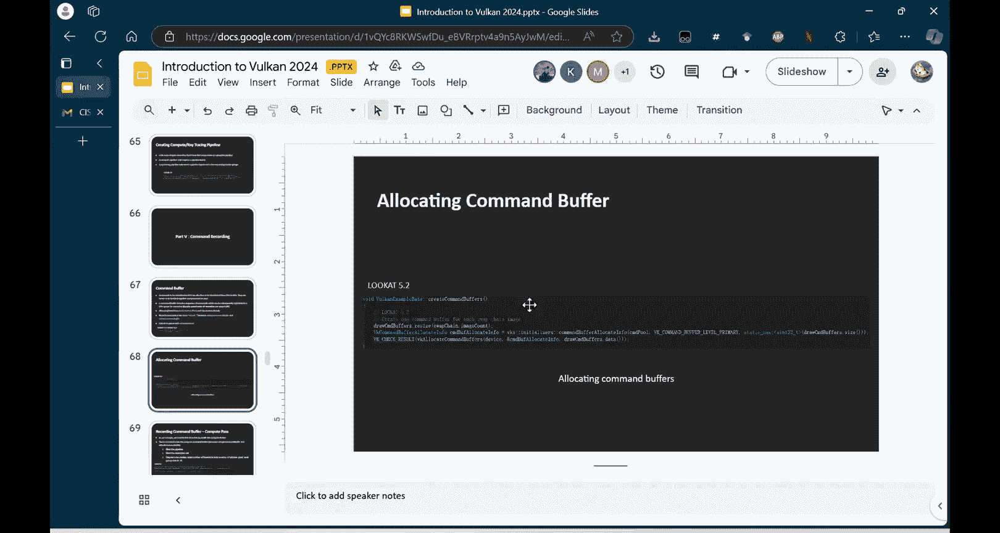

命令缓冲区可以记录一系列命令，这些命令可以被提交到任何队列执行。但请注意，**记录的顺序并不等同于实际的执行顺序**。不同命令之间的执行完成顺序可能是任意的。如果你想确保不同命令之间的执行顺序，需要在命令缓冲区记录阶段插入一些屏障。

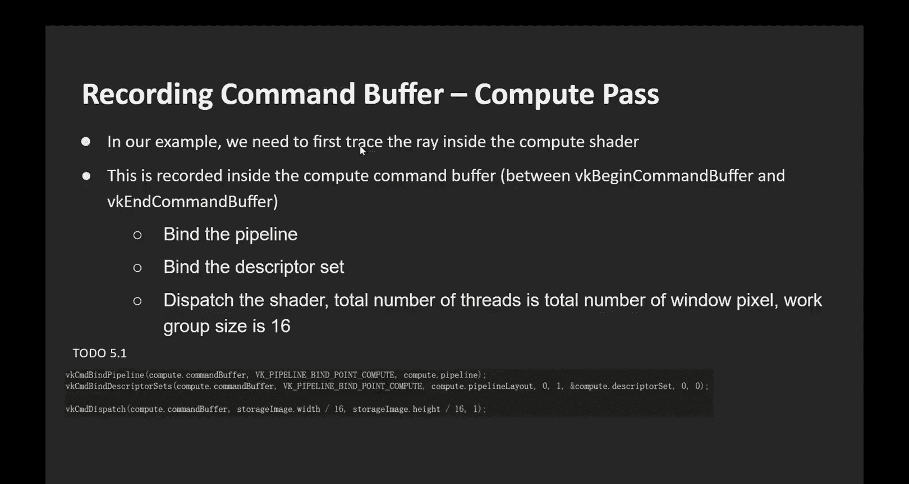


命令缓冲区从VkCommandPool中分配和释放，不能直接创建。我们可以在`vkBeginCommandBuffer`和`vkEndCommandBuffer`之间记录所有命令，无论是绘制命令还是管道屏障。命令缓冲区的概念与WebGPU中的命令编码器非常相似。

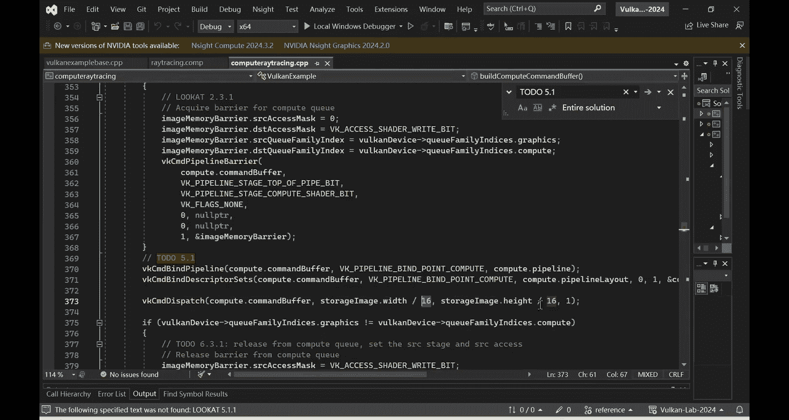


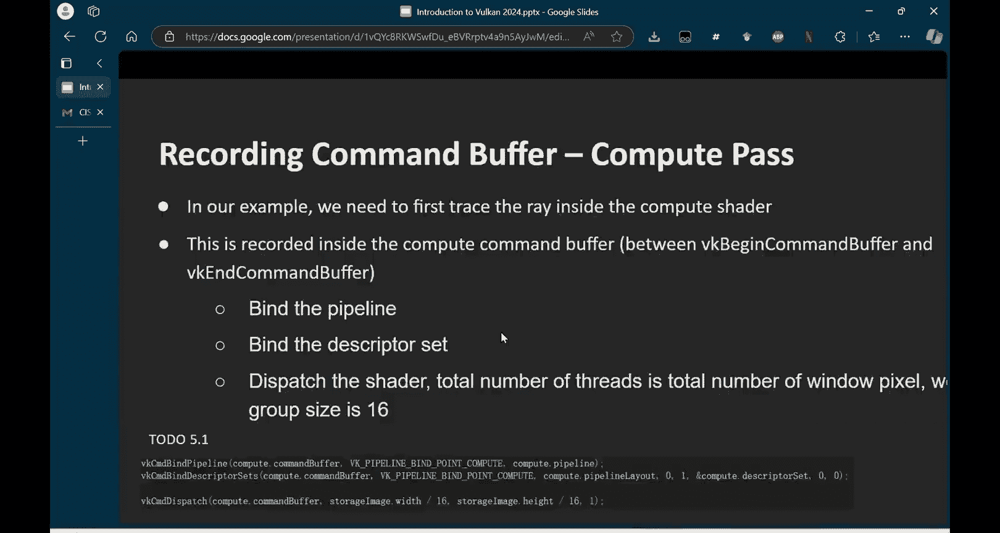

以下是构建图形管道命令缓冲区的核心代码示例：


```cpp
vkCmdBeginRenderPass(...); // 开始渲染通道
vkCmdSetViewport(...);
vkCmdSetScissor(...);
vkCmdBindDescriptorSets(...); // 绑定描述符集
vkCmdBindPipeline(...); // 绑定管道
vkCmdDraw(...); // 执行绘制命令
vkCmdEndRenderPass(...); // 结束渲染通道
```

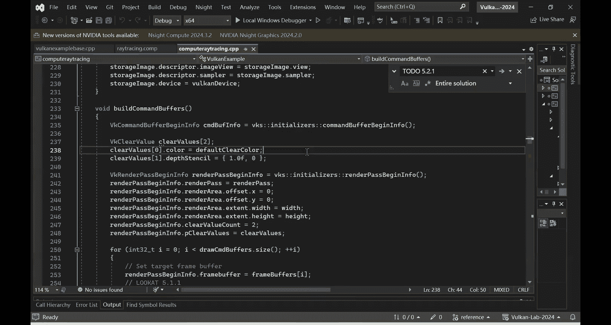

在我们的示例中，我们绘制一个覆盖整个屏幕的三角形，这可以作为一个全屏通道使用。

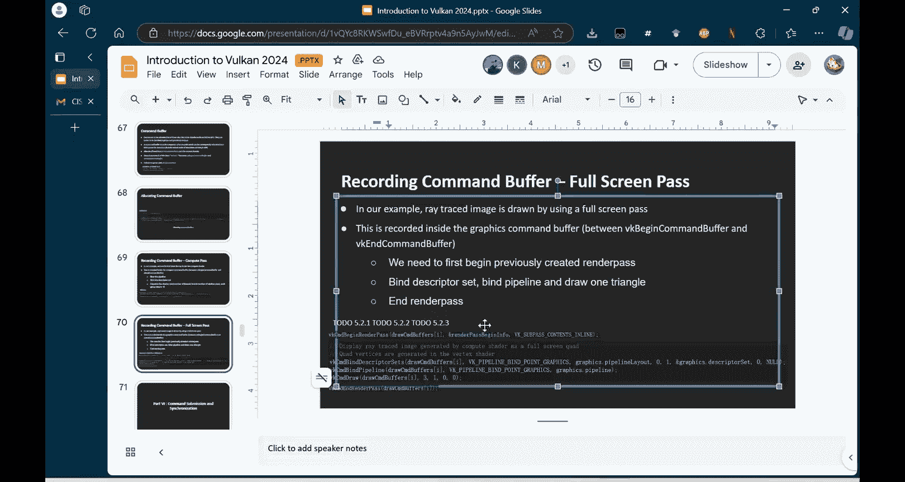

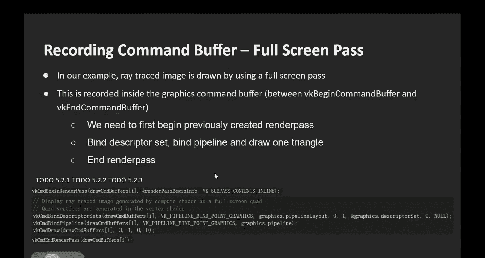


命令缓冲区的分配通常如下所示，但实际使用的核心是记录在其中的命令：

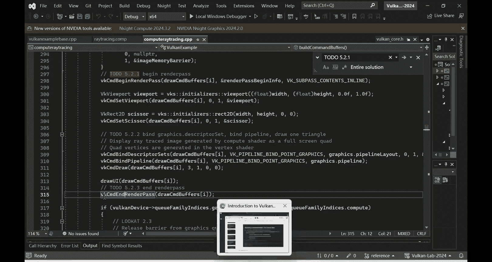


```cpp
vkAllocateCommandBuffers(device, &allocInfo, &commandBuffer);
```

对于计算着色器，命令记录更为简洁。以下是计算管道命令缓冲区的示例：

```cpp
vkCmdBindPipeline(commandBuffer, VK_PIPELINE_BIND_POINT_COMPUTE, computePipeline);
vkCmdBindDescriptorSets(commandBuffer, VK_PIPELINE_BIND_POINT_COMPUTE, ...);
vkCmdDispatch(commandBuffer, 16, 16, 1); // 调度计算工作
```

这里的数字16是X和Y方向的工作组大小。

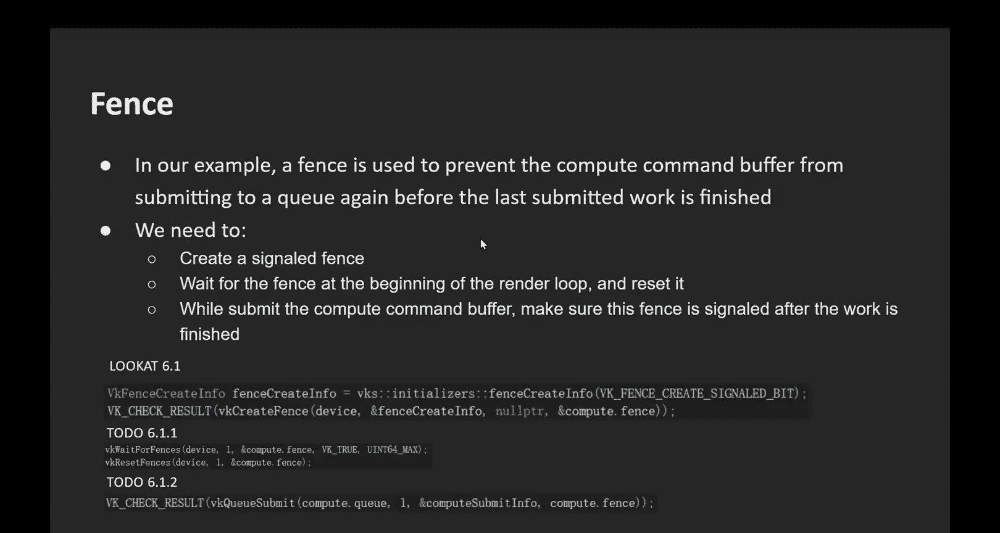

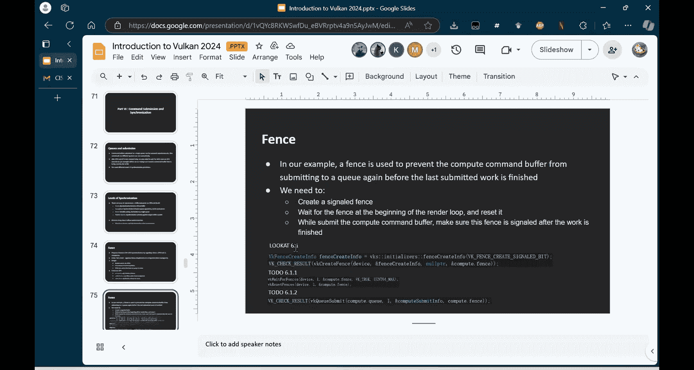

## 渲染通道与绘制 🎨

在图形管道中，在绘制任何内容之前，你总是需要开始一个新的渲染通道。你可以在一个渲染通道中使用多个子通道。

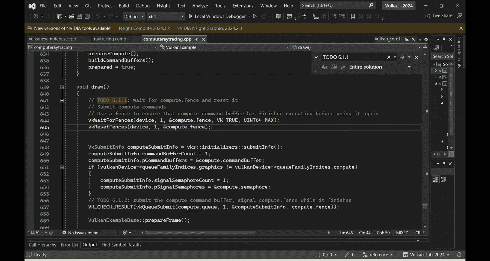


开始渲染通道的调用如下：

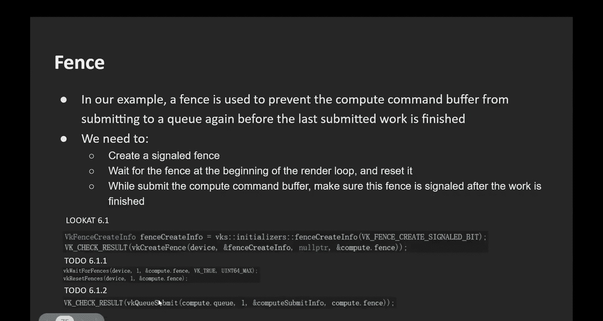


```cpp
VkRenderPassBeginInfo renderPassInfo{};
renderPassInfo.renderPass = renderPass; // 使用之前创建的渲染通道
renderPassInfo.framebuffer = swapChainFramebuffers[imageIndex];
renderPassInfo.renderArea.offset = {0, 0};
renderPassInfo.renderArea.extent = swapChainExtent;
// 指定要写入的附件的清除值（例如颜色和深度模板）
std::array<VkClearValue, 2> clearValues{};
clearValues[0].color = {{0.0f, 0.0f, 0.0f, 1.0f}};
clearValues[1].depthStencil = {1.0f, 0};
renderPassInfo.clearValueCount = static_cast<uint32_t>(clearValues.size());
renderPassInfo.pClearValues = clearValues.data();

vkCmdBeginRenderPass(commandBuffer, &renderPassInfo, VK_SUBPASS_CONTENTS_INLINE);
```

之后，绑定描述符集和管道，并执行绘制命令。`vkCmdDraw`的函数签名如下：

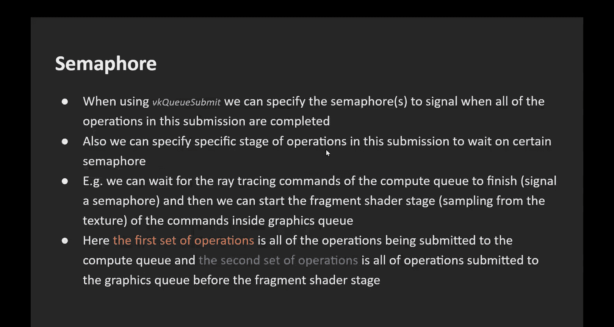

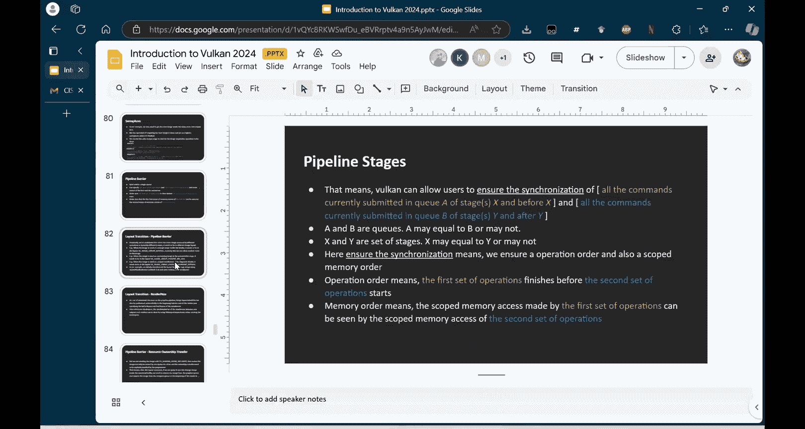

```cpp
void vkCmdDraw(
    VkCommandBuffer commandBuffer,
    uint32_t vertexCount,    // 要绘制的顶点数量
    uint32_t instanceCount,  // 实例数量
    uint32_t firstVertex,    // 第一个顶点的偏移量
    uint32_t firstInstance); // 第一个实例的偏移量
```

完成所有绘制（包括UI）后，结束渲染通道：

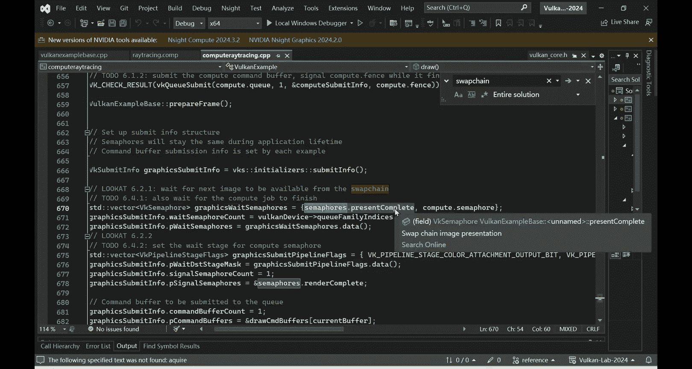


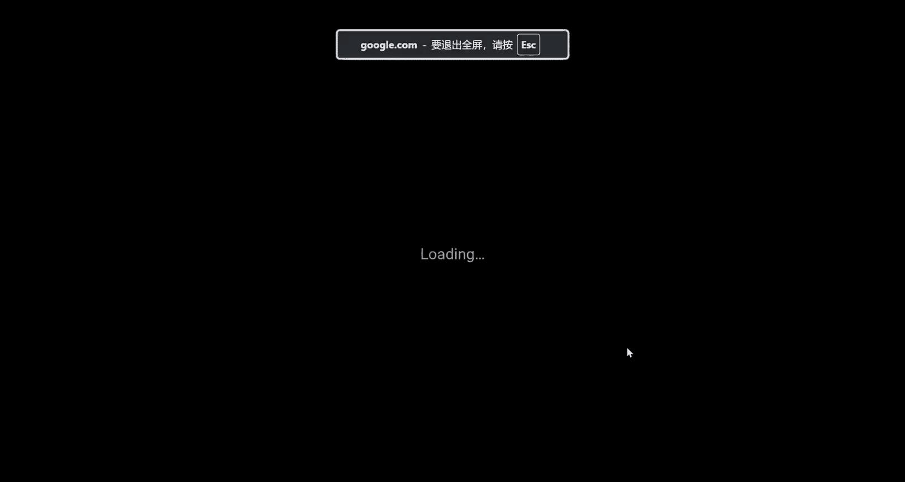

```cpp
vkCmdEndRenderPass(commandBuffer);
```

## Vulkan同步机制 🔄

现在我们来探讨Vulkan同步的核心部分。之前我们介绍了队列的概念，每个记录的命令缓冲区都可以提交到单个队列。这些队列可以异步执行，并且不同队列上的命令也可以并发运行。因此，我们需要在队列内部以及队列之间进行同步。此外，CPU和GPU也并发工作，有时CPU需要等待GPU工作完成。

Vulkan提供了不同的同步原语：
*   **Fence（栅栏）**：用于CPU和GPU之间的同步。
*   **Semaphore（信号量）**：用于队列操作之间或不同队列之间的同步。
*   **Event（事件）**：用于在单个队列内进行非常灵活的同步。
*   **Pipeline Barrier（管道屏障）**：功能强大，但只能在命令缓冲区记录阶段使用。

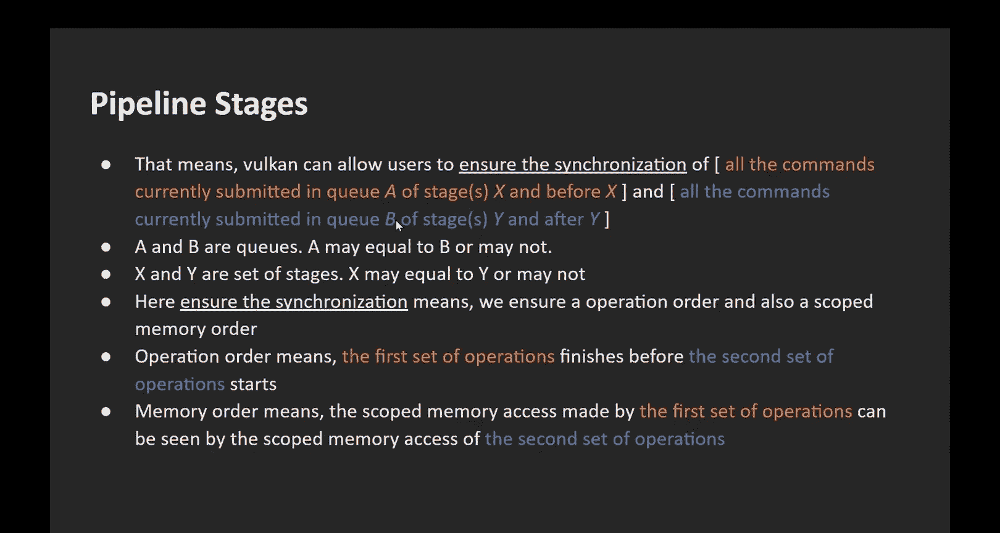

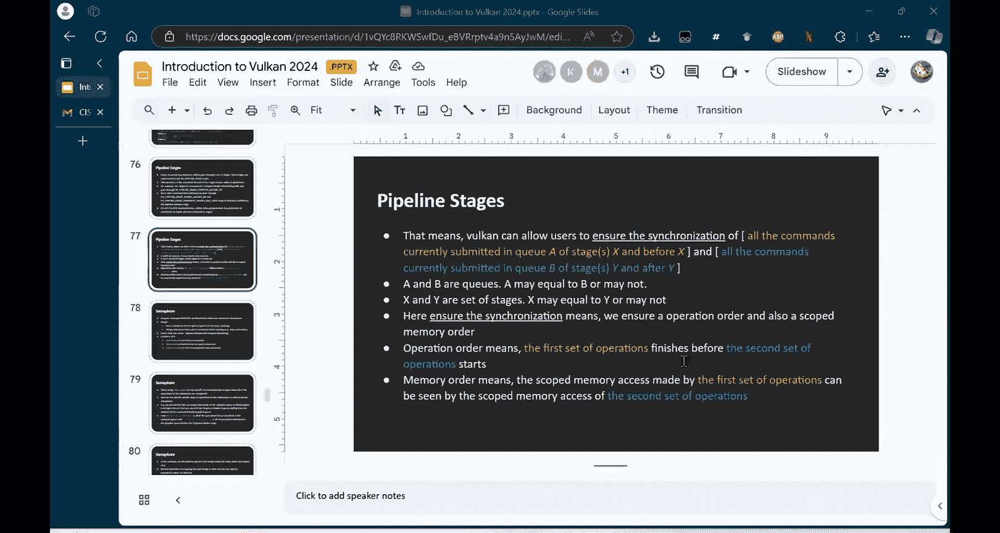

### Fence（栅栏）


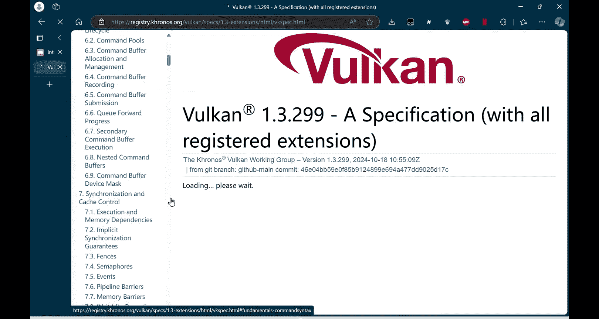

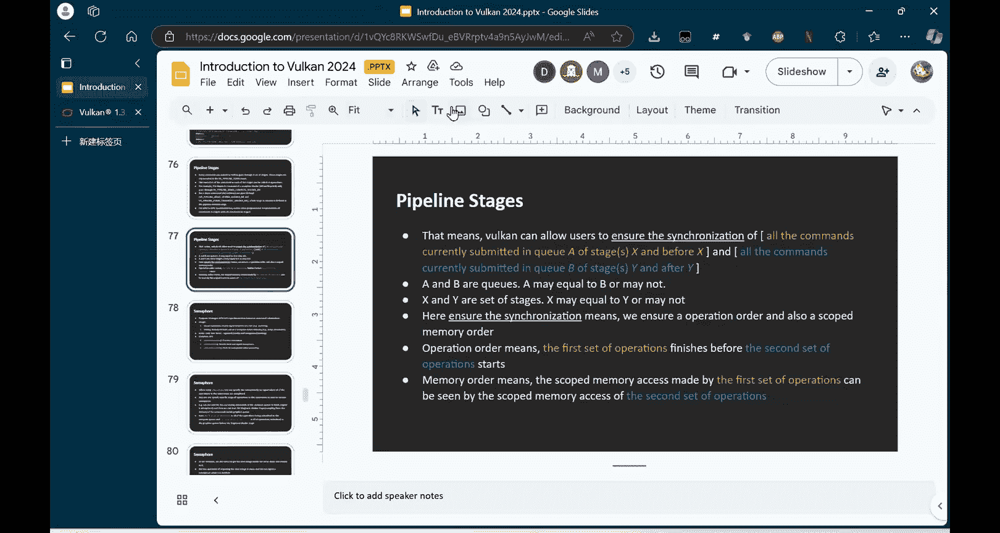

栅栏通过发出信号来确保CPU和GPU之间的同步，当GPU任务完成时通知CPU。栅栏有两种状态：**已发出信号**和**未发出信号**。

典型的用法是：首先将工作提交到GPU，在提交阶段标记一个栅栏以跟踪GPU工作的完成。一旦GPU完成工作，就会发出栅栏信号，然后CPU可以等待该栅栏。

在我们的示例中，使用两个栅栏来确保不同操作之间的同步。第一个栅栏用于防止计算命令缓冲区在上一次提交的工作完成之前被重复提交。

以下是相关代码示例：

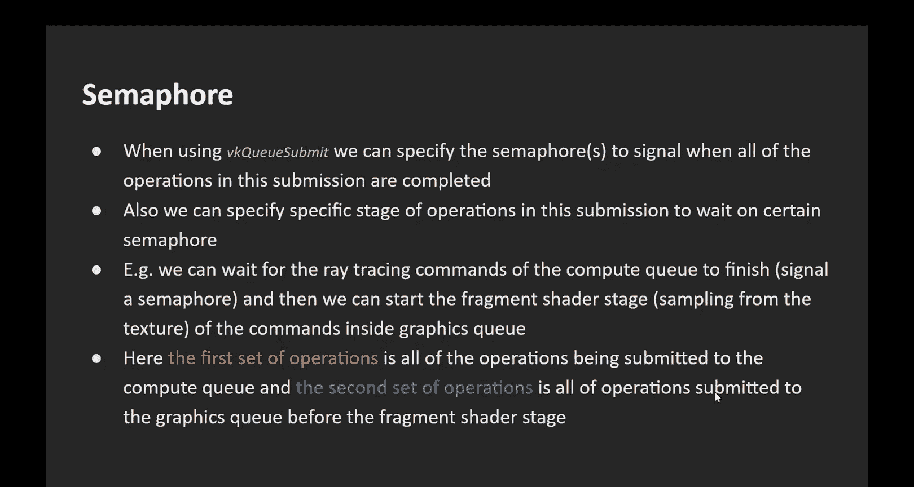


```cpp
// 提交计算工作，并关联一个栅栏
vkQueueSubmit(computeQueue, 1, &submitInfo, computeFence);


// 在下一轮迭代中，等待栅栏完成
vkWaitForFences(device, 1, &computeFence, VK_TRUE, UINT64_MAX);
vkResetFences(device, 1, &computeFence); // 重置栅栏状态
```

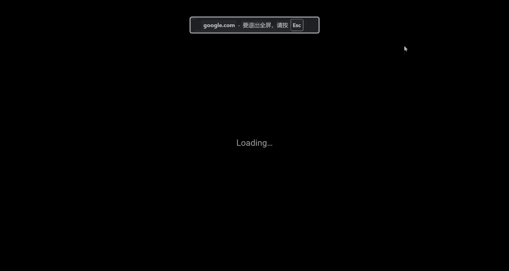

这与`vkDeviceWaitIdle`不同，后者会等待设备上的所有命令完成，而栅栏只等待特定的提交完成。

### 管道阶段

提交到Vulkan的每个命令都会经过一组**阶段**，每个阶段中的命令执行称为**操作**。例如，计算管道的`dispatch`命令只经过计算阶段，而绘制命令可能经过顶点阶段、片段阶段等多个阶段。阶段的定义是在管道创建时完成的。

对于GPU到GPU的同步，Vulkan允许程序员同步**阶段一中的所有操作**与**阶段二中的所有操作**。这意味着我们可以确保在队列A的阶段X中提交的所有命令，在队列B的阶段Y中的命令开始之前完成。

这确保了操作顺序和范围内的内存顺序：
*   **操作顺序**：第一组操作（阶段X）在第二组操作（阶段Y）开始之前完成。
*   **内存顺序**：通过指定范围内存访问，可以确保第一组操作进行的内存访问能够被第二组操作看到。

### Semaphore（信号量）

信号量主要用于管理GPU到GPU的同步，尤其是在**不同队列之间**。例如，如果我们希望图形队列等待计算队列完成工作，就需要使用信号量。

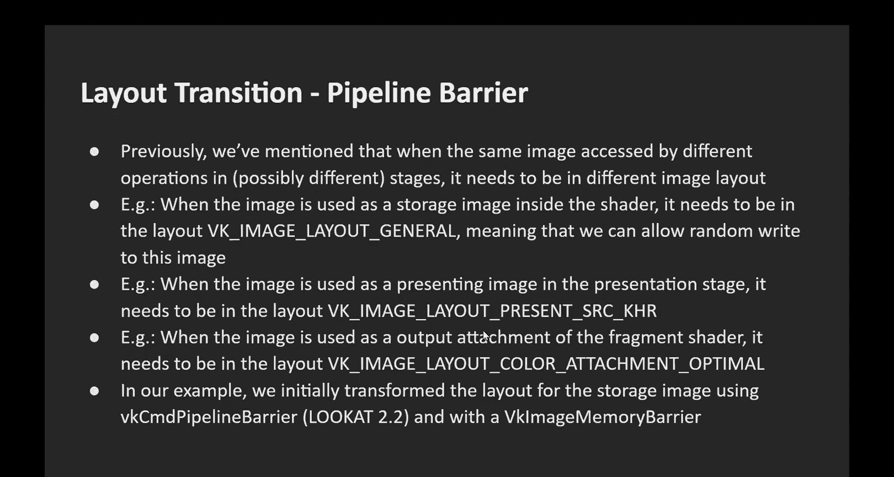

与栅栏类似，信号量也有已发出信号和未发出信号的状态。在向队列提交工作时，可以指定一个信号量，当该提交中的所有操作完成时，该信号量会被发出信号。同时，可以指定某个阶段等待该信号量被发出信号后再继续。

例如，在我们的光线追踪示例中，计算队列完成光线追踪后发出一个信号量。然后，图形队列的片段着色器阶段等待该信号量，因为它需要从计算队列写入的存储图像中采样。

以下是信号量使用的代码框架：

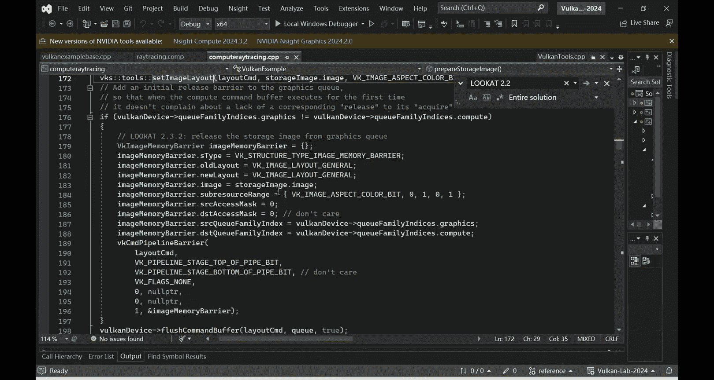

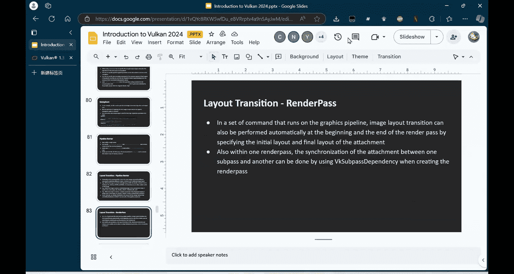

```cpp
// 计算队列提交信息，设置完成后发出信号的信号量
VkSubmitInfo computeSubmitInfo{};
computeSubmitInfo.signalSemaphoreCount = 1;
computeSubmitInfo.pSignalSemaphores = &computeFinishedSemaphore;

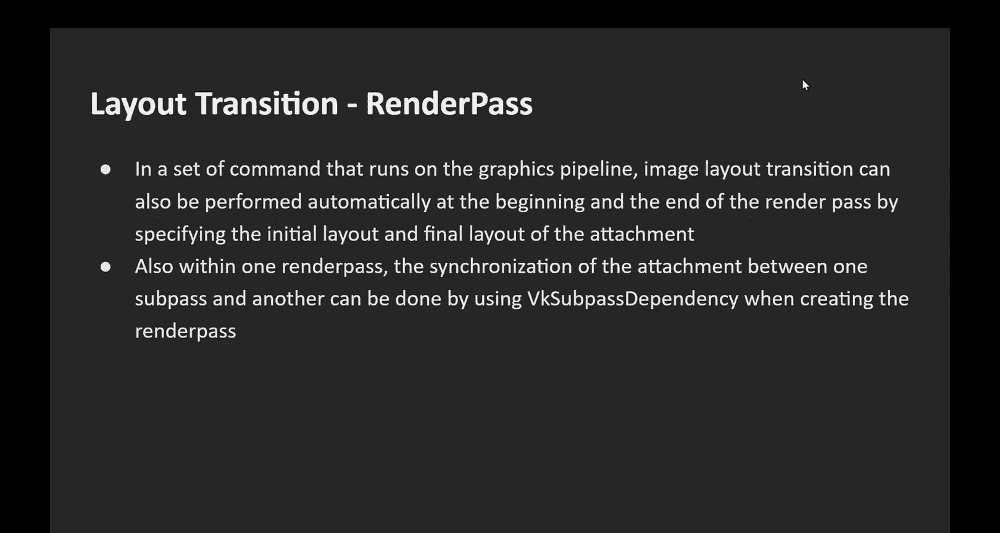

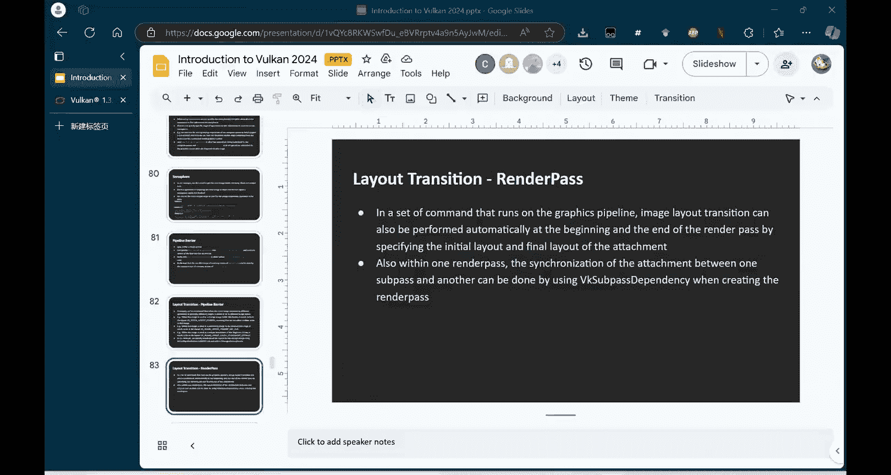

// 图形队列提交信息，设置需要等待的信号量及等待阶段
VkSubmitInfo graphicsSubmitInfo{};
graphicsSubmitInfo.waitSemaphoreCount = 1;
graphicsSubmitInfo.pWaitSemaphores = &computeFinishedSemaphore;
graphicsSubmitInfo.pWaitDstStageMask = &waitStage; // 例如，片段着色器阶段
```

对于交换链，获取下一个图像的操作是异步的。我们需要一个信号量在该操作完成时发出信号，以便颜色输出阶段可以等待图像可用后再开始。

### Pipeline Barrier（管道屏障）

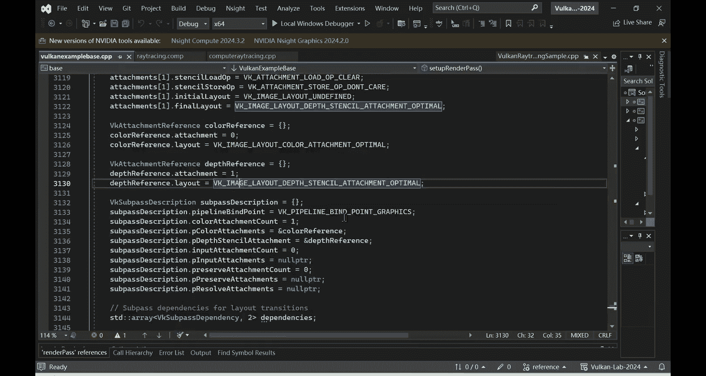

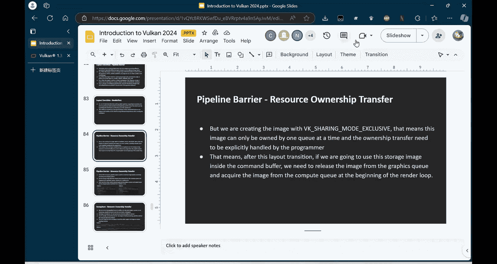

管道屏障用于**单个队列内部**的同步。它是一个以`vkCmd`开头的命令函数调用，因此只能在命令缓冲区记录阶段使用。

管道屏障可以帮助你同步单个提交内的不同命令或操作。你可以指定第一组操作和第二组操作，以及它们的内存访问范围。屏障确保第一组操作在第二组操作开始之前完成，并且第一组操作的内存访问结果对第二组操作可见。

管道屏障的一个重要用途是**图像布局转换**。例如，在着色器中用作存储图像的图像需要处于`VK_IMAGE_LAYOUT_GENERAL`布局，而用作颜色附件的图像需要处于`VK_IMAGE_LAYOUT_COLOR_ATTACHMENT_OPTIMAL`布局，呈现到屏幕的图像需要`VK_IMAGE_LAYOUT_PRESENT_SRC_KHR`布局。

以下是使用管道屏障进行布局转换的示例：

```cpp
VkImageMemoryBarrier barrier{};
barrier.oldLayout = VK_IMAGE_LAYOUT_UNDEFINED;
barrier.newLayout = VK_IMAGE_LAYOUT_GENERAL;
barrier.srcAccessMask = 0;
barrier.dstAccessMask = VK_ACCESS_SHADER_WRITE_BIT;
// ... 设置图像、子资源范围等

vkCmdPipelineBarrier(
    commandBuffer,
    VK_PIPELINE_STAGE_TOP_OF_PIPE_BIT, // 源阶段
    VK_PIPELINE_STAGE_COMPUTE_SHADER_BIT, // 目标阶段
    0, 0, nullptr, 0, nullptr,
    1, &barrier);
```

渲染通道也可以自动处理布局转换。在创建渲染通道时，你需要指定附件的初始布局、最终布局以及每个子通道内的布局。

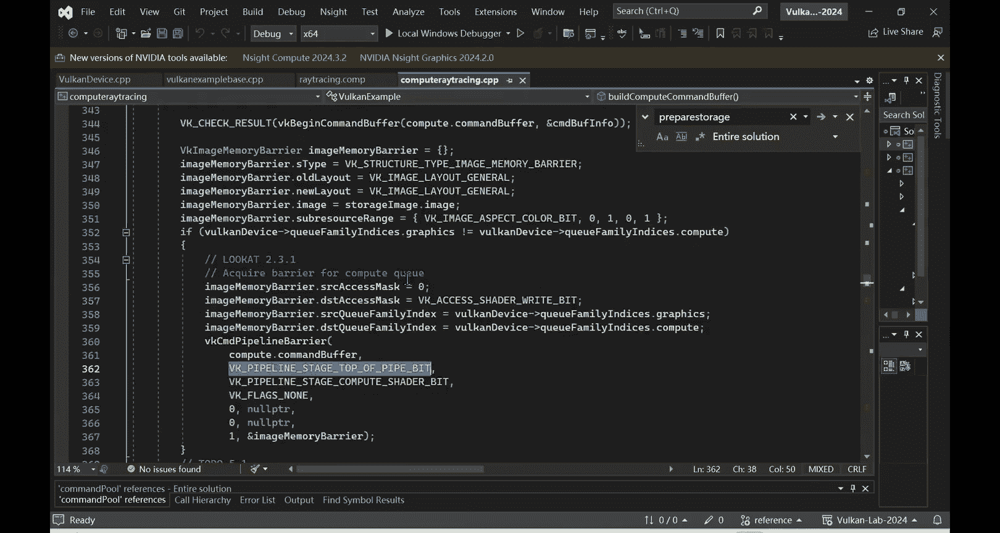

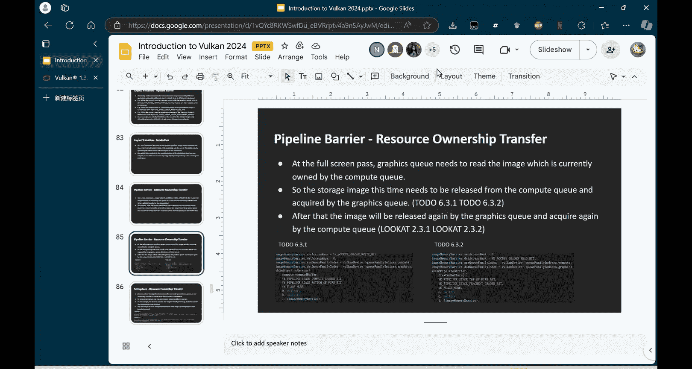

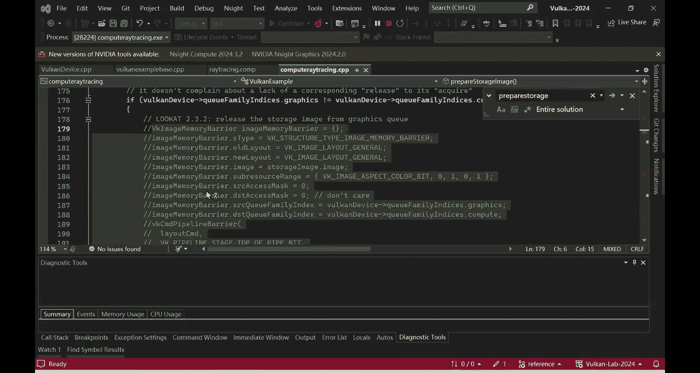

### 资源所有权转移

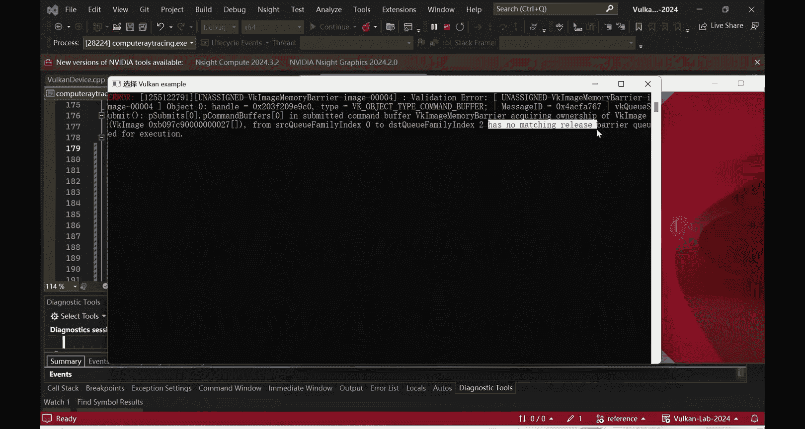

当资源（如图像或缓冲区）以`VK_SHARING_MODE_EXCLUSIVE`模式创建，并被多个队列使用时，需要进行显式的**资源所有权转移**。例如，存储图像被计算队列用于光线追踪，然后被图形队列的片段着色器采样，这期间就涉及所有权在队列间的转移。

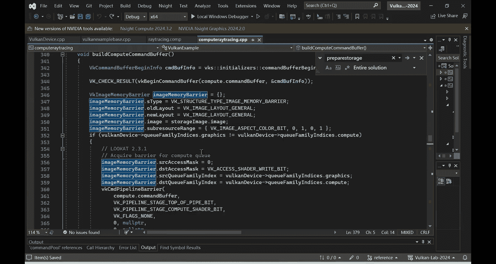

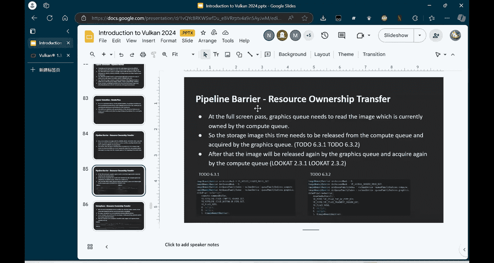

所有权转移通过管道屏障实现，但必须与信号量配合使用，因为管道屏障只能同步队列内部，而信号量可以同步不同队列。

转移分为两步：
1.  **释放屏障**：在源队列的命令缓冲区中，释放资源的所有权。
2.  **获取屏障**：在目标队列的命令缓冲区中，获取资源的所有权。

在释放屏障中，你主要关心源访问掩码和源阶段；在获取屏障中，你主要关心目标访问掩码和目标阶段。

在我们的示例中，有一个从图形队列到计算队列的释放屏障，以及一个从计算队列到图形队列的获取屏障，它们与信号量一起确保了正确的同步和所有权转移。

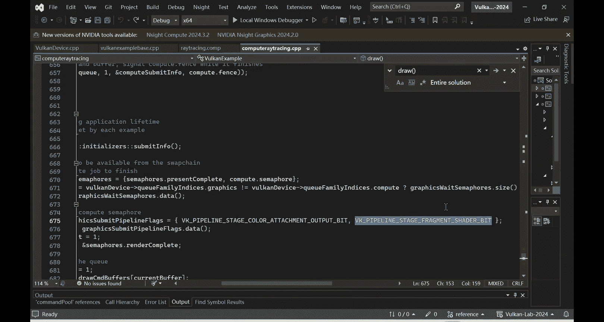


### 子通道依赖

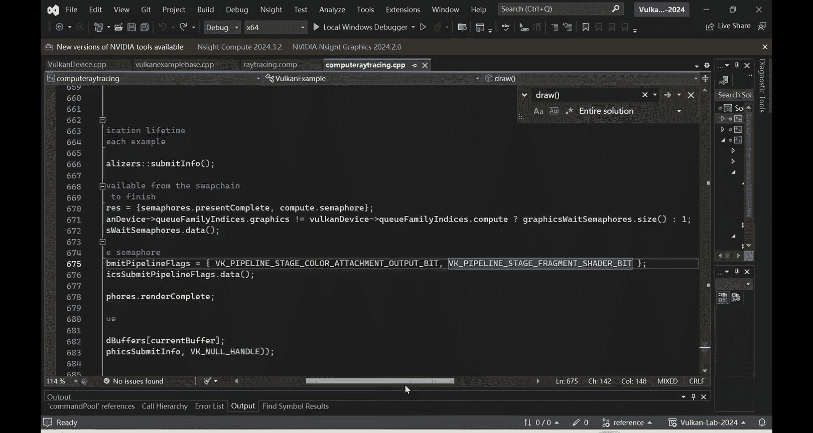

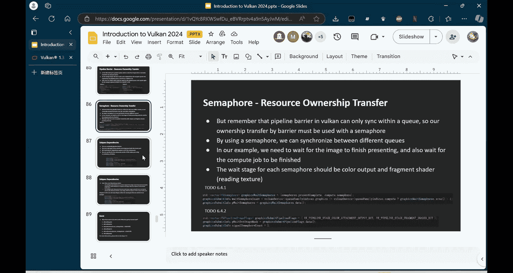

子通道依赖本质上是渲染通道内的管道屏障。它们由驱动程序转换为管道屏障，但允许你为附件自动处理内存依赖关系。

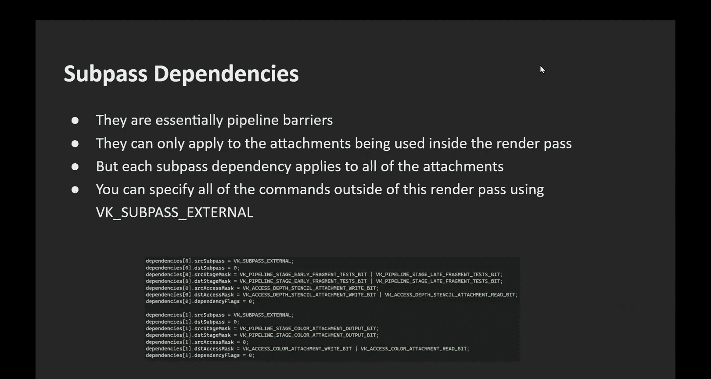

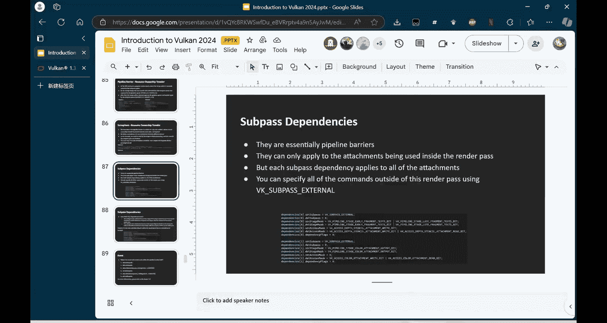

在创建渲染通道时，你可以指定子通道依赖关系，以同步不同子通道之间或渲染通道与外部操作之间的内存访问。每个依赖关系都适用于所有附件，但可以通过阶段掩码和访问掩码来限制同步的范围。

以下是子通道依赖的示例：

```cpp
VkSubpassDependency dependency{};
dependency.srcSubpass = VK_SUBPASS_EXTERNAL; // 表示渲染通道之前的所有操作
dependency.dstSubpass = 0; // 第一个子通道
dependency.srcStageMask = VK_PIPELINE_STAGE_LATE_FRAGMENT_TESTS_BIT;
dependency.dstStageMask = VK_PIPELINE_STAGE_EARLY_FRAGMENT_TESTS_BIT;
dependency.srcAccessMask = VK_ACCESS_DEPTH_STENCIL_ATTACHMENT_WRITE_BIT;
dependency.dstAccessMask = VK_ACCESS_DEPTH_STENCIL_ATTACHMENT_READ_BIT;
```

这个依赖关系确保在深度附件上的前一次写入完成之后，当前渲染通道才能开始读取它。

### Event（事件）

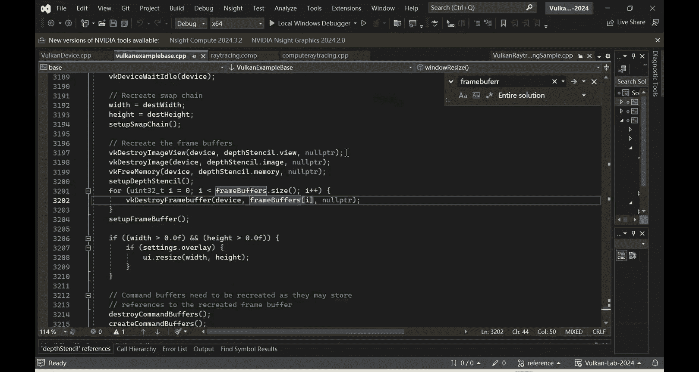

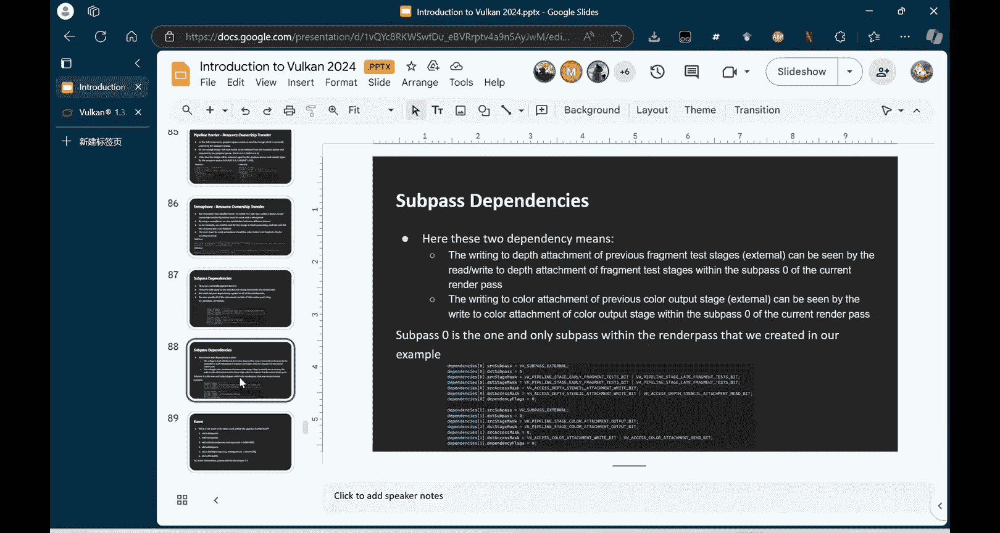

事件提供了更精细的控制，允许你在管道屏障之间执行一些工作。你可以设置一个事件，执行一些工作，然后等待该事件。不过，事件的使用相对复杂，在此不做深入讨论。

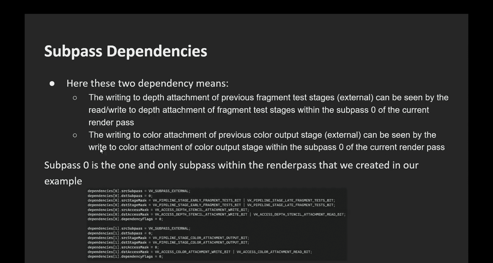

## 资源销毁与调试 🗑️

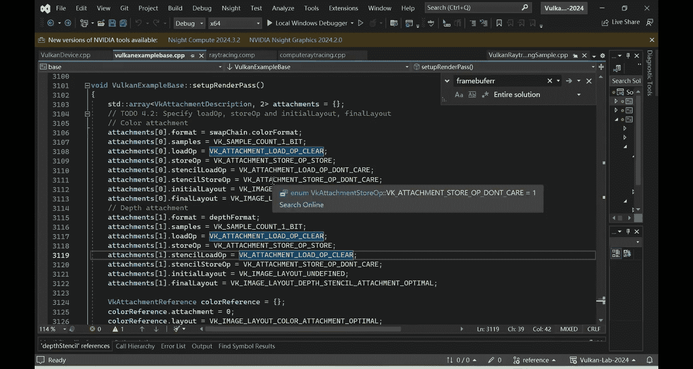

Vulkan没有垃圾回收机制，甚至没有智能指针。因此，你需要手动销毁所有创建的对象。这虽然繁琐但并不困难，只需为每个创建函数调用对应的`vkDestroyXXX`或`vkFreeXXX`函数即可。


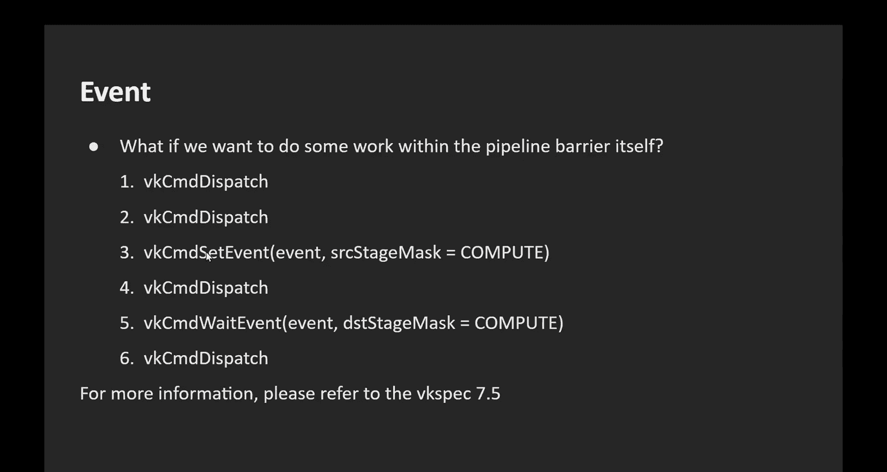


调试可以通过启用验证层来实现。Vulkan SDK提供了丰富的调试功能，帮助你捕获错误和性能问题。

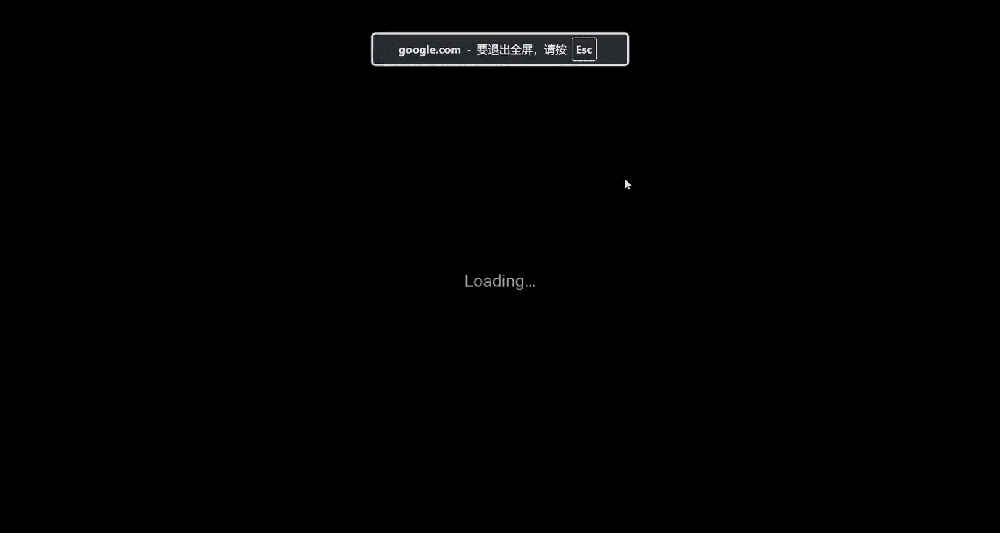

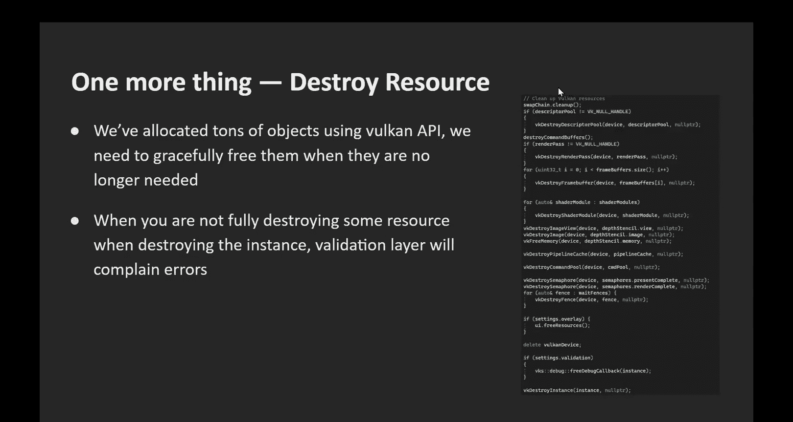

## 总结 📚


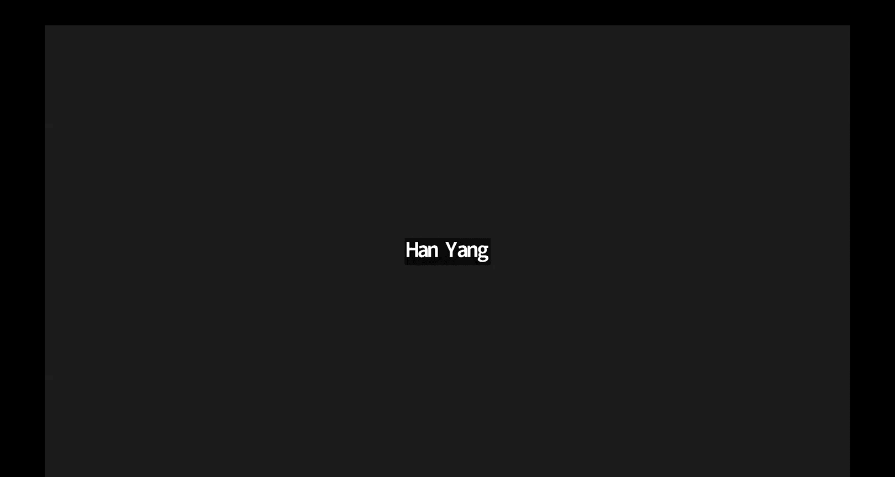

本节课中我们一起学习了Vulkan命令记录与同步的核心内容。我们首先了解了命令缓冲区的创建、记录与提交过程。然后，深入探讨了Vulkan中复杂的同步机制，包括栅栏、信号量、管道屏障和事件。我们学习了如何使用它们来管理GPU与CPU之间、不同GPU队列之间以及单个队列内部的操作顺序和内存可见性。此外，还涵盖了图像布局转换、资源所有权转移以及渲染通道内的子通道依赖等高级主题。掌握这些同步原语是编写正确、高效Vulkan程序的关键。最后，我们简要提到了资源销毁的必要性和调试方法。