# 020：机器学习基础入门 🧠

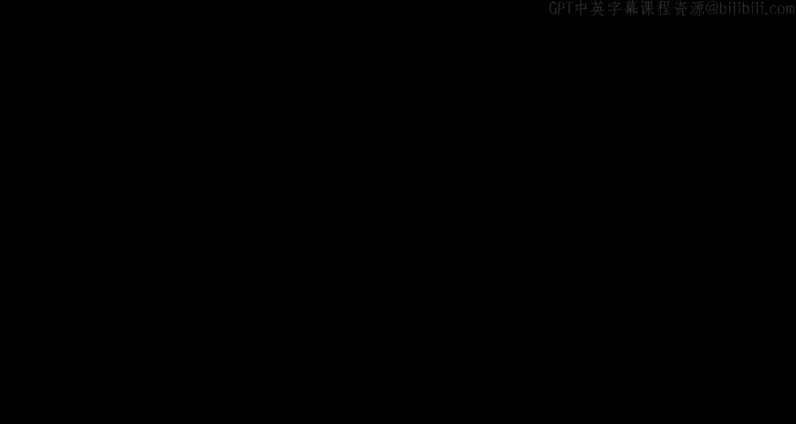

## 概述
在本节课中，我们将从零开始学习机器学习的基础知识。我们将涵盖神经网络的核心概念、训练过程、优化方法以及如何将机器学习应用于实际任务，特别是那些与GPU编程高度相关的任务。课程内容旨在让没有机器学习背景的同学也能理解基本原理。

---

## 神经网络基础

上一节我们概述了课程内容，本节中我们来看看神经网络的基本构成。


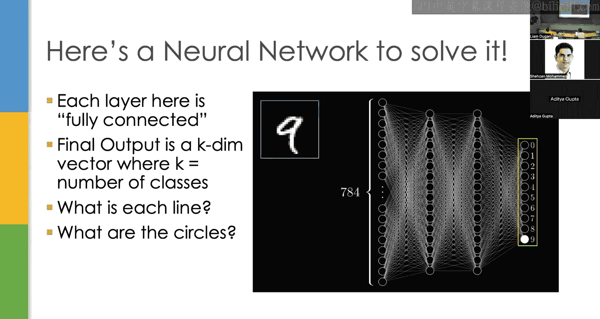

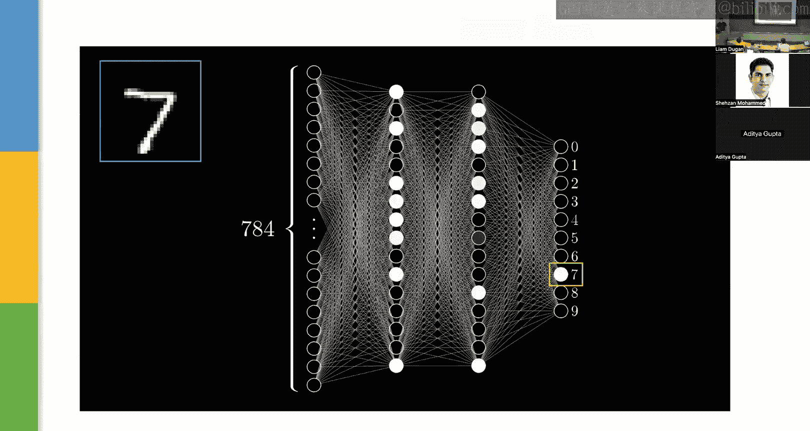

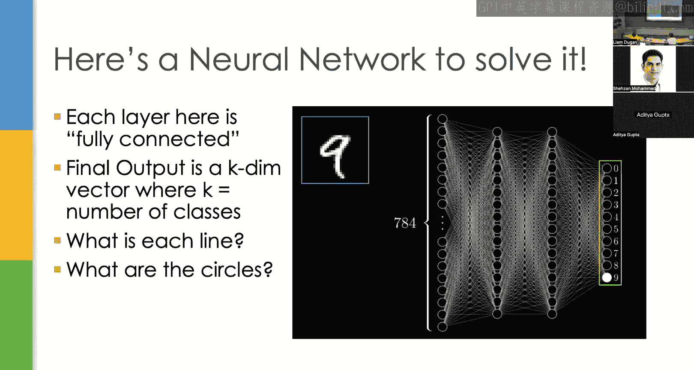

我们的任务是通过一个简单的例子来理解神经网络：手写数字识别。给定一个手写数字的图像，我们需要将其分类为0到9中的一个数字。

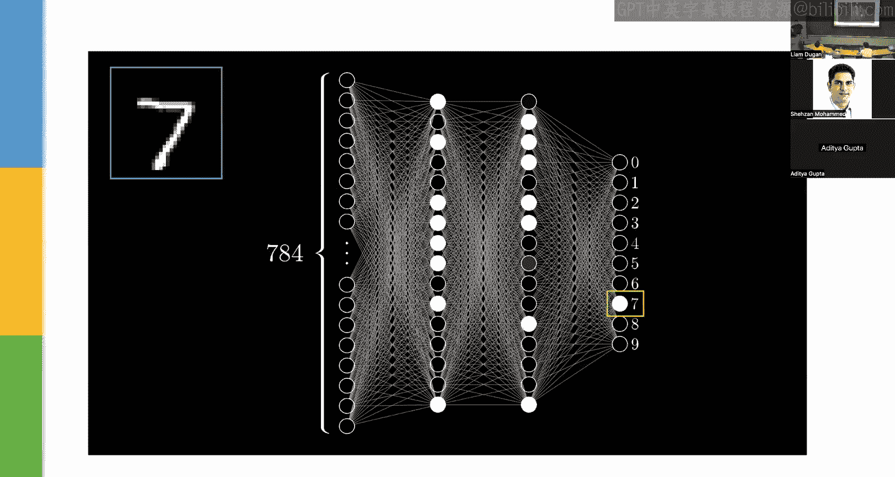

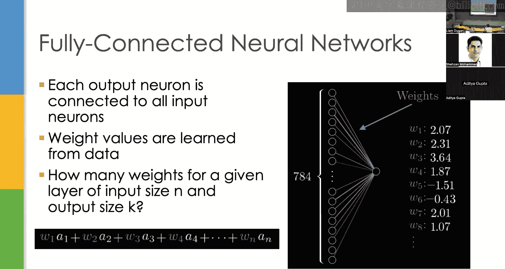

输入是一个长度为784的向量，代表28x28图像中每个像素的灰度值（0到1之间）。输出是一个K维向量（K=10），其中每个元素对应一个数字类别的“得分”。


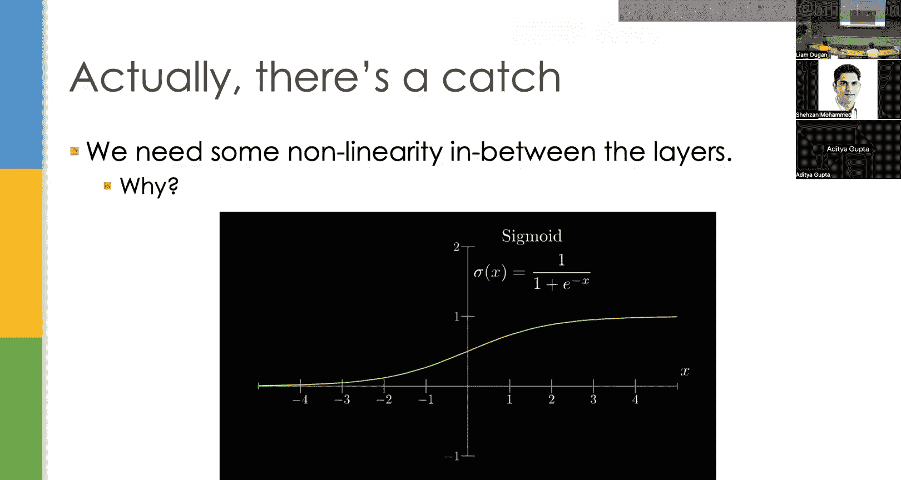

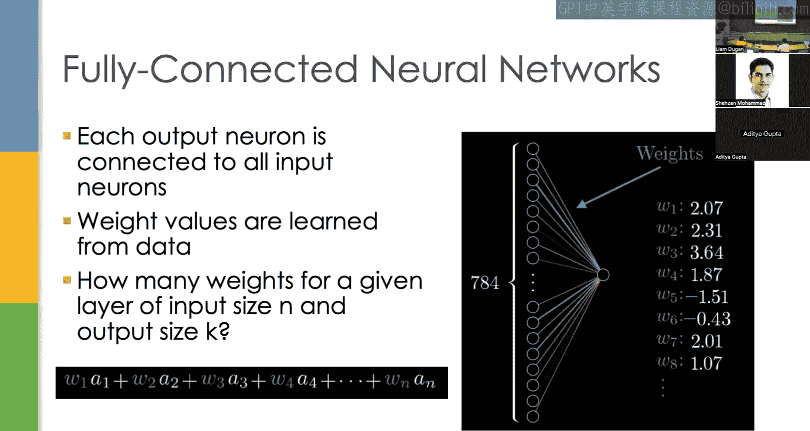

上图展示了一个解决此问题的神经网络。我们将784维的输入向量送入网络，经过网络内部的计算，理想情况下，代表数字“7”的输出节点会被激活，从而将数字分类为7。

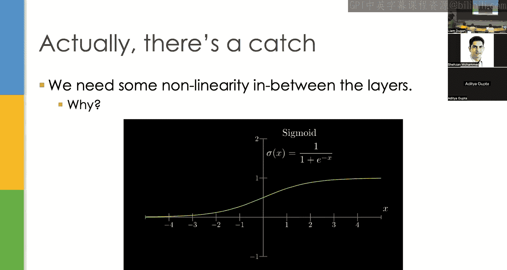

### 神经元与权重
网络中的圆圈代表**神经元**（或节点），本质上就是一个数字。连接线代表**权重**，每个权重代表一个乘法运算。

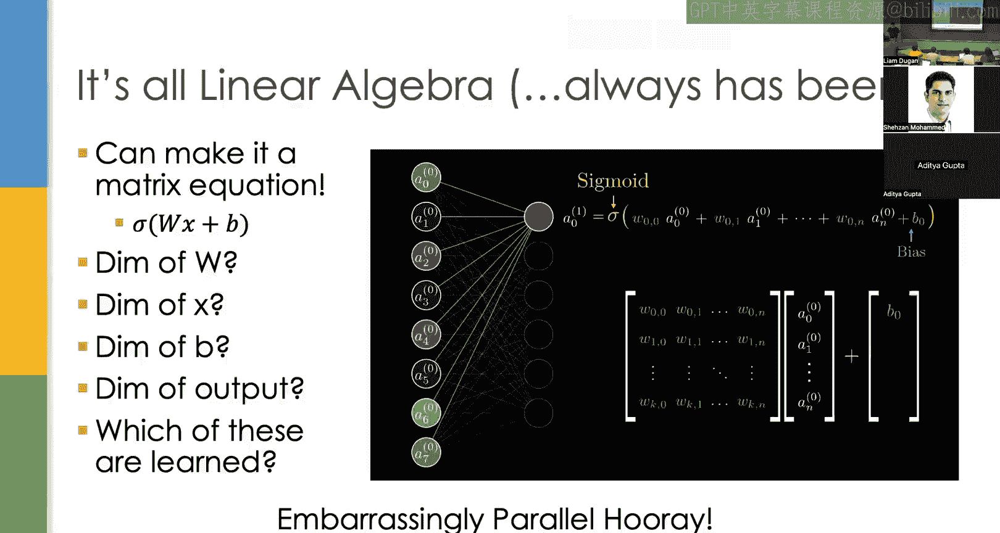

当输入一个数字时，被点亮的节点代表具有较高值的神经元。当我们乘以一个很大的权重时，相应的连接线也会被点亮。

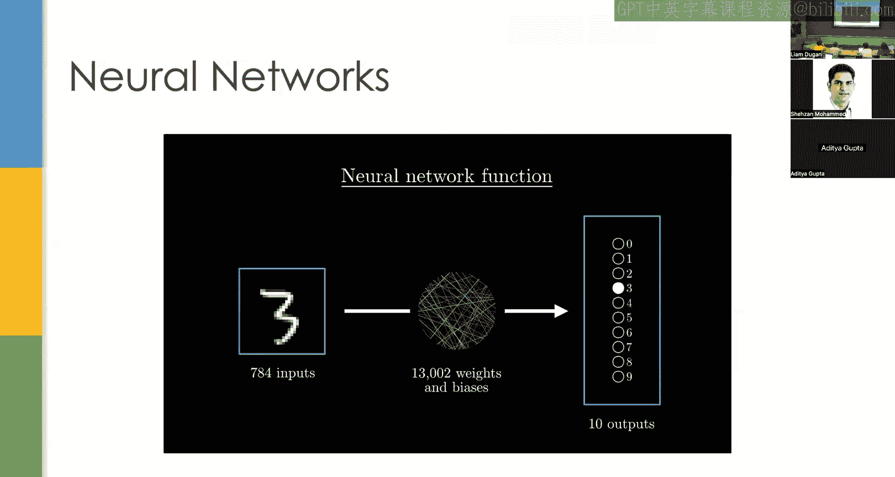

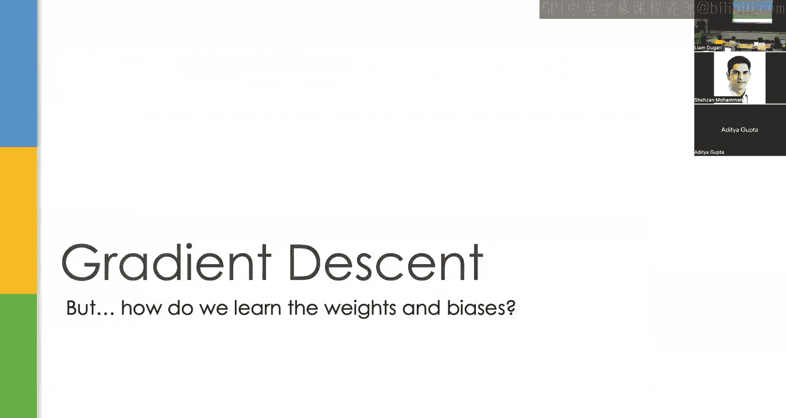

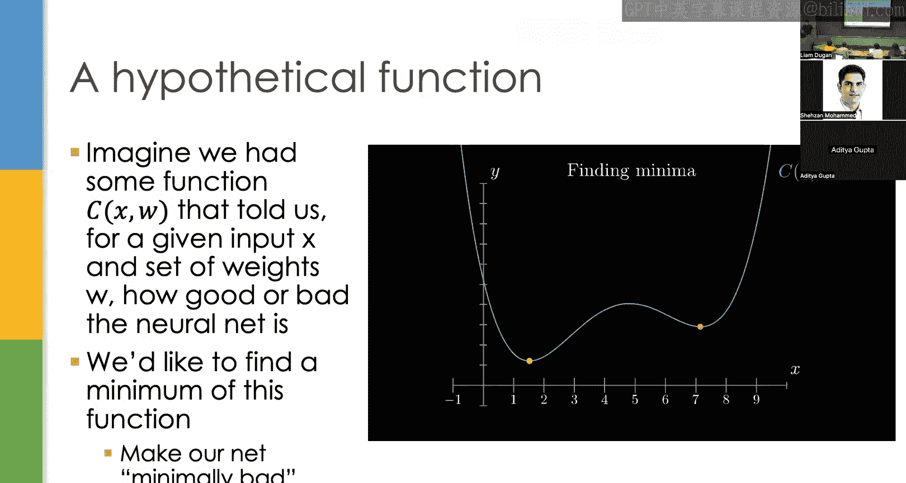


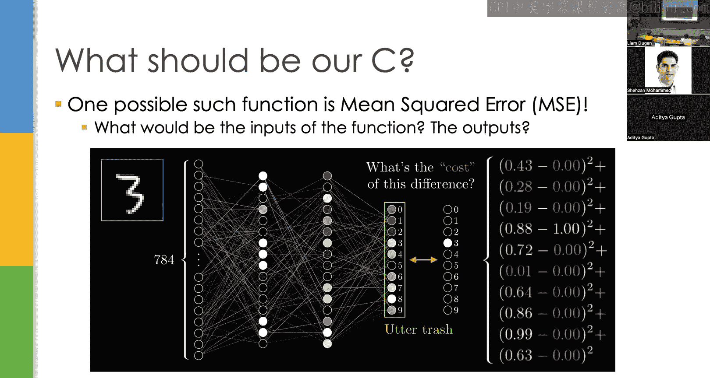

权重值是从数据中学习得到的。在机器学习中，我们通常先连接所有权重，然后尝试从数据中学习这些权重的值。

对于一个输入大小为N、输出大小为K的层，其权重数量为 **N × K**。在基本的前馈神经网络中，如果每一层都与下一层全连接，那么参数数量就是各层维度相乘的结果。

### 非线性激活函数
然而，我们不能简单地无限堆叠线性层。因为线性代数是线性的，如果连续进行矩阵乘法，所有层最终会坍缩成一个等效的单层，这无法增加网络的表示能力。

为了训练具有多个层的网络，我们需要在层之间引入**非线性函数**，以防止这种模式坍缩。目前我们将使用Sigmoid函数，后续会讨论其他选择。

Sigmoid函数的公式是：
```
σ(x) = 1 / (1 + e^(-x))
```
它将任何实数映射到(0, 1)区间内。

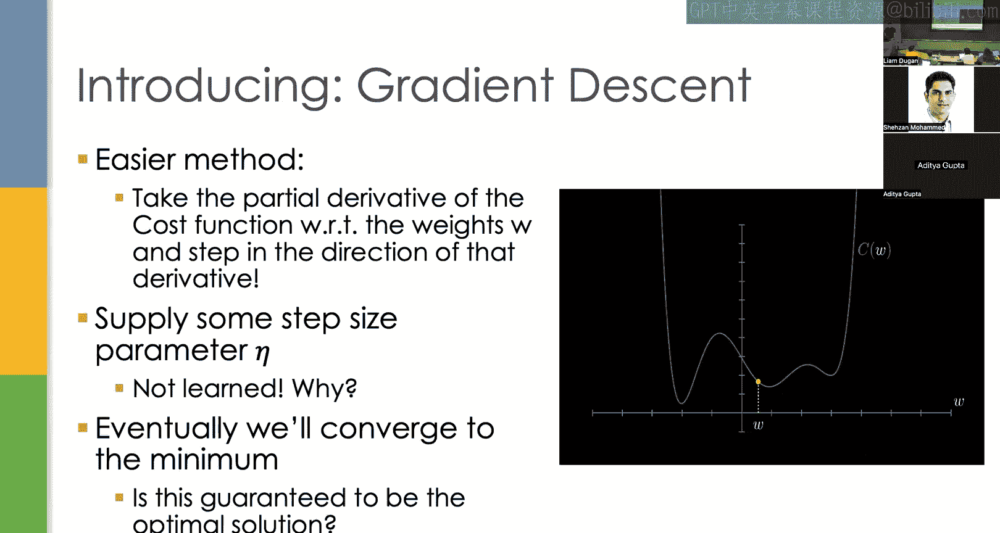

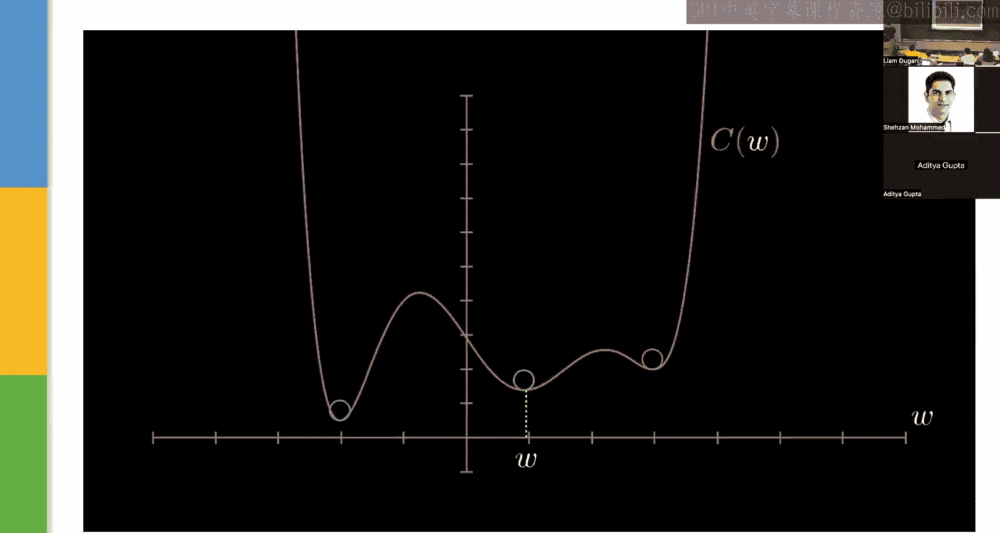


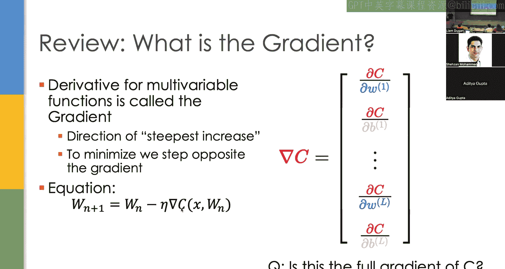

### 单个神经元的计算
单个神经元（节点）的完整计算公式如下：
```
输出 = σ( Σ (权重_i × 激活_i) + 偏置 )
```
其中，σ代表Sigmoid函数，我们对所有输入进行加权求和，加上偏置项，然后通过Sigmoid函数。

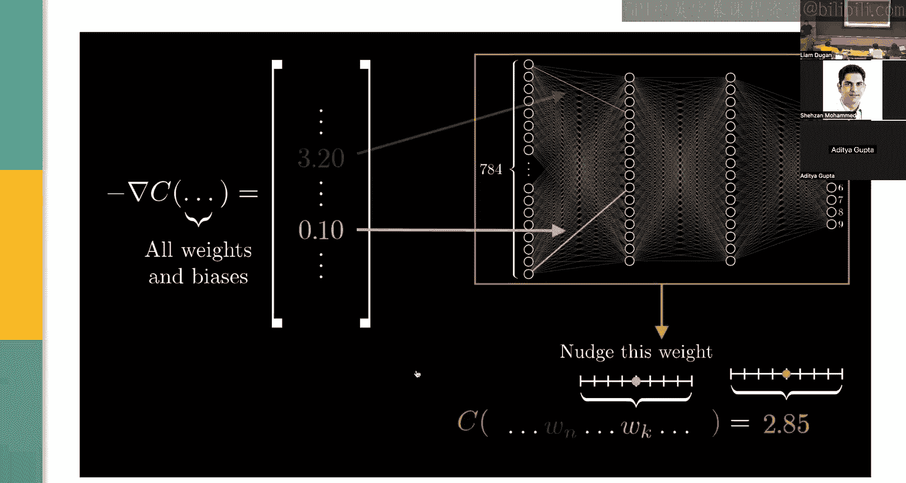

**偏置项**的作用是调整加权和的范围。如果加权和的结果非常大（例如100），Sigmoid函数在该区域的梯度会非常小，使得学习变得困难。偏置项可以将Sigmoid函数的“零点”移动到当前层激活值的均值附近，帮助模型学习正确的参数化。

### 全层矩阵表示
当我们要表示整个神经网络层，而不是单个神经元时，可以使用矩阵方程：
```
A^[l] = σ( W^[l] · A^[l-1] + b^[l] )
```
其中：
*   `σ` 是逐元素应用的Sigmoid函数。
*   `W^[l]` 是第l层的权重矩阵（维度：`n_输入 × n_输出`）。
*   `A^[l-1]` 是上一层的激活值向量（输入）。
*   `b^[l]` 是第l层的偏置向量。
*   `A^[l]` 是第l层的输出激活值向量。

可学习的参数就是权重`W`和偏置`b`。从GPU程序员的角度看，这具有高度的并行性，非常适合GPU计算。

---

## 如何学习权重？

上一节我们介绍了神经网络的结构，本节中我们来看看如何通过数据来学习网络中的权重和偏置。

### 损失函数
首先，我们需要一个函数来衡量神经网络在给定输入和参数下的表现有多“差”。这个函数称为**损失函数**或**成本函数**。学习正确权重的问题就简化为寻找使这个函数值最小化的参数集。

对于手写数字分类任务，一个简单的损失函数是网络输出与正确输出之间的差异。正确输出是一个“one-hot”向量：正确类别位置为1，其余为0。

我们可以计算差值并取平方（均方误差），这样无论差值是正是负，都能很好地衡量我们距离真实值有多远。
```
均方误差损失 = (预测值 - 真实值)^2
```

### 梯度下降
我们如何最小化这个损失函数？我们使用一种称为**梯度下降**的方法。

我们计算损失函数关于权重（我们唯一能控制的参数）的偏导数。然后，我们沿着该导数的反方向（即梯度下降的方向）前进一小步。


我们必须指定一个**步长**（学习率），因为我们只知道方向，不知道应该走多远。学习率是一个**超参数**，不能通过梯度下降本身来学习，因为学习梯度下降需要步长，这会导致循环依赖。

通过多次迭代，我们最终会到达梯度接近零的区域，即一个局部最小值。然而，这并不能保证是全局最优解。神经网络的损失函数是非凸的，可能存在无数个局部最小值。从不同点（随机初始化权重）开始，可能会落入不同的最小值，这导致模型性能存在波动。

### 扩展到高维空间
在更高维度中，我们使用**梯度**，它是损失函数对所有参数的偏导数向量。梯度指向函数值上升最陡的方向，其反方向则是下降最陡的方向。

梯度下降的更新公式为：
```
W_new = W_old - η * ∇C(W_old)
```
其中 `η` 是学习率，`∇C` 是损失函数 `C` 关于权重 `W` 的梯度。

另一种理解梯度的方式是：它表示轻微扰动某个权重会对特定输入的输出产生多大影响。对输出影响越大的权重，在更新时调整的幅度也应该越大。

---

## 反向传播：计算梯度

上一节我们介绍了梯度下降的概念，本节中我们深入探讨如何高效地计算梯度，即**反向传播**算法。

我们将计算一个简单两层神经网络中每个参数的梯度。虽然现代机器学习库会自动完成此过程，但若要优化这些库，理解其原理至关重要。

我们从最后一层（第L层）开始。该层的方程如下：
```
Z^[L] = W^[L] · A^[L-1] + b^[L]
A^[L] = σ(Z^[L])
C = (A^[L] - Y)^2
```
其中：
*   `Z^[L]` 是线性层的输出。
*   `σ` 是Sigmoid激活函数。
*   `A^[L]` 是激活值（Sigmoid的输出）。
*   `C` 是损失函数（这里用均方误差）。
*   `Y` 是真实标签。

我们需要计算损失 `C` 对权重 `W^[L]` 和偏置 `b^[L]` 的导数。我们使用链式法则从后向前计算：

1.  **损失对激活值的导数**：`∂C/∂A^[L] = 2 * (A^[L] - Y)`
2.  **激活值对其输入的导数**：`∂A^[L]/∂Z^[L] = σ'(Z^[L])` （Sigmoid的导数：`σ(z) * (1 - σ(z))`）
3.  **线性层对权重的导数**：`∂Z^[L]/∂W^[L] = A^[L-1]`

根据链式法则，损失对权重的梯度为：`∂C/∂W^[L] = (∂C/∂A^[L]) * (∂A^[L]/∂Z^[L]) * (∂Z^[L]/∂W^[L])`

对于更早的层，过程类似但更复杂，因为每个前一层的激活值都连接到后一层的所有输入。因此，在反向传播时，我们需要将来自后一层所有神经元的梯度贡献累加起来。这使得计算需要更多的累积操作。

### 如何使用梯度？
理论上，最准确的梯度下降应该对训练集中**所有**样本计算梯度，取平均值，然后更新一次权重。这被称为**批量梯度下降**，但速度很慢。

一个很好的近似是**随机梯度下降**：对每个样本计算梯度并立即更新权重。虽然针对单个样本的更新方向可能不稳定，但期望上会收敛到最小值。其更新路径看起来更加随机。


一个常见的折衷方案是**小批量随机梯度下降**：每次取一小批样本（例如32个），计算平均梯度，然后更新。这能平滑掉异常样本的影响，并且非常适合GPU并行计算——可以同时进行32次前向传播和反向传播，时间开销增加很少。

有趣的是，批量大小32之所以流行，是因为它正好等于CUDA中一个**线程束**的线程数（32）。

---

## 机器学习核心术语

在深入改进方法之前，我们先快速回顾一些核心的机器学习术语：

*   **激活函数**：层之间的非线性函数，如Sigmoid、ReLU。
*   **损失/成本函数**：衡量模型预测与真实值差异的函数。
*   **输入表示**：如何将原始数据（如图像、文本）转换为输入向量的方法。
*   **参数**：模型中可学习的数值，即权重和偏置。
*   **架构**：神经网络中神经元和层的连接方式。
*   **优化器**：执行梯度下降的具体算法（如SGD、Adam）。
*   **超参数**：不是从数据中学习，而是预先设定的参数，如学习率、批量大小、网络层数。
*   **初始化**：训练开始前权重和偏置的初始值。通常从一个小范围（如[-1, 1]）内随机采样，而不是全零初始化。

### 数据集划分与过拟合
*   **训练/开发/测试集划分**：
    *   **训练集**（约80%）：用于实际计算梯度下降，更新模型参数。
    *   **开发集**（验证集）：用于调整超参数（如学习率），评估不同配置的效果。
    *   **测试集**：用于最终评估模型性能，确保结果没有过拟合到开发集。通常在最终阶段才使用。
*   **过拟合**：当模型在训练集上训练过度，完美记忆了训练样本，导致在未见过的数据上泛化能力变差。解决方法包括**早停**（当开发集性能不再提升时停止训练）和使用正则化技术。

---

## 对基础设置的改进

上一节我们介绍了机器学习的基本框架，本节中我们来看看过去几十年中对这些基础组件的一系列重要改进。

### 1. 增加网络深度
使神经网络性能大幅提升的一个关键因素是使用**更深的网络**（更多层）。这通常被称为**深度学习**。

直观上，更深的网络可以学习更复杂的函数。虽然理论上具有无限宽度的两层网络可以逼近任何函数，但在宽度固定的情况下，深度增加确实能提高表示能力。当然，这也带来了巨大的计算成本，而GPU的出现使得训练深度网络成为可能。

如今的大型模型拥有数十亿甚至数万亿参数，远超我们例子中的13,000个参数。

### 2. 改进损失函数：Softmax与交叉熵
对于分类任务，均方误差损失并不理想。网络输出是K个类别的得分，而标签是一个概率分布（one-hot向量）。

首先，我们使用**Softmax**函数将网络输出转换为概率分布：
```
Softmax(z_i) = e^(z_i) / Σ_j e^(z_j)
```
Softmax确保所有输出之和为1，并且通过指数运算，使得最高得分在最终概率中占据主导地位，让模型更专注于区分最可能的类别。

然后，我们使用**交叉熵损失**（本质上是KL散度）来比较两个概率分布。与均方误差相比，交叉熵在概率接近0或1时能提供更有意义的梯度，其导数形式也更简洁。

### 3. 改进激活函数：从Sigmoid到ReLU
Sigmoid函数存在**梯度消失**问题：当输入值很大或很小时，其导数接近于零，导致梯度更新非常缓慢，权重可能“卡住”。

**ReLU（修正线性单元）** 函数解决了这个问题：
```
ReLU(z) = max(0, z)
```
它在正区间的导数恒为1，避免了梯度消失。同时，它允许网络“关闭”不重要的神经元（输出为0）。虽然ReLU在z=0处不可微，但在实践中可以定义其导数为0或1。

ReLU的缺点是“死亡ReLU”问题：如果神经元初始化为负值且始终未被激活，则可能永远无法更新。后续的改进版本如**Leaky ReLU**、**Parametric ReLU**、**GELU**和**Swish**等试图缓解这个问题。

### 4. 正则化技术：Dropout
**Dropout** 是一种防止过拟合的正则化技术。在训练过程中，以一定概率（如10%）随机将网络中的神经元输出置零。

这迫使网络不能过度依赖任何一个特定的神经元或特征，必须将知识分散到整个网络中，从而提高了泛化能力。

### 5. 改进优化器：带动量的SGD与Adam
基本的梯度下降对学习率选择很敏感：太大容易震荡，太小收敛慢。

**带动量的SGD**不仅考虑当前梯度，还加入之前更新方向的一部分（动量项），帮助冲出狭窄的局部最小值。

**Adam** 优化器在此基础上更进一步，不仅考虑梯度的一阶矩（均值，即动量），还考虑二阶矩（未中心化的方差）。它自适应地调整每个参数的学习步长，对稀疏特征（不常出现的特征）给予更大的更新。自2015年以来，Adam及其变体已成为训练深度学习模型（尤其是大型语言模型）的事实标准。

---

## 改进网络架构：卷积神经网络

上一节我们讨论了组件级的改进，本节中我们来看看对网络整体架构的根本性改进，以处理更复杂的任务。

基础的全连接网络在处理像ImageNet这样的大型图像数据集（1000类，196608维输入）时，参数量会爆炸式增长（一层就接近2亿参数）。我们需要利用对数据本身的先验知识来减少参数量。

图像数据有两个关键特性：
1.  **平移不变性**：物体在图像中的位置不影响其类别。
2.  **局部相关性**：像素与其邻近像素的关系最密切。

全连接网络无法利用这些特性，它为每个像素位置独立学习权重。

### 卷积层
**卷积神经网络** 引入了**卷积层**。它使用一个小的**滤波器**（或卷积核，如3x3）在图像上滑动。同一个滤波器在整个图像上共享参数，这隐式地编码了平移不变性。滤波器学习检测局部特征（如边缘、纹理）。

卷积操作自然降低了数据的维度（取决于步长和填充方式）。通过堆叠多个卷积层，后面的层可以组合低级特征，形成更复杂的高级特征（如物体部件）。

### 池化层
**最大池化** 是另一个利用平移不变性的操作。它在局部区域（如2x2）内取最大值输出。这回答了“特征是否出现在这个区域”的问题，进一步降低维度，且没有可学习参数，计算开销小。

### AlexNet：深度CNN的里程碑
将卷积层、池化层、ReLU激活函数、Dropout和带动量的SGD结合起来，就构成了深度卷积神经网络。2012年的**AlexNet**是这一领域的开创性工作。

AlexNet是一个8层网络（5个卷积层，3个全连接层），在GPU（GTX 580）上训练，并在ImageNet竞赛中以巨大优势获胜。这标志着深度学习革命的开始。值得注意的是，AlexNet的作者详细优化了其CUDA内核，充分利用了GPU并行计算能力，这正是GPU编程与机器学习交叉的典范。

---

## 机器学习在图形学中的应用与项目构思

上一节我们介绍了CNN这一强大的架构，本节中我们来看看如何将机器学习，特别是CNN，应用于图形学相关任务，并探讨可能的课程项目方向。

一个关键思路是：**任何能够自行生成训练数据的任务，都非常适合应用机器学习**。

以下是几个经典且可行的方向：

### 1. 图像去噪
*   **任务**：给定有噪声的图像，输出去噪后的清晰图像。
*   **训练数据**：可以轻易获得。取清晰图像，人工添加噪声（如高斯噪声）作为输入，原图作为目标输出。
*   **网络**：训练一个CNN来预测噪声图，然后从输入中减去预测的噪声得到清晰图像。预测噪声比直接预测清晰图像更容易。
*   **为何CNN有效**：噪声通常是局部相关的，CNN的滤波器擅长捕捉和处理这种局部模式。

### 2. 图像超分辨率
*   **任务**：给定低分辨率图像，输出高分辨率图像。
*   **训练数据**：将高分辨率图像下采样得到低分辨率版本，配对即可。
*   **网络**：训练一个CNN来预测高分辨率与低分辨率图像之间的残差，然后将残差加到输入上。这也可以看作一种去噪任务（噪声是下采样引入的信息损失）。

### 3. 帧插值
*   **任务**：给定视频的连续两帧，生成中间帧以提高帧率。
*   **训练数据**：从高帧率视频中，每隔一帧或几帧取一帧作为输入，被跳过的帧作为目标输出。
*   **网络**：可以使用3D CNN（在空间和时间维度上进行卷积）来处理连续帧，预测中间帧。使用均方误差损失。
*   **挑战**：纯CNN在建模时间动态和运动轨迹方面可能不如一些结合了光流或Transformer的混合架构，这留下了优化空间。

### 过往课程项目示例
1.  **WebGPU图像超分辨率**：在浏览器中使用WebGPU实现实时的图像超分辨率。
2.  **基于光流的帧插值**：实现更先进的帧插值模型（如Flavr架构）。
3.  **实时路径追踪与ML去噪**：将路径追踪作业加速到实时，并使用机器学习CNN进行降噪和提升画质，替代传统的A-Trous滤波器。

### 新项目构思建议
*   **语音处理**：卷积网络在音频领域（如语音识别、去噪、合成）也很常用。可以尝试在边缘设备（如NVIDIA Jetson）上实现高效的实时语音处理管道，这是一个尚未有团队涉足的方向。
*   **底层优化**：不一定要训练新模型。可以专注于：
    *   使用纯CUDA实现一个现有神经网络（如Transformer）的推理过程，并尝试超越PyTorch等框架的性能。
    *   针对特定硬件（如移动GPU、边缘设备）优化现有模型的推理速度。
*   **结合新硬件**：在Jetson等边缘设备上部署和优化视觉或语音模型，专注于能效和实时性。

---

## 总结

在本节课中，我们一起学习了机器学习的基础知识。我们从最简单的神经网络和梯度下降开始，逐步了解了损失函数、反向传播、优化器等一系列核心概念。接着，我们探讨了如何通过增加深度、改进损失函数（Softmax+交叉熵）、更换激活函数（ReLU）、加入正则化（Dropout）和使用高级优化器（Adam）来提升模型性能。最后，我们深入研究了卷积神经网络如何利用图像的先验知识（平移不变性、局部性）来高效处理视觉任务，并探讨了机器学习在图形学中的多种应用场景和项目可能性。

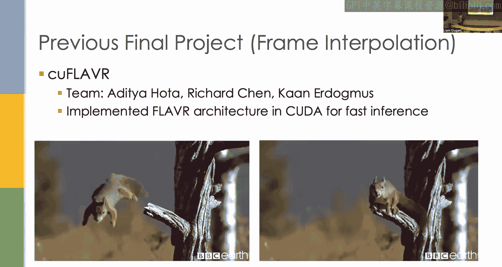

下节课，我们将深入探讨如何在代码层面实现和优化神经网络，包括使用高级框架（如PyTorch）和直接使用CUDA进行底层优化。