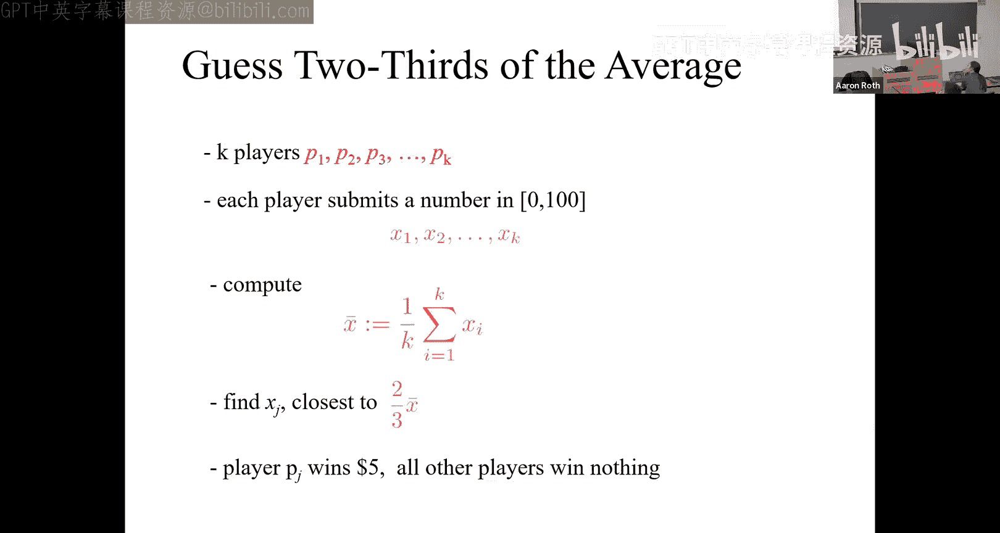

# 001：课程介绍与博弈论基础 🎲

在本节课中，我们将学习算法博弈论的基本概念，了解它与传统算法设计的区别，并通过几个经典例子初步认识博弈论中的核心思想，如纳什均衡和“价格的无政府状态”。

---

## 课程基本信息与安排 📅

上一节我们了解了课程主题，本节中我们来看看课程的具体安排和规则。

**课程时间与地点**：每周两次讲座。
**教学团队**：教授为Er，助教团队包括博士生Natalie和George，以及本科生Charles、Rohan和Kevin。我们将通过办公时间为大家提供支持。

**评分构成**如下：
*   **45%**：作业。每两周一次，共六次。需在GradeScope上提交。
*   **25%**：期中考试。
*   **25%**：期末考试。
*   **5%**：课堂或Slack频道参与度。

**课程基础设施**：
*   **课程网站**：发布讲义和幻灯片。
*   **Slack频道**：用于提问和非正式讨论。
*   **GradeScope**：用于提交作业和接收考试反馈。

**合作与迟交政策**：
*   允许讨论作业问题，但必须独立完成并撰写自己的解决方案。提交时需在作业顶部列出合作者姓名。
*   允许迟交作业，但会有平滑的扣分机制：每晚一天扣20%的分数。

---

## 算法设计与机制设计的区别 ⚙️

在传统的算法设计课程（如算法导论）中，你设计的是“钟表机械”。你控制着系统的每一个部件，目标是编排计算过程以实现预期功能。

然而，在现代系统和平台（如约会应用、Uber、社交网络）的设计中，你无法控制所有“活动部件”。用户是重要的参与者，你无法直接命令他们做什么。你只能通过设计系统的规则、激励和行动空间来**影响**他们，使得这些追求自身目标的分散个体，其整体行为能达成你期望的全局目标。

这就是**机制设计**与纯算法设计的核心区别。在机制设计中，你设计的是平台或媒介，让一群自利的智能体在其中互动，并引导他们产生你期望的全局行为。

---

## 博弈论：从预测到设计 🧠

上一节我们介绍了机制设计的目标，本节中我们来看看实现这一目标的前提：博弈论。

在思考如何设计规则以引导行为（机制设计）之前，你必须先能**预测**在给定规则下会发生什么。**博弈论**提供了一种方法，让我们能够基于系统中不同参与者的微观激励，来预测其整体行为。

因此，本课程将遵循更合理的知识进程：
1.  **博弈论**：分析给定规则下的预测。
2.  **机制设计**：学习如何设计规则以获得期望的行为。

课程大约一半时间学习博弈论，另一半时间学习机制设计。

---

## 什么是博弈？🎯

为了进行预测，我们需要一种精确的方式来描述互动。一个**博弈**的形式化定义包含三个要素：

1.  **玩家**：参与互动的参与者。
2.  **行动集**：每个玩家可以采取的行动集合。
3.  **收益（效用函数）**：一个函数，它将所有玩家选择的行动组合（一个行动向量）映射到每个玩家获得的收益（一个数字）。这个数字编码了玩家对该世界状态的偏好程度。

收益函数是编码对不同世界状态相对偏好的简洁方式。数字本身的大小不重要，重要的是它们所表示的偏好顺序。

对于双人博弈，常用**博弈矩阵**来直观表示。行代表玩家1的行动，列代表玩家2的行动。矩阵中的每个单元格包含两个数字，分别是行玩家和列玩家在该行动组合下的收益。

例如，石头剪刀布游戏可以表示为以下矩阵：
| | 剪刀 | 石头 | 布 |
| :--- | :--- | :--- | :--- |
| **剪刀** | (0, 0) | (-1, 1) | (1, -1) |
| **石头** | (1, -1) | (0, 0) | (-1, 1) |
| **布** | (-1, 1) | (1, -1) | (0, 0) |

然而，对于超过两个玩家的博弈，这种矩阵表示法会变得非常复杂（维度随玩家数指数增长）。因此，我们将主要关注那些具有更多结构、能够被更智能地编码的大型博弈。

---

## 交通路由博弈与纳什均衡 🚗

让我们看一个具有结构的大型博弈例子：交通路由博弈。这个博弈模拟了通勤者选择出行路线的场景。

**博弈设定**：
*   **玩家**：100名司机，每天从A镇前往B镇。
*   **行动**：每条路径由一系列路段组成。每个路段有一个**延迟函数**，将使用该路段的司机数量映射到通行时间。
*   **收益**：司机希望最小化自己的通行时间。

考虑以下路网（初始状态）：
*   有两条路径：上路径和下路径。
*   每条路径包含一个“狭窄乡村路”（延迟 = `x/100` 小时，`x`为使用人数）和一个“绕远高速公路”（延迟 = 1小时）。

**分析与预测**：
在这个博弈中，一个直观且稳定的结果是：**50人走上路径，50人走下路径**。在这种状态下，任何单个司机改变路线都不会减少自己的通行时间（都会从1.5小时增加到约2小时）。这种状态被称为**纳什均衡**——在给定其他人策略的情况下，没有玩家可以通过单方面改变自己的策略而获益。

在这个均衡中，每个人的通行时间是1.5小时，这也是社会最优解（最小化平均通行时间）。

---

## 布雷斯悖论与“价格的无政府状态” 😮

现在，假设政府为了改善交通，在两条“狭窄乡村路”之间修建了一条连接它们的“快速通道”（延迟为0）。

**新路网**：现在存在一条“之字形”路径：上乡村路 -> 快速通道 -> 下乡村路。

**新均衡分析**：
在新的路网中，唯一的纳什均衡变成了**所有100名司机都选择“之字形”路径**。因为只要不是所有人都走之字形，就总有司机可以通过切换到之字形路径来减少通行时间。然而，当所有人都走之字形时，每个人的通行时间变成了2小时（两段乡村路各1小时）。

**布雷斯悖论**：增加道路资源（更多选择）反而使均衡结果变得更糟（通行时间从1.5小时增加到2小时）。这在优化问题中不会发生（增加选项永远不会使最优解变差），但在博弈论中却可能发生，因为玩家是自私优化的。

**价格的无政府状态**：这个概念衡量了由于玩家自私优化而导致的系统性能损失。它是**最差纳什均衡的性能**与**全局最优解的性能**之比。

在本例中：
*   最差（也是唯一）纳什均衡性能：2小时平均通行时间。
*   全局最优解性能（若可集中指派）：1.5小时平均通行时间。
*   **价格的无政府状态** = `2 / 1.5 = 4/3`。

研究表明，对于线性延迟函数的这类路由博弈，4/3是最坏情况下的价格的无政府状态。

---

## 囚徒困境与占优策略 ⚖️

并非所有博弈都像路由博弈那样需要复杂推理。有些博弈存在**占优策略**——无论其他玩家做什么，某个策略对你来说都是最好的。

**囚徒困境**是一个经典的双人博弈例子（故事仅为背景，博弈由收益矩阵定义）：
*   **玩家**：两个共犯。
*   **行动**：沉默（合作）或背叛（指证对方）。
*   **收益（刑期年数）**：
    *   双方沉默：各判5年。
    *   双方背叛：各判40年。
    *   一人背叛，一人沉默：背叛者判3年，沉默者判50年。

**分析**：
对于每个囚徒来说，“背叛”是一个占优策略。因为无论对方选择什么，自己选择“背叛”得到的刑期（3年或40年）总是短于选择“沉默”的刑期（5年或50年）。因此，唯一的纳什均衡（也是占优策略均衡）是（背叛，背叛），双方各判40年。

**启示**：个人理性选择导致了**集体最差的结果**（总刑期80年），远差于双方合作的结果（总刑期10年）。这表明自私优化有时会导致严重的社会福利损失。

---

## 课堂游戏与逻辑谜题 🤔

为了让大家亲身体验多玩家博弈中的策略推理，我们引入两个互动环节。

**1. 猜平均数的2/3游戏**
*   **规则**：每位玩家在0到100之间选择一个数字（可以是小数）。计算所有数字的平均值，然后计算该平均值的`2/3`。最接近`2/3`平均值的玩家赢得5美元。
*   **任务**：请思考“理性”游戏意味着什么，观察你周围的同学，并通过课程Slack提供的链接提交你的猜测。

**2. 蓝眼睛岛民谜题（课后讨论）**
*   **场景**：一个与世隔绝的岛上住着100个逻辑学家。每个人都是蓝眼睛，但岛上没有镜子，没人知道自己的眼睛颜色。岛规：如果有人推断出自己是蓝眼睛，他必须在当晚离开岛屿。大家是朋友，所以绝不会告诉别人他的眼睛颜色。
*   **事件**：一天，一个外来者无意中说了一句：“你们当中至少有一个是蓝眼睛。”说完后就被送走了。
*   **问题**：这句话会产生影响吗？岛上的生活会继续如常，还是会发生什么？
*   **任务**：请在下次课前，在课程Slack频道上讨论你对这个谜题的答案和推理。

---

## 总结 📚

本节课中我们一起学习了算法博弈论的入门知识：
1.  我们明确了**机制设计**（设计规则引导行为）与**算法设计**（控制所有部件）的根本区别。
2.  我们认识到**博弈论**是进行预测的基础，然后才能进行机制设计。
3.  我们学习了博弈的形式化定义：**玩家、行动集、收益函数**。
4.  通过**交通路由博弈**的例子，我们直观理解了**纳什均衡**的概念——一个稳定的策略组合，以及**布雷斯悖论**——增加资源可能使均衡变糟。
5.  我们引入了**价格的无政府状态**来衡量自私优化带来的性能损失。
6.  通过**囚徒困境**，我们看到了**占优策略**如何导致个人理性与集体利益的冲突。
7.  最后，我们通过两个互动环节（猜数游戏和逻辑谜题）来实践多玩家博弈中的策略思考。

从下一讲开始，我们将进入严格的数学模式：定义、引理、定理和证明。