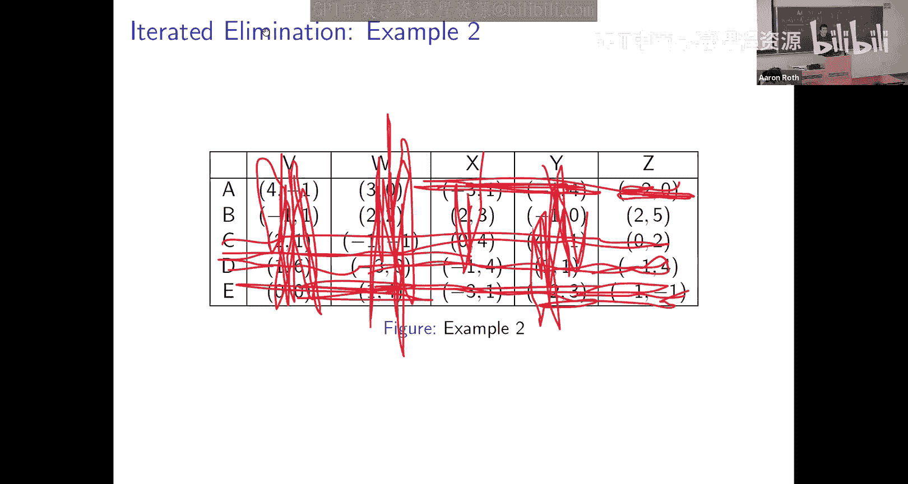

# 002：博弈论基础概念与解概念

在本节课中，我们将学习博弈论的核心基础概念，包括博弈的定义、最佳应对、占优策略、占优策略均衡、重复剔除劣策略以及纳什均衡。我们将从最简单的概念开始，逐步构建更复杂的解概念，并理解它们之间的关系。

---

## 博弈的基本定义

上一节我们介绍了课程概览，本节中我们来看看博弈的正式数学定义。一个博弈模型用于描述多个参与者之间的策略互动。

一个博弈由以下三个基本要素构成：

1.  **玩家集合**：一个有限的参与者集合，记为 \( P \)。每个参与者被称为一个玩家。
2.  **行动集**：对于每个玩家 \( i \)，有一个有限的行动集合，记为 \( A_i \)。这代表了玩家 \( i \) 所有可能的选择。
3.  **效用函数**：对于每个玩家 \( i \)，有一个效用函数 \( u_i \)。该函数将每个可能的**行动组合**（即每个玩家都选择一个行动后形成的局面）映射到一个实数，表示玩家 \( i \) 在该局面下的满意度。

我们用 \( A = A_1 \times A_2 \times ... \times A_n \) 表示所有可能的行动组合的集合。一个具体的行动组合记为 \( a = (a_1, a_2, ..., a_n) \)，其中 \( a_i \) 是玩家 \( i \) 选择的行动。

为了分析单个玩家的决策，我们经常需要关注**其他所有玩家**的行动。我们用 \( a_{-i} \) 表示除玩家 \( i \) 外所有其他玩家选择的行动组合。所有 \( a_{-i} \) 构成的集合记为 \( A_{-i} \)。

博弈论的基本前提是：玩家会试图选择行动以最大化自己的效用。然而，一个玩家的效用取决于所有玩家的行动，而不仅仅是自己的行动。

---

## 最佳应对

既然玩家的效用取决于他人的行动，那么一个自然的想法是：**如果我知道其他所有人会怎么做，我该如何选择？** 这就引出了**最佳应对**的概念。

**定义**：对于玩家 \( i \)，给定其他玩家的行动组合 \( a_{-i} \)，一个行动 \( a_i^* \) 是**最佳应对**，如果对于玩家 \( i \) 所有其他可能的行动 \( a_i' \)，都有：
\[
u_i(a_i^*, a_{-i}) \geq u_i(a_i', a_{-i})
\]
换句话说，在对手行动固定为 \( a_{-i} \) 的情况下，\( a_i^* \) 能给玩家 \( i \) 带来最高的效用。

---

## 占优策略与占优策略均衡

最佳应对依赖于对手的行动。但有时，一个策略可能**无论对手做什么**都是最好的选择。这就是**占优策略**。

**定义**：对于玩家 \( i \)，一个行动 \( a_i \) **弱占优**另一个行动 \( a_i' \)，如果对于所有其他玩家的行动组合 \( a_{-i} \)，都有：
\[
u_i(a_i, a_{-i}) \geq u_i(a_i', a_{-i})
\]
并且至少存在一个 \( a_{-i} \) 使得不等式严格成立（>）。这意味着行动 \( a_i \) 在任何情况下都不比 \( a_i' \) 差，并且在某些情况下更好。

如果一个行动 \( a_i \) 弱占优于玩家 \( i \) 的所有其他行动，那么 \( a_i \) 就是玩家 \( i \) 的一个**弱占优策略**。拥有占优策略的玩家无需猜测对手的行动，直接选择该策略就是最优的。

当博弈中的**每一个**玩家都有一个占优策略时，就形成了一个特别稳定的局面。

**定义**：一个行动组合 \( a = (a_1, a_2, ..., a_n) \) 是一个**占优策略均衡**，如果对于每一个玩家 \( i \)，行动 \( a_i \) 都是该玩家的一个占优策略。

**例子：囚徒困境**
考虑以下收益矩阵（行玩家收益，列玩家收益）：

|          | 坦白   | 沉默   |
| :------- | :----- | :----- |
| **坦白** | (1, 1) | (5, 0) |
| **沉默** | (0, 5) | (3, 3) |

对于行玩家：
*   如果列玩家选择“坦白”，行玩家选“坦白”得1，选“沉默”得0。最佳应对是“坦白”。
*   如果列玩家选择“沉默”，行玩家选“坦白”得5，选“沉默”得3。最佳应对是“坦白”。
因此，“坦白”是行玩家的占优策略。同理，“坦白”也是列玩家的占优策略。所以，（坦白，坦白）构成了一个占优策略均衡。

---

## 重复剔除劣策略

占优策略均衡虽然理想，但很少出现。然而，即使没有占优策略，我们也可以利用“占优”的逻辑来简化博弈。思路是：理性的玩家不会选择被占优的策略（劣策略）。如果我们假设所有玩家都是理性的，并且都相信其他玩家是理性的，那么我们就可以从博弈中剔除这些劣策略。

这个过程可以迭代进行：剔除第一轮劣策略后，在新的、更小的博弈中，可能又会产生新的劣策略，可以继续剔除。如果最终只剩下一个唯一的行动组合，那么它就构成了一个预测。

**例子**：
考虑以下收益矩阵：

|   | X | Y |
|:-:|:-:|:-:|
| A | 3,3 | 0,5 |
| B | 0,0 | 3,1 |
| C | 1,1 | 1,1 |

1.  对于行玩家，行动C被行动A弱占优（无论列玩家选X还是Y，A的收益都不低于C，且当列玩家选X时A更好）。剔除C。
2.  在新的博弈中，对于列玩家，行动X被行动Y弱占优（当行玩家选A时，Y得5 > X得3；当行玩家选B时，Y得1 > X得0）。剔除X。
3.  现在行玩家面对列玩家唯一的行动Y，比较A（得0）和B（得3），B更好。剔除A。
最终唯一的预测是（B, Y）。

**重要性质**：如果重复剔除劣策略得到一个唯一的行动组合，那么这个组合一定是一个**纳什均衡**（我们接下来会定义）。

---

## 纳什均衡

占优策略均衡要求太强，重复剔除劣策略也不总是有效。我们需要一个更普遍、更基础的“稳定”概念。这就是约翰·纳什提出的**纳什均衡**。

**定义（纯策略纳什均衡）**：一个行动组合 \( a = (a_1, a_2, ..., a_n) \) 是一个**纯策略纳什均衡**，如果对于每一个玩家 \( i \)，以及该玩家任何其他可能的行动 \( a_i' \)，都有：
\[
u_i(a_i, a_{-i}) \geq u_i(a_i', a_{-i})
\]
这意味着，在纳什均衡中，**没有单个玩家可以通过单方面改变自己的行动而获得更高的效用**。或者说，每个玩家选择的行动都是对其他玩家当前行动的最佳应对。

**与之前概念的关系**：
*   占优策略均衡一定是纳什均衡，但反之不成立。
*   重复剔除劣策略得到的唯一结果（如果存在）一定是纳什均衡，但许多纳什均衡无法通过此方法找到。

**例子：协调博弈**
考虑以下“音乐会博弈”：

|            | 巴赫   | 斯特拉文斯基 |
| :--------- | :----- | :----------- |
| **巴赫**   | (5, 1) | (0, 0)       |
| **斯特拉文斯基** | (0, 0) | (1, 5)       |

这个博弈有两个纯策略纳什均衡：（巴赫，巴赫）和（斯特拉文斯基，斯特拉文斯基）。在这两个局面下，任何一方单方面改变行动都会导致双方分离，收益降为0，所以没有人愿意改变。

**存在的问题**：
1.  **可能不存在**：有些博弈没有纯策略纳什均衡，例如“猜硬币”或“石头剪刀布”。
2.  **可能不唯一**：如协调博弈，存在多个均衡，预测不明确。

---

## 混合策略与混合策略纳什均衡

为了解决纯策略纳什均衡可能不存在的问题（如“石头剪刀布”），我们引入**随机性**。玩家可以选择以一定的概率分布来随机选择行动，这称为**混合策略**。

**定义**：玩家 \( i \) 的一个**混合策略** \( \sigma_i \) 是其行动集 \( A_i \) 上的一个概率分布。

一个**混合策略组合** \( \sigma = (\sigma_1, \sigma_2, ..., \sigma_n) \) 指定了每个玩家的混合策略。在这种组合下，玩家 \( i \) 的期望效用是依据所有玩家的概率分布计算出的期望值。

**定义（混合策略纳什均衡）**：一个混合策略组合 \( \sigma \) 是一个**混合策略纳什均衡**，如果对于每一个玩家 \( i \)，以及该玩家任何其他纯策略（或混合策略）\( \sigma_i' \)，都有：
\[
u_i(\sigma_i, \sigma_{-i}) \geq u_i(\sigma_i', \sigma_{-i})
\]
同样，这意味着没有玩家能通过单方面改变自己的策略（即使是改为另一个混合策略）来提高自己的期望效用。

**关键定理（纳什，1950）**：任何有限玩家、有限行动的博弈都**至少存在一个**混合策略纳什均衡。

这解决了存在性问题。在“猜硬币”或“石头剪刀布”中，双方都以50%的概率随机选择（或以1/3的概率随机选择石头、剪刀、布）就构成了一个混合策略纳什均衡。

纯策略纳什均衡可以看作是混合策略纳什均衡的特例（即概率集中在某个行动上）。

---

## 总结

本节课中我们一起学习了博弈论的核心基础概念和解概念，它们构成了一个逐层扩展的体系：

1.  **占优策略均衡**：要求最强，每个玩家都有无论对手如何行动都是最优的策略。存在性罕见，但预测力强。
2.  **重复剔除劣策略**：利用理性共识逐步简化博弈，有时能得到唯一预测。该预测是纳什均衡。
3.  **（纯策略）纳什均衡**：更基础的稳定概念，要求没有玩家愿意单方面偏离。可能不存在，也可能不唯一。
4.  **混合策略纳什均衡**：允许玩家随机化行动，是上述概念的推广。**纳什定理保证了其在有限博弈中的存在性**，从而为我们提供了一个普遍的分析基准。

从下一讲开始，我们将以纳什均衡为起点，深入探讨其性质、计算方法以及动态收敛过程。