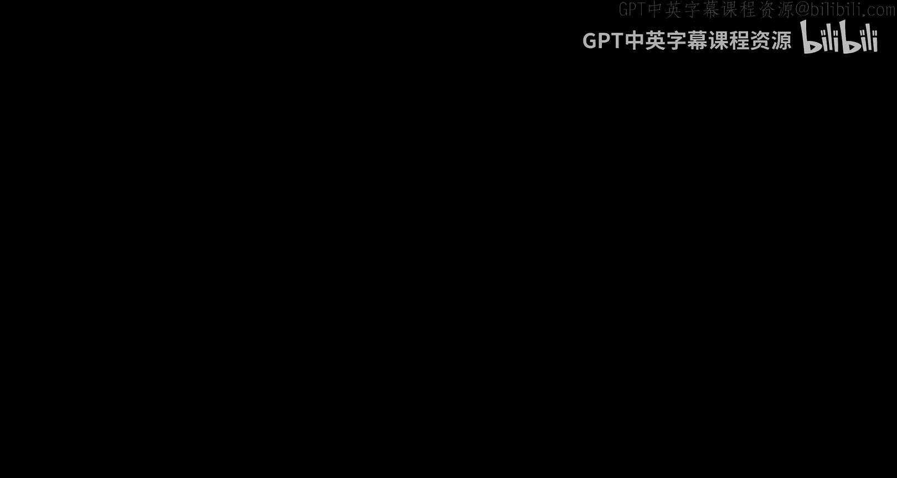

# 004：最佳响应动态的收敛性

在本节课中，我们将要学习如何判断一个博弈中的最佳响应动态是否必然收敛。我们将通过分析几个非拥堵博弈的例子，并最终抽象出一个通用条件，来精确刻画最佳响应动态收敛的博弈类别。

---

## 回顾与动机

上一讲我们介绍了拥堵博弈，并证明了在该类博弈中，最佳响应动态（即使玩家只进行“更好响应”）必然会收敛到一个纯策略纳什均衡。这为预测大型博弈的稳定状态提供了一个计算上合理的故事。

然而，拥堵博弈只是众多博弈类型中的一种。一个自然的问题是：最佳响应动态的收敛性是否适用于更广泛的博弈类别？或者说，我们能否精确地描述出所有最佳响应动态必然收敛的博弈？

为了回答这个问题，本节我们将首先研究两个非拥堵博弈的例子，证明最佳响应动态在其中依然收敛。然后，我们将从这些证明中抽象出关键结构，并给出一个“当且仅当”的完整刻画。

---

## 案例研究一：相同机器上的负载均衡博弈 🖥️

首先，我们来看一个看起来很像拥堵博弈，但严格来说并不是拥堵博弈的例子：相同机器上的负载均衡博弈。

### 博弈描述

*   **玩家**： 每个玩家 `i` 有一个需要运行的作业，其大小为 `w_i`（一个正数权重）。
*   **行动**： 每个玩家选择将作业调度到 `m` 台相同机器中的某一台上。
*   **成本**： 玩家 `i` 的成本是他所选机器的**负载**，即调度到该机器上的所有作业的权重之和。

**公式化描述**：
*   设机器 `j` 上的玩家集合为 `S_j`。
*   机器 `j` 的负载为：`L_j = Σ_{i ∈ S_j} w_i`。
*   玩家 `i`（选择了机器 `j`）的成本为：`cost_i = L_j`。

### 为何不是拥堵博弈？

在标准的拥堵博弈中，每条设施（此处为机器）的成本函数**仅取决于使用该设施的玩家数量**，而不关心具体是哪些玩家。然而，在此博弈中，机器的负载是**玩家权重的和**，这依赖于具体玩家的身份（即他们的权重 `w_i``）。因此，它不是一个拥堵博弈。

### 收敛性证明

尽管不是拥堵博弈，我们仍能证明最佳响应动态在此博弈中收敛。证明的关键是找到一个合适的**势函数**。

我们定义势函数 `Φ` 为所有机器负载平方和的一半：
`Φ = (1/2) * Σ_{j=1}^{m} (L_j)^2`

**证明思路**：
1.  考虑玩家 `i` 从机器 `j` 切换到机器 `j'` 的一次更好响应。
2.  玩家 `i` 的成本变化为：`Δcost_i = (L_{j'} + w_i) - L_j`。由于这是更好响应，我们有 `Δcost_i < 0`。
3.  计算势函数的变化 `ΔΦ`。只有机器 `j` 和 `j'` 的负载发生变化。
    *   切换后，`j'` 的新负载为 `L_{j'} + w_i`，`j` 的新负载为 `L_j - w_i`。
    *   经过代数运算（展开平方项并消元），我们可以得到：
        `ΔΦ = w_i * Δcost_i`
4.  由于 `w_i > 0` 且 `Δcost_i < 0`，因此 `ΔΦ < 0`。
5.  势函数 `Φ` 在每次更好响应后严格下降，并且其取值是有限的。因此，动态不可能进入循环，最终必然收敛到一个纯策略纳什均衡。

**关键观察**：
在此证明中，势函数的变化 `ΔΦ` 并不等于玩家成本的变化 `Δcost_i`，而是与之**同号**（因为 `w_i > 0`）。这比“精确相等”的要求更弱，但足以保证收敛。

---

## 案例研究二：红州蓝州博弈 🔴🔵

接下来，我们看一个与拥堵博弈结构截然不同的例子：红州蓝州博弈（或称网络协调博弈）。

### 博弈描述

*   **玩家与网络**： 玩家位于一个无向图 `G=(V, E)` 的顶点上。边 `(i, j)` 具有权重 `w_{ij}`，可正可负（正表示朋友/亲和，负表示敌人/排斥）。
*   **行动**： 每个玩家 `i` 选择一个行动 `a_i ∈ {+1, -1}`（例如，+1代表“红州”，-1代表“蓝州”）。
*   **效用**： 玩家 `i` 希望与朋友选择相同行动，与敌人选择相反行动。其效用函数为：
    `u_i(a) = Σ_{j: (i,j) ∈ E} w_{ij} * a_i * a_j`
    *   当 `a_i = a_j` 时，`a_i * a_j = +1`，贡献 `+w_{ij}`。
    *   当 `a_i ≠ a_j` 时，`a_i * a_j = -1`，贡献 `-w_{ij}`。

### 收敛性证明

我们再次通过构造势函数来证明最佳响应动态的收敛性。

我们定义势函数 `Φ` 为图中所有边（不重复计算）的贡献之和：
`Φ = Σ_{(i,j) ∈ E, i<j} w_{ij} * a_i * a_j`

**证明思路**：
1.  考虑玩家 `i` 改变其行动（即 `a_i` 变为 `-a_i`）的一次更好响应。
2.  玩家 `i` 的效用变化为：
    `Δu_i = u_i(新) - u_i(旧) = [Σ_{j} w_{ij} * (-a_i) * a_j] - [Σ_{j} w_{ij} * a_i * a_j] = -2 * u_i(旧)`
    由于这是更好响应，`Δu_i > 0`，意味着 `u_i(旧) < 0`。
3.  计算势函数的变化 `ΔΦ`。只有与玩家 `i` 相连的边受到影响。
    *   经过计算可得：`ΔΦ = Σ_{j} w_{ij} * [(-a_i)*a_j - a_i*a_j] = -2 * Σ_{j} w_{ij} * a_i * a_j = -2 * u_i(旧)`
4.  因此，`ΔΦ = Δu_i`。
5.  由于 `Δu_i > 0`，我们有 `ΔΦ > 0`。势函数在每次更好响应后严格增加。
6.  势函数有界，因此动态必然收敛到一个纯策略纳什均衡。

**关键观察**：
在此博弈中，势函数恰好等于所有玩家效用总和的一半（即社会总福利的一半）。每次更好响应不仅提高了该玩家的效用，也提高了社会总福利。

---

## 势函数与收敛性的完整刻画 🎯

通过以上三个例子（拥堵博弈、负载均衡博弈、红州蓝州博弈），我们看到一个共同模式：通过构造一个随更好响应单调变化的势函数，可以证明最佳响应动态的收敛性。现在，我们正式定义这类势函数，并建立它们与收敛性之间的等价关系。

### 定义：序数势函数

对于一个博弈，一个函数 `Φ` 被称为**序数势函数**，如果对于任意博弈状态 `a`、任意玩家 `i` 以及该玩家的任意替代行动 `b_i`，满足以下条件：

**当玩家 `i` 从行动 `a_i` 单方面切换到 `b_i` 能降低其成本（或提高其效用）时，势函数值也严格下降（或上升）。**

用符号表示：
如果 `cost_i(b_i, a_{-i}) < cost_i(a_i, a_{-i})`，则必有 `Φ(b_i, a_{-i}) < Φ(a_i, a_{-i})`。

**精确势函数**是序数势函数的一个特例，要求势函数的变化量**等于**玩家成本的变化量（如拥堵博弈和红州蓝州博弈中的例子）。序数势函数只要求变化方向相同，不要求幅度相等（如负载均衡博弈）。

### 定理：收敛性的等价条件

一个博弈中，**最佳响应动态必然收敛（从任意初始状态出发，无论玩家以何种顺序进行更好响应）当且仅当该博弈存在一个序数势函数。**

#### 证明（充分性 ⇒）：

如果博弈存在序数势函数 `Φ`，那么每次更好响应都使 `Φ` 向同一方向严格单调变化。由于博弈状态的总数是有限的，`Φ` 不能无限变化，因此动态不可能进入循环，最终必然停止在一个无人愿意单方面偏离的状态，即纯策略纳什均衡。

#### 证明（必要性 ⇐）：

假设最佳响应动态在博弈 `G` 中必然收敛。我们需要构造一个序数势函数。

1.  **构造状态图**： 以所有可能的博弈状态为顶点。从状态 `a` 向状态 `b` 连一条有向边，当且仅当 `b` 可以通过某个玩家 `i` 的一个更好响应动作从 `a` 到达（即 `a` 和 `b` 仅在玩家 `i` 的行动上不同，且该改变对 `i` 而言是成本降低的）。
2.  **收敛性意味着无环**： “最佳响应动态必然收敛”这一假设，翻译成图论语言，意味着这个有向图是**无环的**。因为如果存在环，就可以构造一个沿着环无限循环的更好响应序列，永不收敛。
3.  **定义势函数**： 由于图是无环的，从每个顶点 `a` 出发，都存在有限长度的路径到达某个汇点（即没有出边的点，对应纳什均衡）。我们定义势函数 `Φ(a)` 为：**从状态 `a` 出发到任意汇点的最长路径的长度**。
4.  **验证序数性质**： 考虑图中的任意一条边 `a → b`（代表一次更好响应）。从 `a` 出发的最长路径，至少可以先走边 `a→b`，然后再走从 `b` 出发的最长路径。因此，`Φ(a) ≥ 1 + Φ(b)`，即 `Φ(a) > Φ(b)`。这正是序数势函数所要求的：更好响应导致势函数严格下降。

因此，我们从一个收敛的动态中构造出了一个序数势函数。

---

## 总结

本节课中我们一起学习了如何系统分析最佳响应动态的收敛性。

1.  我们首先研究了**相同机器上的负载均衡博弈**，它虽然不是标准的拥堵博弈，但我们通过构造势函数 `Φ = 1/2 Σ L_j²` 并证明 `ΔΦ` 与玩家成本变化同号，确立了其收敛性。
2.  接着，我们分析了结构不同的**红州蓝州博弈**，其势函数 `Φ = Σ w_{ij} a_i a_j` 恰好是社会总福利的一半，并证明了更好响应会提高社会总福利，从而保证收敛。
3.  最后，基于这些例子的共同模式，我们引入了**序数势函数**的概念，并证明了**一个博弈的最佳响应动态必然收敛，当且仅当该博弈存在一个序数势函数**。这为判断动态收敛性提供了一个根本性的理论准则。

这个定理表明，我们一直使用的“寻找势函数”的证明方法，并非一种特殊的技巧，而是刻画最佳响应动态收敛性的**完整且必要**的工具。