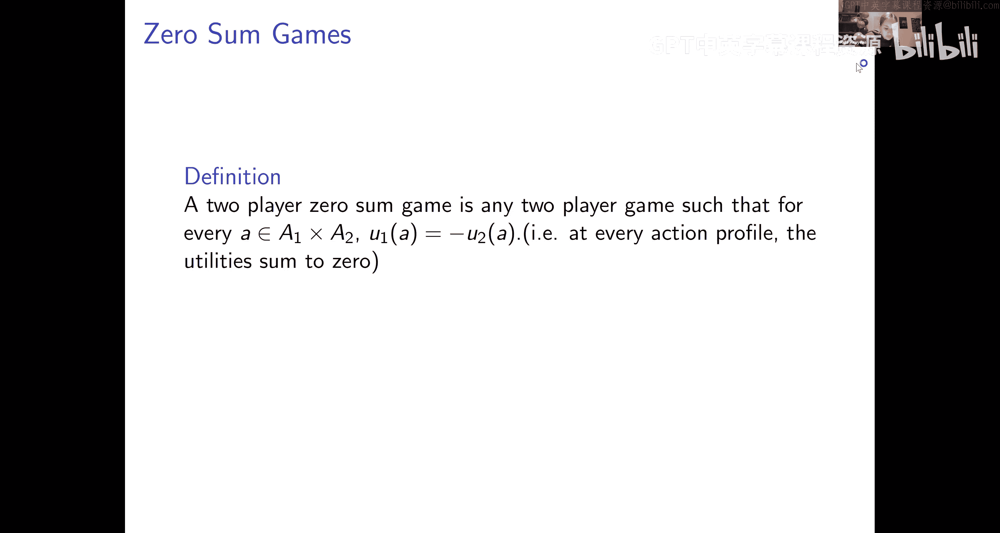
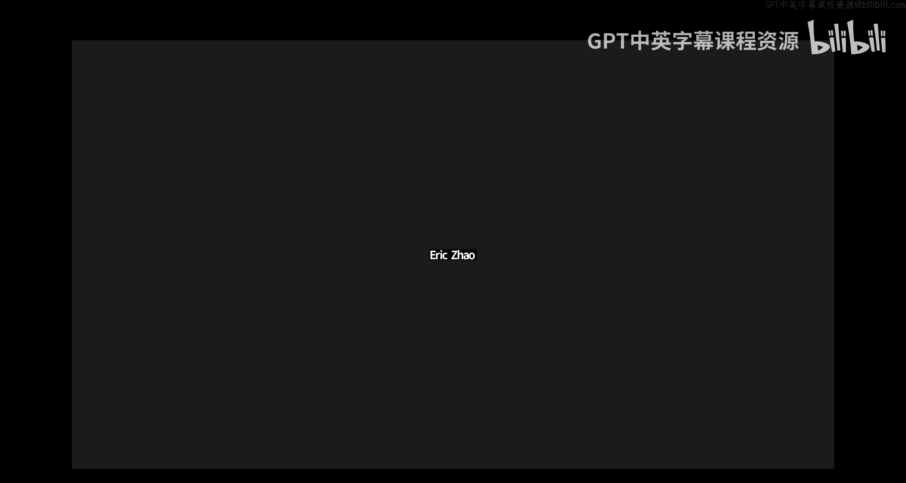
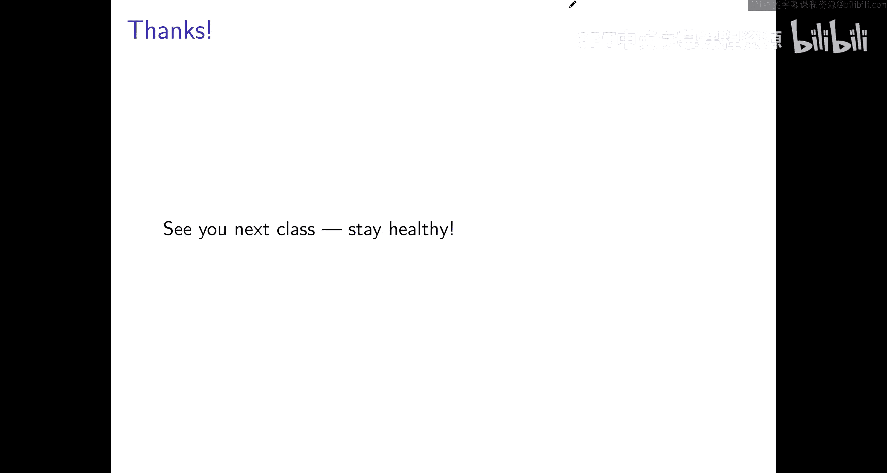

# 007：零和博弈与极小极大定理 🎲

在本节课中，我们将学习零和博弈这一重要的博弈类别，并证明其核心性质——冯·诺依曼的极小极大定理。我们将看到，之前学习的多项式权重算法不仅是一种有效的学习动态，还能帮助我们轻松地证明这个定理。

---

## 什么是零和博弈？⚖️

零和博弈是一种特殊的双人博弈。在这种博弈中，对于任何一对行动组合，玩家一获得的效用恰好是玩家二所获效用的相反数。这意味着，两位玩家的效用之和恒为零（或某个常数）。因此，博弈是严格对抗的：一方获益必然导致另一方遭受同等损失。

我们可以用一个矩阵 **U** 来表示一个零和博弈，其中行代表玩家一（最大化者，Max）的行动，列代表玩家二（最小化者，Min）的行动。矩阵中的每个数值 **U(i, j)** 表示当 Max 选择行动 i，Min 选择行动 j 时，Max 获得的效用（同时也是 Min 付出的成本）。

---

## 一个例子：总统选举游戏 🗳️

考虑一个简单的 2x2 零和博弈，称为“总统选举游戏”。两位候选人（Max 和 Min）各自选择一个竞选焦点。收益矩阵如下（数值代表 Max 的获胜概率）：

|            | 道德 (Morality) | 减税 (Tax Cuts) |
| :--------- | :-------------- | :-------------- |
| 经济 (Economy) | 3               | -1              |
| 社会契约 (Society) | -2              | 1               |

Max 希望最大化数值，Min 希望最小化数值。

---

## 思考：谁先行动？🤔

博弈的顺序会影响策略。让我们分析两种情景。

### 情景一：Max 被迫先行动

如果 Max 必须先公布其（可能是混合的）策略，然后 Min 可以针对此策略做出最优反应，那么 Max 应该如何选择策略？

以下是 Max 的思考过程：
1.  Max 选择一个混合策略，例如以概率 **p** 选择“经济”，以概率 **1-p** 选择“社会契约”。
2.  Min 会计算每个纯策略的期望成本，并选择成本更小的那个。
    *   若 Min 选择“道德”，期望成本为：**3p + (-2)(1-p)**
    *   若 Min 选择“减税”，期望成本为：**(-1)p + 1(1-p)**
3.  Min 将选择两者中成本较小的行动，因此 Max 最终获得的效用将是这两个表达式中的**最小值**。
4.  Max 的目标是：选择一个 **p**，以**最大化**这个最小值。

通过令两个成本表达式相等，可以解出最优的 **p**。在本例中，**p = 3/7**。此时，Min 对两个行动无差异，Max 的保证收益为 **1/7**。

这个 Max 能保证的收益值，称为该博弈的**极大极小值 (max-min value)**。

### 情景二：Min 被迫先行动

同理，如果 Min 必须先公布其混合策略（以概率 **q** 选择“道德”），然后 Max 最优反应，那么 Min 的思考过程如下：
1.  Min 选择混合策略 **q**。
2.  Max 会计算每个纯策略的期望收益，并选择收益更大的那个。
    *   若 Max 选择“经济”，期望收益为：**3q + (-1)(1-q)**
    *   若 Max 选择“社会契约”，期望收益为：**(-2)q + 1(1-q)**
3.  Max 将选择两者中收益较大的行动，因此 Min 最终付出的成本将是这两个表达式中的**最大值**。
4.  Min 的目标是：选择一个 **q**，以**最小化**这个最大值。

通过令两个收益表达式相等，可以解出最优的 **q**。在本例中，**q = 2/7**。此时，Max 对两个行动无差异，Min 保证付出的成本（即 Max 的收益）也是 **1/7**。

这个 Min 能迫使对方达到的收益值，称为该博弈的**极小极大值 (min-max value)**。

---

## 观察与定义 👀

在上面的例子中，我们观察到一个有趣的现象：无论谁先行动，博弈的最终收益值都是 **1/7**。也就是说，**极大极小值等于极小极大值**。

现在，让我们将其推广到一般情况。考虑一个一般的零和博弈，Max 有 **n** 个行动，Min 有 **m** 个行动，收益矩阵为 **U**。

*   **极大极小值 (v_maxmin)**：这是 Max 在先公布策略、Min 随后最优反应的情况下，能为自己保证的收益。
    *   公式：**v_maxmin = max_{p ∈ Δ(n)} min_{y ∈ [m]} (p^T U)_y**
    *   其中 **p** 是 Max 在 n 个行动上的概率分布，**(p^T U)_y** 是当 Max 使用策略 p、Min 选择纯策略 y 时 Max 的期望收益。
*   **极小极大值 (v_minmax)**：这是 Min 在先公布策略、Max 随后最优反应的情况下，能迫使 Max 获得的收益。
    *   公式：**v_minmax = min_{q ∈ Δ(m)} max_{x ∈ [n]} (U q)_x**
    *   其中 **q** 是 Min 在 m 个行动上的概率分布，**(U q)_x** 是当 Min 使用策略 q、Max 选择纯策略 x 时 Max 的期望收益。

一个直观的结论是：**v_minmax ≥ v_maxmin**。因为先行动、暴露策略只会给对方更多信息来对付你，不可能是优势。

---

## 冯·诺依曼极小极大定理 🏆

上一节我们介绍了极大极小值和极小极大值的概念，并知道后者不小于前者。本节的核心是证明**冯·诺依曼极小极大定理**，该定理指出，在零和博弈中，两者实际上是相等的。

**定理 (Minimax Theorem):**
对于任何有限双人零和博弈，其极小极大值等于极大极小值。即：
**v_minmax = v_maxmin**

这个定理并非显然成立。冯·诺依曼在1928年首次证明它时曾说：“在我看来，没有这个定理，就不可能有博弈论。”而另一位数学家博雷尔曾认为该定理对5x5矩阵成立，但对更大矩阵不成立。

我们将利用多项式权重算法，给出一个简洁的证明。

### 证明思路（反证法）

1.  **假设定理不成立**：假设存在某个零和博弈 **U**，使得 **v_minmax > v_maxmin**。令 **v_minmax = v_maxmin + ε**，其中 **ε > 0**。
2.  **设计一个思想实验**：考虑 Max 和 Min 重复进行 T 轮这个博弈。
    *   **Min 的策略**：使用我们之前学过的**多项式权重算法**来选择每轮的混合策略。该算法会根据历史损失更新每个行动的权重，并依概率选择行动。
    *   **Max 的策略**：每轮都**最优反应**于 Min 当前轮由多项式权重算法产生的混合策略。
3.  **分析平均收益**：
    *   **从 Min 的角度（使用多项式权重算法）**：
        多项式权重算法的保证是：Min 的**平均成本**不会超过“ hindsight 最佳固定行动”的平均成本加上一个随着 T 增大而趋于零的**遗憾项 δ_T**。
        即：`Min的平均成本 ≤ (最佳固定行动 hindsight 的成本) + δ_T`。
        而“最佳固定行动 hindsight 的成本”等价于 Min 针对 Max 在 T 轮中实际行动序列的均匀混合策略 **x̄** 所做的最优反应的成本。这个成本**不会小于**博弈的极大极小值 **v_maxmin**（因为 v_maxmin 是 Min 在后行动时能获得的最佳保证）。
        因此：`Min的平均成本 ≤ v_maxmin + δ_T`。
        由于 Max 的收益等于 Min 的成本，所以：`Max的平均收益 ≤ v_maxmin + δ_T`。
    *   **从 Max 的角度（每轮最优反应）**：
        因为 Max 每轮都在对 Min 的混合策略做最优反应，所以他每轮的收益**至少是**博弈的极小极大值 **v_minmax**（因为 v_minmax 是 Max 在后行动时能获得的最佳保证）。
        因此：`Max的平均收益 ≥ v_minmax`。
4.  **得出矛盾**：
        结合两个不等式，我们得到：
        **v_minmax ≤ Max的平均收益 ≤ v_maxmin + δ_T**
        代入最初的假设 **v_minmax = v_maxmin + ε**，得到：
        **v_maxmin + ε ≤ v_maxmin + δ_T** => **ε ≤ δ_T**
        然而，**δ_T** 是多项式权重算法的遗憾界，当 T 足够大时，它可以变得任意小（例如 ~O(1/√T)）。只要我们选择的 T 使得 **δ_T < ε**，就产生了矛盾。
5.  **结论**：
        因此，最初的假设 **v_minmax > v_maxmin** 不成立。所以必有 **v_minmax = v_maxmin**。定理得证。

---

## 定理的推论与意义 💡

极小极大定理有几个重要的推论：

1.  **均衡策略即防守策略**：在零和博弈的任何一个纳什均衡中，Max 的策略一定是一个极大极小策略（即先行动时的最优防守策略），Min 的策略一定是一个极小极大策略。这意味着计算均衡不需要复杂的循环推理，只需解决两个嵌套的优化问题。
2.  **博弈的值 (Value of the Game)**：所有纳什均衡都会给 Max（和 Min）带来相同的收益。这个共同的收益值称为博弈的“值”。这与一般和博弈（如性别战）不同，在一般和博弈中，不同均衡可能带来不同收益。
3.  **多项式权重算法是最优的**：证明过程显示，即使 Min 先行动（使用多项式权重算法），她也能获得近乎后行动时的收益。这意味着在零和博弈中，使用多项式权重算法是一种强大而简单的策略，即使你对博弈矩阵知之甚少，也能通过学习快速接近最优表现。

---

## 总结 📚

本节课我们一起学习了零和博弈的核心内容：
*   我们定义了**零和博弈**，并通过总统选举游戏的例子分析了**极大极小值**和**极小极大值**。
*   我们陈述并证明了关键的**冯·诺依曼极小极大定理**，该定理指出在零和博弈中，极大极小值等于极小极大值。
*   我们的证明巧妙地运用了**多项式权重算法**，将其与一个重复博弈的思想实验结合，通过分析平均收益得出了结论。
*   最后，我们探讨了该定理的深刻含义：它简化了零和博弈均衡的分析，定义了博弈的“值”，并凸显了多项式权重算法在对抗性环境中的有效性。

下一讲，我们将探讨这些思想如何扩展到更一般的博弈场景中。