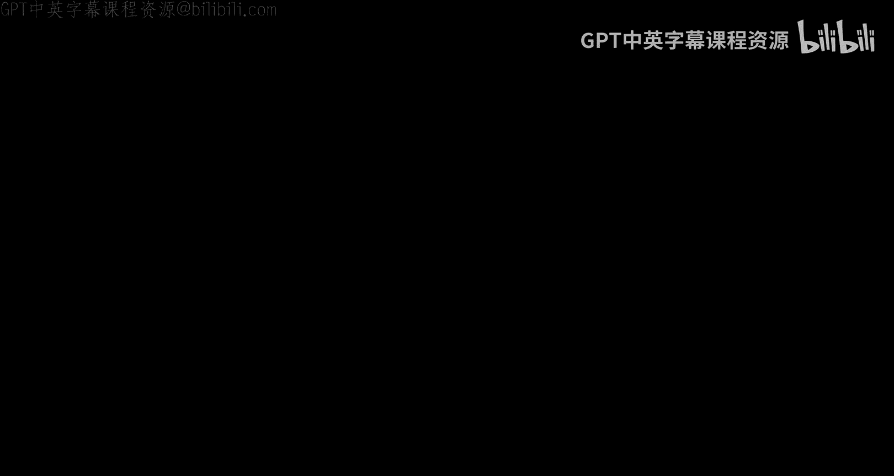
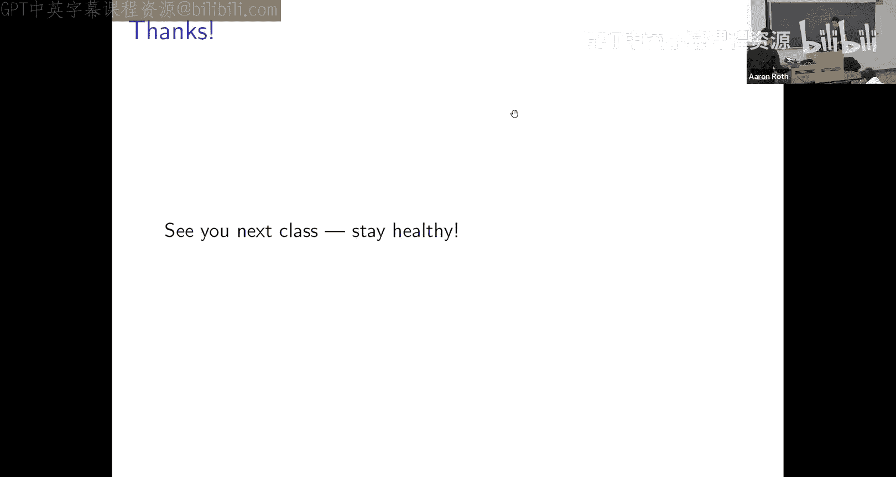

# 宾夕法尼亚大学《算法博弈论｜NETS 4120_ Algorithmic Game Theory 2023》中英字幕（deepseek-R1 p05 NETS 4120_ Algorithmic Game Theory, Lecture 5.zh_en -BV15kLRzTExU_p5-

Yeah。

All right。Welcome， everyone to I think lecturec5。嗯。As is customary。

 let me start the class just by asking if there are any。

Legistical issues with how the class is running I guess in particular the problem sets due before next class so hopefully everyone knows how to turn it in hopefully people are starting to go to office hours and and make use of。

The TAs and course staff。Any questions about？Mechanics of the class before you get going。Okay。Um。So。

To remember where we are in the。Story line we're sort of building up here。We've been trying to。

Come up with like computationally plausible ways to make predictions in games Okay。

 so we want to be able to talk about not just。Fixed points， not just stable states。

 not just equilibriumria， but。Paths， you know， natural paths of play that might take us there。

And so we studied。Congestion games， and we proved that a natural class of dynamics converges to equilibrium and congestion games。

And sort of last class， we sort of said， okay， you know？Let's think about。

Exactly when best response dynamics converges and we gave a sort of characterization of the set of all games for which best response dynamics provides。

 you know like a convincing story of why you might end up playing a pure strategy Nash equilibrium。

 right the class of games for which it's guaranteed to converge to Nash equilibriumria。But we know。

 of course， that。It doesn't converge to pure strategy Nash equilibria in every game。

 can someone remind me of， you know， like an obvious reason why？Yeah。Yeah， rock paper scissors， rock。

Sciissors yeah got me so like like like in particular there's plenty of games that don't have pure strategy to actually for the brew and。

You know， since if best response dynamics converges。

 it converges to a pure strategy national equilibriumria。

 it can't possibly converge in games like rock paper scissors that don't even have them。And actually。

 like， you know， it's not hard to notice that even in games that do have pure strategy na equilibriumibria。

 best response dynamics need not converge because。You can have。mAnd you can have like a。

Nash equilibrium hidden away somewhere。But such that。The past。

 the best response dynamics takes you on， doesn't lead you there。Okay， so like we can。You know。

 cook up a game such that there's。A game state over here that is a pure strategy a equilibrium that everybody would love to be at。

 but such that when we look at。If you like sort of this graph that we thought about last class that。

Represents the set of trajectories that。Best response dynamics can take you on right this graph where game states correspond to vertices and edges correspond to。

Best responses。You know， we can cook up a graph such that， you know。

 like most of the paths just don't lead to the pure strategy nationalash equilibrium。So for example。

You know， we could。Embed。Matching pennies。Into sort of the two by two upper quadrant of this game matrix。

 we have like an a equilibriumbrium over here and maybe there's just like terrible game states。

Everywhere else。That basically prevent you from。Getting to the component of the graph that would lead you to the Nash equilibrium right so if you sort of draw out the trajectory of best response dynamics。

What you'll find is that in sort of this matching Pennnie's quadrants。Um。You've got a cycle。

And it's true that if you ever made it out here。It would take you to。

The unique pure strategy national equilibrium of the game， but you know， if you start here， you know。

 best response dynamics is's just not going to lead you there。Right。

 and you could sort of generalize this to larger games where。And， you know。

 like this part of the game could make up almost all of its probability all of the sort of mass of the game so that almost everywhere you started。

 best response dynamics wouldn't lead you to the pure strategy national equilibrium。

 even if one existed。Okay， so it's not that。It's not that best response dynamics tells us that we sort of converge to equilibrium whenever the game has a pure strategy national equilibrium it's much more constrained than that。

 like as we showed last time it's really got to be that the graph that you get when you draw something out like this doesn't have any p site。

So。You know， like in continuing。Our。Study of game dynamics。

 like the next step I want to take is I want to think about。

Other things people might do in games for which best response dynamics maybe doesn't make a lot of sense。

 games like rock paper scissors say。U。Okay， so。This is going to take us on。

A digression about sort of learning in games。Actually。

 really for the next two lectures just learning well bring the games back sometime next week right but you know I sort of want to think about。

Reasonable things people could do in a game， even if they start out not knowing much about the game right maybe that you're you're sort of thrown into a new situation。

 you know the game might be complicated reasonable ways you might go about。

OrRe ways you might think about going about playing that game。Hopefully， you know。

 eventually leading us to statements about convergency equilibriumria。U。But like， okay， so you know。

 our goal is to get to a sensible way of thinking about different players simultaneously learning in games。

But the game part is going to just layer an additional level of complexity on there。

 you know we're going to have like multiple people trying to learn things at the same time in a competitive environment。

So for this class and in fact， the next class。I just want to abstract away the game and think about。

Learning。Period in like a sequential decision making environment。Right like you know。

 like what does it mean to like learn in a game， well if we're playing a game repeatedly， like。

 you know， we're every day waking up and driving to work in a routing game or something。

What happens is right like like there's there's an aspect of time I make a decision today。

 I make a decision tomorrow I didn make a decision the next day and so。

Oh there's an aspect of like payoff like I pick some route and it ends up it takes some amount of time for me to get to work right I observe like sort of some cost or payoff for the actions that I take right so there's this like sequential setting where I need to choose amongst some set of actions and I get some payoff and I want to think about what's a good way to choose actions as a function of like my experiences so far。

And eventually， we want to think about like end player games where everybody is simultaneously doing this and the payoffs are a function of what everyone else is simultaneously doing。

 but like。Just to get ourselves used to thinking about these kinds of things。For today。

 I want to abstract away the game and just think about like。

Learning in a sequential environment and figure out what that means。Okay。

 so that's like the overview for today questions about。The story arc so far。Things that。

We've done and we'll do。Okay。So we're going to sort of so eventually I want to build up to a theory of learning in sequential decision making environments that is。

richh enough that it makes sense to sort of take a learning algorithm developed in one of these environments and just say okay。

 we're going to play this learning algorithm in you know like an arbitrary game。

 so it should be able to talk about general action spaces。

 general sort of payoffs for different actions that you get。But let's start simple。

Let's start with sort of a toy version of the model we're eventually going to develop in and I'll describe it as sort of a toy model of stock prediction。

Okay， so say there's like one stock you're interested in， maybe Game stock。And。

Every day it's going to go up or it's going to go down。Okay。😊，You don't know which one。

And your goal is before the market opens， you would like to just predict the direction that it's going to go in just。

 you know， like a binary decision up or down you're right you want to you could imagine in a richer version of this you want to predict something。

 you know， a little bit more precise， but let's just start by saying you want to predict the direction up or down so you want to take like a long or a short position in this stock to make money。

And the problem is like， you know， it's like hard to predict in stock markets like it's not the stock market is not necessarily。

嗯。Following a well behaved like statistical process。

And so we don't want to assume that it is if we sort of develop theory that only applies under very specific assumptions for how the stock market is going to evolve。

 you know， like our theory is probably going to be wrong。

So we sort of want to assume that the stock market， you know， this sequence of like。you know。

 ups and downs can really behave arbitrarily and one way to model arbitrary behavior is by thinking about it as generated by an adversary。

So we're going to want to come up with some。Methhood for learning in this environment that will have some guarantees and whatever those guarantees are。

 we would like it to hold， even if the sequence of observations made by the algorithm is chosen。

 you know， like adaptively by an adversary whose only goal is to try to falsify the guarantees of the algorithm。

Okay， so if you've taken like a machine learning class。

 this is sort of very different from the typical setup for like statistical learning and the typical setup for like statistical learning。

 you assume there's like a distribution and you've got data points that you get to train on that are sort of well behaveved or' sampled IID from some distribution and the goal is to use the data to learn some statistical regularity about the distribution that will give you some predictive advantage on new data so long as it's drawn from the same distribution there's no distribution here。

😊，Okay， there's like we're going to define what is in some sense。

 a very difficult learning problem because。There's no assumption that the things you've seen in the past。

 there's no assumption that the paths will be reflective of the future here。

 an adversarial data sequence can change in arbitrary ways all the time。

Which means that like you know， like if we're going to try to prove something interesting about an algorithm。

 we have to be measured about what our goals are like our goal cannot be to make a lot of money。

 our goal cannot be to predict to guarantee that no matter what the sequence is that we predict correctly。

 you know， most of the time。Right， because。For example， it could be that what happens is you know。

 like maybe the adversarial sequence is going to be really simple。

 maybe every day the adversary is just going to flip a coin and the stock market will go up or down。

 you know， like at random。There's no way you can predict， you know。

 there's no method to predict correctly more than half the time in that case。Okay。

 so so like in in the kind of model we're setting up， it's just not a sensible goal to say that。

we want to do well in any kind of absolute sense， we're going to have to think about performance relative to some benchmark class。

Okay， so， you know， like as。Stated so far， like it seems like there's little interesting you can do in this model like。

You know， if you don't get to observe anything you just have to make predictions based on nothing then what can you do so so there's a little bit more in the model you do get to observe something before making your predictions。

And one way。That is useful to think about it for now is that。

Before you make your prediction every day。You get a little bit of advice。Okay。

 we'll call this the sort of expert advice model。Okay， so so remember， you know。

 it's like the sequential binary prediction problem every day you predict up or down。

 then you're going to learn did the the Gametop go up or down？And so， okay。

 what's the expert advice aspect？Every day before the bell rings opening the market。

 before you need to make your prediction， these n selfproclaimed experts like come over and whisper something in your ear。

 they say I think the market's going to go up today or I think the market's going to go down today。

 there's n of them。Now okay like like the terminology we call these people experts。

 but like they're self-proclaimed experts like think about these just as Wharton students or something like they have strong opinions maybe about what the stock markets going to do but that doesn't necessarily mean that they're right okay like like if they were if they were all like financial geniuses it would be like easy they'd probably all agree about what to do and you would just do that that's not the problem like。

Like the the。The advice of， you know， not only is the sequence of。Outcomes， you know。

 up or down going to be arbitrary the。Predictions every day of the experts are also going to be arbitrary。

 like it might be that there's some good experts， they might be that there's some not so good experts and you certainly don't know who is who。

And so。Like because in an adversarial setting， it doesn't make sense to talk about。嗯。

Doing well in absolute sense， we would like to set up。

A goal that frames doing well in sort of a relative sense。Okay， so our goal is going to be to。

Agreggate the expert advice， meaning like we need to design an algorithm that listens to these n experts every day thinks about the advice。

 maybe also thinks about。The history of what's happened so far。

 we can look at their track records and maps that to a decision about how we're going to predict it every day。

And our goal is to do as well or almost as well。As whoever turns out to be the most accurate expert in hindsight when all is said and done。

Okay， so this sort of gets around the problem of you know what happens if stocks are are you know just a coin flip of course of course。

 if whether you know game stock goes up or down it's just a coin flip we can't predict better than 50%。

 but neither can the experts so we can achieve the goal of doing as well as the best expert in hindsight。

But of course。If we promise that no matter what happens。

 we do as well as the best expert in hindsight， if it turns out after the fact that there was some expert who actually did know what he was talking about and did pretty well。

 then in any instance like that， our guarantee would obligate our algorithm also to do well。Okay。

 so this is sort of a relative performance goal that makes sense to ask for even in the worst case without assuming any kind of like distribution of observation。

Okay， so questions about the。Set up here。Yeah。不印章。Which experts said what， we just。不见。Oh， no， no， no。

The information， you know， will formalize this all in a moment， but like。嗯。

When I say we aggregate expert advice， I just mean the algorithm we need to design。

 even though it gets the input of these and experts。

 ultimately it needs to commit to a single prediction but。In figuring out what that prediction is。

 it can look in as granular a way as it once to the sequence of predictions made by these experts。

 so it's like you can do things like evaluate how frequently the expert was right in the past yeah。

好点的。还子。嗯。In principle， sometimes you could and。These are good questions in the worst case you can't because again。

 like if the thing you're trying to predict is a coin flip， then all of the expert。

 any prediction method will produce a correct prediction 50% of the time。

 and so there's no way to do better than that so you can't there's no way to promise that you know in the worst case you do better you do there's no way to promise it in the worst case you do better than the best expert but there are ways to try to formulate goals that。

know maybe on particular cases that have structured that you do better than the best experts。Yeah。

S your best。🤧Corrected。Yes。What did the in say。Yes， so again we'll formalize this all in a moment。

 but but you're right so first of all。Best means you know in this setting since we're just you know guessing this binary outcome how frequently were they right we would like to be right as frequently as the best expert in hindsight and the reason I say in hindsight is because。

There's no distribution， so it doesn't make sense to sort of say ahead of time， like。This fellow。

 Jimmy， is the best expert。Because that may not be the case。

 it is only after this after our algorithm has sort of interacted in this scenario for t rounds and you know and。

When we can sort of look back in time and see given what actually happened。

 we turned out to be the best expert。Good question。Yeah。But the expert changing data。有。That's right。

 so if I if I look， you know at some。嗯。😊，Prefix， you， if I look at the first 100 rounds， the person。

 you know the expert who's the best expert at round 100 is not necessarily the person who's the best expert at round 1000。

Um， which is something the algorithm in general is going to need to be able to grapple with。

Other questions？Okay。mOkay， so already this is sort of like。

A toy version of the problem we want to solve because， you know。

 like there's only two it's just a binary prediction problem。

But just so we can develop some intuition for like what these algorithms might look like。

 I want to make the problem even easier and so our goal over the next two classes is going to be to sort of start with a really stripped down toy version of the problem for which。

The algorithm is not difficult， in fact， I'm just going to ask one of you guys in a moment to tell me what the algorithm is。

And then we're going to try to complicate the scenario and you know try to solve that and each new solution will be hopefully familiar given that we know the solution to the easier problem until before we know it till we get an actually useful algorithm。

So I want to start with an even easier case and it's related I'm going to make it easier in a way that sort of related to the question that was just asked about whether the expert who was best at round 100 is also going to be a best expert at round 1000。

Okay， so here's the easier case。So we've got these N experts， capital N。

Who are going to make predictions in some number of rounds， capital T rounds。Okay。

 just to sort of put some notation to this to start writing down a formal model。And every round T。

Each expert I will make a binary prediction， which I'll denote by PIT。

 and it's just you it's a binary prediction， but let's say it can take value up or down。And we。

 the algorithm get to look at the history of all of the predictions and outcomes so far up to but not including dayT and decide how to。

 and of course we get to observe the predictions atT as well。

 and then we the algorithm have to commit to our own prediction up or down， I'll call that PA。

And only after we commit to our prediction， do we learn the true outcome， which I'll denote OT。

 and that's also a binary outcome up or down Gametop goes up or Gametop goes down。

And it might be that we make an incorrect prediction that would， you know。

 when I say we make an incorrect prediction or we make a mistake。

 I just mean that our prediction was not equal to the outcome。

 if our prediction was equal to the outcome， I'd say we made a correct prediction。开。And this is the。

Way we're going to make things like even easier as a first cut。Although。In general。

 the sequence of predictions can be arbitrary。As can the sequence of outcomes。

 I want to start off by assuming that there's one perfect expert like there's someone out there who just like knows how the world works。

 this expert is guaranteed never to make a mistake。Okay。

 so like if we only followed this expert's advice every single day。Then we too。

 the algorithm would never make a mistake and of course we have access to this expert's advice。

 he's like whispering it in our ear， the only problem is we don't know who he is。Or she？

So there's like this expert。There's this， you know。This expert。Who is。Out there。

 but in this pool of an experts， I know one of them is perfect。

 one of them is guaranteed never to make a mistake。

 but there's these n minus one others who I still know nothing about。Okay， I'd like to do as well。

 almost as well as the best expert， which in this case means， you know。

 like making as few mistakes as possible because the best expert is guaranteed to make zero mistakes and the only difficulty that I have is that I have no idea who is this perfect expert。

Okay， I somehow need to like discover that as the algorithm goes on。Okay。So。嗯。I claim。

But in this simple stripped down version of the problem。

 there is a very simple intuitive strategy that is guaranteed to make at most log n many mistakes where n is the number of experts。

Can anyone tell me how to do it？Yeah。我是吗。行。是的。Yeah， that's a pretty good idea。So let's。

Think this through so you're saying， okay。U。Like I know。That there's a perfect expert。

And so if I ever。Observe someone making a mistake。 I can just like。

Immediately eliminateinate them from consideration， they can't possibly be the perfect expert。嗯。

And at any given moment， there might be a bunch of people who have never yet been observed to make mistakes and they might make different predictions about what I should do and so I need to like figure out what to do from this pool of predictions and you're suggesting going with the majority and why。

Is the majority a good thing to do？Because like when。哇要。好。Yeah。Good。So let's。

Follow through on this idea。It's called the having algorithm。

And I think the name of the algorithm is suggestive of the analysis。

And it's exactly what we were just discussing。ok。And it's a very intuitive thing to do。不是。

So what we're going to do is we're going to keep track of all of the experts who have a perfect track record so far。

Initially that's everyone so the set S that we're going to maintain over the course of the run of the algorithm is just you know at day T the set of experts who have never yet been observed to make a mistake Okay。

 this is initially everybody this is also how I grade this class by the way。

 I have a list of everyone who's never made a mistake and then I just cross names off the list as problem sets come in。

And so。At every round I need to make a prediction right these experts like are whispering in my ear up or down and。

I know that I don't if anyone has been observed to make a mistake。

Like they're out of there like I'm not going to listen to them at all anymore。

But like I have this pool of experts that。Haveven't yet proven themselves to be flawed and they might nevertheless disagree about what I should do today。

And so I'll just like partition them according to what their predictions are。I'll say， you know STU。

 those are the sort of set of surviving experts at dayT who today predict up。

And STD those are better name for that one， but that the other set is the set of experts who。

You know， are the remaining experts who predict down today？U。And I just go with the majority vote。

 so if more of the surviving experts predict up than down， I will predict up。Otherwise。

 I'll predict down。And。Then I learn。What happens？Okay， like I see the outcome up or down。And。

I will now eliminate all of the experts who were wrong。So in particular， if the outcome was up。

 then the set of surviving experts tomorrow is equal to the set of surviving experts today who predicted up。

And otherwise， the set of surviving experts tomorrow is equal to the subset of surviving experts today who predicted down。

So the invariant that I'm maintaining is that the set ST。

 the set of surviving experts at dayT is the set of experts who have not yet been observed to make a mistake。

Okay。Is the algorithm clear？Okay。So the claim is that under this very strong assumption， yeah。This。这。

But。Good，'s。Like。Be clear about the setting。There's no randomness here。

 so there's nothing to take an expectation of it right like the algorithm is not randomized。

 the algorithm is deterministic and we are not assuming that the outcomes or the。

Predictions of the expert follow any kind of distribution， those can both be arbitrary。And so。

 you know， what this really means is that in the worst case over any possible sequence of outcomes and any possible sequence of predictions for the an experts。

 so long as there's one expert who never makes a mistake。

 the algorithm makes at most log n many mistakes， so over in the worst case over all possible play outs of this interaction。

 we promise that our algorithm makes at most log n many mistakes。Or are you able to cut in happen。

再过来。There's one perfect one everyone else。Gets them all ready。Oh， that would be great Oh， good。

 so this is like another thing that maybe is sort of。

Useful to reflect on so like in order to do well we don't have to identify like who is the perfect expert right like it might be that what happens is exactly what you describe that you know。

That。Well， okay。Like maybe a couple of things to note， so it's like first。

It might be that everyone is right every day， in which case we never eliminate anyone。But also。

 that was kind of the right thing to do because everyone turned out to be perfect。

It might also be that almost everyone is right every day。Like maybe every day， you know。

 there's only one expert who makes a mistake now of course we do eliminate。

The expert who made a mistake every day， but you know， like you might be thinking okay。

 but like there's n expert' only illuminating one every day isn't this going to like take us end days to find who's the perfect expert and the answer is yes。

 but the theorem is not about like how long it takes us to find the perfect expert。

It might be that we never， you know。It might be that we never sort of end up with only one remaining expert。

 the theorem is about how many mistakes we make。And if you think about it right like every day we're going with the majority vote。

 so if there's only one expert that's wrong every day。

 it's true that we're only eliminating one expert from the set each day。

 but we also never make a mistake。Okay， so in like that。

It's like that's a good scenario like there actually we would do better than the promise of the theorem。

 we would make zero mistakes。A the the algorithm not large。

The runtime of the algorithm as written is n per iteration because we have to。If nothing else。

 you know like。Listen to each of the an experts yes so this is not a running time statement。

 although the algorithm is you know simple to implement this is a statement about the number of mistakes it makes yes so this will come up later actually like。

Even in the more sort of sophisticated。Settings that we'll study we'll be able to get sort of performance bounds that depend only logarithmically on the number of actions。

 but in general even to sort of think about a set of an actions we're going to need running time that's like linear in N。

Good questions。Okay， so good so we're like already like。

Asking questions that are sort of getting us towards a little bit how the analysis works， right。

Because， of course， like。It could be that we quickly eliminate experts and you know。

 like you could imagine a world where like after， you know we cut the number of experts in half every day and after like log in many rounds。

 we know there's one perfect expert and you know we know who it is and we can never make a mistake again。

But like it doesn't have that doesn't have to happen right like it could take us even if even if there is only one perfect expert in the end and every day someone makes a mistake it could take us as long as end days before we figure out who it is we just need to make sure that。

No matter which of those two things happens or something in between。

 like we don't make very many mistakes。Okay。So here is the key idea。嗯。

Because the algorithm is predicting according to the majority vote of the remaining experts。

If the algorithm makes a mistake。At some round tea。

The reason is because at least half of the remaining experts made a mistake。Right， like if。

Fewer than half of the remaining experts made a mistake then the majority vote would have been correct。

And so we don't need to worry about like we don't need to worry about those rounds if we're just counting mistakes。

 so any round at which the algorithm makes a mistake means at least half of the remaining experts made a mistake。

And so in particular。😊，If I look at some round T。And you tell me the algorithm made a mistake at that round T。

Then I know that the number of remaining experts set around T plus1。

Cannot possibly be larger than half of the number of remaining experts at dayT。

Because I eliminated at least half of them if the majority vote was wrong。On the other hand。

 and this is sort of where we're using our sort of toy assumption here that there's a perfect expert。

Like I know for sure that there's at least one expert who is never eliminated。And in particular。

 I know like at every round tea， the number of surviving experts is at least one。

Because I never eliminate the perfect expert。And。I know how many experts there were to start that were in。

Okay， so I start with end things every time I make a mistake I cut the set of things at least in half。

And the set of things never the size of the set of things never goes below one。So， you know。

 how many times can I cut a set of size n in half before it must， you know， like end up below one。

 while it must log in many times？Okay， so the algorithm makes at most log and many mistakes。

 even though it might take。Many more than that rounds to like identify who is the best expert。Okay。

 like like we don't need to identify who's the best expert。

 we just it's sort of like a win win analysis， it's like either the algorithm did well at this round。

Or if the algorithm did poorly， we made progress towards identifying the best expert。

 we only need one of those two things to happen to get a theorem like this。Okay。Is that clear？Yes。

 why is it only in the case that you make a mistake that we're triggering？Oh no。

 we're eliminating every round the experts who made a mistake。

 we could eliminate people even if we don't make a mistake。

And we are sort of pessimistically just not accounting for that in this analysis right it might be that the size of。

The set of remaining experts actually goes down more quickly than we're accounting for。But。

On rounds when we don't make a mistake， we can't say anything concrete about the rate at which we are making progress we could have eliminated nobody if if all of the experts were correct or we could have eliminated its few as one person even if。

Some of the experts were wrong。So like it's only when we make a mistake that we can sort of say that we are making like fast enough progress to get like a log n bound and there are sequences where this is exactly what happens right it's the sequences where basically for the first log n rounds。

You know。当是的新的。对。Yeah， like like what this theorem is saying， the form of this theorem， is it saying。

In the worst case over instances， the algorithm cannot make more than log n mistakes so the worst it's an instance it's both a sequence of stock outcomes and a sequence of predictions。

 one for each of the experts。And so we prove in the worst case， it's login。

And there actually is an instance that causes that to be the case so you couldn't improve this theorem to say log n over two for example right and the worst case is where actually you know like。

The bare majority is wrong every round and really you make a mistake for the first log n rounds and you really do cut the set of surviving experts exactly in half each time。

继续。嗯。Yeah， so。The question is。On the one hand， say the algorithm makes M mistakes。Okay， so。

Like on the one hand。Like like we're interested。We're thinking about sort of the cardinality of S capital T。

 how many experts survive at day T。On the one hand， we know that。This is larger than one。

If there's one surviving expert， on the other hand。

 we know it's smaller than what well it's smaller than。And the number of experts we started with。

Times one half。To the M， because every time we made a mistake and we made M mistakes。

 we cut this in half。And so if you solve for M。You get login。Make sense。Good questions。

 other questions。Okay。So we can ask ourselves， like， is this bound any good？And of course。

 you know like there's like qualitatively and quantitatively。

 so like qualitatively it kind of sucks because we made like this ridiculous assumption that there's a perfect expert right like we're you know。

 if anyone is ever observed to make a mistake， we just eliminate them from consideration immediately。

 which only makes sense to do if if we know if we're really confident that there's someone who's like never going to make a mistake。

😊，But quantitatively， it's pretty good because log n is a pretty small。

 pretty slowly growing function of n。When you think about these sort of。Relative bounds， right。

 we're saying sort of the bound is doing you know， the algorithm is doing。You know。

 as well as the best expert。Um， that's a stronger thing to say the more experts there are right like the more experts there are。

 the more difficult it is to compete with this benchmark right like I start adding expert to maybe some of them are going to be good。

And so since the sort of mistake bound grows only logarithmically with n。

 that means it's relatively cheap to compete with a very expressive。

Benchmark class right like I could if I have a thousand experts then log n is 10。

 but like if I have a million experts log n is 20。And you know in some sense。

 there's a much better chance that like a million experts will have a good one compared to a thousand experts right I'm promising to do as well as the best expert。

So on the one hand。Oh， all right， so on the one hand。Like in order for the algorithm to even apply。

 we have to assume something crazy on the other hand。

 like the numerical bound is pretty good and we can sort of cheaply add lots of experts。

 you know in some fuzzy way probably like increasing the chance that we have a perfect expert somewhere in our in our set。

😊，And also。The bound doesn't grow with tea。Right we could。

Play this interaction for a thousand rounds or a million rounds or a trillion rounds。

 and the bound remains login。U。So even if we have like a huge number of experts if we look at。

The average number of mistakes made by the algorithm as a fraction of time。

Like the rates at which we are making money on the stock market as a fraction of time。

The difference between our performance and that of the best experts on average goes very quickly to zero at the rate of1 over t。

O。So these are sort of， you know， obviously， we're going to in order for this to be a useful algorithm。

 we're going to have to。You know have some analog of this and a much more interesting model like right now this is a toy model。

 especially this assumption of a perfect expert， but like。Quantitatively。

 there's a lot to like about this style of bound that our error grows only logarithmically with a number of experts and that our average error over time goes to zero yeah。

没有问题。Yeah， so like this is saying in some absolute sense。Independently of how long we。

 like say there's  a，000 experts。Independently of how long we run this prediction game。

 we will never make more than 1024 mistakes or sorry 100 experts will never make more than 10 mistakes。

U。😊，So if I look at the fraction of rounds。I made mistakes on。If I run it for。T rounds。

 the fraction of rounds that I make mistakes is going to be at most 10 over t and so as T grows large。

 if I look at like my average performance like what is the chance that I make a mistake on a randomly chosen day amongst all T of them that goes very quickly to zero。

Like a worst bound would be that， you know， you make。

Log in times t mistakes or that wouldn't make sense， but like you know 0。

1 times t mistakes that would mean that you're always making mistakes sort of 10% of the time on a randomly chosen day as t grows large here the chance that you make a mistake on a randomly chosen day as t grows large goes to zero。

Okay， so that's another property that we're going to try to like maintain as we。

Work in more complicated settings。Other questions？Yeah。Okay。Yeah。So let's try to take。

Just one baby step towards。嗯。😊，A more sophisticated algorithm we'll get there next class。

 but right now I just want to consider sort of a baby step on the way。Okay。

 and so so like eventually there's a bunch of things we want to like generalize here like we don't want this to be like a binary prediction problem like we want to be able to choose amongst you know sort of arbitrary collections of like actions in a game。

For now， like I'm going to keep the sort of binary prediction aspect， but I just want to say， okay。嗯。

Like suppose there's no perfect expert。Nevertheless。Just as I can sort of。

Like like after the algorithm。Halts and I see what were the historical predictions of all of the experts。

 I can still identify who is the best expert and I can give a name to the number of mistakes made by the best expert in hindset like opt。

F。Can we come up with an algorithm that？Guarantees that it doesn't make too many more mistakes than opt。

Okay， so I want to sort of do。I want to。Be able to prove a theorem that sort of compares the performance of。

My algorithm to opt even and like sort of we've done that when opt is zero and now I just want to get some version of that when opt is not zero。

我听。So maybe let's start by。Looking at our existing algorithm。

And just thinking about what would happen。嗯。嗯。What would happen if we ran it？

Without a perfect expert。Okay， so maybe we can just analyze this algorithm in a world in which there's no perfect expert so like what happens if I run this algorithm and there's no perfect expert。

でそです。Yeah， like like。Like it's not a matter like it sort of。

It's not just that this algorithm might not do well in that setting。

The algorithm might just like crash and fail to run at some point， right？

This algorithm is doing something pretty severe， it's like entirely eliminating from consideration。嗯。

😊，Any expert that is ever observed to make a mistake？And so this algorithm will run fine， but like。

At some point you might find if there's no perfect expert。

 you've eliminated all of the experts from consideration。

 at which point it's not even really clear that this algorithm is like well defined。

 what does it mean to take the majority vote of an empty set？And so yes。

 so like there' there's a problem here which is just that like like like more basic than this doesn't get a good bound。

 it's more like if you run this algorithm in the setting where there's no perfect expert。

 it might just crash。Okay。But many of you are computer science majors at some advanced stage of your education。

 so you know what to do。You have like a program。That's crashing what is the like universal solution for this？

Yes。But yeah， like。Exactly like try again like like turn it off and turn it on again right like if eventually。

 you know， like if your computer is messing up， just restart it。Um。If we teach you nothing else。

 you know， after four years at Penn， it's like restart your computer。So let's do that。Okay。

 so that's the proposal that's our like main algorithmic idea here。We'll run this algorithm。

 having algorithm。And like it might crash at some point because we eliminate all of the experts。

And if it does， I propose that we just like restart it just you know， like from the beginning。

 like put all of the experts like back into the bucket and you know。

 forget the entire past history and start again。So we'll call this the。Iterated having algorithm。嗯。

And it is exactly the same as the having algorithm， except it restarts itself when it crashes。Okay。

 so just as before。It's maintaining a set of。All of the experts who have never been observed to make a mistake。

 at least since its last restart。嗯。At every round， you know it。

Dividedes the experts into two bits so long as there are any experts that remain。

 those experts that predict up and those experts that predict down。

 it goes with the majority vote if there's more experts than predict that the predictup compared to down。

 it predicts up otherwise it predicts down and anyone who is observed to make a mistake is eliminated。

The only line of this algorithm that is different is like you know the algorithm like crashes and you。

Just push some like hatch just says okay， you know。

 if there are no experts remaining like totally reset and promote everyone to you know。

 full status once more。Any questions about like what the algorithm is？Okay。So。Okay， so to start off。

I mean。Obviously， this is a pretty dumb algorithm。And so it's not you know。

 like it's not going to we're not be able to prove a great bound for it like we're going to prove great bounds for different algorithms that we'll analyze next class。

 but I sort of want to start off by like showing we can prove some。😊。

Theorem relating the performance of an algorithm to the performance of the best expert。

 even when the best expert is not perfect。And in particular。嗯。I want to prove this theorem。That says。

 well， look。In the worst case over any sequence， in the worst case over any instance。

 which so in the worst case over any sequence of stock outcomes and any sequence of。

Predictions of the N experts。If in hindsight。The best expert。

Turns out to have made opt many mistakes on that sequence， then we can promise that the algorithm。

 this algorithm iterated having algorithm will have made at most log n times opt plus one many mistakes。

Okay， and this is like a just a generalization of our prior theorem because if opt is zero。

 if there's a perfect expert， this is again telling us the algorithm makes at most log n many mistakes。

 but now like the theorem is no longer vacuous even if opt is not zero。😊，Okay。Okay。嗯。

So in the spirit of making you guys do all the work， how do I prove this theorem？I don't know。啊好。是是实。

That expert is86。不是。A doctorer we said。Like itll hit the set will be able after the market。2游4。真在。

It'll only be said off this one。这钱。Yeah， so I think that's the right intuition。

There other details we might want to add here。The worst possible case ever。Your errors。Itsはい。

The last person left is like this perfect person。呢个嘢真。

The login errors is the perfect person to explain。Yeah， although like it's not necessarily。

 like there's like we're not， we don't know the sequence in which the errors are made。

 like it's not necessarily like the best expert is the last man standing every time。

But that is the general idea to try to sort of。Think about this as a race between the algorithm and the best expert and keep track of what happens every time the algorithm makes a mistake and what happens every time。

The number of mistakes made by the best expert goes up， so every time opt increases。So it right。

There is no。But I guess we should have discussed。When the best expert is allowed to make more than zero mistakes。

It doesn't make sense to sort of talk about the best expert until the end of time there is。

No well defined like best expert at round 15 because we don't know if they're going to be， you know。

 they're going to continue to be the best expert。So we can't quite as as the algorithm is running。

 compare ourselves to。The best expert， but we can compare ourselves to opt like opt is a quantity that is sort of。

We can keep track of and is like monotonically increasing with time。

And we sort of want to argue that。Yes。Every time opt goes up by one。

 we can't have made up every time opt goes up by one。

 we can have made it most log n mistakes that's the kind of thing we want to argue。嗯。Okay。

So remember this algorithm is。Literally just the having algorithm。

 but we restart it when it crashes so everything we said for the most part about the having algorithm remains true here。

So it remains true that whenever the algorithm makes a mistake。

 we eliminate at least half of the experts in the current pool。Right。

Because we go with the majority vote and so if we make a mistake， the majority vote was wrong。

 which means the majority of the experts were wrong。

 which means the majority of the experts are eliminated。Sure。And so。We can sort of， you know， like。

Our analysis doesn't carry through our analysis from last time doesn't carry through the whole algorithm because we reset it sometimes。

 but like it still carries through between any two resets。

Like it's still true that between any two resets of the algorithm。

The algorithm can make at most log n mistakes because。Between any two resets if we haven't yet。

 if I think about the starting point after after one reset where I have n remaining experts。Well。

 you know， like if at round T， I haven't yet reset the algorithm。

 I know that there's at least one expert remaining because if there wasn't。

 I would have reset the algorithm。And I know that every time I made a mistake。

 I cut the number of remaining experts in half and so that can't have happened more than login many times before I triggered a reset or said another way。

There must be a reset triggered between like like every time I make login mistakes。

 there must be a reset triggered。Right because I would have eliminated all of the experts in that title。

对。On the other hand， I claim that。If we have to reset the algorithm。It is because。

In the intervening time between the last reset， every single expert had made a mistake。

Right because you know， at the last reset， all of the experts remained at the next reset none of them remain anymore。

 they've all been eliminated so they've all made a mistake。So between any two resets。

 the algorithm makes at most log n many mistakes and。Opt。goes up by at least one。

 whoever and in particular， whoever will have at the end。

 turned out to be the best expert must have made a mistake between any two of the resets because every expert made a mistake between any two of the resets。

U。And so that gives our bounds， right， we just sort of。You know， look at。We look at。

The sequence of resets。Right if we think of。Play progressing along some timeline and every once in a while。

We reset。Yeah。We have on the one hand。The algorithm。Making fewer than login。

Many mistakes in each of these blocks between resets， on the other hand。

 the best expert making at least one mistake。Between each of these blocks。

If there were k resets there's k plus one of these blocks and so the best expert can make at most log n times well the number of resets plus one which is。

Atmost optus one。Okay。Does that make sense？Yeah。Pify how we get at those logs and like。

 what exactly is that。Why we make at most login mistakes between resets？Yeah， so it's like this。

Observation again， so like。At the beginning， like say I make， you know。The first reset， okay。

 at that moment， there are N experts。And so now I want to think about what happens every time I the algorithm make a mistake。

Well， I， the algorithm make a mistake， if I the algorithm make a mistake。

 it is because the majority of the surviving experts made a mistake。

And so every time I make a mistake， I eliminateum at least half of the surviving experts。And。

Since I'm looking at the time between resets。I know that in this time。They'， you know。

 I haven't eliminated everybody the set of surviving experts has size at least one because if I did eliminate everyone。

 I would have triggered another research。So。You know， on the one hand。

At any moment in this time between。Resets， the number of surviving experts is at least one。

On the other hand， the number of surviving experts is at most and the number of experts I started with times one half raised to the power of the number of mistakes my algorithm made because every time my algorithm made a mistake I cut this set in half。

对。And so。How can that be true？Well。Just solving。I guess it's got to be that。Log of。One half。To the M。

Is at least1 over n？Or in other words。嗯。M。Is less than。Log base2。A man。Or just， you know。

 like more simply， I can't if I have like and things。

 I can't cut that set in half more than log in many times before I have only one thing left scenario。

喂 m one。But the experts say， let's say up。And you go that if it's really down。

 then youll eliminate the in。Um， you're saying everyone's wrong except one that would be that that would be。

Well， I guess the best case scenario would be。You know， the majority is always right。

 then I never make a mistake。If the majority is always right， I never make a mistake。

But you're right it's also pretty good if everybody's wrong except for one person then I make tons of progress in figuring out who is the best expert like like the core to this kind of argument and this we're going to use this again for more sophisticated algorithms next class is that。

There's like two ways to do well here。Either you can not make mistakes。

 then you're sort of directly contributing to the objective of not many making too many mistakes。

Or you can make quantifiable progress in some way in like identifying who is a good expert。

And like the core for these kinds of arguments is that although we can't promise that we always make progress in identifying who's a good expert and we can't promise that we never make mistakes。

 we can say one of these two good things has to happen either we don't make a mistake or if we do make a mistake we learn from it。

 we make progress and that's sort of what's going on here。Right， then you never have to。

I might have to restart to write like it could be that the majority is always right， but like。

Some people are always wrong and it's a rotating cast of who's wrong so I might illuminate like even if the majority is always right。

 I might end up illuminating all of the experts and restarting。

But I still would have made no mistakes， right？The fact that I make， it's an upper bound。

 I make at most log n mistakes between restarts， but it's possible that I don't make any mistakes between restarts。

Or maybe I have to make one mistake or something。I guess I yeah like it's possible I need to make one mistake between restarts because at the end。

 I'm just listening to one person。But if this sounds the word other system like you things any factor that I could you be dependent on。

Thank， I will give response。That's right， so opt tier。It's a quantity that's only defined like。

After I've played out the whole interaction right like opt is a function of。

The instance and so what this is saying is it doesn't right so what this is saying is on every instance。

The number of mistakes made by the algorithm is at most log n times whatever opt is on that instance。

Yeah， so if I had therapist either not to give a done。Could be。

 I mean there's there's no assumption here on the rates at which， but bit like it could be。

But the out first one， though that is referring to like they would also being to be the worst case scenario to have four regional reset after the near。

法律说。And then after being final， saying that if that a makes some mistake。

 then you're still kind of you're left with holding the other。And then， give al。Yeah。

 because it's like。The algorithm makes at most log n many mistakes before each reset。

 but it's only like the best expert only has to have made one mistake after the reset right so the best it might be that the best expert makes zero mistakes and the algorithm still makes log n mistakes that's why you have this like plus one here。

Good questions。Other questions？No。Okay。是。U。Let's so what do I。How。😊，Okay， so so we can think about。

 you know， is this a good bound So on the one hand like。We no longer assume that。嗯。😊。

The best expert is perfect。And so。To the extent that the best expert makes。

Only two mistakes or five mistakes or whatever， this is still a pretty good bound at saying we're making on the order of like log in many mistakes。

Um， you know， and it still has this benefits that we can， you know。

 it depends only on log n and not on T directly so we canum throw lots of experts in there。

On the other hand， remember if。N is 1000， log n is roughly 10。So。If the best expert makes mistakes。

 roughly 1% of the time。This is saying。We， the algorithm。

 will make mistakes no more than 10% of the time。Which is not nothing。

 but is a lot worse than 1% of the time。And if the best expert makes mistakes， 10% of the time。

This is promising us nothing。Right like where it's like， you know。

 it says we make mistakes less than 100% of the time。So like if we think of login as something tiny。

Then this is still a good bound， but like。You couldn't really describe this as doing as well as the best expert。

 right？Like if someone was predicting the directionality of a stock and they were correct 90% of the time that would be truly amazing right like you know yeah like that would be an amazing predictive feat and。

Our bound would be e vacuous and right， it would be disingenuous to say that this algorithm is doing like nearly as well as this person who is predicting the directionality of the stock。

 you know， 90% of the time。So。So even in this toy model where it's like a binary prediction problem。

 we haven't yet achieved the goal we set out to do。

 which is which is to do nearly as well as the best expert we've shown like it is possible to prove a bound that relates our performance to that of the best expert。

 but at the moment，In you know， in some respect it's an okay bound like it depends only logarithmically on n。

 but like。The fact that the log n is multiplying optt makes it actually sort of a bad bound。

If this looked something like if this sort of was more like opt plus log n many mistakes。

 then it would again be a great bound。Right then it would say。

If the best expert makes mistakes 10% of the time， then we also make mistakes 10% of the time。

 at least if we run the algorithm for long enough， right if this was additive rather than multiplicative。

So that's sort of well， what our goal for。Next class is going to be to try to。Get something that。

Like we can truly say does as you know nearly as well as the best expert with a straight face and sort of what I want is that if I look at the limits as time goes to infinity and hopefully I even get good rates and don't have to abuse limits too much。

That the fraction of times our algorithm makes a mistake is sort of equal to the fraction of times the best expert makes a mistake。

 which is something that this bound does not give us。

maybe just in the spirit of having you guys come up with the algorithmic ideas。

Like this algorithm was super dumb。Right like in particular。

 you know like what we're doing is we're just like entirely crossing out anyone who's ever observed to make a mistake and then when we。

Find that we've screwed up and eliminated everybody。

 we forget everything we've learned and just to bring everyone back。So what would be？

Something we could do that would be smarter than that。这点知。对。Yeah。

 so like at the very least we probably shouldn't like periodically forget everything we've learned right like if it is the case that there's some expert who's consistently。

 you know。Successfully predicting the outcome like at a rate of 90%。

 like we shouldn't periodically forget that。T reading the。Yeah， yeah。

 that's a good idea too like at the moment at the moment we're sort of。

With this sort of very binary decision process， you know。

 either you as an expert are in good standing。In which case we allow you to participate in this majority vote or you're not。

 we've entirely eliminated you， in which case you have no vote at all。

Which made a lot of sense when there was like a perfect expert because if you ever made a mistake。

 like that was a proof that you were not the perfect expert then we were， you know。

 why should I listen to someone who's， you know， like not the perfect expert I'm looking for？

But when there is no perfect expert and in fact like。

I can't even identify who's going to be the best expert so far， like at the end。

 like whoever's the best expert today might not end up being the best expert。

Probably like I shouldn't just write people off so quickly as a function of， you know。

 like some short period of bad performance but。You know。

 if you have a track record of terrible performance。

 also probably I shouldn't like equally wait to you with everybody else。不。First step group also。证据费。

Oh， you mean， if you have like an expert that like is like just every day predicting the wrong direction。

 that would be great you could just let。Yeah， you could do that in fact。

 like if you want to sort of account for that possibility。

You could just define a new expert that is like the opposite of every other expert so instead of an experts you have two n experts。

 this's only log of 2 n is only log n plus one so you only have to pay for one more mistake in the worst case and now you do as well as not just the best expert but you know the opposite of the worst expert。

So this is the kind of thing， by the way why it's very useful to have like a login kind of bound。😊。

It might be that there are various transformations of the experts that are good ideas right so maybe you yeah maybe there's someone who's always wrong maybe there's someone who's you know right on Tuesdays but wrong on Thursdays。

 you know if you knew that you could transform them and sort of one benefit of having a login bound is you can consider very cheaply lots of algorithms run on top of the experts and do as well as the best processing of them。

But yeah， just to sort of finish up with that last idea。

 it would make a lot of sense to let everyone。😊，Have some say in the decision。

 but you know give people more weight if they have good track records and less weight if they have bad track records。

 sort of a smoother version of eliminating people。And that's sort of the core of the idea that we will。

Develop next class。To get a better bound。Any questions？All right。Say Thursday， yeah。

 I will see you next week。不是。就是。

Okay。