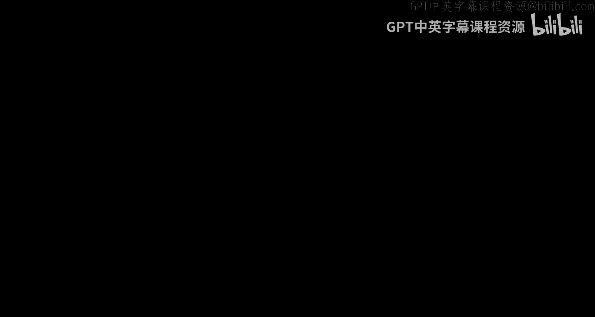

# 算法博弈论：第6讲：多项式权重算法 🧠



在本节课中，我们将学习一种名为“多项式权重算法”的强大在线学习算法。我们将从回顾之前讨论的简单算法开始，逐步引入更复杂的设定，最终理解该算法如何保证在对抗性环境中，其表现不逊于事后看来最好的“专家”。

---

## 概述 📋

我们将从“预测专家”的简单模型出发，逐步构建算法。首先，我们会回顾“HALVING算法”及其在存在完美专家时的表现。接着，我们会看到当没有完美专家时，简单的重启策略（迭代HALVING算法）虽然有效，但性能有限。然后，我们将引入“加权多数算法”，它通过软化惩罚机制改进了性能。最后，我们将介绍核心的“多项式权重算法”，这是一个随机化算法，能够在更一般的设定下（专家损失为连续值，而非简单的对错）提供更强的性能保证，其长期平均损失可以逼近最佳专家。

---

## 从HALVING算法到加权多数算法 🔄

上一节我们介绍了HALVING算法，它假设存在一个从不犯错的完美专家。本节中，我们来看看当这个假设不成立时，如何设计更鲁棒的算法。

### HALVING算法回顾

在存在至少一个完美专家的设定中，HALVING算法非常简单：
*   维护一个“幸存专家”集合 `S`，初始包含所有 `n` 位专家。
*   每一轮，根据 `S` 中专家的多数意见进行预测。
*   每一轮结束后，将本轮预测错误的专家从 `S` 中移除。

该算法保证犯错的次数不超过 **`log₂(n)`** 次。

### 迭代HALVING算法及其局限

当没有完美专家时，HALVING算法最终会清空集合 `S`。一个简单的修复方法是当 `S` 为空时，重置算法（即让所有专家重新“幸存”）。这被称为迭代HALVING算法。

可以证明，如果最佳专家在事后看来犯了 `OPT` 次错误，那么迭代HALVING算法最多犯 **`log₂(n) * (OPT + 1)`** 次错误。

这个界限有两个主要问题：
1.  **界限不理想**：`log₂(n)` 是一个乘法因子。如果最佳专家犯错的比例是常数（例如1%），我们的犯错比例将是 `log₂(n)` 倍，这可能很大。
2.  **算法不智能**：每次重置都完全忘记了之前学到的所有历史信息。

### 加权多数算法

加权多数算法通过软化惩罚机制来改进迭代HALVING算法：
*   不再使用集合 `S`，而是为每位专家 `i` 维护一个权重 `w_i`，初始为1。
*   每一轮，根据专家权重的加权多数意见进行预测（即比较预测“上”和“下”的专家总权重）。
*   每一轮结束后，**将本轮预测错误的专家的权重减半**（而不是直接设为0）。

以下是该算法的核心更新规则（针对0/1损失）：
```伪代码
如果 专家i 本轮预测错误：
    w_i = w_i / 2
```

**定理**：加权多数算法犯的错误次数 `M` 满足：**`M ≤ 2.4 * OPT + log₂(n)`**。

这个界限将乘法因子从 `log₂(n)` 降低到了一个常数2.4，这是一个显著的改进。证明思路与HALVING算法类似，但跟踪的是专家总权重 `W` 的变化：
1.  当算法犯错时，因为遵循的是加权多数意见，所以至少有总权重一半的专家犯了错。将这些专家的权重减半，意味着总权重 `W` 至少减少了 **1/4**。
2.  总权重 `W` 初始为 `n`，且始终不小于最佳专家的权重。最佳专家若犯错 `OPT` 次，其最终权重为 `(1/2)^OPT`。
3.  结合1和2，通过不等式推导即可得到上述界限。

---

## 迈向多项式权重算法 🚀

虽然加权多数算法有所改进，但我们希望得到更强的保证，并处理更一般的情况。本节中，我们将把设定推广到更符合博弈论应用的场景。

### 更一般的设定

我们考虑以下设定：
*   **专家与选择**：有 `n` 个专家（可类比为游戏中的 `n` 个可选行动）。每一轮 `t`，算法**随机选择**一位专家 `i_t` 来遵循。
*   **连续损失**：每一轮，每位专家 `i` 会遭受一个**损失** `l_t(i) ∈ [0, 1]`（可类比为选择该行动带来的成本或负效用）。算法选择专家 `i_t` 后，遭受的损失即为 `l_t(i_t)`。
*   **目标**：设计算法，使得其**期望累积损失**不比事后看来最佳的专家（累积损失最小的专家）的累积损失差太多。

这个设定推广了之前的模型：
1.  **行动多于两个**：专家可以对应多个行动，而不仅仅是“上/下”预测。
2.  **损失是连续的**：不再是简单的对（0）或错（1），可以度量“错误的程度”。
3.  **算法是随机化的**：这是关键改进，有助于对抗对手。

### 多项式权重算法描述

算法非常简单，它平滑地推广了加权多数算法：

1.  **初始化**：为每位专家 `i` 设置权重 `w₁(i) = 1`。
2.  **循环每一轮 t = 1 to T**：
    a. **选择专家**：以概率 `p_t(i) = w_t(i) / (∑_j w_t(j))` 随机选择专家 `i_t`。即，按权重比例随机选择。
    b. **观察损失**：观察到所有专家的损失向量 `l_t(1), ..., l_t(n)`。
    c. **更新权重**：对于每位专家 `i`，更新其权重：
        `w_{t+1}(i) = w_t(i) * (1 - ε * l_t(i))`
        其中 `ε` 是一个小的正参数（例如 0.1）。

**核心思想**：算法根据专家的历史表现（权重）来随机化选择。表现越差（累积损失越高）的专家，其权重被降低得越多，因此被选中的概率也越低。参数 `ε` 控制了学习/惩罚的速率。

---

## 多项式权重算法的性能保证 🏆

本节中，我们将陈述并简要分析多项式权重算法的主要定理。

**定理**：对于任意损失序列，任意专家 `k`，以及参数 `ε ∈ (0, 1/2]`，多项式权重算法的期望累积损失满足：
`E[算法总损失] ≤ (专家k的总损失) + ε * (专家k的总损失) + (ln n) / ε`

通过选择最优的 `ε`（约为 `√((ln n)/T)`），我们可以得到更简洁的界：
`E[算法平均损失] ≤ (专家k的平均损失) + O(√((ln n)/T))`

**结论**：随着回合数 `T` 增大，算法的**平均期望损失**最多只比最佳专家的**平均损失**多出一个趋于0的项。这意味着在长期，算法几乎能做到和事后最佳专家一样好。

### 证明思路

证明延续了加权多数算法的分析框架，但处理的是期望和连续损失：

1.  **跟踪总权重**：定义 `Φ_t = ∑_i w_t(i)` 为第 `t` 轮开始时的总权重。
2.  **算法损失与权重下降的关系**：可以证明，`E[算法在第t轮的损失]` 近似等于 `(ε * Φ_t) / Φ_{t+1}` 的一个缩放版本。直观上，算法损失高时，权重下降也快。
3.  **总权重的上界**：通过更新规则 `w_{t+1}(i) = w_t(i)*(1 - ε l_t(i))`，并利用不等式 `ln(1-x) ≤ -x`，可以推导出 `ln(Φ_{T+1})` 的上界，其中包含 `-ε * E[算法总损失]`。
4.  **总权重的下界**：总权重 `Φ_{T+1}` 至少等于最佳专家 `k` 的最终权重。利用不等式 `ln(1-x) ≥ -x - x²`（对于 `x` 较小），可以推导出 `ln(w_{T+1}(k))` 的下界，其中包含 `-ε * (专家k的总损失) - ε² * T`。
5.  **结合上下界**：将 `ln(Φ_{T+1})` 的上界和 `ln(w_{T+1}(k))` 的下界结合起来（因为 `Φ_{T+1} ≥ w_{T+1}(k)`），经过代数推导即可得到定理中的不等式。

---

## 总结与展望 📈

本节课中，我们一起学习了在线学习从简单到复杂的一系列算法。

我们首先回顾了**HALVING算法**，它在存在完美专家时非常有效。接着，我们看到了当没有完美专家时，**迭代HALVING算法**能提供保证，但性能有限。然后，**加权多数算法**通过软化惩罚（减半权重而非归零）改善了性能界限。

最后，我们引入了核心的**多项式权重算法**。它将设定推广到更一般的情况：算法随机选择专家，专家损失是 `[0,1]` 区间的连续值。该算法通过一个参数 `ε` 平滑地更新专家权重。我们证明了该算法具有强大的理论保证：其长期平均期望损失可以逼近事后最佳专家的平均损失。

这个算法的重要性在于，它为我们提供了一种在**对抗性环境**（如博弈）中做决策的通用工具。在接下来的课程中，我们将探讨如何将这个算法应用于博弈场景，让玩家使用它来学习并最终达到某种均衡。


---
**本节课中我们一起学习了**：从HALVING算法到多项式权重算法的演进过程，理解了如何通过权重更新和随机化来设计在对抗性环境中具有强理论保证的在线学习算法，并掌握了多项式权重算法的核心思想及其性能定理。