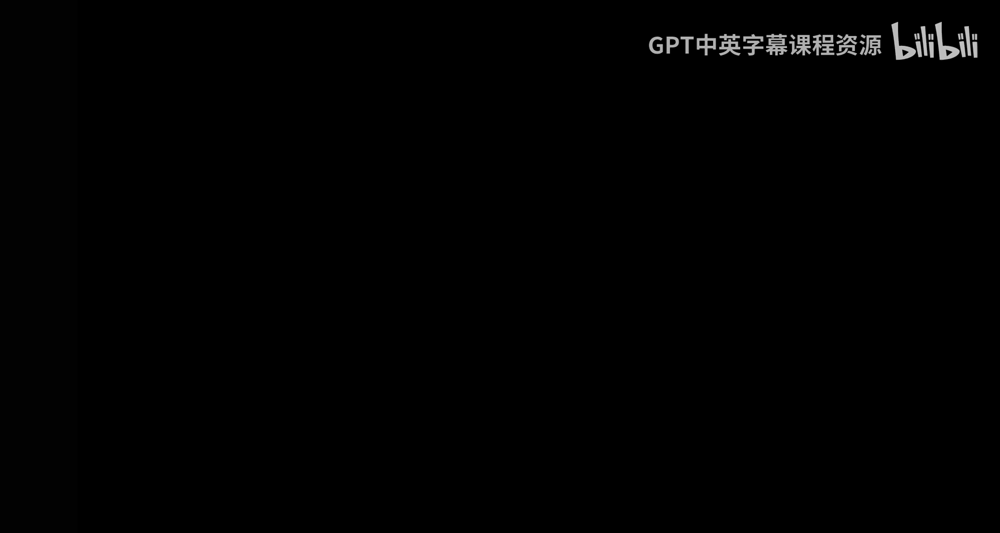
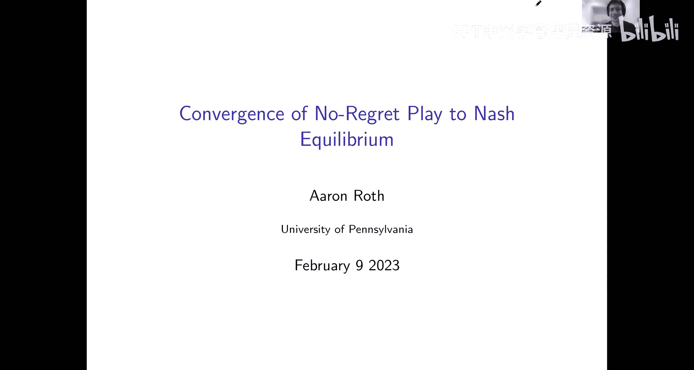
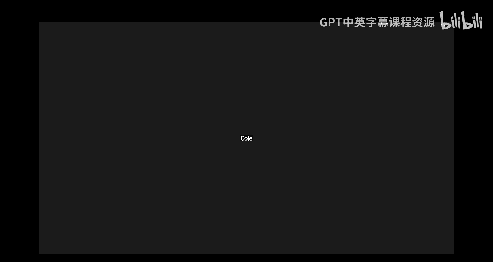
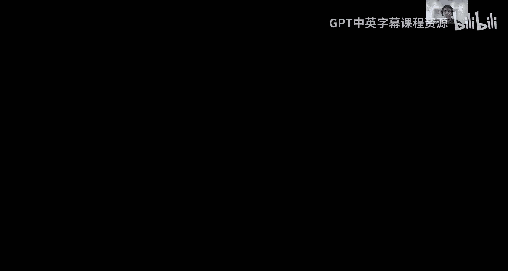
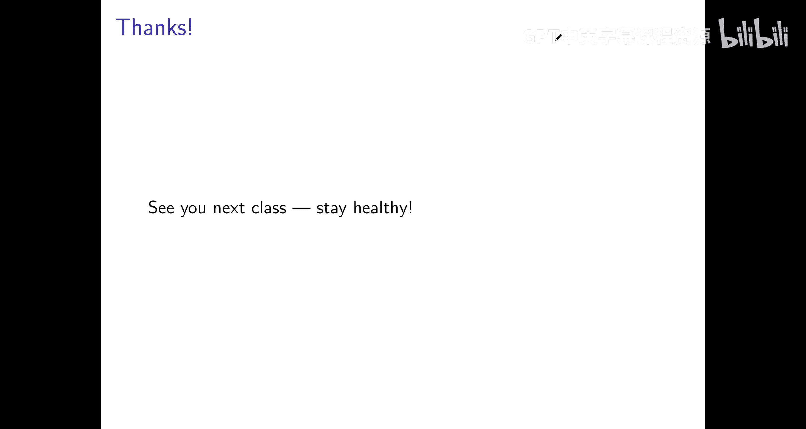

# 宾夕法尼亚大学《算法博弈论｜NETS 4120_ Algorithmic Game Theory 2023》中英字幕（deepseek-R1 p08 NETS 4120_ Algorithmic Game Theory, Lecture 8.zh_en -BV15kLRzTExU_p8-

All right， everybody。Thanks again for continuing virtually， hopefully is the last week。How，H no。

Soom on my computers having a little recording。嗯。Yeah。

。And again。

。

，嗯。All right， see if this works。Um。Yeah， so just saying thank you again for signing on again virtually hopefully this is the last。

Class and we're back to in person next week and anyone who's comfortable please turn on your camera just so I can see that there's someone out there。

😊，嗯。😊，Cool。Last class， we started studying zero sum games。And。

We saw a few waysz in which they were special。In particular。😊。

We thought they had a value which sort of meant the order of play didn't matter right like we could think about。

My opponent moving first and sent me best responding， which would normally be an advantage。

 or we could think about me moving first and my opponent best responding which would normally be a disadvantage。

But in zero sum games， we showed the Minm theorem and sort of what that means at a high level is that the order of play didn't matter。

Let's see， hearing somebody。sTry to。Try to make sure everyone's mut that's insha all right。

 I'm going to mute you insha。Alright。And a consequence of this was this。In two player zero sum games。

 at least and we're going to sort of think this class about how important this two player caveat is。

In two players0 sum games， a consequence of this is that at least conceptually equilibrium could be computed easily。

 like normally in a game if I want to think about what an equilibrium is I need to engage in some kind of counterspeculation I need to think about what my opponent is going to do and what I should do depends on what they're going to do and vice versa there's sort of a kind of circularity because it's an equilibrium of a simultaneous move game。

But。For zero sum games。You know， since order of play doesn't matter。

 I can think about this sequence of moves where I move first and then my opponent best responds and I can just sort of use this backwards induction kind of reasoning to sort of think okay。

 like， you know， what are they going to do in response to。😊。

What I play and taking into account what they're going to do。

 what should I do so sort of a linear kind of reasoning you could use and we went through an example of this to figure out how to find the equilibriumria of a two player zero sum game。

You only need to think about these sort of Minm strategies。But。You know。

 like in our example in which we actually like concretely computed equilibrium and like a toy。

Zero sum game like we had the game matrix in front of us， right， like we。

We had this presidential election game and。ILike we had all the numbers in front of us and we did like。

 you know， careful calculations， we had to like write out equations in terms of the payoffs and the game matrix and you know think about okay。

 well what exactly is my opponent's expected utility if I play you know， this big strategy。

 the kind of thing you couldn't really do if you didn't know the game matrix。😊，Okay。And so。

What I want to think about today is whether。There is a computationally plausible story。

 sort of analogous to sort of the story we told around best response dynamics and congestion games。

That tells us how we might find。😡，Nash equilibria in like large zero sum games。

 Is there some dynamic such that if people such that， you know， number one， it's a plausible dynamic。

 thats a good idea for people to play according to this dynamic。And number two。

 like sort of inevitably leads to NI Libria in multiplayer zero sum games。

Sort of in the same kind of way that best response dynamics inevitably led to equilibrium congesstertion gains。

😊，So that's like the main question I want to think about today。

And the first thing I want to think about is。To what extent like。

Everything we've talked about for zero sum games like really hinges on the two player caveats。

Cause it would sort of be a bummer if we could only talk about two player games like， you know。

 like maybe some things we can describe as two players or some games， but you know。

 there's just like a limit to like the size and scale of an interaction you can describe if there's only two players。

Okay。So。The first question I want to ask， you know。

 do any of the special properties we've sort of discovered so far for two player zero sum games carry over to end player zero sum games？

And。😊，Like it certainly makes sense to like define such games。

 like I can define an end player zero sum game， it's just an end player game。

 such that for every possible action profile， for every possible state of the game。

 if I sum up over the utility functions for each of the end players， you know， they sum to zero。Okay。

So。Okay， so first of all， what do people think like？

Are our end players zero like like is the fact that I've specified that a game is zero sum。

 does that tell you anything interesting about an end player game the way it does about a two player game？

Feel free to unmute and share your。Beliefs。Yes。Okay。

It seems like now we no longer have that property where we can like reduce it to just one value with the min Max now we can only like reduce it to。

I think n minus1 values。Yeah。So like okay， so I'm going to claim that the answer is no in some generality and I'll claim the following like meta theorem and I call it a meta theorem and put scare quotes around it because this isn't exactly a formal statement。

 but I think you'll sort of see in the meta proof what I mean。😊，嗯。😊，So I claim that。Okay。

N players zero o sum games don't have any special properties at all that n minus one player general games don't have。

Okay， so like。This kind of statement still allows two players or sum games to have special properties because。

 you know， if n is two。And N minus one player game is all one player game， it's not even a game。

 of course it's got lots of special properties。But this is saying like， look， if we're talking about。

 you know， like a 216 player zero sum game， like there's nothing interesting that is true about it。

 but isn't also true about a 215 player arbitrary game。Okay。

 so to the extent that like the word zero sum is telling us anything at all。You。

 it's nothing can possibly be true about an end player0 sum game。

 but isn't also true of a completely arbitrary game with one fewer players。Okay。

 and so like in particular。Like we shouldn't expect that。0ero。

 sum games when we have more than two players should。

Have this it should have like a miniax theorem like you know order of play should probably matter we shouldn't expect there to be any like easy way to compute equilibrium in these games is you know。

😊，Unless there's a plausible dynamic that converges equilibrium in all games。

 we shouldn't expect in general there to be any dynamic that's like special to like end player zero some games。

😊，And does anyone want to like。Venture a guess as to what the meta proof is of this meta theorem。

Okay。maybe you want to think about the other way around。Like， suppose。

I had a completely arbitrary n minus one player game。

How could I turn it into an end player zero sum game in a way that wouldn't change any of the like essential properties of the game？

Is it just like？Is it just to like add a player that has a negative utility to the total utility or something exactly yeah？

嗯。Yes， so like。Let's say I've got an M1 player game that it can be completely arbitrary。

 so there's nothing special about it。I can just turn into an n player 0 sum game， like syntactically。

 I'm going to add a new player N， who's like irrelevant to the game like。😊，He only has。

 has no choices to make he's only got like one action， so he's got no choices to make。

 he's completely pay off irrelevant to the other players like his。

Yeah it does the same thing no matter what so like you know the other players。

 their utilities aren't changed at any game stage by the fact that I added this player， right so。

The equilibrium structure is exactly the same as it was before in the N minus one player game like this new dummy player I added。

 really like he's not a participant in this game， he doesn't change the utilities。

 he doesn' he doesn't even have any choices to make， it's only like a syntactic modification。

 but I've added this new player。And。I can， you know， since he's not participating in the game。

 he's only got one action。I can define his utility to be anything I want it's not going to affect the equilibrium structure of the game。

 so why don't I just define his utility to be the negative sum of all of the utilities of all the other players in the game。

Okay， so now like by Fat， this is a zero sum game like I've just defined this new dummy player to have utility exactly the negative of everyone else's everything now sums to zero。

 but I haven't changed the game in any actual way like this was purely a syntactic change and I just。

 you know I moved it from an n minus one player game to an n player game。😊，Okay， so like。

This is why we shouldn't expect。Zero sum games to really have any structure we can take advantage of。

 except in the special case of two player zero sum games。Right， for like。

like two players zero or some games， you know， like are still special and are allowed to be special by this meta theorem because one player games are really very different than than two player games。

Okay， so so。Questions about this。Like， you know， for a two， I guess the point is。

For a two player game， if I tell you at zero sum， that tells you something sort of structurally very important about the game。

Okay， like we proved some of those important things last like Minm Max theorem。

But if there's more than two players， if someone tells you the game is zero sum， like by itself。

 that is entirely meaningless， it has no structural implications at all for， you know。

 cooperation or you know。Ororardder of player or equilibrium or anything else。

 like any game could be made into a0 sum game if you can， you know， add a player。 So like。

 if someone tells you something is a zero sum game。😊。

They haven't told you anything at all unless unless。

They've also told you something else about the game。Yeah。So like nevertheless。😊。

That doesn't mean that there's no interesting subclass of zero sum games that sort of generalize two player zero sum games。

It just means that。In order to specify an interesting structured class of games。

 I need to tell you something other than that it's zero sum。ok。So。😊，In particular。

 like I'm going to define a class of games here that。When。These games are also zero sum。

 share loss of the structure of two players， zero sum games except these are end player game。

And I'm going to call these。Tempparable graphical games， although。

You know we'll talk through what they mean， like the graphical part is maybe like a red herring。

 you know。This will make more sense when we define it。

 but like the graph could always be like a complete graph。

It's really the separable part that is important here。Okay。

 let me tell you what it is a separable graphical gate。It's like， first of all。

Underlying this thing is a graph Think about the vertices as being the players Okay。

 so this is going to be like an end player game there's one vertex for every player。😊。

And think about the edges， there are edges between players that are payoff relevant to one another。

So it might be that your action doesn't actually change it doesn't actually like affect my utility in the game at all。

 like maybe it's a like。Yeah you， you could define you can imagine games where like you know for some of the players just basically don't interact with me they interact with like other people so some players might be payoff or relevant to me there would be no edge between me and those players and in a graphical game some players might be payoff relevant there would be an edge between me and the player there's nothing here that's saying that the graph can't be a complete graph。

In which case， potentially everyone is pay off relevant to everyone else。She。

But what's sort of more important？Is the separable part of the game？And so。😊。

The like what it means that the game is separable。Is that？Really， what's happening is I'm playing。

Simultaneously， a bunch of two player games。Yeah， one with each of the。Yeah， one with each of my。

 you know， opponents in the game。And when I want to figure out what my utility is。

I sort of sum up my utility over these two player games。Okay， now I'm not。

 I'm not playing them independently。 Like I can't pick like a different action for each of my opponents。

 I have to pick like one action。But like that action is sort of used in all of the two player games。

 I'm playing simultaneously。ok。So like in particular。

 the way like that manifests itself in the definition。

Is that if I'm looking at the utility function per player eye。

I can write that as the sum over all of the other players J that are payoff relevant to him。

 it' the sum over all of the other players that he has an edge to in this graph。Of。😊。

Some utility function that might be specific to that pair。

 right Like I might have a different utility function。You know。

 for Alice and a different one for Bob and a different one for Carol。But like I can evaluate。

Given the action that I chose。AI and the action that。Player J chose A J。

I can evaluate what my sort of utility is in this little two player interaction that we've got between player I and player J。

 and my cumulative utility is just the sum of all of these pairwise utilities with each of the other players in the game。

Okay， so that make sense sort of like in a separable game like this。

 you know sort of like everyone is simultaneously playing a bunch of two player games with。

Their opponents， their neighbors in this graph， they've just got to like。

Pick like one action to use simultaneously in all of these two player games。 Go ahead， Sarah。

 and you know if you don't need to raise your hand， by the way， You can just like。St out。Okay。

 I was just wondering you could explain again what the edges represent。Yeah， so the edges。

 like if the edges are confusing， you can like imagine that。Everyone's interacting with everybody。

 But like more generally， the edges represent。Who in this game？

Is payoff relevant to you who you're interacting with？Like it might be that there's， you know。

People in distant corners of the world that just don't have any direct effect on your utility at all。

Right， so like in a congestion game， like a traffic rout game。You know， like。In principle。

 like the United States is all on。One， road network。But like if I'm commuting in the morning to Penn。

And someone in New York is commuting in the morning from New Jersey to Columbia。

Our routes like the set of routes we can take this don't share any roads and so they're not directly payoff relevant to me but they might indirectly affect my utility because there might be a chain of people that sort of are affected。

 you know beginning with。This one person ending with me。

 And so they're relevant for like what is done in equilibrium。

 but they're not directly pay off relevant and that their actions don't。

Directly change my utility function。 And so in a if we were to describe that as a graphical game。

 there would be no edge between me and them。Oh， so when we were talking about like the proof for theum when you add in the new player and with the trivial action set。

 technically he would be like an isolated note because he wouldn't affect anybody's payoff Yeah。

 like if I were adding in a dummy player， they wouldn't have edges to anybody。Okay， thank you。

But like the reason I say the graph here is like a little bit of a red herring and you shouldn't like get caught up in it is like you could always imagine it's a complete graph like everyone's interacting with everybody。

 yeah that's only like more general。😊，Yes。The important part。

 like the important part is not the graph， the important part is the fact this。

If there were no graph I would just write this as the sum over all of the other players the important part is that everyone's utility can be decomposed as the sum of the utility they get from interacting with each of the other players in the game。

😊，Okay， does that make sense？Okay， but， you know， okay， just to draw like the graph。

 you haven't seen one before。Yeah， right， there's these vertices。嗯。And， you know， maybe。

The graph looks like this， meaning， you know。Player B。

And D are directly pay off relevance to player A， but player C is not if player C changes their action。

 it doesn't directly affect the utility for player A。

That doesn't mean that they're not relevant in the game。

 like the fact that C is here since C interacts with B and D。

Effects what B and D do and what B and D do affect what A does。

 so the fact that C is here might be important to the equilibrium structure of the game。

It just means that they're not directly pay off relevant。

 That's sort of the kind of structure that the graph is capturing， but。You know。

 like I could without loss of generality， It could always be like a complete graph。

 And these utility functions could be 0。 like on like the utility functions on the edges I just added。

 So like。😊，The graph is like not adding much。 The fact that I can。

 the important part is the fact that I can。The fact that I can decompose the utilities across the edges。

对。Okay， and so。That's some class of games， exceptparable games。

But I want to think about our it separable games， they can have a lot of players。

 right they can be like end player games。What I want to think about are separable zero sum games。

Okay， so I'm going to think about end players zero sum games。And。

I know more than that there's zero sum。 right I know that like if I only told you an end player game was zero sum。

 that wouldn't tell you anything interesting about the game。

But I claim if I tell you both that the game is zero sum and that it's separable。

Okay then it tells you something interesting about the game and it'll have many of the properties of two players zero sum games。

And note in particular that like a two player zero sum game is a special case of an end player separable zero sum game it's just the。

😊，Graph。This looks like that there's only two players okay so it's of like a degenerate case。

 but like this is a class of games that is like just strictly more general than two players zero sum games。

😊，And so in particular， the claim is that there's still going to be like a mini maxax theorem for these two player zero sum games for these end player separable zero sum games。

 like they still have a value， every equilibrium will have the same payoff for each player。

They're easy to compute these equilibriumria and in fact。Not just know。

 like with an algorithm on your computer。Like we're going to show that there's sort of an efficient dynamic。

That naturally converges to equiria in these separable zero sum games， even with end players。😊。

In particular， this will give us a dynamic for two players or of some games in a special case。And。

Yeah， no like。Are these separable games like the utility functions？

Are written as sums of like utility functions for like two player games。

 one that you're playing against each of your opponents。

When I say that a separable game is also zero sum。That does not necessarily mean that each of these constituent two player games is zero sum。

Like it could， but that would be stronger than what we're assuming。

Like the only thing we're assuming is this。In aggregate the game is zero sum if I sum over the utilities of all and of the players at any game state I get zero。

It doesn't mean that the utility of me and someone across the edge from me on some particular one of these two player interactions is zero so there might be you know gains from cooperating locally。

 it's just that there aren't globally。ok。So that's sort of the setup for what we're going to do。

 the classic games we're going to study and roughly what our goal is to show that there's like going to be an efficient dynamic that converges equiria in these games。

Next， we're going to execute on this plan， but before we do other questions。

So the class of games is clear。Okay。So。Okay。So it's like a spoiler， right， it's like。

One instance of the dynamic， the class of dynamics that we're going to show。

Converged equilibriumria are everyone playing according to the polynomial weight out group。Okay。

 so we could say， you know， like we're just going to study what happens when everyone plays according to the polynomial weights algorithm。

But。Although the polynomial weightights algorithm is a very good thing。

 a very good idea to play if you're playing in a zero sum game， it's a very specific thing to do。

Like， to the extent that we can。we say if everyone plays according to the poly the always algorithm。

 play converge synnatic equilibrium， that's true， but it's a very narrow statement。Our goal。

 just as it was in best response dynamics。Is to sort of define a whole class of dynamics such that if you play according to anything in that class you converge to national equilibrium so in best response dynamics that sort of came from leaving all sorts of things underspecified in the algorithm like the order in which players move the。

😊，Specific better responses they take right to sort of those things didn't matter you could fill in those details however you wanted and we showed that。

Better response dynamics converge to equilibrium。So， here。U。

What I'm going to do is I'm going to define it you know。

 like suppose people play according to some dynamic。

Over T rounds so they generate a sequence of T action profiles。

I want to define like some property that this。Play out sequence might or might not have。

And we'll show that。If the playout sequence has this property I'm defining。

 then play must have converged to equilibriumria。And in particular。

 if everyone plays according to the polynomial weightights algorithm。

The sequence will have this property。But there's other ways to get it too。Okay， so。

Suppose we have a sequence of action profile， imagine。😊。

That this results from just sort of the realized sequence of actions that everyone plays if they sit down and play this game。

 you know for tea round。Okay， so remember an action profile is like a vector specifying what each of the end players does at each of the time steps。

So we'll say that such a sequence of action profiles。Has regret。Delta of T。

If simultaneously for every player I。And simultaneously for every action AI star that they might。

Wish they had played， they might think about playing and sort of regret as they go to sleep at night。

That。If I look at playerized average utility， average over time for the actual。

Sequence of action profiles that was actually realized。That this is at least as high。As。

The utility they would have obtained in this counterfactual world where everyone else continued playing as they actually did in this sequence of action profiles。

 but player I did something different， player I instead。Every single round played this action。

 AI star。O。So this is saying， like。Right， right。 Play I has regret Delta of T。If。

They could have done better by playing action AI star every round instead of what they actually did。

 and the amount they could have done better by was Delta of T。

And they have't regretted most deelta of T if。For every alternative action。

 they could have considered consistently playing every single day instead of what they actually did。

They couldn't have improved their counterfactual payoff， except by Delta of T。Okay， and。If。です。

Action sequence has the property that delta of t gets smaller and smaller as t gets bigger and bigger。

 if their regret goes to zero as we play for longer and longer。

 we'll say that this action sequence is no regret。😊，Okay。

 so let me like pause here because this is sort of。An important definition， but I think the。

Terminology is sort of evocative。Like。On the left， we have what player， you know。

 the action sequence that was actually realized。On the right， we have。

This counterfactual world where everyone else， except for player I， did what they actually did。

 but like player I is now imagining what would have happened if instead he had done something different and played AI star instead。

And if he could have done something better in this counterfactual world， we say that he has regrets。

 He regrets not having done that instead。And Delta of t is the amount by which he could have done better。

And if that amount is almost nothing， if it's going to zero， we say he has no regret。Okay。😊。

And the sequence has regret Dlta of t or the sequence is no regrets。

If this is simultaneously true for every single one of the players。Further questions about this？

So just to clarify， each player is wondering whether there was a single action they could have played throughout the tea rounds。

That would have made them better off exactly so they're not comparing to like。

There's much stronger thing of。Playing what would have been the best response。

Separately at every round。Right， like if I play a rock Paper scissors tournament。

It's not that I'm kicking myself at the end， thinking like， oh like， you know， round 16。

 you played scissors。 So like I really regret not paying rock then。 and then like at round 17。

 you played paper。 So I really regret not paying scissors or like if I was comparing myself to that。

 like no matter what， I would like always have like enormous crushing regret。But I'm saying， look。

 you know like。If I ended up winning like less than a third of the time， then like in hindsight。

 I could have done better by like playing rock every time or paper or scissors。

 then I will have regret。So makes sense， yeah understood， thank you。Yeah。

Can you explain the definition again of no regret and what the like OST means？Yeah， so。

Let's think about。But let's maybe break it down。 So let's think about。What does it mean？If I。

Regret not having played some particular action AI star every day instead of the sequence of actions I actually played。

What it means is that。If after everything is said and done， like the action profiles。

In the sequence are actually realized。Um you know， if I could have done better in hindsight by just playing the same fix action every day。

 AI star instead of what I actually did， which was potentially playing something different at every round。

Then I say， I regret。 I have regret to action AI star。

And I can quantify how much that regret is by asking how much better could I have done if I had played AI star every round。

And we say that I have regret Delta of T， if I have regret that most deelta of T for every other action I could have played。

And we say that。😊，The sequence of actions has regret Delta of T。

 If every player has regret at most Delta of T for each of the other actions they could have put。

Does that make sense？Yeah， thank you。I have a question as to why we're able to assume that each player is going to keep playing the same move。

 like I guess second in that rockover is example like。If you start playing rock every turn。

It just kind of like and like a real world application。

 like isn't there definitely a big difference if you're just doing the same move every time？Oh。

 so we're not assuming anything of the sort， right， So like。

The actual sequence of action profiles A1 through A， this is arbitrary。

 like presumably the players are playing different actions every single time。

The question is just like what is the benchmark they are comparing themselves to in when we're saying what they regret？

And you're right， you could compare to a stronger benchmark， you could say， okay。

 like did you do as well as the best possible sequence of moves you could have played in hindsight。

But that's not a very useful benchmark and you can sort of realize why sort of。

By thinking about rock paper scissors。If I'm comparing myself in in hindsight to the best possible sequence of actions。

 but once I know what actually happens。😊，There's always a sequence of actions that would have caused me to win every time。

So if that's how I was defining regret， there's just no possible way I could behave in this game that would cause me to have low regret。

So regret here is defined with respect to a much weaker benchmark of just doing a single thing consistently。

Right， like。You can have low regret while playing some complicated。You know。

 an algorithm that causes me to play different actions on different days。

It just means that you're doing better than you could have done in hindsight by playing something consistently。

Does that makes sense。 Yeah， it's makes sense yeah。

And what is the notation one more time of the Ot of one Oh this just means that。

Little o of one means a function that goes to zero。The subscript t here means t is the variable。

 so as t gets big， as t goes to infinity， delta of t goes to zero。Okay。And。Okay， and by the way。

 like。You know， I'm not making any normative claims about whether， you know， like as you。

Arrange your life and your like。You know， you lay out on your deathbed。

 your your wins and losses and the things you regret that somehow you should compare yourself when to benchmarks and like。

 you know， fixed actions like。You know， instead， like you know we're going to prove things about sequences of play that have this property and the reason that is an interesting thing to do is because。

We know how to generate sequences of play that have this property。Like， in particular。Right， like。

For a particular player I， this is exactly the form of the guarantee that polynomial awaits。

Promises them， if。If they play the game with polynomial weights， no matter what their opponents do。

Like for you as a particular player， I， if you decide to play this game with polynomial weights。

It will promise you exactly this。you will do as well as the best fixed action in hindsight。

That's making no assumption about what the other players do， they could be doing anything。

And so in particular， if everyone plays according to polynomial weights。

 everyone will have this guarantee simultaneously。😊。

So if we just simulate play of this game in which all end players have play with the polynomial weights algorithm。

We've proven that it will generate a sequence of play that has this no regret property and in particular for polynomial weights。

 this function delta of t will go to zero at this rate that we proved。

 you know one over square root of t。O，谢是对。😊，This is not some。Definition that， you know， like。

 I'm just pulling out of a hat and like， it's not clear how to satisfy it。

 We know exactly how to generate sequences like this。 They will be generated by。

Thisll this will just be like how how play turns out if everyone's playing according to the polynomial weights algorithm。

 but it's not the only way like there's other algorithms that guarantee diminishing regret。

 there's things you could do that might not even guarantee diminishing regret in the worst case。

 but happen to lead to diminishing regret when you play them。

ItIt's a sensible thing to expect to happen because。

If you are playing in such a way that causes you to have high regret。It's pretty easy for you to。

Switch to a different algorithm that causes you to have lower gra， you could， for example。

 start applying the polynomial weights algorithm。And it's not hard to play the polynomial weights algorithm。

 it's a very simple algorithm。And so。It's not crazy to think of it。

Observed sequences of play should have low regret。Since there are simple。

 sensible ways for playersers to obtain it。Okay。😊，But I guess the point is like the reason we're not talking specifically about the polynomial weights algorithm。

 but instead sequences that have low regrets is this is a more general family of dynamics。

 any play dynamic that ends up resulting in a sequence that has low regret will have the properties that we prove about sequences that have low regret。

😊，Okay。So I want to think about play dynamics now， and I want to introduce some notation。

SoS we have a sequence， suppose we've played out some game， some end player game for T rounds。

 and I have this sequence of action profiles A1 through AT。

I want to write AI bar oh so like for some particular player I。

There's like a sequence of actions they've played over these T rounds。

Like they played AI1 at the first round， then AI two all the way up through AIT。

So a sequence of action profiles in codes in particular。

 like a sequence of T actions for each player eye。😊。

And I want to write AI Bar for the mixed strategy that just corresponds to picking an action uniformly at random from this sequence。

Okay， so like the sequence of action profiles。Specifies a sequence of T actions for each of players。

 AI bar is just like the mixed strategy that corresponds to uniformly。

 randomly randomizing among those T actions。😊，Okay。And so。With that notation in mind。

This is the theorem。I want to prove。And I say， look。Consider any zero sum separable game and players。

And imagine that it's been played。By some， you know。

 people are using like whatever algorithms they want to play this game。

 they're just playing the game。It's been played out to T rounds。

 so we have a sequence of T action profiles。Let's suppose it happens that the sequence of T action profiles has regret delta of T。

Through whatever means， maybe everyone was playing with the polynomial weights algorithm in which case we know exactly how small delta of t is。

 it goes to zero at a rate of one over root t， maybe they did something else and it just happened to have low regret。

 whatever we've got a sequence of action profiles that has low regret。😊，So。

Then if I look at the following collection of mix strategies， one for each player。

 for each player I is just playing the strategy AI bar。

 which just means randomizing uniformly among the actions they played。

In this particular sequence of action profiles。Then。Thisす。Vctor of mixed strategies。

 one for each player is actually an approximate na equilibrium abri。

And how close we are to Nsh equilibrium depends on how small the regret is。

 an N times delta of T approximate N equilibrium。And so， you know， like for example。

If we were playing with the polynomial weight algorithm， you know。

 like delta of t would be going to zero at a rate of one over root t。Right， so yeah， we could ask。

 right suppose delta t is the regret bound we get from the polynomial weights algorithm。

 which remembers just two root log K over t。😊，We could ask like， okay， like given this theorem。

 how long do we need to play before like play has converged to an epsilon of approximate Nsh equilibrium？

And we could solve， and we could just answer that question。 It would be something on the order of。

N squared， the number of players squared log K， many rounds over epsilon squared。Okay。

 so something pretty fast， sort of the rate of convergence depends quadraically on the number of players and on the inverse of how close you want to get to approximate that equilibrium and only logarithmically in the number of actions in the game。

And in a two player game where n is just two。It says， look。

 we actually converge to an epsilon approximate Nash equilibrium。😊。

Not just in a number of steps that is like polynomial， the number of actions。

 but in a number of steps that is only logarithmic in the number of actions。

Like it could be a really big game， really big two player game， say。

But convergence is sort of exponentially fast in the number of actions。😊，Okay。

 so this is what I want to prove。That if people play in a zero sum game。

 not just a two player zero sum game， but an end player or zero sum game as long as it has this separability property。

Then play in this average sense converges very quickly to approximate hash equilibrium。Okay。

 and it's not just actually that they have to play with polynomial weights。

The only thing that matters is the regret of the sequence so anyway way they get there converges to the equilibrium。

😊，Okay， so foot is an approximate mesh。Right， so remember an approximate Nash or an exact Nsh equilibrium。

Is a。You know， collection of strategies， one for each player so that nobody can。

Gain at all by deviating， nobody can increase their utility by even a tiny little amount。

An epson approximate na equilibrium is a。Vctor of strategy is one for each player so that。

Maybe there's somebody who can gain by epsilon by deviating， but not by more than that。

So nobody can improve their utility by more than epsilon by deviating。Okay。Other questions。不。Okay。嗯。

Okay， so let's prove this in little bite sized trunks。嗯。😊。

And so I want to start with sort of like a useful， basically just syntactic fact。

 but something that we're going to use a couple of times， so I want to just， you know。

 make sure we all understand it。😊，So。Let's consider for some particular player eye。

And for some particular fixed action， AI star that they might consider playing。This expression here。

 which is just。Cumulatively， over time。What would have been their average payoff？

If all of the other players。Played， according to。The actionction profile at day T。

But player I consistently played this one action AI star every day。Okay。

 that's what this expression on the left is it's just sort of saying， okay。

 we're averaging over time of the utility of player I except it's not the actual utility of player I because instead of。

😊，Having player I do at day T what player I actually did at D T。

 we're having player I play this one fixed action AI star， while in the meantime。

 everyone else is playing， you know， as I actually did at dayt。So this is sort of like。

The counterfactual utility player I would have gotten in a world in which he like deviated to like consistently play this one fixed action AI star every day。

Okay。It's like just that's what this thing is here。Okay。And I just want to， like， note that。Okay。

 it's written like this but。I could swap the order of these summations that doesn't matter。

I could bring this instead of averaging at the outside， you know， having this one over T out here。

 I could bring the one over T to the inside。Yeah。And if I did that。Then what I would get here。

Would look like an expectation。At this what is this expectation now we're looking at。

🤧The particular two player interaction that player I has with player J because remember this is a separable game and we're saying。

 okay， you know what is。Player eyes expected utility。If he plays AI star。

And player J uniformly randomizes across all of the actions， you know， AJ1 up through A8T。

 putting weight1 over T on each of them。And we're just sort of syntactically realizing that the sum over t actions。

 putting one over t weight one over t on each of them。

This is just the same thing as an expectation of selecting one of those T actions uniformly at random。

😊，Okay， and so like the upshot is Justin， this is again， entirely syntactic。

But the upsideshot is just that。If I'm looking at this quantity on the left。

Which is just sort of player eye looking back over his life and sort of wondering how would have things been different if I had played AI star every day？

That's exactly the same thing as him wondering。How well off would I be if I played AI star today and my opponents。

 all of my opponents randomized uniformly according to this mixed strategy that we call AJ bar。

 which is just randomizing uniformly at random between all of the actions they historically played？

Okay， so there's something going on here。 It's just， you know。

 like averaging over the T days is the same thing as taking an expectation over like a uniform distribution over the T days。

😊，Okay， but。Is this clear， but like in some sense， there's like nothing going on here。

 It's just like a syntactic transformation。 On the other hand， it's going to be quite useful to like。

😊，Think about this counterfactual quantity。 You know， how well would I have done， you know。

 now that I'm looking back。On the years of my life。

 if I had just played this one fixed action every day and viewing that as。そ of。

My responding to a mixed strategy with an action， so is that clear？

Are we assuming that your opponents？Over the two days it's already selecting like from their actions uniformly。

So our opponent did our opponents did whatever they did right like at this point everything's fixed we're looking back over the T days。

 so you know each of our opponents J played some particular action AjT at each day。Okay。

And we're just saying， well now， you know， now that we're here looking back。

 we know exactly what they did， our average， the average payoff we would have gotten for playing AI star every day。

That's just another way of saying what payoff would we get if we played AI star against opponents who were uniformly randomly choosing actions according to this history。

Makes sense。Yeah， cool。Okay。So。So remember like。What do we want to prove， We want to prove that。

If everybody were playing according to this mixed strategy， AJ Bar。

That this would actually be a national equilibrium， or at least an approximate national equilibrium。

What that means is that。We wouldn't be able to no player would be able to gain much by deviating。

From this mixed strategy and what would they deviate to well like of course they would the thing that would you know gain them the most is that they deviated to their best response given the。

 equilibrium strategies of their opponents。Okay， so let's give a name to that best response。

Let's imagine that every player is playing according。

 every player I is playing according to this mixed strategy AI bar。Okay。

 like we want to claim that this thing isn an approximate equilibrium。

So let's say that if everyone's doing that。You know， okay。

 something will be a best response for player I。 Let's just call that thing AI star。

 AI star is just a best response of player I to the mixed strategies of his opponents when they're all playing A J bar。

Okay。And one obvious thing I want to note is that。If I look at the utility for player I。

When he plays。AI star， his best response to his opponents， and all of his opponents play A J Bar。

 they're parts of this purported equilibrium。That， of course。You know。

 playerized utility in this case can only be higher than if instead of playing his best response。

 he did something else， AI bar his part of the equilibrium。Because by definition。

But like what it means for AI Star to be a best response is that his utility is higher when he does this than when he does anything else。

ok。So if everyone's playing according to their part of the sort of purported equilibrium。

Where everyone's playing AJ bar。And any player I deviates to play his best response。

 AI star that can only increase his utility， can't decrease it because that's what a best response means。

Okay。She。So those， so so far， we've sort of said， you know。

Like basic things that have nothing in particular to do with the premise of the theorem right like this first thing was you know like just noticing that averaging over t rounds is the same thing as taking an expectation over a random distribution on T things the second thing was kind of just the definition of best response。

😊，😊，Let's now start actually using the hypotheses of the theorem。

So like the one thing we know right the one thing we have to work with is that the sequence of actions that we're starting with。

 the sequence of action profiles has delta T regret。😊，Okay。

 so let's like start by just unwrapping what that means。Well， it means that for every player， I。

If I look at the utility that that player gets on average over the sequence of T action profiles。

It is at least the utility that they could have gotten counterfactually if they had played。

Any particular action， AI star in particular， we might as well choose。

The AI star that is the best response to the AJ bar strategies of their opponents。

And everybody else played， according to this mixed strategy， A J bar。

And just note in writing down this right hand side。I'm using our first observation here。

Like what polynomial weights actually says， like the polynomial weights theorem like verbatim says that your average utility over time is at least your average utility of playing any fixed action over time。

😊，And here we're using this observation that your average utility over time of playing any fixed action is actually just your utility of playing that fixed action against opponents who are playing mixed strategies that are randomizing across those actions。

😊，Okay。😊，So this is just the promise of。It was just the meaning of the regret guarantee。

Together with our first observation before。Okay。So we have this guarantee for every single one of the players。

 I've written it down for like some particular player， player I。

But the fact that the sequence has Delta of T regret tells us that this is true for all of the players eye。

Okay。So we've got this like inequality， one for each of the players， and they're all true。And so。

It is very tempting at this point if you have a bunch of inequalities that are all true to like sum them up because the sum of the inequalities will also be true。

😊，Okay。So let's do that separately on the left hand side on the right hand side。

 I'll sum up the left hand side over all of the players and I'll sum up the right hand side over all of the players。

 and since all of these inequalities are true， I'll also know that the sum of the left hand side over all of the players is at least the sum of the right hand side over all of the players。

Okay。So。Here's the first。A little bit of magic。So I've got the inequality here。

 this is the upper inequality， this is for a particular player I。

What I'm doing now is I'm inserting into it a sum over all of the player's eye。

 so now we're summing up over all of the players。Okay。And I claim that。It sums out to zero。

Can anyone。Tell me why。It's zero sum。I there a sum game？Right， so。

What do we know about zero sum games at every action profile if we sum over the utilities of all of the players。

 it comes out to zero。Now here we're summing over T action profiles。But that's okay。

 like for every action profile， meaning you know for each day T。

 we have a sum over all of the players and at that action profile because it's a zero sum game。

 the sum of the utilities of all of the players at that fixed action profile has to be zero and so we're just summing up over t terms each of which are zero and so we get zero。

😊，ok。So like the left hand side of this inequality， when we sum it up over all of the players。

 like greatly simplifies， it's a zero and this is because it's a zero sum game。😊，Okay， is that clear？

Okay。So， we've。Written out of inequality。That comes from our regret hypothesis。

 we've summed up over the left hand side of this inequality and we've used。

The hypothesis that our game is zero sum。Okay， how about the right hand side。

 so that's sum up over the right hand side as well。Yes。Well。U。😊，You know。

 nothing immediately magic happens on the right hand side， like I've got the right hand side。

I can sum up over all of the players。嗯。But on the right hand side。

 it like this doesn't take equal zero when I sum up over at the players， can anyone tell me why？Okay。

Like， how come。This expression here。Doesn't equal zero even though I'm， you know。

 even though it's a zero sum game and I'm summing up over utilities over all over players。

Is it because this is a mixed strategy so it's an expected utility？No。

 just because these just because we're talking about if you're not requiring that that they're individually zero sum。

No。So what does it mean that a game is zero sum？It means that at every fixed action profile。

 if I sum up over the utilities of the players， I get zero。That's what was happening here。

Like we have a fixed action profile， each player I， each player J is playing AJT。

 and we're just summing up over all with the players。

Here something different and sneakier is happening because these are sort of like counterfactuals。

So it's not that everyone's playing a fixed action profile when we consider the term that corresponds to player I。

We think of what happens when player I deviates to play this best response， AI star。

 whereas all of the other players J continue playing AJ bar。

But when we consider the term corresponding to the utility for player J。

Player I isn't playing AI star anymore。 Player I is playing AI bar。

So we're summing up over all of the players， but。In every term that we're evaluating player I is utility in this counterfactual world where it is player I who deviates。

 so every term in the sum is actually the utility of player I at a different action profile。😊，Okay。

 and so we don't know anything about how these like。

What zero sumness tells us is if we sum up the utilities over all of the players at a fixed action profile we get zero。

 but that's not what we're doing here， we're summing up over all of the players of their utility in a different action profile。

 the one that results if they are the ones who deviate to playing their best response。

Does that make sense。But okay。So we've got the， you know， the sum of the right hand side is。

 you know， this thing。But the sum of the left hand side is0。Okay， so。

We can rewrite this since we know the left hand side is bigger than the right hand side。

We can rewrite this as n times delta of T n times this regret term is at least the sum overall of the players of their utility when。

They are the one who deviate to their best response， like when we're if for each player I。

 we're looking at player I's utility when player I deviates to playing his best response and all of his opponents are playing according to this mixed strategy that is supposedly you know。

 an approximate mash equilibrium。Okay， we know that the sum of the gains by deviating。嗯。

Cannot be more than n times deeltata T。Okay， another trick。So。These terms here， right， remember。

For each player I， we're taking the their utility over a different action profile。

 The action profile where they deviate to AI star， But everyone else plays according to their part of this。

Apprximate National equilibrium AJ bar。I'm going to subtract off a term for every player。

For every player， I'm going to subtract off a term equal to their utility if they don't deviate。Okay。

 so we've got the utility for player eye， they deviate to playing their best response。

mininus the utility for player eye， if they don't deviate to playing their best response。

 they just play according to AI bar， their fixed mixed strategy that is part of this thing that we're trying to show is an approximate national equilibrium。

Okay， so we had like this expression up here。And then down here， I like， subtracted it off a term。

You know， inside each term of this outer sum， and I'm claiming these two things are equal。

Can anyone tell me why that's true？This second term is like it a zero sum game rules so it goes zero zero zero Yeah so it's again because this is a zero sum game and now like we're summing up over all of the players of their utility at a fixed action profile like everyone in every one of these terms is playing according to their fixed mixed strategy AI bar they're not deviating differently in different terms so this thing here you know term by term it might take different values but in aggregate when we sum up over all of the end players this thing just adds out to zero and so it doesn't change the value of the whole sum。

Okay， so we're using again， the fact that this is a zero sum game。Okay。

So now I want to think about each of these individual terms。

 so let's think about what we have here now。We're summing up over all of the players。Of。😊。

The utility that they could get if they deviated to play a best response what their opponents were doing。

Minus the utility they would get if they didn't deviate。Okay， so this is now their gain， they。

 you know， before we had the sum of their utilities if they deviated。

 now what we have is the sum of the gains that they get by deviating。Okay。So like first of all。

 first of all。I claim each of these terms， which individually represents。

The gain that player I would get if he deviated from playing his part of this， you know。

 mixed strategy profile to playing his best response to what his opponents are doing。

Each of these terms is not negative。下金。It's again。Not a loss。 Yeah。

 it's like the definition of best response。 Like the best response is like what， you know。

 it's the action that maximizes this expression。 So like。

You knowYou can never deviate to playing your best response and decrease your utility and it wouldn't have been a best response right so。

It's because AI star was defined to be a best response to these mixed strategies of your opponents。

And so。Okay， and so what do we have？We've got the sum of a bunch of non negative terms。

And we know that the sum isn't too big。Okay it's important these and what we want to say is that each of these terms is not too big。

Right so like， you know。For each player I， this term is exactly the amount that they can gain by deviating to playing their best response。

Right， like。What it means for。This vector of mixed strategies to be an approximate N equilibrium is that this term should be small for every player nobody should be able to gain much by deviating that's what we need to show that this term is small for every player。

Now we have that the sum of these terms is small over all of the players。

And if we didn't know that the terms were non negative。

 it wouldn't imply that each of the terms was small or some of the terms could be small because some of them were hugely positive and some of them were hugely negative。

 it doesn't rule out there's some hugely positive terms。Okay。But because。

Each of the terms is also non negative。If I， if I've got。You know。

 a million non negative quantities and they sum up to less than 10。

Each of them has to be less than 10 because there's no negative numbers out to sort of cancel out to large positive numbers。

Okay。So， you know， this part of the argument is like wasteful but like。

If I know that the sum over all of the players of the degree to which they can gain by deviating to playing their best response is at most end times deelta t。

In particular， I know that there's no player who individually can gain more than end times Celta T by playing a best response。

Okay。And that's it。If no player can gain individually by more than an n times Delta t by deviating from their part of this mixed strategy profile to。

To a best response， then by definition， this mixed strategy profile is an n times deelta T approximate na equilibrium。

Okay。That makes sense that proves the theorem。Okay， so we now know。

But in two player zero sum games and actually in this larger class of end player separable zero sum games。

There's mass equilibrium are so of easy to find。Like in particular。

 one way to converge the na equilibrium is just have everyone play this very simple polynomial weight algorithm。

😊，Okay。And that's not the only way， like the only property we needed about the polynomial weight algorithm was that it was one way to get a sequence of action profiles that had。

Small regret。But like really we didn't use any other property of polynomial weights in this argument。

 this is just a fact about sequence of action profiles that have small regrets。Okay。

 so you're playing a game with， you know and you find something better to do than polynomial weights do that and you know。

 if it's better in the sense that it only resulted in smaller regret for you。

 then that's great like you've only accelerated convergence to equilibrium okay that's true for everybody。

So， we now have a。Not just an algorithmic way of computing N equilibrium and sparable zero sum games we've got。

😊，You know， a plausible dynamic that doesn't require much knowledge of the game only enough to let you play the polynomial weights algorithm right all you need to know is。

What your loss is for each action on the you know day that you've considered playing it。

And you get quick convergency equilibrium。ok。😊，So thank you and see you guys on Tuesday。

 hopefully in person。Thank you。Yeah， thank you。

