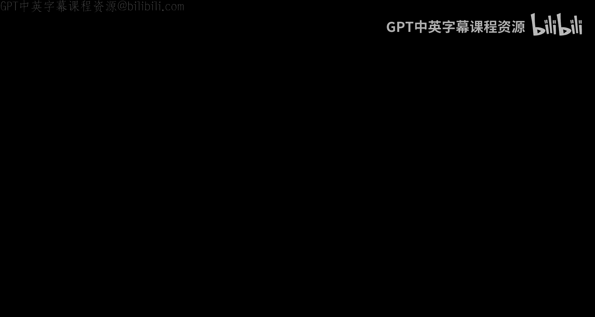
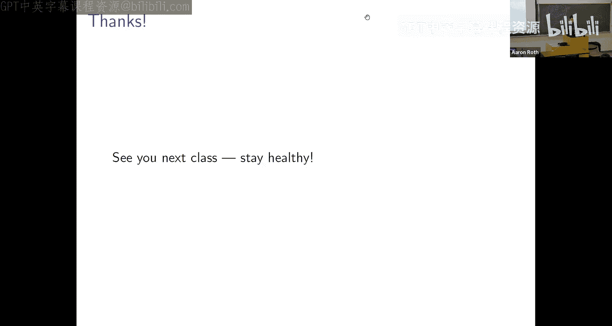

# 算法博弈论：第9讲：从纳什均衡到相关均衡

在本节课中，我们将学习博弈论中一个重要的扩展概念——相关均衡。我们将看到，通过引入一个协调机制（如交通信号灯），我们可以引导玩家达成比独立随机化（混合策略纳什均衡）更高效、更协调的稳定状态。相关均衡不仅保证了均衡的存在性，更重要的是，我们将看到它具有良好的计算性质，可以通过简单的学习动态高效达成。

---

## 从交通信号灯说起

上一节我们介绍了混合策略纳什均衡，它通过独立随机化保证了均衡的存在性。然而，这种独立性有时会导致效率低下。本节中，我们来看看一个经典例子：十字路口博弈。

想象一个只有红绿灯的十字路口。两个司机（玩家）垂直方向行驶，每人有两个动作：**停**或**行**。收益矩阵如下：

| 玩家1 \ 玩家2 | 停 | 行 |
| :--- | :--- | :--- |
| **停** | (0, 0) | (0, 1) |
| **行** | (1, 0) | (-100, -100) |

以下是该博弈的分析：

*   **纯策略纳什均衡**：有两个：(行，停) 和 (停，行)。在这两个均衡中，总有一个玩家获得收益1，另一个为0。
*   **混合策略纳什均衡**：双方以约99%的概率选择“停”，以约1%的概率选择“行”。在这个均衡中，双方的期望收益均为0，且有约0.01%的概率发生碰撞（收益-100）。

混合策略均衡的结果非常低效：大部分时间双方都停滞不前，极少时间有人通行，还有碰撞风险。我们真正希望的是：一半时间玩家1行、玩家2停，另一半时间反之，且永不碰撞。这对应一个公平且高效的分布：

*   50% 的概率为 (行，停)
*   50% 的概率为 (停，行)

然而，**混合策略无法实现这个分布**。因为混合策略要求每个玩家独立随机化，这只能产生**乘积分布**。例如，如果双方都各以50%概率选择行/停，那么(行，行)的概率将是25%，这会导致碰撞。

问题的根源在于，混合策略缺乏**协调机制**。在现实中，交通信号灯就扮演了这个角色。

---

## 相关均衡的定义

交通信号灯是一个**相关装置**。它向每位玩家私下“建议”一个动作，但这些建议是**相关**的：当它建议我“行”时，必然建议对方“停”，反之亦然。

更一般地，我们可以定义一个**相关均衡**如下：

设有一个博弈，玩家集合为 \( N \)，每个玩家 \( i \) 有一个动作集 \( A_i \)。一个相关均衡是一个定义在联合动作剖面 \( A = A_1 \times ... \times A_n \) 上的概率分布 \( D \)。

这个分布 \( D \) 代表相关装置从“袋子”中抽取建议的方式。装置私下告诉每个玩家 \( i \) 他被建议的动作 \( a_i \)。**相关均衡的条件是**：对于每个玩家 \( i \)，以及每个可能被建议的动作 \( a_i \)，在已知自己收到建议 \( a_i \) 的条件下（这隐含了关于其他玩家建议的分布信息），遵循建议 \( a_i \) 是玩家 \( i \) 的一个**最佳反应**。

用数学公式表达，即对于每个玩家 \( i \) 和每个可能的替代动作 \( a_i' \neq a_i \)，有：
\[
E_{a_{-i} \sim D|a_i}[u_i(a_i, a_{-i})] \geq E_{a_{-i} \sim D|a_i}[u_i(a_i', a_{-i})]
\]
其中 \( D|a_i \) 表示在给定玩家 \( i \) 被建议动作 \( a_i \) 的条件下，其他玩家动作的分布。

**核心思想**：相关装置给出的建议是“自我执行”的。即使玩家在得知建议后，他也没有动机偏离这个建议，因为他知道其他人的建议与他的建议是相关的，遵循建议对他最有利。

在交通灯例子中，分布 \( D \) 以50%概率选择(行，停)，50%概率选择(停，行)。这是一个相关均衡，因为：
*   当我被建议“行”时，我知道对方肯定被建议“停”。此时我选择“行”的收益是1，选择“停”的收益是0，所以“行”是最佳反应。
*   当我被建议“停”时，我知道对方肯定被建议“行”。此时我选择“停”的收益是0，选择“行”的收益是-100（碰撞），所以“停”是最佳反应。

---

## 相关均衡与纳什均衡的关系

相关均衡是比纳什均衡更广泛的概念。

*   **每个（混合策略）纳什均衡都是一个相关均衡**：在纳什均衡中，每个玩家独立随机化。这定义了一个联合动作分布，但该分布是**独立的**（乘积分布）。在这种情况下，得知自己的动作不会提供关于他人动作的任何信息，因此纳什均衡的条件（自己的策略是对他人策略的最佳反应）自动满足了相关均衡的条件。
*   **存在不是纳什均衡的相关均衡**：交通灯例子就是一个。该分布无法分解为两个独立随机化的乘积，因此它不是一个混合策略纳什均衡，但它是一个有效的相关均衡。

我们可以这样理解概念的包含关系：
**优势策略均衡** ⊂ **纯策略纳什均衡** ⊂ **混合策略纳什均衡** ⊂ **相关均衡**

相关均衡的集合更大，因此它提供了更多可能的、有时效率更高的协调结果。

---

## 粗相关均衡：一个更弱的概念

有时，玩家可能无法在得知建议后偏离，而只能在事前决定是否参与这个相关协调机制。这就引出了一个更弱的概念：**粗相关均衡**。

一个分布 \( D \) 是一个粗相关均衡，如果对于每个玩家 \( i \) 和该玩家的**任何一个固定动作** \( a_i' \)，玩家 \( i \) 遵循建议所获得的期望收益，不低于他不管建议是什么都总是播放固定动作 \( a_i' \) 所获得的期望收益。

用公式表达：
\[
E_{a \sim D}[u_i(a)] \geq E_{a_{-i} \sim D}[u_i(a_i', a_{-i})]
\]
注意右边，玩家 \( i \) 的动作 \( a_i' \) 是固定的，与分布 \( D \) 无关。

**与相关均衡的关键区别**：
*   **相关均衡**：要求**即使在你看到建议之后**，遵循建议也是最佳反应。
*   **粗相关均衡**：只要求**在期望意义上、在你看到建议之前**，参与协调比不参与（采用任何固定动作）更好。

一个粗相关均衡可能偶尔会给出“坏”建议（即如果玩家看到该建议，他会想偏离），但只要从协调中获得的**平均收益**足够高，玩家仍然愿意事前选择参与。而一个真正的相关均衡给出的每一个建议，在当时当地都必须是“好”建议。

---

## 用“遗憾”重新定义均衡

为了将均衡概念与学习算法联系起来，我们可以用“遗憾”来重新表述它们。

首先定义**策略修改规则** \( f \)。对于一个玩家，这是一个函数，将其实际播放的每个动作 \( a \) 映射到一个可能不同的动作 \( f(a) \)。可以把它想象成一个“后座司机”，总是指责你“当初本该那么做”。

给定一个动作剖面 \( a \)，玩家 \( i \) 对于策略修改规则 \( f \) 的**遗憾**是：
\[
\text{Regret}_i(f, a) = u_i(f(a_i), a_{-i}) - u_i(a_i, a_{-i})
\]
它衡量了如果按照“后座司机” \( f \) 的建议修改行动，玩家能多获得多少收益。

现在，我们可以给出基于遗憾的等价定义：

1.  **粗相关均衡**：一个分布 \( D \) 是粗相关均衡，当且仅当对于每个玩家 \( i \) 和每个**常数**策略修改规则 \( f \)（即 \( f(a) \equiv c \)，总是建议同一个动作 \( c \)），期望遗憾非正：
    \[
    E_{a \sim D}[\text{Regret}_i(f, a)] \leq 0
    \]
    这等价于说：没有哪个固定动作能带来比遵循协调机制更高的期望收益。

2.  **相关均衡**：一个分布 \( D \) 是相关均衡，当且仅当对于每个玩家 \( i \) 和**所有**策略修改规则 \( f \)（包括非常数的），期望遗憾非正：
    \[
    E_{a \sim D}[\text{Regret}_i(f, a)] \leq 0
    \]
    这等价于说：没有任何一种（依赖于所获建议的）行动修改方案能带来更高的期望收益。也就是说，**遵循建议（即使用恒等映射 \( f(a)=a \)）本身就是最好的策略修改规则**。

---

## 学习动态与均衡收敛

基于遗憾的观点，我们立刻得到一个重要结论：

*   我们已知的**多项式权重算法**可以保证，在任意损失序列下，玩家的累积遗憾（相对于最好的**固定**专家）以 \( O(\sqrt{\log K / T}) \) 的速率趋于零。
*   根据上述定义，“相对于最好的固定专家的遗憾”正是“相对于常数策略修改规则的遗憾”。
*   因此，如果在一个博弈中，所有玩家都使用多项式权重算法进行学习，那么随着时间推移，他们共同产生的行动序列的经验分布，将收敛到一个**近似粗相关均衡**。

这非常强大：我们有一个简单、高效、独立于玩家数量的学习动态，可以在任何博弈中快速收敛到粗相关均衡。

那么，对于更强的**相关均衡**呢？我们能否找到一个学习算法，保证玩家的“相对于**所有**策略修改规则的遗憾”都趋于零？如果存在这样的算法，那么当所有玩家使用它时，他们的行为将收敛到相关均衡。

这引导我们提出下一个核心问题：

> 能否设计一种专家学习算法，其保证不仅优于最好的固定专家，而且优于任何可能的“后座司机”（策略修改规则）？

---

## 下节课预告

本节课中，我们一起学习了相关均衡和粗相关均衡的概念。我们看到了如何通过引入相关装置来达成更高效的协调，并用“遗憾”的概念重新定义了这些均衡。最重要的是，我们发现多项式权重算法天然地引导玩家走向粗相关均衡。

在下一讲中，我们将直面最后的挑战：设计一种能够保证“无内部遗憾”或“无交换遗憾”的学习算法。这种算法的保证将强于多项式权重算法，并能引导玩家走向**相关均衡**。我们将看到，这不仅是可能的，而且同样可以通过高效、分散式的学习动态来实现。

---

**总结**：
本节课我们扩展了博弈均衡的概念。从混合策略纳什均衡出发，我们引入了**相关均衡**，它通过一个协调装置允许玩家行动相关，从而能够实现更高效、更公平的结果。我们还介绍了更弱的**粗相关均衡**。通过用“遗憾”重新定义这些概念，我们揭示了多项式权重算法能自然收敛到粗相关均衡。这为我们在下一讲中寻求收敛到相关均衡的算法奠定了理论基础。