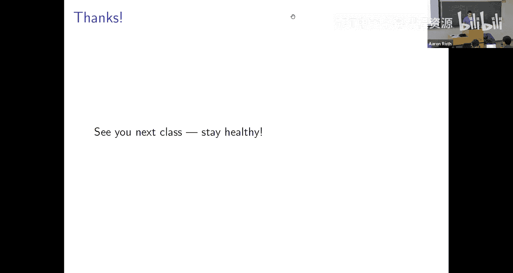

# 宾夕法尼亚大学《算法博弈论｜NETS 4120_ Algorithmic Game Theory 2023》中英字幕（deepseek-R1 p10 NETS 4120_ Algorithmic Game Theory, Lecture 10.zh_en -BV15kLRzTExU_p10-

This is one thing。

All right。Let's begin。So just taking stock of where we are， as is our habit。And we've been。f 你哋。

These different equilibrium concepts。嗯。And last class， we introduced two more。Okay， sort of maybe we。

Maybe we gave up。Okay。On ever being able to。defined an efficient dynamic that was going to converge to Nash equilibrium in every game and so we thought you know okay。

 why don't we define an even larger equilibrium concept and we defined two more or less class correlated equilibrium and coarse correlated equilibrium。

And。Why did we do that？The hope that we're going and the thing that we're going to follow through on this class is that。

The wind that we get by enlarging。Our idea of what a solution concept is in game theory of an enlarging sort of this concept of what a stable state might be in this case by explicitly allowing the correlation。

Of the randomness across different players。That we might actually sort of be able to fulfill this goal of having an efficient learning dynamic。

 a natural learning dynamic that in any game converges to equilibrium no matter you know what the structure is without assumptions on the structure without needing to say。

 well， you know， only if it's a congestion game more well， only if it's a zero sum game。Okay。

 so the goal will be to have like a concrete， efficient learning dynamic that converges to equilibrium in any game。

And。The caveat is that what we mean by equilibrium is not Nash equilibrium。

 but correlated equilibrium。Now。If you remember。When we studied。

Convergence of learning dynamics to equilibrium in separable end player zero sum games。We sort of。

Took this little detour， we sort of set the game theory aside for a couple of lectures and we just studied learning like how can you learn to select actions。

In some difficult adversarial environment in a way that guarantees that you do well。

 according to some。Natural class of benchmarks in this case， you know， you do well compared to like。

The best expert in hindsight。And the reason we did that was because。

If you've got a learning algorithm like that that can do well according to this benchmark without making any assumptions about where the losses are coming from。

 for example。It means that this is a learning algorithm that you can deploy in an arbitrary game or in a game where people really are you know strategizing。

 might be they might really be adversarial like they might be adversaries in a game。And so sort of。

Having abstracted away the game theory， we derived this learning algorithm。

 then we came back to game theory and we sort of showed okay。

 if everyone plays according to this learning algorithm in a separable zero sum game。

 we actually do get convergence to blue。So we're going to take the same kind of tact in this lecture。

Okay， if you sort of remember， we've defined。Orreated equilibriumria now in terms of a notion of regret。

Okay， so we're sort of set up。To be able to say， if we've got a learning algorithm that can guarantee that no matter what happens。

 this notion of regret is guaranteed to be small。Then we're in business。

're then we can sort of immediately say。If everyone plays according to this learning algorithm or anything similar that has the same regret guarantees。

 then we will have convergence equilibrium equilibrium。In this case， correlated equilibrium。

So that's the game plan for today we're going to remind ourselves of our sort of regret flavored characterization of correlated equilibriumria。

Then we're going to abstract away the game theory and we're just going to try to design a learning algorithm that has the guarantees that we need。

Okay。That。Makes sense， sound like a good plan。Not that there's anything you can do about it at this point。

 but like。Like to have you on board anyway。Okay。Okay， so so in fact like。You know， of like a warm up。

 we defined this notion of coar correlated equilibrium which was even weaker than correlated equilibrium but had the merit that the sort of regret characterization for a course correlated equilibrium was in terms of regret to the best fixed action in hindsight if we have a distribution over play profiles so that nobody has regret to any fixed action then that distribution is a course correlated equilibrium and that was really convenient because that's already what the polynomial weight algorithm guaranteed and so we had sort of you know as a one line application of this algorithm we already developed a quick convergence to this sort of weaker notion of course correlated equilibrium。

U。And then， you know， like looking forward to today's lecture， we。

Showed how to describe correlated equilibrium in a similar way， but in a way that sort of has has。

More demanding requirements on。What regret is it requires that there's no regret to sort of a larger class of benchmarks and we don't yet know how to。

Play a game to guarantee that that notion of regret is guaranteed to be small。

 that's what we do today。Okay， so let's just sort of。Remind ourselves of what we need to do。

It's like， first of all。What is a strategy modification rule？

A strategy modification rule is just some arbitrary， you know。

 think about it as like a backseat driver， it's some arbitrary mapping。From。Things you actually did。

 actions， the things you should have done。Okay， better act。Okay， and given an action profile。

 one that。Specifies how you and everyone else plays。

The regret that you have at that action profile to a particular strategy modification rule。Is just。

The difference between how well you could have done if you had let the backseat driver go back in time and change your rule like change your action like you know。

Map what you actually did to what you should have done， assuming everyone else。

Played in exactly the same way， the difference between sort of how well you could have done had that happened and how well you actually did。

Okay， so if you could have done better by applying one of these strategy modification rules。

 you have positive regret to that strategy modification rule。And we gave this sort of definition。

 this alternative definition of what a correlated equilibrium is， you know last class we defined。

 you know like an exact correlated equilibrium where this epsilon was zero。

 but here I'm going to define an epsilon approximate version。And it just says， look。

A distribution over action profiles。Okay， you know。

 encoded if you like as some signaling device like like a traffic light simultaneously giving you and everyone else suggestions about maybe what they should do。

It's a correlated equilibrium if。In expectation。Nobody has。

Regret more than epsilon to any strategy modification rule。Okay， so it's like， you know。You know。

 when the stop light says green， you're supposed to go when it says red you're supposed to。

Stop when it says yellow， you're supposed to go very slow。But you could do that。

 but like you could do other stuff too， like when it's green， you could stop and when it's red。

 you could go and when it's yellow， you could go very fast right like that's。

That would be the result of applying some strategy modification rule。

 mapping each of your actions to other things you should do。And we're saying you know a distribution。

Over suggestions， distribution of action profiles is a correlated equilibrium if you can't do better by doing that or any other strategy modification。

Okay。Questions about that because because we're gonna。For the rest of the class。

 we're going to like figure out how to like achieve this， so I want to make sure at this point that。

We don't have confusions about what this means。Yeah。对的。对。That's right。 So just like a。

 you know like a mixed strategy， Nash equilibrium， like what kind of object is or is not a N equilibrium。

 it's a collection of mixed strategies， one for every player。

 which in particular define a distribution over。Action profiles。Here。

 since we're allowing correlation like the object itself that either is or is not a correlated equilibrium。

 like is a distribution over action profiles。Okay， like a like a stoplight。

Embbodies a distribution over action profiles， it's like the uniform distribution over stop go and go stop。

Makes sense。Can I make it make more sense？也是。Yeah。嗯哼。Yeah。

Because the suggestion might not be deterministic like and in particular the relationship between your suggestion and mine might involve randomness right like in it might be that。

When the stoplight tells me to go， it tells you to stop only 75% of the time。

And that's important for me to understand when I'm like deciding how I should best respond。Okay。

 so just yeah you know， just like。It canWhen we're talking about Nash equilibrium can be helpful to randomize。

I let you mix between rock paper and scissors and rock paper scissors you know in other situations it can be too。

Good other questions。Yeah， the strategy modification for each plan change consideration or it。

It's fixeded sort of the definition right like there's no time going on here right like you know this distribution is or is not a correlated equilibrium and the way we tell is。

We look and we say， is there any strategy modification rule？

To which you have regret and if the answer is yes， it's not a correlated to equilibrium and if the answer is no。

 it is。Good questions， all others。嗯。Okay。嗯。Okay， so this is sort of。

Expected regret over a distribution。Now， if you sort of remember back to how we talked about convergence to Nash equilibrium and zero sum games。

You know， we started with this with like the polynomial weights algorithm that。

Is an algorithm for choosing actions over a sequence。

 so if everyone plays according to this algorithm， what happens is we generate a sequence of action profiles。

😊，And then we sort of。We talked about regret over these sequences and turned those into。

Distributions， you know， in the end how did we get like a mixed strategy N equilibrium from a sequence so we turned the sequence into a distribution by just you know randomizing over the sequence。

😊，Okay， so we're going to do the same thing here。 And so I'm going to like talk about。

Regret now over sequences of action profiles rather than distributions。And since we already did that。

 I'm going to have to sort of give more refined names right like when we were talking about the polynomial weight algorithm。

 we talked about sequences of action profiles that had epsilon regret。Well that kind of regret。

 which was just regret to the best fixed action or equivalently regret to constant strategy modification rules。

I'm going to start calling that external regret。And this new kind of regret。

 which is sort of regret to arbitrary strategy modification rules。

 I'm going to start calling this swap regret。Okay， what does it mean？

Today we've got a sequence of action profiles， A1 through AT。We say that。

The sequence of action profiles has。Regret epsilon， let's say。If。I can point to any player。

And I can choose any strategy modification rule for that player。And I find that。

If I look at the average payoff that player I actually obtained。

 just like average over this sequence， like his actual realized utility over this sequence。You know。

 I couldn't have improved it by more than Epsilon by， you know。

 like going in and performing surgery on this sequence and applying this strategy modification rule to his action every round。

Like if I look on the one hand at how well he actually did on average over the sequence。

On the other hand， how well he would have done in this fictional world where everyone else stayed the same and everyone else kept playing exactly the same way。

 but I applied the strategy modification rule every single day to every action profile in this sequence。

That。You know， like the improvement。Player I could have gotten。By doing that， said most epsilon。

Most this delta of t， if we say the sequence has regret delta of t， so we you know。

 maybe could have gained a little bit， but not much。And。

This is quantified overall all players and overall strategy modification rules。

 so simultaneously for all players and simultaneously for all strategy modification rules。You know。

 none of the players could have gained more than this delta T amount by applying any of the strategy modificationification rules exp post after the fact。

And the reason this is called swap regret。Is you can think of what a strategy modification rule is doing as swapping out one action for another。

Right， like in comparison， this is like a stronger guarantee than what polynomial weight promises。

 what polynomial weight promises is that。You will do you've done at least as well as the best fixed action in hindsight。

 saying you can't have done， you wouldn't have done better if you'd played action one every single day。

 or you couldn't have done better if you'd played action two every single day。What this is saying is。

You could go in and swap out any pair and swap any pair of actions you could say okay， well。

 every time I played action one I should have played action5 and every time I played action  two。

 I should have played action 12 and you can perform any one of those swaps。

 even all of those swaps simultaneously。And。You can't gain more than a little bit by sort of going and doing that。

 right。Regret to the best fixed action hindsight， the thing that polynomial awaits promises。

This is sort of。What you'd get by performing a really。Cour， you know， blunt swap。

 swapping everything out for like action one， everything out for the same action。

But a strategy modification rule can swap。Each action out for something else。

 each kind of action out for something else and what this notion of regret is asking for is that no sequence of swaps like that should。

In you。More than a little bit of utility。Yeah。谢谢。It。嗯。No， you're right。

All the As should have superscript tea Yeah we're summing over the。嗯。

The individual action profiles in this sequence。不是。不是。Yeah。No。

 it's a it's it's a fixed strategy modification rule。 So it's still the case， right。

 Like it's still too much to ask for that you。Every single day play the best possible action in hindsight for that day right so like you know again what every question you have can be answered by rock paper scissors。

 let's go back to rock paper scissors。It's too much to ask for that if I'm playing rock paper scissors against you。

 I literally win every single day。Right like if if I get to go back in hindsight and every single day say。

 okay， well， like today you played paper so I should have played scissors and you know tomorrow you played rock so I should have played paper and I got to really like change every single action in a different way。

In that case， I could have won every single day， but like obviously there's no there's no hope in sort of。

Designing an algorithm that would do that。So that's not what this is asking for。Right in。

That the kind of modification of a action sequence that I'd have to engage in to win every single day wouldn't be decribable by a strategy modification rule of this sort exactly because the strategy modification rule。

The rule can't change from day to day。So this is like I could consider a strategy modification rule that says。

 well， whenever you play rock， you should have played paper instead。

 but I can't consider one that says， well， this time when you played rock。

 you should have played paper， but this other time when you played rock。

 you should have played scissors like the strategy modification rule can map rock to scissors and it can map scissors to paper。

 but it has to consistently do that throughout the sequence。

So this is stronger than what polynomial weights guarantees， but not impossible。Yeah。正确。

What threat is an external regret。So right？😊，So external re is is what the polynomial weights algorithm guarantees。

And if you like。It is just swap regret， except like。

We limit the strategy modification rules to just be constant functions like suggest always output rock right so polynomial weight says。

 you know， you do as well as。If you had played rock every day。

What you do as well is if you had played scissors every day。This is saying。You know。

 you can't you know， that， but also you do as well as if you had every time you played rock。

 played scissors instead and every time you played scissors played paper instead。Good。Yeah。Okay。

Is there a。I think I missed some crucial word is the notion of what？Okay see。这个。嗯哼。😊，Yes。

Each action profile specifies a move for all of the players。

So like when I'm summing over these action profiles。Here I'm changing the action of player eye。

 but leaving the actions of all of the other players fixed， so this action。

 the sequence of action profile specifies also actions for the other players， not just player I。嗯。

Maybe I don't understand the questions， so this is just definedian as a condition on average utility it's saying on average your utility is at least as high as it would have been had you on average done this other thing。

Now you're right and we will do this。In a moment。You know。

 like if if instead of thinking of this as a sequence。

 I think of this as a uniform distribution over these action profiles。

 then my expected utility will be exactly equal to an average when we're going to。

Take advantage of that， but right now I'm just defining things for sequences。Okay。Questions。Okay。

 yeah， so external regret measured regret to the best fixed action and hindsight F regret is doing the stronger thing。

 it's measuring regret to this counterfactual in which。

For every kind of action like rock or paper or scissors。

 you can consider a world in which you swapped out every time you played that action for an arbitrary other act。

 you can sort of perform these swaps separately for each kind of action。Okay。

So let me now like observe， you know， basically a one liner， which is。

What Cole just pointed out to that。There's this direct correspondence between averages over sequences and expectations over distributions。

And。Because we have this definition of correlated equilibrium in terms of。

Swap regret in terms of distributions that have。No regret or epsilon regret to any strategy modification rule。

It is almost immediate that if we have。A sequence of action profiles that has regret swap regret Dlta of T the way we've just defined it。

Then。If I think of the distribution that is just。The uniform distribution over the T action profiles in this sequence if I just dump all of the action profiles in the sequence into a hat and my distribution is just pulling one of them uniformly and randomly out of this hat。

Well， then。This distribution will be a delta T approximate correlated equilibrium。Okay。

 and it's almost immediate。It's just， you know， like what is the definition of a correlated equilibrium？

The regret based definition we gave is that。If I sample an action profile from this distribution at random。

 and then for any strategy modification rule， consider my expected regret to the action profile that I pulled out of the hat and the strategy modification rule。

 it should be small。But what is my expected regret when my distribution is just。You know。

 the uniform average over you know the uniform distribution over these T action profiles。Well， you。

 an expectation， I'll just sum over the support of the distribution。m，You know。

And for every element in the support of the distribution， I'll multiply by。It's probability。

 which is just  one over t here。And I'll look at， you know， okay。

 what is my regret to that action profile？And I will note that this， you know。

 my expectation turned into just an average over the sequence。And well， by definition， right。

 this is just my， you know， this is upper bounded by my swap regrets。Over the sequence。

 that was just the definition of swap regret over the sequence， and so it's bounded by delta of t。

Okay， so there's very little。Going on in this statement， it's just sort of pointing out that。

 you know， if I have。Something that's true about an average over a sequence and then I just pick a day in that sequence uniformly at random。

 the average is now an expectation。Over that random selection。And。

Our definition of swap regret over a sequence is。It's exactly the same thing as our sort of definition of a approximatexi correlated equilibrium over a distribution。

We just need that there's no strategy modification rule that can improve over。In one case。

 the distribution， in the other case， the average payoff over the sequence。Okay。

 so there's this like direct connection， but you know， like the point is that。

What we're going to focus on is algorithms that guarantee diminishing swap regret in a sequential prediction setting。

 so if everyone plays according to these algorithms what will be generated is a sequence of action profiles that have。

Diminminishing swap regret as we've defined it。And。The reason we can say that this。

And these algorithms when played will converge in any game to correlated equilibrium is this。

 it's because if we look at， you know just think the empirical distribution over play。

If indeed the algorithms do what we want and have diminishing swap regret。

 then the empirical distribution over the play history will converge to an approximate correlated equilibrium。

 and it's because of this immediate connection。Okay， does that make sense？

So the point is now just we're going to focus on sequences but。

We shouldn't let that bother us because sequences。And distributions are kind of similar。Okay。So now。

 you know， let's again forget that we know anything about game theory and go back to。

Studying machine learning。Our goal is to design an algorithm that operates in sequential prediction setting。

 this is the same setting the polynomial weights algorithm operates soon that I'll remind you of on this slide。

And decide an algorithm that。or any sequence of losses that nature or an adversary might throw at us and crucially we make no distributional assumptions here because we don't want to make any assumptions that are going to be violated when we start using the algorithm we develop in an adversarial game。

We just want to come up with an algorithm that will guarantee that no matter what happens， we have。

Diminishing swap programs。So what's the setting？Well。It's a sequential prediction setting。 So again。

 we're operating in a， you know， in a world that has time right you know time will proceed in rounds from。

Little T is one to big T。And there's K experts again we're going to you know when we start thinking about using these algorithms to play games。

 we'll identify the experts with actions so if you want you can just think of the experts as actions in a game。

And every day， if you're playing this game， you've got to pick one of the actions or equivalently。

 you know the task of the algorithm is to pick an expert every day。

 like that's what it means to use the algorithm to play in a game every day it picks an action to play in the game。

And then after the algorithm。Picks an action。Well， it learns that every action experienced some loss。

In a game， the loss comes from the cost function in the game and the actions of the other players。

 but since we want an algorithm that would work in any game。

 we're not going to make any assumptions at all about what that loss looks like。

 just some loss every day we learn that you know every expert was every action was associated with some cost。

Okay， could be arbitrary and。The you know we chose one of the actions， we chose one of the experts。

 and so the cost experienced by the expert that we chose that'll also accrue to the algorithm。

 the algorithm experiences the cost， the loss of the expert that it chose。Okay， and so。

What we are going to be interested in is the cumulative loss of the algorithm。

 this will be when you use the algorithm to play a game， you know。

 the average utility or the average cost of the player who's using this algorithm is just the sum over time of the loss of the expert chosen by the algorithm。

🤧And。What we'd like to promise is that。Yeah， okay， so and so far， by the way right。

 this is exactly the setup of the polynomial weights algorithm and the polynomial weights algorithm has the guarantee that。

No matter what happens for any sequence of losses， the cumulative loss of the algorithm is upper bounded by the cumulative loss of any single one of the experts。

The loss of the algorithm is no more than the cumulative loss of expert one。

 it's no more than the cumulative loss of expert two and so on。

Now we're going to ask for something stronger in terms of arbitrary strategy modification rules。🤧嗯。

What we want is that。In the worst case， okay， again， assuming nothing about the sequence of losses。

Our algorithm should have the promise that the cumulative loss of the algorithm。

Is upper bounded by the cumulative loss of。The counterfactual world in which every day the algorithm rather than picking action AT had instead picked action FiI of AT。

For some strategy modification rule FI。Okay， so you can。

And we're just comparing ourselves to this counterfactual world where。

 you we let this strategy modification rule be a backseat driver and tell us what we should have done after the fact。

And still， we want that。You know， our algorithm should do as well as the best strategy modification rule in hindsight。

You know， maybe not exactly as well， there'll be some delta of T term。

 but we'd like our algorithm to be such that delta of t is some function that goes to zero with t so we can make our regret to any strategy modification rule as low as we want just by playing for long enough。

Okay， so this this is only a stronger thing to ask for than what the polynomial weights algorithm does right the polynomial weights algorithm promises our cumulative loss is no worse than the best fixed expert well that's just instantiated by a strategy modification rule that like no matter what suggests you play rock。

Okay， yeah。Best expert play the same。That's like the like when we're using the polynomial weights algorithm to play。

A game we're sort of identifying the experts with actions So like rock is one of the experts and you can think about this as yeah。

 like he's always whispering in your ear， play rock。

 play rock right Pa is an expert you could do something more general right like you could say， okay。

 like I actually have this like heuristic for how you should play rock paper scissors that actually looks at the history and suggest different actions and you could do that you could run polynomial weights with these different little algorithms as the experts and then polynomial weights would promise that you do as well as any of these little algorithms you could do that there you could do that here but。

Rather than just asking that we do as well as the best single expert。

 we're now asking that we do as well as the best sequence of experts that could have been realized by applying a strategy modification rule to the sequence of experts you actually chose。

But yes， it's a good point， actually conceptually。We've been thinking about。嗯。😊，Yeah。

 using polynomial weights to play a game and sort of the。Simplest possible way， just associating。

Actions with experts。But there's no reason you have to do that， right。

 like polynomial weight didn't make any assumptions about。

What the experts were right so if you had you know 20 different algorithms that you thought might be like。

Good strategies in some game you could you could just instant those could be arbitrarily complicated algorithms themselves。

 you could instantiate those as experts and polynomial weights would guarantee that you do as well as the best of them。

So you can make and also more generally for any online algorithm design problem right it's not just games so you can think of what polynomial rate rates really is as a way of。

Agregating different decision making processes of arbitrary sorts。

 okay you can think of it as combining algorithms， promising that your overall utility will be as good as the best of them in hindsight up to whatever the regret term is。

Okay， so's like that's a good point。Okay， so this is what we want to do。Questions。About the goal。

Yeah。喂。Yeah， so this is probably some abusive notation。So。What I a little oh sub T of one。

 what does that mean？So what I mean is that。The regret bound will be， you know。

 we prove will be sort of something that。Is a function of T。

 and I want whatever that function to be to be something that limits to zero as t gets large。嗯。So。

 you know。It's going to be something like1 over square root of T。In the end。Good question。

 other questions。Okay。So how might one do it， oh， yes？There was the birthday。Played a perfect game。

 essentially。So the expert， you know， like if you had an。

 if you had a subrtoutine that had the ability to read minds and。

Always suggest the right thing like somehow when it suggests rock like miraculously like indeed like I've played scissors。

 then the polynomial weights algorithm would let you do as well as that expert。

 but to run the polynomial weights algorithm you need access to the suggestions of the expert before the losses are realized so。

It might be very hard for you to implement the expert that plays a perfect game because of the mind reading。

Okay， but you can think of polymy weights as a reduction if you have code to implement any algorithm。

 given the information that you have at the moment that you sort of。

need the polynomial weights algorithm to elicit the predictions of the experts。

 which is before the losses are realized， then the polynomial weight algorithm is like this lightweight wrapper to make calls to these you know subroutines implementing the experts and do as well as the best of them。

And if you have a magic subroutine， the polyel weight algorithm will do magic stuff but。

The magic is coming， yeah。The magic's not coming from the polynomial weights algorithm。

 the magic's coming from the magic subr that you brought to the table， does that make sense？有。

If one of the experts was to play something。 and just by chance， it ended at me。

So we do it I won every game and。感是被。Sure， but that's sort of why。

You sort of expect to see like these log K terms in the regret bound so suppose you know what I'm trying to do is predict the outcome of a fair coin。

Maybe my experts themselves are just flipping coins。The chance that I that my coin matches。

Some other uniformly random coin every time will sort of go down like one over two to the K。And so。

IfIf I'm doing this with K experts， I expect this not to happen for any of them as soon as I have played for log K many rounds。

And that's sort of some intuition， maybe for why the log K shows up in the regret term。

 if the log K wasn't there， it would imply some impossible things like the ability to。

By just having my experts flip coins， you know can get the answer right every time for the first log k round because likely you know just just just because I was flipping so many coins you know one of them one of them did it the log k is what makes that impossible thing not be an implication of the。

Oh let me wait's guarantee， but it's like tight like if it was even a little bit smaller。

 the impossible thing would be possible。That make a little bit of sense。哦。嗯。That was a good question。

 other questions。Okay。So how。Could we possibly do this thing？So just conceptually。Okay。You know。

 say we've we've played out。This interaction for T rounds。

You know what is the strategy modification rule let us do it lets us say okay， well。

 you know every time you played some particular action J， you should have played some other action。

But it doesn't let us disambiguate between different times you played action J right like I can't say like okay。

 yesterday when you played rock， you should have played scissors， but today when you played rock。

 you should have played paper， it has to apply the same modification to any fixed action J。

And so it's going to be helpful to think about。These sets that I'll define as SJ。

Which are just all of the days for which you played action J。Like you've got these K actions。

 you played in some interaction for like t rounds and on some of the days you played action one on some of the days you played action two。

 so on and so forth that partitions the set of days。

 SJ is just the set of days on which you played action J okay， so if you've got K actions。

 you've got S1 S2 S3 all the way up through SK right？

Just just dividing up the days by which action you played on those days。Okay， make sense。

What a strategy modification rule can do is uniformly change the action you played on any one of these sets of days from。

 for example， J to something else like J prime， but it can't separately change what you did for different days in the same set。

Okay。And so like in particular。Like a strategy modification rule can sort of say， look。

Every time you played action J， you should have played action 12 instead。

So we can think about what would have happened。Had you played action 12。

 the same fixed action every single day。In this set of days， SJ。

 the set of days on which you played action J。And so。Because of that。

 when we sort of want to bound swap regrets， which corresponds to allowing us to assign。

A different action for each of these sets， a fixed action for S1， a different fixed action for S2。

 a different fixed action for S3。Like。It should be that any way of assigning actions to these sets doesn't improve。

Well， it's sufficient if on no single one of these sets。

 could I have done better by playing any fixed action every day within that set。Okay。

 a sufficient condition is if I look at my average utility。Over the days in SJ。

 my average utility amongst the days in which I played action J。

It's enough that I couldn't have improved by more than Delta t again， on average over this set。

By instead playing any other fixed action I。I can restrict myself to comparing to fixed actions。

When I'm averaging over the set SJ， because in this set SJ my actual play was uniform。

 I actually just played this one action J over and over again within the set SJ。

 that's how the set SJ is defined。And so a strategy modification rule， you know。

 its effect within this set has to be constant。Like it can say， well， instead of playing action J。

 you should have played action I。And so if I want no swap regret。

 it's enough that I have no regret to any fixed action within any of these sets SJ。Okay。

 because the sets SJ are just carving up space in exactly the same way that a strategy modification rule is forced to carve up space it can only。

It can only provide。Fixed。Suggestions I on any subset of days for which your actual play J was the same。

And so another way of saying this is that。We can achieve no swap regret。If。

We can achieve no external regret， no regret to just the best fixed expert。

Simultaneously on each of these sequences， SJ。No swap regret。

 is it just asking for no external regret？Separately and simultaneously on each of these sub sequenceequences。

S1， S2， the SK。Yeah。We don't because when we look at。Our overall swap regret。We will。Average over。嗯。

These sequences in proportion to how frequently we。Played them， right。

 So so like our what's going to be our overall regret。 Well， it'll be my regret on S1 weighted by。

The size of S1 over t。Plus， my regret on S2 weighted by the size of S2 over t。

What's my regret on S3 weighted by the size of S3 over t。Okay。

 so like the regret term will be sort of。You know， delta t plus the size of S1 over t plus the size of S2 over t plus the size of S3 over t and this is a partition of the space。

 so the size of s1 plus the size of s2 plus the size of S3 is T so we're just。You know。

Our overall regret is a weighted average of these regrets and the weight sum to one。

 so if we can promise delta T。External regret on each of these sub sequenceences。

 we have Delta T swap regret overall。Makes sense， good question。诶。第次说。Yeah。Yeah， so it's saying。

We should do as well as the best fixed action， what's the best fixed action that just means the one that has that minimizes loss yes we're minimizing over actions here。

Yeah。😊，现查上班。Oh no， no no， it's better be outside the sum right because this is the difference between like saying。

You could have done better by playing rock like every single day versus saying。

You could have done better like on Tuesday by playing rock because your opponent played paper。

 right but you're not allowed to make separate decisions。Every single day。Where're sort of。

Committing to a fixed strategy modification rule to apply to the whole sequence。就对啲嗯即食两拜日啦嗯。

It's applying to each there be a different eye of each setup。Exactly， but within a set SJ。

 a strategy modification rule can only propose a single action I。Okay。Good questions more。Okay。

So like。The best strategy modification rule in hindsight is sort of clear it just， you know。

 for every set SJ， it will swap J out for whatever was the best action in hindsight on that set SJ okay。

 that's what the best strategy modification rule will do。And so sort of like the。

To get some rough intuition about what we're going to try to do， although。

Said this way it doesn't quite make sense， we're going to have to figure out how to do it in a way that does make sense。

We sort of want to run k copies of polynomial weights， one for each of these sets， SJ。Because。

Plynomial weights guarantees no external regret。We just need no external regret on each of these k sets SJ and then we're golden so why don't we just run one copy of polynomial weights for each SJ and you know if。

On someday T， we find our and said SJ we'll just use the copy of polynomial weights associated with that。

嗯。J。The problem with that is that this is sort of like a self referential thing。

I don't know before I choose an action， whether today is going to be a member of， you know， set SJ。

 because the set SJ is the set of all days on which I play action J like until I choose an action。

 I don't know what set I'm going to be in。So it doesn't really make sense to like up front say okay。

 this is the version of polynomial weights i'm going to run on days for which I play action one。

 this is the set of polynomial weights， this is the polynomial weights you know copy I'm going to run on days for which I play action two because。

I don't until until I decide on the action， I don't know。

 I don't know what i'm going to do so that's。So this is some intuition for why we're going to want to run k copies of polynomial weights。

 there's sort of K external regret guarantees we want。

 but we need to solve this like self reference problem。Yeah。So here's a sketch of the algorithm。

 maybe let me draw a picture to try to。Give you some idea of what it looks like。

Even try or dry act in a place that's visible to the cameras。Although I think on the recordings。

 what I actually the actual video of me is tiny little postage stamp， so this is。

Mostly a joke if you're watching。Online you're not going to be able to see what I'm drawing。

 but at least you've got a fighting chance。And you don't have a fighting chance。

 but you can like try to zoom in。Okay。So we're going to have。Sort of some like。Meta algorithm。

 some algorithm that's sort of like a raper。And when it's a wrappper around。

Is K copies of polynomial waste， okay？All know the way， it's one。哦了没有。H me weights too。

Alllinnomial weights can， okay， sort of， you know。The rough metaphor is we've got one copy of polynomial weights for each check。

Okay， now ultimately our wrappper algorithm， right needs to operate in this expert setting。

So it's going to take as input。Every round。You know， like a loss vector。And。

It's going to output every round。A distribution over experts。Okay。

 that's the same input output behavior as the polynomial weight algorithm that's just the input output behavior you need to interact in this like online learning setting every day you need to。

Propo a distribution over experts that we will sample from right this is like the mixed strategy you'll play in the game and then you need to be able to do something with what you've learned about the performance of the experts。

 which is represented as a loss factor。Now these copies of polynomial weights that you're running。

 they think like you know you're sort of running them as simulations in the matrix。

 but like they think they're living in the real world。

 so they are expecting exactly the same kind of input output behavior。Right like。Every day。

Each of these copies of polynomial weights is providing。嗯。A distribution over experts。Okay。

Potenially different for each one of them， let's call it Q。Okay， and is expecting to be fed。嗯。

A vector of losses， one for each of the experts， so that it can update its internal state。ok。😊。

And so like in order to even make sense to like run an algorithm like this that you think of as you know。

 the algorithms interacting in the real world， it's running like simulations of these other algorithms they all have to be。

 they all have to be consistent and believable so that they don't realize they're just simulations。

There's two things we need to decide upon。嗯。First。How do we actually use the distributions proposed by each of these k copies of polynomial weights each of the K copies of polynomial weights is proposing that you place some distribution over the experts。

But potentially different ones and we the algorithm。

 need to somehow aggregate all of those to play like a particular distribution over the experts in the real world。

And then we， the algorithm， learn the actual losses for the K experts in the real world。

 but we need to figure out。What we should report to each copy of polynomial weights。

 maybe going to maybe we should report different losses to each copy of polynomial weight。Okay。

 and so。What this algorithm will do。Is。To the I copy of polynomial weights。

It will report the real vector of losses， but rescaled by P。

 the probability that the algorithm plays expert I。So when。

The algorithm picks an expert according to this distribution。P。And it receives this loss vector L。

What it feeds back to the first copy of polynomial weights is like。E1 T times LT。

But it feeds back to the second copy of polynomial weights is E2T times LT。

But it feeds back to the last copy of polynomial weights is EKT。Times LT。ok。Not clear why yet。

 but that's what it does。Okay， so just to like now go through the pseudocode。

We sort of spin up k simulations of polynomial weights， K instances of polynomial waves。

Every day polynomial weights does what it does， in particular it proposes a mixed strategy。

 a distribution over the K actions。Okay， potentially a different distribution over the actions for each copy of polynomial ws。

We need to aggregate these somehow and the sketch that doesn't say how we'll have to focus on that in a moment。

 we need to aggregate these k distributions somehow into a single distribution that we can choose in action。

Then after we。Play our mixed strategy， we learn what happened。

 we learn what are the losses for the experts。And。A sort of K simulations of polymial weights。

 they're expecting to hear what happened too。But we don't tell them exactly what happened。

For each copy of polynomial weights for each copy I of polynomial weights， we tell it what happens。

 we tell it the loss vector but scaled down by pi Okay， so we're now potentially telling。

Something different， we're giving a different loss vector to each copy of polynomial weights because the distribution we applied P might put different weight on different experts。

Okay。Okay， and so this is like almost a fully specified algorithm except。

I haven't yet told you how to combine the different distributions queue into a single distribution P。

But is the general framework of the algorithm clear？Yeah。嗯。What is the same what's different。

W one do。Yes， so。Let's see what PW used did he say？

Oh polynomial weights yeah so these are these are just copies of polynomial weights they're initially they're all the same initially they maintain like a uniform distribution over the experts so at day one they all propose exactly the same thing。

 the uniform distribution over the experts。😊，But after day one。

 the symmetry is broken because we are feeding different loss vectors to them after day one。

 and so polynomial awaits， updates its mixed strategy。

 its distribution over the experts as a function of the losses it gets。And so after day one。

 since we're giving different loss vectors to each of these。

 all of a sudden these copies of polynomial weights are diverging somehow。

 they've got different suggestions。And we aggregate those in a way that we haven't yet specified and then。

Feedback of the losses to polynomial weights as a function of our aggregated distribution。In order。

Thattures different from the second round。也是。It， I't know way algorithms I choose to get to。

It's because。TheYeah， for two reasons， I mean it's because first of all。

 our algorithm is putting different weights on different experts like the P is not going to be uniform and so。

You know， the what we feed after round one to the first copy of polynomial weights is like the loss vector but scaled down by the weight that we put on expert one。

 whereas what we feed to the second copy of polynomial weights is the loss vector scaled down by the weight of expert two。

 which is different。And as soon as we start feeding them different loss vectors。

They start diverging because now the weights maintained by these different copies of polynomial weights are going to be different。

Make sense。哦。Okay。So here's like a little bit of magic that will the reason for this will become clear as we analyze the algorithm。

But like here's were going here's how we're going to aggregate the。A， different distributions of。

The K different copies of polynomial weights into a single distribution。She。

So you can think about writing down like a matrix。We're the first column。Is the distribution？

But the first copy of polynomial weights puts over the K experts。The second column。

Is the distribution and the second copy of polynomial weights puts over the K experts。Okay。

 so on and so forth the last column is the。Distribution。

 the case copy of polynomial weights puts over the K experts。 This is a square matrix。

 It's a K by K matrix because。Each copy of polynomial weights is maintaining a distribution over k experts。

 and there's K copies of polynomial weights。We are going to take。B at P。

 our distribution P to be the top。Eigenvector of this matrix。Okay， or equivalently。嗯。

The steady state distribution。If you think about。This as。A process by which， you know。

The first copy of polynomial weights says okay， well， with probability， you know like two thirds。

 you should play action 5 at which point I switch over to the fifth copy of polynomial weights and follow its distribution to another copy of polynomial weights and I keep doing this forever。

 This is the steady state distribution of that Markov chain。Okay。

 if those words don't mean anything to you， don't worry about it like we don't。

We don't need to know in order to understand what comes next。

You don't need to know what a steady state distribution of a Markov chain is。

 you don't need to know what an eigenvector is。That's fine but。If you do know what those things are。

 that's where this comes from。 That's where this equation comes from。 And that's how we know that。

This is something sensible to ask for。Okay。But。If you don't know what those things are。

You don't need to。The point is。We have some particular way of aggregating。These k distributions。

 these K sort of。Proposed mixed strategies for each of these key different copies of polynomial weights into a single distribution。

 a single mixed strategy。And。This way of doing things has the following crucial property that I will tell you now。

 this is the crucial property of it， you don't need to know what an eigenvector is。

 you don't need to know what a steady state distribution of a Markov chain is。

It's something that you can。Understand just from staring at this equation。So if we choose experts。

If our mixed strategy at the end is going to choose an action according to this distribution P。

And we've defined P like this。There are two equivalent ways we can think of our algorithm as choosing experts。

Okay， and these two ways of viewing things that are going to be important in our analysis。

The first is what we're literally doing。Literally the definition of the algorithm is that。

At every round T we will choose each expert I with probability PT that is how the algorithm is defined P is the distribution on experts we are choosing PIT is the probability that we choose expert I。

Okay， so that's the first most straightforward way of viewing what's happening。

 that's like how the algorithm was defined。But what is PIC？Well。You know。

 what is the chance we pick expert J？Well， if I just look at this sum。It is the。

Supp I've viewed things the other way， suppose I said。Actually， what we're going to do is first。

 we're going to select one of these copies of polynomial weights。

And I'm going to select the I copy of polynomial weights with probability PiIT。

And then what I'm going to do is I'm going to delegate my decision to the I copy of polynomial weights。

 so with probability PiIT I will delegate my decision to the I copy of polynomial weights and I will then pick each action with probability proportional to the weight it has in QI。

 the distribution maintained by the I copy of polynomial weights。Okay， so。View number one。

 which is what's actually happening。I choose each expert with probability PI。View number two。

 which I claim is equivalent。With probability PI， I choose the Ithe copy of polynomial weights。

 and then I delegate my decision to the I copy of polynomial weights。

And I claim that these two result in exactly the same distribution over choices。

You can understand that by just looking at this。What is the probability I play expert I or like what's probability I play expert some expert J if what I'm doing is picking the I copy of polynomial weights and delegating my decision to it with probability PI。

Well。There's K different ways I could play expert J。

 I could have picked the first copy of polynomial weights， which happens with probability P1。

And then the first copy of polynomial weights could have played expert J that happens with probabilityq1 of J。

Or I could have picked the second copy of polynomial weights P2。

And then the second copy of polynomial weights would have had to play expert J that happens to probability Q2 of J。

or the third one or the fourth one， and my total probability of playing expert J would just be the sum of all of these terms。

 for each copy of polynomial weights， the probability that I pick that copy of polynomial weights times the probability that that copy of polynomial weights plays expert J。

And so because we've chosen P so that this identity holds。

I can equivalently view the algorithm as operating in either of these two ways。

 either just directly picking expert I with probability PI or picking the I copy of polynomial weights with probability PI and delegating the decision to that。

And it doesn't I can view the algorithm as doing either of these two things at any moment because they're exactly the same okay。

 so if it's helpful， I can shift my view from one of these to the other。Okay， is that clear？

This is the bit of magic in here， like the rest of it's going to be like a couple lines of algebra。

 The point is if we choose。Our distribution over experts in this particular way。

 this is how we aggregate the decision the proposals of these K copies of polynomial weights。Then。

Choosing each expert with probability PI or delegating my decision to the I copy of polynomial weights with probability PI。

 these are exactly the same algorithm。Okay。Yeah。It would like we're。

J the form Pi team by using Pi I team。What's it up between PJx and P？Yeah。

 so it is sort of a little bit of a， so P is a vector that has K components。Okay。

 so PJ is the JS component。And I'm saying the J component of the vector has to satisfy this。Equality。

 the right hand side of this equality has all k components of the vector on the other side。Okay。

 so like a prior you might wonder whether it's possible to satisfy this set of equalalities it is and the reason it is is because it's the top eigenvector of a stochastic matrix and。

Don't worry about it， but the upshot of all of that is just that it is possible to satisfy。

This set of equalities and in fact it' it's not hard to find it you just have to compute the top eigen vector of a matrix。

 but once you once you buy that there is a solution to this。

You can forget what an eigenvector is and you can， just， you know。If you buy this fact。

 then you're good to go for the next slide。Make sense。Okay。So。Let's finish it up。

Remember we've got these k copies of polynomial weights and they're kind of like languishing in this simulation right they're all like hooked up to the matrix by the way。

 I don't know like do any of you guys know what the matrix was like I guess it's like from your perspective this old like silent movie that probably came out in black and white like a 1950s or something I think of it as like a recent film anyways。

From the perspective of like the I copy of polynomial weights like living in the matrix。Right， like。

What it's receiving every day。Are the vector of losses？You know， scaled down by PI。

And what it's playing every day is the mixed strategy defined by its weights QI。

And we can apply the polynomial weights。Regret guarantee to the sequence of losses it is receiving and the choices that it is making。

So what does that， you know， guarantee tell us it tells us something about the accummulative loss of the I copy of polynomial weights as perceived by the I copy of polynomial weights。

So what is the cumulative loss of the I copy of polynomial wing so it's just the sum over you know the sum over at round T。

 it's the sum over of the actions。Of the probability that it plays action J。

Times the loss that it perceives if it plays action J， which is the real loss scaled down by PI。

Since。The loss for every single one of its actions is scaled down by PI。

 we might as well just pull the PI out。And so the cumulative loss of the I copy of polynomial weights。

Is just the cumulative loss we would have experienced in the real world had we followed the suggestions of the I copy of polynomial weights every single day。

 chosen according to this distribution QI every single day， except scaled down by PI。And。What？

The polynomial weight guarantee tells us is that。The I copy of polynomial weights does as well as the best fixed expert would have done。

Given the losses it's receiving。Okay， so on the one hand。

 the cumulative loss of the I copy of polynomial weights。

 just this expression here summed up over all of the days。

 the actual sort of experienced loss of the I copy of polynomial weights。嗯。Is upper bounded。

By the sort of。Loss of the best fixed expert J Star。

Given what the I copy of polynomial weights thinks is going on。

 which is that the mo of the best fixed expert J star is scaled down by PI star。

So this is just the polynomial weights theorem we proved。

 applied to the view of the I copy of polynomial weights here。So。

This is true we have this inequality for each copy of polynomial weights。

Like we're running K off these of polynomial weights and each of them has the guarantee we proved a few weeks back。

And so。The sum over all of the left hand sides for every copy of polynomial weights will be less than the sum over all of the right hand sides for every copy of polynomial weights。

So let's sum up the left hand side。Okay， so I'm just taking。This expression。

And I'm thumbing up over the K copies of polynomial weights。And now what is this。

 want this is where I want to use our two views of how the algorithm might work。

This is the loss that would be experienced by our algorithm if at every day what we did is with probability PI。

We selected the I copy of polynomial weights。And then delegated our decision to the I copy of polynomial weights and played each of the actions J with probability QIJ。

This is just the expected loss of the algorithm if that's how we view it as operating first picking a copy of polynomial weights according to this distribution P and then sampling according to the。

According to the I copy of I await it's according to QI。

But we know that that algorithm is the same as the algorithm that just straightforwardly picks expert J with probability PJ。

So to this left hand side， we can actually rewrite it as the loss of the algorithm in this more straightforward view。

Where we're just summing up overall time and then we're just picking each expert J with probability PJ in which case we experience loss LJ。

Right， so when we sum up the left hand side。Of this expression over all of the copies of polynomial weights。

All we get is the average loss of the algorithm。Okay。

 and here we've used this sort of two ways of viewing。

What the algorithm is doing that sort of follows from this weird way。

 we decided to pick this distribution P。Okay， but the upshot is just。

When I sum up over the left hand side of this expression over each of my copies of polynomial weights。

In the end， I just get the average loss of the algorithm， this thing that I want to bound。

What's it bounded by， while it's bounded by the thumb of the right hand side。

 summed up over all of the experts。Okay now。Remember。

For every copy eye of the polynomial weights algorithm。

 the promise is that we do as well as the best fixed expert J star。

We do as well as any expert J star。But which expert J star we choose to compare to， well。

 we can choose a different to J star for every copy of the polynomial weight algorithm because the。

Guarantee if the polynomial weights algorithm is applied separately to each of these k copies。

And so in particular。If we've got some strategy modification rule in mind。For each copy I of the。

Alannomial weight algorithm， we might as well decide that the particular J star that we're going to compare to in this bound up here is F of I because we could choose any J star。

 why not F of I？And so when we do that and we just sum up over the right hand side。

We get taking the exact same expression here， but now summing up over the K copies of polynomial weights and instantiating J star for each copy with F of I。

We get that the right hand side is just equal to。The expected loss。

For the sequence of actions that was played after the strategy modification rule was applied。

And where our regret term was previously root log k over t。

 well we've picked up an extra factor of k because we just summed over and we just summed up。

Kay copies of this regret term。ok。And so in combination， we get that the loss of our algorithm。

 no matter what the sequence of。Los vectors was the cumulative loss of our algorithm。

And not be any larger than the cumulative loss our algorithm would have experienced had we gone back and applied any strategy modification rule。

Except by this sort of term that。Goes to zero at a rate of one over root t。Okay， and now like K。

Root log K。Over T， over rootee。Okay， so summing up。This algorithm， which。Is efficient， you know。

 like it's just like。We just have to run k copies of the polynomial weights algorithm， this thing。

Promises that no matter what happens for any sequence of losses， it guarantees swap regret。

 not now not just regret to the best fixed expert， but swap regrets that goes to zero。

 the longer we play this thing。And so in particular。If we use this to play in a game。

That's one way of generating losses。We still have the swap regret guarantee。If everyone else？

All of our opponents also use this algorithm in the game。

Then they too will have this swap regret guarantee。And when we just see what happens when we sort of。

Let the game play out， we will inevitably generate a sequence of action profiles。

But has the no swap regrets property。And therefore。

 the empirical play will converge to correlated equilibrium。Okay。

 so we now have an efficient learning algorithm such that as people use it。

We get convergence to equilibrium， correlated equilibrium in any game。

 and we have assumed nothing about the game。Okay。And so it's like a decentralized dynamic the players it's not like you need to like load the game into your supercomputer and like run this thing right like everyone can play this algorithm without knowing anything about the game ahead of time。

Like the only thing you need to， just like playing the polynomial weights algorithm。

 the only thing you need to know to be able to play this algorithm are the actual。

Realized losses for。The actions in the game as you play them， you don't need to know sort of。

What would have happened in？Different action profiles you've never seen before。ok。

And this sort of solving， right we know we get to epsilon equilibrium when our regret is less than epsilon。

Well， what we find is that we can reach correlated equilibrium。

Epsilon approximate correlated equilibrium after a number of time steps that grows now quadraically in the number of actions in the game。

Okay， it's a bit worse than course correlated equilibriumlibria。

 which grew only logarithmically in the number of actions in the game。

 but grows quitedraically with the number of actions in the game。

 but is still independent of the number of players。

So if the number of actions in the game isn't too enormous， even if the number of players is。

 we actually get extremely fast convergence to correlated equilibriumria in arbitrary games。Okay。

 so not only， you know， we've as we've expanded out。

 our definition of equilibrium from pure strategy to mixed strategy to correlated equilibrium。

By the time we get to correlated equilibriumria， we have a solution concept that is not only guaranteed to exist in all games。

 but is easy to find。Okay， that's it， I'll see you next class。Don't get COVID。Yeah。

应该有。This。like the same as problem。