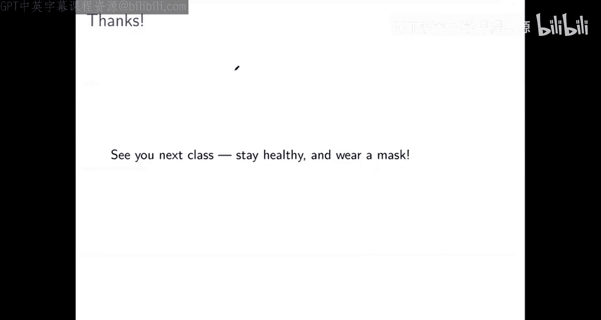

# 算法博弈论：第12讲：机制设计入门与房屋分配问题 🏠

在本节课中，我们将从博弈论转向机制设计。我们将学习机制设计的基本概念，并通过一个具体的“房屋分配问题”来理解如何设计一个既高效（帕累托最优）又能激励参与者诚实报告偏好的机制。

---

## 机制设计：逆向博弈论 🔄

上一节我们介绍了博弈论，即分析在给定游戏规则下，理性参与者会如何行动。本节中，我们来看看机制设计，你可以将其视为“逆向博弈论”。

在机制设计中，我们面临的情况是：
*   我们知道参与者的**最终效用函数**（他们关心什么结果）。
*   但游戏的**规则**（参与者的行动集，以及行动如何映射到结果）尚未定义。

机制设计的目标是：**设计游戏规则**，使得当参与者按照我们预测的理性方式行动时，能够实现我们设定的目标（例如，达成一个“好”的资源分配结果）。

---

## 房屋分配问题：模型与目标 🎯

我们从一个简单但重要的问题开始：房屋分配问题。这个模型后来被应用于现实中的肾脏配对交换。

**问题模型如下：**
*   有 `n` 个参与者，每人初始拥有一件物品（例如一座房子），记作 `H_i`。
*   每个参与者对市场上所有的 `n` 件物品有一个**严格的偏好排序** `≻_i`。例如，`H_j ≻_i H_k` 表示参与者 `i` 更喜欢物品 `j` 而非物品 `k`。这个排序也包括参与者自己的物品。
*   我们的目标是设计一个**算法**（机制）：
    1.  **输入**：每个参与者报告的偏好排序（可能不真实）。
    2.  **输出**：一个重新分配物品的方案（匹配）。
*   这个算法定义了一个**博弈**：
    *   **行动集**：每个参与者可以报告的任何偏好排序。
    *   **结果与收益**：根据所有人报告的偏好，算法输出一个分配方案，参与者根据其**真实偏好**获得相应物品，从而得到效用。

我们的目标是设计算法，使其诱导的博弈满足两个关键属性：
1.  **帕累托最优**：算法输出的分配方案应该是“好”的，即不存在另一种能让所有人都不变差、且至少让一个人变得更好的方案。
2.  **占优策略激励相容**：对于每个参与者，无论其他人报告什么，**如实报告自己的真实偏好**都是一个占优策略。

---

## 为什么需要激励相容？🤔

你可能会问：如果算法试图根据报告的偏好给出好结果，为什么参与者还要撒谎？

以下是机制设计与算法设计的关键区别：
*   **算法设计**：假设输入是给定的、正确的，目标是产生高质量的输出。
*   **机制设计**：输入是由**策略性参与者**提供的，他们可能为了自身利益而**误报**偏好。

如果我们只设计了一个能根据**输入**产生高质量分配（如帕累托最优）的算法，但参与者有动机撒谎，那么：
*   算法解决的可能是基于**虚假报告**的问题实例。
*   最终产生的分配方案，对于参与者**真实的偏好**而言，可能质量很差。

因此，机制设计必须确保参与者**有动机诚实报告**，这样我们基于报告得到的“好”结果，才真正对应于真实世界中的“好”结果。

---

## 顶级交易圈算法 🔄

以下是为解决房屋分配问题而设计的“顶级交易圈”算法。

**算法步骤：**
1.  初始化：所有参与者和物品都在市场中。
2.  当市场中还有参与者时，重复以下步骤：
    a.  构建一个有向图：每个仍在市场中的参与者作为一个节点，并画一条指向他**当前最喜爱**的物品（即该物品所有者）的边。
    b.  在这个图中，**必然存在至少一个环**（因为每个节点都有一条出边，在有限节点中沿着边行走必然会遇到重复节点）。
    c.  **执行交易**：找到任意一个环，按照环的顺序进行物品交换（即每个参与者获得他刚才所指向的物品）。
    d.  **移除**：将本轮中所有达成交易的参与者（即环上的参与者）从市场中移除。
3.  当市场清空时，算法结束，分配完成。

**算法示例：**
假设有5个参与者，偏好如下：
*   参与者1：`H2 ≻ H5 ≻ H3 ≻ H1 ≻ H4`
*   参与者2：`H3 ≻ H1 ≻ H2 ≻ H4 ≻ H5`
*   参与者3：`H1 ≻ H4 ≻ H2 ≻ H5 ≻ H3`
*   参与者4：`H1 ≻ H5 ≻ H3 ≻ H4 ≻ H2`
*   参与者5：`H4 ≻ H1 ≻ H3 ≻ H5 ≻ H2`

**第一轮：**
*   参与者指向：1→2, 2→3, 3→1, 4→1, 5→4。
*   发现环：1 → 2 → 3 → 1。
*   执行交易：1得H2，2得H3，3得H1。移除参与者1,2,3。

**第二轮：**
*   剩余参与者：4, 5。剩余物品：H4, H5。
*   参与者指向：4→5 (H5是4在剩余物品中最喜欢的)，5→4。
*   发现环：4 → 5 → 4。
*   执行交易：4得H5，5得H4。
*   最终分配：`(1:H2, 2:H3, 3:H1, 4:H5, 5:H4)`。

---

## 算法性质分析 ✅

现在我们来分析顶级交易圈算法的三个关键性质。

### 1. 帕累托最优性

**定理**：顶级交易圈算法对任何输入的偏好报告，总能产生一个帕累托最优的分配。

**证明思路（反证法）**：
1.  假设算法产生的分配 `μ` 不是帕累托最优，则存在另一个分配 `ν` 帕累托优于 `μ`。
2.  考虑算法第一轮被清除的参与者（他们获得了自己全局最喜爱的物品）。在 `ν` 中，他们不可能得到比这更好的物品，因此他们在 `ν` 中必须得到与 `μ` 中完全相同的物品。
3.  同理，考虑第二轮被清除的参与者。他们获得的是在第一轮物品被移除后，自己最喜爱的物品。由于第一轮参与者的分配在 `ν` 中已固定，这些参与者也无法在 `ν` 中获得更好的物品（他们最喜爱的物品可能已在第一轮被分配且无法变动），因此他们在 `ν` 中的分配也必须与 `μ` 相同。
4.  以此类推，通过归纳法可以证明，每一轮被清除的参与者在 `ν` 和 `μ` 中的分配都完全相同。
5.  这意味着 `ν` 和 `μ` 是同一个分配，与 `ν` 帕累托优于 `μ` 的假设矛盾。因此，`μ` 一定是帕累托最优的。

### 2. 个体理性

**定理**：顶级交易圈算法是**个体理性**的，即每个参与者最终得到的物品，至少不差于他最初拥有的物品。

**证明**：
在算法的每一轮，每个参与者都指向当前剩余物品中自己最喜爱的一个。由于参与者自己的物品始终在市场中（除非他被清除），因此他指向的物品要么优于自己的物品，要么就是自己的物品。他最终获得的正是他某轮所指的物品，故结果不会差于他自己的初始物品。

### 3. 占优策略激励相容性

**定理**：在顶级交易圈算法中，如实报告偏好是每个参与者的占优策略。

**证明思路（关键直觉）**：
我们可以将算法动态地视为：每一轮，参与者都被要求“指向”当前最喜爱的剩余物品。
*   定义一个参与者在某一时刻的**可选集**：如果他此刻指向某个物品，能立即形成一个包含他自己的环，从而获得该物品，那么该物品就在他的可选集中。
*   **核心洞察**：一个参与者的可选集只会**随时间扩大或保持不变，而不会缩小**。因为可选集中的参与者和物品，只有当他本人被卷入一个环时才会被移除市场。
*   这意味着，**不存在“机不可失”的情况**。如果参与者最喜欢的物品当前不在可选集中（例如，因为很多人竞争），他无需急于在可选集中选择一个次优物品。他可以耐心等待，因为：
    a.  当前可选集中的物品未来仍然可得。
    b.  未来可能有更优的物品进入他的可选集（例如，当持有他次优物品的人，其最喜爱的物品被移除后，可能会指向他）。
*   因此，最优策略就是始终指向当前真实最喜爱的物品。这个策略可以通过向算法**如实报告完整偏好**来实现。所以，诚实报告是一个占优策略。

---

## 现实应用：肾脏配对交换 🩺

房屋分配问题不仅是理论模型，更是**肾脏配对交换**系统的核心。
*   **背景**：许多患者需要肾移植，有亲属愿意捐献，但可能因血型或组织不兼容而无法直接捐赠。
*   **问题**：如果患者A的捐赠者与患者B兼容，患者B的捐赠者与患者A兼容，他们可以通过交换受益。
*   **挑战**：法律禁止器官买卖，因此无法用货币构建市场。
*   **解决方案**：构建一个**以物易物**的交换市场，患者-捐赠者对作为参与者，肾脏作为物品，兼容性决定偏好。顶级交易圈算法被用于实际匹配，每年拯救成千上万的生命。

---

## 总结 📚

本节课中我们一起学习了：
1.  **机制设计**是逆向博弈论，目标是通过设计游戏规则，使得理性参与者的自私行为能达成社会合意的结果。
2.  **房屋分配问题**是一个经典的机制设计模型，参与者带着物品进场，希望通过交换获得更喜爱的物品。
3.  **顶级交易圈算法**通过迭代地寻找并执行交易环来解决该问题。
4.  我们证明了该算法具有三个理想性质：
    *   **帕累托最优**：总能产生一个无法使所有人同时变得更好的分配。
    *   **个体理性**：参与者不会因参与交换而受损。
    *   **占优策略激励相容**：诚实报告偏好是每个参与者的占优策略，这确保了机制输入的真实性。
5.  该算法在**肾脏配对交换**等现实世界中有重要应用，展示了机制设计的强大力量。

从下一讲开始，我们将继续深入机制设计领域，探索更多复杂而有趣的问题。