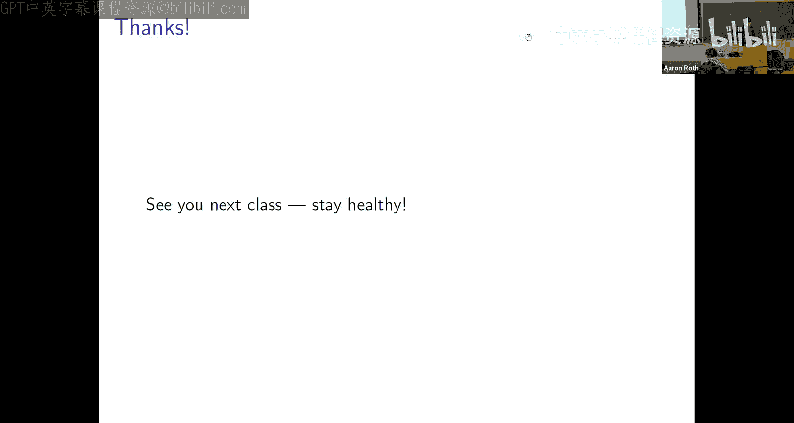

# 宾夕法尼亚大学《算法博弈论｜NETS 4120_ Algorithmic Game Theory 2023》中英字幕（deepseek-R1 p13 NETS 4120_ Algorithmic Game Theory, Lecture 13.zh_en -BV15kLRzTExU_p13-

All right。

Hopefully everyone learned about。Preto optimal exchange without money and operating cycles algorithm。

 last class。U。Just to maybe yeah start with a couple and stuff。

 you know everyone knows the midterm is Thursday I've posted a practice midterm。On Piazza。

 I'll post the solutions tonight so should give you some ideas like。What kind of object a midterm is？

嗯。So any questions about that kind of stuff？Otherwise。I'll keep going。So last lecture。

 which Natalie gave。This was sort of。The first lecture in what I would describe as like the mechanism design portion of the class rather than the game theory portion of the class so at a high level when we were studying for the first half of the class right we were sort of。

Trying to come up with。三。Family of models to try to。

Predict what people are are going to do when we put them in a strategic interaction and they've got particular rules they've got to follow on particular incentives and then。

Sort of in broad strokes mechanism design is sort of saying okay we've got some theory for what people are going to do in strategic interactions let's think about if we as the mechanism designers have goals how we can set up the strategic interactions so that what they will naturally do is what we want so for example if what we want is to arrange for a Pareto optimal allocation where people can you know misreport their preferences then the top trading cycles the algorithm that you guys saw last class accomplish that right like in specifying an algorithm it induce a game。

 the action space of the game was the set of preference orderings you could report to the algorithm the algorithm。

You know， that was the object that induced the mapping between。Your actions。

 your reported preference orderings and the outcome who get switch kidney and。

And you know you have a you have preference ordering so you have preferences over outcomes and the nice thing about the top trading cycles algorithm was not only was it a good algorithm。

 not only did it find efficiently preto optimal allocations for the preferences that were actually imported to it。

 but it actually it sort of incentivized in dominant strategies that people should。

Truthfully report their preferences right， so that's the thing about like mechanism design rather than just algorithm design。

It's not enough to find a good solution with respect to the inputs you're given because the inputs you're given might not be the real inputs if people are being strategic。

 like your goal is to find a good solution with respect to the real inputs。

 and so you simultaneously have to figure out how to find a good solution with respect to the inputs you're given。

 but such that people are incentivized to give you the correct inputs。Okay。

 and so sort of the top trading cycles algorithm， that was sort of a first anecdote in this area to figure out how to do that for crto optimal exchange。

Okay，One special thing about sort of the exchange setting from last class is that it did not involve money。

Okay， so。money turns out to be super useful and starting starting next lecture after spring break。

 we're going to start thinking about mechanism design and settings that involve money and auctions and there's lots of stuff we can do there。

 but what I want to do this class is sort of revisit。

A problem that I'm sure you've encountered before， maybe like in an algorithms class。

 sort of the stable matrix problem， but sort of。Think about it through you know through our new lens。

 not just as an algorithm design problem， you know， given preferences。

 how do you find a stable matching， but sort of think about it。

With sort of our mechanism design hats on first of all。

 you know like how do you find a good stable matching and you know I want everyone to think about whether the mechanism we give makes it a good idea。

 makes it incentive compatible for you to report your true preferences or whether you could misreport by gaming and whether it matters sort of what part of the know what side of the mechanism。

You know you're on so yeah so that's the agenda for today you know like we'll start off with familiar stuff for everyone who's seen stable matchings。

 but hopefully there'll be some new stuff too。Um， as a show of hands。

 who has seen like stable matchings in some form before。Lots of people。

 I think this is like probably something you do in like 121 or something。maybe。

SoWe' use a new numbering system now， 1，210， we've added zeros。Okay。嗯。Like inflation。Okay。嗯。😊，Okay。

 so like what are staple matchings about， there are about two sided matching markets and you know when Gail and Chapley wrote。

Their original paper on stable meshings， they were talking about marriage markets。

 so the two sides of the market were men and women。

But that's not cool to talk about anymore it's too heteronormative so so we don't talk about men and women anymore we're going to talk about students in schools and actually that that is you know like。

It's not just that marriage between men and women is too heteronormative it's that we don't run centralized markets for marriage like that's not how dating actually works。

 but this we'll talk a little bit about this we'll talk like this actually is used for matching medical school graduates with their residencies so this is a better application area for a number of reasons。

But the point is there's two sides of the market， okay， let's say students in schools。And。

They mutually have preferences over the other side of the market。Okay。

 so students have a ranking over like say the medical schools they'd like to do their residencies at。

 okay， like maybe I。For whatever reason prefer Harvard medical school over Indiana state and the the schools also have preference orderings over the students okay so I you know I want the students who。

Got good grades in medical school and went to good medical schools okay so two sides of the market that have preferences over the other。

 but it's like important that it's a bipartite graph here like I can't match a student to a student or a school to a school。

😊，And so for simplicity。We will assume in this lecture that。

Each school has exactly one slot for a student we match one student to one school and vice versa but that that part's actually like really for simplicity that's not necessary everything we say will sort of generalize very easily to the setting where each school has multiple slots maybe pen medicine gastroenterology has。

Six slots for like six residents or whatever okay so still you can't match a student sorry you can't match a student to more than one school but you can match a school to more than one student everything we say today will generalize very easily to that case but just for sort of simplicity will imagine this is a one to one match which means every medical school wants exactly one resident for example。

Um， and。不。Again， we'll try to find a solution that doesn't use money。Okay， so like can。

And sort of this sort of medical school residency problem is where this is really used as an example of that。

 of course residents are paid， but the salary is not what is used to clear the market。Right。

And similarly， matching students to schools。Pen is very expensive， but。

The tuition is not what we use to clear the market it's not like what's happening at Penn is we hold an auction and just raise the price of tuition until exactly you know the number of until the thousand0 slots or whatever the 2000 slots in the freshman class until we don't just raise the price until there's only 2000 applicants。

Okay， you could， right that's how lots of markets work， but it's not how schools typically work。

 right？So if you think of college admissions， that's another setting where students have preferences over schools。

 schools have preferences over students， and even though money is involved， there's tuition。

 money is not what we use to perform admissions。Usually。Okay。Okay， and the Gail Shapley algorithm。

 which we'll probably seen before and we'll see again。This lecture。

 it is used like in real life in various places， so it's used to match medical students to their first residencies。

 I understand it's used to match pledges to sororities。

 it's used in cities like New York City to match a public school students to public schools。有。Okay。

So remember we're talking about schools and students。

 I will abbreviate schools with M and students with W。Okay， so we've got these two sets。

Of sortrt of players in this game， really。嗯。Of two types， AmA schools， that are students。And。

Let's assume again just to for simplicity to make the math work out nice that there's the same number of each。

 although again this will generalize to settings where it's not okay。

 but for now you know you know we've got in students and schools and every school wants exactly one student and so you know like what we're looking for is an assignment of schools to students that will。

That will satisfy the demand for every school and every student like basically the difference is if there's。

An imbalanced market， some the short side of the market say there are more schools than students。

 the short side of the market will have to have some schools unmatched。Okay。

 so it's very easy to generalize all of the algorithms we're going to talk about to that case。

 but just to make life nice， let's imagine that the market is balanced。Okay， and。

What we're trying to do is we're trying to， and you know so far we're just talking about like the algorithmic problem that you will be familiar with。

We're trying to find a matching。So。What's a matching， well。

 it's just an assignment of schools to students and vice versa so that every school is matched to exactly one student and every student is matched to exactly one school。

Okay， so you can think about it it as yeah the some function can take as input a school or a student。

 it'll also output a school or a student， if it takes us input a school， it'll output a student。

 if it takes us input a student， it'll output a school。😊。

And what we want and it's like symmetric so for like consistency if I've got a school and a student and my matching function says school M is matched or sorry student M is matched to school W。

 it should also be that when I ask it what is school W matched to it should say student am。😊，Okay。

 so it's just。Mu here is just the function that tells you what each student or school is paired with in the matching。

 and a matching is just an assignment of schools to students so that every student is assigned to exactly one school and every school is assigned to exactly one student。

Okay， does that make sense？Questions about the basic setup。Okay。Okay。

 so so far you know we could assign any student any school， what do we care。

 but the students care and the schools care so。😊，The way we're going to model that is sort of the same way we modeled preferences over goods in the exchange problem last lecture。

Okay， so。Students will have。Orinnal rankings okay we won't think of them as having like utility functions we could。

 but we won't think about them as having utility functions mapping schools to like numbers how happy you are with Harvard compared to how happy you are with Yale instead students will just have preference ordering so you' you'll sort of every student M will just have a ranked list ordering of schools Penn at the top then Harvard then Princeton and Yale so on and so forth。

Similarly。Every school has a strict preference ordering over the students。So， again。

We're not modeling schools as having cardinal utility functions。

 it's not like you know you are a value 0 to92 students and I am a value 083 students they're not assigning real numbers like a utility function would it's just a ranking okay so the schools read all the applications or whatever and they just order the students in their rank order preference which is represented by this preference ordering and you know it's not like every student has to agree on the ordering of schools or vice versa like every student might have their own idiosyncratic ordering over schools and every school might have their own idiosyncratic ordering over students。

Okay， makes sense。Okay。And there's sort of two things we want when we want to design like a mechanism。

嗯。So first of all， like we'd like to find。A matching that is good in some sense。 Okay。

 that's sort of like the algorithmic problem。 find a good matching。And。You know。

 cognizant of the fact that we're doing this in a strategic environment that you know。

 like when the medical school matches run， right like？

Like there's literally a centralized mechanism that's run and you know you submit your ordering over schools to it and then on match day someone presses a button and it says what school you're going spend the next couple of years at doing your residency you know that's a big deal right you're going to like move somewhere it's going to affect your future career so to the extent that you have any ability to game the system and you know misreport your preferences to try to get a better residency you've got every incentive to do so。

And so。We don't want that to happen because。If everyone's trying to game the system to greater or lesser degrees of sophistication。

 then we could find a great matching according to the reported preferences。

 but find a terrible matching with respect to the real preferences because reported preferences would not be equal to the real preferences。

嗯。Okay， so like what we'd like to do is to come up with an algorithm that can simultaneously find a good matching whatever that means。

 but in a way good matching whatever that means with respect to the reported preferences。

 but in a way so that students are actually incentivized to report truthfully。

Their preferences so we can therefore you know have some confidence that the reported preferences are the true preferences and therefore that when we found a good matching with respect to the reported preferences。

 it's actually a good matching with respect to the real underlying preference。Okay。

 so this is sort of the same general philosophy from sort of last lecture where we talked about。

Pray to optimal exchanges， but I think it's worth dwelling upon this is like the key thing in like mechanism design and how it differs from algorithm design it's like not enough to find a solution that is good with respect to the reported preferences if you're in a strategic environment where。

The reported preferences might not reflect reality。

You need to additionally have some reason to believe that the reported preferences reflect reality。

 and one way to do that is to arrange the incentives so that nobody has any incentive to misreport their preferences。

Okay， does that make sense in general？Okay。U。All right， and just to sort of like。嗯。Foreshadow。

 you know like。So last lecture when we talked about。The top training cycles。

 algorithm and pre to optimal allocations， you know， we were able to。

Hit it out of the park we could find like a Pareto optimal allocation and it made a dominant strategy for every。

Forever。Participant to truthfully report their preferences。

Things are going to be a little more nuanced for the stable matching problem。Okay。

 as we're going to see。You know， in some sense， we're going to be able to find good matchings in a very strong sense。

 like like。Like it's not going to just be that we can find Pareto optimal matchings you're right remember Parareto optimality means okay like I can't strictly improve for everybody like you know maybe I can improve for some students but only at the cost of making things worse for other students we're going to be able to find good matchings in sort of an implausibly strong sense we're going to be able to find what is。

Simultaneously the favorite stable matching for every single one of the students。

 it's not even clear that that should be possibly a priori， but we will be able to do it。嗯。😊。

But we'll be able to do it。Only while incentivizing one side of the market to report their preferences truthfully。

So we'll be able to rig things up so that。The students have no incentive to lie， but if we do that。

 the schools might have incentive to lie。And we'll be able to rig things up so that the schools have no incentive to lie。

 but if we do that the students might have incentive to lie and on the next homework you'll prove that this is unavoidable that sort of there's no way to find stable matchings that incentivizes both sides of the market to tell the truth。

Okay， so that's sort of the。One flood spoiler。High level question， oh， yes。他会。

mechanism that going know that before they know the mechanism， yes， so like like in general。

 yeah we're not trying to。Like yeah like the mechanism is public knowledge like it's not like if if you didn't know what mechanism I was using it's not clear how we'd even like reason about incentives because like you wouldn't know the mapping between your reports and the outcomes maybe we could talk you have some like distribution of beliefs about what mechanism we but but like we're going to keep things simple but like we're not going to try to keep secrets like the mechanism is public knowledge we want。

In this case， where you know exactly the mapping between reports and outcomes that it should be truthful and if you think about this。

Like anything else would sort of be unworkable， you know。

 like think about the medical school match like。Maybe the first year I could like keep it secrets and confuse people。

 but like this is run every single year， so it's not like I can really hope to like。

Keep what's happening a secret， you know everyone can in principle。

 observe the input output behavior。Good question。S then。开递。Good question， I don't know。Yeah， I mean。

You know， you tell these stories， you know， it's you know it's a dominant strategy for everyone to tell the truth so like that they're going to do it。

 but like actually like。There are documented cases where you run dominant strategy truthful mechanisms and people misreport basically because they don't understand。

That it can't help them to misreport very so even when you're you know like when when you start putting these things into practice。

 it gets even more complicated even even if you have a dominant strategy truth mechanism。

That's not a guarantee that people will。Tell the truth because they might not understand it so if you go down this road and look at the literature you know there are definitions for something that's called obvious strategy proofness and some empirical evidence that people are more likely to tell the truth if the mechanism is obviously strategy proof and obvious strategy proofness is some technical condition but it's supposed to capture some class of mechanisms that are easy to see。

😊，Have no gain by lying。So I would guess that。Schools miss report， but like also students。

 even though they shouldn't。Good question， other questions。Yeah。不是。centivized to lie or misrepresent。

 is it just normalized to like a different kind of equilibrium or does it kind of get thrown into AI？

Yeah， then it's hard to say what would happen。But the students are when you run the student proposing deferred acceptance algorithm。

 which we'll see in a moment， the students arecent just it's not just that in equilibrium they should tell the truth the students are incentivized to tell the truth no matter what the school for。

That's an advantage of。Trying to cause truth tellingling to be a dominant strategy。

 which is what we did last class and is also going to happen here as opposed to merely a Nash equilibrium if it were only a Nash equilibrium you can talk about that too right you can talk about truthtelling in Nash equilibrium but then if if only some fraction of people do it the whole thing might fall apart because if it's a Nash equilibrium the only promise is that it's a good idea for you to tell the truth if everyone else is doing it and you might you know we did this guess two-tds to the number game like you might suspect that there's some fraction of the people who。

Or it's going do you know the natural thing and then maybe you shouldn't either。

 but if truth tellingling is a dominant strategy then you don't have to worry about what other people are doing they might you know not get it。

 it's still a good idea for you to tell the truth and that's what that's the form of incentives here。

Good question， another question。Yeah。是。嗯。Yeah， although it's symmetric so if you wanted to rig it for the schools instead you could the way you've set things up。

 there's no difference between students and schools it's just different names we're giving to different sides of the market。

😊，Okay。Okay。So we want to find good matchings。What's a good matching so let's start with like a very minimal thing which is sort of an equilibrium like condition which is stability okay。

 so you've heard of stable matchings before， but let me sort of now try to motivate it as sort of an equilibrium like condition。

So the point is like。You know， let's think about， you know maybe the medical match but like it's run by this organization right on match day。

 you get an email saying you know your' match to pen， your match to Harvard， whatever。But like。

It's not a binding contract like in the end you're going to sign an employment contract with the actual organization that's going to employ you so like。

Ultimately， these are suggestions， but they're without the power of enforcement。Okay， so。是。

Like the whole thing would fall apart if people didn't follow the suggestions of course。

 right like then you'd have a chaotic market where everyone would you know be trying to you know find special deals with everyone else and so you could imagine that you know like I really want to be matched to Penn Medi on match day I find that I'm matched to like Harvard medicine and I'm terribly disappointed and so I call up。

Pen medicine， and I say。Man， you know， like match day thing was like super disappointing。

 I wanted to be matched to pen， I wasn't。嗯。😊，What if you are running the match and want these suggestions to sort of have a stability property if you don't want it to all fall apart when I make that phone call。

 what you want Harvard to say is sorry what you want Penn to say is of course you're disappointed like。

You know， like we， we much prefer the person we're matched to than you like you know。Sorry。

 thems the breaks， right， because then I， you know， I like， you know。Go and cry。

 but I can't do anything about it。What you don't want to happen is that when I call up Penn。

 they say oh my gosh， like we were just about to call you up like we were matched to this idiot like we'd love to be matched to you instead and say okay。

 you know like forget the match like I'm gonna you know I'll just I'll just hire you as a resident you know and then the idiot has to go start making phone calls because he doesn't have any job and and then if that were to happen the whole thing would just unravel。

Right， so the thing about a matching market is。Compared to like the games we've been thinking about。

Is that？It no longer makes sense to think about unilateral deviations right like you suggest that I。

Be a Harvard resident， but I'd prefer to be a Penn resident。

 I can't unilaterally deviate I can't just say no I'm going to go to Penn like I need Penn to I need Penn to agree。

Okay， so the natural notion of unilateral deviation， if I'm worried about a matching unraveling。

 is that there should be a pair。A pair on two sides of the market。

 a student and a school who would both prefer to deviate and be matched with each other than to the person or school they're matched with in the proposed the suggested match。

Okay， and stable matchings are asking for exactly that stability property that there should be no pair that would prefer to unilaterally deviate。

Okay。Okay， so it's like you you've seen probably the definition of stable matchings before。

 but I want you to sort of think about it now as like an equilibrium like condition。Okay。

 so first of all， like what does it mean that I'm matching is unstable？Well。

If there's a school and a student。Who are not matched to each other， Okay。

 so I'd really like to be matched to Penn， but we're not matched together。

We'll call this pair M and W， the school and the student， a blocking pair for the matching。If。

The student would prefer to be matched to the school than to who she's currently matched to。

 and the school would prefer to be matched to the student than to who it's currently matched to。Okay。

 so this is like you know， oh right so right that's a blocking pair that's a pair that would deviate right like you know。

 me and pen I call it pen， they say。Great， you know。

 I'd prefer to be matched to you than to the idiots I'm currently matched to that's a blocking pair。

And it's a witness of instability because this is a pair that could mutually benefit by leaving their suggested partner and matching with each other instead。

And a matching is stable if it has no blocking pairs if the only possible response when I call up pen and say。

 hey， you know， like match day suck I'd prefer to be matched with you is that pen should say。

 you know ha ha， you know I'm sure that's true， but we wouldn't prefer to be matched with you right stability。

Is the condition that when you propose to any preferred partner that you prefer to be matched to them that they laugh in your face and say。

They prefer their current partner then to you。Okay， does that make sense？

So it's an equilibrium like condition it means there's no you know there's no sort of the unit of deviation in a matching market is pairs of schools and students and this is saying there's no pair that can benefit from deviating from the suggested matching and that's why the suggested matching is stable so similar so just as like you know when we talked about。

Traffic routing games， we sort said， okay， you know， if you're like。

Google Maps or ways and you're in the position to suggest routes to people。

But you're not in a position to like lock them in their cars and cause them to drive where you say。

 then you can suggest any collection of routes that is a Nsh equilibrium or maybe even a correlated equilibrium and people will have those should be sort of suggestions that are followed people will have no reason to deviate from those and so you can sort of try to select amongst the best set of those when you're trying to figure out what to implement similarly here。

 if we're suggesting a matching， we can maybe suggest stable matching and believe that they'll be followed and maybe we can optimize amongst the set of stable matchings if there's more than one。

 but if we suggest things that are not stable matchings， then we have good reason to think that。

That they won't be stable， that the market will unravel。Okay， questions about。

This stability is like an equilibrium concept。Okay。So okay， so with that analogy， you know。

 if we sort of think of， you know， matching it's stable or not， sort of like saying， you know。

 an action profile is at equilibrium or not。Then。Sort of in our design space of what we can implement。

 you know， we have to implement stable matchings but。Um， you know， we might want to。

 right there might be more than one stable matching and we might want to select like the best one。

Right so let's sort of think about。So I want to think about。

Eventually computing sort of the best stable matching and what we can do there in terms of incentives。

 but first， you know I want to remind ourselves that stable matching even exist。Okay。

 so for those of you who've seen who've studied sail matching you know like just as an algorithmic problem in you know。

 121 or something。You'll have seen this before， but I think it's sort of useful to remind ourselves what the Gail Shapleley algorithm is and in particular。

That it's not just a。An algorithm for finding a stable matching， but also like a proof of existence。

 like it is not clear a priori， given the definition of stable matchings that for every set of preferences there always exist to stable matching。

And the Gail Shapley algorithm is an existential proof that stable matching always exist for any set of preferences because the concrete way of finding one。

Okay， so。You， here's here's like the existential statement again， think about this as sort of like。

A similar statement to the fact that there exists an ash equilibrium in any finite game。

Like it's not obvious a priori， but to the extent that like we want to implement stable states。

 it's like useful that they exist。Okay， so this is sort of the existential version of Gaen and Chapley。

For any set of preferences for the schools， for every set of preferences for the students。

 a stable matching exists。Okay， not a prior obvious。And。

The proof which you've probably seen before is algorithmic like what we're going to do is we're going to analyze an algorithm that finds stable matching。

 it's the Gae and Chay deferred acceptance algorithm and the fact that it always finds a stable matching no matter what input you give it implies in particular that they always exist。

So。We've talked about this already。There's a symmetry in this problem right it's a two sided market and we've called sort of arbitrarily called one side the students we've arbitrarily called the other side the schools。

But the algorithm is going to be like asymmetric。One side of the market we'll see will be like applying to the other side right the students will be applying to the schools rather than the schools applying to the students but。

Of course you could implement it the other way so so the way i'm going to show it to you is called the student applying deferred acceptance algorithm but symmetrically there's the school applying deferred acceptance algorithm and we're going to see that it matters which one you implement like either way you'll find a stable matching but it'll be a different stable matching and that'll matter when。

It comes time to evaluate the quality of the matching from the perspective of either the students or the schools and the incentives that the students or the schools have to report truthfully。

You know。If you're in the position of either in some matching market receiving proposals or making proposals like。

You have reason to care about which side of the market you're on。Okay。

So don't look at this for a moment because I just want to like remind you in English with the。

Student applying deferred acceptance algorithm is because it's extremely intuitive thing and then I'll sort of walk through this wall of text and。

Yeah， you'll see it's just what I said。So。Yeah， so the idea， you know。

I think Gaen Chapley had this in mind as sort of you know like a model of 1950 s dating so basically what's going to happen is。

Students are going to apply to schools。We proposed to schools the way Galen Chapley said it。嗯。

The schools will tentatively hold on to their best offer so far。And when they receive a better offer。

According to their own preference ordering， they receive a student if a student applies to them that they prefer more than the student who's tentatively matched to them。

 they'll reject the。Students they're currently matched to and they'll tentatively accept the new student。

Okay。What happens at the beginning？Is every student applies to their most preferred school。

 every student applies to the school at the top of their preference ranking。Okay。

 now it might be that you know， many people want to go to Harvard Medical School。

 so maybe Harvard Medical School gets a lot of applications。

 maybe there's some other schools that don't get any applications at this first round。Okay。

 what do the schools do？Well， if you're a school that doesn't get any applications。

 there's nothing to do， you're not matched to anyone yet。

If you're a school that got a lot of applications， you can only be matched to one person。

 and so what you do is you look at all of the applications you've received。

And you tentatively accept the student who applied to you who you prefer the most。Okay。

 so you immediately rejects。Every student who applied to you who is not your top ranked choice among the set that applied to you。

 and you tenstatively but not permanently except the student who applied to you who's your top ranked choice。

Okay this is why it's called the deferred acceptance algorithm because you know。

 people are students are tentatively accepted， but like they might be rejected later。

 like we're sort of deferring permanent acceptance until the end of the algorithm。Okay。

 so that happens and now some of the students are tentatively matched schools or any student who was the first choice student for the school they applied to they're tentatively matched to that school。

 but there's plenty of students likely who at this point are unmatched。

 they were rejected by the first school they applied to。Okay。

 but they've got this preference ordering， so now what are they going to do？冇。Each unmatched student。

😡，You know， we'll do this in any order， pick any unmatched students。They will。

Look at their preference ordering and you know， any school that's already rejected them。

 they'll cross that off their list。They'll apply to the school that is the top of their preference ordering that has not yet rejected them。

Okay。They'll apply to that school。Now that school will receive their application。

Maybe that school has not yet received any applications in which case great。

 that school will tentatively accept the student。Or maybe the school has already received some applications and so is tentatively matched already to another student。

In which case the school will look for an opportunity to trade up if。

The student the school is already tentatively matched to。

 the school prefers to the student who just applied。

Then the school will reject the current applicant。Or if the application the school just got is from a student that the school actually prefers to the one that the school is currently tentatively matched to。

 the school will now reject whoever they were previously matched to and will tentatively accept the new student who just applied。

Okay， and that's it then we just continue right at any given moment。

There might be some unmatched students because， you know。

 like maybe they were rejected last round from the school they were tentatively matched to。

 those students apply to their most preferred school amongst the set of schools they haven't yet applied to and been rejected from yet。

And the schools are always just looking for opportunities to trade up。

 they accept if and only if the student is preferred to the student they're currently tentatively matched to in which case they reject the student they're currently tentatively matched to who goes back into the pool of students applying。

Okay。And this is all the pseudocode says so we're sort of。

Tensatively maintaining this matching that's being updated along the way。

 initially none of the students are matched。Then each student applies to his most preferred school and among the students that applied to it each you know each school becomes matched to the。

Student who is most preferred。By that school， according to that school's preference ordering。

And then if there still exists any unmatched students。

The student applies to his most preferred school he hasn't yet applied to if the school he just applied to prefers the student over whoever is currently matched。

 we just update the bookkeeping， we reject the student that was previously matched to the school。

 we match the school so the student who just applied and this continues until hopefully everyone's matched then we have a full matching。

Yeah。Explain this that if basically the rejection of the current。是的。Like what。

 why would we reverse that case。Yes so it might right so you've applied somewhere and you've been tentatively accepted you might be tentatively accepted to that school for a while you know people apply you but the school likes you you're tentatively accepted to that student to that school okay but then I apply and the school prefers me to you and so now that school like accepts me and rejects you now i'm tentatively match to the school and you're back in the application pool you have to start applying by going down your list somewhere。

But if there was already a match that occurred before this， why wouldn't that matching occur？

So students can go， so the way this is working and this will be like relevant in a moment。

Like let's think about the dynamics both from the perspective of the students in the schools。

The schools sort of have this monotone behavior， the schools for a while might be unmatched。

And then they will all of a sudden go to being matched the first time a student applies to them。

And then from that point on， if a school is matched， they'll continue to be matched。Right。

 because they only reject the student who's matched to them when they have the opportunity to trade up。

So schools go from being unmatched to being matched once then they stay being matched and the quality of the student they are matched to according to their own preference is just monotonically increasing。

For students， it's different for students， you could be matched。

And then you could be unmatched then you could be matched again and then you could be unmatched and you know the quality of the schools you are matched to over time is going down if you're you started your favorites and you're going down okay。

 so so like this pool of unmatched students you know like you could be in it but then you could be out of it but then you could be back in it。

 we're going to keep going until everybody is matched。That makes sense。Good， other questions。Okay。

So right the Gae and Chaplain theorem， there always exist stable matchings。

Like really what the theorem says is that this algorithm always halts and finds a stable matching that you know the algorithm always halts and it produces a matching and that's a stable matching and if we can prove that。

 then in particular we've proven that for every set of preferences there exist stable matchings because just run the algorithm that gives you a particular one。

So the first thing we need to establish is that the algorithm like halts at all right like it might be that this while loop。

 you know like。This runs forever， in which case it's not even like an algorithm like it might never return anything。

Okay， so the first thing we need to establish is that this is， in fact an algorithm。

 you can run it and it will halt， output something。U。Okay。

 and so like the way to think about this is to notice that。

Every school will receive at least one application over the course of the run of this algorithm。Well。

 how come， well， if there's a school， remember there's end students and end schools。

If there's a school that's never received an application， then it's unmatched。

But this is like a one to one matching we're finding。

 so if there's an unmatched school there's also an unmatched student。

And the student has the unmatched student has a total preference ordering over all of the schools。

 they're going to keep applying going down their list until they've applied to every single school and have had every single school reject them。

 but like if there's you know the unmatched school would accept this student if they applied to it because they're currently unmatched。

So。😊，嗯。So if the algorithm， oh yes， so every school will receive at least one application over the course of the algorithm。

Which means。Every school will be matched by the end of the algorithm because a school always accepts its first application and a school never goes from being matched to being unmatched in this algorithm。

Okay， so because every school receives at least one application by the end of the algorithm。

 every school must be matched and stayed matched for the rest of the algorithm and since。😊。

There's the same number of students in schools once all of the schools are matched。

 all of the students are matched as well， so one to one matching。Okay， and so。Oh。

 once all the students are matched， that's the halting condition of the algorithm。

 the algorithm does indeed halt。In fact， it halts after at most n squared。

Applications after at most n squared sort of applications have been sent out because nobody ever you know no student ever applies to the same school twice。

 so in the worst case， every single student has to apply to every single school in their list exactly once。

While there's N students， each student has a ranking over N schools that's n squared applications that might need to be sent out。

Okay， so like。So this thing is like an algorithm， it like halt and it outputs a matching。Okay。

Relatively quickly， does that make sense。ok。嗯。You，So to finish the sort of Gail Shapley theorem。

We need to establish not just that it outputs a matching， but that the matching is a stable matching。

Okay， so remember what that means we have to。We have to establish that the matching does not have any blocking pairs。

Okay that's the definition of a stable matching what is a blocking pair well okay you know let's let's suppose otherwise right proof by contradiction。

 suppose the thing output is not a stable matching in particular there is a blocking pair M1 and W1。

Well， remember what a blocking pair is。M1 and W1 are a blocking pair if they are not matched to each other in the final matching。

 but they would both prefer to be matched to each other compared to who they are matched to。

So in particular， M1 would prefer to be matched to W1。

Compared to the school he's actually matched to， and W1 would prefer to be matched to M1 compared to the student that it's actually matched to。

没。Okay， so like if there is a blocking pair， let's think about it like。In particular。

 like well we know that M1 prefers W1 to the school that he's actually matched to and we know how the algorithm works the students proposed to schools。

In order of their preference。So in that case。It must have been when we were running the algorithm that M1 actually did apply to W1。

Before he applied to the school， he was actually matched to。But like since in the final matching。

 he's not matched W1， he must have at some point been rejected from that school。

 he must have been rejected to W1 from W1 right like either at the round he applied or maybe he was tentatively matched the W1 for a while。

 but then at some future round was rejected。Okay， and so W1 must have at some point rejected M1 and W1 must have rejected M1 in favor of some applicant。

 let's call the other applicant M prime that W1 preferred to M1 right because that's how the schools work。

 the schools reject applicants in favor of particular other applicants that they prefer。Okay。

 so we know。That。M1 was rejected by W1 in favor of some other student M prime。Now。

M prime might not be who W1 is matched to in the end M prime might have himself been rejected by W1 later in the algorithm but。

We know that schools。This sort of。Quality of the students that are matched to a particular school is monotonically increasing over the course of the algorithm。

 according to the preference ordering of that school。

 right because schools only reject applicants if they have the immediate opportunity to match with an applicant they more prefer。

So we know that whoever is matched to school W1 in the end。Must be preferred by。

That school to M prime。And M prime similarly is preferred by that school to m1 and since these are transitive orderings。

 we know that W1 must prefer。The student。But it is matched2 to M1。

But that's a contradiction to our assumption that M1 and W1 was a blocking pair right because the other side of the coin to M1 preferring W1 to the school he was matched to is that for this to be a blocking pair W1 must prefer M1 to the student that is matched to and we just established that。

That's not the case， like it must actually be the case that W1 prefers the student。

That it's matched to to M1 Okay， so this is just saying at the end of at the conclusion of this algorithm。

 if there's any student who's tempted to call up pen and say。

Screw the medical match like I'd prefer to just do my residency with you。

They're not going to agree to that， they're going to say no。

 like we would prefer the students that we were matched to in the medical match。ok。😊，Okay。

 so stable matchings exist and we can find them like there's this very simple。

Algorithm called the student proposing Def acceptance algorithm that finds them and symmetrically you can imagine the school proposing deferred acceptance algorithm that would just swap the role of the students in the schools right like the problem is entirely symmetric so you could run the algorithm in the other way as well。

Okay， that makes sense。So you know of two algorithms to find stable matchings。

 the school proposing version and the student proposing version， and they are not the same。🤧。O。嗯。

Okay， so this is sort of like saying， okay， there exists equilibriumria， you know。

 stable matching has always exist， but。😊，You know， we don't want to find just an equilibrium。

 we'd like to find you know a good one， according to some metric。

So let's maybe think about what that might mean。Right so。You might think， okay， well， you know。

 like a good matching is one where everyone is like matched their first choice。But。

It's sort of obvious that in general that's not feasible。

 it might be that other people have heard of Harvard as well and like a lot of people want to be matched to Harvard and you know at least it's not room like we can't all be matched to Harvard Medical School for our residencies。

😊，U。And so。The solution might be to sort of set our sitess a little bit lower。Fix a pair M and W。

A student in a school。Let's say that W is achievable for M。

 the school is like achievable for the student， a realistic option。If。

There exists a stable matching such that the school and the student are matched right Like it might be that I really want to go to Harvard Medical School。

 but like。That's not an achievable outcome because I am the absolute worst medical student like on earth。

 I'm at the very bottom of Harvard Medical School， you know， ranked order preference list。

Lots of people put Harvard Medical School at the top of their list and so just。

There is you know like if I was matched to Harvard medical School there would necessarily have to be a blocking pair like you know if anyone called up Harvard I am their last choice so if anyone called up Harvard and said I'd prefer to match with you like Harvard would be like oh yeah。

 let's get rid of this loser okay so so like。Not every， if I'm， if I'm。Some student。

 not every school is achievable。But there might be a bunch of schools that are achievable right right there might be more than one stable matching so there might be a whole set of schools that are achievable for me these are like the realistic options。

 the set of schools that if I got to arrange everything perfectly if I got to you know choreograph the rest of the matching。

 okay in this world I could be matched to the school and if everything else was perfectly choreographed there wouldn't be any blogging curves。

Okay。Achchievability。Then like I could think about optimality， not as。

Like I wouldn't ask to be matched to my absolute favorite school that might not be realistic。

But I might ask to be matched to my favorite achievable school。Okay。

 suppose all of the students like their their dream and their heart of hearts is to be matched to。

Their favorite achievable school。嗯。So you might imagine that there are trade offs here like maybe the only way for me to be matched to my favorite achievable school is for you to be matched to。

Your your third favorite achievable school right like maybe our incentives are like inherently misaligned and if that were the case。

 you know we could still ask for like Pareto optimality the way we did last class we could say。

 you know， okay like we can't simultaneously match everyone to their favorite achievable school because there's you know like conflicting。

😊，Objectives， but like we can still try to find like a pareto optimal matching where we can't make anyone happier without making someone else worse off。

But like we could like， you know， shoot for the moon and say， okay，You know。

But like maybe these trade offs aren't real。Okay， so let's say that。A matching is student optimal。

If somehow。Every student。Is simultaneously matched to their favorite achievable school。Okay。

 it's not at all clear a priorri that this should be possible， but like imagine it was。

 we'll call that student optimal right a student optimal matching has the following property。U。

If I put all of the stable matchings out on a table and I ask every student from this pile to pick their favorite stable matching。

If every single student picks the same matching out of the pile。

Then it's student optimal if somehow everyone agrees， all of the students simultaneously agree。

 which is the best stable matching。That's the student optimal one if everyone simultaneously matched to their best achievable partner。

Okay， similarly， I could define a school optimal matching。

And I could also define a school or a student pessimal matching。😊，Great to her。

If a student optimal matching is one in which everyone is matched to their favorite achievable。

School。Maybe a school passal mashing would be one in which somehow against all odds I picked out。

The stable matching that is uniformly agreed to be the worst possible stable matching for the schools。

 every school is simultaneously matched to their least favorite achievable student。😊，Okay， so。

You know， an optimal a student optimal matching is one in which every student simultaneously agrees that this is the best stable matching。

 everyone gets matched to their favorite achievable partner。

 a student pessimal matching is one in which every student simultaneously agrees that this is the worst possible stable matching。

 everyone's matched to their least favorite achievable partner。

 and I can talk about this also from the perspective of schools。Okay， so questions about this？

Optimality and pessimality。And just as it was not a prior obvious that stable matchings even exist。

Its not a prior obvious that。Like student optimal matchings exist right like in general we sort of expect that there should be conflicts and preferences that in order to optimize for my preferences I might have to you know compromise on yours student optimality is sort of speaking to a situation in which that does not arise。

But is the definition clearer？Okay。So the first claim is that。

If I run the student proposing deferred acceptance algorithm。

 not only does it find a stable solution， not only does it find a stable matching， but it finds。

A student optimal matching。Okay so the student proposing version of the deferred acceptance algorithm finds a good matching。

 it finds somehow against all odds， the stable matching that is uniformly agreed by all of the students to be the best possible stable matching。

哎。Was statement clear？Yeah。哎。So let's think about this。So suppose it weren't true。If it weren't true。

There's at least one student who is not matched to his。

Favorite achievable school right like what it means that it's student optimal is every student is matched to his favorite achievable school。

 so if it's not student optimal there's at least one student who's not matched to his favorite achievable school。

😊，Which means。As we were running this algorithm。At some point。

 there was a student who was rejected from his favorite achievable school。ok。

Because he would have applied to his favorite achievable school before he applied to any other school he preferred more。

 so there must be some first round K for which some student M is rejected from his most preferred achievable school called that W。

In favor of some other students M prime。Okay， and so in particular， we know that。

M's favorite achievable school W must have a preference ordering so that school W prefers student M prime to student M。

Right。Now。We know that W is achievable for M， right like that was the whole premise that M was rejected by his favorite achievable school W。

But what does it mean that W was achievable for them？Well。

 it means that there's some other stable matching such that M is matched to W right like remember what achievability means M and W are achievable for each other if there is some stable matching in which they are matched。

ok。😊，So like by definition of achievability， we know that there's a different stable matching mu。

 not the one output by the algorithm， but a different one。

Such that M and W really are matched together。And in particular， like M prime。

 the students that W prefers over M。Must be matched to someone else。Okay， in this other matching。

 M prime is matched to a school W prime。In particular， like it must be。

 therefore that W prime is achievable for M prime。Because there's a stable matching mu in which they're matched。

Makes sense。Okay。So I now claim that M prime。Had Bretter preferred W to W prime？嗯。

And the reason is because。We assumed that K was the first round at which a student was rejected by his most preferred achievable school W。

Okay， so。EP applied to W in our run of the algorithm。

Because we know that M was rejected by W in favor of M prime， so M prime must have applied to W。

And since。This was the first round at which。Any student was rejected by his most preferred achievable school。

Um it must have been that M prime in particular， at this point at which he sort of caused W to reject M M prime had not yet been rejected by his most preferred achievable school K was the first round at which that happened。

嗯。Like so in particular， M prime。Can't have applied to W prime。and have been rejected。

 so he applied to W before he applied the W prime， which means that M prime must have preferred W to W prime because in the student proposing deferred acceptance algorithm。

 students propose in rank order of their preference list。And so， you know， we know。

That W prefers m prime to M。So that was why W rejected M in favor of this other student M prime。

And we also know since this was the first round at which that happened。

 that M prime prefers W to W prime。Which means that。M prime and W。

 who might be matched in the matching output by the deferred acceptance algorithm。

 but are not matched in this hypothetical stable matching mu that we constructed as part of this argument。

Must be a blocking pair for mu。Which contradicts the stability of mu。

This hypothetical stable matching we constructed as part of this argument。Okay。

And so this can't happen， there can't be a first round at which a student is rejected by his most preferred achievable school。

And so no student is ever rejected by his most preferred achievable school。

 and so the matching output must match every student to his most preferred achievable school。

 and so the matching output is actually student optimal。😊，Makes sense。

So the deferred the student proposing deferred acceptance algorithm。

 it doesn't just output any old staple matching it outputs。Amongst all of this table matching。

 the one universally agreed upon by all of the students to be the best one in particular。

Since we have an algorithm that constructively does that。

 this improves another interesting structural fact that was not a prior I obvious that。

There is a student optimal stable matching for every set of preferences。Makes sense。Okay。

So it outputs like a really good matching for the students this is the student proposing deferred acceptance algorithm and of course since everything is symmetric if we ran the school proposing deferred acceptance algorithm in which the school side of the market applies to the student side of the market。

😊，Symsymmetrically， we would have found a school optimal stable match。

So this algorithm is really good for the side of the market that is doing the proposing。

What about the side of the market that is receiving the proposals？Well， not's so good。So the。😊。

Student proposing deferred acceptance algorithm actually finds the school pessimal stable matching it provides it finds the worst possible stable matching for the schools in fact it's like。

😊，Universally accepted by all of the schools that this is the worst possible stable matching against all odds。

 they agree on this fact。Okay， so just as it is like optimizing for the students。

 like it it's not making good decisions for the schools。嗯。In fact。

 there's this interesting structural property。Of stable matchings it's not just this algorithm like this algorithm finds the student optimal stable matching。

 but in fact the student optimal stable matching is always the school pessal stable matching okay so somehow like the structure of stability in these matching markets is somehow a little bit inherently adversarial like picking a good matching for the students necessarily involves picking a bad matching for the schools and vice versa if you have a choice about whether to be on the proposing side or the receiving side of a matching market you prefer to be on the proposing side。

😊，Okay， so the claim is actually every student optimal stable matching is school pessimal。😊，嗯。

So suppose otherwise。Okay， so suppose we've got a oh yes。这不是。是。Preferences are strict。

 so you there can't be more than one you only you have a unique most preferred。

Most preferred achievable partner。Yeah， okay， so suppose like we have a student optimal matching mu and it is somehow not school pesimal。

So。Okay， so that means， you know， there's a school W matched with a student M and M is not W's absolute worst choice among。

Their achievable partners， W actually prefers M to some other achievable student im。Okay。

 that's what it would mean that this matching was not。

School pessimal that there was at least one school who was not matched to their absolute last choice achievable student。

Okay， so again。Since M prime。Is achievable for W？That means that there must be some other stable matching mu prime in which M prime is actually matched to W。

 like there is at least one stable matching that at least one of the schools prefer at least one of the schools thinks is even worse than this one in which W is now matched to their partner M prime that they like even worse。

And M。W's partner in the original matching must be matched to someone else called M's partner in this new matching mu W Prime。

Okay， but we know since the original matching was student optimal。Okay， and in particular。

 this other matching new prime witnesses that W prime and M are achievable。

 they're an achievable partner。It must be that M actually prefers W to W prime because mu is assumed to be student optimal and that means in mu。

 every student is matched to their most preferred achievable school and that's W。Okay。

 so M had better prefer W to W prime。Okay， but let's think about this。

W prefers M to M prime and M prefers W to W prime， and they're not matched together in mu prime。

 so they're a blocking pair from U prime， which contradicts the fact that mu prime was supposed to be a table matching。

Okay。😊，That's it that school optimal stable matchings must necessary well that direction's also true。

 but student optimal stable matchings must necessarily be school pessimal and vice versa school optimal stable matchings must necessarily be student pessimal and vice versa。

Okay， that makes sense？So there's two versions of this algorithm。

 the Gail Shapley deferred acceptance algorithm， you can have the students proposed or you can have the schools proposed。

Either way， you'll find a stable matching， but it will potentially be a different stable matching。

The proposing side of the market gets a stable matching that is optimal for them。

The receiving side of the market gets a stable matching that is pesimal for them。Okay。

So we're running out of time， so let me。You know the proof of this theorem is in the slides and you can go over it。

 but let me tell you the theorem without going through the proof you can look at the proof yourself。

But I think given what we've covered， it's sort of an intuitive statement right like the student proposing deferred acceptance algorithm is somehow acting in the interests of the students。

 it is finding the best possible stable matching for the students in a way that aligned their incentives。

 it's not that you and I if you and I are both students。

 it's not that we will have any disagreement about what is the best stable matching right because there is a student optimal stable matching。

 it means we will agree that is the best stable matching。And so maybe you can believe， you know。

 even before you read through the proof that this alignment of incentives is a good thing if we're trying to incentivize students to report their true preferences。

Okay， so in fact。What's proven on the know next few slides is that。If you run the student proposing。

Deferred acceptance algorithm。It is a dominant strategy for the students to report their true preference order。

 meaning no matter what for each student， no matter what the other students。

 no matter what the schools report， they will only receive a more preferred match in the stable matching computed by the student proposing deferred acceptance algorithm if they report their true preferences compared to if they report anything else misreporting your preferences to the deferred acceptance algorithm can only cause you to be matched with someone you prefer less。

Okay。Which is a nice property for the student side of the market。And okay， the proof， you know。

 iss not that complicated， but I think it takes more time than we have， but like。

The intuition is very simple。Because there exists。Student optimal matchings。

All of the students have their incentive and because the algorithm finds student optimal matchings。

The incentives of the students are sort of aligned with the objective of the algorithm。Okay。

 each student would like the algorithm to find the best stable matching for it。

It happens because of the student optimality property that the best stable matching for each student is the same stable matching。

And that's the one the algorithm finds。And the students are sort of happy with this objective and so that's why they can't that's why they can't benefit by deviating。

Now， as you can imagine， the same is not true for the school side of the market。Right the。

The algorithm is of operating against the interest of the schools and that it is finding the worst possible stable matching for the schools。

And so。Maybe you have a similar intuition for why。It is not a dominant strategy for the schools to misreport。

 In fact， the schools might have。Good reason to mis report it might be that for the schools they can get better matches by misreporting。

Now， of course， everything's symmetric。 we could reverse things if we ran the。

School proposing deferred acceptance algorithm， then it would be a dominant strategy for the schools to tell the truth because the algorithm would now be choosing a stable matching that was aligned with the individual incentives of the schools。

 but now it would no longer be a dominant strategy for the students to tell the truth。

And something that you're going to prove on the homework。嗯。

Something that we're going to prove on the homework is that。

It's not like you could come up with a more clever algorithm that would solve this problem right like you might think。

 okay， like the deferred acceptance algorithm。It's。

 you know doing okay for the incentives for one side of the market， but not the other side。

 but maybe like there's some other， you know， like maybe I shouldn't be finding like school optimal and student optimal and school festivalimal matchings or vice versa like maybe I should find。

 you know like。Something on the interior， something that is neither school optimal nor student optimal。

 and that'll somehow align the incentives for both sides of the market。

One thing you're going to show on the next homework is that。

You can't do it like this is a problem that is inherent to stable matchings if you have an algorithm that will always output a stable matching given the reported preferences。

 then。There's always a set of preferences for the students in schools such that at least one of the sides of the market has a strict incentive to deviate。

From truth telling okay， so like this is a problem that you just cannot solve in a way that is that makes it a dominant strategy for both sides to tell the truth。

 both sides of the market to tell the truth sort of so what what sort of deferred acceptance achieves。

 which is making it incentive compatible for one side of the market that's sort of the best you can do。

All right。Yes。咱没。这他。Yes。不不暂示。对。But this school can reject you and taking by to they don't actually want board。

嗯。Yes， so it's still a so it's a dominant strategy for students to tell the truth so even if the schools try to game and misreport it's still a good idea for you to tell the truth。

 but you're right that the matching found。Will be student optimal for the set of reported preferences。

 but it's possible that it won't be student optimal for the true preferences。All right。

 I'll see you next class for the midterm。嗯。是。对得你可。

