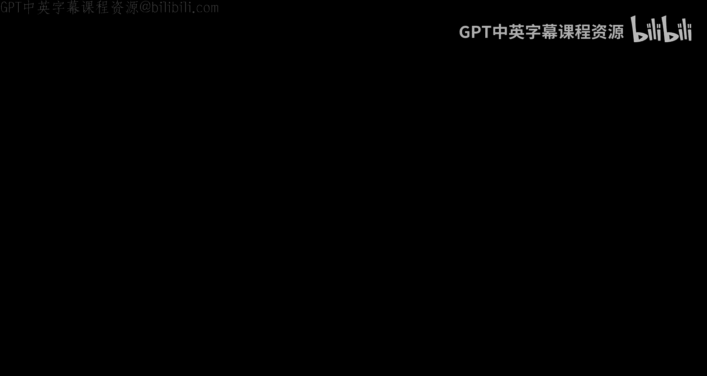
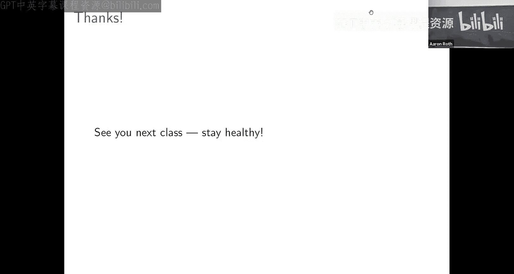

# 宾夕法尼亚大学《算法博弈论｜NETS 4120_ Algorithmic Game Theory 2023》中英字幕（deepseek-R1 p19 NETS 4120_ Algorithmic Game Theory, Lecture 19.zh_en -BV15kLRzTExU_p19-

All right。

So let's begin。So just sort of。Rerecap where we've been recently。U。

We've been studying as for four classes now。And auctions are sort of a theoretically clean way to solve things to solve other kinds of problems。

 and we've sort of talked about two kinds of objectives， maximizing social welfare。

 maximizing revenue， in fact， sort of lots of kinds of objectives at least in single parameter domain。

嗯。And。As like a running example。At various times， I've sort of speculated about how I might opt this。

F dons to you all。But I have a confession to make， which is that。

I did not buy this slide dongle at auction I like went into a store and it had a price and I I just purchased it at the posted price。

And so despite the fact that weve。Been spending quite a lot of time。

Studiing auctions and auctions are run for high ticket items and yeah so you've heard of art auctions and you know there are the FCCP has run spectrum auction。

Runway， take off the landing slides， sir off go。But like a whole was。

In this country and around the world is not sold by auction， it's sold by attaching prices to。

And you know， there's all sorts of good reasons for that， but maybe like first among them are that。

Auctions are just likeistically difficult to erect。I like to run an option， I need to get。

 for example， all of the participants in the same place at the same time。

And coordinating in what is basically an interaction。嗯。

And although auctions have nice properties they can exactly maximize the social welfare。

 they can exactly maximize revenue just because of the logistical difficulty in running auctions。

 like lots of things are sold with posted prices， which is very easy。

 I just decide on a price I put it up in my shop window and the first person who walks by is willing to pay the price game。

And so。What I want to study in this lecture is。How we can take some of the things we've been as we're trying to optimize easing auctions。

 welfare and revenue。And。If not exactly obtain those benchmarks， at least approximate them。Okay。

 I mean auction are like only a more powerful format than posted price I wanted to I could describe a posted pricing as a just have some price。

 you know， in my mind I solicit bids and I just give it to the lexiographically first bidder who。

Bid above my positive price， in part of that price。

 The only I can do with positive prices I can do with an option。

 and the reverse is not necessarily true。But we shouldn't expect to be able to exactly maximize welfare and exactly maximize revenue in the way we have been able to have auctions。

 but the question is whether we can come。Okay。And so again。

 you know just as we've been talking about in our study of auctions。

And just the mechanism design is extremely broad and we considered。

Zoom in on particular case studies to illustrate particular points。

 So NAsq auction we be thinking about。Approxiation mechanism design。

 single item options when we're thinking about revenue maximization。In this lecture sure。

 I'm going to think about posted prices for sort of our。Canonical example。

 which is single item off I've got one item to sell and many bids， but。

You you think of this as a case study more generally， for any mechanism design problem。

 you can think about how well you can approximate the optimal auction with something more like a close price。

Okay。We're going to be thinking about pricing a single item like a car， for example。

 How should I sell my。Single used scar。And here's a model we'll think of。So let's imagine that。

There are K， maybe recognizable types of buyers。 Okay， it could be just one。

 I gonna imagine that buyers are drawn from their evaluation are' drawn from some distribution determined by their type。

 So I don't know anything distinguishing buyers， maybe they're all drawn from the same distribution。

 but I'll allow the flexibility that there might be pay different types of fire like maybe when people my to inquire about my used car。

 the ones that are wearing top hats and chronics goldcrusted canes like I make different inferences about the willingness to pay for the car and people who show up on my bicycles with flat tires。

 but these types of buyers can be based on whatever you want。

 know like demographic integration you might have about them purchase history。

 anything like in an e-ce setting， you might have quite a lot of information about buyers in general through cookie tracking or anything。

And the assumption。Is that。Fuyers of type I will have their evaluations drawn from some known distribution。

That might be particular to their time the flexibility in allowing us to model different types of buyers is that I might imagine that buyers of one type are statistically different from buyers of another type with model by having their their values drawn。

Okay。Now what's going to happen the thing about sort of posted prices is it's really a sequential set。

 not that great like if everyone was there at once。嗯。Yeah， I can run up。

The reason I'm using posted prices is not everyone is there at once。

 People are sort of walking by their， they're entering my store and。At some point。

 someone might be willing to buy the item at the price that I set at which point the item is home I can't sell it to the next person who walks in。

 even if they would have been willing to pay。Okay， so a key part of this model is that buyers arrive one at a time until the item is sold。

 I have to make an irrevocable decision at some point whether to sell the item or not and at that point the item is gone。

 I can't sell anymore。Yeah。And。You know， I'm going what I'm going to do is I'm going to pick up price and in particular like if I wanted to。

 I could potentially pick different prices for bids or different。

The assumption is when a bidder walks in， I observe their type。Okay， so again。

 it might have a price for the people in top hats and monos and a different price for everybody else。

Okay， the bidders of type I will face a fixed price PI。And。😊。

The way will model their practicing decision is of the natural thing。If their unknown valuation。

Bigger than the price that I offer them。Then they're going to buy the item and the revenue that I will get is the price。

And if the price style for them is。Bigger than their valuation then they won't buy the item。

 I will get zero revenue， but I'll still have the item。

 which means that if a different bidder walks in tomorrow I have the opportunity to sell it to that。

And so like the main question in this setup， okay， I know what the distribution looks like。

 maybe I know how many bidders I expect to encounter in total。

Are there ways for me to set these prices？Before I know who is actually going to walk in？My door。

Such that when this plays out。The expected welfare or the expected revenue that I guess is competitive is comparable to what I would have gotten had I done the more difficult thing of trying to gather all of the bidders in one place and run an auction。

Okay。Does the question make sense？We're trying to do the same thing we did sort of in the auction setting。

 maximize welfare， maximize revenue， but in a more constrained setting。

 it's more constrained in that。We have to just use fixed prices in particular it's more constrained in that we don't know who bids are going to be ahead of time I have to make sort of。

If I set a low price， I might sell it to the first person who walks in the door and there might be people who walk in the door at a later point who would have been willing to pay more money。

 but。The item was thought lower。Okay， the problem you assume that people。Did I tell or that also。嗯。

Yeah， let's say maybe that we have。Some sense for sort of what fraction of people are。

Within each type。Okay， does the setting make sense？O。嗯。So， okay， this is the sort of。

Mechanism design problem we want to solve。Let me pause for a short interviewlude to talk about sort of just like an abstract probabilistic problem that we'll see maps onto the economic problem we want to solve rather nicely。

Okay嗯嗯。诶诶记好。So consider the following abstract game that is played in a series of n steps Okay。

 so it's the's sort of time which I index by I and。The way it works is that at time I。

I offer you the opportunity to walk away with some monetary prize pie eye。

Which is going to be drawn from some distribution GI。And。😊，The distributions are known in advance。

 but not the actual realization of the product。Okay so you know from the very beginning。

 what distribution the prize for you know， dayI is going to be drawn from。

 but only if you make it to day I and I offer you the prize from dayI。

 will you actually see the realization that draw from that distribution pi？Now。

 at round eye after you see。Your potential prize for that day， Ie， aye。You've got a choice。

You can accept the prize， you can pick it， you know， walk away with it， enjoy it。But if you do that。

 you end the game， if you take the prize you don't have。

The opportunity to see and take any of the future pride。Okay， so in this interaction。

 you're going to take exactly one product。And that each round your choice is either to take the prize you've seen right now。

Or to reject it and its it。See what the prize is since day I plus one。And so the question is。

 you know， like， okay， the basic question in this set up is how well can you do。

 like what's the best strategy here and how well can you optimize you know the value of the prize if you're going to take home an expectation？

And。A difficult benchmark is to compete with someone that I'll call a prophets who can see the future。

Okay， like a profit could see the future could see not just the distribution on prizes every day。

 but actually the realized prizes every day Okay， and what the profit would do is he would just wait until。

He was at the day I for which the realized prize was going to be half the highest and he'd walk away with that。

Okay， so the expected profits of the profits。W is just the expected value of the maximum over all of the end days of the realized prize on dayI。

 right because the profit's always going to perfectly select the maximum value prize the profit he's going to look at。

Yeah。需要。Yes， the distributions could be different every day， but you know what they are。这一下。对。

The prizes are numbers， but you know， it's like the number of buttons you win or whatever。

And these are just， you know， distribution over those that could be different。

Because these are still a distribution， right so like。This is the whole thing is a random experiment。

 right every time you play this， the realizations are going to be different。So every time。

The profits。It interacts。With this game， he will get payoff equal to the maximum of the realized payoffs。

 but what's his expected profit， well， it's just the expectation of that part。That sense。Yeah。

 is counting at steps like。Is there some kind of cost to。对吧。The profits is a。Good questions。

 Other questions。O。So you know like if you were a prophet， if you could see future。

 you could always select the max prize but you're not and so the question is how well can you do in this game？

And so there's a reasonably。Immediate connection between。Strategies for。

This sequential game that I'll call threshold strategies and the pricing problem that we just defined。

Okay， what is it， well。Let's say that in this sort of interaction in which you're competing with a profit。

A threshold strategy is very simple， it's defined just by some real value threshold T。

 and it's the strategy that just waits until you see a prize that's bigger than T and accepts it。

Okay， so you're just going to you've got some like quantity T you're holding up for and you're just going to like wait until you are offered a prize that's bigger than T and if you are ever offered a price that's bigger than T you'll accept this。

If you get to the end， then you're never offered a prize that was bigger than tea you won't have accepted anything。

Okay实实都系。And so there's an immediate connection between threshold strategies and pricing rules for maximizing social order。

Okay， so let's think about that。So remember I want you to identify the prize with the unknown value for the bidder。

And the threshold with the price。If remember how pricing works。 I set some price for the good。

A potential buyer walks into my store。If their value is bigger than the price， they buy it and my。

My revenue is the price that was paid。And the welfare is the value of the good that was purchased to the buyer who purchased it。

嗯。Well。The threshold is the price and the reward at that day is the value。Like， in both cases。

 the interaction stops exactly when the reward or the value of the buyer is bigger than the threshold or the price。

And the total reward obtained in the profit's interaction is pie eye。Correspondingly。

 the total welfare of hand and the pricing setting is VI。Okay。So。

There's this like one to one mapping between this interaction when you're competing with a profit and trying to maximize your reward and the problem。

 at least if you follow it with the threshold strategy。And the problem of picking up price。

For a good。嗯。Such that you maximize welfare。Is that connection clear。So if we can。

We can solve this sort of stylized game in which you're trying to collect rewards。

Competing with a profit， we will have solved the produce more grounded problem of trying to figure out how to price goods so as to maximize wealth。

Yeah。So you're saying like a threshold strategy can't be like exactly optimal in this interaction because if nothing else。

 like at the last round， if you haven't accepted you probably you' accept that。That's true。

 so you might be able to do a little bit better than a professional strategy by at least modifying it at the end to do that。

诶。But what I'm saying is。Any reward that any bound on the reward that we obtained using a threshold strategy？

Directly corresponds to a bound on the welfare we can obtain using in either parts。そざたす。Y。

 so the thing we're going to do next is not derive like an exactly optimal policy in the sort interaction in which you're competing with a profit。

 but is going to prove a bound on how well we can do with Quick。Okay。

 so I just want to make sure this connection is clear is what we're going。

Do now is we're going to sort of think about competing with a profit。

 but I want you to remember that。嗯。Yeah， really。What we're doing is we're solving this pricing problem。

 at least our objective as well。ok。And so here's the theorem。So no matter what instance of this。

Aim that we're given， right， So no matter what。Sequence of distributions。Are set out for us。

There is a very simple policy， a threshold strategy picks a threshold T and accepts the first prize that's above that threshold。

That is guaranteed to get expected reward is half of that of the problem。Okay， right， remember。

 if you could see the future， if you were a prophet。

 you would always select what turned out to be exposed the maximum prize。

You can't do that because you can't see the future and so achieving exactly this benchmark would definitely be impossible。

The statement is there's an extremely simple strategy。

 a threshold strategy that gets half of that benchmark。O，就一 sense。O。So that's prove。

So first I want to。Introduce some。Simple notation， this to make。The derivation a little bit cleaner。

So if I've got our real numbers Z。😡，I will write z plus to refer to the positive part of that number by which I just mean the maximum of z and zero Okay。

 so like z plus is just equal to z if z is already a positive number， but if z is a negative number。

 then z plus is just zero。嗯。If you're like a machine learning person。

 you might call this a relu activation。等份。嗯Okay。Now。

I also want like a simpler notation for the benchmark we're competing with the maximum realized reward over the end timet。

And I'll just call that V star。Okay， so our goal is to give a threshold strategy that gives us reward that is at least half of V star。

O。Now。Notes that。Although we don't know what the。Realizations of the rewards are going to be。

We do know how they're distributed because these distributions G1 throughN are doing so。

And so we can compute what is the expected value of B star， for example， right like we could。

 in principle， you know， like on simulations in our head of。How well the profit？

Would be able to do we can sample from these distributions and compute the maximum realization of the samples。

And so we can figure out distributional properties of V star， in particular， its expectations。

And the threshold strategy that I want to analyze is just going to set the threshold at half of the expected value of each。

Okay， so I know， you know， on average， how well the profit？

It's going to do how much profits the profit will make。嗯。

And my threshold is going to be half of that going to accept the first reward。

That's offered to me whose value is at least half of the expected profits。The profit。Okay。

 if the strategy makes sense， this is the strategy we're going to analyze and。It is well defined。

 it's defined in terms of quantities that we know。ok。And just to sort of。

Make the connection to this pricing problem， which is the thing we really care about clear。

In the proof， I'm going to use the language of the economic application。The pricing problem。Okay。

 so instead of saying。We accept a prize。I'm going to say the item is sold。Okay。

 right weve accept the prize， if the prize is above the threshold， well。

 that's like saying we sell the good if the value of the buyer is above the price。

And if we don't accept any prize， I'll say the item is unsold。O。Is to make the。

Connection to the pricing problem。And so。We're going to prove this theorem what call the profits inequality。

喂。Decomposing the expected reward into two quantities that it also relate to the application。

We have the pricing front。Okay。I want to separately think about the expected revenue that we make by pricing it this way。

And the expected utility for the fire against。没有。So that's going to be the plan。

So the thing that we want to show。Is that the expected welfare。Where reward is large。

 but we are likely to sell the good to somebody who has high value。

You're likely to accept a large reward。And so。Since our plan is to put a。

Relate to welfare to revenue and utility and separately bound those two things。

I want to think about if in the end， I end up selling the good to some buyer I at price P。

 which just means。Selecting the if reward， what revenue and what utility for the buyer result。Okay。

 so pretty immediately， I sell a good some buyer I at price P。Then my revenue is P。Hey。

 I get P dollars， that's what I sold for。And the utility of the buyer is V minus P。

If their value for the good was VI。But they had to pay P dollars for it。Okay。

 so their utility was V minus P。And so。Welfare。This thing that we want to argue is large。

It's just the sum。Of the buyer's utility just the sum of the buyer's utility。

And the seller's revenue。And so our strategy。Is going to separately show lower bounds。

On revenue and vi。Okay， we can show that both of these things have to be large。

Where if at least one of them has to be large。Then there's some。

 this thing that we care about has to be large。That's the overall strategy here。Okay， like sense。O。

So let's think about these two things that。first。What is our expected revenue？Well。

 that's pretty simple。If we sell the item。Then we get revenue P equal from the price we that。

And if we don't sell the item， then we get revenue zero。And so our expected revenue is just P。

 the price we set。Time is the probability that the item is sold。

And we know what price we're setting and the strategy we're analyzing， think I told you that already。

 the price is just half of the expected value of the benchmark。

 half of the expectation of V star and so our expected revenue is just half of the expectation of V star times the probability that the item is sold at that price。

Okay。We don't really know what the probability of the item is sold is。

 but this is at least a correct expression for what our expected revenues here。喂。Okay。

 let's think about buyinger utility expected buyer utility， That's one expected revenue was easy。

 there was only one of us who made paid hours if we sold the item。

Bier utility is a little more complicated there's end buyers and what their expected utility is depending kind of on who the item ends up selling is。

So let's think about things this way。There's sort of two cases。Or how。

Bitter eye might contribute to the expected buyer utility。

So it might be that by the time buyer I like walks past our store。

 the item has already been sold in which case。Fuyre I even have the opportunity to consider buying it and definitely will not。

Contribute to social welfare will not get any user。Or。

It might be that when buyer eye wanders past our store， we haven't sold the item yet。

In which case byer eye gets to consider whether she wants to buy it。

she has the opportunity to buy the good。Her utility will be the positive part of VI or value for the good minus the price。

Right， because。If the price is less than her value， so VI minusp is positive。

 then she will buy the item and her utility will be V minus P。

And if the value for the item is less than the price， V minusp is negative。

She won't experience negative utility， she just won't buy the item and she'll have utility zero。

Right so byer eyes， utility will be the positive parts of her value minus the price if by the time she gets to the item。

 it hasn't yet been。哎。And so。What's affected by our utility？Well。

 we've got to consider the contributions this quantity of all and of the buyers。

So it's the sum over of the buyers。Of。They're expected。Utility。嗯。

Assuming that the item is available by the time we get to them。

To the expected value of the positive part of V minus the price。But this is just their。

This is just their expected utility conditional on the item being available for them to buy。

So we have to multiply by the probability that the item hasn't yet sold by the time that we get to buyer eye。

ok。Under the events that the item is available when we get to buy our eye。

 this is their expected utility， and so our expected overall utility by linearity of expectation is just the sum of these terms over of the buyers。

在かです。Okay嗯。你为止。It might be hard to understand the quantity， the probability that the item。

Has not yet been sold at time step I because there's a complicated expression。

 there's a lot of ways in which the item might not have yet sold at time step I。对。嗯。

We know that the probability。That the item hasn't yet sold。

By times step I is at least the probability that the item never sell。

Like we can over bound this by the probability that the item is unsold at the end of this whole interaction。

O。So。Whatever this quantity is， a little hard think about。It can only be better。

Thenhan the sum over all of the buyers。Of the positive part。

Of their value for the good minus the price。Times the probability that the item never sells。

 doesn't sell even to the empire。Because in particular， if the item never sells。

 it was available to each of the buys at the time that they arrived。Okay， does that makes sense？And。

This is the expectation of the sum of the。Now， the sum of a bunch of non negative quantities because this is the positive part the value minus price right。

 so this quantity never be negative quantity inside paper。

And so if I've got the sum of a bunch of non negative quantities。

 it can only be larger than the maximum of those five。

If the sum includes the maximumphone whatever it is， and we don't have any like cancellations。

 some of those terms are negative。So we can further up bound this by the expected value of the maximum over all of the buyers of the positive part of their value minus price。

Again， multiplied by the probability that we never sell the item。Okay。There it comes。Okay。

 and you know， like just making our bound even a little bit worse。嗯。

Let's just get rid of this positive part。Okay， like all this positive part。Is doing is is。

Making our quantity larger because it might be that sometimes this term is negative and when it's negative。

 we're sort of raising it up to zero and otherwise we're leaving it on。Okay。

 so the if we get rid of the positive parts。Then we only make this quantity even smaller。Okay。

 and well， P it says the concept。 So what we're left with is。

The product of the difference between the expectation of the maximum value。Okay。

 this is like the maximum social welfare， the。Benchmark， that would be obtained by the province。

L is the price。Times the probability that the item never sells。Okay。

 each of these steps we've only made the quantity smaller and so whatever the expected buyer utility is。

 is at least。This thing we ended up with at the end。Okay， and just sort of。

Remembering what these quantities are。The maximum buy evaluation。This is the process。

This is the thing we call the V star。And the price that we set in the thresholdhold strategy we're analyzing。

Was just half of the expectation of these sir。ok。So this difference here。

Expected value of the maximum bid V star minus the price minus half of v star is just half of v star v star minus half of v star。

 which is half of v star。 And so this whole expression， whole bound。

Is just half of the expected prospectss of the prophets。

Times the probability that we never sell the item at that point。Okay。There。Okay。So remember。

 our goal is to balance the expected welfare。呃 the。

Allocation that we end up with when we use this pricing rule。And we noticed at the beginning that。

Welfare is always the sum of the revenue of the seller and the utility of the buyer。

so expected out is just sum of the expected revenue of the seller and the expected utility of the buyer。

And。We separately bounded each of these two things。With quantities that we didn't really。

It was hard to put a number on。Right， like。We found that expected revenue when half of the benchmark times the probability that the item was not sold。

 okay， but like we don't know we don't really know the probabilitybabil of the item is sold。

We found an expected utility with half of the benchmark times the probability of data it unsold。Okay。

 we don't really know the probability that the item is unsold。

But we do know that the item is either going to be sold or not， there's only two possibilities。

And so when we write down our bounds for the expected revenue plus the expected buyer utility。Well。

 we guess half of the profit benchmark that the probability get of it sold。

Plus half of the profit benchmark times the probability that the item goes unsold。Or in other words。

Half of the profit benchmark times the sum of the probability of the item is sold and that the item is unsold。

And although we don't know anything about what either of these two quantities is。

We know that there some has to be one because there's only two possibilities here。

 either the item will be sold or the item will be unsold。So this thumb is one。

And our expected utility is going to be equal to half of the optimal benchmark。O。系咪得。Yeah。

This is trying to do better。可以。工具的管。对。So I don't follow it so there's two like maybe you can。

Maybe that there's a， let me guess what the first confusion is the come。This quantity。

 half of the expected。Profit benchmark。감成 andチパズ。On one hand， it's like in the theem statement。

 it says like， this is the welfare we're going to obtain。On the other hand。

 it's also in the pricing strategy。The price we set。Is equal to half of the expected benchmark。

 which is a quantity that we know。So we can use the。走。Maybe I don't understand the question。

 but the pricing rule we use is very simple and use of information that we have available to them so it does the distribution。

Figure out what the expected profit benchmark park is going to be take half of use out of our fixed price。

And what we've proven is that if we do that， if we follow this simple pricing strategy that uses only the information that's available to us。

Then in expectation over the randomness of the fire evaluations。

 the welfare we will obtain is half of the benchmark of half of the。Opttimal welfare。

Does thatい senseす。Good question。Other questions？ok。嗯。So， having solved。

And we proven this profits inequality PRO， PBT。We have sort of an immediate implication。

Confusingly not for profit， PRO， FIT， but for welfare maximization。It means that。

Using a single fixed price， actually。Independently of the types of the buyers。

 remember our strategy space here when we when we defined the pricing problem， right we so would say。

 well， you know， like different buyers might be drawn to different distributions。You know。

 like we have the power if we want to assess different prices for people to show up in pots for people to show up on bicycles but。

The strategy we have to analyze actually doesn't do that。

It sets just a fixed price that it uses for everybody you can just。You know， like。

 built it onto the side of your car。The price is just half of the。Welfare benchmark。

 the expected welfare benchmark。 and we show that this simple rule。

 despite the fact that it doesn't require。Synchronously gathering old natural buyers in one place and running an auction nevertheless can get half of the expected welfare of the VCP。

Okay， so。It's doing this， you know， not only in sort of an easier to implement way since you don' need to like gather everyone in one place。

 it's also doing this sort of despite。What you might have thought was sort of like a crippling information theoretic disadvantage。

 which is that。It has to make decisions about whether to sell an item or not。

with with uncertainty about what the bitter realizations are going to be。

 like not knowing who's going to like walk in the door tomorrow or not even knowing the valuations of people who've already walked in the doors。

 they don't have to report them to the mechanism， they're just making you know purchase or no purchase decisions。

In contrast to the BCG mechanism which。Gets to use all of that information。

Gets to see the valuations of all of the buyers， all of the such buyers that once。Okay。

 so the pricing rule doesn't use any of that information but it has to make decisions before some of the buyers arrive and it doesn't even get to ask。

The buyers who did arrive what their valuation were and so half at least half as well as the VTP。

Okay， so is for well fair。What do we know about， I suppose the reason we're selling our used car is not to make the world a better place and maximize welfare。

 but rather because we want money。嗯。So remember that。

A single item option is a single parameter domain。And。

We had this characterization that we proved to last five when we were studying revenue optimal auction。

嗯。That sort of said， well。For any monotone allocation rule。嗯。

When we pair it with the unique pricing that makes it dominant strategy crible。

The expected revenue that we get。From that allocation rule， it's just。

 it sort of looks like a welfare maximization problem。

Except instead of going to give the item to the person who has the highest value for the good。

We want to give the item to the first thing that the highest virtual value。

But the virtual value for the good。Is related both to the buyer's realized value。

 but also somehow from the distribution。And the ritual values could be positive or negative。

Which means that the revenue maximizing auction， at least will sometimes。Not allocate the item。😡。

Right， like the way you maximize。The virtual value of the person that the item is assigned table。

Is by assigning the item to the first thing as the highest value。

The highest virtual value is the same as the first has the highest value。

If that virtual value is positive。And otherwise not sign it back。Right。

 so I can help that intuitively the way revenue maximizing options make more money and well for maximizing options is by artificially deing supply。

 sometimes not selling yet。But because。We were able to cast。Revenue maximization。

As a virtual welfare maximization problem。We can use the machinery the weakness develops to maximize welfare。

To maximize revenue with pricing so well。Just that， instead of。ming。

Values onto the prizes that are available to our profits。We have to matter。

Virtual value Cy those private。The optimal revenue， given a。The optimal revenue。

Which we'll call up this is sort of the benchmark that we would achieve the team if we got to run the profit maximizing on from last five。

It's just the expected value。Of the maximum。Of the positive part of the virtual evaluation。

Because if the largest virtual valuation。Who's positive。Then we give the。

We give the item to that person and because negative， we don't give the item to anybody。

And so this expression is equal to。Our expected revenue under the optimal allocation rule that gives the item to the person with highest value exactly when their virtual value is shaing。

And so we can map this revenue maximization problem。Directly onto our。

Reward selection problem and compete with the profit there。Okay， so now， rather than sort of。Viing。

The reward that's realized。At day eye as the value for bitter eye。

 as we did when we were interested in welfare， we'll view the reward that's realized that day eye as the positive part of virtual value。

A fair。Okay so the expected。Profits of the profits。

 the benchmark that we now know how to compete with。Well， what was， what's the profit going to do。

 He's going to。Take exactly the largest reward， which is equal to the virtual value if the largest virtual value is positive and it's otherwise equal to。

Okay， so the benchmark。Of our profit is now the optimal revenue benchmark obtained by the revenue maximizing option。

And so。By applying exactly the same。Specialhold strategy that we just arrived。

We know that we can obtain virtual value， at least half of about。By setting the threshold strategy。

 by setting the threshold， the October over2。错。And what this corresponds to。

 like this is a threshold on virtual values。So to map this back。Into a pricing rule， remember。

You know。Buyers are not buyers are not computing their virtual values。

 What they're doing is they're just buying the item when their actual values are bigger than the price。

So to implement a strategy that sets a fixed threshold on the virtual values。Through pricing。

 which correspond to pricing， which correspond to thresholds on the actual values。

What we need to do is we need to map。A number T is threshold in virtual value space back to value space by applying the inverse of the virtual value。

Okay， so if the buyers are going to buy an item and price P exactly when their value B is greater than PI。

What we'd like them to do is buy the item exactly when their virtual value is greater than。

One half times opt and so the price that we should offer to by our eye is the inverse of their virtual value function applied to Octoberto 2。

Does that make sense？When a buyer a buyer faces this price。

 they will buy the good when their value for the good is greater than this price。Which。

Just by applying the virtual value function so that buyer both sides of the equation corresponds to exactly when their virtual value is bigger than our approach。

I标。And so。This immediately gives us a pricing rule that。

Gets us now within a factor of tu out of welfare， but。The factor two of the revenue of the alcohol。

But note now that when we're maximizing revenue。The actual pricing rule looks a little bit different。

So remember when we were maximizing welfare， even though the buyers。In the a。

Came from potentially different。Value distributions yeah had different types that we can recognize。

 So were the wealthy be eccentric buyers， the gravity buyers looking to get their first car。

When we're maximizing welfare， we offered every single one of them the same price。

But that's not what's happening anymore when we're maximizing revenue。

Even though we have a uniform threshold on their virtual values。This transformation。

 since buyers who are drawn from different distributions， buyers who are of different types。

 will have different virtual value functions， this transformation will correspond to offering them different prices。

So we're going to offer a higher price to the guy who goes up and pop had at our door。

The guy comes up with。A broken by。Okay， it makes a lot of sense for。那这。Well。

 the ground miss there's buss。Otherwise， I'll see you guys next week。

