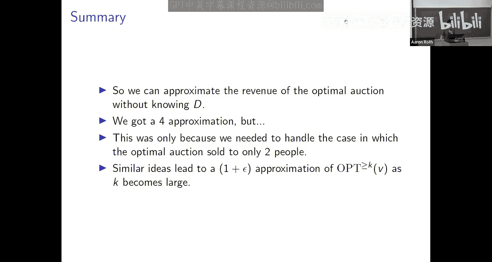

# 算法博弈论：第20讲：无先验知识下的收益最大化

在本节课中，我们将学习如何在**没有先验分布知识**的情况下设计拍卖机制以最大化收益。我们将重点关注**数字商品拍卖**这一案例，并尝试设计一个在**最坏情况下**也能保证收益的机制。

---

## 课程概述

到目前为止，我们学习了最优拍卖设计。在单物品拍卖的设定下，我们能够解析地推导出收益最大化的拍卖形式。上一节课我们提到，虽然拍卖理论很优美，但在日常生活中，我们购买的大多数商品都是通过**固定标价**完成的。我们意识到，如果愿意放弃精确的最优性，接受一个近似因子（例如2倍），那么简单的固定标价策略就可以近似最优拍卖的收益。

然而，无论是**最优拍卖**还是**收益最大化的定价方案**，都依赖于一个关键假设：我们知道买家估值的**概率分布**。这些分布定义了**虚拟价值函数**，我们需要计算甚至反演这些函数才能确定具体的定价。但在实际部署时，我们往往不知道这个分布从何而来。

这与我们讨论社会福利时的情形截然不同。运行**VCG机制**可以在非常广泛的设定下优化社会福利，且不需要任何分布知识。它总是能给出社会福利最优的分配，并且是占优策略激励相容的。

因此，本节课的目标是思考：我们能否为收益问题找到类似的、**不依赖于分布**的机制？我们希望设计一个算法或机制，它总是占优策略激励相容的，并且能在最坏情况下陈述某种收益保证，就像VCG机制为福利所做的那样。

---

## 数字商品拍卖设定

我们将通过一个案例研究来探讨这个问题，这个案例被称为**数字商品拍卖**，或者也可以称为**无限供给拍卖**。这是与单物品拍卖截然不同的另一个极端。

数字商品拍卖适用于销售软件、电影租赁等商品。这些商品的生产可能涉及高昂的固定成本（如软件开发、电影制作），但一旦生产完成，**边际复制成本为零**。这与单物品拍卖存在硬性供给约束不同，在数字商品拍卖中，**原则上每个竞拍者都可以获胜**。

在单参数域的框架下，数字商品拍卖的可行结果集是所有竞拍者的可能子集。每个竞拍者 `i` 对赢得商品有一个未知的估值 `v_i`。如果获胜，其效用为 `v_i`；否则为0。由于没有供给约束，任何子集的竞拍者都可以被宣布为获胜者。

这是一个简单的拍卖设定，但与单物品拍卖（最严格的供给约束）相反，它处于供给约束最宽松的另一端。

从收益的角度看，数字商品拍卖是一个很好的案例，因为在这里，**收益和社会福利的冲突最为激烈**。

社会福利最大化的结果是什么？答案是：给所有人商品。VCG机制在数字商品设定下就会这样做：将商品分配给所有人。为了同时满足占优策略激励相容和个人理性，VCG机制只能向每个人收取0费用。因此，**社会福利最大化的机制收益为零**。

这清楚地表明，在这个设定中，收益和社会福利是**完全冲突**的。如果我们想获得收益，就必须考虑**人为地限制供给**。

---

## 定义收益基准

考虑收益时的一个棘手问题是：没有一个明确的基准。对于社会福利，我们有一个清晰的上限——社会福利最大化的结果。但对于收益，理论上我可以无限提高价格，但这通常无法构成一个真实的拍卖机制。

之前我们通过引入估值先验分布解决了这个问题，从而可以谈论拍卖的期望收益和最优拍卖。但现在我们希望**摆脱对先验分布的依赖**。

我们可以利用从先验分布中学到的知识来构建直觉。在数字商品拍卖中，如果知道先验分布，**收益最优的拍卖实际上就是一个固定价格**。对于单个买家，我们能做的唯一真实的机制就是设定一个固定价格。最优机制会将价格设定为使虚拟价值从负转正的那个值。

因此，即使不知道先验分布，我们也可以设定一个目标：设计一个机制，其收益能够与**事后看来最优的固定价格所获得的收益**相竞争。这里的“事后”指的是，如果我们已经知道了所有竞拍者的真实估值，那么总存在一个能最大化收益的固定价格。

首先，这个基准定义不依赖于任何分布假设。其次，如果现实中确实存在一个（我们未知的）分布，那么竞争过这个基准也意味着我们同时竞争过了那个分布下的最优拍卖收益。

---

### 固定价格基准的数学描述

假设我们设定一个固定价格 `p`。谁会购买商品？所有估值大于等于 `p` 的竞拍者。我们的总收益是：
`收益(p) = p * (估值 ≥ p 的竞拍者数量)`

假设有 `n` 个竞拍者，其真实估值为 `v_1, v_2, ..., v_n`。事后看来，能使收益最大化的价格 `p*` 必然是某个竞拍者的估值，即 `p* ∈ {v_1, v_2, ..., v_n}`。这是因为收益函数 `p * (#估值 ≥ p)` 是一个分段常数函数，只有当 `p` 恰好等于某个估值时，提高价格才可能导致买家流失。

因此，如果我们按降序排列估值：`v_(1) ≥ v_(2) ≥ ... ≥ v_(n)`，那么最优固定价格基准 `OPT` 可以写成：
`OPT = max_{i} [ i * v_(i) ]`
其中，`i` 表示将价格设定为第 `i` 高的估值 `v_(i)` 时，会有前 `i` 个竞拍者购买，收益为 `i * v_(i)`。

---

### 基准的调整与挑战

然而，直接竞争这个 `OPT` 基准对真实的机制来说要求过高。问题尤其出现在 `i = 1` 的情况，即最优收益来自仅向出价最高的单个竞拍者销售。

考虑只有一个竞拍者的极端情况：最优价格就是他的估值。但一个真实的机制无法在询问其估值后，又以此作为价格向他收费——这违反了激励相容性。即使有多个竞拍者，如果最优收益几乎全部来自那个最高估值者，机制同样难以竞争。

因此，我们需要**弱化这个基准**。一个合理的修正是：只考虑那些**至少向两人销售**的固定价格策略。即，我们定义新的基准 `OPT_≥2`：
`OPT_≥2 = max_{i ≥ 2} [ i * v_(i) ]`
在数字商品的实际场景中（如Netflix订阅），最优定价通常期望能卖给大量用户，而不仅仅是少数人。因此，这个修正后的基准在实践中是合理的。

我们的新目标是：设计一个占优策略激励相容的机制，使其收益与 `OPT_≥2` 竞争。

---

## 构建机制：收益提取器

我们首先构建一个有用的子程序，称为**收益提取器**。它的目标是：给定一个**独立于竞拍者报价**的收益目标 `R`，如果存在某个固定价格能够获得至少 `R` 的收益（即 `OPT_≥2 ≥ R`），那么该机制就**恰好**获得收益 `R`；否则，它可能获得零收益。

以下是数字商品收益提取器的算法：

1.  获取所有竞拍者的报价（假设他们诚实报价）。
2.  将报价从高到低排序：`b_(1) ≥ b_(2) ≥ ... ≥ b_(n)`。
3.  找到最大的整数 `k`，使得 `b_(k) ≥ R / k`。
4.  如果存在这样的 `k`，则前 `k` 个竞拍者获胜，并各自支付 `R / k`。其他竞拍者不获胜且支付0。
5.  如果不存在这样的 `k`，则无人获胜。

**为什么它是激励相容的？**
我们可以动态地描述这个算法：从 `k = n` 开始，向所有 `n` 个竞拍者提供价格 `R/n`。任何拒绝该报价的竞拍者将被永久移除。然后，向剩余竞拍者提供更高的价格 `R/(n-1)`，依此类推。价格随着轮次**只升不降**。对于竞拍者来说，拒绝一个低于其估值的报价是劣势策略，因为会失去未来可能以可接受价格获胜的机会；接受一个高于其估值的报价也是劣势策略，因为价格只会越来越高。因此，诚实报价是占优策略。

**为什么它能提取收益 `R`？**
如果 `OPT_≥2 ≥ R`，则存在某个 `k ≥ 2`，使得 `k * v_(k) ≥ R`，即 `v_(k) ≥ R/k`。这意味着至少前 `k` 个竞拍者的估值满足条件。算法会找到某个满足条件的 `k'`（可能是 `k` 或更大），并恰好收取 `R` 的总收益。如果 `OPT_≥2 < R`，则对于所有 `k ≥ 2`，都有 `v_(k) < R/k`，算法找不到满足条件的 `k`，收益为零。

收益提取器将收益最大化问题**转化为了一个估计问题**：如果我们能以一个独立于目标人群报价的方式，较好地估计出 `OPT_≥2` 的值，并将其作为 `R` 输入收益提取器，我们就能获得有竞争力的收益。

---

## 随机抽样拍卖

现在，我们利用收益提取器来构建完整的机制。核心思想是：通过**随机抽样**来估计 `OPT_≥2`，并将估计值用于对另一组人群运行收益提取器。

**随机抽样拍卖算法如下：**

1.  将全体 `n` 个竞拍者**随机**且独立地分成两个集合 `S'` 和 `S''`（例如，抛硬币决定）。
2.  在集合 `S'` 上，计算其自身的 `OPT_≥2` 值，记为 `R'`。
3.  在集合 `S''` 上，计算其自身的 `OPT_≥2` 值，记为 `R''`。
4.  在集合 `S'` 上运行收益提取器，但使用 `R''` 作为收益目标。
5.  在集合 `S''` 上运行收益提取器，但使用 `R'` 作为收益目标。
6.  总收益是两次运行收益之和。

**为什么它是激励相容的？**
对于集合 `S'` 中的任意竞拍者，他们面临的收益提取器使用的目标 `R''` 完全来自于另一个集合 `S''` 的报价，与 `S'` 中任何人的报价无关。根据收益提取器的性质，这对 `S'` 中的每个人都是占优策略激励相容的。同理对 `S''` 成立。

**收益分析：**
随机抽样拍卖的总收益至少是 `min(R', R'')`。因为考虑 `R'` 和 `R''` 的大小关系：
*   如果 `R' ≥ R''`，那么在 `S''` 上运行的收益提取器（使用目标 `R'`）可能失败（如果 `S''` 的 `OPT_≥2` 小于 `R'`），但在 `S'` 上运行的收益提取器（使用目标 `R''`）一定会成功，因为 `S'` 的 `OPT_≥2` 是 `R'`，而 `R' ≥ R''`，所以它至少能提取 `R''`。
*   反之，如果 `R'' ≥ R'`，则至少能提取 `R'`。
因此，总收益 `≥ min(R', R'')`。

---

### 将收益与基准联系起来

设全局最优基准 `OPT_≥2 = k * p`，其中 `p` 是最优固定价格，`k ≥ 2` 是在该价格下会购买的人数。

现在考虑那 `k` 个“本应获胜”的竞拍者。通过随机分割，他们中的一部分（设为 `k'` 人）进入了 `S'`，另一部分（`k''` 人）进入了 `S''`，且 `k' + k'' = k`。

在集合 `S'` 上，即使我们只是简单地采用价格 `p`，也能获得至少 `k' * p` 的收益。因此，`R' ≥ k' * p`。同理，`R'' ≥ k'' * p`。

因此，随机抽样拍卖的收益满足：
`收益 ≥ min(R', R'') ≥ min(k' * p, k'' * p) = p * min(k', k'')`

那么，其与全局最优基准的比值至少为：
`收益 / OPT_≥2 ≥ [p * min(k', k'')] / [p * k] = min(k', k'') / k`

这里的 `min(k', k'')` 正是将 `k` 个物品随机分到两个篮子后，**较小篮子中的物品数量**的期望值。

---

### 组合学引理

考虑抛 `k` 次均匀硬币，令 `H` 为正面朝上次数，`T` 为反面朝上次数。我们关心 `E[min(H, T)]`。

可以证明，当 `k ≥ 2` 时，`E[min(H, T)] ≥ k/4`。
简要论证：考虑每次抛掷对 `min(H, T)` 的期望增量。当已抛掷次数为奇数时，`H` 和 `T` 不可能相等，下一次抛掷有1/2的概率增加较小值。当已抛掷次数为偶数时，有可能相等，此时增量为0，但不会为负。通过分析奇偶轮次，可以得出总期望值至少为 `k/4`。

将此引理应用于我们的场景：`k'` 和 `k''` 相当于 `k` 次独立随机分配的结果（每个竞拍者进入 `S'` 如正面，进入 `S''` 如反面）。因此，`E[min(k', k'')] ≥ k/4`。

由期望的线性性，我们得到：
`E[收益] ≥ E[p * min(k', k'')] = p * E[min(k', k'')] ≥ p * (k/4) = OPT_≥2 / 4`

---

## 结论与总结

在本节课中，我们一起学习了如何在**没有先验分布知识**的情况下，为数字商品拍卖设计一个具有收益保证的机制。

1.  **问题设定**：我们研究了数字商品（无限供给）拍卖，其中收益与社会福利目标存在根本冲突。
2.  **基准定义**：我们定义了不依赖于分布的收益基准 `OPT_≥2`，即事后最优的、至少向两人销售的固定价格策略所能获得的收益。
3.  **核心工具**：我们构建了**收益提取器**，这是一个给定收益目标 `R` 后，能在目标可行时恰好提取 `R` 收益的真实机制。
4.  **最终机制**：我们提出了**随机抽样拍卖**。它通过随机将竞拍者分成两组，互相用对方的 `OPT_≥2` 估值作为收益目标来运行收益提取器。
5.  **收益保证**：我们证明了随机抽样拍卖的期望收益至少是 `OPT_≥2` 的 **1/4**。这个因子4源于我们竞争的是至少向两人销售的基准，而随机分割时，较小群体规模的期望至少是总体的1/4。

这个结果表明，即使在没有分布知识的最坏情况下，我们也能设计出具有恒定近似比的收益最大化机制。虽然近似因子4可能看起来较大，但通过调整基准（例如要求至少向 `k` 人销售，`k` 稍大），我们可以利用相同技术获得 `(1+ε)` 的近似比。

本节课将机制设计问题与统计估计问题巧妙结合，展示了随机化在应对不确定性时的强大力量。