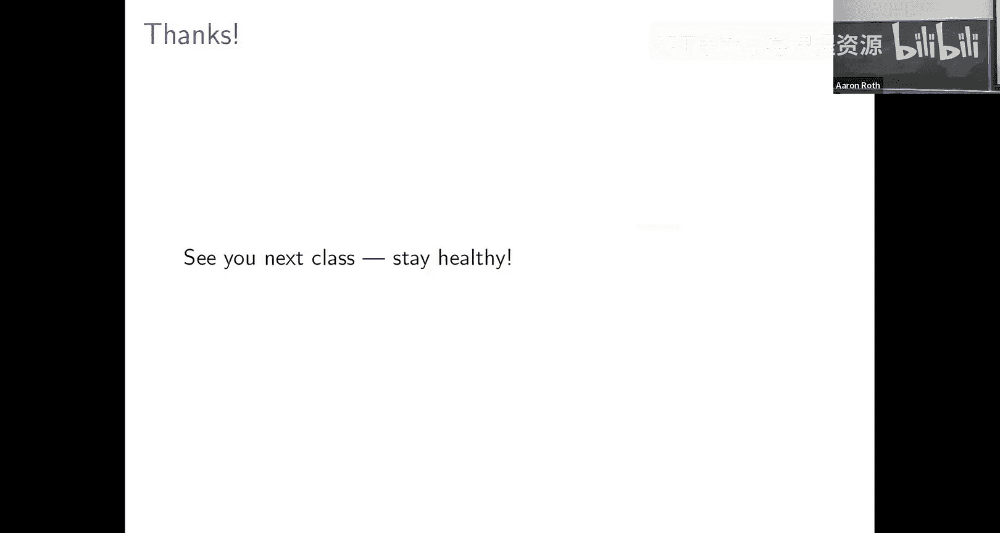

# 算法博弈论：第21讲：在线数字商品拍卖

在本节课中，我们将学习如何设计一个在线拍卖机制，用于销售数字商品。该机制无需预先知道买家估值的分布，也无需将所有买家聚集在一起进行一次性拍卖，而是可以顺序地接待买家。我们将利用多项式权重算法来实现这一目标，并证明其收益能与事后最优固定价格相竞争。

---

## 在线拍卖模型

上一节我们介绍了随机抽样拍卖，它解决了不知道估值分布的问题，但仍需一次性聚集所有买家。本节中，我们来看看如何同时解决这两个问题，设计一个顺序接待买家的在线拍卖。

我们考虑一个数字商品拍卖场景。卖家有无限供应（例如，软件副本）。共有 `n` 个买家，每个买家 `i` 对商品有一个私有估值 `v_i`，我们假设所有估值都缩放至区间 `[0, 1]`。买家按顺序到达。在时间 `t`，买家 `t` 到达并出价 `b_t`（在真实机制下，`b_t` 应等于其真实估值 `v_t`）。卖家必须立即决定是否将商品分配给该买家以及收取多少费用，且此决策只能基于截至当前时刻 `t` 所观察到的所有出价历史 `(b_1, ..., b_t)`。

我们的目标是设计一个占优策略真实的在线拍卖，使其收益能与“事后最优固定价格”这一基准相竞争。我们定义事后最优固定价格 `p*` 为：在所有买家估值序列已知后，能使总收益 `p * (# of buyers with v_i ≥ p)` 最大化的那个价格 `p`。

---

## “要么接受，要么离开”拍卖

为了设计在线机制，我们聚焦于一种简单但强大的拍卖形式：“要么接受，要么离开”拍卖。

在每一轮 `t`，卖家在观察到买家 `t` 的出价之前，先根据历史出价 `(b_1, ..., b_{t-1})` 决定一个价格 `s_t`。当买家 `t` 到达并出价 `b_t` 后，规则如下：
*   如果 `b_t ≥ s_t`，则买家赢得商品，并支付 `s_t`。
*   如果 `b_t < s_t`，则买家未赢得商品，支付为 `0`。

这种机制本质上是顺序定价，但通过以拍卖形式询问出价，我们可以了解到买家的确切估值（假设真实出价），而不仅仅是“是否高于价格”这一比特信息。这对于后续的算法设计更为方便。

**关键性质**：任何“要么接受，要么离开”拍卖都是占优策略真实的。因为价格 `s_t` 是在看到买家 `t` 的出价之前独立确定的，买家无法通过虚报来影响自己面临的价格，因此诚实出价是其最优策略。

因此，整个机制设计问题简化为：如何根据历史出价序列，为每一天 `t` 选择一个好的价格 `s_t`。

---

## 将定价问题转化为专家学习问题

我们的目标是使总收益尽可能接近事后最优固定价格 `p*` 的收益。这启发我们使用多项式权重算法，该算法可以在顺序决策中保证其累积收益与 hindsight 下最佳专家的收益相近。

以下是我们的转化思路：
1.  **定义专家**：每个“专家”对应一个候选的固定价格 `p`。我们从一个有限的候选价格集合 `P` 中选取专家，例如 `P = {α, 2α, 3α, ..., 1}`，其中 `α` 是一个离散化参数。
2.  **定义收益**：在每一天 `t`，如果专家（价格 `p`）被采用，其收益 `g_t(p)` 定义为：
    *   `g_t(p) = p`，如果当天买家估值 `v_t ≥ p`。
    *   `g_t(p) = 0`，如果 `v_t < p`。
    注意，即使当天我们没有实际采用价格 `p`，只要我们知道买家估值 `v_t`，我们就能计算出所有专家 `p ∈ P` 的假设收益。这正是我们采用拍卖形式（而非纯定价）的好处——它让我们能观察到 `v_t`，从而计算反事实收益。
3.  **算法流程**：
    *   初始化多项式权重算法，专家集合为 `P`。
    *   在每一天 `t`：
        a. 根据多项式权重算法当前的权重分布，选择一个专家（即一个价格 `p_t`）。
        b. 以此价格 `p_t` 运行“要么接受，要么离开”拍卖。
        c. 观察到买家估值 `v_t`（或真实出价）。
        d. 为每一个专家 `p ∈ P` 计算其当天收益 `g_t(p)`（如上述定义）。
        e. 将收益向量 `(g_t(p))_{p∈P}` 反馈给多项式权重算法，更新权重。

根据多项式权重算法的理论保证，经过 `T` 轮后，算法所获得的累积收益满足：
`算法总收益 ≥ (最佳专家总收益) - O(√(T log |P|))`

其中，“最佳专家总收益”正是候选价格集合 `P` 中，能使总收益 `∑_{t=1}^T g_t(p)` 最大化的那个价格 `p` 所获得的总收益。根据我们的收益定义，这恰好等于在价格 `p` 下售出商品所获得的总收入。

---

## 从有限候选集到连续价格区间

目前我们的保证只针对有限的候选价格集合 `P`。我们需要将其与在整个连续区间 `[0,1]` 上最优的价格 `p*` 进行比较。

设我们选择的候选价格集合为 `P = {α, 2α, 3α, ..., 1}`，共有 `|P| ≈ 1/α` 个价格。

**关键引理**：对于任意最优价格 `p* ∈ [0,1]`，存在一个候选价格 `p' ∈ P`，满足 `p' ≤ p*` 且 `p* - p' ≤ α`。那么，使用价格 `p'` 与使用价格 `p*` 的收益之差最多为 `α * n`。这是因为，对于每一个原本在价格 `p*` 下会购买的买家，在更低的价格 `p'` 下他仍然会购买，但每笔收入减少了最多 `α`。

因此，我们有：
`最佳候选价格收益 ≥ 最优价格收益 - αn`

结合多项式权重算法的保证，我们得到：
`算法总收益 ≥ (最优价格收益 - αn) - O(√(T log (1/α)))`

这里 `n = T` 是买家总数（轮数）。现在我们可以优化选择离散化参数 `α` 来平衡两项损失。令 `α = 1/√n`，则：
`算法总收益 ≥ 最优价格收益 - O(√(n log n))`

---

## 保证的意义与比较

我们得到的保证是加性的：算法收益至少是最优固定价格收益减去一个 `O(√(n log n))` 的项。

*   **与随机抽样拍卖比较**：随机抽样拍卖给出的是一个乘性近似保证（例如，4-近似），即使最优收益很低（例如只卖给两个人）也成立。而我们的在线算法在最优收益 `OPT` 较小时（小于 `√n log n`），加性项可能占主导，保证较弱。但是，当 `OPT` 随 `n` 线性增长时（这在许多实际场景中成立，例如买家估值来自某个固定分布），我们的算法收益与 `OPT` 的比率将趋近于 1，即达到近乎完美的近似，这比固定的乘性近似（如 4-近似）渐近更优。
*   **实际含义**：如果买家估值是独立同分布地从某个未知分布中抽取的，那么随着买家数量 `n` 的增加，我们的在线顺序定价算法的平均单买家收益将收敛到最优固定价格的平均收益。

---

## 总结

本节课中，我们一起学习了如何为在线数字商品拍卖设计一个无需先验分布、且能顺序接待买家的机制。
1.  我们采用了“要么接受，要么离开”的拍卖框架，它本质是顺序定价且是占优策略真实的。
2.  我们将定价问题转化为一个在线学习问题：将每个候选价格视为一个专家，利用多项式权重算法来动态选择每日的价格。
3.  通过将连续价格区间离散化，并分析离散化带来的收益损失，我们证明了算法总收益不低于事后最优固定价格收益减去一个 `O(√(n log n))` 的项。
4.  这个加性保证意味着，在最优收益随买家数量线性增长的典型场景下，我们的算法能渐近地达到近乎最优的收入。

这种方法巧妙地将机制设计与在线学习结合起来，实现了对未知环境且顺序到达场景下的稳健收益最大化。