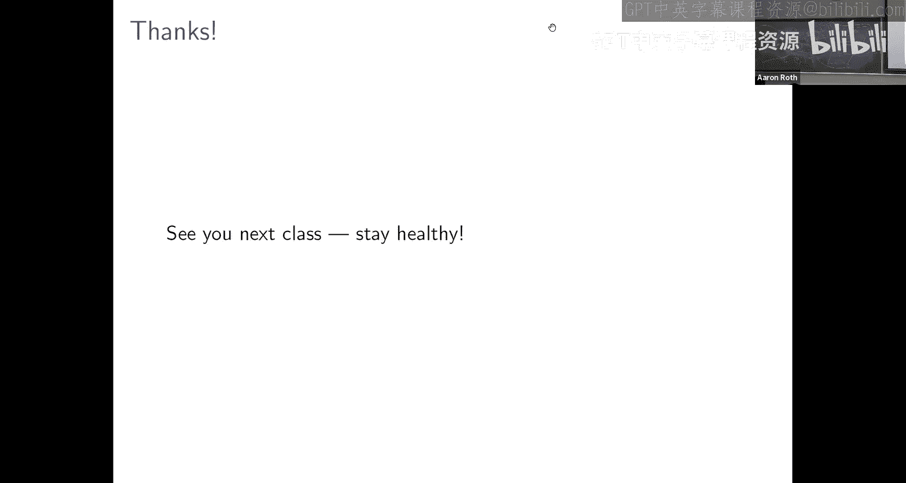

# 算法博弈论：24：从极小极大定理到校准预测

在本节课中，我们将学习如何利用博弈论中的核心工具——极小极大定理，来推导机器学习算法。具体来说，我们将探讨如何设计一个算法，使其能够做出“校准”的预测。校准预测是指，即使面对由对手（而非自然概率过程）生成的序列，预测结果也能表现得像真实的概率一样。

---

## 校准问题：天气预报员的困境

假设有一位天气预报员，他每天早晨预测当天降雨的概率。我们作为观察者，想要检验他是否真的“知道”每天的真实降雨概率（即他是一位“先知”预报员），还是只是一个不懂气象学的“骗子”。

一个简单的检验方法是“平均一致性”：检查他长期预测的平均值是否与实际降雨频率接近。然而，这个检验太容易被通过。例如，预报员可以简单地预测“今天的天气和昨天一样”（即昨天降雨则预测100%，否则预测0%）。这种策略虽然毫无气象知识，却能轻易通过平均一致性检验。

为了抓住这种“骗子”，我们需要一个更严格的检验：“预测条件平均一致性”。这个检验要求，对于预报员做出的每一个具体的预测值（例如，当他预测30%降雨概率时），在这些日子里的实际降雨频率应该接近30%。我们将预测值分到100个桶中（例如，0%，1%，…，99%），然后检查每个桶内的预测偏差。

然而，即使对于“先知”预报员，如果某个预测值（例如50%）只做出过很少几次，那么该桶内的实际频率也很难恰好是50%。因此，我们不能要求每个桶的误差都极小，而是要求所有桶的**加权平均误差**很小，权重即为该预测桶被使用的频率。这个度量被称为**平均校准误差**。

我们的目标是：设计一个预测算法，即使面对由对手任意生成的天气序列（即没有真实的概率过程），也能保证平均校准误差很小，从而通过检验，保住“工作”。

---

## 将问题形式化为零和博弈

我们将每一天的预测问题建模为一个零和博弈。

*   **学习者（预报员）**：希望最小化校准损失的增加。其策略是选择一个预测值 \( p \)，该值是 \( 1/M \) 的倍数（例如，若 \( M=100 \)，则可预测 0%, 1%, …, 100%）。
*   **对手（自然/上帝）**：希望最大化校准损失的增加。其策略是选择当天的实际结果 \( y \in \{0, 1\} \)（0表示无雨，1表示有雨）。

在第 \( s \) 天，学习者做出预测 \( p_s \)，对手选择结果 \( y_s \)。我们之前推导出，当天**平方校准损失**的增加量 \( \Delta_s \) 满足以下上界：
\[
\Delta_s(p_s, y_s) \leq 2 \cdot V_{i(s)}(s-1) \cdot (y_s - p_s) + 1
\]
其中，\( V_i(s-1) \) 表示在第 \( s \) 天之前，所有预测落入第 \( i \) 个桶的日子的预测偏差 \( (y_t - p_t) \) 之和。\( i(s) \) 是预测 \( p_s \) 所属的桶。

因此，我们将博弈的收益（成本）函数定义为这个上界：
\[
\text{Cost}(p, y) = 2 \cdot V_{i(p)} \cdot (y - p) + 1
\]
学习者希望最小化这个成本，对手希望最大化它。

---

## 利用极小极大定理分析博弈值

根据极小极大定理，在零和博弈中，行动顺序不影响博弈值。因此，我们可以分析“对手先行动”的情形。

如果对手先行动，意味着在每天开始时，对手会**承诺并公布**当天降雨的概率 \( q_s \)。然后学习者再做出预测。在这种情况下，学习者知道了真实的“概率”，他最优的策略就是预测一个最接近 \( q_s \) 的、被允许的离散值 \( p_s \)。由于预测精度为 \( 1/M \)，他总能保证 \( |p_s - q_s| \leq 1/(2M) \)。

此时，对手选择混合策略 \( q_s \) 后，学习者的**期望**成本为：
\[
\mathbb{E}[\text{Cost}] = 2 \cdot V_{i(p)} \cdot (q_s - p_s) + 1
\]
因为 \( |q_s - p_s| \leq 1/(2M) \)，且历史偏差 \( V_i \) 的绝对值不会超过总天数 \( T \)，所以这个期望成本的上界大约是 \( T/M + 1 \)。

极小极大定理告诉我们，在原始问题（学习者先行动）中，也存在一个学习者的混合策略（即预测算法），能够保证无论对手如何选择 \( y_s \)，其**期望**的成本增加量也受限于 \( O(T/M) \)。

---

## 推导具体的预测算法

我们不仅证明了这种算法的存在性，还可以利用博弈的均衡结构，找到一个简单、具体的算法。

回顾成本函数：\( 2 V_i \cdot (y - p) + 1 \)。学习者需要选择一个关于预测 \( p \) 的分布，使得无论 \( y=0 \) 还是 \( y=1 \)，期望成本都较小。

考虑历史偏差 \( V_i \) 的符号：
1.  **所有 \( V_i \geq 0 \)**：说明历史预测总体偏低。此时应预测 \( p = 1 \)（100%降雨）。这样 \( (y-1) \leq 0 \)，正负相乘使得项 \( 2 V_i \cdot (y-1) \leq 0 \)，成本上界为1。
2.  **所有 \( V_i \leq 0 \)**：说明历史预测总体偏高。此时应预测 \( p = 0 \)（0%降雨）。这样 \( (y-0) \geq 0 \)，成本上界也为1。
3.  **存在 \( V_i > 0 \) 且 \( V_j < 0 \)**：这是一般情况。由于预测值是离散的，必定存在两个相邻的桶 \( i \) 和 \( i+1 \)，使得 \( V_i > 0 \) 且 \( V_{i+1} < 0 \)。

对于情况3，设这两个桶对应的预测值为 \( p \) 和 \( p' = p + 1/M \)。我们可以找到一个概率 \( q \)（通过解 \( q V_i + (1-q) V_{i+1} = 0 \)），使得随机化策略：“以概率 \( q \) 预测 \( p \)，以概率 \( 1-q \) 预测 \( p' \)” 能恰好抵消掉与 \( V \) 相关的项。计算后，该策略的期望成本上界约为 \( 2|V_{i+1}|/M + 1 \leq 2T/M + 1 \)。

**因此，具体算法如下**：
每天，计算所有预测桶的历史偏差 \( V_i \)。
*   如果所有 \( V_i \geq 0 \)，则预测100%降雨。
*   如果所有 \( V_i \leq 0 \)，则预测0%降雨。
*   否则，找到相邻的两桶 \( i, i+1 \) 满足 \( V_i > 0 > V_{i+1} \)。计算 \( q = |V_{i+1}| / (|V_i| + |V_{i+1}|) \)。然后，以概率 \( q \) 预测桶 \( i \) 的最大值 \( p \)，以概率 \( 1-q \) 预测桶 \( i+1 \) 的最小值 \( p' = p + 1/M \)。

这个简单的随机化算法保证了期望的平方校准损失增长缓慢，从而使得平均校准误差以 \( O(1/\sqrt{T}) \) 的速率趋于零，这与“先知”预报员所能达到的最佳速率相同。

---

## 总结与思考

本节课中，我们一起学习了如何将校准预测问题形式化为一个零和博弈，并利用**极小极大定理**证明了存在（并实际构造出）一个预测算法。该算法无需任何关于数据生成过程（气象学）的先验知识，即使面对完全由对手生成的序列，也能做出校准的预测，通过严格的统计检验。

这一论证的核心在于极小极大定理允许我们在分析中“交换”学习者和对手的行动顺序。在对手先行动的视角下，学习者实质上变成了“先知”，从而其性能边界就是“先知”所能达到的最佳边界。这意味着，**任何“先知”预报员能通过的频率类统计检验，我们的算法也能通过**。

这引发了一个深刻的思考：对于不可重复事件（如单次降雨、贷款违约、司法保释风险）的概率预测，我们究竟能通过经验数据检验出什么？本节课的结论表明，只要检验是基于长期频率或平均值，那么任何声称拥有“真实概率”的预测者所能通过的检验，也总存在一个无需任何领域知识的算法能够通过。因此，设计能够真正区分“真知”与“伪装”的检验，是一个挑战。

在下一讲（也是本课程最后一讲）中，我们将把类似的思路应用于推导另一类强大的机器学习算法——Boosting算法。