# 007：核心编程概念入门 🚀

在本节课中，我们将要学习Python和Java等面向对象编程语言中一些共通的核心概念。这些概念是构建程序的基础，理解它们对于后续的学习至关重要。

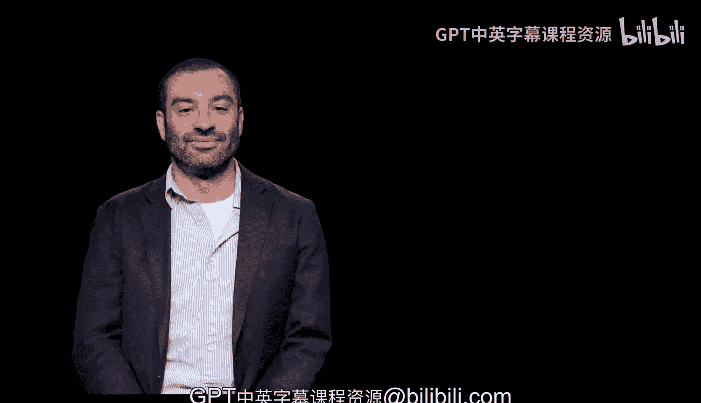

## 数据结构 📊

上一节我们介绍了编程语言中的共通性，本节中我们来看看第一个核心概念：数据结构。

数据结构是存储相关数据集合的方式。例如，一个有序的项目列表或序列。

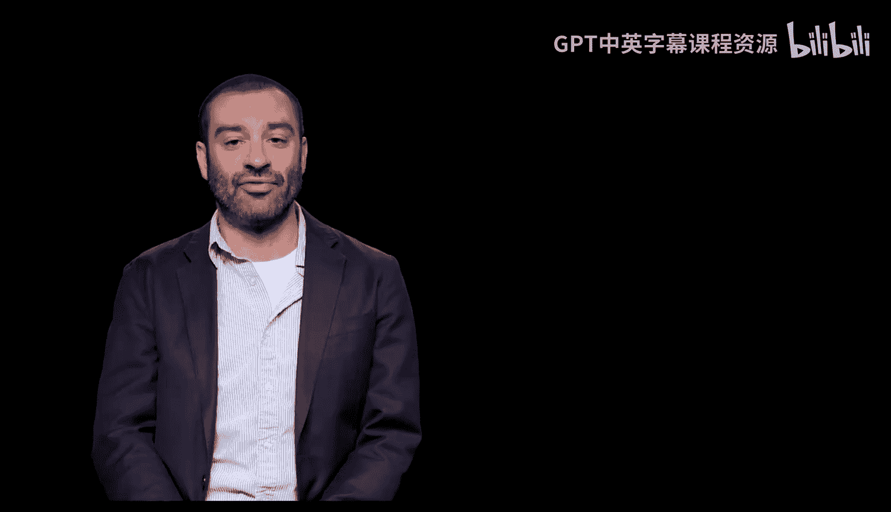

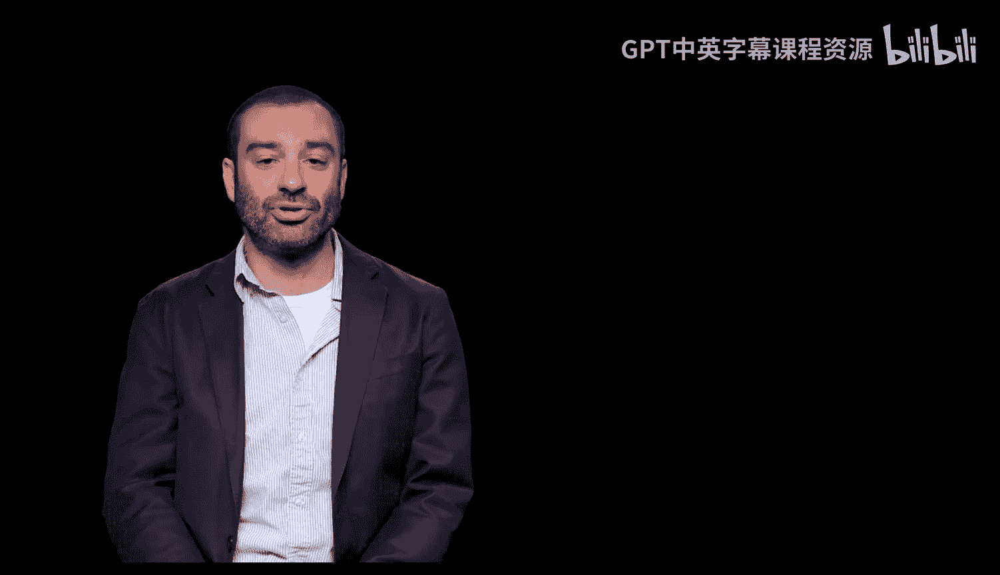

在代码中，一个简单的列表可以这样表示：
```python
my_list = [1, 2, 3, 4, 5]
```

## 流程控制 🔄

了解了如何存储数据后，我们来看看如何控制程序的执行流程。

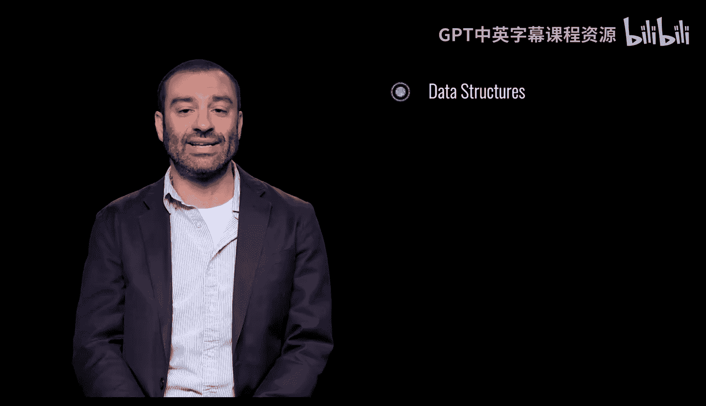

流程控制是控制和改变程序流程的方式。这包括条件语句，它允许我们根据逻辑条件做出决策并执行相应的代码。

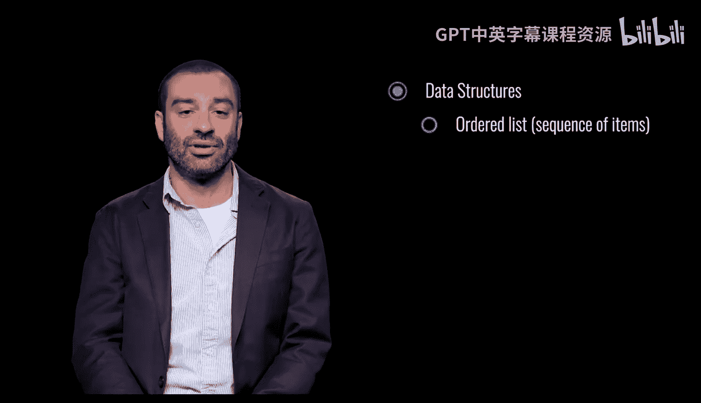

一个典型的条件语句结构如下：
```python
if condition:
    # 执行某些操作
else:
    # 执行其他操作
```

## 循环 🔁

除了条件分支，另一种控制流程的重要方式是循环。

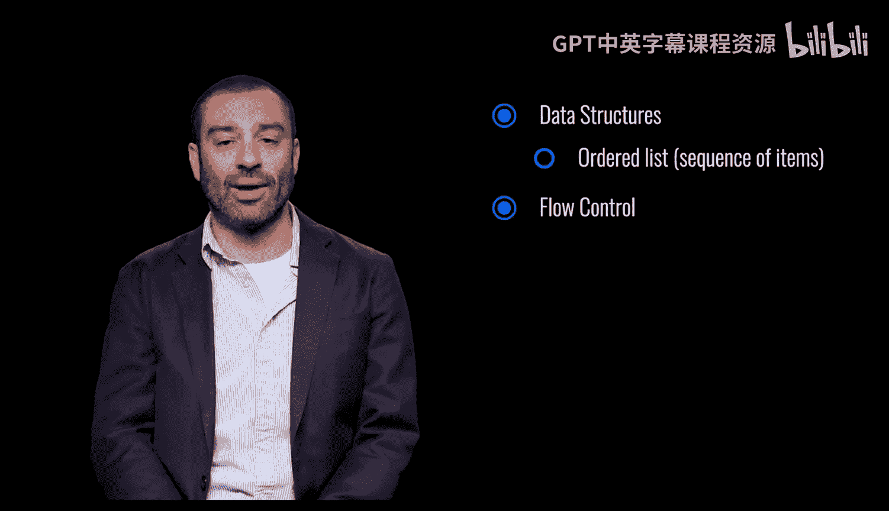

循环允许我们重复执行代码或多次执行某个操作。

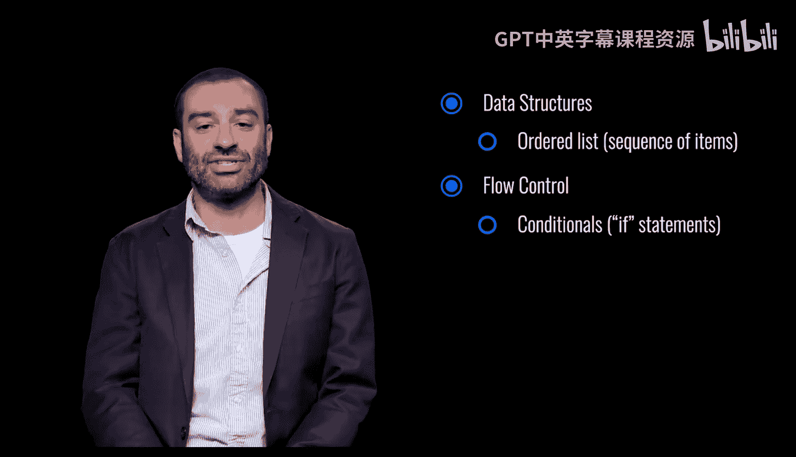

以下是循环的一个基本示例：
```python
for item in my_list:
    print(item)
```

## 变量 📦

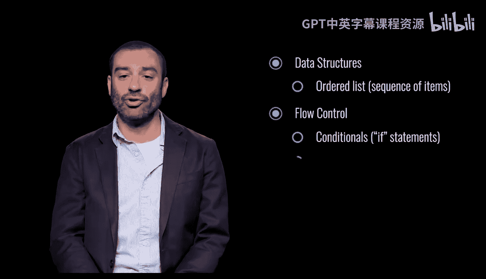

现在，我们来看看程序中用于存储和引用信息的基本单元：变量。

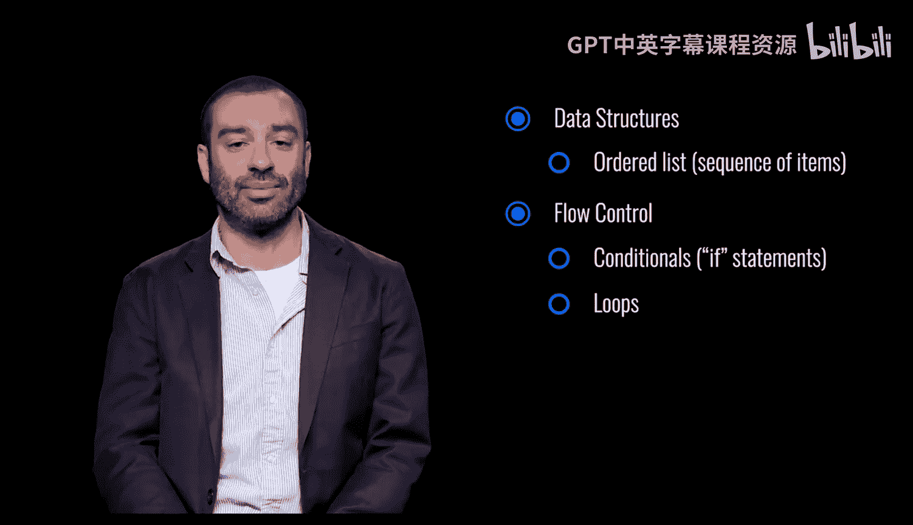

变量是值或信息片段的符号名称或引用。

你可以使用变量来存储各种数据。例如：
```python
name = “Alice”
age = 25
```

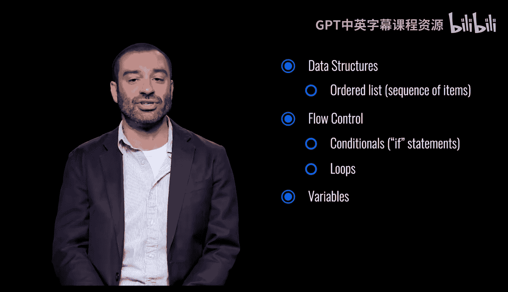

## 函数 ⚙️

最后，我们来认识一下函数，它是组织程序逻辑的关键。

函数是组织好、可重复使用的代码块，用于执行一个单一的相关操作。

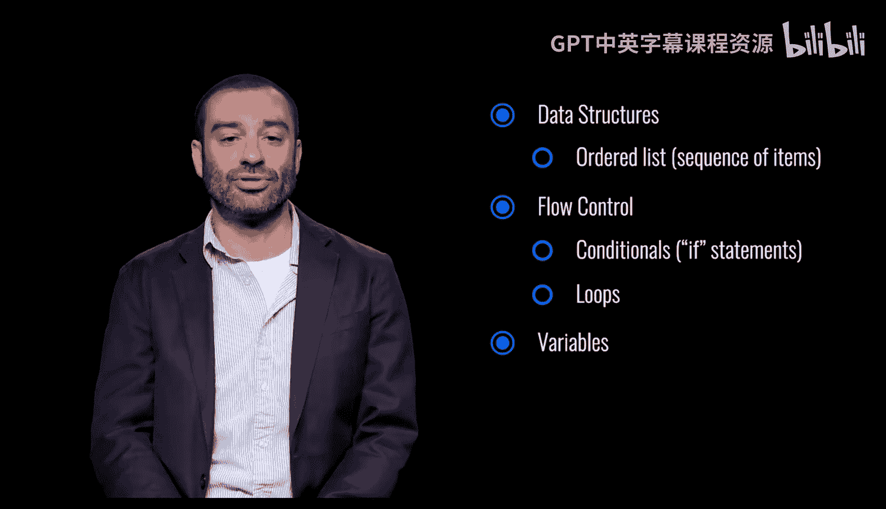

定义一个简单函数的代码如下：
```python
def greet(name):
    return f“Hello, {name}!”
```

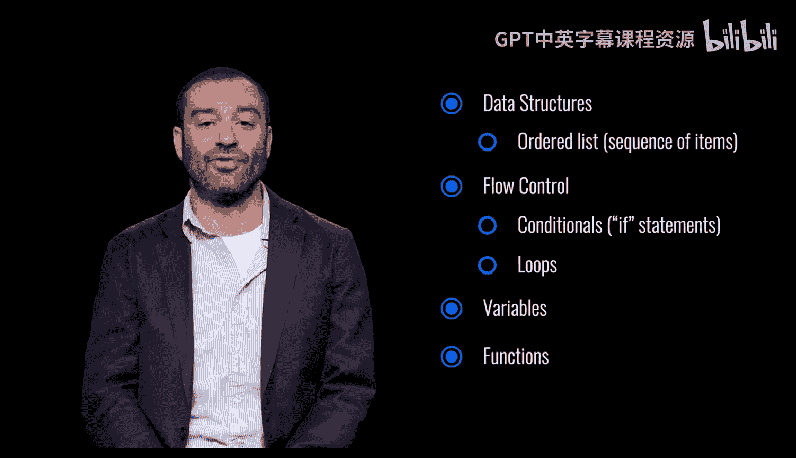

---

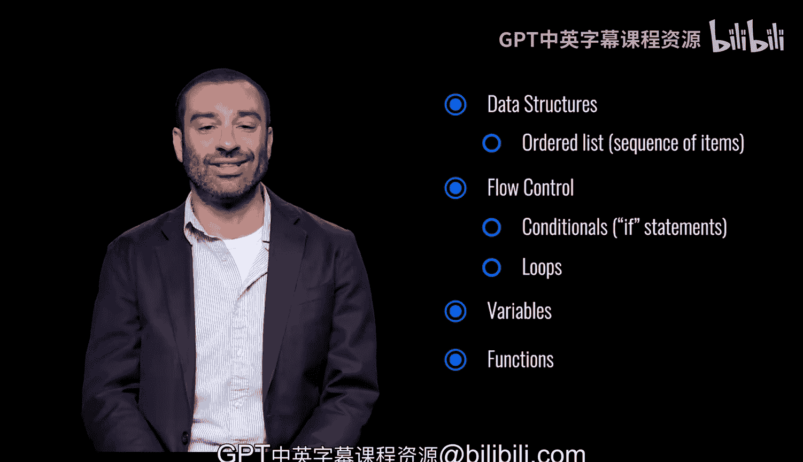

本节课中我们一起学习了编程中的几个核心概念：**数据结构**用于组织数据，**流程控制**（包括条件语句和循环）用于决定程序的执行路径，**变量**用于存储和引用信息，以及**函数**用于封装可重用的代码块。掌握这些概念是学习任何编程语言的第一步。