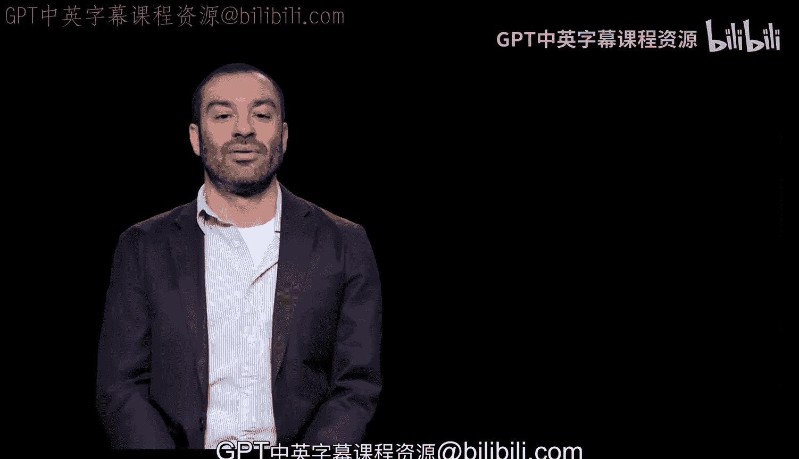
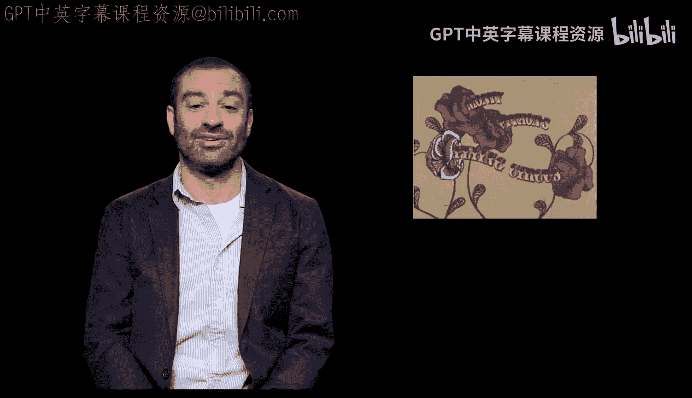

# 008：什么是Python

在本节课中，我们将要学习Python编程语言的基本概念，包括它的起源、特点以及它为何如此受欢迎。

## 概述



Python是一种广泛使用的高级编程语言。它以简洁的语法和强大的功能而闻名，非常适合初学者入门，同时也被专业开发者用于各种复杂的项目。

## Python的命名起源

Python的命名灵感来源于一部名为《蒙提·派森的飞行马戏团》的电视节目。虽然这部喜剧节目本身与编程无关，但其名字为这门语言带来了一个独特而有趣的标识。

## Python作为高级编程语言



上一节我们了解了Python的命名，本节中我们来看看它的核心特性之一：它是一种高级编程语言。

高级编程语言意味着它在程序员和计算机硬件之间提供了一层抽象。它封装了与计算机底层（如内存管理、硬件操作）通信的复杂细节，使得程序员能够使用更接近人类语言的指令来编写程序。

因此，Python代码通常更直观、更易于阅读和理解。例如，打印“Hello World”的代码非常简单：
```python
print("Hello World")
```

## Python作为面向对象语言

理解了Python的高级特性后，我们接下来探讨它的另一个重要范式：面向对象编程。

Python是一种面向对象的编程语言。这意味着它的设计核心是围绕“对象”而非“动作”来组织代码。对象是数据和相关操作的封装体。以下是定义一个简单“汽车”类的示例：
```python
class Car:
    def __init__(self, brand):
        self.brand = brand

    def honk(self):
        print(f"The {self.brand} car says: Beep Beep!")

my_car = Car("Toyota")
my_car.honk()
```
这种范式有助于构建模块化、可重用和易于维护的大型程序。

## Python的主要特点

基于以上概念，以下是Python语言的一些关键特点，这些特点共同造就了它的流行：

*   **语法简洁清晰**：Python使用缩进来定义代码块，强制要求代码格式整洁，这大大增强了可读性。
*   **解释型语言**：Python代码由解释器逐行执行，无需像C或Java那样先进行编译。这使得开发和调试过程更快速。
*   **强大的标准库和丰富的第三方库**：Python自带功能丰富的标准库，并且拥有一个庞大的第三方库生态系统（如NumPy用于科学计算，Django用于Web开发），几乎可以应用于任何领域。
*   **跨平台**：Python可以在Windows、macOS、Linux等多种操作系统上运行。
*   **社区活跃**：Python拥有一个庞大且活跃的开发者社区，这意味着初学者可以轻松找到大量的学习资源、教程和问题解答。

## 总结

本节课中我们一起学习了Python编程语言的基础。我们了解了它有趣的命名起源，认识了它作为**高级编程语言**和**面向对象语言**的核心特性，并列举了其语法简洁、解释执行、库资源丰富等主要优点。这些特性使得Python成为一门既强大又友好的编程语言，是开始编程之旅的绝佳选择。