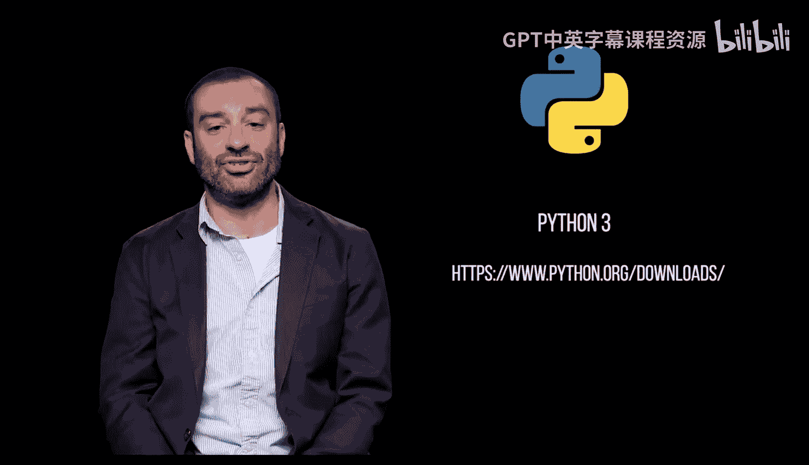

Python编程入门：1.1：下载与安装Python 🐍

在本节课中，我们将学习如何下载和安装Python编程语言，这是本课程将使用的主要工具。

我们将在本课程中使用 **Python 3**。如果你已经安装了 **Python 2**，请升级到 **Python 3**。

上一节我们明确了所需的Python版本，本节中我们来看看具体的下载与安装步骤。

要下载并安装Python，请访问Python官方网站并下载最新版本。此下载和安装包捆绑了 **IDLE**，即Python的集成开发与学习环境。

它包含一个交互式Python解释器和一个脚本编辑器。我们最终将使用IDLE来编写和运行Python脚本。

以下是下载和安装的核心步骤列表：
1.  访问Python官方网站。
2.  下载适用于你操作系统的最新Python 3版本安装程序。
3.  运行安装程序，并在安装过程中勾选“Add Python to PATH”选项。
4.  完成安装后，你可以在开始菜单或应用程序中找到IDLE。

本节课中我们一起学习了如何下载和安装Python 3，并了解了其自带的集成开发环境IDLE。这是开始编写Python程序的第一步。