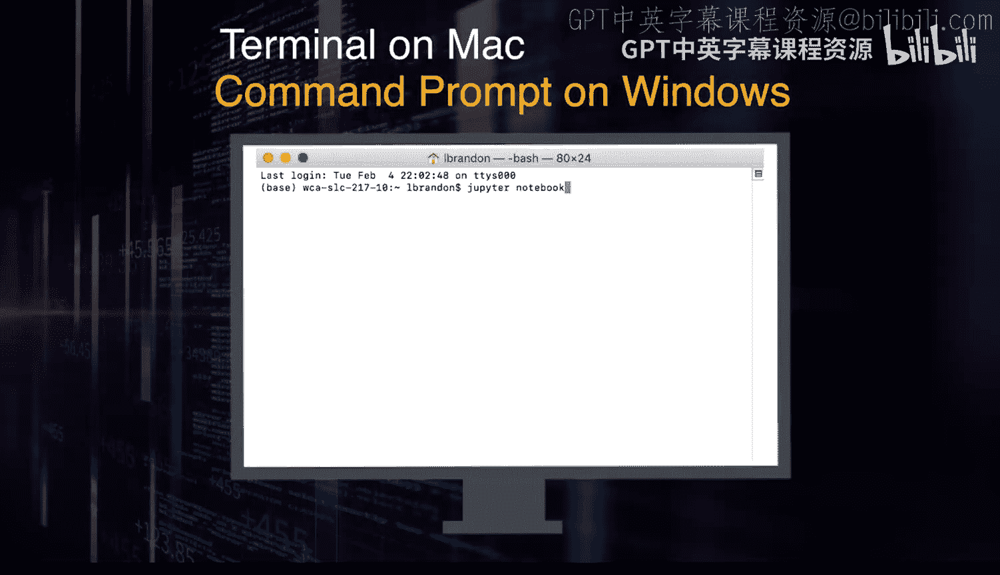

Python与Java编程入门：1-2：下载与安装Jupyter Notebook

在本节课中，我们将学习如何设置Jupyter Notebook，这是一个用于编写和运行Python代码的便捷工具。

Jupyter Notebook是一个基于浏览器的应用程序，它集成了交互式Python解释器和脚本编辑器，允许你以“笔记本”的形式组织代码、文本和可视化结果。

为了开始使用Jupyter Notebook，我们需要先安装它。一个简单的方法是下载并安装Anaconda，这是一个集成了Python和众多科学计算库的数据科学平台。Anaconda会一次性安装好Python和Jupyter Notebook。

以下是安装步骤：
1.  访问Anaconda官方网站，下载适用于你操作系统（Windows、macOS或Linux）的安装程序。
2.  运行下载的安装程序，并按照提示完成安装过程。

安装完成后，有多种方式可以启动Jupyter Notebook。

第一种方法是通过命令行启动。在macOS上打开“终端”（Terminal），或在Windows上打开“命令提示符”（Command Prompt），然后输入命令 `jupyter notebook` 并按下回车键。

第二种方法是通过图形界面启动。你可以打开Anaconda Navigator（一个随Anaconda安装的应用程序），在其中找到Jupyter Notebook的图标并点击启动。

无论使用哪种方式启动，你的默认网页浏览器都会自动打开，显示Jupyter Notebook的文件浏览器界面，从这里你就可以创建新的笔记本或打开已有的项目了。

本节课中，我们一起学习了Jupyter Notebook的基本概念，并通过安装Anaconda一次性获取了Python和Jupyter Notebook环境。我们还介绍了通过命令行和Anaconda Navigator两种启动Jupyter Notebook的方法。现在，你的编程环境已经准备就绪。